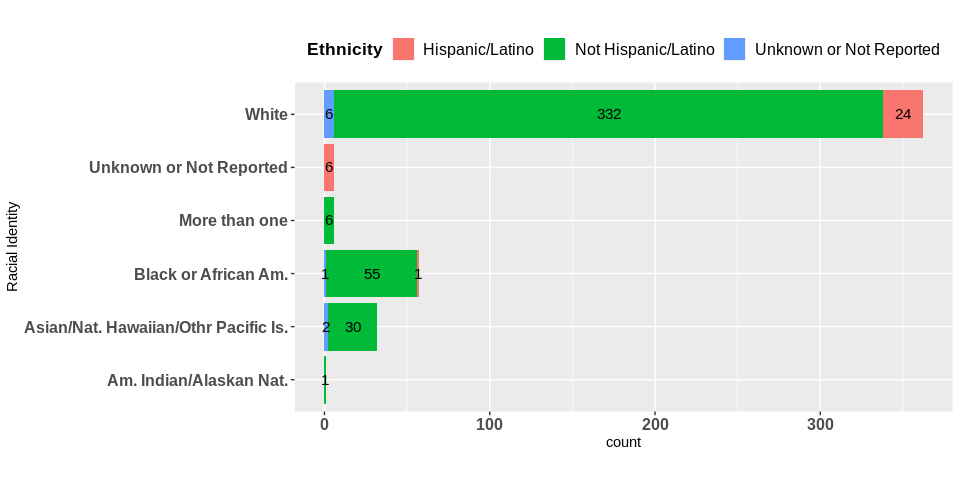
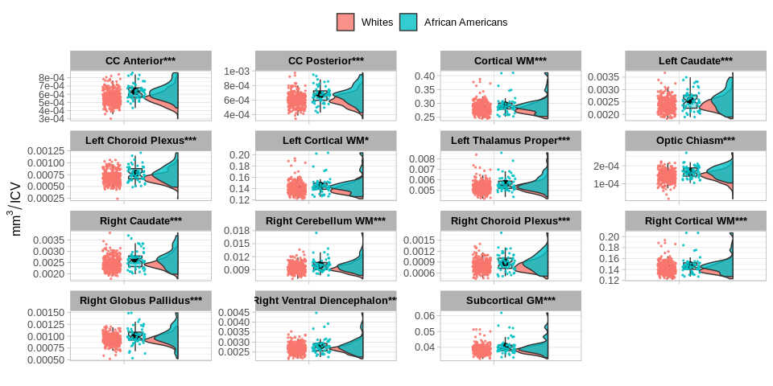
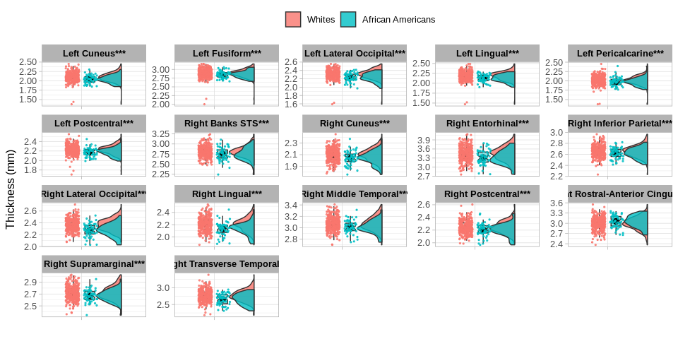
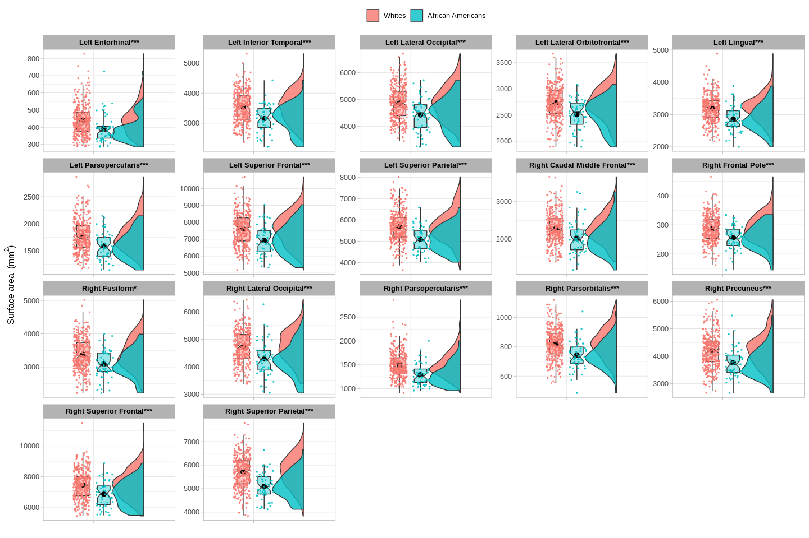
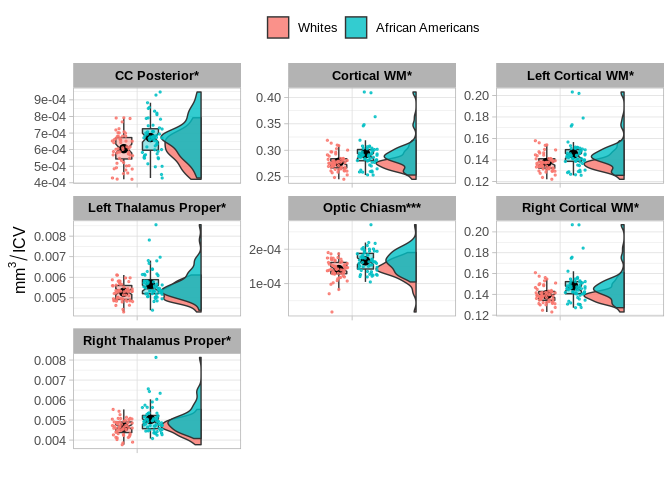
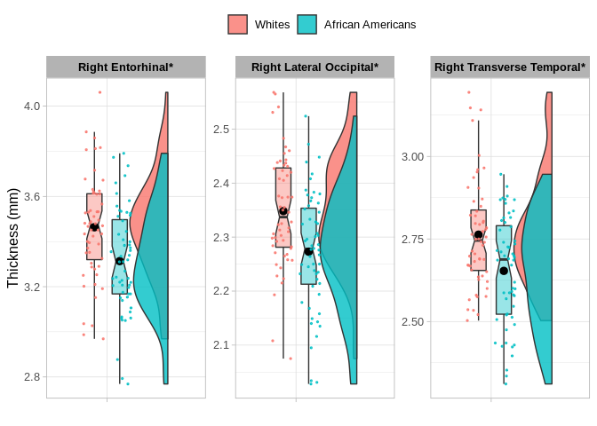

HCP\_racial\_identity\_analysis\_rev
================
daniel atilano
30/4/2022

# 1\. Exclusion criteria

#### Exclusion variables from HCP restricted database that include Tier 1 and Tier 2 variables. Variables description can be consulted at <https://wiki.humanconnectome.org/display/PublicData/HCP-YA+Data+Dictionary-+Updated+for+the+1200+Subject+Release>

#### The database download date was 03/17/2021

### Exclusion criteria for the HCP-1200 restricted database:

``` 
    1. Hypothyroidism (Exclusion of Afirmative Responses: YES = 1).
    2. Hyperthyroidism (Exclusion of Afirmative Responses: YES = 1).
    3. Using birth control pills, progesterone, or fertility drugs (Exclusion of Afirmative Responses: YES = 1).
    4. Menstrual Regular cycles (Exclusion of Negative Responses: NO = 0 ).
```

### Achenbach Adult Self Report

``` 
    5. ASR DSM-Depresive problems (Exclusion of T Scores > 65)
    6. ASR DSM-Anxiety problems (Exclusion of T Scores > 65)
    7. ASR DSM-Somatic problems (Exclusion of T Scores > 65)
    8. ASR DSM- Avoidant personality problems (Exclusion of T Scores > 65)
    9. ASR DSM Attention deficit and hyperactivity problems (Exclusion of T Scores > 65)
    10. ASR DSM Antisocial personality problems (Exclusion of T Scores > 65)
```

### SSAGA

``` 
    11. Presence of panic disorders at some time in life (Exclusion of responses:1=Yes)
    12. Presence of agoraphobia disorder at some point in life (Exclusion of responses:5=Yes)
```

### Drug Consumption

``` 
    13. Alcohol consumption above 0.05 using breath analyzer (Exclusion of responses = TRUE).
    14. Alcohol consumption above 0.08 using a breath analyzer (Exclusion of responses = TRUE).
    15. Cocaine consumption (Exclusion of responses = TRUE).
    16. THC consumption (Exclusion of responses = TRUE)
    17. Opioids consumption (Exclusion of responses = TRUE).
    18. Amphetamine consumption (Exclusion of responses = TRUE).
    19. Methamphetamine consumption (Exclusion of responses = TRUE).
    20. Oxycontin consumption (Exclusion of responses = TRUE).
    21. SSAGA DSM-IV Alcohol abuse at some point in life (Exclusion of responses: 5=YES).
    22. Fagerstrom Test nicotine dependence (Exclusion of Scores >= 6)
    23. Acquired Freesurfer measures 
    24. Subjects with brain structural abnormalities (coded A-B) found in the HCP Quality Control process.  
    
```

For more information related to brain structural abnormalities, see the
<a href=\https://wiki.humanconnectome.org/x/14dMBQ\">QC Issues wiki</a>:
A= Focal anatomical anomaly (e.g. calcification, cavernoma, cyst, etc.)
found in T1w and/or T2w scans in a restricted brain region; B= Focal
segmentation or surface error(s) in outputs from the HCP Structural
pipeline

# 2\. Filtering process

#### Variable description:

##### data\_connectome\_complete = restricted HCP-1200\_database downloaded from <https://db.humanconnectome.org/>

##### data\_connectome\_filtered = filtered database according to the exlusion criteria mention above

``` r
data_connectome_filtered <- data_connectome_complete %>%  dplyr::filter(
    is.na(Hypothyroidism)|Hypothyroidism!=1,
    is.na(Hyperthyroidism)|Hyperthyroidism!=1,
    is.na(OtherEndocrn_Prob)|OtherEndocrn_Prob!=1,
    is.na(Menstrual_UsingBirthControl)|Menstrual_UsingBirthControl !=1,
    is.na(Menstrual_RegCycles)|Menstrual_RegCycles !=0,
    is.na(DSM_Depr_T)|DSM_Depr_T<=69,
    is.na(DSM_Anxi_T)|DSM_Anxi_T<=69,
    is.na(DSM_Somp_T)|DSM_Somp_T<=69,
    is.na(DSM_Avoid_T)|DSM_Avoid_T<=69,
    is.na(DSM_Adh_T)|DSM_Adh_T<=69,
    is.na(DSM_Antis_T)|DSM_Antis_T<=69,
    is.na(SSAGA_PanicDisorder)|SSAGA_PanicDisorder !=1,
    is.na(SSAGA_Agoraphobia)|SSAGA_Agoraphobia !=5,
    is.na(Breathalyzer_Over_05)|Breathalyzer_Over_05 == "FALSE",
    is.na(Breathalyzer_Over_08)|Breathalyzer_Over_08 == "FALSE",
    is.na(Cocaine)|Cocaine == "FALSE",
    is.na(THC)|THC == "FALSE",
    is.na(Opiates)|Opiates == "FALSE",
    is.na(Amphetamines)|Amphetamines == "FALSE",
    is.na(MethAmphetamine)|MethAmphetamine == "FALSE",
    is.na(Oxycontin)|Oxycontin == "FALSE",
    is.na(SSAGA_Alc_D4_Ab_Dx)|SSAGA_Alc_D4_Ab_Dx == 1,
    is.na(SSAGA_FTND_Score)|SSAGA_FTND_Score < 6,
    FS_IntraCranial_Vol >0,
    is.na(QC_Issue)|QC_Issue %in% c("C", "C D", "C D E")
    )
```

## Racial and ethnic identity frecuencies



#### Ethnic identity discarded from filtered database due to under sampling and the selection of White and Black or African Americans racial identities\` due to the most representative groups.

``` 
 data_connectome_filtered_racial_identity <- data_connectome_filtered %>%  filter(Racial_identity %in% c("Black or African Am.", "White"),Ethnicity %in% c("Not Hispanic/Latino", "Unknown or Not Reported")) 
```

#### Factorized GENDER, RACIAL IDENTITY, and ECONOMIC INCOME variables

    ##SSAGA_income = Total household income: <$10,000 = 1,10K-19,999 = 2, 20K-29,999 = 3,30K-39,999 = 4, 40K-49,999 = 5, 50K-74,999 = 6, 75K-99,999 = 7, >=100,000 = 8
    
    data_connectome_filtered_racial_identity$Racial_identity <- factor(data_connectome_filtered_race_factor$Racial_identity, levels = c("White","Black or African Am."),labels = c("0","1"))
    
    data_connectome_filtered_racial_identity$Gender <-factor(data_connectome_filtered_race_factor$Gender, levels = c("M","F"),labels = c("0","1"))
    
    data_connectome_filtered_racial_identityr$Gender <-factor(data_connectome_filtered_race_factor$Gender, levels = c("0","1"),labels = c("M","F"))
    
    data_connectome_filtered_racial_identity$Racial_identity <- factor(data_connectome_filtered_race_factor$Racial_identity, levels = c("0","1"),labels = c("White","Black or African Am."))
    
    data_connectome_filtered_racial_identity$SSAGA_Income <- factor(data_connectome_filtered_race_factor$SSAGA_Income, levels = c("1","2","3","4","5","6","7","8"),labels = c("<$10000","10K-19999","20K-29999","30K-39999","40K-49999", "50K-74999","75K-99999", ">=100000"))

#### Descriptives for filtered sample

    ## There was an error in 'add_p()/add_difference()' for variable 'SSAGA_Income', p-value omitted:
    ## Error in stats::fisher.test(structure(c(4L, 7L, 3L, 7L, 6L, 3L, 3L, 7L, : FEXACT error 7(location). LDSTP=18600 is too small for this problem,
    ##   (pastp=46.6049, ipn_0:=ipoin[itp=7]=2845, stp[ipn_0]=39.9607).
    ## Increase workspace or consider using 'simulate.p.value=TRUE'

<!--html_preserve-->

<div id="cpoawzzsul" style="overflow-x:auto;overflow-y:auto;width:auto;height:auto;">

<style>html {
  font-family: -apple-system, BlinkMacSystemFont, 'Segoe UI', Roboto, Oxygen, Ubuntu, Cantarell, 'Helvetica Neue', 'Fira Sans', 'Droid Sans', Arial, sans-serif;
}

#cpoawzzsul .gt_table {
  display: table;
  border-collapse: collapse;
  margin-left: auto;
  margin-right: auto;
  color: #333333;
  font-size: 16px;
  font-weight: normal;
  font-style: normal;
  background-color: #FFFFFF;
  width: auto;
  border-top-style: solid;
  border-top-width: 2px;
  border-top-color: #A8A8A8;
  border-right-style: none;
  border-right-width: 2px;
  border-right-color: #D3D3D3;
  border-bottom-style: solid;
  border-bottom-width: 2px;
  border-bottom-color: #A8A8A8;
  border-left-style: none;
  border-left-width: 2px;
  border-left-color: #D3D3D3;
}

#cpoawzzsul .gt_heading {
  background-color: #FFFFFF;
  text-align: left;
  border-bottom-color: #FFFFFF;
  border-left-style: none;
  border-left-width: 1px;
  border-left-color: #D3D3D3;
  border-right-style: none;
  border-right-width: 1px;
  border-right-color: #D3D3D3;
}

#cpoawzzsul .gt_title {
  color: #333333;
  font-size: 125%;
  font-weight: initial;
  padding-top: 4px;
  padding-bottom: 4px;
  border-bottom-color: #FFFFFF;
  border-bottom-width: 0;
}

#cpoawzzsul .gt_subtitle {
  color: #333333;
  font-size: 85%;
  font-weight: initial;
  padding-top: 0;
  padding-bottom: 4px;
  border-top-color: #FFFFFF;
  border-top-width: 0;
}

#cpoawzzsul .gt_bottom_border {
  border-bottom-style: solid;
  border-bottom-width: 2px;
  border-bottom-color: #D3D3D3;
}

#cpoawzzsul .gt_col_headings {
  border-top-style: solid;
  border-top-width: 2px;
  border-top-color: #D3D3D3;
  border-bottom-style: solid;
  border-bottom-width: 2px;
  border-bottom-color: #D3D3D3;
  border-left-style: none;
  border-left-width: 1px;
  border-left-color: #D3D3D3;
  border-right-style: none;
  border-right-width: 1px;
  border-right-color: #D3D3D3;
}

#cpoawzzsul .gt_col_heading {
  color: #333333;
  background-color: #FFFFFF;
  font-size: 100%;
  font-weight: normal;
  text-transform: inherit;
  border-left-style: none;
  border-left-width: 1px;
  border-left-color: #D3D3D3;
  border-right-style: none;
  border-right-width: 1px;
  border-right-color: #D3D3D3;
  vertical-align: bottom;
  padding-top: 5px;
  padding-bottom: 6px;
  padding-left: 5px;
  padding-right: 5px;
  overflow-x: hidden;
}

#cpoawzzsul .gt_column_spanner_outer {
  color: #333333;
  background-color: #FFFFFF;
  font-size: 100%;
  font-weight: normal;
  text-transform: inherit;
  padding-top: 0;
  padding-bottom: 0;
  padding-left: 4px;
  padding-right: 4px;
}

#cpoawzzsul .gt_column_spanner_outer:first-child {
  padding-left: 0;
}

#cpoawzzsul .gt_column_spanner_outer:last-child {
  padding-right: 0;
}

#cpoawzzsul .gt_column_spanner {
  border-bottom-style: solid;
  border-bottom-width: 2px;
  border-bottom-color: #D3D3D3;
  vertical-align: bottom;
  padding-top: 5px;
  padding-bottom: 6px;
  overflow-x: hidden;
  display: inline-block;
  width: 100%;
}

#cpoawzzsul .gt_group_heading {
  padding: 8px;
  color: #333333;
  background-color: #FFFFFF;
  font-size: 100%;
  font-weight: initial;
  text-transform: inherit;
  border-top-style: solid;
  border-top-width: 2px;
  border-top-color: #D3D3D3;
  border-bottom-style: solid;
  border-bottom-width: 2px;
  border-bottom-color: #D3D3D3;
  border-left-style: none;
  border-left-width: 1px;
  border-left-color: #D3D3D3;
  border-right-style: none;
  border-right-width: 1px;
  border-right-color: #D3D3D3;
  vertical-align: middle;
}

#cpoawzzsul .gt_empty_group_heading {
  padding: 0.5px;
  color: #333333;
  background-color: #FFFFFF;
  font-size: 100%;
  font-weight: initial;
  border-top-style: solid;
  border-top-width: 2px;
  border-top-color: #D3D3D3;
  border-bottom-style: solid;
  border-bottom-width: 2px;
  border-bottom-color: #D3D3D3;
  vertical-align: middle;
}

#cpoawzzsul .gt_from_md > :first-child {
  margin-top: 0;
}

#cpoawzzsul .gt_from_md > :last-child {
  margin-bottom: 0;
}

#cpoawzzsul .gt_row {
  padding-top: 8px;
  padding-bottom: 8px;
  padding-left: 5px;
  padding-right: 5px;
  margin: 10px;
  border-top-style: solid;
  border-top-width: 1px;
  border-top-color: #D3D3D3;
  border-left-style: none;
  border-left-width: 1px;
  border-left-color: #D3D3D3;
  border-right-style: none;
  border-right-width: 1px;
  border-right-color: #D3D3D3;
  vertical-align: middle;
  overflow-x: hidden;
}

#cpoawzzsul .gt_stub {
  color: #333333;
  background-color: #FFFFFF;
  font-size: 100%;
  font-weight: initial;
  text-transform: inherit;
  border-right-style: solid;
  border-right-width: 2px;
  border-right-color: #D3D3D3;
  padding-left: 12px;
}

#cpoawzzsul .gt_summary_row {
  color: #333333;
  background-color: #FFFFFF;
  text-transform: inherit;
  padding-top: 8px;
  padding-bottom: 8px;
  padding-left: 5px;
  padding-right: 5px;
}

#cpoawzzsul .gt_first_summary_row {
  padding-top: 8px;
  padding-bottom: 8px;
  padding-left: 5px;
  padding-right: 5px;
  border-top-style: solid;
  border-top-width: 2px;
  border-top-color: #D3D3D3;
}

#cpoawzzsul .gt_grand_summary_row {
  color: #333333;
  background-color: #FFFFFF;
  text-transform: inherit;
  padding-top: 8px;
  padding-bottom: 8px;
  padding-left: 5px;
  padding-right: 5px;
}

#cpoawzzsul .gt_first_grand_summary_row {
  padding-top: 8px;
  padding-bottom: 8px;
  padding-left: 5px;
  padding-right: 5px;
  border-top-style: double;
  border-top-width: 6px;
  border-top-color: #D3D3D3;
}

#cpoawzzsul .gt_striped {
  background-color: rgba(128, 128, 128, 0.05);
}

#cpoawzzsul .gt_table_body {
  border-top-style: solid;
  border-top-width: 2px;
  border-top-color: #D3D3D3;
  border-bottom-style: solid;
  border-bottom-width: 2px;
  border-bottom-color: #D3D3D3;
}

#cpoawzzsul .gt_footnotes {
  color: #333333;
  background-color: #FFFFFF;
  border-bottom-style: none;
  border-bottom-width: 2px;
  border-bottom-color: #D3D3D3;
  border-left-style: none;
  border-left-width: 2px;
  border-left-color: #D3D3D3;
  border-right-style: none;
  border-right-width: 2px;
  border-right-color: #D3D3D3;
}

#cpoawzzsul .gt_footnote {
  margin: 0px;
  font-size: 90%;
  padding: 4px;
}

#cpoawzzsul .gt_sourcenotes {
  color: #333333;
  background-color: #FFFFFF;
  border-bottom-style: none;
  border-bottom-width: 2px;
  border-bottom-color: #D3D3D3;
  border-left-style: none;
  border-left-width: 2px;
  border-left-color: #D3D3D3;
  border-right-style: none;
  border-right-width: 2px;
  border-right-color: #D3D3D3;
}

#cpoawzzsul .gt_sourcenote {
  font-size: 90%;
  padding: 4px;
}

#cpoawzzsul .gt_left {
  text-align: left;
}

#cpoawzzsul .gt_center {
  text-align: center;
}

#cpoawzzsul .gt_right {
  text-align: right;
  font-variant-numeric: tabular-nums;
}

#cpoawzzsul .gt_font_normal {
  font-weight: normal;
}

#cpoawzzsul .gt_font_bold {
  font-weight: bold;
}

#cpoawzzsul .gt_font_italic {
  font-style: italic;
}

#cpoawzzsul .gt_super {
  font-size: 65%;
}

#cpoawzzsul .gt_footnote_marks {
  font-style: italic;
  font-weight: normal;
  font-size: 65%;
}
</style>

<table class="gt_table">

<!--/html_preserve-->

<caption>

<strong>Table 1. Descriptives for racial
identity</strong>

</caption>

<!--html_preserve-->

<thead class="gt_col_headings">

<tr>

<th class="gt_col_heading gt_columns_bottom_border gt_left" rowspan="2" colspan="1">

</th>

<th class="gt_col_heading gt_columns_bottom_border gt_center" rowspan="2" colspan="1">

<strong>N</strong>

</th>

<th class="gt_center gt_columns_top_border gt_column_spanner_outer" rowspan="1" colspan="2">

<span class="gt_column_spanner"><strong>Racial
Identity</strong></span>

</th>

<th class="gt_col_heading gt_columns_bottom_border gt_center" rowspan="2" colspan="1">

<strong>p-value</strong><sup class="gt_footnote_marks">2</sup>

</th>

</tr>

<tr>

<th class="gt_col_heading gt_columns_bottom_border gt_center" rowspan="1" colspan="1">

<strong>White</strong>, N =
338<sup class="gt_footnote_marks">1</sup>

</th>

<th class="gt_col_heading gt_columns_bottom_border gt_center" rowspan="1" colspan="1">

<strong>Black or African Am.</strong>, N =
56<sup class="gt_footnote_marks">1</sup>

</th>

</tr>

</thead>

<tbody class="gt_table_body">

<tr>

<td class="gt_row gt_left" style="font-weight: bold;">

Age (y)

</td>

<td class="gt_row gt_center">

394

</td>

<td class="gt_row gt_center">

29.12 (3.60)

</td>

<td class="gt_row gt_center">

29.25 (3.62)

</td>

<td class="gt_row gt_center">

0.801

</td>

</tr>

<tr>

<td class="gt_row gt_left" style="font-weight: bold;">

Sex

</td>

<td class="gt_row gt_center">

394

</td>

<td class="gt_row gt_center">

</td>

<td class="gt_row gt_center">

</td>

<td class="gt_row gt_center">

0.035

</td>

</tr>

<tr>

<td class="gt_row gt_left" style="text-align: left; text-indent: 10px;">

M

</td>

<td class="gt_row gt_center">

</td>

<td class="gt_row gt_center">

190 (56%)

</td>

<td class="gt_row gt_center">

23 (41%)

</td>

<td class="gt_row gt_center">

</td>

</tr>

<tr>

<td class="gt_row gt_left" style="text-align: left; text-indent: 10px;">

F

</td>

<td class="gt_row gt_center">

</td>

<td class="gt_row gt_center">

148 (44%)

</td>

<td class="gt_row gt_center">

33 (59%)

</td>

<td class="gt_row gt_center">

</td>

</tr>

<tr>

<td class="gt_row gt_left" style="font-weight: bold;">

Education(y)

</td>

<td class="gt_row gt_center">

392

</td>

<td class="gt_row gt_center">

15.15 (1.69)

</td>

<td class="gt_row gt_center">

14.41 (1.90)

</td>

<td class="gt_row gt_center">

0.007

</td>

</tr>

<tr>

<td class="gt_row gt_left" style="text-align: left; text-indent: 10px;">

Unknown

</td>

<td class="gt_row gt_center">

</td>

<td class="gt_row gt_center">

2

</td>

<td class="gt_row gt_center">

0

</td>

<td class="gt_row gt_center">

</td>

</tr>

<tr>

<td class="gt_row gt_left" style="font-weight: bold;">

Economic Income

</td>

<td class="gt_row gt_center">

391

</td>

<td class="gt_row gt_center">

</td>

<td class="gt_row gt_center">

</td>

<td class="gt_row gt_center">

</td>

</tr>

<tr>

<td class="gt_row gt_left" style="text-align: left; text-indent: 10px;">

\<$10000

</td>

<td class="gt_row gt_center">

</td>

<td class="gt_row gt_center">

12 (3.6%)

</td>

<td class="gt_row gt_center">

7 (12%)

</td>

<td class="gt_row gt_center">

</td>

</tr>

<tr>

<td class="gt_row gt_left" style="text-align: left; text-indent: 10px;">

10K-19999

</td>

<td class="gt_row gt_center">

</td>

<td class="gt_row gt_center">

22 (6.6%)

</td>

<td class="gt_row gt_center">

10 (18%)

</td>

<td class="gt_row gt_center">

</td>

</tr>

<tr>

<td class="gt_row gt_left" style="text-align: left; text-indent: 10px;">

20K-29999

</td>

<td class="gt_row gt_center">

</td>

<td class="gt_row gt_center">

34 (10%)

</td>

<td class="gt_row gt_center">

9 (16%)

</td>

<td class="gt_row gt_center">

</td>

</tr>

<tr>

<td class="gt_row gt_left" style="text-align: left; text-indent: 10px;">

30K-39999

</td>

<td class="gt_row gt_center">

</td>

<td class="gt_row gt_center">

32 (9.6%)

</td>

<td class="gt_row gt_center">

10 (18%)

</td>

<td class="gt_row gt_center">

</td>

</tr>

<tr>

<td class="gt_row gt_left" style="text-align: left; text-indent: 10px;">

40K-49999

</td>

<td class="gt_row gt_center">

</td>

<td class="gt_row gt_center">

39 (12%)

</td>

<td class="gt_row gt_center">

5 (8.9%)

</td>

<td class="gt_row gt_center">

</td>

</tr>

<tr>

<td class="gt_row gt_left" style="text-align: left; text-indent: 10px;">

50K-74999

</td>

<td class="gt_row gt_center">

</td>

<td class="gt_row gt_center">

76 (23%)

</td>

<td class="gt_row gt_center">

8 (14%)

</td>

<td class="gt_row gt_center">

</td>

</tr>

<tr>

<td class="gt_row gt_left" style="text-align: left; text-indent: 10px;">

75K-99999

</td>

<td class="gt_row gt_center">

</td>

<td class="gt_row gt_center">

53 (16%)

</td>

<td class="gt_row gt_center">

1 (1.8%)

</td>

<td class="gt_row gt_center">

</td>

</tr>

<tr>

<td class="gt_row gt_left" style="text-align: left; text-indent: 10px;">

\>=100000

</td>

<td class="gt_row gt_center">

</td>

<td class="gt_row gt_center">

67 (20%)

</td>

<td class="gt_row gt_center">

6 (11%)

</td>

<td class="gt_row gt_center">

</td>

</tr>

<tr>

<td class="gt_row gt_left" style="text-align: left; text-indent: 10px;">

Unknown

</td>

<td class="gt_row gt_center">

</td>

<td class="gt_row gt_center">

3

</td>

<td class="gt_row gt_center">

0

</td>

<td class="gt_row gt_center">

</td>

</tr>

</tbody>

<tfoot>

<tr class="gt_footnotes">

<td colspan="5">

<p class="gt_footnote">

<sup class="gt_footnote_marks"> <em>1</em> </sup>

Mean (SD); n (%) <br />

</p>

<p class="gt_footnote">

<sup class="gt_footnote_marks"> <em>2</em> </sup>

Welch Two Sample t-test; Pearson’s Chi-squared test
<br />

</p>

</td>

</tr>

</tfoot>

</table>

</div>

<!--/html_preserve-->

# 2\. Brain volume ANCOVA permutational analysis

#### Brain volumetry is corrected by intracraneal volume values taken from FreeSurfer Summery statistics.

volumetry\_data\_connectome\_filtered \<-
data\_connectome\_filtered\_racial\_identity %\>% select(c(\#\# Colums
numbers of volumetric measures))

# FS\_IntraCranial\_Vol = Free Surfer intracraneal volume measures

volumetry\_data\_connectome\_filtered\_normalized\_icv \<-
volumetry\_data\_connectome\_filtered %\>% lapply(function(x)
x/volumetry\_data\_connectome\_filtered$FS\_IntraCranial\_Vol) %\>%
as.data.frame() %\>% select(-1)

# Filtered database binding with normalized brain volumetric data

data\_connectome\_filtered\_with\_volumetry\_normalized\_icv \<-
cbind(data\_connectome\_filtered\_racial\_identity,volumetry\_data\_connectome\_filtered\_normalized\_icv)

#### Brain volumetry descriptives

``` r
permutational_ancova_volumetry_corrected_intracraneal %>% na.omit() %>% select(c(2,6:17,24:62)) %>% 
   dplyr::rename(
    "Brain Seg"= BrainSeg_Vol,                         
    "Brain Seg No Vent" = BrainSeg_Vol_No_Vent,                  
    "Brain Seg No Vent Surf" = BrainSeg_Vol_No_Vent_Surf,
    "Left Cortical GM" = LCort_GM_Vol,                         
    "Right Cortical GM" =RCort_GM_Vol,
    "Cortical GM" = TotCort_GM_Vol, 
    "Subcortical GM" = SubCort_GM_Vol,
    "Total GM" = Total_GM_Vol,
    "SupraTentorial" = SupraTentorial_Vol,
    "Left WM" = L_WM_Vol,
    "Right WM" = R_WM_Vol,
    "Total WM" = Tot_WM_Vol,
    "Left Lat Ventricle" = LatVent_Vol,
    "Left Inf Lat Ventricle" = L_InfLatVent_Vol,
    "Left Cerebellum WM" = L_Cerebellum_WM_Vol,
    "Left Cerebellum Cortex" = L_Cerebellum_Cort_Vol,
    "Left Thalamus Proper" = L_ThalamusProper_Vol,
    "Left Caudate" = L_Caudate_Vol,
    "Left Putamen" = L_Putamen_Vol,
    "Left Pallidum" = L_Pallidum_Vol,
    "3rd Ventricle" = `3rdVent_Vol`,
    "4th Ventricle" = `4thVent_Vol`,
    "Brain Stem" = BrainStem_Vol,
    "Left Hippocampus" = L_Hippo_Vol,
    "Left Amygdala"= L_Amygdala_Vol,
    "CSF" = CSF_Vol,
    "Left Accumbens Area" = L_AccumbensArea_Vol,
    "Left Vent Diencephalon" = L_VentDC_Vol,
    "Left Vessel" = L_Vessel_Vol,
    "Left Choroid Plexus" = L_ChoroidPlexus_Vol,
    "Right Lat Ventricle"= R_LatVent_Vol,
    "Right Inf Lat Ventricle"= R_InfLatVent_Vol,
    "Right Cerebellum WM"=R_Cerebellum_WM_Vol,
    "Right Cerebellum Cortex" = R_Cerebellum_Cort_Vol,
    "Right Thalamus Proper" = R_ThalamusProper_Vol,
    "Right Caudate" = R_Caudate_Vol,
    "Right Putamen" = R_Putamen_Vol,
    "Right Pallidum" = R_Pallidum_Vol,
    "Right Hippocampus" = R_Hippo_Vol,
    "Right Amygdala"= R_Amygdala_Vol,
    "Right Accumbens Area" = R_AccumbensArea_Vol,
    "Right Vent Diencephalon"= R_VentDC_Vol,
    "Right Vessel" = R_Vessel_Vol,
    "Right Choroid Plexus"= R_ChoroidPlexus_Vol,
    "5th Ventricle" = `5thVent_Vol`,
    "Optic Chiasm" = OpticChiasm_Vol,
    "CC Posterior"= CC_Posterior_Vol,
    "CC MidPosterior"= CC_MidPosterior_Vol,
    "CC Central" = CC_Central_Vol,
    "CC MidAnterior" = CC_MidAnterior_Vol,
    "CC Anterior" = CC_Anterior_Vol) %>% tbl_summary(by = Racial_identity, statistic = list(all_continuous() ~ "{mean} ({sd})"), digits = all_continuous() ~ function(x) format(x, format = "e", digits = 4)) %>%
    modify_header(label ~ "**Brain Regions**") %>% as_gt()
```

<!--html_preserve-->

<div id="ihaiozangx" style="overflow-x:auto;overflow-y:auto;width:auto;height:auto;">

<style>html {
  font-family: -apple-system, BlinkMacSystemFont, 'Segoe UI', Roboto, Oxygen, Ubuntu, Cantarell, 'Helvetica Neue', 'Fira Sans', 'Droid Sans', Arial, sans-serif;
}

#ihaiozangx .gt_table {
  display: table;
  border-collapse: collapse;
  margin-left: auto;
  margin-right: auto;
  color: #333333;
  font-size: 16px;
  font-weight: normal;
  font-style: normal;
  background-color: #FFFFFF;
  width: auto;
  border-top-style: solid;
  border-top-width: 2px;
  border-top-color: #A8A8A8;
  border-right-style: none;
  border-right-width: 2px;
  border-right-color: #D3D3D3;
  border-bottom-style: solid;
  border-bottom-width: 2px;
  border-bottom-color: #A8A8A8;
  border-left-style: none;
  border-left-width: 2px;
  border-left-color: #D3D3D3;
}

#ihaiozangx .gt_heading {
  background-color: #FFFFFF;
  text-align: center;
  border-bottom-color: #FFFFFF;
  border-left-style: none;
  border-left-width: 1px;
  border-left-color: #D3D3D3;
  border-right-style: none;
  border-right-width: 1px;
  border-right-color: #D3D3D3;
}

#ihaiozangx .gt_title {
  color: #333333;
  font-size: 125%;
  font-weight: initial;
  padding-top: 4px;
  padding-bottom: 4px;
  border-bottom-color: #FFFFFF;
  border-bottom-width: 0;
}

#ihaiozangx .gt_subtitle {
  color: #333333;
  font-size: 85%;
  font-weight: initial;
  padding-top: 0;
  padding-bottom: 4px;
  border-top-color: #FFFFFF;
  border-top-width: 0;
}

#ihaiozangx .gt_bottom_border {
  border-bottom-style: solid;
  border-bottom-width: 2px;
  border-bottom-color: #D3D3D3;
}

#ihaiozangx .gt_col_headings {
  border-top-style: solid;
  border-top-width: 2px;
  border-top-color: #D3D3D3;
  border-bottom-style: solid;
  border-bottom-width: 2px;
  border-bottom-color: #D3D3D3;
  border-left-style: none;
  border-left-width: 1px;
  border-left-color: #D3D3D3;
  border-right-style: none;
  border-right-width: 1px;
  border-right-color: #D3D3D3;
}

#ihaiozangx .gt_col_heading {
  color: #333333;
  background-color: #FFFFFF;
  font-size: 100%;
  font-weight: normal;
  text-transform: inherit;
  border-left-style: none;
  border-left-width: 1px;
  border-left-color: #D3D3D3;
  border-right-style: none;
  border-right-width: 1px;
  border-right-color: #D3D3D3;
  vertical-align: bottom;
  padding-top: 5px;
  padding-bottom: 6px;
  padding-left: 5px;
  padding-right: 5px;
  overflow-x: hidden;
}

#ihaiozangx .gt_column_spanner_outer {
  color: #333333;
  background-color: #FFFFFF;
  font-size: 100%;
  font-weight: normal;
  text-transform: inherit;
  padding-top: 0;
  padding-bottom: 0;
  padding-left: 4px;
  padding-right: 4px;
}

#ihaiozangx .gt_column_spanner_outer:first-child {
  padding-left: 0;
}

#ihaiozangx .gt_column_spanner_outer:last-child {
  padding-right: 0;
}

#ihaiozangx .gt_column_spanner {
  border-bottom-style: solid;
  border-bottom-width: 2px;
  border-bottom-color: #D3D3D3;
  vertical-align: bottom;
  padding-top: 5px;
  padding-bottom: 6px;
  overflow-x: hidden;
  display: inline-block;
  width: 100%;
}

#ihaiozangx .gt_group_heading {
  padding: 8px;
  color: #333333;
  background-color: #FFFFFF;
  font-size: 100%;
  font-weight: initial;
  text-transform: inherit;
  border-top-style: solid;
  border-top-width: 2px;
  border-top-color: #D3D3D3;
  border-bottom-style: solid;
  border-bottom-width: 2px;
  border-bottom-color: #D3D3D3;
  border-left-style: none;
  border-left-width: 1px;
  border-left-color: #D3D3D3;
  border-right-style: none;
  border-right-width: 1px;
  border-right-color: #D3D3D3;
  vertical-align: middle;
}

#ihaiozangx .gt_empty_group_heading {
  padding: 0.5px;
  color: #333333;
  background-color: #FFFFFF;
  font-size: 100%;
  font-weight: initial;
  border-top-style: solid;
  border-top-width: 2px;
  border-top-color: #D3D3D3;
  border-bottom-style: solid;
  border-bottom-width: 2px;
  border-bottom-color: #D3D3D3;
  vertical-align: middle;
}

#ihaiozangx .gt_from_md > :first-child {
  margin-top: 0;
}

#ihaiozangx .gt_from_md > :last-child {
  margin-bottom: 0;
}

#ihaiozangx .gt_row {
  padding-top: 8px;
  padding-bottom: 8px;
  padding-left: 5px;
  padding-right: 5px;
  margin: 10px;
  border-top-style: solid;
  border-top-width: 1px;
  border-top-color: #D3D3D3;
  border-left-style: none;
  border-left-width: 1px;
  border-left-color: #D3D3D3;
  border-right-style: none;
  border-right-width: 1px;
  border-right-color: #D3D3D3;
  vertical-align: middle;
  overflow-x: hidden;
}

#ihaiozangx .gt_stub {
  color: #333333;
  background-color: #FFFFFF;
  font-size: 100%;
  font-weight: initial;
  text-transform: inherit;
  border-right-style: solid;
  border-right-width: 2px;
  border-right-color: #D3D3D3;
  padding-left: 12px;
}

#ihaiozangx .gt_summary_row {
  color: #333333;
  background-color: #FFFFFF;
  text-transform: inherit;
  padding-top: 8px;
  padding-bottom: 8px;
  padding-left: 5px;
  padding-right: 5px;
}

#ihaiozangx .gt_first_summary_row {
  padding-top: 8px;
  padding-bottom: 8px;
  padding-left: 5px;
  padding-right: 5px;
  border-top-style: solid;
  border-top-width: 2px;
  border-top-color: #D3D3D3;
}

#ihaiozangx .gt_grand_summary_row {
  color: #333333;
  background-color: #FFFFFF;
  text-transform: inherit;
  padding-top: 8px;
  padding-bottom: 8px;
  padding-left: 5px;
  padding-right: 5px;
}

#ihaiozangx .gt_first_grand_summary_row {
  padding-top: 8px;
  padding-bottom: 8px;
  padding-left: 5px;
  padding-right: 5px;
  border-top-style: double;
  border-top-width: 6px;
  border-top-color: #D3D3D3;
}

#ihaiozangx .gt_striped {
  background-color: rgba(128, 128, 128, 0.05);
}

#ihaiozangx .gt_table_body {
  border-top-style: solid;
  border-top-width: 2px;
  border-top-color: #D3D3D3;
  border-bottom-style: solid;
  border-bottom-width: 2px;
  border-bottom-color: #D3D3D3;
}

#ihaiozangx .gt_footnotes {
  color: #333333;
  background-color: #FFFFFF;
  border-bottom-style: none;
  border-bottom-width: 2px;
  border-bottom-color: #D3D3D3;
  border-left-style: none;
  border-left-width: 2px;
  border-left-color: #D3D3D3;
  border-right-style: none;
  border-right-width: 2px;
  border-right-color: #D3D3D3;
}

#ihaiozangx .gt_footnote {
  margin: 0px;
  font-size: 90%;
  padding: 4px;
}

#ihaiozangx .gt_sourcenotes {
  color: #333333;
  background-color: #FFFFFF;
  border-bottom-style: none;
  border-bottom-width: 2px;
  border-bottom-color: #D3D3D3;
  border-left-style: none;
  border-left-width: 2px;
  border-left-color: #D3D3D3;
  border-right-style: none;
  border-right-width: 2px;
  border-right-color: #D3D3D3;
}

#ihaiozangx .gt_sourcenote {
  font-size: 90%;
  padding: 4px;
}

#ihaiozangx .gt_left {
  text-align: left;
}

#ihaiozangx .gt_center {
  text-align: center;
}

#ihaiozangx .gt_right {
  text-align: right;
  font-variant-numeric: tabular-nums;
}

#ihaiozangx .gt_font_normal {
  font-weight: normal;
}

#ihaiozangx .gt_font_bold {
  font-weight: bold;
}

#ihaiozangx .gt_font_italic {
  font-style: italic;
}

#ihaiozangx .gt_super {
  font-size: 65%;
}

#ihaiozangx .gt_footnote_marks {
  font-style: italic;
  font-weight: normal;
  font-size: 65%;
}
</style>

<table class="gt_table">

<thead class="gt_col_headings">

<tr>

<th class="gt_col_heading gt_columns_bottom_border gt_left" rowspan="1" colspan="1">

<strong>Brain
Regions</strong>

</th>

<th class="gt_col_heading gt_columns_bottom_border gt_center" rowspan="1" colspan="1">

<strong>White</strong>, N =
335<sup class="gt_footnote_marks">1</sup>

</th>

<th class="gt_col_heading gt_columns_bottom_border gt_center" rowspan="1" colspan="1">

<strong>Black or African Am.</strong>, N =
56<sup class="gt_footnote_marks">1</sup>

</th>

</tr>

</thead>

<tbody class="gt_table_body">

<tr>

<td class="gt_row gt_left">

Brain Seg

</td>

<td class="gt_row gt_center">

0.7478 (0.03997)

</td>

<td class="gt_row gt_center">

0.7674 (0.07524)

</td>

</tr>

<tr>

<td class="gt_row gt_left">

Brain Seg No Vent

</td>

<td class="gt_row gt_center">

0.7362 (0.04067)

</td>

<td class="gt_row gt_center">

0.7548 (0.07559)

</td>

</tr>

<tr>

<td class="gt_row gt_left">

Brain Seg No Vent Surf

</td>

<td class="gt_row gt_center">

0.7350 (0.04062)

</td>

<td class="gt_row gt_center">

0.7536 (0.07550)

</td>

</tr>

<tr>

<td class="gt_row gt_left">

Left Cortical GM

</td>

<td class="gt_row gt_center">

0.1599 (0.01084)

</td>

<td class="gt_row gt_center">

0.1617 (0.01692)

</td>

</tr>

<tr>

<td class="gt_row gt_left">

Right Cortical GM

</td>

<td class="gt_row gt_center">

0.1636 (0.01053)

</td>

<td class="gt_row gt_center">

0.1653 (0.01732)

</td>

</tr>

<tr>

<td class="gt_row gt_left">

Cortical GM

</td>

<td class="gt_row gt_center">

0.3235 (0.02109)

</td>

<td class="gt_row gt_center">

0.3269 (0.03418)

</td>

</tr>

<tr>

<td class="gt_row gt_left">

Subcortical GM

</td>

<td class="gt_row gt_center">

0.03834 (0.002698)

</td>

<td class="gt_row gt_center">

0.04055 (0.005034)

</td>

</tr>

<tr>

<td class="gt_row gt_left">

Total GM

</td>

<td class="gt_row gt_center">

0.4351 (0.02552)

</td>

<td class="gt_row gt_center">

0.4407 (0.04499)

</td>

</tr>

<tr>

<td class="gt_row gt_left">

SupraTentorial

</td>

<td class="gt_row gt_center">

0.6544 (0.03746)

</td>

<td class="gt_row gt_center">

0.6726 (0.06674)

</td>

</tr>

<tr>

<td class="gt_row gt_left">

Left WM

</td>

<td class="gt_row gt_center">

0.1400 (0.01035)

</td>

<td class="gt_row gt_center">

0.1456 (0.01530)

</td>

</tr>

<tr>

<td class="gt_row gt_left">

Right WM

</td>

<td class="gt_row gt_center">

0.142 (0.01041)

</td>

<td class="gt_row gt_center">

0.148 (0.01591)

</td>

</tr>

<tr>

<td class="gt_row gt_left">

Total WM

</td>

<td class="gt_row gt_center">

0.2820 (0.02072)

</td>

<td class="gt_row gt_center">

0.2936 (0.03118)

</td>

</tr>

<tr>

<td class="gt_row gt_left">

Left Lat Ventricle

</td>

<td class="gt_row gt_center">

0.004069 (0.002128)

</td>

<td class="gt_row gt_center">

0.004386 (0.001942)

</td>

</tr>

<tr>

<td class="gt_row gt_left">

Left Inf Lat Ventricle

</td>

<td class="gt_row gt_center">

0.0001345 (7.563e-05)

</td>

<td class="gt_row gt_center">

0.0001337 (7.621e-05)

</td>

</tr>

<tr>

<td class="gt_row gt_left">

Left Cerebellum WM

</td>

<td class="gt_row gt_center">

0.009156 (0.001009)

</td>

<td class="gt_row gt_center">

0.009890 (0.001650)

</td>

</tr>

<tr>

<td class="gt_row gt_left">

Left Cerebellum Cortex

</td>

<td class="gt_row gt_center">

0.03637 (0.003116)

</td>

<td class="gt_row gt_center">

0.03627 (0.004179)

</td>

</tr>

<tr>

<td class="gt_row gt_left">

Left Thalamus Proper

</td>

<td class="gt_row gt_center">

0.005314 (0.0004950)

</td>

<td class="gt_row gt_center">

0.005662 (0.0007313)

</td>

</tr>

<tr>

<td class="gt_row gt_left">

Left Caudate

</td>

<td class="gt_row gt_center">

0.002389 (0.0002699)

</td>

<td class="gt_row gt_center">

0.002561 (0.0003973)

</td>

</tr>

<tr>

<td class="gt_row gt_left">

Left Putamen

</td>

<td class="gt_row gt_center">

0.003470 (0.0004249)

</td>

<td class="gt_row gt_center">

0.003669 (0.0006941)

</td>

</tr>

<tr>

<td class="gt_row gt_left">

Left Pallidum

</td>

<td class="gt_row gt_center">

0.0008439 (0.0001306)

</td>

<td class="gt_row gt_center">

0.0009094 (0.0002019)

</td>

</tr>

<tr>

<td class="gt_row gt_left">

3rd Ventricle

</td>

<td class="gt_row gt_center">

0.0004760 (0.0001241)

</td>

<td class="gt_row gt_center">

0.0004903 (0.0001525)

</td>

</tr>

<tr>

<td class="gt_row gt_left">

4th Ventricle

</td>

<td class="gt_row gt_center">

0.001090 (0.0003352)

</td>

<td class="gt_row gt_center">

0.001153 (0.0004072)

</td>

</tr>

<tr>

<td class="gt_row gt_left">

Brain Stem

</td>

<td class="gt_row gt_center">

0.01375 (0.001411)

</td>

<td class="gt_row gt_center">

0.01463 (0.002037)

</td>

</tr>

<tr>

<td class="gt_row gt_left">

Left Hippocampus

</td>

<td class="gt_row gt_center">

0.002798 (0.0002746)

</td>

<td class="gt_row gt_center">

0.002896 (0.0003114)

</td>

</tr>

<tr>

<td class="gt_row gt_left">

Left Amygdala

</td>

<td class="gt_row gt_center">

0.0009859 (0.0001046)

</td>

<td class="gt_row gt_center">

0.0010127 (0.0001142)

</td>

</tr>

<tr>

<td class="gt_row gt_left">

CSF

</td>

<td class="gt_row gt_center">

0.0006649 (0.0001156)

</td>

<td class="gt_row gt_center">

0.0006931 (0.0001229)

</td>

</tr>

<tr>

<td class="gt_row gt_left">

Left Accumbens Area

</td>

<td class="gt_row gt_center">

0.0003560 (5.225e-05)

</td>

<td class="gt_row gt_center">

0.0003732 (6.880e-05)

</td>

</tr>

<tr>

<td class="gt_row gt_left">

Left Vent Diencephalon

</td>

<td class="gt_row gt_center">

0.002658 (0.0002414)

</td>

<td class="gt_row gt_center">

0.002766 (0.0004031)

</td>

</tr>

<tr>

<td class="gt_row gt_left">

Left Vessel

</td>

<td class="gt_row gt_center">

4.431e-05 (2.552e-05)

</td>

<td class="gt_row gt_center">

4.492e-05 (3.257e-05)

</td>

</tr>

<tr>

<td class="gt_row gt_left">

Left Choroid Plexus

</td>

<td class="gt_row gt_center">

0.0006879 (0.0001265)

</td>

<td class="gt_row gt_center">

0.0007718 (0.0001564)

</td>

</tr>

<tr>

<td class="gt_row gt_left">

Right Lat Ventricle

</td>

<td class="gt_row gt_center">

0.003753 (0.001902)

</td>

<td class="gt_row gt_center">

0.004146 (0.001875)

</td>

</tr>

<tr>

<td class="gt_row gt_left">

Right Inf Lat Ventricle

</td>

<td class="gt_row gt_center">

0.0001381 (8.761e-05)

</td>

<td class="gt_row gt_center">

0.0001500 (8.713e-05)

</td>

</tr>

<tr>

<td class="gt_row gt_left">

Right Cerebellum WM

</td>

<td class="gt_row gt_center">

0.009315 (0.001034)

</td>

<td class="gt_row gt_center">

0.010071 (0.001618)

</td>

</tr>

<tr>

<td class="gt_row gt_left">

Right Cerebellum Cortex

</td>

<td class="gt_row gt_center">

0.03739 (0.003251)

</td>

<td class="gt_row gt_center">

0.03741 (0.004374)

</td>

</tr>

<tr>

<td class="gt_row gt_left">

Right Thalamus Proper

</td>

<td class="gt_row gt_center">

0.004650 (0.0004254)

</td>

<td class="gt_row gt_center">

0.005033 (0.0006962)

</td>

</tr>

<tr>

<td class="gt_row gt_left">

Right Caudate

</td>

<td class="gt_row gt_center">

0.002467 (0.0002746)

</td>

<td class="gt_row gt_center">

0.002643 (0.0003947)

</td>

</tr>

<tr>

<td class="gt_row gt_left">

Right Putamen

</td>

<td class="gt_row gt_center">

0.003502 (0.0003690)

</td>

<td class="gt_row gt_center">

0.003684 (0.0006193)

</td>

</tr>

<tr>

<td class="gt_row gt_left">

Right Pallidum

</td>

<td class="gt_row gt_center">

0.000927 (0.0001037)

</td>

<td class="gt_row gt_center">

0.001005 (0.0001865)

</td>

</tr>

<tr>

<td class="gt_row gt_left">

Right Hippocampus

</td>

<td class="gt_row gt_center">

0.00283 (0.0002505)

</td>

<td class="gt_row gt_center">

0.00296 (0.0003008)

</td>

</tr>

<tr>

<td class="gt_row gt_left">

Right Amygdala

</td>

<td class="gt_row gt_center">

0.001037 (0.0001166)

</td>

<td class="gt_row gt_center">

0.001073 (0.0001281)

</td>

</tr>

<tr>

<td class="gt_row gt_left">

Right Accumbens Area

</td>

<td class="gt_row gt_center">

0.0003801 (5.413e-05)

</td>

<td class="gt_row gt_center">

0.0003955 (6.519e-05)

</td>

</tr>

<tr>

<td class="gt_row gt_left">

Right Vent Diencephalon

</td>

<td class="gt_row gt_center">

0.002673 (0.0002312)

</td>

<td class="gt_row gt_center">

0.002813 (0.0003966)

</td>

</tr>

<tr>

<td class="gt_row gt_left">

Right Vessel

</td>

<td class="gt_row gt_center">

4.94e-05 (2.359e-05)

</td>

<td class="gt_row gt_center">

5.08e-05 (3.158e-05)

</td>

</tr>

<tr>

<td class="gt_row gt_left">

Right Choroid Plexus

</td>

<td class="gt_row gt_center">

0.0007852 (0.0001559)

</td>

<td class="gt_row gt_center">

0.0008843 (0.0002290)

</td>

</tr>

<tr>

<td class="gt_row gt_left">

5th Ventricle

</td>

<td class="gt_row gt_center">

2.553e-06 (3.227e-06)

</td>

<td class="gt_row gt_center">

2.376e-06 (3.645e-06)

</td>

</tr>

<tr>

<td class="gt_row gt_left">

Optic Chiasm

</td>

<td class="gt_row gt_center">

0.0001423 (2.936e-05)

</td>

<td class="gt_row gt_center">

0.0001660 (3.156e-05)

</td>

</tr>

<tr>

<td class="gt_row gt_left">

CC Posterior

</td>

<td class="gt_row gt_center">

0.0005998 (9.114e-05)

</td>

<td class="gt_row gt_center">

0.0006727 (1.129e-04)

</td>

</tr>

<tr>

<td class="gt_row gt_left">

CC MidPosterior

</td>

<td class="gt_row gt_center">

0.0002950 (6.533e-05)

</td>

<td class="gt_row gt_center">

0.0003024 (7.683e-05)

</td>

</tr>

<tr>

<td class="gt_row gt_left">

CC Central

</td>

<td class="gt_row gt_center">

0.0003151 (7.108e-05)

</td>

<td class="gt_row gt_center">

0.0003310 (6.916e-05)

</td>

</tr>

<tr>

<td class="gt_row gt_left">

CC MidAnterior

</td>

<td class="gt_row gt_center">

0.0003113 (6.725e-05)

</td>

<td class="gt_row gt_center">

0.0003322 (7.376e-05)

</td>

</tr>

<tr>

<td class="gt_row gt_left">

CC Anterior

</td>

<td class="gt_row gt_center">

0.0005577 (8.614e-05)

</td>

<td class="gt_row gt_center">

0.0006323 (9.232e-05)

</td>

</tr>

</tbody>

<tfoot>

<tr class="gt_footnotes">

<td colspan="3">

<p class="gt_footnote">

<sup class="gt_footnote_marks"> <em>1</em> </sup>

Mean (SD)
<br />

</p>

</td>

</tr>

</tfoot>

</table>

</div>

<!--/html_preserve-->

#### Permutational analysis adjusted for Age, Gender, Education (years) & Economic income

``` r
# permutational_ancova_volumetry_corrected_intracraneal[,c("columns with volumetric data")]

set.seed(1234)
modpermut_volumetry_corrected_intracraneal_adjage_gender_educ_income <- lapply(permutational_ancova_volumetry_corrected_intracraneal[,c(6:17,24:62)], function(x) aovp(x ~ permutational_ancova_volumetry_corrected_intracraneal$Racial_identity+                  permutational_ancova_volumetry_corrected_intracraneal$Age_in_Yrs +                              permutational_ancova_volumetry_corrected_intracraneal$Gender + permutational_ancova_volumetry_corrected_intracraneal$SSAGA_Educ+ permutational_ancova_volumetry_corrected_intracraneal$SSAGA_Income))
```

    ## [1] "Settings:  unique SS : numeric variables centered"
    ## [1] "Settings:  unique SS : numeric variables centered"
    ## [1] "Settings:  unique SS : numeric variables centered"
    ## [1] "Settings:  unique SS : numeric variables centered"
    ## [1] "Settings:  unique SS : numeric variables centered"
    ## [1] "Settings:  unique SS : numeric variables centered"
    ## [1] "Settings:  unique SS : numeric variables centered"
    ## [1] "Settings:  unique SS : numeric variables centered"
    ## [1] "Settings:  unique SS : numeric variables centered"
    ## [1] "Settings:  unique SS : numeric variables centered"
    ## [1] "Settings:  unique SS : numeric variables centered"
    ## [1] "Settings:  unique SS : numeric variables centered"
    ## [1] "Settings:  unique SS : numeric variables centered"
    ## [1] "Settings:  unique SS : numeric variables centered"
    ## [1] "Settings:  unique SS : numeric variables centered"
    ## [1] "Settings:  unique SS : numeric variables centered"
    ## [1] "Settings:  unique SS : numeric variables centered"
    ## [1] "Settings:  unique SS : numeric variables centered"
    ## [1] "Settings:  unique SS : numeric variables centered"
    ## [1] "Settings:  unique SS : numeric variables centered"
    ## [1] "Settings:  unique SS : numeric variables centered"
    ## [1] "Settings:  unique SS : numeric variables centered"
    ## [1] "Settings:  unique SS : numeric variables centered"
    ## [1] "Settings:  unique SS : numeric variables centered"
    ## [1] "Settings:  unique SS : numeric variables centered"
    ## [1] "Settings:  unique SS : numeric variables centered"
    ## [1] "Settings:  unique SS : numeric variables centered"
    ## [1] "Settings:  unique SS : numeric variables centered"
    ## [1] "Settings:  unique SS : numeric variables centered"
    ## [1] "Settings:  unique SS : numeric variables centered"
    ## [1] "Settings:  unique SS : numeric variables centered"
    ## [1] "Settings:  unique SS : numeric variables centered"
    ## [1] "Settings:  unique SS : numeric variables centered"
    ## [1] "Settings:  unique SS : numeric variables centered"
    ## [1] "Settings:  unique SS : numeric variables centered"
    ## [1] "Settings:  unique SS : numeric variables centered"
    ## [1] "Settings:  unique SS : numeric variables centered"
    ## [1] "Settings:  unique SS : numeric variables centered"
    ## [1] "Settings:  unique SS : numeric variables centered"
    ## [1] "Settings:  unique SS : numeric variables centered"
    ## [1] "Settings:  unique SS : numeric variables centered"
    ## [1] "Settings:  unique SS : numeric variables centered"
    ## [1] "Settings:  unique SS : numeric variables centered"
    ## [1] "Settings:  unique SS : numeric variables centered"
    ## [1] "Settings:  unique SS : numeric variables centered"
    ## [1] "Settings:  unique SS : numeric variables centered"
    ## [1] "Settings:  unique SS : numeric variables centered"
    ## [1] "Settings:  unique SS : numeric variables centered"
    ## [1] "Settings:  unique SS : numeric variables centered"
    ## [1] "Settings:  unique SS : numeric variables centered"
    ## [1] "Settings:  unique SS : numeric variables centered"

### Brain segmentation volume

``` r
summary(modpermut_volumetry_corrected_intracraneal_adjage_gender_educ_income$BrainSeg_Vol)
```

    ## Component 1 :
    ##                                                                        Df
    ## permutational_ancova_volumetry_corrected_intracraneal$Racial_identity   1
    ## permutational_ancova_volumetry_corrected_intracraneal$Age_in_Yrs        1
    ## permutational_ancova_volumetry_corrected_intracraneal$Gender            1
    ## permutational_ancova_volumetry_corrected_intracraneal$SSAGA_Educ        1
    ## permutational_ancova_volumetry_corrected_intracraneal$SSAGA_Income      7
    ## Residuals                                                             379
    ##                                                                       R Sum Sq
    ## permutational_ancova_volumetry_corrected_intracraneal$Racial_identity  0.01003
    ## permutational_ancova_volumetry_corrected_intracraneal$Age_in_Yrs       0.00219
    ## permutational_ancova_volumetry_corrected_intracraneal$Gender           0.01533
    ## permutational_ancova_volumetry_corrected_intracraneal$SSAGA_Educ       0.00002
    ## permutational_ancova_volumetry_corrected_intracraneal$SSAGA_Income     0.00604
    ## Residuals                                                              0.81660
    ##                                                                       R Mean Sq
    ## permutational_ancova_volumetry_corrected_intracraneal$Racial_identity 0.0100273
    ## permutational_ancova_volumetry_corrected_intracraneal$Age_in_Yrs      0.0021880
    ## permutational_ancova_volumetry_corrected_intracraneal$Gender          0.0153330
    ## permutational_ancova_volumetry_corrected_intracraneal$SSAGA_Educ      0.0000209
    ## permutational_ancova_volumetry_corrected_intracraneal$SSAGA_Income    0.0008624
    ## Residuals                                                             0.0021546
    ##                                                                       Iter
    ## permutational_ancova_volumetry_corrected_intracraneal$Racial_identity 1470
    ## permutational_ancova_volumetry_corrected_intracraneal$Age_in_Yrs      1450
    ## permutational_ancova_volumetry_corrected_intracraneal$Gender          5000
    ## permutational_ancova_volumetry_corrected_intracraneal$SSAGA_Educ        51
    ## permutational_ancova_volumetry_corrected_intracraneal$SSAGA_Income    1253
    ## Residuals                                                                 
    ##                                                                       Pr(Prob)
    ## permutational_ancova_volumetry_corrected_intracraneal$Racial_identity  0.06395
    ## permutational_ancova_volumetry_corrected_intracraneal$Age_in_Yrs       0.06483
    ## permutational_ancova_volumetry_corrected_intracraneal$Gender           0.00080
    ## permutational_ancova_volumetry_corrected_intracraneal$SSAGA_Educ       1.00000
    ## permutational_ancova_volumetry_corrected_intracraneal$SSAGA_Income     0.89385
    ## Residuals                                                                     
    ##                                                                          
    ## permutational_ancova_volumetry_corrected_intracraneal$Racial_identity .  
    ## permutational_ancova_volumetry_corrected_intracraneal$Age_in_Yrs      .  
    ## permutational_ancova_volumetry_corrected_intracraneal$Gender          ***
    ## permutational_ancova_volumetry_corrected_intracraneal$SSAGA_Educ         
    ## permutational_ancova_volumetry_corrected_intracraneal$SSAGA_Income       
    ## Residuals                                                                
    ## ---
    ## Signif. codes:  0 '***' 0.001 '**' 0.01 '*' 0.05 '.' 0.1 ' ' 1

### Brain segmentation volume w/o ventricles

``` r
summary(modpermut_volumetry_corrected_intracraneal_adjage_gender_educ_income$BrainSeg_Vol_No_Vent)
```

    ## Component 1 :
    ##                                                                        Df
    ## permutational_ancova_volumetry_corrected_intracraneal$Racial_identity   1
    ## permutational_ancova_volumetry_corrected_intracraneal$Age_in_Yrs        1
    ## permutational_ancova_volumetry_corrected_intracraneal$Gender            1
    ## permutational_ancova_volumetry_corrected_intracraneal$SSAGA_Educ        1
    ## permutational_ancova_volumetry_corrected_intracraneal$SSAGA_Income      7
    ## Residuals                                                             379
    ##                                                                       R Sum Sq
    ## permutational_ancova_volumetry_corrected_intracraneal$Racial_identity  0.00835
    ## permutational_ancova_volumetry_corrected_intracraneal$Age_in_Yrs       0.00157
    ## permutational_ancova_volumetry_corrected_intracraneal$Gender           0.01777
    ## permutational_ancova_volumetry_corrected_intracraneal$SSAGA_Educ       0.00005
    ## permutational_ancova_volumetry_corrected_intracraneal$SSAGA_Income     0.00720
    ## Residuals                                                              0.83531
    ##                                                                       R Mean Sq
    ## permutational_ancova_volumetry_corrected_intracraneal$Racial_identity 0.0083453
    ## permutational_ancova_volumetry_corrected_intracraneal$Age_in_Yrs      0.0015664
    ## permutational_ancova_volumetry_corrected_intracraneal$Gender          0.0177727
    ## permutational_ancova_volumetry_corrected_intracraneal$SSAGA_Educ      0.0000537
    ## permutational_ancova_volumetry_corrected_intracraneal$SSAGA_Income    0.0010283
    ## Residuals                                                             0.0022040
    ##                                                                       Iter
    ## permutational_ancova_volumetry_corrected_intracraneal$Racial_identity 1269
    ## permutational_ancova_volumetry_corrected_intracraneal$Age_in_Yrs        51
    ## permutational_ancova_volumetry_corrected_intracraneal$Gender          5000
    ## permutational_ancova_volumetry_corrected_intracraneal$SSAGA_Educ        68
    ## permutational_ancova_volumetry_corrected_intracraneal$SSAGA_Income     818
    ## Residuals                                                                 
    ##                                                                       Pr(Prob)
    ## permutational_ancova_volumetry_corrected_intracraneal$Racial_identity  0.07329
    ## permutational_ancova_volumetry_corrected_intracraneal$Age_in_Yrs       0.90196
    ## permutational_ancova_volumetry_corrected_intracraneal$Gender           < 2e-16
    ## permutational_ancova_volumetry_corrected_intracraneal$SSAGA_Educ       0.60294
    ## permutational_ancova_volumetry_corrected_intracraneal$SSAGA_Income     0.82396
    ## Residuals                                                                     
    ##                                                                          
    ## permutational_ancova_volumetry_corrected_intracraneal$Racial_identity .  
    ## permutational_ancova_volumetry_corrected_intracraneal$Age_in_Yrs         
    ## permutational_ancova_volumetry_corrected_intracraneal$Gender          ***
    ## permutational_ancova_volumetry_corrected_intracraneal$SSAGA_Educ         
    ## permutational_ancova_volumetry_corrected_intracraneal$SSAGA_Income       
    ## Residuals                                                                
    ## ---
    ## Signif. codes:  0 '***' 0.001 '**' 0.01 '*' 0.05 '.' 0.1 ' ' 1

#### Brain segmentation volume w/o ventricles from surface

``` r
summary(modpermut_volumetry_corrected_intracraneal_adjage_gender_educ_income$BrainSeg_Vol_No_Vent_Surf)
```

    ## Component 1 :
    ##                                                                        Df
    ## permutational_ancova_volumetry_corrected_intracraneal$Racial_identity   1
    ## permutational_ancova_volumetry_corrected_intracraneal$Age_in_Yrs        1
    ## permutational_ancova_volumetry_corrected_intracraneal$Gender            1
    ## permutational_ancova_volumetry_corrected_intracraneal$SSAGA_Educ        1
    ## permutational_ancova_volumetry_corrected_intracraneal$SSAGA_Income      7
    ## Residuals                                                             379
    ##                                                                       R Sum Sq
    ## permutational_ancova_volumetry_corrected_intracraneal$Racial_identity  0.00827
    ## permutational_ancova_volumetry_corrected_intracraneal$Age_in_Yrs       0.00162
    ## permutational_ancova_volumetry_corrected_intracraneal$Gender           0.01748
    ## permutational_ancova_volumetry_corrected_intracraneal$SSAGA_Educ       0.00006
    ## permutational_ancova_volumetry_corrected_intracraneal$SSAGA_Income     0.00712
    ## Residuals                                                              0.83344
    ##                                                                       R Mean Sq
    ## permutational_ancova_volumetry_corrected_intracraneal$Racial_identity 0.0082713
    ## permutational_ancova_volumetry_corrected_intracraneal$Age_in_Yrs      0.0016163
    ## permutational_ancova_volumetry_corrected_intracraneal$Gender          0.0174818
    ## permutational_ancova_volumetry_corrected_intracraneal$SSAGA_Educ      0.0000551
    ## permutational_ancova_volumetry_corrected_intracraneal$SSAGA_Income    0.0010177
    ## Residuals                                                             0.0021990
    ##                                                                       Iter
    ## permutational_ancova_volumetry_corrected_intracraneal$Racial_identity 5000
    ## permutational_ancova_volumetry_corrected_intracraneal$Age_in_Yrs       365
    ## permutational_ancova_volumetry_corrected_intracraneal$Gender          5000
    ## permutational_ancova_volumetry_corrected_intracraneal$SSAGA_Educ        51
    ## permutational_ancova_volumetry_corrected_intracraneal$SSAGA_Income     369
    ## Residuals                                                                 
    ##                                                                       Pr(Prob)
    ## permutational_ancova_volumetry_corrected_intracraneal$Racial_identity   0.0146
    ## permutational_ancova_volumetry_corrected_intracraneal$Age_in_Yrs        0.2164
    ## permutational_ancova_volumetry_corrected_intracraneal$Gender            <2e-16
    ## permutational_ancova_volumetry_corrected_intracraneal$SSAGA_Educ        0.7451
    ## permutational_ancova_volumetry_corrected_intracraneal$SSAGA_Income      0.9241
    ## Residuals                                                                     
    ##                                                                          
    ## permutational_ancova_volumetry_corrected_intracraneal$Racial_identity *  
    ## permutational_ancova_volumetry_corrected_intracraneal$Age_in_Yrs         
    ## permutational_ancova_volumetry_corrected_intracraneal$Gender          ***
    ## permutational_ancova_volumetry_corrected_intracraneal$SSAGA_Educ         
    ## permutational_ancova_volumetry_corrected_intracraneal$SSAGA_Income       
    ## Residuals                                                                
    ## ---
    ## Signif. codes:  0 '***' 0.001 '**' 0.01 '*' 0.05 '.' 0.1 ' ' 1

#### Left hemisphere cortical gray matter volume

``` r
summary(modpermut_volumetry_corrected_intracraneal_adjage_gender_educ_income$LCort_GM_Vol)
```

    ## Component 1 :
    ##                                                                        Df
    ## permutational_ancova_volumetry_corrected_intracraneal$Racial_identity   1
    ## permutational_ancova_volumetry_corrected_intracraneal$Age_in_Yrs        1
    ## permutational_ancova_volumetry_corrected_intracraneal$Gender            1
    ## permutational_ancova_volumetry_corrected_intracraneal$SSAGA_Educ        1
    ## permutational_ancova_volumetry_corrected_intracraneal$SSAGA_Income      7
    ## Residuals                                                             379
    ##                                                                       R Sum Sq
    ## permutational_ancova_volumetry_corrected_intracraneal$Racial_identity 0.000010
    ## permutational_ancova_volumetry_corrected_intracraneal$Age_in_Yrs      0.000365
    ## permutational_ancova_volumetry_corrected_intracraneal$Gender          0.002511
    ## permutational_ancova_volumetry_corrected_intracraneal$SSAGA_Educ      0.000005
    ## permutational_ancova_volumetry_corrected_intracraneal$SSAGA_Income    0.000343
    ## Residuals                                                             0.051947
    ##                                                                        R Mean Sq
    ## permutational_ancova_volumetry_corrected_intracraneal$Racial_identity 0.00001050
    ## permutational_ancova_volumetry_corrected_intracraneal$Age_in_Yrs      0.00036460
    ## permutational_ancova_volumetry_corrected_intracraneal$Gender          0.00251055
    ## permutational_ancova_volumetry_corrected_intracraneal$SSAGA_Educ      0.00000519
    ## permutational_ancova_volumetry_corrected_intracraneal$SSAGA_Income    0.00004902
    ## Residuals                                                             0.00013706
    ##                                                                       Iter
    ## permutational_ancova_volumetry_corrected_intracraneal$Racial_identity   51
    ## permutational_ancova_volumetry_corrected_intracraneal$Age_in_Yrs        51
    ## permutational_ancova_volumetry_corrected_intracraneal$Gender          5000
    ## permutational_ancova_volumetry_corrected_intracraneal$SSAGA_Educ        51
    ## permutational_ancova_volumetry_corrected_intracraneal$SSAGA_Income     620
    ## Residuals                                                                 
    ##                                                                       Pr(Prob)
    ## permutational_ancova_volumetry_corrected_intracraneal$Racial_identity   1.0000
    ## permutational_ancova_volumetry_corrected_intracraneal$Age_in_Yrs        0.6667
    ## permutational_ancova_volumetry_corrected_intracraneal$Gender            <2e-16
    ## permutational_ancova_volumetry_corrected_intracraneal$SSAGA_Educ        0.7843
    ## permutational_ancova_volumetry_corrected_intracraneal$SSAGA_Income      1.0000
    ## Residuals                                                                     
    ##                                                                          
    ## permutational_ancova_volumetry_corrected_intracraneal$Racial_identity    
    ## permutational_ancova_volumetry_corrected_intracraneal$Age_in_Yrs         
    ## permutational_ancova_volumetry_corrected_intracraneal$Gender          ***
    ## permutational_ancova_volumetry_corrected_intracraneal$SSAGA_Educ         
    ## permutational_ancova_volumetry_corrected_intracraneal$SSAGA_Income       
    ## Residuals                                                                
    ## ---
    ## Signif. codes:  0 '***' 0.001 '**' 0.01 '*' 0.05 '.' 0.1 ' ' 1

#### Right hemisphere cortical gray matter volume

``` r
summary(modpermut_volumetry_corrected_intracraneal_adjage_gender_educ_income$RCort_GM_Vol)
```

    ## Component 1 :
    ##                                                                        Df
    ## permutational_ancova_volumetry_corrected_intracraneal$Racial_identity   1
    ## permutational_ancova_volumetry_corrected_intracraneal$Age_in_Yrs        1
    ## permutational_ancova_volumetry_corrected_intracraneal$Gender            1
    ## permutational_ancova_volumetry_corrected_intracraneal$SSAGA_Educ        1
    ## permutational_ancova_volumetry_corrected_intracraneal$SSAGA_Income      7
    ## Residuals                                                             379
    ##                                                                       R Sum Sq
    ## permutational_ancova_volumetry_corrected_intracraneal$Racial_identity 0.000007
    ## permutational_ancova_volumetry_corrected_intracraneal$Age_in_Yrs      0.000265
    ## permutational_ancova_volumetry_corrected_intracraneal$Gender          0.001899
    ## permutational_ancova_volumetry_corrected_intracraneal$SSAGA_Educ      0.000003
    ## permutational_ancova_volumetry_corrected_intracraneal$SSAGA_Income    0.000394
    ## Residuals                                                             0.051061
    ##                                                                        R Mean Sq
    ## permutational_ancova_volumetry_corrected_intracraneal$Racial_identity 0.00000739
    ## permutational_ancova_volumetry_corrected_intracraneal$Age_in_Yrs      0.00026507
    ## permutational_ancova_volumetry_corrected_intracraneal$Gender          0.00189856
    ## permutational_ancova_volumetry_corrected_intracraneal$SSAGA_Educ      0.00000264
    ## permutational_ancova_volumetry_corrected_intracraneal$SSAGA_Income    0.00005629
    ## Residuals                                                             0.00013472
    ##                                                                       Iter
    ## permutational_ancova_volumetry_corrected_intracraneal$Racial_identity   85
    ## permutational_ancova_volumetry_corrected_intracraneal$Age_in_Yrs      1597
    ## permutational_ancova_volumetry_corrected_intracraneal$Gender          5000
    ## permutational_ancova_volumetry_corrected_intracraneal$SSAGA_Educ        51
    ## permutational_ancova_volumetry_corrected_intracraneal$SSAGA_Income     550
    ## Residuals                                                                 
    ##                                                                       Pr(Prob)
    ## permutational_ancova_volumetry_corrected_intracraneal$Racial_identity  0.54118
    ## permutational_ancova_volumetry_corrected_intracraneal$Age_in_Yrs       0.05949
    ## permutational_ancova_volumetry_corrected_intracraneal$Gender           < 2e-16
    ## permutational_ancova_volumetry_corrected_intracraneal$SSAGA_Educ       1.00000
    ## permutational_ancova_volumetry_corrected_intracraneal$SSAGA_Income     0.66909
    ## Residuals                                                                     
    ##                                                                          
    ## permutational_ancova_volumetry_corrected_intracraneal$Racial_identity    
    ## permutational_ancova_volumetry_corrected_intracraneal$Age_in_Yrs      .  
    ## permutational_ancova_volumetry_corrected_intracraneal$Gender          ***
    ## permutational_ancova_volumetry_corrected_intracraneal$SSAGA_Educ         
    ## permutational_ancova_volumetry_corrected_intracraneal$SSAGA_Income       
    ## Residuals                                                                
    ## ---
    ## Signif. codes:  0 '***' 0.001 '**' 0.01 '*' 0.05 '.' 0.1 ' ' 1

#### Total cortical gray matter volume

``` r
summary(modpermut_volumetry_corrected_intracraneal_adjage_gender_educ_income$TotCort_GM_Vol)
```

    ## Component 1 :
    ##                                                                        Df
    ## permutational_ancova_volumetry_corrected_intracraneal$Racial_identity   1
    ## permutational_ancova_volumetry_corrected_intracraneal$Age_in_Yrs        1
    ## permutational_ancova_volumetry_corrected_intracraneal$Gender            1
    ## permutational_ancova_volumetry_corrected_intracraneal$SSAGA_Educ        1
    ## permutational_ancova_volumetry_corrected_intracraneal$SSAGA_Income      7
    ## Residuals                                                             379
    ##                                                                       R Sum Sq
    ## permutational_ancova_volumetry_corrected_intracraneal$Racial_identity 0.000036
    ## permutational_ancova_volumetry_corrected_intracraneal$Age_in_Yrs      0.001251
    ## permutational_ancova_volumetry_corrected_intracraneal$Gender          0.008776
    ## permutational_ancova_volumetry_corrected_intracraneal$SSAGA_Educ      0.000015
    ## permutational_ancova_volumetry_corrected_intracraneal$SSAGA_Income    0.001381
    ## Residuals                                                             0.201885
    ##                                                                       R Mean Sq
    ## permutational_ancova_volumetry_corrected_intracraneal$Racial_identity 0.0000355
    ## permutational_ancova_volumetry_corrected_intracraneal$Age_in_Yrs      0.0012514
    ## permutational_ancova_volumetry_corrected_intracraneal$Gender          0.0087755
    ## permutational_ancova_volumetry_corrected_intracraneal$SSAGA_Educ      0.0000152
    ## permutational_ancova_volumetry_corrected_intracraneal$SSAGA_Income    0.0001973
    ## Residuals                                                             0.0005327
    ##                                                                       Iter
    ## permutational_ancova_volumetry_corrected_intracraneal$Racial_identity   51
    ## permutational_ancova_volumetry_corrected_intracraneal$Age_in_Yrs      1501
    ## permutational_ancova_volumetry_corrected_intracraneal$Gender          5000
    ## permutational_ancova_volumetry_corrected_intracraneal$SSAGA_Educ        51
    ## permutational_ancova_volumetry_corrected_intracraneal$SSAGA_Income     262
    ## Residuals                                                                 
    ##                                                                       Pr(Prob)
    ## permutational_ancova_volumetry_corrected_intracraneal$Racial_identity  0.98039
    ## permutational_ancova_volumetry_corrected_intracraneal$Age_in_Yrs       0.06262
    ## permutational_ancova_volumetry_corrected_intracraneal$Gender           < 2e-16
    ## permutational_ancova_volumetry_corrected_intracraneal$SSAGA_Educ       1.00000
    ## permutational_ancova_volumetry_corrected_intracraneal$SSAGA_Income     0.84733
    ## Residuals                                                                     
    ##                                                                          
    ## permutational_ancova_volumetry_corrected_intracraneal$Racial_identity    
    ## permutational_ancova_volumetry_corrected_intracraneal$Age_in_Yrs      .  
    ## permutational_ancova_volumetry_corrected_intracraneal$Gender          ***
    ## permutational_ancova_volumetry_corrected_intracraneal$SSAGA_Educ         
    ## permutational_ancova_volumetry_corrected_intracraneal$SSAGA_Income       
    ## Residuals                                                                
    ## ---
    ## Signif. codes:  0 '***' 0.001 '**' 0.01 '*' 0.05 '.' 0.1 ' ' 1

#### Total grey matter volume

``` r
summary(modpermut_volumetry_corrected_intracraneal_adjage_gender_educ_income$Total_GM_Vol)
```

    ## Component 1 :
    ##                                                                        Df
    ## permutational_ancova_volumetry_corrected_intracraneal$Racial_identity   1
    ## permutational_ancova_volumetry_corrected_intracraneal$Age_in_Yrs        1
    ## permutational_ancova_volumetry_corrected_intracraneal$Gender            1
    ## permutational_ancova_volumetry_corrected_intracraneal$SSAGA_Educ        1
    ## permutational_ancova_volumetry_corrected_intracraneal$SSAGA_Income      7
    ## Residuals                                                             379
    ##                                                                       R Sum Sq
    ## permutational_ancova_volumetry_corrected_intracraneal$Racial_identity 0.000137
    ## permutational_ancova_volumetry_corrected_intracraneal$Age_in_Yrs      0.001233
    ## permutational_ancova_volumetry_corrected_intracraneal$Gender          0.016548
    ## permutational_ancova_volumetry_corrected_intracraneal$SSAGA_Educ      0.000021
    ## permutational_ancova_volumetry_corrected_intracraneal$SSAGA_Income    0.003794
    ## Residuals                                                             0.307344
    ##                                                                       R Mean Sq
    ## permutational_ancova_volumetry_corrected_intracraneal$Racial_identity 0.0001373
    ## permutational_ancova_volumetry_corrected_intracraneal$Age_in_Yrs      0.0012326
    ## permutational_ancova_volumetry_corrected_intracraneal$Gender          0.0165482
    ## permutational_ancova_volumetry_corrected_intracraneal$SSAGA_Educ      0.0000206
    ## permutational_ancova_volumetry_corrected_intracraneal$SSAGA_Income    0.0005421
    ## Residuals                                                             0.0008109
    ##                                                                       Iter
    ## permutational_ancova_volumetry_corrected_intracraneal$Racial_identity  230
    ## permutational_ancova_volumetry_corrected_intracraneal$Age_in_Yrs        51
    ## permutational_ancova_volumetry_corrected_intracraneal$Gender          5000
    ## permutational_ancova_volumetry_corrected_intracraneal$SSAGA_Educ        51
    ## permutational_ancova_volumetry_corrected_intracraneal$SSAGA_Income     738
    ## Residuals                                                                 
    ##                                                                       Pr(Prob)
    ## permutational_ancova_volumetry_corrected_intracraneal$Racial_identity   0.3043
    ## permutational_ancova_volumetry_corrected_intracraneal$Age_in_Yrs        1.0000
    ## permutational_ancova_volumetry_corrected_intracraneal$Gender            <2e-16
    ## permutational_ancova_volumetry_corrected_intracraneal$SSAGA_Educ        0.8627
    ## permutational_ancova_volumetry_corrected_intracraneal$SSAGA_Income      0.7995
    ## Residuals                                                                     
    ##                                                                          
    ## permutational_ancova_volumetry_corrected_intracraneal$Racial_identity    
    ## permutational_ancova_volumetry_corrected_intracraneal$Age_in_Yrs         
    ## permutational_ancova_volumetry_corrected_intracraneal$Gender          ***
    ## permutational_ancova_volumetry_corrected_intracraneal$SSAGA_Educ         
    ## permutational_ancova_volumetry_corrected_intracraneal$SSAGA_Income       
    ## Residuals                                                                
    ## ---
    ## Signif. codes:  0 '***' 0.001 '**' 0.01 '*' 0.05 '.' 0.1 ' ' 1

#### Total subcortical gray matter volume

``` r
summary(modpermut_volumetry_corrected_intracraneal_adjage_gender_educ_income$SubCort_GM_Vol)
```

    ## Component 1 :
    ##                                                                        Df
    ## permutational_ancova_volumetry_corrected_intracraneal$Racial_identity   1
    ## permutational_ancova_volumetry_corrected_intracraneal$Age_in_Yrs        1
    ## permutational_ancova_volumetry_corrected_intracraneal$Gender            1
    ## permutational_ancova_volumetry_corrected_intracraneal$SSAGA_Educ        1
    ## permutational_ancova_volumetry_corrected_intracraneal$SSAGA_Income      7
    ## Residuals                                                             379
    ##                                                                        R Sum Sq
    ## permutational_ancova_volumetry_corrected_intracraneal$Racial_identity 0.0001125
    ## permutational_ancova_volumetry_corrected_intracraneal$Age_in_Yrs      0.0000000
    ## permutational_ancova_volumetry_corrected_intracraneal$Gender          0.0003179
    ## permutational_ancova_volumetry_corrected_intracraneal$SSAGA_Educ      0.0000002
    ## permutational_ancova_volumetry_corrected_intracraneal$SSAGA_Income    0.0000552
    ## Residuals                                                             0.0034183
    ##                                                                        R Mean Sq
    ## permutational_ancova_volumetry_corrected_intracraneal$Racial_identity 0.00011254
    ## permutational_ancova_volumetry_corrected_intracraneal$Age_in_Yrs      0.00000004
    ## permutational_ancova_volumetry_corrected_intracraneal$Gender          0.00031786
    ## permutational_ancova_volumetry_corrected_intracraneal$SSAGA_Educ      0.00000017
    ## permutational_ancova_volumetry_corrected_intracraneal$SSAGA_Income    0.00000788
    ## Residuals                                                             0.00000902
    ##                                                                       Iter
    ## permutational_ancova_volumetry_corrected_intracraneal$Racial_identity 5000
    ## permutational_ancova_volumetry_corrected_intracraneal$Age_in_Yrs        51
    ## permutational_ancova_volumetry_corrected_intracraneal$Gender          5000
    ## permutational_ancova_volumetry_corrected_intracraneal$SSAGA_Educ        51
    ## permutational_ancova_volumetry_corrected_intracraneal$SSAGA_Income    1122
    ## Residuals                                                                 
    ##                                                                       Pr(Prob)
    ## permutational_ancova_volumetry_corrected_intracraneal$Racial_identity   <2e-16
    ## permutational_ancova_volumetry_corrected_intracraneal$Age_in_Yrs        1.0000
    ## permutational_ancova_volumetry_corrected_intracraneal$Gender            <2e-16
    ## permutational_ancova_volumetry_corrected_intracraneal$SSAGA_Educ        1.0000
    ## permutational_ancova_volumetry_corrected_intracraneal$SSAGA_Income      0.5392
    ## Residuals                                                                     
    ##                                                                          
    ## permutational_ancova_volumetry_corrected_intracraneal$Racial_identity ***
    ## permutational_ancova_volumetry_corrected_intracraneal$Age_in_Yrs         
    ## permutational_ancova_volumetry_corrected_intracraneal$Gender          ***
    ## permutational_ancova_volumetry_corrected_intracraneal$SSAGA_Educ         
    ## permutational_ancova_volumetry_corrected_intracraneal$SSAGA_Income       
    ## Residuals                                                                
    ## ---
    ## Signif. codes:  0 '***' 0.001 '**' 0.01 '*' 0.05 '.' 0.1 ' ' 1

#### Supratentorial volume

``` r
summary(modpermut_volumetry_corrected_intracraneal_adjage_gender_educ_income$SupraTentorial_Vol)
```

    ## Component 1 :
    ##                                                                        Df
    ## permutational_ancova_volumetry_corrected_intracraneal$Racial_identity   1
    ## permutational_ancova_volumetry_corrected_intracraneal$Age_in_Yrs        1
    ## permutational_ancova_volumetry_corrected_intracraneal$Gender            1
    ## permutational_ancova_volumetry_corrected_intracraneal$SSAGA_Educ        1
    ## permutational_ancova_volumetry_corrected_intracraneal$SSAGA_Income      7
    ## Residuals                                                             379
    ##                                                                       R Sum Sq
    ## permutational_ancova_volumetry_corrected_intracraneal$Racial_identity  0.00910
    ## permutational_ancova_volumetry_corrected_intracraneal$Age_in_Yrs       0.00226
    ## permutational_ancova_volumetry_corrected_intracraneal$Gender           0.01081
    ## permutational_ancova_volumetry_corrected_intracraneal$SSAGA_Educ       0.00006
    ## permutational_ancova_volumetry_corrected_intracraneal$SSAGA_Income     0.00407
    ## Residuals                                                              0.69229
    ##                                                                       R Mean Sq
    ## permutational_ancova_volumetry_corrected_intracraneal$Racial_identity 0.0090984
    ## permutational_ancova_volumetry_corrected_intracraneal$Age_in_Yrs      0.0022554
    ## permutational_ancova_volumetry_corrected_intracraneal$Gender          0.0108103
    ## permutational_ancova_volumetry_corrected_intracraneal$SSAGA_Educ      0.0000630
    ## permutational_ancova_volumetry_corrected_intracraneal$SSAGA_Income    0.0005810
    ## Residuals                                                             0.0018266
    ##                                                                       Iter
    ## permutational_ancova_volumetry_corrected_intracraneal$Racial_identity 2614
    ## permutational_ancova_volumetry_corrected_intracraneal$Age_in_Yrs      1061
    ## permutational_ancova_volumetry_corrected_intracraneal$Gender          5000
    ## permutational_ancova_volumetry_corrected_intracraneal$SSAGA_Educ        51
    ## permutational_ancova_volumetry_corrected_intracraneal$SSAGA_Income     802
    ## Residuals                                                                 
    ##                                                                       Pr(Prob)
    ## permutational_ancova_volumetry_corrected_intracraneal$Racial_identity  0.03711
    ## permutational_ancova_volumetry_corrected_intracraneal$Age_in_Yrs       0.08671
    ## permutational_ancova_volumetry_corrected_intracraneal$Gender           0.01740
    ## permutational_ancova_volumetry_corrected_intracraneal$SSAGA_Educ       0.88235
    ## permutational_ancova_volumetry_corrected_intracraneal$SSAGA_Income     1.00000
    ## Residuals                                                                     
    ##                                                                        
    ## permutational_ancova_volumetry_corrected_intracraneal$Racial_identity *
    ## permutational_ancova_volumetry_corrected_intracraneal$Age_in_Yrs      .
    ## permutational_ancova_volumetry_corrected_intracraneal$Gender          *
    ## permutational_ancova_volumetry_corrected_intracraneal$SSAGA_Educ       
    ## permutational_ancova_volumetry_corrected_intracraneal$SSAGA_Income     
    ## Residuals                                                              
    ## ---
    ## Signif. codes:  0 '***' 0.001 '**' 0.01 '*' 0.05 '.' 0.1 ' ' 1

#### Left hemisphere cortical white matter volume

``` r
summary(modpermut_volumetry_corrected_intracraneal_adjage_gender_educ_income$L_WM_Vol)
```

    ## Component 1 :
    ##                                                                        Df
    ## permutational_ancova_volumetry_corrected_intracraneal$Racial_identity   1
    ## permutational_ancova_volumetry_corrected_intracraneal$Age_in_Yrs        1
    ## permutational_ancova_volumetry_corrected_intracraneal$Gender            1
    ## permutational_ancova_volumetry_corrected_intracraneal$SSAGA_Educ        1
    ## permutational_ancova_volumetry_corrected_intracraneal$SSAGA_Income      7
    ## Residuals                                                             379
    ##                                                                       R Sum Sq
    ## permutational_ancova_volumetry_corrected_intracraneal$Racial_identity 0.001130
    ## permutational_ancova_volumetry_corrected_intracraneal$Age_in_Yrs      0.001358
    ## permutational_ancova_volumetry_corrected_intracraneal$Gender          0.000000
    ## permutational_ancova_volumetry_corrected_intracraneal$SSAGA_Educ      0.000059
    ## permutational_ancova_volumetry_corrected_intracraneal$SSAGA_Income    0.000392
    ## Residuals                                                             0.046560
    ##                                                                        R Mean Sq
    ## permutational_ancova_volumetry_corrected_intracraneal$Racial_identity 0.00112980
    ## permutational_ancova_volumetry_corrected_intracraneal$Age_in_Yrs      0.00135782
    ## permutational_ancova_volumetry_corrected_intracraneal$Gender          0.00000005
    ## permutational_ancova_volumetry_corrected_intracraneal$SSAGA_Educ      0.00005911
    ## permutational_ancova_volumetry_corrected_intracraneal$SSAGA_Income    0.00005603
    ## Residuals                                                             0.00012285
    ##                                                                       Iter
    ## permutational_ancova_volumetry_corrected_intracraneal$Racial_identity 5000
    ## permutational_ancova_volumetry_corrected_intracraneal$Age_in_Yrs      5000
    ## permutational_ancova_volumetry_corrected_intracraneal$Gender            51
    ## permutational_ancova_volumetry_corrected_intracraneal$SSAGA_Educ        51
    ## permutational_ancova_volumetry_corrected_intracraneal$SSAGA_Income     801
    ## Residuals                                                                 
    ##                                                                       Pr(Prob)
    ## permutational_ancova_volumetry_corrected_intracraneal$Racial_identity   0.0004
    ## permutational_ancova_volumetry_corrected_intracraneal$Age_in_Yrs        <2e-16
    ## permutational_ancova_volumetry_corrected_intracraneal$Gender            1.0000
    ## permutational_ancova_volumetry_corrected_intracraneal$SSAGA_Educ        0.9412
    ## permutational_ancova_volumetry_corrected_intracraneal$SSAGA_Income      0.9139
    ## Residuals                                                                     
    ##                                                                          
    ## permutational_ancova_volumetry_corrected_intracraneal$Racial_identity ***
    ## permutational_ancova_volumetry_corrected_intracraneal$Age_in_Yrs      ***
    ## permutational_ancova_volumetry_corrected_intracraneal$Gender             
    ## permutational_ancova_volumetry_corrected_intracraneal$SSAGA_Educ         
    ## permutational_ancova_volumetry_corrected_intracraneal$SSAGA_Income       
    ## Residuals                                                                
    ## ---
    ## Signif. codes:  0 '***' 0.001 '**' 0.01 '*' 0.05 '.' 0.1 ' ' 1

#### Right hemisphere cortical white matter volume

``` r
summary(modpermut_volumetry_corrected_intracraneal_adjage_gender_educ_income$R_WM_Vol)
```

    ## Component 1 :
    ##                                                                        Df
    ## permutational_ancova_volumetry_corrected_intracraneal$Racial_identity   1
    ## permutational_ancova_volumetry_corrected_intracraneal$Age_in_Yrs        1
    ## permutational_ancova_volumetry_corrected_intracraneal$Gender            1
    ## permutational_ancova_volumetry_corrected_intracraneal$SSAGA_Educ        1
    ## permutational_ancova_volumetry_corrected_intracraneal$SSAGA_Income      7
    ## Residuals                                                             379
    ##                                                                       R Sum Sq
    ## permutational_ancova_volumetry_corrected_intracraneal$Racial_identity 0.001333
    ## permutational_ancova_volumetry_corrected_intracraneal$Age_in_Yrs      0.001500
    ## permutational_ancova_volumetry_corrected_intracraneal$Gender          0.000000
    ## permutational_ancova_volumetry_corrected_intracraneal$SSAGA_Educ      0.000043
    ## permutational_ancova_volumetry_corrected_intracraneal$SSAGA_Income    0.000471
    ## Residuals                                                             0.047728
    ##                                                                        R Mean Sq
    ## permutational_ancova_volumetry_corrected_intracraneal$Racial_identity 0.00133328
    ## permutational_ancova_volumetry_corrected_intracraneal$Age_in_Yrs      0.00150020
    ## permutational_ancova_volumetry_corrected_intracraneal$Gender          0.00000029
    ## permutational_ancova_volumetry_corrected_intracraneal$SSAGA_Educ      0.00004328
    ## permutational_ancova_volumetry_corrected_intracraneal$SSAGA_Income    0.00006732
    ## Residuals                                                             0.00012593
    ##                                                                       Iter
    ## permutational_ancova_volumetry_corrected_intracraneal$Racial_identity 5000
    ## permutational_ancova_volumetry_corrected_intracraneal$Age_in_Yrs      5000
    ## permutational_ancova_volumetry_corrected_intracraneal$Gender            51
    ## permutational_ancova_volumetry_corrected_intracraneal$SSAGA_Educ        51
    ## permutational_ancova_volumetry_corrected_intracraneal$SSAGA_Income     977
    ## Residuals                                                                 
    ##                                                                       Pr(Prob)
    ## permutational_ancova_volumetry_corrected_intracraneal$Racial_identity   <2e-16
    ## permutational_ancova_volumetry_corrected_intracraneal$Age_in_Yrs        <2e-16
    ## permutational_ancova_volumetry_corrected_intracraneal$Gender            1.0000
    ## permutational_ancova_volumetry_corrected_intracraneal$SSAGA_Educ        1.0000
    ## permutational_ancova_volumetry_corrected_intracraneal$SSAGA_Income      0.6428
    ## Residuals                                                                     
    ##                                                                          
    ## permutational_ancova_volumetry_corrected_intracraneal$Racial_identity ***
    ## permutational_ancova_volumetry_corrected_intracraneal$Age_in_Yrs      ***
    ## permutational_ancova_volumetry_corrected_intracraneal$Gender             
    ## permutational_ancova_volumetry_corrected_intracraneal$SSAGA_Educ         
    ## permutational_ancova_volumetry_corrected_intracraneal$SSAGA_Income       
    ## Residuals                                                                
    ## ---
    ## Signif. codes:  0 '***' 0.001 '**' 0.01 '*' 0.05 '.' 0.1 ' ' 1

#### Total cortical white matter volume

``` r
summary(modpermut_volumetry_corrected_intracraneal_adjage_gender_educ_income$Tot_WM_Vol)
```

    ## Component 1 :
    ##                                                                        Df
    ## permutational_ancova_volumetry_corrected_intracraneal$Racial_identity   1
    ## permutational_ancova_volumetry_corrected_intracraneal$Age_in_Yrs        1
    ## permutational_ancova_volumetry_corrected_intracraneal$Gender            1
    ## permutational_ancova_volumetry_corrected_intracraneal$SSAGA_Educ        1
    ## permutational_ancova_volumetry_corrected_intracraneal$SSAGA_Income      7
    ## Residuals                                                             379
    ##                                                                       R Sum Sq
    ## permutational_ancova_volumetry_corrected_intracraneal$Racial_identity 0.004918
    ## permutational_ancova_volumetry_corrected_intracraneal$Age_in_Yrs      0.005713
    ## permutational_ancova_volumetry_corrected_intracraneal$Gender          0.000001
    ## permutational_ancova_volumetry_corrected_intracraneal$SSAGA_Educ      0.000204
    ## permutational_ancova_volumetry_corrected_intracraneal$SSAGA_Income    0.001719
    ## Residuals                                                             0.187826
    ##                                                                       R Mean Sq
    ## permutational_ancova_volumetry_corrected_intracraneal$Racial_identity 0.0049177
    ## permutational_ancova_volumetry_corrected_intracraneal$Age_in_Yrs      0.0057126
    ## permutational_ancova_volumetry_corrected_intracraneal$Gender          0.0000006
    ## permutational_ancova_volumetry_corrected_intracraneal$SSAGA_Educ      0.0002035
    ## permutational_ancova_volumetry_corrected_intracraneal$SSAGA_Income    0.0002455
    ## Residuals                                                             0.0004956
    ##                                                                       Iter
    ## permutational_ancova_volumetry_corrected_intracraneal$Racial_identity 5000
    ## permutational_ancova_volumetry_corrected_intracraneal$Age_in_Yrs      5000
    ## permutational_ancova_volumetry_corrected_intracraneal$Gender            51
    ## permutational_ancova_volumetry_corrected_intracraneal$SSAGA_Educ        51
    ## permutational_ancova_volumetry_corrected_intracraneal$SSAGA_Income     450
    ## Residuals                                                                 
    ##                                                                       Pr(Prob)
    ## permutational_ancova_volumetry_corrected_intracraneal$Racial_identity   <2e-16
    ## permutational_ancova_volumetry_corrected_intracraneal$Age_in_Yrs        <2e-16
    ## permutational_ancova_volumetry_corrected_intracraneal$Gender            1.0000
    ## permutational_ancova_volumetry_corrected_intracraneal$SSAGA_Educ        1.0000
    ## permutational_ancova_volumetry_corrected_intracraneal$SSAGA_Income      0.9244
    ## Residuals                                                                     
    ##                                                                          
    ## permutational_ancova_volumetry_corrected_intracraneal$Racial_identity ***
    ## permutational_ancova_volumetry_corrected_intracraneal$Age_in_Yrs      ***
    ## permutational_ancova_volumetry_corrected_intracraneal$Gender             
    ## permutational_ancova_volumetry_corrected_intracraneal$SSAGA_Educ         
    ## permutational_ancova_volumetry_corrected_intracraneal$SSAGA_Income       
    ## Residuals                                                                
    ## ---
    ## Signif. codes:  0 '***' 0.001 '**' 0.01 '*' 0.05 '.' 0.1 ' ' 1

#### Left lateral ventricle volume

``` r
summary(modpermut_volumetry_corrected_intracraneal_adjage_gender_educ_income$LatVent_Vol)
```

    ## Component 1 :
    ##                                                                        Df
    ## permutational_ancova_volumetry_corrected_intracraneal$Racial_identity   1
    ## permutational_ancova_volumetry_corrected_intracraneal$Age_in_Yrs        1
    ## permutational_ancova_volumetry_corrected_intracraneal$Gender            1
    ## permutational_ancova_volumetry_corrected_intracraneal$SSAGA_Educ        1
    ## permutational_ancova_volumetry_corrected_intracraneal$SSAGA_Income      7
    ## Residuals                                                             379
    ##                                                                         R Sum Sq
    ## permutational_ancova_volumetry_corrected_intracraneal$Racial_identity 0.00001242
    ## permutational_ancova_volumetry_corrected_intracraneal$Age_in_Yrs      0.00000774
    ## permutational_ancova_volumetry_corrected_intracraneal$Gender          0.00002102
    ## permutational_ancova_volumetry_corrected_intracraneal$SSAGA_Educ      0.00000032
    ## permutational_ancova_volumetry_corrected_intracraneal$SSAGA_Income    0.00004496
    ## Residuals                                                             0.00163841
    ##                                                                        R Mean Sq
    ## permutational_ancova_volumetry_corrected_intracraneal$Racial_identity 1.2423e-05
    ## permutational_ancova_volumetry_corrected_intracraneal$Age_in_Yrs      7.7439e-06
    ## permutational_ancova_volumetry_corrected_intracraneal$Gender          2.1022e-05
    ## permutational_ancova_volumetry_corrected_intracraneal$SSAGA_Educ      3.1950e-07
    ## permutational_ancova_volumetry_corrected_intracraneal$SSAGA_Income    6.4222e-06
    ## Residuals                                                             4.3230e-06
    ##                                                                       Iter
    ## permutational_ancova_volumetry_corrected_intracraneal$Racial_identity 3021
    ## permutational_ancova_volumetry_corrected_intracraneal$Age_in_Yrs      1702
    ## permutational_ancova_volumetry_corrected_intracraneal$Gender          5000
    ## permutational_ancova_volumetry_corrected_intracraneal$SSAGA_Educ        51
    ## permutational_ancova_volumetry_corrected_intracraneal$SSAGA_Income    5000
    ## Residuals                                                                 
    ##                                                                       Pr(Prob)
    ## permutational_ancova_volumetry_corrected_intracraneal$Racial_identity  0.03211
    ## permutational_ancova_volumetry_corrected_intracraneal$Age_in_Yrs       0.05582
    ## permutational_ancova_volumetry_corrected_intracraneal$Gender           0.00660
    ## permutational_ancova_volumetry_corrected_intracraneal$SSAGA_Educ       1.00000
    ## permutational_ancova_volumetry_corrected_intracraneal$SSAGA_Income     0.34140
    ## Residuals                                                                     
    ##                                                                         
    ## permutational_ancova_volumetry_corrected_intracraneal$Racial_identity * 
    ## permutational_ancova_volumetry_corrected_intracraneal$Age_in_Yrs      . 
    ## permutational_ancova_volumetry_corrected_intracraneal$Gender          **
    ## permutational_ancova_volumetry_corrected_intracraneal$SSAGA_Educ        
    ## permutational_ancova_volumetry_corrected_intracraneal$SSAGA_Income      
    ## Residuals                                                               
    ## ---
    ## Signif. codes:  0 '***' 0.001 '**' 0.01 '*' 0.05 '.' 0.1 ' ' 1

#### Left inferior lateral ventricle volume

``` r
summary(modpermut_volumetry_corrected_intracraneal_adjage_gender_educ_income$L_InfLatVent_Vol)
```

    ## Component 1 :
    ##                                                                        Df
    ## permutational_ancova_volumetry_corrected_intracraneal$Racial_identity   1
    ## permutational_ancova_volumetry_corrected_intracraneal$Age_in_Yrs        1
    ## permutational_ancova_volumetry_corrected_intracraneal$Gender            1
    ## permutational_ancova_volumetry_corrected_intracraneal$SSAGA_Educ        1
    ## permutational_ancova_volumetry_corrected_intracraneal$SSAGA_Income      7
    ## Residuals                                                             379
    ##                                                                         R Sum Sq
    ## permutational_ancova_volumetry_corrected_intracraneal$Racial_identity 1.2000e-10
    ## permutational_ancova_volumetry_corrected_intracraneal$Age_in_Yrs      2.6800e-09
    ## permutational_ancova_volumetry_corrected_intracraneal$Gender          1.1100e-09
    ## permutational_ancova_volumetry_corrected_intracraneal$SSAGA_Educ      2.9700e-09
    ## permutational_ancova_volumetry_corrected_intracraneal$SSAGA_Income    2.8970e-08
    ## Residuals                                                             2.1952e-06
    ##                                                                        R Mean Sq
    ## permutational_ancova_volumetry_corrected_intracraneal$Racial_identity 1.1550e-10
    ## permutational_ancova_volumetry_corrected_intracraneal$Age_in_Yrs      2.6838e-09
    ## permutational_ancova_volumetry_corrected_intracraneal$Gender          1.1144e-09
    ## permutational_ancova_volumetry_corrected_intracraneal$SSAGA_Educ      2.9702e-09
    ## permutational_ancova_volumetry_corrected_intracraneal$SSAGA_Income    4.1384e-09
    ## Residuals                                                             5.7920e-09
    ##                                                                       Iter
    ## permutational_ancova_volumetry_corrected_intracraneal$Racial_identity   51
    ## permutational_ancova_volumetry_corrected_intracraneal$Age_in_Yrs        51
    ## permutational_ancova_volumetry_corrected_intracraneal$Gender            51
    ## permutational_ancova_volumetry_corrected_intracraneal$SSAGA_Educ        51
    ## permutational_ancova_volumetry_corrected_intracraneal$SSAGA_Income      51
    ## Residuals                                                                 
    ##                                                                       Pr(Prob)
    ## permutational_ancova_volumetry_corrected_intracraneal$Racial_identity        1
    ## permutational_ancova_volumetry_corrected_intracraneal$Age_in_Yrs             1
    ## permutational_ancova_volumetry_corrected_intracraneal$Gender                 1
    ## permutational_ancova_volumetry_corrected_intracraneal$SSAGA_Educ             1
    ## permutational_ancova_volumetry_corrected_intracraneal$SSAGA_Income           1
    ## Residuals

#### Left hemisphere cerebellum white matter volume

``` r
summary(modpermut_volumetry_corrected_intracraneal_adjage_gender_educ_income$L_Cerebellum_WM_Vol)
```

    ## Component 1 :
    ##                                                                        Df
    ## permutational_ancova_volumetry_corrected_intracraneal$Racial_identity   1
    ## permutational_ancova_volumetry_corrected_intracraneal$Age_in_Yrs        1
    ## permutational_ancova_volumetry_corrected_intracraneal$Gender            1
    ## permutational_ancova_volumetry_corrected_intracraneal$SSAGA_Educ        1
    ## permutational_ancova_volumetry_corrected_intracraneal$SSAGA_Income      7
    ## Residuals                                                             379
    ##                                                                         R Sum Sq
    ## permutational_ancova_volumetry_corrected_intracraneal$Racial_identity 0.00002242
    ## permutational_ancova_volumetry_corrected_intracraneal$Age_in_Yrs      0.00000001
    ## permutational_ancova_volumetry_corrected_intracraneal$Gender          0.00000492
    ## permutational_ancova_volumetry_corrected_intracraneal$SSAGA_Educ      0.00000034
    ## permutational_ancova_volumetry_corrected_intracraneal$SSAGA_Income    0.00000706
    ## Residuals                                                             0.00047668
    ##                                                                        R Mean Sq
    ## permutational_ancova_volumetry_corrected_intracraneal$Racial_identity 2.2416e-05
    ## permutational_ancova_volumetry_corrected_intracraneal$Age_in_Yrs      8.4000e-09
    ## permutational_ancova_volumetry_corrected_intracraneal$Gender          4.9237e-06
    ## permutational_ancova_volumetry_corrected_intracraneal$SSAGA_Educ      3.4310e-07
    ## permutational_ancova_volumetry_corrected_intracraneal$SSAGA_Income    1.0089e-06
    ## Residuals                                                             1.2577e-06
    ##                                                                       Iter
    ## permutational_ancova_volumetry_corrected_intracraneal$Racial_identity 5000
    ## permutational_ancova_volumetry_corrected_intracraneal$Age_in_Yrs        51
    ## permutational_ancova_volumetry_corrected_intracraneal$Gender          5000
    ## permutational_ancova_volumetry_corrected_intracraneal$SSAGA_Educ        51
    ## permutational_ancova_volumetry_corrected_intracraneal$SSAGA_Income    2402
    ## Residuals                                                                 
    ##                                                                       Pr(Prob)
    ## permutational_ancova_volumetry_corrected_intracraneal$Racial_identity   0.0104
    ## permutational_ancova_volumetry_corrected_intracraneal$Age_in_Yrs        1.0000
    ## permutational_ancova_volumetry_corrected_intracraneal$Gender            0.0158
    ## permutational_ancova_volumetry_corrected_intracraneal$SSAGA_Educ        1.0000
    ## permutational_ancova_volumetry_corrected_intracraneal$SSAGA_Income      0.5354
    ## Residuals                                                                     
    ##                                                                        
    ## permutational_ancova_volumetry_corrected_intracraneal$Racial_identity *
    ## permutational_ancova_volumetry_corrected_intracraneal$Age_in_Yrs       
    ## permutational_ancova_volumetry_corrected_intracraneal$Gender          *
    ## permutational_ancova_volumetry_corrected_intracraneal$SSAGA_Educ       
    ## permutational_ancova_volumetry_corrected_intracraneal$SSAGA_Income     
    ## Residuals                                                              
    ## ---
    ## Signif. codes:  0 '***' 0.001 '**' 0.01 '*' 0.05 '.' 0.1 ' ' 1

#### Left hemisphere cerebellum cortex volume

``` r
summary(modpermut_volumetry_corrected_intracraneal_adjage_gender_educ_income$L_Cerebellum_Cort_Vol)
```

    ## Component 1 :
    ##                                                                        Df
    ## permutational_ancova_volumetry_corrected_intracraneal$Racial_identity   1
    ## permutational_ancova_volumetry_corrected_intracraneal$Age_in_Yrs        1
    ## permutational_ancova_volumetry_corrected_intracraneal$Gender            1
    ## permutational_ancova_volumetry_corrected_intracraneal$SSAGA_Educ        1
    ## permutational_ancova_volumetry_corrected_intracraneal$SSAGA_Income      7
    ## Residuals                                                             379
    ##                                                                        R Sum Sq
    ## permutational_ancova_volumetry_corrected_intracraneal$Racial_identity 0.0000104
    ## permutational_ancova_volumetry_corrected_intracraneal$Age_in_Yrs      0.0000001
    ## permutational_ancova_volumetry_corrected_intracraneal$Gender          0.0000765
    ## permutational_ancova_volumetry_corrected_intracraneal$SSAGA_Educ      0.0000002
    ## permutational_ancova_volumetry_corrected_intracraneal$SSAGA_Income    0.0001621
    ## Residuals                                                             0.0039539
    ##                                                                        R Mean Sq
    ## permutational_ancova_volumetry_corrected_intracraneal$Racial_identity 1.0392e-05
    ## permutational_ancova_volumetry_corrected_intracraneal$Age_in_Yrs      8.8000e-08
    ## permutational_ancova_volumetry_corrected_intracraneal$Gender          7.6539e-05
    ## permutational_ancova_volumetry_corrected_intracraneal$SSAGA_Educ      1.6200e-07
    ## permutational_ancova_volumetry_corrected_intracraneal$SSAGA_Income    2.3156e-05
    ## Residuals                                                             1.0432e-05
    ##                                                                       Iter
    ## permutational_ancova_volumetry_corrected_intracraneal$Racial_identity 1160
    ## permutational_ancova_volumetry_corrected_intracraneal$Age_in_Yrs        51
    ## permutational_ancova_volumetry_corrected_intracraneal$Gender          5000
    ## permutational_ancova_volumetry_corrected_intracraneal$SSAGA_Educ        51
    ## permutational_ancova_volumetry_corrected_intracraneal$SSAGA_Income    5000
    ## Residuals                                                                 
    ##                                                                       Pr(Prob)
    ## permutational_ancova_volumetry_corrected_intracraneal$Racial_identity  0.08017
    ## permutational_ancova_volumetry_corrected_intracraneal$Age_in_Yrs       1.00000
    ## permutational_ancova_volumetry_corrected_intracraneal$Gender           0.00040
    ## permutational_ancova_volumetry_corrected_intracraneal$SSAGA_Educ       1.00000
    ## permutational_ancova_volumetry_corrected_intracraneal$SSAGA_Income     0.02300
    ## Residuals                                                                     
    ##                                                                          
    ## permutational_ancova_volumetry_corrected_intracraneal$Racial_identity .  
    ## permutational_ancova_volumetry_corrected_intracraneal$Age_in_Yrs         
    ## permutational_ancova_volumetry_corrected_intracraneal$Gender          ***
    ## permutational_ancova_volumetry_corrected_intracraneal$SSAGA_Educ         
    ## permutational_ancova_volumetry_corrected_intracraneal$SSAGA_Income    *  
    ## Residuals                                                                
    ## ---
    ## Signif. codes:  0 '***' 0.001 '**' 0.01 '*' 0.05 '.' 0.1 ' ' 1

#### Left thalamus proper volume

``` r
summary(modpermut_volumetry_corrected_intracraneal_adjage_gender_educ_income$L_ThalamusProper_Vol)
```

    ## Component 1 :
    ##                                                                        Df
    ## permutational_ancova_volumetry_corrected_intracraneal$Racial_identity   1
    ## permutational_ancova_volumetry_corrected_intracraneal$Age_in_Yrs        1
    ## permutational_ancova_volumetry_corrected_intracraneal$Gender            1
    ## permutational_ancova_volumetry_corrected_intracraneal$SSAGA_Educ        1
    ## permutational_ancova_volumetry_corrected_intracraneal$SSAGA_Income      7
    ## Residuals                                                             379
    ##                                                                         R Sum Sq
    ## permutational_ancova_volumetry_corrected_intracraneal$Racial_identity 2.9800e-06
    ## permutational_ancova_volumetry_corrected_intracraneal$Age_in_Yrs      5.7400e-07
    ## permutational_ancova_volumetry_corrected_intracraneal$Gender          6.7380e-06
    ## permutational_ancova_volumetry_corrected_intracraneal$SSAGA_Educ      1.2000e-08
    ## permutational_ancova_volumetry_corrected_intracraneal$SSAGA_Income    1.0300e-06
    ## Residuals                                                             1.0091e-04
    ##                                                                        R Mean Sq
    ## permutational_ancova_volumetry_corrected_intracraneal$Racial_identity 2.9799e-06
    ## permutational_ancova_volumetry_corrected_intracraneal$Age_in_Yrs      5.7390e-07
    ## permutational_ancova_volumetry_corrected_intracraneal$Gender          6.7376e-06
    ## permutational_ancova_volumetry_corrected_intracraneal$SSAGA_Educ      1.1800e-08
    ## permutational_ancova_volumetry_corrected_intracraneal$SSAGA_Income    1.4710e-07
    ## Residuals                                                             2.6630e-07
    ##                                                                       Iter
    ## permutational_ancova_volumetry_corrected_intracraneal$Racial_identity 5000
    ## permutational_ancova_volumetry_corrected_intracraneal$Age_in_Yrs      1626
    ## permutational_ancova_volumetry_corrected_intracraneal$Gender          5000
    ## permutational_ancova_volumetry_corrected_intracraneal$SSAGA_Educ        51
    ## permutational_ancova_volumetry_corrected_intracraneal$SSAGA_Income     800
    ## Residuals                                                                 
    ##                                                                       Pr(Prob)
    ## permutational_ancova_volumetry_corrected_intracraneal$Racial_identity  < 2e-16
    ## permutational_ancova_volumetry_corrected_intracraneal$Age_in_Yrs       0.05843
    ## permutational_ancova_volumetry_corrected_intracraneal$Gender           < 2e-16
    ## permutational_ancova_volumetry_corrected_intracraneal$SSAGA_Educ       1.00000
    ## permutational_ancova_volumetry_corrected_intracraneal$SSAGA_Income     0.72125
    ## Residuals                                                                     
    ##                                                                          
    ## permutational_ancova_volumetry_corrected_intracraneal$Racial_identity ***
    ## permutational_ancova_volumetry_corrected_intracraneal$Age_in_Yrs      .  
    ## permutational_ancova_volumetry_corrected_intracraneal$Gender          ***
    ## permutational_ancova_volumetry_corrected_intracraneal$SSAGA_Educ         
    ## permutational_ancova_volumetry_corrected_intracraneal$SSAGA_Income       
    ## Residuals                                                                
    ## ---
    ## Signif. codes:  0 '***' 0.001 '**' 0.01 '*' 0.05 '.' 0.1 ' ' 1

#### Left caudate volume

``` r
summary(modpermut_volumetry_corrected_intracraneal_adjage_gender_educ_income$L_Caudate_Vol)
```

    ## Component 1 :
    ##                                                                        Df
    ## permutational_ancova_volumetry_corrected_intracraneal$Racial_identity   1
    ## permutational_ancova_volumetry_corrected_intracraneal$Age_in_Yrs        1
    ## permutational_ancova_volumetry_corrected_intracraneal$Gender            1
    ## permutational_ancova_volumetry_corrected_intracraneal$SSAGA_Educ        1
    ## permutational_ancova_volumetry_corrected_intracraneal$SSAGA_Income      7
    ## Residuals                                                             379
    ##                                                                         R Sum Sq
    ## permutational_ancova_volumetry_corrected_intracraneal$Racial_identity 6.6640e-07
    ## permutational_ancova_volumetry_corrected_intracraneal$Age_in_Yrs      1.8900e-08
    ## permutational_ancova_volumetry_corrected_intracraneal$Gender          2.6891e-06
    ## permutational_ancova_volumetry_corrected_intracraneal$SSAGA_Educ      3.1000e-09
    ## permutational_ancova_volumetry_corrected_intracraneal$SSAGA_Income    2.7780e-07
    ## Residuals                                                             2.9802e-05
    ##                                                                        R Mean Sq
    ## permutational_ancova_volumetry_corrected_intracraneal$Racial_identity 6.6637e-07
    ## permutational_ancova_volumetry_corrected_intracraneal$Age_in_Yrs      1.8950e-08
    ## permutational_ancova_volumetry_corrected_intracraneal$Gender          2.6891e-06
    ## permutational_ancova_volumetry_corrected_intracraneal$SSAGA_Educ      3.0600e-09
    ## permutational_ancova_volumetry_corrected_intracraneal$SSAGA_Income    3.9690e-08
    ## Residuals                                                             7.8630e-08
    ##                                                                       Iter
    ## permutational_ancova_volumetry_corrected_intracraneal$Racial_identity 5000
    ## permutational_ancova_volumetry_corrected_intracraneal$Age_in_Yrs        51
    ## permutational_ancova_volumetry_corrected_intracraneal$Gender          5000
    ## permutational_ancova_volumetry_corrected_intracraneal$SSAGA_Educ        51
    ## permutational_ancova_volumetry_corrected_intracraneal$SSAGA_Income    1505
    ## Residuals                                                                 
    ##                                                                       Pr(Prob)
    ## permutational_ancova_volumetry_corrected_intracraneal$Racial_identity   <2e-16
    ## permutational_ancova_volumetry_corrected_intracraneal$Age_in_Yrs        0.6863
    ## permutational_ancova_volumetry_corrected_intracraneal$Gender            <2e-16
    ## permutational_ancova_volumetry_corrected_intracraneal$SSAGA_Educ        1.0000
    ## permutational_ancova_volumetry_corrected_intracraneal$SSAGA_Income      0.6997
    ## Residuals                                                                     
    ##                                                                          
    ## permutational_ancova_volumetry_corrected_intracraneal$Racial_identity ***
    ## permutational_ancova_volumetry_corrected_intracraneal$Age_in_Yrs         
    ## permutational_ancova_volumetry_corrected_intracraneal$Gender          ***
    ## permutational_ancova_volumetry_corrected_intracraneal$SSAGA_Educ         
    ## permutational_ancova_volumetry_corrected_intracraneal$SSAGA_Income       
    ## Residuals                                                                
    ## ---
    ## Signif. codes:  0 '***' 0.001 '**' 0.01 '*' 0.05 '.' 0.1 ' ' 1

#### Left putamen volume

``` r
summary(modpermut_volumetry_corrected_intracraneal_adjage_gender_educ_income$L_Putamen_Vol)
```

    ## Component 1 :
    ##                                                                        Df
    ## permutational_ancova_volumetry_corrected_intracraneal$Racial_identity   1
    ## permutational_ancova_volumetry_corrected_intracraneal$Age_in_Yrs        1
    ## permutational_ancova_volumetry_corrected_intracraneal$Gender            1
    ## permutational_ancova_volumetry_corrected_intracraneal$SSAGA_Educ        1
    ## permutational_ancova_volumetry_corrected_intracraneal$SSAGA_Income      7
    ## Residuals                                                             379
    ##                                                                         R Sum Sq
    ## permutational_ancova_volumetry_corrected_intracraneal$Racial_identity 7.5000e-07
    ## permutational_ancova_volumetry_corrected_intracraneal$Age_in_Yrs      2.0600e-07
    ## permutational_ancova_volumetry_corrected_intracraneal$Gender          1.9540e-06
    ## permutational_ancova_volumetry_corrected_intracraneal$SSAGA_Educ      1.6200e-07
    ## permutational_ancova_volumetry_corrected_intracraneal$SSAGA_Income    1.3830e-06
    ## Residuals                                                             8.2894e-05
    ##                                                                        R Mean Sq
    ## permutational_ancova_volumetry_corrected_intracraneal$Racial_identity 7.5039e-07
    ## permutational_ancova_volumetry_corrected_intracraneal$Age_in_Yrs      2.0597e-07
    ## permutational_ancova_volumetry_corrected_intracraneal$Gender          1.9545e-06
    ## permutational_ancova_volumetry_corrected_intracraneal$SSAGA_Educ      1.6165e-07
    ## permutational_ancova_volumetry_corrected_intracraneal$SSAGA_Income    1.9757e-07
    ## Residuals                                                             2.1872e-07
    ##                                                                       Iter
    ## permutational_ancova_volumetry_corrected_intracraneal$Racial_identity 2221
    ## permutational_ancova_volumetry_corrected_intracraneal$Age_in_Yrs        51
    ## permutational_ancova_volumetry_corrected_intracraneal$Gender          5000
    ## permutational_ancova_volumetry_corrected_intracraneal$SSAGA_Educ       330
    ## permutational_ancova_volumetry_corrected_intracraneal$SSAGA_Income    1219
    ## Residuals                                                                 
    ##                                                                       Pr(Prob)
    ## permutational_ancova_volumetry_corrected_intracraneal$Racial_identity  0.04322
    ## permutational_ancova_volumetry_corrected_intracraneal$Age_in_Yrs       0.78431
    ## permutational_ancova_volumetry_corrected_intracraneal$Gender           < 2e-16
    ## permutational_ancova_volumetry_corrected_intracraneal$SSAGA_Educ       0.23333
    ## permutational_ancova_volumetry_corrected_intracraneal$SSAGA_Income     0.54061
    ## Residuals                                                                     
    ##                                                                          
    ## permutational_ancova_volumetry_corrected_intracraneal$Racial_identity *  
    ## permutational_ancova_volumetry_corrected_intracraneal$Age_in_Yrs         
    ## permutational_ancova_volumetry_corrected_intracraneal$Gender          ***
    ## permutational_ancova_volumetry_corrected_intracraneal$SSAGA_Educ         
    ## permutational_ancova_volumetry_corrected_intracraneal$SSAGA_Income       
    ## Residuals                                                                
    ## ---
    ## Signif. codes:  0 '***' 0.001 '**' 0.01 '*' 0.05 '.' 0.1 ' ' 1

#### Left pallidum volume

``` r
summary(modpermut_volumetry_corrected_intracraneal_adjage_gender_educ_income$L_Pallidum_Vol)
```

    ## Component 1 :
    ##                                                                        Df
    ## permutational_ancova_volumetry_corrected_intracraneal$Racial_identity   1
    ## permutational_ancova_volumetry_corrected_intracraneal$Age_in_Yrs        1
    ## permutational_ancova_volumetry_corrected_intracraneal$Gender            1
    ## permutational_ancova_volumetry_corrected_intracraneal$SSAGA_Educ        1
    ## permutational_ancova_volumetry_corrected_intracraneal$SSAGA_Income      7
    ## Residuals                                                             379
    ##                                                                         R Sum Sq
    ## permutational_ancova_volumetry_corrected_intracraneal$Racial_identity 1.3800e-07
    ## permutational_ancova_volumetry_corrected_intracraneal$Age_in_Yrs      1.7800e-08
    ## permutational_ancova_volumetry_corrected_intracraneal$Gender          3.1600e-08
    ## permutational_ancova_volumetry_corrected_intracraneal$SSAGA_Educ      7.0000e-09
    ## permutational_ancova_volumetry_corrected_intracraneal$SSAGA_Income    9.6600e-08
    ## Residuals                                                             7.7774e-06
    ##                                                                        R Mean Sq
    ## permutational_ancova_volumetry_corrected_intracraneal$Racial_identity 1.3798e-07
    ## permutational_ancova_volumetry_corrected_intracraneal$Age_in_Yrs      1.7777e-08
    ## permutational_ancova_volumetry_corrected_intracraneal$Gender          3.1634e-08
    ## permutational_ancova_volumetry_corrected_intracraneal$SSAGA_Educ      6.9710e-09
    ## permutational_ancova_volumetry_corrected_intracraneal$SSAGA_Income    1.3803e-08
    ## Residuals                                                             2.0521e-08
    ##                                                                       Iter
    ## permutational_ancova_volumetry_corrected_intracraneal$Racial_identity  594
    ## permutational_ancova_volumetry_corrected_intracraneal$Age_in_Yrs        51
    ## permutational_ancova_volumetry_corrected_intracraneal$Gender            87
    ## permutational_ancova_volumetry_corrected_intracraneal$SSAGA_Educ        51
    ## permutational_ancova_volumetry_corrected_intracraneal$SSAGA_Income     488
    ## Residuals                                                                 
    ##                                                                       Pr(Prob)
    ## permutational_ancova_volumetry_corrected_intracraneal$Racial_identity   0.1448
    ## permutational_ancova_volumetry_corrected_intracraneal$Age_in_Yrs        0.6863
    ## permutational_ancova_volumetry_corrected_intracraneal$Gender            0.5402
    ## permutational_ancova_volumetry_corrected_intracraneal$SSAGA_Educ        1.0000
    ## permutational_ancova_volumetry_corrected_intracraneal$SSAGA_Income      0.4816
    ## Residuals

#### 3rd ventricle volume

``` r
summary(modpermut_volumetry_corrected_intracraneal_adjage_gender_educ_income$`3rdVent_Vol`)
```

    ## Component 1 :
    ##                                                                        Df
    ## permutational_ancova_volumetry_corrected_intracraneal$Racial_identity   1
    ## permutational_ancova_volumetry_corrected_intracraneal$Age_in_Yrs        1
    ## permutational_ancova_volumetry_corrected_intracraneal$Gender            1
    ## permutational_ancova_volumetry_corrected_intracraneal$SSAGA_Educ        1
    ## permutational_ancova_volumetry_corrected_intracraneal$SSAGA_Income      7
    ## Residuals                                                             379
    ##                                                                         R Sum Sq
    ## permutational_ancova_volumetry_corrected_intracraneal$Racial_identity 1.6200e-08
    ## permutational_ancova_volumetry_corrected_intracraneal$Age_in_Yrs      1.0200e-08
    ## permutational_ancova_volumetry_corrected_intracraneal$Gender          7.1800e-08
    ## permutational_ancova_volumetry_corrected_intracraneal$SSAGA_Educ      1.5000e-09
    ## permutational_ancova_volumetry_corrected_intracraneal$SSAGA_Income    3.7300e-08
    ## Residuals                                                             6.2679e-06
    ##                                                                        R Mean Sq
    ## permutational_ancova_volumetry_corrected_intracraneal$Racial_identity 1.6215e-08
    ## permutational_ancova_volumetry_corrected_intracraneal$Age_in_Yrs      1.0247e-08
    ## permutational_ancova_volumetry_corrected_intracraneal$Gender          7.1818e-08
    ## permutational_ancova_volumetry_corrected_intracraneal$SSAGA_Educ      1.5270e-09
    ## permutational_ancova_volumetry_corrected_intracraneal$SSAGA_Income    5.3230e-09
    ## Residuals                                                             1.6538e-08
    ##                                                                       Iter
    ## permutational_ancova_volumetry_corrected_intracraneal$Racial_identity   51
    ## permutational_ancova_volumetry_corrected_intracraneal$Age_in_Yrs        51
    ## permutational_ancova_volumetry_corrected_intracraneal$Gender          5000
    ## permutational_ancova_volumetry_corrected_intracraneal$SSAGA_Educ        51
    ## permutational_ancova_volumetry_corrected_intracraneal$SSAGA_Income     820
    ## Residuals                                                                 
    ##                                                                       Pr(Prob)
    ## permutational_ancova_volumetry_corrected_intracraneal$Racial_identity   0.6667
    ## permutational_ancova_volumetry_corrected_intracraneal$Age_in_Yrs        0.7647
    ## permutational_ancova_volumetry_corrected_intracraneal$Gender            0.0144
    ## permutational_ancova_volumetry_corrected_intracraneal$SSAGA_Educ        1.0000
    ## permutational_ancova_volumetry_corrected_intracraneal$SSAGA_Income      0.9110
    ## Residuals                                                                     
    ##                                                                        
    ## permutational_ancova_volumetry_corrected_intracraneal$Racial_identity  
    ## permutational_ancova_volumetry_corrected_intracraneal$Age_in_Yrs       
    ## permutational_ancova_volumetry_corrected_intracraneal$Gender          *
    ## permutational_ancova_volumetry_corrected_intracraneal$SSAGA_Educ       
    ## permutational_ancova_volumetry_corrected_intracraneal$SSAGA_Income     
    ## Residuals                                                              
    ## ---
    ## Signif. codes:  0 '***' 0.001 '**' 0.01 '*' 0.05 '.' 0.1 ' ' 1

#### 4th ventricle volume

``` r
summary(modpermut_volumetry_corrected_intracraneal_adjage_gender_educ_income$`4thVent_Vol`)
```

    ## Component 1 :
    ##                                                                        Df
    ## permutational_ancova_volumetry_corrected_intracraneal$Racial_identity   1
    ## permutational_ancova_volumetry_corrected_intracraneal$Age_in_Yrs        1
    ## permutational_ancova_volumetry_corrected_intracraneal$Gender            1
    ## permutational_ancova_volumetry_corrected_intracraneal$SSAGA_Educ        1
    ## permutational_ancova_volumetry_corrected_intracraneal$SSAGA_Income      7
    ## Residuals                                                             379
    ##                                                                         R Sum Sq
    ## permutational_ancova_volumetry_corrected_intracraneal$Racial_identity 1.0900e-07
    ## permutational_ancova_volumetry_corrected_intracraneal$Age_in_Yrs      1.0200e-07
    ## permutational_ancova_volumetry_corrected_intracraneal$Gender          2.2000e-07
    ## permutational_ancova_volumetry_corrected_intracraneal$SSAGA_Educ      1.6000e-08
    ## permutational_ancova_volumetry_corrected_intracraneal$SSAGA_Income    1.2620e-06
    ## Residuals                                                             4.5084e-05
    ##                                                                        R Mean Sq
    ## permutational_ancova_volumetry_corrected_intracraneal$Racial_identity 1.0929e-07
    ## permutational_ancova_volumetry_corrected_intracraneal$Age_in_Yrs      1.0178e-07
    ## permutational_ancova_volumetry_corrected_intracraneal$Gender          2.1953e-07
    ## permutational_ancova_volumetry_corrected_intracraneal$SSAGA_Educ      1.5644e-08
    ## permutational_ancova_volumetry_corrected_intracraneal$SSAGA_Income    1.8022e-07
    ## Residuals                                                             1.1895e-07
    ##                                                                       Iter
    ## permutational_ancova_volumetry_corrected_intracraneal$Racial_identity  255
    ## permutational_ancova_volumetry_corrected_intracraneal$Age_in_Yrs       356
    ## permutational_ancova_volumetry_corrected_intracraneal$Gender          2459
    ## permutational_ancova_volumetry_corrected_intracraneal$SSAGA_Educ       136
    ## permutational_ancova_volumetry_corrected_intracraneal$SSAGA_Income    3221
    ## Residuals                                                                 
    ##                                                                       Pr(Prob)
    ## permutational_ancova_volumetry_corrected_intracraneal$Racial_identity  0.28235
    ## permutational_ancova_volumetry_corrected_intracraneal$Age_in_Yrs       0.22191
    ## permutational_ancova_volumetry_corrected_intracraneal$Gender           0.03945
    ## permutational_ancova_volumetry_corrected_intracraneal$SSAGA_Educ       0.42647
    ## permutational_ancova_volumetry_corrected_intracraneal$SSAGA_Income     0.11270
    ## Residuals                                                                     
    ##                                                                        
    ## permutational_ancova_volumetry_corrected_intracraneal$Racial_identity  
    ## permutational_ancova_volumetry_corrected_intracraneal$Age_in_Yrs       
    ## permutational_ancova_volumetry_corrected_intracraneal$Gender          *
    ## permutational_ancova_volumetry_corrected_intracraneal$SSAGA_Educ       
    ## permutational_ancova_volumetry_corrected_intracraneal$SSAGA_Income     
    ## Residuals                                                              
    ## ---
    ## Signif. codes:  0 '***' 0.001 '**' 0.01 '*' 0.05 '.' 0.1 ' ' 1

#### 5th ventricle volume

``` r
summary(modpermut_volumetry_corrected_intracraneal_adjage_gender_educ_income$`5thVent_Vol`)
```

    ## Component 1 :
    ##                                                                        Df
    ## permutational_ancova_volumetry_corrected_intracraneal$Racial_identity   1
    ## permutational_ancova_volumetry_corrected_intracraneal$Age_in_Yrs        1
    ## permutational_ancova_volumetry_corrected_intracraneal$Gender            1
    ## permutational_ancova_volumetry_corrected_intracraneal$SSAGA_Educ        1
    ## permutational_ancova_volumetry_corrected_intracraneal$SSAGA_Income      7
    ## Residuals                                                             379
    ##                                                                         R Sum Sq
    ## permutational_ancova_volumetry_corrected_intracraneal$Racial_identity 3.0000e-13
    ## permutational_ancova_volumetry_corrected_intracraneal$Age_in_Yrs      1.5000e-12
    ## permutational_ancova_volumetry_corrected_intracraneal$Gender          9.7000e-12
    ## permutational_ancova_volumetry_corrected_intracraneal$SSAGA_Educ      1.0000e-13
    ## permutational_ancova_volumetry_corrected_intracraneal$SSAGA_Income    4.6600e-11
    ## Residuals                                                             4.1485e-09
    ##                                                                        R Mean Sq
    ## permutational_ancova_volumetry_corrected_intracraneal$Racial_identity 2.7370e-13
    ## permutational_ancova_volumetry_corrected_intracraneal$Age_in_Yrs      1.4853e-12
    ## permutational_ancova_volumetry_corrected_intracraneal$Gender          9.7394e-12
    ## permutational_ancova_volumetry_corrected_intracraneal$SSAGA_Educ      5.0200e-14
    ## permutational_ancova_volumetry_corrected_intracraneal$SSAGA_Income    6.6513e-12
    ## Residuals                                                             1.0946e-11
    ##                                                                       Iter
    ## permutational_ancova_volumetry_corrected_intracraneal$Racial_identity   51
    ## permutational_ancova_volumetry_corrected_intracraneal$Age_in_Yrs        51
    ## permutational_ancova_volumetry_corrected_intracraneal$Gender            51
    ## permutational_ancova_volumetry_corrected_intracraneal$SSAGA_Educ        51
    ## permutational_ancova_volumetry_corrected_intracraneal$SSAGA_Income      51
    ## Residuals                                                                 
    ##                                                                       Pr(Prob)
    ## permutational_ancova_volumetry_corrected_intracraneal$Racial_identity        1
    ## permutational_ancova_volumetry_corrected_intracraneal$Age_in_Yrs             1
    ## permutational_ancova_volumetry_corrected_intracraneal$Gender                 1
    ## permutational_ancova_volumetry_corrected_intracraneal$SSAGA_Educ             1
    ## permutational_ancova_volumetry_corrected_intracraneal$SSAGA_Income           1
    ## Residuals

#### Brain stem volume

``` r
summary(modpermut_volumetry_corrected_intracraneal_adjage_gender_educ_income$BrainStem_Vol)
```

    ## Component 1 :
    ##                                                                        Df
    ## permutational_ancova_volumetry_corrected_intracraneal$Racial_identity   1
    ## permutational_ancova_volumetry_corrected_intracraneal$Age_in_Yrs        1
    ## permutational_ancova_volumetry_corrected_intracraneal$Gender            1
    ## permutational_ancova_volumetry_corrected_intracraneal$SSAGA_Educ        1
    ## permutational_ancova_volumetry_corrected_intracraneal$SSAGA_Income      7
    ## Residuals                                                             379
    ##                                                                         R Sum Sq
    ## permutational_ancova_volumetry_corrected_intracraneal$Racial_identity 0.00002390
    ## permutational_ancova_volumetry_corrected_intracraneal$Age_in_Yrs      0.00000695
    ## permutational_ancova_volumetry_corrected_intracraneal$Gender          0.00002967
    ## permutational_ancova_volumetry_corrected_intracraneal$SSAGA_Educ      0.00000032
    ## permutational_ancova_volumetry_corrected_intracraneal$SSAGA_Income    0.00000968
    ## Residuals                                                             0.00083209
    ##                                                                        R Mean Sq
    ## permutational_ancova_volumetry_corrected_intracraneal$Racial_identity 2.3899e-05
    ## permutational_ancova_volumetry_corrected_intracraneal$Age_in_Yrs      6.9470e-06
    ## permutational_ancova_volumetry_corrected_intracraneal$Gender          2.9673e-05
    ## permutational_ancova_volumetry_corrected_intracraneal$SSAGA_Educ      3.2310e-07
    ## permutational_ancova_volumetry_corrected_intracraneal$SSAGA_Income    1.3824e-06
    ## Residuals                                                             2.1955e-06
    ##                                                                       Iter
    ## permutational_ancova_volumetry_corrected_intracraneal$Racial_identity  235
    ## permutational_ancova_volumetry_corrected_intracraneal$Age_in_Yrs       192
    ## permutational_ancova_volumetry_corrected_intracraneal$Gender          5000
    ## permutational_ancova_volumetry_corrected_intracraneal$SSAGA_Educ        51
    ## permutational_ancova_volumetry_corrected_intracraneal$SSAGA_Income     820
    ## Residuals                                                                 
    ##                                                                       Pr(Prob)
    ## permutational_ancova_volumetry_corrected_intracraneal$Racial_identity   0.3021
    ## permutational_ancova_volumetry_corrected_intracraneal$Age_in_Yrs        0.3438
    ## permutational_ancova_volumetry_corrected_intracraneal$Gender            <2e-16
    ## permutational_ancova_volumetry_corrected_intracraneal$SSAGA_Educ        1.0000
    ## permutational_ancova_volumetry_corrected_intracraneal$SSAGA_Income      0.5707
    ## Residuals                                                                     
    ##                                                                          
    ## permutational_ancova_volumetry_corrected_intracraneal$Racial_identity    
    ## permutational_ancova_volumetry_corrected_intracraneal$Age_in_Yrs         
    ## permutational_ancova_volumetry_corrected_intracraneal$Gender          ***
    ## permutational_ancova_volumetry_corrected_intracraneal$SSAGA_Educ         
    ## permutational_ancova_volumetry_corrected_intracraneal$SSAGA_Income       
    ## Residuals                                                                
    ## ---
    ## Signif. codes:  0 '***' 0.001 '**' 0.01 '*' 0.05 '.' 0.1 ' ' 1

#### Left hippocampus volume

``` r
summary(modpermut_volumetry_corrected_intracraneal_adjage_gender_educ_income$L_Hippo_Vol)
```

    ## Component 1 :
    ##                                                                        Df
    ## permutational_ancova_volumetry_corrected_intracraneal$Racial_identity   1
    ## permutational_ancova_volumetry_corrected_intracraneal$Age_in_Yrs        1
    ## permutational_ancova_volumetry_corrected_intracraneal$Gender            1
    ## permutational_ancova_volumetry_corrected_intracraneal$SSAGA_Educ        1
    ## permutational_ancova_volumetry_corrected_intracraneal$SSAGA_Income      7
    ## Residuals                                                             379
    ##                                                                         R Sum Sq
    ## permutational_ancova_volumetry_corrected_intracraneal$Racial_identity 7.9700e-08
    ## permutational_ancova_volumetry_corrected_intracraneal$Age_in_Yrs      2.4840e-07
    ## permutational_ancova_volumetry_corrected_intracraneal$Gender          1.8967e-06
    ## permutational_ancova_volumetry_corrected_intracraneal$SSAGA_Educ      1.5140e-07
    ## permutational_ancova_volumetry_corrected_intracraneal$SSAGA_Income    9.4360e-07
    ## Residuals                                                             2.7002e-05
    ##                                                                        R Mean Sq
    ## permutational_ancova_volumetry_corrected_intracraneal$Racial_identity 7.9700e-08
    ## permutational_ancova_volumetry_corrected_intracraneal$Age_in_Yrs      2.4840e-07
    ## permutational_ancova_volumetry_corrected_intracraneal$Gender          1.8967e-06
    ## permutational_ancova_volumetry_corrected_intracraneal$SSAGA_Educ      1.5143e-07
    ## permutational_ancova_volumetry_corrected_intracraneal$SSAGA_Income    1.3480e-07
    ## Residuals                                                             7.1240e-08
    ##                                                                       Iter
    ## permutational_ancova_volumetry_corrected_intracraneal$Racial_identity   51
    ## permutational_ancova_volumetry_corrected_intracraneal$Age_in_Yrs      1271
    ## permutational_ancova_volumetry_corrected_intracraneal$Gender          5000
    ## permutational_ancova_volumetry_corrected_intracraneal$SSAGA_Educ       812
    ## permutational_ancova_volumetry_corrected_intracraneal$SSAGA_Income    3902
    ## Residuals                                                                 
    ##                                                                       Pr(Prob)
    ## permutational_ancova_volumetry_corrected_intracraneal$Racial_identity  1.00000
    ## permutational_ancova_volumetry_corrected_intracraneal$Age_in_Yrs       0.07317
    ## permutational_ancova_volumetry_corrected_intracraneal$Gender           < 2e-16
    ## permutational_ancova_volumetry_corrected_intracraneal$SSAGA_Educ       0.11084
    ## permutational_ancova_volumetry_corrected_intracraneal$SSAGA_Income     0.11430
    ## Residuals                                                                     
    ##                                                                          
    ## permutational_ancova_volumetry_corrected_intracraneal$Racial_identity    
    ## permutational_ancova_volumetry_corrected_intracraneal$Age_in_Yrs      .  
    ## permutational_ancova_volumetry_corrected_intracraneal$Gender          ***
    ## permutational_ancova_volumetry_corrected_intracraneal$SSAGA_Educ         
    ## permutational_ancova_volumetry_corrected_intracraneal$SSAGA_Income       
    ## Residuals                                                                
    ## ---
    ## Signif. codes:  0 '***' 0.001 '**' 0.01 '*' 0.05 '.' 0.1 ' ' 1

#### Left amygdala volume

``` r
summary(modpermut_volumetry_corrected_intracraneal_adjage_gender_educ_income$L_Amygdala_Vol)
```

    ## Component 1 :
    ##                                                                        Df
    ## permutational_ancova_volumetry_corrected_intracraneal$Racial_identity   1
    ## permutational_ancova_volumetry_corrected_intracraneal$Age_in_Yrs        1
    ## permutational_ancova_volumetry_corrected_intracraneal$Gender            1
    ## permutational_ancova_volumetry_corrected_intracraneal$SSAGA_Educ        1
    ## permutational_ancova_volumetry_corrected_intracraneal$SSAGA_Income      7
    ## Residuals                                                             379
    ##                                                                         R Sum Sq
    ## permutational_ancova_volumetry_corrected_intracraneal$Racial_identity 1.8500e-08
    ## permutational_ancova_volumetry_corrected_intracraneal$Age_in_Yrs      1.9600e-08
    ## permutational_ancova_volumetry_corrected_intracraneal$Gender          4.0000e-10
    ## permutational_ancova_volumetry_corrected_intracraneal$SSAGA_Educ      9.0000e-10
    ## permutational_ancova_volumetry_corrected_intracraneal$SSAGA_Income    6.8000e-08
    ## Residuals                                                             4.2692e-06
    ##                                                                        R Mean Sq
    ## permutational_ancova_volumetry_corrected_intracraneal$Racial_identity 1.8487e-08
    ## permutational_ancova_volumetry_corrected_intracraneal$Age_in_Yrs      1.9650e-08
    ## permutational_ancova_volumetry_corrected_intracraneal$Gender          3.7490e-10
    ## permutational_ancova_volumetry_corrected_intracraneal$SSAGA_Educ      8.8090e-10
    ## permutational_ancova_volumetry_corrected_intracraneal$SSAGA_Income    9.7074e-09
    ## Residuals                                                             1.1264e-08
    ##                                                                       Iter
    ## permutational_ancova_volumetry_corrected_intracraneal$Racial_identity  169
    ## permutational_ancova_volumetry_corrected_intracraneal$Age_in_Yrs        51
    ## permutational_ancova_volumetry_corrected_intracraneal$Gender            51
    ## permutational_ancova_volumetry_corrected_intracraneal$SSAGA_Educ        51
    ## permutational_ancova_volumetry_corrected_intracraneal$SSAGA_Income     500
    ## Residuals                                                                 
    ##                                                                       Pr(Prob)
    ## permutational_ancova_volumetry_corrected_intracraneal$Racial_identity   0.3728
    ## permutational_ancova_volumetry_corrected_intracraneal$Age_in_Yrs        0.7843
    ## permutational_ancova_volumetry_corrected_intracraneal$Gender            1.0000
    ## permutational_ancova_volumetry_corrected_intracraneal$SSAGA_Educ        1.0000
    ## permutational_ancova_volumetry_corrected_intracraneal$SSAGA_Income      0.5180
    ## Residuals

#### Cerebral spinal fluid volume

``` r
summary(modpermut_volumetry_corrected_intracraneal_adjage_gender_educ_income$CSF_Vol)
```

    ## Component 1 :
    ##                                                                        Df
    ## permutational_ancova_volumetry_corrected_intracraneal$Racial_identity   1
    ## permutational_ancova_volumetry_corrected_intracraneal$Age_in_Yrs        1
    ## permutational_ancova_volumetry_corrected_intracraneal$Gender            1
    ## permutational_ancova_volumetry_corrected_intracraneal$SSAGA_Educ        1
    ## permutational_ancova_volumetry_corrected_intracraneal$SSAGA_Income      7
    ## Residuals                                                             379
    ##                                                                         R Sum Sq
    ## permutational_ancova_volumetry_corrected_intracraneal$Racial_identity 5.7400e-08
    ## permutational_ancova_volumetry_corrected_intracraneal$Age_in_Yrs      8.0000e-09
    ## permutational_ancova_volumetry_corrected_intracraneal$Gender          1.5200e-08
    ## permutational_ancova_volumetry_corrected_intracraneal$SSAGA_Educ      2.0500e-08
    ## permutational_ancova_volumetry_corrected_intracraneal$SSAGA_Income    5.6900e-08
    ## Residuals                                                             5.1867e-06
    ##                                                                        R Mean Sq
    ## permutational_ancova_volumetry_corrected_intracraneal$Racial_identity 5.7434e-08
    ## permutational_ancova_volumetry_corrected_intracraneal$Age_in_Yrs      7.9750e-09
    ## permutational_ancova_volumetry_corrected_intracraneal$Gender          1.5231e-08
    ## permutational_ancova_volumetry_corrected_intracraneal$SSAGA_Educ      2.0464e-08
    ## permutational_ancova_volumetry_corrected_intracraneal$SSAGA_Income    8.1260e-09
    ## Residuals                                                             1.3685e-08
    ##                                                                       Iter
    ## permutational_ancova_volumetry_corrected_intracraneal$Racial_identity   51
    ## permutational_ancova_volumetry_corrected_intracraneal$Age_in_Yrs        51
    ## permutational_ancova_volumetry_corrected_intracraneal$Gender           166
    ## permutational_ancova_volumetry_corrected_intracraneal$SSAGA_Educ       104
    ## permutational_ancova_volumetry_corrected_intracraneal$SSAGA_Income      78
    ## Residuals                                                                 
    ##                                                                       Pr(Prob)
    ## permutational_ancova_volumetry_corrected_intracraneal$Racial_identity   0.7255
    ## permutational_ancova_volumetry_corrected_intracraneal$Age_in_Yrs        1.0000
    ## permutational_ancova_volumetry_corrected_intracraneal$Gender            0.3795
    ## permutational_ancova_volumetry_corrected_intracraneal$SSAGA_Educ        0.4904
    ## permutational_ancova_volumetry_corrected_intracraneal$SSAGA_Income      0.6410
    ## Residuals

#### Left accumbens area volume

``` r
summary(modpermut_volumetry_corrected_intracraneal_adjage_gender_educ_income$L_AccumbensArea_Vol)
```

    ## Component 1 :
    ##                                                                        Df
    ## permutational_ancova_volumetry_corrected_intracraneal$Racial_identity   1
    ## permutational_ancova_volumetry_corrected_intracraneal$Age_in_Yrs        1
    ## permutational_ancova_volumetry_corrected_intracraneal$Gender            1
    ## permutational_ancova_volumetry_corrected_intracraneal$SSAGA_Educ        1
    ## permutational_ancova_volumetry_corrected_intracraneal$SSAGA_Income      7
    ## Residuals                                                             379
    ##                                                                         R Sum Sq
    ## permutational_ancova_volumetry_corrected_intracraneal$Racial_identity 9.3600e-09
    ## permutational_ancova_volumetry_corrected_intracraneal$Age_in_Yrs      2.5900e-09
    ## permutational_ancova_volumetry_corrected_intracraneal$Gender          7.6500e-09
    ## permutational_ancova_volumetry_corrected_intracraneal$SSAGA_Educ      2.6720e-08
    ## permutational_ancova_volumetry_corrected_intracraneal$SSAGA_Income    1.4710e-08
    ## Residuals                                                             1.1252e-06
    ##                                                                        R Mean Sq
    ## permutational_ancova_volumetry_corrected_intracraneal$Racial_identity 9.3625e-09
    ## permutational_ancova_volumetry_corrected_intracraneal$Age_in_Yrs      2.5949e-09
    ## permutational_ancova_volumetry_corrected_intracraneal$Gender          7.6455e-09
    ## permutational_ancova_volumetry_corrected_intracraneal$SSAGA_Educ      2.6723e-08
    ## permutational_ancova_volumetry_corrected_intracraneal$SSAGA_Income    2.1008e-09
    ## Residuals                                                             2.9689e-09
    ##                                                                       Iter
    ## permutational_ancova_volumetry_corrected_intracraneal$Racial_identity   51
    ## permutational_ancova_volumetry_corrected_intracraneal$Age_in_Yrs        51
    ## permutational_ancova_volumetry_corrected_intracraneal$Gender            51
    ## permutational_ancova_volumetry_corrected_intracraneal$SSAGA_Educ      5000
    ## permutational_ancova_volumetry_corrected_intracraneal$SSAGA_Income      51
    ## Residuals                                                                 
    ##                                                                       Pr(Prob)
    ## permutational_ancova_volumetry_corrected_intracraneal$Racial_identity        1
    ## permutational_ancova_volumetry_corrected_intracraneal$Age_in_Yrs             1
    ## permutational_ancova_volumetry_corrected_intracraneal$Gender                 1
    ## permutational_ancova_volumetry_corrected_intracraneal$SSAGA_Educ        <2e-16
    ## permutational_ancova_volumetry_corrected_intracraneal$SSAGA_Income           1
    ## Residuals                                                                     
    ##                                                                          
    ## permutational_ancova_volumetry_corrected_intracraneal$Racial_identity    
    ## permutational_ancova_volumetry_corrected_intracraneal$Age_in_Yrs         
    ## permutational_ancova_volumetry_corrected_intracraneal$Gender             
    ## permutational_ancova_volumetry_corrected_intracraneal$SSAGA_Educ      ***
    ## permutational_ancova_volumetry_corrected_intracraneal$SSAGA_Income       
    ## Residuals                                                                
    ## ---
    ## Signif. codes:  0 '***' 0.001 '**' 0.01 '*' 0.05 '.' 0.1 ' ' 1

#### Left ventral diencephalon volume

``` r
summary(modpermut_volumetry_corrected_intracraneal_adjage_gender_educ_income$L_VentDC_Vol)
```

    ## Component 1 :
    ##                                                                        Df
    ## permutational_ancova_volumetry_corrected_intracraneal$Racial_identity   1
    ## permutational_ancova_volumetry_corrected_intracraneal$Age_in_Yrs        1
    ## permutational_ancova_volumetry_corrected_intracraneal$Gender            1
    ## permutational_ancova_volumetry_corrected_intracraneal$SSAGA_Educ        1
    ## permutational_ancova_volumetry_corrected_intracraneal$SSAGA_Income      7
    ## Residuals                                                             379
    ##                                                                         R Sum Sq
    ## permutational_ancova_volumetry_corrected_intracraneal$Racial_identity 2.9670e-07
    ## permutational_ancova_volumetry_corrected_intracraneal$Age_in_Yrs      7.2000e-09
    ## permutational_ancova_volumetry_corrected_intracraneal$Gender          9.4420e-07
    ## permutational_ancova_volumetry_corrected_intracraneal$SSAGA_Educ      0.0000e+00
    ## permutational_ancova_volumetry_corrected_intracraneal$SSAGA_Income    3.1650e-07
    ## Residuals                                                             2.7094e-05
    ##                                                                        R Mean Sq
    ## permutational_ancova_volumetry_corrected_intracraneal$Racial_identity 2.9673e-07
    ## permutational_ancova_volumetry_corrected_intracraneal$Age_in_Yrs      7.2000e-09
    ## permutational_ancova_volumetry_corrected_intracraneal$Gender          9.4422e-07
    ## permutational_ancova_volumetry_corrected_intracraneal$SSAGA_Educ      3.0000e-11
    ## permutational_ancova_volumetry_corrected_intracraneal$SSAGA_Income    4.5210e-08
    ## Residuals                                                             7.1490e-08
    ##                                                                       Iter
    ## permutational_ancova_volumetry_corrected_intracraneal$Racial_identity   95
    ## permutational_ancova_volumetry_corrected_intracraneal$Age_in_Yrs        51
    ## permutational_ancova_volumetry_corrected_intracraneal$Gender          5000
    ## permutational_ancova_volumetry_corrected_intracraneal$SSAGA_Educ        51
    ## permutational_ancova_volumetry_corrected_intracraneal$SSAGA_Income    1143
    ## Residuals                                                                 
    ##                                                                       Pr(Prob)
    ## permutational_ancova_volumetry_corrected_intracraneal$Racial_identity   0.5158
    ## permutational_ancova_volumetry_corrected_intracraneal$Age_in_Yrs        1.0000
    ## permutational_ancova_volumetry_corrected_intracraneal$Gender            <2e-16
    ## permutational_ancova_volumetry_corrected_intracraneal$SSAGA_Educ        1.0000
    ## permutational_ancova_volumetry_corrected_intracraneal$SSAGA_Income      0.6255
    ## Residuals                                                                     
    ##                                                                          
    ## permutational_ancova_volumetry_corrected_intracraneal$Racial_identity    
    ## permutational_ancova_volumetry_corrected_intracraneal$Age_in_Yrs         
    ## permutational_ancova_volumetry_corrected_intracraneal$Gender          ***
    ## permutational_ancova_volumetry_corrected_intracraneal$SSAGA_Educ         
    ## permutational_ancova_volumetry_corrected_intracraneal$SSAGA_Income       
    ## Residuals                                                                
    ## ---
    ## Signif. codes:  0 '***' 0.001 '**' 0.01 '*' 0.05 '.' 0.1 ' ' 1

#### Left vessel volume

``` r
summary(modpermut_volumetry_corrected_intracraneal_adjage_gender_educ_income$L_Vessel_Vol)
```

    ## Component 1 :
    ##                                                                        Df
    ## permutational_ancova_volumetry_corrected_intracraneal$Racial_identity   1
    ## permutational_ancova_volumetry_corrected_intracraneal$Age_in_Yrs        1
    ## permutational_ancova_volumetry_corrected_intracraneal$Gender            1
    ## permutational_ancova_volumetry_corrected_intracraneal$SSAGA_Educ        1
    ## permutational_ancova_volumetry_corrected_intracraneal$SSAGA_Income      7
    ## Residuals                                                             379
    ##                                                                         R Sum Sq
    ## permutational_ancova_volumetry_corrected_intracraneal$Racial_identity 2.7100e-10
    ## permutational_ancova_volumetry_corrected_intracraneal$Age_in_Yrs      1.6800e-10
    ## permutational_ancova_volumetry_corrected_intracraneal$Gender          2.0000e-11
    ## permutational_ancova_volumetry_corrected_intracraneal$SSAGA_Educ      7.1000e-11
    ## permutational_ancova_volumetry_corrected_intracraneal$SSAGA_Income    2.4030e-09
    ## Residuals                                                             2.7318e-07
    ##                                                                        R Mean Sq
    ## permutational_ancova_volumetry_corrected_intracraneal$Racial_identity 2.7069e-10
    ## permutational_ancova_volumetry_corrected_intracraneal$Age_in_Yrs      1.6761e-10
    ## permutational_ancova_volumetry_corrected_intracraneal$Gender          1.9820e-11
    ## permutational_ancova_volumetry_corrected_intracraneal$SSAGA_Educ      7.0710e-11
    ## permutational_ancova_volumetry_corrected_intracraneal$SSAGA_Income    3.4326e-10
    ## Residuals                                                             7.2078e-10
    ##                                                                       Iter
    ## permutational_ancova_volumetry_corrected_intracraneal$Racial_identity   51
    ## permutational_ancova_volumetry_corrected_intracraneal$Age_in_Yrs        51
    ## permutational_ancova_volumetry_corrected_intracraneal$Gender            51
    ## permutational_ancova_volumetry_corrected_intracraneal$SSAGA_Educ        51
    ## permutational_ancova_volumetry_corrected_intracraneal$SSAGA_Income      51
    ## Residuals                                                                 
    ##                                                                       Pr(Prob)
    ## permutational_ancova_volumetry_corrected_intracraneal$Racial_identity        1
    ## permutational_ancova_volumetry_corrected_intracraneal$Age_in_Yrs             1
    ## permutational_ancova_volumetry_corrected_intracraneal$Gender                 1
    ## permutational_ancova_volumetry_corrected_intracraneal$SSAGA_Educ             1
    ## permutational_ancova_volumetry_corrected_intracraneal$SSAGA_Income           1
    ## Residuals

#### Left choroid plexus volume

``` r
summary(modpermut_volumetry_corrected_intracraneal_adjage_gender_educ_income$L_ChoroidPlexus_Vol)
```

    ## Component 1 :
    ##                                                                        Df
    ## permutational_ancova_volumetry_corrected_intracraneal$Racial_identity   1
    ## permutational_ancova_volumetry_corrected_intracraneal$Age_in_Yrs        1
    ## permutational_ancova_volumetry_corrected_intracraneal$Gender            1
    ## permutational_ancova_volumetry_corrected_intracraneal$SSAGA_Educ        1
    ## permutational_ancova_volumetry_corrected_intracraneal$SSAGA_Income      7
    ## Residuals                                                             379
    ##                                                                         R Sum Sq
    ## permutational_ancova_volumetry_corrected_intracraneal$Racial_identity 2.7470e-07
    ## permutational_ancova_volumetry_corrected_intracraneal$Age_in_Yrs      4.1200e-08
    ## permutational_ancova_volumetry_corrected_intracraneal$Gender          2.7000e-09
    ## permutational_ancova_volumetry_corrected_intracraneal$SSAGA_Educ      4.4000e-09
    ## permutational_ancova_volumetry_corrected_intracraneal$SSAGA_Income    6.6800e-08
    ## Residuals                                                             6.5968e-06
    ##                                                                        R Mean Sq
    ## permutational_ancova_volumetry_corrected_intracraneal$Racial_identity 2.7470e-07
    ## permutational_ancova_volumetry_corrected_intracraneal$Age_in_Yrs      4.1175e-08
    ## permutational_ancova_volumetry_corrected_intracraneal$Gender          2.6980e-09
    ## permutational_ancova_volumetry_corrected_intracraneal$SSAGA_Educ      4.4430e-09
    ## permutational_ancova_volumetry_corrected_intracraneal$SSAGA_Income    9.5430e-09
    ## Residuals                                                             1.7406e-08
    ##                                                                       Iter
    ## permutational_ancova_volumetry_corrected_intracraneal$Racial_identity 5000
    ## permutational_ancova_volumetry_corrected_intracraneal$Age_in_Yrs       632
    ## permutational_ancova_volumetry_corrected_intracraneal$Gender            51
    ## permutational_ancova_volumetry_corrected_intracraneal$SSAGA_Educ        51
    ## permutational_ancova_volumetry_corrected_intracraneal$SSAGA_Income    2763
    ## Residuals                                                                 
    ##                                                                       Pr(Prob)
    ## permutational_ancova_volumetry_corrected_intracraneal$Racial_identity   <2e-16
    ## permutational_ancova_volumetry_corrected_intracraneal$Age_in_Yrs        0.1377
    ## permutational_ancova_volumetry_corrected_intracraneal$Gender            1.0000
    ## permutational_ancova_volumetry_corrected_intracraneal$SSAGA_Educ        1.0000
    ## permutational_ancova_volumetry_corrected_intracraneal$SSAGA_Income      0.9468
    ## Residuals                                                                     
    ##                                                                          
    ## permutational_ancova_volumetry_corrected_intracraneal$Racial_identity ***
    ## permutational_ancova_volumetry_corrected_intracraneal$Age_in_Yrs         
    ## permutational_ancova_volumetry_corrected_intracraneal$Gender             
    ## permutational_ancova_volumetry_corrected_intracraneal$SSAGA_Educ         
    ## permutational_ancova_volumetry_corrected_intracraneal$SSAGA_Income       
    ## Residuals                                                                
    ## ---
    ## Signif. codes:  0 '***' 0.001 '**' 0.01 '*' 0.05 '.' 0.1 ' ' 1

#### Right lateral ventricle volume

``` r
summary(modpermut_volumetry_corrected_intracraneal_adjage_gender_educ_income$R_LatVent_Vol)
```

    ## Component 1 :
    ##                                                                        Df
    ## permutational_ancova_volumetry_corrected_intracraneal$Racial_identity   1
    ## permutational_ancova_volumetry_corrected_intracraneal$Age_in_Yrs        1
    ## permutational_ancova_volumetry_corrected_intracraneal$Gender            1
    ## permutational_ancova_volumetry_corrected_intracraneal$SSAGA_Educ        1
    ## permutational_ancova_volumetry_corrected_intracraneal$SSAGA_Income      7
    ## Residuals                                                             379
    ##                                                                         R Sum Sq
    ## permutational_ancova_volumetry_corrected_intracraneal$Racial_identity 0.00001137
    ## permutational_ancova_volumetry_corrected_intracraneal$Age_in_Yrs      0.00001286
    ## permutational_ancova_volumetry_corrected_intracraneal$Gender          0.00001126
    ## permutational_ancova_volumetry_corrected_intracraneal$SSAGA_Educ      0.00000433
    ## permutational_ancova_volumetry_corrected_intracraneal$SSAGA_Income    0.00003016
    ## Residuals                                                             0.00134073
    ##                                                                        R Mean Sq
    ## permutational_ancova_volumetry_corrected_intracraneal$Racial_identity 1.1367e-05
    ## permutational_ancova_volumetry_corrected_intracraneal$Age_in_Yrs      1.2857e-05
    ## permutational_ancova_volumetry_corrected_intracraneal$Gender          1.1261e-05
    ## permutational_ancova_volumetry_corrected_intracraneal$SSAGA_Educ      4.3339e-06
    ## permutational_ancova_volumetry_corrected_intracraneal$SSAGA_Income    4.3082e-06
    ## Residuals                                                             3.5375e-06
    ##                                                                       Iter
    ## permutational_ancova_volumetry_corrected_intracraneal$Racial_identity 2866
    ## permutational_ancova_volumetry_corrected_intracraneal$Age_in_Yrs        51
    ## permutational_ancova_volumetry_corrected_intracraneal$Gender           437
    ## permutational_ancova_volumetry_corrected_intracraneal$SSAGA_Educ       126
    ## permutational_ancova_volumetry_corrected_intracraneal$SSAGA_Income    2819
    ## Residuals                                                                 
    ##                                                                       Pr(Prob)
    ## permutational_ancova_volumetry_corrected_intracraneal$Racial_identity  0.03385
    ## permutational_ancova_volumetry_corrected_intracraneal$Age_in_Yrs       0.88235
    ## permutational_ancova_volumetry_corrected_intracraneal$Gender           0.18764
    ## permutational_ancova_volumetry_corrected_intracraneal$SSAGA_Educ       0.44444
    ## permutational_ancova_volumetry_corrected_intracraneal$SSAGA_Income     0.36112
    ## Residuals                                                                     
    ##                                                                        
    ## permutational_ancova_volumetry_corrected_intracraneal$Racial_identity *
    ## permutational_ancova_volumetry_corrected_intracraneal$Age_in_Yrs       
    ## permutational_ancova_volumetry_corrected_intracraneal$Gender           
    ## permutational_ancova_volumetry_corrected_intracraneal$SSAGA_Educ       
    ## permutational_ancova_volumetry_corrected_intracraneal$SSAGA_Income     
    ## Residuals                                                              
    ## ---
    ## Signif. codes:  0 '***' 0.001 '**' 0.01 '*' 0.05 '.' 0.1 ' ' 1

#### Right inferior lateral ventricle volume

``` r
summary(modpermut_volumetry_corrected_intracraneal_adjage_gender_educ_income$R_InfLatVent_Vol)
```

    ## Component 1 :
    ##                                                                        Df
    ## permutational_ancova_volumetry_corrected_intracraneal$Racial_identity   1
    ## permutational_ancova_volumetry_corrected_intracraneal$Age_in_Yrs        1
    ## permutational_ancova_volumetry_corrected_intracraneal$Gender            1
    ## permutational_ancova_volumetry_corrected_intracraneal$SSAGA_Educ        1
    ## permutational_ancova_volumetry_corrected_intracraneal$SSAGA_Income      7
    ## Residuals                                                             379
    ##                                                                         R Sum Sq
    ## permutational_ancova_volumetry_corrected_intracraneal$Racial_identity 7.9700e-09
    ## permutational_ancova_volumetry_corrected_intracraneal$Age_in_Yrs      3.3110e-08
    ## permutational_ancova_volumetry_corrected_intracraneal$Gender          1.7660e-08
    ## permutational_ancova_volumetry_corrected_intracraneal$SSAGA_Educ      8.8800e-09
    ## permutational_ancova_volumetry_corrected_intracraneal$SSAGA_Income    1.3340e-08
    ## Residuals                                                             2.9108e-06
    ##                                                                        R Mean Sq
    ## permutational_ancova_volumetry_corrected_intracraneal$Racial_identity 7.9740e-09
    ## permutational_ancova_volumetry_corrected_intracraneal$Age_in_Yrs      3.3106e-08
    ## permutational_ancova_volumetry_corrected_intracraneal$Gender          1.7660e-08
    ## permutational_ancova_volumetry_corrected_intracraneal$SSAGA_Educ      8.8780e-09
    ## permutational_ancova_volumetry_corrected_intracraneal$SSAGA_Income    1.9060e-09
    ## Residuals                                                             7.6800e-09
    ##                                                                       Iter
    ## permutational_ancova_volumetry_corrected_intracraneal$Racial_identity   51
    ## permutational_ancova_volumetry_corrected_intracraneal$Age_in_Yrs      2846
    ## permutational_ancova_volumetry_corrected_intracraneal$Gender           744
    ## permutational_ancova_volumetry_corrected_intracraneal$SSAGA_Educ        51
    ## permutational_ancova_volumetry_corrected_intracraneal$SSAGA_Income      51
    ## Residuals                                                                 
    ##                                                                       Pr(Prob)
    ## permutational_ancova_volumetry_corrected_intracraneal$Racial_identity  1.00000
    ## permutational_ancova_volumetry_corrected_intracraneal$Age_in_Yrs       0.03408
    ## permutational_ancova_volumetry_corrected_intracraneal$Gender           0.11962
    ## permutational_ancova_volumetry_corrected_intracraneal$SSAGA_Educ       1.00000
    ## permutational_ancova_volumetry_corrected_intracraneal$SSAGA_Income     1.00000
    ## Residuals                                                                     
    ##                                                                        
    ## permutational_ancova_volumetry_corrected_intracraneal$Racial_identity  
    ## permutational_ancova_volumetry_corrected_intracraneal$Age_in_Yrs      *
    ## permutational_ancova_volumetry_corrected_intracraneal$Gender           
    ## permutational_ancova_volumetry_corrected_intracraneal$SSAGA_Educ       
    ## permutational_ancova_volumetry_corrected_intracraneal$SSAGA_Income     
    ## Residuals                                                              
    ## ---
    ## Signif. codes:  0 '***' 0.001 '**' 0.01 '*' 0.05 '.' 0.1 ' ' 1

#### Right hemisphere cerebellum white matter

``` r
summary(modpermut_volumetry_corrected_intracraneal_adjage_gender_educ_income$R_Cerebellum_WM_Vol)
```

    ## Component 1 :
    ##                                                                        Df
    ## permutational_ancova_volumetry_corrected_intracraneal$Racial_identity   1
    ## permutational_ancova_volumetry_corrected_intracraneal$Age_in_Yrs        1
    ## permutational_ancova_volumetry_corrected_intracraneal$Gender            1
    ## permutational_ancova_volumetry_corrected_intracraneal$SSAGA_Educ        1
    ## permutational_ancova_volumetry_corrected_intracraneal$SSAGA_Income      7
    ## Residuals                                                             379
    ##                                                                         R Sum Sq
    ## permutational_ancova_volumetry_corrected_intracraneal$Racial_identity 0.00002311
    ## permutational_ancova_volumetry_corrected_intracraneal$Age_in_Yrs      0.00000000
    ## permutational_ancova_volumetry_corrected_intracraneal$Gender          0.00000181
    ## permutational_ancova_volumetry_corrected_intracraneal$SSAGA_Educ      0.00000212
    ## permutational_ancova_volumetry_corrected_intracraneal$SSAGA_Income    0.00001201
    ## Residuals                                                             0.00048554
    ##                                                                        R Mean Sq
    ## permutational_ancova_volumetry_corrected_intracraneal$Racial_identity 2.3106e-05
    ## permutational_ancova_volumetry_corrected_intracraneal$Age_in_Yrs      3.4000e-09
    ## permutational_ancova_volumetry_corrected_intracraneal$Gender          1.8080e-06
    ## permutational_ancova_volumetry_corrected_intracraneal$SSAGA_Educ      2.1208e-06
    ## permutational_ancova_volumetry_corrected_intracraneal$SSAGA_Income    1.7155e-06
    ## Residuals                                                             1.2811e-06
    ##                                                                       Iter
    ## permutational_ancova_volumetry_corrected_intracraneal$Racial_identity 5000
    ## permutational_ancova_volumetry_corrected_intracraneal$Age_in_Yrs        51
    ## permutational_ancova_volumetry_corrected_intracraneal$Gender           167
    ## permutational_ancova_volumetry_corrected_intracraneal$SSAGA_Educ        77
    ## permutational_ancova_volumetry_corrected_intracraneal$SSAGA_Income    3313
    ## Residuals                                                                 
    ##                                                                       Pr(Prob)
    ## permutational_ancova_volumetry_corrected_intracraneal$Racial_identity  < 2e-16
    ## permutational_ancova_volumetry_corrected_intracraneal$Age_in_Yrs       1.00000
    ## permutational_ancova_volumetry_corrected_intracraneal$Gender           0.37725
    ## permutational_ancova_volumetry_corrected_intracraneal$SSAGA_Educ       0.57143
    ## permutational_ancova_volumetry_corrected_intracraneal$SSAGA_Income     0.09297
    ## Residuals                                                                     
    ##                                                                          
    ## permutational_ancova_volumetry_corrected_intracraneal$Racial_identity ***
    ## permutational_ancova_volumetry_corrected_intracraneal$Age_in_Yrs         
    ## permutational_ancova_volumetry_corrected_intracraneal$Gender             
    ## permutational_ancova_volumetry_corrected_intracraneal$SSAGA_Educ         
    ## permutational_ancova_volumetry_corrected_intracraneal$SSAGA_Income    .  
    ## Residuals                                                                
    ## ---
    ## Signif. codes:  0 '***' 0.001 '**' 0.01 '*' 0.05 '.' 0.1 ' ' 1

#### Right hemisphere cerebellum cortex volume

``` r
summary(modpermut_volumetry_corrected_intracraneal_adjage_gender_educ_income$R_Cerebellum_Cort_Vol)
```

    ## Component 1 :
    ##                                                                        Df
    ## permutational_ancova_volumetry_corrected_intracraneal$Racial_identity   1
    ## permutational_ancova_volumetry_corrected_intracraneal$Age_in_Yrs        1
    ## permutational_ancova_volumetry_corrected_intracraneal$Gender            1
    ## permutational_ancova_volumetry_corrected_intracraneal$SSAGA_Educ        1
    ## permutational_ancova_volumetry_corrected_intracraneal$SSAGA_Income      7
    ## Residuals                                                             379
    ##                                                                        R Sum Sq
    ## permutational_ancova_volumetry_corrected_intracraneal$Racial_identity 0.0000027
    ## permutational_ancova_volumetry_corrected_intracraneal$Age_in_Yrs      0.0000000
    ## permutational_ancova_volumetry_corrected_intracraneal$Gender          0.0000760
    ## permutational_ancova_volumetry_corrected_intracraneal$SSAGA_Educ      0.0000010
    ## permutational_ancova_volumetry_corrected_intracraneal$SSAGA_Income    0.0001595
    ## Residuals                                                             0.0043375
    ##                                                                        R Mean Sq
    ## permutational_ancova_volumetry_corrected_intracraneal$Racial_identity 2.6960e-06
    ## permutational_ancova_volumetry_corrected_intracraneal$Age_in_Yrs      2.6000e-08
    ## permutational_ancova_volumetry_corrected_intracraneal$Gender          7.5973e-05
    ## permutational_ancova_volumetry_corrected_intracraneal$SSAGA_Educ      1.0040e-06
    ## permutational_ancova_volumetry_corrected_intracraneal$SSAGA_Income    2.2784e-05
    ## Residuals                                                             1.1445e-05
    ##                                                                       Iter
    ## permutational_ancova_volumetry_corrected_intracraneal$Racial_identity   75
    ## permutational_ancova_volumetry_corrected_intracraneal$Age_in_Yrs        51
    ## permutational_ancova_volumetry_corrected_intracraneal$Gender          4048
    ## permutational_ancova_volumetry_corrected_intracraneal$SSAGA_Educ        51
    ## permutational_ancova_volumetry_corrected_intracraneal$SSAGA_Income    5000
    ## Residuals                                                                 
    ##                                                                       Pr(Prob)
    ## permutational_ancova_volumetry_corrected_intracraneal$Racial_identity  0.57333
    ## permutational_ancova_volumetry_corrected_intracraneal$Age_in_Yrs       0.98039
    ## permutational_ancova_volumetry_corrected_intracraneal$Gender           0.02421
    ## permutational_ancova_volumetry_corrected_intracraneal$SSAGA_Educ       0.86275
    ## permutational_ancova_volumetry_corrected_intracraneal$SSAGA_Income     0.05500
    ## Residuals                                                                     
    ##                                                                        
    ## permutational_ancova_volumetry_corrected_intracraneal$Racial_identity  
    ## permutational_ancova_volumetry_corrected_intracraneal$Age_in_Yrs       
    ## permutational_ancova_volumetry_corrected_intracraneal$Gender          *
    ## permutational_ancova_volumetry_corrected_intracraneal$SSAGA_Educ       
    ## permutational_ancova_volumetry_corrected_intracraneal$SSAGA_Income    .
    ## Residuals                                                              
    ## ---
    ## Signif. codes:  0 '***' 0.001 '**' 0.01 '*' 0.05 '.' 0.1 ' ' 1

#### Right thalamus proper volume

``` r
summary(modpermut_volumetry_corrected_intracraneal_adjage_gender_educ_income$R_ThalamusProper_Vol)
```

    ## Component 1 :
    ##                                                                        Df
    ## permutational_ancova_volumetry_corrected_intracraneal$Racial_identity   1
    ## permutational_ancova_volumetry_corrected_intracraneal$Age_in_Yrs        1
    ## permutational_ancova_volumetry_corrected_intracraneal$Gender            1
    ## permutational_ancova_volumetry_corrected_intracraneal$SSAGA_Educ        1
    ## permutational_ancova_volumetry_corrected_intracraneal$SSAGA_Income      7
    ## Residuals                                                             379
    ##                                                                         R Sum Sq
    ## permutational_ancova_volumetry_corrected_intracraneal$Racial_identity 4.1960e-06
    ## permutational_ancova_volumetry_corrected_intracraneal$Age_in_Yrs      6.0000e-08
    ## permutational_ancova_volumetry_corrected_intracraneal$Gender          5.0980e-06
    ## permutational_ancova_volumetry_corrected_intracraneal$SSAGA_Educ      1.0600e-07
    ## permutational_ancova_volumetry_corrected_intracraneal$SSAGA_Income    5.4400e-07
    ## Residuals                                                             8.0276e-05
    ##                                                                        R Mean Sq
    ## permutational_ancova_volumetry_corrected_intracraneal$Racial_identity 4.1963e-06
    ## permutational_ancova_volumetry_corrected_intracraneal$Age_in_Yrs      5.9700e-08
    ## permutational_ancova_volumetry_corrected_intracraneal$Gender          5.0985e-06
    ## permutational_ancova_volumetry_corrected_intracraneal$SSAGA_Educ      1.0560e-07
    ## permutational_ancova_volumetry_corrected_intracraneal$SSAGA_Income    7.7700e-08
    ## Residuals                                                             2.1180e-07
    ##                                                                       Iter
    ## permutational_ancova_volumetry_corrected_intracraneal$Racial_identity 5000
    ## permutational_ancova_volumetry_corrected_intracraneal$Age_in_Yrs        66
    ## permutational_ancova_volumetry_corrected_intracraneal$Gender          5000
    ## permutational_ancova_volumetry_corrected_intracraneal$SSAGA_Educ        51
    ## permutational_ancova_volumetry_corrected_intracraneal$SSAGA_Income     485
    ## Residuals                                                                 
    ##                                                                       Pr(Prob)
    ## permutational_ancova_volumetry_corrected_intracraneal$Racial_identity   0.0058
    ## permutational_ancova_volumetry_corrected_intracraneal$Age_in_Yrs        0.6061
    ## permutational_ancova_volumetry_corrected_intracraneal$Gender            <2e-16
    ## permutational_ancova_volumetry_corrected_intracraneal$SSAGA_Educ        1.0000
    ## permutational_ancova_volumetry_corrected_intracraneal$SSAGA_Income      0.8433
    ## Residuals                                                                     
    ##                                                                          
    ## permutational_ancova_volumetry_corrected_intracraneal$Racial_identity ** 
    ## permutational_ancova_volumetry_corrected_intracraneal$Age_in_Yrs         
    ## permutational_ancova_volumetry_corrected_intracraneal$Gender          ***
    ## permutational_ancova_volumetry_corrected_intracraneal$SSAGA_Educ         
    ## permutational_ancova_volumetry_corrected_intracraneal$SSAGA_Income       
    ## Residuals                                                                
    ## ---
    ## Signif. codes:  0 '***' 0.001 '**' 0.01 '*' 0.05 '.' 0.1 ' ' 1

#### Right caudate volume

``` r
summary(modpermut_volumetry_corrected_intracraneal_adjage_gender_educ_income$R_Caudate_Vol)
```

    ## Component 1 :
    ##                                                                        Df
    ## permutational_ancova_volumetry_corrected_intracraneal$Racial_identity   1
    ## permutational_ancova_volumetry_corrected_intracraneal$Age_in_Yrs        1
    ## permutational_ancova_volumetry_corrected_intracraneal$Gender            1
    ## permutational_ancova_volumetry_corrected_intracraneal$SSAGA_Educ        1
    ## permutational_ancova_volumetry_corrected_intracraneal$SSAGA_Income      7
    ## Residuals                                                             379
    ##                                                                         R Sum Sq
    ## permutational_ancova_volumetry_corrected_intracraneal$Racial_identity 7.5010e-07
    ## permutational_ancova_volumetry_corrected_intracraneal$Age_in_Yrs      1.0400e-08
    ## permutational_ancova_volumetry_corrected_intracraneal$Gender          2.1999e-06
    ## permutational_ancova_volumetry_corrected_intracraneal$SSAGA_Educ      6.9000e-09
    ## permutational_ancova_volumetry_corrected_intracraneal$SSAGA_Income    3.5330e-07
    ## Residuals                                                             3.1014e-05
    ##                                                                        R Mean Sq
    ## permutational_ancova_volumetry_corrected_intracraneal$Racial_identity 7.5008e-07
    ## permutational_ancova_volumetry_corrected_intracraneal$Age_in_Yrs      1.0380e-08
    ## permutational_ancova_volumetry_corrected_intracraneal$Gender          2.1999e-06
    ## permutational_ancova_volumetry_corrected_intracraneal$SSAGA_Educ      6.8700e-09
    ## permutational_ancova_volumetry_corrected_intracraneal$SSAGA_Income    5.0480e-08
    ## Residuals                                                             8.1830e-08
    ##                                                                       Iter
    ## permutational_ancova_volumetry_corrected_intracraneal$Racial_identity 5000
    ## permutational_ancova_volumetry_corrected_intracraneal$Age_in_Yrs        51
    ## permutational_ancova_volumetry_corrected_intracraneal$Gender          5000
    ## permutational_ancova_volumetry_corrected_intracraneal$SSAGA_Educ        51
    ## permutational_ancova_volumetry_corrected_intracraneal$SSAGA_Income     653
    ## Residuals                                                                 
    ##                                                                       Pr(Prob)
    ## permutational_ancova_volumetry_corrected_intracraneal$Racial_identity   <2e-16
    ## permutational_ancova_volumetry_corrected_intracraneal$Age_in_Yrs        0.8627
    ## permutational_ancova_volumetry_corrected_intracraneal$Gender            <2e-16
    ## permutational_ancova_volumetry_corrected_intracraneal$SSAGA_Educ        1.0000
    ## permutational_ancova_volumetry_corrected_intracraneal$SSAGA_Income      0.6907
    ## Residuals                                                                     
    ##                                                                          
    ## permutational_ancova_volumetry_corrected_intracraneal$Racial_identity ***
    ## permutational_ancova_volumetry_corrected_intracraneal$Age_in_Yrs         
    ## permutational_ancova_volumetry_corrected_intracraneal$Gender          ***
    ## permutational_ancova_volumetry_corrected_intracraneal$SSAGA_Educ         
    ## permutational_ancova_volumetry_corrected_intracraneal$SSAGA_Income       
    ## Residuals                                                                
    ## ---
    ## Signif. codes:  0 '***' 0.001 '**' 0.01 '*' 0.05 '.' 0.1 ' ' 1

#### Right putamen volume

``` r
summary(modpermut_volumetry_corrected_intracraneal_adjage_gender_educ_income$R_Putamen_Vol)
```

    ## Component 1 :
    ##                                                                        Df
    ## permutational_ancova_volumetry_corrected_intracraneal$Racial_identity   1
    ## permutational_ancova_volumetry_corrected_intracraneal$Age_in_Yrs        1
    ## permutational_ancova_volumetry_corrected_intracraneal$Gender            1
    ## permutational_ancova_volumetry_corrected_intracraneal$SSAGA_Educ        1
    ## permutational_ancova_volumetry_corrected_intracraneal$SSAGA_Income      7
    ## Residuals                                                             379
    ##                                                                         R Sum Sq
    ## permutational_ancova_volumetry_corrected_intracraneal$Racial_identity 5.7800e-07
    ## permutational_ancova_volumetry_corrected_intracraneal$Age_in_Yrs      2.8200e-07
    ## permutational_ancova_volumetry_corrected_intracraneal$Gender          2.2790e-06
    ## permutational_ancova_volumetry_corrected_intracraneal$SSAGA_Educ      6.8000e-08
    ## permutational_ancova_volumetry_corrected_intracraneal$SSAGA_Income    1.0370e-06
    ## Residuals                                                             6.2777e-05
    ##                                                                        R Mean Sq
    ## permutational_ancova_volumetry_corrected_intracraneal$Racial_identity 5.7797e-07
    ## permutational_ancova_volumetry_corrected_intracraneal$Age_in_Yrs      2.8194e-07
    ## permutational_ancova_volumetry_corrected_intracraneal$Gender          2.2792e-06
    ## permutational_ancova_volumetry_corrected_intracraneal$SSAGA_Educ      6.7640e-08
    ## permutational_ancova_volumetry_corrected_intracraneal$SSAGA_Income    1.4817e-07
    ## Residuals                                                             1.6564e-07
    ##                                                                       Iter
    ## permutational_ancova_volumetry_corrected_intracraneal$Racial_identity 2429
    ## permutational_ancova_volumetry_corrected_intracraneal$Age_in_Yrs       219
    ## permutational_ancova_volumetry_corrected_intracraneal$Gender          5000
    ## permutational_ancova_volumetry_corrected_intracraneal$SSAGA_Educ        51
    ## permutational_ancova_volumetry_corrected_intracraneal$SSAGA_Income     664
    ## Residuals                                                                 
    ##                                                                       Pr(Prob)
    ## permutational_ancova_volumetry_corrected_intracraneal$Racial_identity  0.03993
    ## permutational_ancova_volumetry_corrected_intracraneal$Age_in_Yrs       0.31507
    ## permutational_ancova_volumetry_corrected_intracraneal$Gender           0.00760
    ## permutational_ancova_volumetry_corrected_intracraneal$SSAGA_Educ       1.00000
    ## permutational_ancova_volumetry_corrected_intracraneal$SSAGA_Income     0.59789
    ## Residuals                                                                     
    ##                                                                         
    ## permutational_ancova_volumetry_corrected_intracraneal$Racial_identity * 
    ## permutational_ancova_volumetry_corrected_intracraneal$Age_in_Yrs        
    ## permutational_ancova_volumetry_corrected_intracraneal$Gender          **
    ## permutational_ancova_volumetry_corrected_intracraneal$SSAGA_Educ        
    ## permutational_ancova_volumetry_corrected_intracraneal$SSAGA_Income      
    ## Residuals                                                               
    ## ---
    ## Signif. codes:  0 '***' 0.001 '**' 0.01 '*' 0.05 '.' 0.1 ' ' 1

#### Right pallidum volume

``` r
summary(modpermut_volumetry_corrected_intracraneal_adjage_gender_educ_income$R_Pallidum_Vol)
```

    ## Component 1 :
    ##                                                                        Df
    ## permutational_ancova_volumetry_corrected_intracraneal$Racial_identity   1
    ## permutational_ancova_volumetry_corrected_intracraneal$Age_in_Yrs        1
    ## permutational_ancova_volumetry_corrected_intracraneal$Gender            1
    ## permutational_ancova_volumetry_corrected_intracraneal$SSAGA_Educ        1
    ## permutational_ancova_volumetry_corrected_intracraneal$SSAGA_Income      7
    ## Residuals                                                             379
    ##                                                                         R Sum Sq
    ## permutational_ancova_volumetry_corrected_intracraneal$Racial_identity 1.7660e-07
    ## permutational_ancova_volumetry_corrected_intracraneal$Age_in_Yrs      5.7000e-09
    ## permutational_ancova_volumetry_corrected_intracraneal$Gender          1.3550e-07
    ## permutational_ancova_volumetry_corrected_intracraneal$SSAGA_Educ      7.9000e-09
    ## permutational_ancova_volumetry_corrected_intracraneal$SSAGA_Income    1.6750e-07
    ## Residuals                                                             5.2016e-06
    ##                                                                        R Mean Sq
    ## permutational_ancova_volumetry_corrected_intracraneal$Racial_identity 1.7660e-07
    ## permutational_ancova_volumetry_corrected_intracraneal$Age_in_Yrs      5.6700e-09
    ## permutational_ancova_volumetry_corrected_intracraneal$Gender          1.3548e-07
    ## permutational_ancova_volumetry_corrected_intracraneal$SSAGA_Educ      7.8760e-09
    ## permutational_ancova_volumetry_corrected_intracraneal$SSAGA_Income    2.3935e-08
    ## Residuals                                                             1.3725e-08
    ##                                                                       Iter
    ## permutational_ancova_volumetry_corrected_intracraneal$Racial_identity 5000
    ## permutational_ancova_volumetry_corrected_intracraneal$Age_in_Yrs        51
    ## permutational_ancova_volumetry_corrected_intracraneal$Gender          5000
    ## permutational_ancova_volumetry_corrected_intracraneal$SSAGA_Educ        51
    ## permutational_ancova_volumetry_corrected_intracraneal$SSAGA_Income    5000
    ## Residuals                                                                 
    ##                                                                       Pr(Prob)
    ## permutational_ancova_volumetry_corrected_intracraneal$Racial_identity   <2e-16
    ## permutational_ancova_volumetry_corrected_intracraneal$Age_in_Yrs         1.000
    ## permutational_ancova_volumetry_corrected_intracraneal$Gender            <2e-16
    ## permutational_ancova_volumetry_corrected_intracraneal$SSAGA_Educ         1.000
    ## permutational_ancova_volumetry_corrected_intracraneal$SSAGA_Income       0.054
    ## Residuals                                                                     
    ##                                                                          
    ## permutational_ancova_volumetry_corrected_intracraneal$Racial_identity ***
    ## permutational_ancova_volumetry_corrected_intracraneal$Age_in_Yrs         
    ## permutational_ancova_volumetry_corrected_intracraneal$Gender          ***
    ## permutational_ancova_volumetry_corrected_intracraneal$SSAGA_Educ         
    ## permutational_ancova_volumetry_corrected_intracraneal$SSAGA_Income    .  
    ## Residuals                                                                
    ## ---
    ## Signif. codes:  0 '***' 0.001 '**' 0.01 '*' 0.05 '.' 0.1 ' ' 1

#### Right hippocampus volume

``` r
summary(modpermut_volumetry_corrected_intracraneal_adjage_gender_educ_income$R_Hippo_Vol)
```

    ## Component 1 :
    ##                                                                        Df
    ## permutational_ancova_volumetry_corrected_intracraneal$Racial_identity   1
    ## permutational_ancova_volumetry_corrected_intracraneal$Age_in_Yrs        1
    ## permutational_ancova_volumetry_corrected_intracraneal$Gender            1
    ## permutational_ancova_volumetry_corrected_intracraneal$SSAGA_Educ        1
    ## permutational_ancova_volumetry_corrected_intracraneal$SSAGA_Income      7
    ## Residuals                                                             379
    ##                                                                         R Sum Sq
    ## permutational_ancova_volumetry_corrected_intracraneal$Racial_identity 3.5840e-07
    ## permutational_ancova_volumetry_corrected_intracraneal$Age_in_Yrs      2.0330e-07
    ## permutational_ancova_volumetry_corrected_intracraneal$Gender          1.9648e-06
    ## permutational_ancova_volumetry_corrected_intracraneal$SSAGA_Educ      7.0000e-09
    ## permutational_ancova_volumetry_corrected_intracraneal$SSAGA_Income    2.0750e-07
    ## Residuals                                                             2.2967e-05
    ##                                                                        R Mean Sq
    ## permutational_ancova_volumetry_corrected_intracraneal$Racial_identity 3.5845e-07
    ## permutational_ancova_volumetry_corrected_intracraneal$Age_in_Yrs      2.0329e-07
    ## permutational_ancova_volumetry_corrected_intracraneal$Gender          1.9648e-06
    ## permutational_ancova_volumetry_corrected_intracraneal$SSAGA_Educ      7.0100e-09
    ## permutational_ancova_volumetry_corrected_intracraneal$SSAGA_Income    2.9650e-08
    ## Residuals                                                             6.0600e-08
    ##                                                                       Iter
    ## permutational_ancova_volumetry_corrected_intracraneal$Racial_identity 2449
    ## permutational_ancova_volumetry_corrected_intracraneal$Age_in_Yrs      4925
    ## permutational_ancova_volumetry_corrected_intracraneal$Gender          5000
    ## permutational_ancova_volumetry_corrected_intracraneal$SSAGA_Educ        51
    ## permutational_ancova_volumetry_corrected_intracraneal$SSAGA_Income    1141
    ## Residuals                                                                 
    ##                                                                       Pr(Prob)
    ## permutational_ancova_volumetry_corrected_intracraneal$Racial_identity  0.03961
    ## permutational_ancova_volumetry_corrected_intracraneal$Age_in_Yrs       0.02010
    ## permutational_ancova_volumetry_corrected_intracraneal$Gender           < 2e-16
    ## permutational_ancova_volumetry_corrected_intracraneal$SSAGA_Educ       1.00000
    ## permutational_ancova_volumetry_corrected_intracraneal$SSAGA_Income     0.74321
    ## Residuals                                                                     
    ##                                                                          
    ## permutational_ancova_volumetry_corrected_intracraneal$Racial_identity *  
    ## permutational_ancova_volumetry_corrected_intracraneal$Age_in_Yrs      *  
    ## permutational_ancova_volumetry_corrected_intracraneal$Gender          ***
    ## permutational_ancova_volumetry_corrected_intracraneal$SSAGA_Educ         
    ## permutational_ancova_volumetry_corrected_intracraneal$SSAGA_Income       
    ## Residuals                                                                
    ## ---
    ## Signif. codes:  0 '***' 0.001 '**' 0.01 '*' 0.05 '.' 0.1 ' ' 1

#### Right amygdala volume

``` r
summary(modpermut_volumetry_corrected_intracraneal_adjage_gender_educ_income$R_Amygdala_Vol)
```

    ## Component 1 :
    ##                                                                        Df
    ## permutational_ancova_volumetry_corrected_intracraneal$Racial_identity   1
    ## permutational_ancova_volumetry_corrected_intracraneal$Age_in_Yrs        1
    ## permutational_ancova_volumetry_corrected_intracraneal$Gender            1
    ## permutational_ancova_volumetry_corrected_intracraneal$SSAGA_Educ        1
    ## permutational_ancova_volumetry_corrected_intracraneal$SSAGA_Income      7
    ## Residuals                                                             379
    ##                                                                         R Sum Sq
    ## permutational_ancova_volumetry_corrected_intracraneal$Racial_identity 2.9500e-08
    ## permutational_ancova_volumetry_corrected_intracraneal$Age_in_Yrs      2.0000e-10
    ## permutational_ancova_volumetry_corrected_intracraneal$Gender          2.2200e-08
    ## permutational_ancova_volumetry_corrected_intracraneal$SSAGA_Educ      2.3000e-09
    ## permutational_ancova_volumetry_corrected_intracraneal$SSAGA_Income    9.3200e-08
    ## Residuals                                                             5.3252e-06
    ##                                                                        R Mean Sq
    ## permutational_ancova_volumetry_corrected_intracraneal$Racial_identity 2.9455e-08
    ## permutational_ancova_volumetry_corrected_intracraneal$Age_in_Yrs      2.4130e-10
    ## permutational_ancova_volumetry_corrected_intracraneal$Gender          2.2180e-08
    ## permutational_ancova_volumetry_corrected_intracraneal$SSAGA_Educ      2.2532e-09
    ## permutational_ancova_volumetry_corrected_intracraneal$SSAGA_Income    1.3314e-08
    ## Residuals                                                             1.4051e-08
    ##                                                                       Iter
    ## permutational_ancova_volumetry_corrected_intracraneal$Racial_identity   51
    ## permutational_ancova_volumetry_corrected_intracraneal$Age_in_Yrs        51
    ## permutational_ancova_volumetry_corrected_intracraneal$Gender            51
    ## permutational_ancova_volumetry_corrected_intracraneal$SSAGA_Educ        51
    ## permutational_ancova_volumetry_corrected_intracraneal$SSAGA_Income     653
    ## Residuals                                                                 
    ##                                                                       Pr(Prob)
    ## permutational_ancova_volumetry_corrected_intracraneal$Racial_identity   1.0000
    ## permutational_ancova_volumetry_corrected_intracraneal$Age_in_Yrs        1.0000
    ## permutational_ancova_volumetry_corrected_intracraneal$Gender            0.7647
    ## permutational_ancova_volumetry_corrected_intracraneal$SSAGA_Educ        1.0000
    ## permutational_ancova_volumetry_corrected_intracraneal$SSAGA_Income      0.8346
    ## Residuals

#### Right accumbens area volume

``` r
summary(modpermut_volumetry_corrected_intracraneal_adjage_gender_educ_income$R_AccumbensArea_Vol)
```

    ## Component 1 :
    ##                                                                        Df
    ## permutational_ancova_volumetry_corrected_intracraneal$Racial_identity   1
    ## permutational_ancova_volumetry_corrected_intracraneal$Age_in_Yrs        1
    ## permutational_ancova_volumetry_corrected_intracraneal$Gender            1
    ## permutational_ancova_volumetry_corrected_intracraneal$SSAGA_Educ        1
    ## permutational_ancova_volumetry_corrected_intracraneal$SSAGA_Income      7
    ## Residuals                                                             379
    ##                                                                        R Sum Sq
    ## permutational_ancova_volumetry_corrected_intracraneal$Racial_identity 6.870e-09
    ## permutational_ancova_volumetry_corrected_intracraneal$Age_in_Yrs      5.140e-09
    ## permutational_ancova_volumetry_corrected_intracraneal$Gender          1.185e-08
    ## permutational_ancova_volumetry_corrected_intracraneal$SSAGA_Educ      6.900e-10
    ## permutational_ancova_volumetry_corrected_intracraneal$SSAGA_Income    8.060e-09
    ## Residuals                                                             1.190e-06
    ##                                                                        R Mean Sq
    ## permutational_ancova_volumetry_corrected_intracraneal$Racial_identity 6.8667e-09
    ## permutational_ancova_volumetry_corrected_intracraneal$Age_in_Yrs      5.1383e-09
    ## permutational_ancova_volumetry_corrected_intracraneal$Gender          1.1850e-08
    ## permutational_ancova_volumetry_corrected_intracraneal$SSAGA_Educ      6.8890e-10
    ## permutational_ancova_volumetry_corrected_intracraneal$SSAGA_Income    1.1518e-09
    ## Residuals                                                             3.1399e-09
    ##                                                                       Iter
    ## permutational_ancova_volumetry_corrected_intracraneal$Racial_identity   51
    ## permutational_ancova_volumetry_corrected_intracraneal$Age_in_Yrs        51
    ## permutational_ancova_volumetry_corrected_intracraneal$Gender           242
    ## permutational_ancova_volumetry_corrected_intracraneal$SSAGA_Educ        51
    ## permutational_ancova_volumetry_corrected_intracraneal$SSAGA_Income      51
    ## Residuals                                                                 
    ##                                                                       Pr(Prob)
    ## permutational_ancova_volumetry_corrected_intracraneal$Racial_identity   1.0000
    ## permutational_ancova_volumetry_corrected_intracraneal$Age_in_Yrs        1.0000
    ## permutational_ancova_volumetry_corrected_intracraneal$Gender            0.2934
    ## permutational_ancova_volumetry_corrected_intracraneal$SSAGA_Educ        1.0000
    ## permutational_ancova_volumetry_corrected_intracraneal$SSAGA_Income      1.0000
    ## Residuals

#### Right ventral diencephalon volume

``` r
summary(modpermut_volumetry_corrected_intracraneal_adjage_gender_educ_income$R_VentDC_Vol)
```

    ## Component 1 :
    ##                                                                        Df
    ## permutational_ancova_volumetry_corrected_intracraneal$Racial_identity   1
    ## permutational_ancova_volumetry_corrected_intracraneal$Age_in_Yrs        1
    ## permutational_ancova_volumetry_corrected_intracraneal$Gender            1
    ## permutational_ancova_volumetry_corrected_intracraneal$SSAGA_Educ        1
    ## permutational_ancova_volumetry_corrected_intracraneal$SSAGA_Income      7
    ## Residuals                                                             379
    ##                                                                         R Sum Sq
    ## permutational_ancova_volumetry_corrected_intracraneal$Racial_identity 6.6870e-07
    ## permutational_ancova_volumetry_corrected_intracraneal$Age_in_Yrs      4.6400e-08
    ## permutational_ancova_volumetry_corrected_intracraneal$Gender          1.1026e-06
    ## permutational_ancova_volumetry_corrected_intracraneal$SSAGA_Educ      0.0000e+00
    ## permutational_ancova_volumetry_corrected_intracraneal$SSAGA_Income    2.1490e-07
    ## Residuals                                                             2.5178e-05
    ##                                                                        R Mean Sq
    ## permutational_ancova_volumetry_corrected_intracraneal$Racial_identity 6.6875e-07
    ## permutational_ancova_volumetry_corrected_intracraneal$Age_in_Yrs      4.6420e-08
    ## permutational_ancova_volumetry_corrected_intracraneal$Gender          1.1026e-06
    ## permutational_ancova_volumetry_corrected_intracraneal$SSAGA_Educ      2.0000e-11
    ## permutational_ancova_volumetry_corrected_intracraneal$SSAGA_Income    3.0700e-08
    ## Residuals                                                             6.6430e-08
    ##                                                                       Iter
    ## permutational_ancova_volumetry_corrected_intracraneal$Racial_identity 5000
    ## permutational_ancova_volumetry_corrected_intracraneal$Age_in_Yrs        51
    ## permutational_ancova_volumetry_corrected_intracraneal$Gender          5000
    ## permutational_ancova_volumetry_corrected_intracraneal$SSAGA_Educ        51
    ## permutational_ancova_volumetry_corrected_intracraneal$SSAGA_Income     177
    ## Residuals                                                                 
    ##                                                                       Pr(Prob)
    ## permutational_ancova_volumetry_corrected_intracraneal$Racial_identity   <2e-16
    ## permutational_ancova_volumetry_corrected_intracraneal$Age_in_Yrs             1
    ## permutational_ancova_volumetry_corrected_intracraneal$Gender            <2e-16
    ## permutational_ancova_volumetry_corrected_intracraneal$SSAGA_Educ             1
    ## permutational_ancova_volumetry_corrected_intracraneal$SSAGA_Income           1
    ## Residuals                                                                     
    ##                                                                          
    ## permutational_ancova_volumetry_corrected_intracraneal$Racial_identity ***
    ## permutational_ancova_volumetry_corrected_intracraneal$Age_in_Yrs         
    ## permutational_ancova_volumetry_corrected_intracraneal$Gender          ***
    ## permutational_ancova_volumetry_corrected_intracraneal$SSAGA_Educ         
    ## permutational_ancova_volumetry_corrected_intracraneal$SSAGA_Income       
    ## Residuals                                                                
    ## ---
    ## Signif. codes:  0 '***' 0.001 '**' 0.01 '*' 0.05 '.' 0.1 ' ' 1

#### Right vessel volume

``` r
summary(modpermut_volumetry_corrected_intracraneal_adjage_gender_educ_income$R_Vessel_Vol)
```

    ## Component 1 :
    ##                                                                        Df
    ## permutational_ancova_volumetry_corrected_intracraneal$Racial_identity   1
    ## permutational_ancova_volumetry_corrected_intracraneal$Age_in_Yrs        1
    ## permutational_ancova_volumetry_corrected_intracraneal$Gender            1
    ## permutational_ancova_volumetry_corrected_intracraneal$SSAGA_Educ        1
    ## permutational_ancova_volumetry_corrected_intracraneal$SSAGA_Income      7
    ## Residuals                                                             379
    ##                                                                        R Sum Sq
    ## permutational_ancova_volumetry_corrected_intracraneal$Racial_identity 2.300e-11
    ## permutational_ancova_volumetry_corrected_intracraneal$Age_in_Yrs      9.130e-10
    ## permutational_ancova_volumetry_corrected_intracraneal$Gender          2.510e-10
    ## permutational_ancova_volumetry_corrected_intracraneal$SSAGA_Educ      1.595e-09
    ## permutational_ancova_volumetry_corrected_intracraneal$SSAGA_Income    3.322e-09
    ## Residuals                                                             2.359e-07
    ##                                                                        R Mean Sq
    ## permutational_ancova_volumetry_corrected_intracraneal$Racial_identity 2.3300e-11
    ## permutational_ancova_volumetry_corrected_intracraneal$Age_in_Yrs      9.1347e-10
    ## permutational_ancova_volumetry_corrected_intracraneal$Gender          2.5105e-10
    ## permutational_ancova_volumetry_corrected_intracraneal$SSAGA_Educ      1.5951e-09
    ## permutational_ancova_volumetry_corrected_intracraneal$SSAGA_Income    4.7461e-10
    ## Residuals                                                             6.2244e-10
    ##                                                                       Iter
    ## permutational_ancova_volumetry_corrected_intracraneal$Racial_identity   51
    ## permutational_ancova_volumetry_corrected_intracraneal$Age_in_Yrs        51
    ## permutational_ancova_volumetry_corrected_intracraneal$Gender            51
    ## permutational_ancova_volumetry_corrected_intracraneal$SSAGA_Educ        51
    ## permutational_ancova_volumetry_corrected_intracraneal$SSAGA_Income      51
    ## Residuals                                                                 
    ##                                                                       Pr(Prob)
    ## permutational_ancova_volumetry_corrected_intracraneal$Racial_identity        1
    ## permutational_ancova_volumetry_corrected_intracraneal$Age_in_Yrs             1
    ## permutational_ancova_volumetry_corrected_intracraneal$Gender                 1
    ## permutational_ancova_volumetry_corrected_intracraneal$SSAGA_Educ             1
    ## permutational_ancova_volumetry_corrected_intracraneal$SSAGA_Income           1
    ## Residuals

#### Right choroid plexus volume

``` r
summary(modpermut_volumetry_corrected_intracraneal_adjage_gender_educ_income$R_ChoroidPlexus_Vol)
```

    ## Component 1 :
    ##                                                                        Df
    ## permutational_ancova_volumetry_corrected_intracraneal$Racial_identity   1
    ## permutational_ancova_volumetry_corrected_intracraneal$Age_in_Yrs        1
    ## permutational_ancova_volumetry_corrected_intracraneal$Gender            1
    ## permutational_ancova_volumetry_corrected_intracraneal$SSAGA_Educ        1
    ## permutational_ancova_volumetry_corrected_intracraneal$SSAGA_Income      7
    ## Residuals                                                             379
    ##                                                                         R Sum Sq
    ## permutational_ancova_volumetry_corrected_intracraneal$Racial_identity 4.1920e-07
    ## permutational_ancova_volumetry_corrected_intracraneal$Age_in_Yrs      1.3110e-07
    ## permutational_ancova_volumetry_corrected_intracraneal$Gender          6.3000e-09
    ## permutational_ancova_volumetry_corrected_intracraneal$SSAGA_Educ      2.1000e-09
    ## permutational_ancova_volumetry_corrected_intracraneal$SSAGA_Income    6.3800e-08
    ## Residuals                                                             1.0778e-05
    ##                                                                        R Mean Sq
    ## permutational_ancova_volumetry_corrected_intracraneal$Racial_identity 4.1918e-07
    ## permutational_ancova_volumetry_corrected_intracraneal$Age_in_Yrs      1.3112e-07
    ## permutational_ancova_volumetry_corrected_intracraneal$Gender          6.2900e-09
    ## permutational_ancova_volumetry_corrected_intracraneal$SSAGA_Educ      2.0800e-09
    ## permutational_ancova_volumetry_corrected_intracraneal$SSAGA_Income    9.1200e-09
    ## Residuals                                                             2.8440e-08
    ##                                                                       Iter
    ## permutational_ancova_volumetry_corrected_intracraneal$Racial_identity 5000
    ## permutational_ancova_volumetry_corrected_intracraneal$Age_in_Yrs      5000
    ## permutational_ancova_volumetry_corrected_intracraneal$Gender            51
    ## permutational_ancova_volumetry_corrected_intracraneal$SSAGA_Educ        51
    ## permutational_ancova_volumetry_corrected_intracraneal$SSAGA_Income      51
    ## Residuals                                                                 
    ##                                                                       Pr(Prob)
    ## permutational_ancova_volumetry_corrected_intracraneal$Racial_identity   <2e-16
    ## permutational_ancova_volumetry_corrected_intracraneal$Age_in_Yrs        0.0186
    ## permutational_ancova_volumetry_corrected_intracraneal$Gender            1.0000
    ## permutational_ancova_volumetry_corrected_intracraneal$SSAGA_Educ        1.0000
    ## permutational_ancova_volumetry_corrected_intracraneal$SSAGA_Income      1.0000
    ## Residuals                                                                     
    ##                                                                          
    ## permutational_ancova_volumetry_corrected_intracraneal$Racial_identity ***
    ## permutational_ancova_volumetry_corrected_intracraneal$Age_in_Yrs      *  
    ## permutational_ancova_volumetry_corrected_intracraneal$Gender             
    ## permutational_ancova_volumetry_corrected_intracraneal$SSAGA_Educ         
    ## permutational_ancova_volumetry_corrected_intracraneal$SSAGA_Income       
    ## Residuals                                                                
    ## ---
    ## Signif. codes:  0 '***' 0.001 '**' 0.01 '*' 0.05 '.' 0.1 ' ' 1

#### Optic chiasm volume

``` r
summary(modpermut_volumetry_corrected_intracraneal_adjage_gender_educ_income$OpticChiasm_Vol)
```

    ## Component 1 :
    ##                                                                        Df
    ## permutational_ancova_volumetry_corrected_intracraneal$Racial_identity   1
    ## permutational_ancova_volumetry_corrected_intracraneal$Age_in_Yrs        1
    ## permutational_ancova_volumetry_corrected_intracraneal$Gender            1
    ## permutational_ancova_volumetry_corrected_intracraneal$SSAGA_Educ        1
    ## permutational_ancova_volumetry_corrected_intracraneal$SSAGA_Income      7
    ## Residuals                                                             379
    ##                                                                         R Sum Sq
    ## permutational_ancova_volumetry_corrected_intracraneal$Racial_identity 2.8380e-08
    ## permutational_ancova_volumetry_corrected_intracraneal$Age_in_Yrs      9.4000e-10
    ## permutational_ancova_volumetry_corrected_intracraneal$Gender          6.2900e-09
    ## permutational_ancova_volumetry_corrected_intracraneal$SSAGA_Educ      1.0000e-11
    ## permutational_ancova_volumetry_corrected_intracraneal$SSAGA_Income    6.3400e-09
    ## Residuals                                                             3.3008e-07
    ##                                                                        R Mean Sq
    ## permutational_ancova_volumetry_corrected_intracraneal$Racial_identity 2.8379e-08
    ## permutational_ancova_volumetry_corrected_intracraneal$Age_in_Yrs      9.3710e-10
    ## permutational_ancova_volumetry_corrected_intracraneal$Gender          6.2900e-09
    ## permutational_ancova_volumetry_corrected_intracraneal$SSAGA_Educ      6.5000e-12
    ## permutational_ancova_volumetry_corrected_intracraneal$SSAGA_Income    9.0530e-10
    ## Residuals                                                             8.7090e-10
    ##                                                                       Iter
    ## permutational_ancova_volumetry_corrected_intracraneal$Racial_identity 5000
    ## permutational_ancova_volumetry_corrected_intracraneal$Age_in_Yrs        51
    ## permutational_ancova_volumetry_corrected_intracraneal$Gender            51
    ## permutational_ancova_volumetry_corrected_intracraneal$SSAGA_Educ        51
    ## permutational_ancova_volumetry_corrected_intracraneal$SSAGA_Income      51
    ## Residuals                                                                 
    ##                                                                       Pr(Prob)
    ## permutational_ancova_volumetry_corrected_intracraneal$Racial_identity   <2e-16
    ## permutational_ancova_volumetry_corrected_intracraneal$Age_in_Yrs             1
    ## permutational_ancova_volumetry_corrected_intracraneal$Gender                 1
    ## permutational_ancova_volumetry_corrected_intracraneal$SSAGA_Educ             1
    ## permutational_ancova_volumetry_corrected_intracraneal$SSAGA_Income           1
    ## Residuals                                                                     
    ##                                                                          
    ## permutational_ancova_volumetry_corrected_intracraneal$Racial_identity ***
    ## permutational_ancova_volumetry_corrected_intracraneal$Age_in_Yrs         
    ## permutational_ancova_volumetry_corrected_intracraneal$Gender             
    ## permutational_ancova_volumetry_corrected_intracraneal$SSAGA_Educ         
    ## permutational_ancova_volumetry_corrected_intracraneal$SSAGA_Income       
    ## Residuals                                                                
    ## ---
    ## Signif. codes:  0 '***' 0.001 '**' 0.01 '*' 0.05 '.' 0.1 ' ' 1

#### Posterior corpus callosum volume

``` r
summary(modpermut_volumetry_corrected_intracraneal_adjage_gender_educ_income$CC_Posterior_Vol)
```

    ## Component 1 :
    ##                                                                        Df
    ## permutational_ancova_volumetry_corrected_intracraneal$Racial_identity   1
    ## permutational_ancova_volumetry_corrected_intracraneal$Age_in_Yrs        1
    ## permutational_ancova_volumetry_corrected_intracraneal$Gender            1
    ## permutational_ancova_volumetry_corrected_intracraneal$SSAGA_Educ        1
    ## permutational_ancova_volumetry_corrected_intracraneal$SSAGA_Income      7
    ## Residuals                                                             379
    ##                                                                         R Sum Sq
    ## permutational_ancova_volumetry_corrected_intracraneal$Racial_identity 1.4486e-07
    ## permutational_ancova_volumetry_corrected_intracraneal$Age_in_Yrs      9.1010e-08
    ## permutational_ancova_volumetry_corrected_intracraneal$Gender          3.1153e-07
    ## permutational_ancova_volumetry_corrected_intracraneal$SSAGA_Educ      1.6900e-09
    ## permutational_ancova_volumetry_corrected_intracraneal$SSAGA_Income    7.6680e-08
    ## Residuals                                                             2.8391e-06
    ##                                                                        R Mean Sq
    ## permutational_ancova_volumetry_corrected_intracraneal$Racial_identity 1.4486e-07
    ## permutational_ancova_volumetry_corrected_intracraneal$Age_in_Yrs      9.1011e-08
    ## permutational_ancova_volumetry_corrected_intracraneal$Gender          3.1153e-07
    ## permutational_ancova_volumetry_corrected_intracraneal$SSAGA_Educ      1.6890e-09
    ## permutational_ancova_volumetry_corrected_intracraneal$SSAGA_Income    1.0954e-08
    ## Residuals                                                             7.4910e-09
    ##                                                                       Iter
    ## permutational_ancova_volumetry_corrected_intracraneal$Racial_identity 5000
    ## permutational_ancova_volumetry_corrected_intracraneal$Age_in_Yrs      5000
    ## permutational_ancova_volumetry_corrected_intracraneal$Gender          5000
    ## permutational_ancova_volumetry_corrected_intracraneal$SSAGA_Educ        51
    ## permutational_ancova_volumetry_corrected_intracraneal$SSAGA_Income    5000
    ## Residuals                                                                 
    ##                                                                       Pr(Prob)
    ## permutational_ancova_volumetry_corrected_intracraneal$Racial_identity   <2e-16
    ## permutational_ancova_volumetry_corrected_intracraneal$Age_in_Yrs        <2e-16
    ## permutational_ancova_volumetry_corrected_intracraneal$Gender            <2e-16
    ## permutational_ancova_volumetry_corrected_intracraneal$SSAGA_Educ        1.0000
    ## permutational_ancova_volumetry_corrected_intracraneal$SSAGA_Income      0.1562
    ## Residuals                                                                     
    ##                                                                          
    ## permutational_ancova_volumetry_corrected_intracraneal$Racial_identity ***
    ## permutational_ancova_volumetry_corrected_intracraneal$Age_in_Yrs      ***
    ## permutational_ancova_volumetry_corrected_intracraneal$Gender          ***
    ## permutational_ancova_volumetry_corrected_intracraneal$SSAGA_Educ         
    ## permutational_ancova_volumetry_corrected_intracraneal$SSAGA_Income       
    ## Residuals                                                                
    ## ---
    ## Signif. codes:  0 '***' 0.001 '**' 0.01 '*' 0.05 '.' 0.1 ' ' 1

#### Mid-posterior corpus callosum volume

``` r
summary(modpermut_volumetry_corrected_intracraneal_adjage_gender_educ_income$CC_MidPosterior_Vol)
```

    ## Component 1 :
    ##                                                                        Df
    ## permutational_ancova_volumetry_corrected_intracraneal$Racial_identity   1
    ## permutational_ancova_volumetry_corrected_intracraneal$Age_in_Yrs        1
    ## permutational_ancova_volumetry_corrected_intracraneal$Gender            1
    ## permutational_ancova_volumetry_corrected_intracraneal$SSAGA_Educ        1
    ## permutational_ancova_volumetry_corrected_intracraneal$SSAGA_Income      7
    ## Residuals                                                             379
    ##                                                                         R Sum Sq
    ## permutational_ancova_volumetry_corrected_intracraneal$Racial_identity 3.4000e-10
    ## permutational_ancova_volumetry_corrected_intracraneal$Age_in_Yrs      2.7930e-08
    ## permutational_ancova_volumetry_corrected_intracraneal$Gender          4.2940e-08
    ## permutational_ancova_volumetry_corrected_intracraneal$SSAGA_Educ      6.6400e-09
    ## permutational_ancova_volumetry_corrected_intracraneal$SSAGA_Income    5.2910e-08
    ## Residuals                                                             1.5907e-06
    ##                                                                        R Mean Sq
    ## permutational_ancova_volumetry_corrected_intracraneal$Racial_identity 3.3800e-10
    ## permutational_ancova_volumetry_corrected_intracraneal$Age_in_Yrs      2.7928e-08
    ## permutational_ancova_volumetry_corrected_intracraneal$Gender          4.2942e-08
    ## permutational_ancova_volumetry_corrected_intracraneal$SSAGA_Educ      6.6370e-09
    ## permutational_ancova_volumetry_corrected_intracraneal$SSAGA_Income    7.5580e-09
    ## Residuals                                                             4.1970e-09
    ##                                                                       Iter
    ## permutational_ancova_volumetry_corrected_intracraneal$Racial_identity   51
    ## permutational_ancova_volumetry_corrected_intracraneal$Age_in_Yrs      4755
    ## permutational_ancova_volumetry_corrected_intracraneal$Gender          5000
    ## permutational_ancova_volumetry_corrected_intracraneal$SSAGA_Educ        51
    ## permutational_ancova_volumetry_corrected_intracraneal$SSAGA_Income    2578
    ## Residuals                                                                 
    ##                                                                       Pr(Prob)
    ## permutational_ancova_volumetry_corrected_intracraneal$Racial_identity  1.00000
    ## permutational_ancova_volumetry_corrected_intracraneal$Age_in_Yrs       0.02061
    ## permutational_ancova_volumetry_corrected_intracraneal$Gender           0.01180
    ## permutational_ancova_volumetry_corrected_intracraneal$SSAGA_Educ       1.00000
    ## permutational_ancova_volumetry_corrected_intracraneal$SSAGA_Income     0.15477
    ## Residuals                                                                     
    ##                                                                        
    ## permutational_ancova_volumetry_corrected_intracraneal$Racial_identity  
    ## permutational_ancova_volumetry_corrected_intracraneal$Age_in_Yrs      *
    ## permutational_ancova_volumetry_corrected_intracraneal$Gender          *
    ## permutational_ancova_volumetry_corrected_intracraneal$SSAGA_Educ       
    ## permutational_ancova_volumetry_corrected_intracraneal$SSAGA_Income     
    ## Residuals                                                              
    ## ---
    ## Signif. codes:  0 '***' 0.001 '**' 0.01 '*' 0.05 '.' 0.1 ' ' 1

#### Central corpus callosum volume results

``` r
summary(modpermut_volumetry_corrected_intracraneal_adjage_gender_educ_income$CC_Central_Vol)
```

    ## Component 1 :
    ##                                                                        Df
    ## permutational_ancova_volumetry_corrected_intracraneal$Racial_identity   1
    ## permutational_ancova_volumetry_corrected_intracraneal$Age_in_Yrs        1
    ## permutational_ancova_volumetry_corrected_intracraneal$Gender            1
    ## permutational_ancova_volumetry_corrected_intracraneal$SSAGA_Educ        1
    ## permutational_ancova_volumetry_corrected_intracraneal$SSAGA_Income      7
    ## Residuals                                                             379
    ##                                                                         R Sum Sq
    ## permutational_ancova_volumetry_corrected_intracraneal$Racial_identity 2.9400e-09
    ## permutational_ancova_volumetry_corrected_intracraneal$Age_in_Yrs      7.9300e-09
    ## permutational_ancova_volumetry_corrected_intracraneal$Gender          5.2300e-08
    ## permutational_ancova_volumetry_corrected_intracraneal$SSAGA_Educ      6.1000e-10
    ## permutational_ancova_volumetry_corrected_intracraneal$SSAGA_Income    5.1060e-08
    ## Residuals                                                             1.8238e-06
    ##                                                                        R Mean Sq
    ## permutational_ancova_volumetry_corrected_intracraneal$Racial_identity 2.9390e-09
    ## permutational_ancova_volumetry_corrected_intracraneal$Age_in_Yrs      7.9350e-09
    ## permutational_ancova_volumetry_corrected_intracraneal$Gender          5.2296e-08
    ## permutational_ancova_volumetry_corrected_intracraneal$SSAGA_Educ      6.0700e-10
    ## permutational_ancova_volumetry_corrected_intracraneal$SSAGA_Income    7.2940e-09
    ## Residuals                                                             4.8120e-09
    ##                                                                       Iter
    ## permutational_ancova_volumetry_corrected_intracraneal$Racial_identity   51
    ## permutational_ancova_volumetry_corrected_intracraneal$Age_in_Yrs        51
    ## permutational_ancova_volumetry_corrected_intracraneal$Gender          5000
    ## permutational_ancova_volumetry_corrected_intracraneal$SSAGA_Educ        51
    ## permutational_ancova_volumetry_corrected_intracraneal$SSAGA_Income    5000
    ## Residuals                                                                 
    ##                                                                       Pr(Prob)
    ## permutational_ancova_volumetry_corrected_intracraneal$Racial_identity   1.0000
    ## permutational_ancova_volumetry_corrected_intracraneal$Age_in_Yrs        1.0000
    ## permutational_ancova_volumetry_corrected_intracraneal$Gender            <2e-16
    ## permutational_ancova_volumetry_corrected_intracraneal$SSAGA_Educ        1.0000
    ## permutational_ancova_volumetry_corrected_intracraneal$SSAGA_Income      0.3086
    ## Residuals                                                                     
    ##                                                                          
    ## permutational_ancova_volumetry_corrected_intracraneal$Racial_identity    
    ## permutational_ancova_volumetry_corrected_intracraneal$Age_in_Yrs         
    ## permutational_ancova_volumetry_corrected_intracraneal$Gender          ***
    ## permutational_ancova_volumetry_corrected_intracraneal$SSAGA_Educ         
    ## permutational_ancova_volumetry_corrected_intracraneal$SSAGA_Income       
    ## Residuals                                                                
    ## ---
    ## Signif. codes:  0 '***' 0.001 '**' 0.01 '*' 0.05 '.' 0.1 ' ' 1

#### Mid-anterior corpus callosum volume

``` r
summary(modpermut_volumetry_corrected_intracraneal_adjage_gender_educ_income$CC_MidAnterior_Vol)
```

    ## Component 1 :
    ##                                                                        Df
    ## permutational_ancova_volumetry_corrected_intracraneal$Racial_identity   1
    ## permutational_ancova_volumetry_corrected_intracraneal$Age_in_Yrs        1
    ## permutational_ancova_volumetry_corrected_intracraneal$Gender            1
    ## permutational_ancova_volumetry_corrected_intracraneal$SSAGA_Educ        1
    ## permutational_ancova_volumetry_corrected_intracraneal$SSAGA_Income      7
    ## Residuals                                                             379
    ##                                                                         R Sum Sq
    ## permutational_ancova_volumetry_corrected_intracraneal$Racial_identity 8.1300e-09
    ## permutational_ancova_volumetry_corrected_intracraneal$Age_in_Yrs      1.3000e-08
    ## permutational_ancova_volumetry_corrected_intracraneal$Gender          3.3780e-08
    ## permutational_ancova_volumetry_corrected_intracraneal$SSAGA_Educ      4.4400e-09
    ## permutational_ancova_volumetry_corrected_intracraneal$SSAGA_Income    3.7730e-08
    ## Residuals                                                             1.6993e-06
    ##                                                                        R Mean Sq
    ## permutational_ancova_volumetry_corrected_intracraneal$Racial_identity 8.1310e-09
    ## permutational_ancova_volumetry_corrected_intracraneal$Age_in_Yrs      1.3001e-08
    ## permutational_ancova_volumetry_corrected_intracraneal$Gender          3.3775e-08
    ## permutational_ancova_volumetry_corrected_intracraneal$SSAGA_Educ      4.4370e-09
    ## permutational_ancova_volumetry_corrected_intracraneal$SSAGA_Income    5.3910e-09
    ## Residuals                                                             4.4840e-09
    ##                                                                       Iter
    ## permutational_ancova_volumetry_corrected_intracraneal$Racial_identity   51
    ## permutational_ancova_volumetry_corrected_intracraneal$Age_in_Yrs        51
    ## permutational_ancova_volumetry_corrected_intracraneal$Gender          5000
    ## permutational_ancova_volumetry_corrected_intracraneal$SSAGA_Educ        51
    ## permutational_ancova_volumetry_corrected_intracraneal$SSAGA_Income    1131
    ## Residuals                                                                 
    ##                                                                       Pr(Prob)
    ## permutational_ancova_volumetry_corrected_intracraneal$Racial_identity   1.0000
    ## permutational_ancova_volumetry_corrected_intracraneal$Age_in_Yrs        0.8431
    ## permutational_ancova_volumetry_corrected_intracraneal$Gender            0.0164
    ## permutational_ancova_volumetry_corrected_intracraneal$SSAGA_Educ        1.0000
    ## permutational_ancova_volumetry_corrected_intracraneal$SSAGA_Income      0.6136
    ## Residuals                                                                     
    ##                                                                        
    ## permutational_ancova_volumetry_corrected_intracraneal$Racial_identity  
    ## permutational_ancova_volumetry_corrected_intracraneal$Age_in_Yrs       
    ## permutational_ancova_volumetry_corrected_intracraneal$Gender          *
    ## permutational_ancova_volumetry_corrected_intracraneal$SSAGA_Educ       
    ## permutational_ancova_volumetry_corrected_intracraneal$SSAGA_Income     
    ## Residuals                                                              
    ## ---
    ## Signif. codes:  0 '***' 0.001 '**' 0.01 '*' 0.05 '.' 0.1 ' ' 1

#### Anterior corpus callosum volume

``` r
summary(modpermut_volumetry_corrected_intracraneal_adjage_gender_educ_income$CC_Anterior_Vol)
```

    ## Component 1 :
    ##                                                                        Df
    ## permutational_ancova_volumetry_corrected_intracraneal$Racial_identity   1
    ## permutational_ancova_volumetry_corrected_intracraneal$Age_in_Yrs        1
    ## permutational_ancova_volumetry_corrected_intracraneal$Gender            1
    ## permutational_ancova_volumetry_corrected_intracraneal$SSAGA_Educ        1
    ## permutational_ancova_volumetry_corrected_intracraneal$SSAGA_Income      7
    ## Residuals                                                             379
    ##                                                                         R Sum Sq
    ## permutational_ancova_volumetry_corrected_intracraneal$Racial_identity 1.7538e-07
    ## permutational_ancova_volumetry_corrected_intracraneal$Age_in_Yrs      9.9440e-08
    ## permutational_ancova_volumetry_corrected_intracraneal$Gender          1.3134e-07
    ## permutational_ancova_volumetry_corrected_intracraneal$SSAGA_Educ      2.7000e-10
    ## permutational_ancova_volumetry_corrected_intracraneal$SSAGA_Income    8.6410e-08
    ## Residuals                                                             2.5336e-06
    ##                                                                        R Mean Sq
    ## permutational_ancova_volumetry_corrected_intracraneal$Racial_identity 1.7538e-07
    ## permutational_ancova_volumetry_corrected_intracraneal$Age_in_Yrs      9.9440e-08
    ## permutational_ancova_volumetry_corrected_intracraneal$Gender          1.3134e-07
    ## permutational_ancova_volumetry_corrected_intracraneal$SSAGA_Educ      2.6800e-10
    ## permutational_ancova_volumetry_corrected_intracraneal$SSAGA_Income    1.2345e-08
    ## Residuals                                                             6.6850e-09
    ##                                                                       Iter
    ## permutational_ancova_volumetry_corrected_intracraneal$Racial_identity 5000
    ## permutational_ancova_volumetry_corrected_intracraneal$Age_in_Yrs      5000
    ## permutational_ancova_volumetry_corrected_intracraneal$Gender          5000
    ## permutational_ancova_volumetry_corrected_intracraneal$SSAGA_Educ        51
    ## permutational_ancova_volumetry_corrected_intracraneal$SSAGA_Income    1028
    ## Residuals                                                                 
    ##                                                                       Pr(Prob)
    ## permutational_ancova_volumetry_corrected_intracraneal$Racial_identity   <2e-16
    ## permutational_ancova_volumetry_corrected_intracraneal$Age_in_Yrs        <2e-16
    ## permutational_ancova_volumetry_corrected_intracraneal$Gender            <2e-16
    ## permutational_ancova_volumetry_corrected_intracraneal$SSAGA_Educ        1.0000
    ## permutational_ancova_volumetry_corrected_intracraneal$SSAGA_Income      0.1955
    ## Residuals                                                                     
    ##                                                                          
    ## permutational_ancova_volumetry_corrected_intracraneal$Racial_identity ***
    ## permutational_ancova_volumetry_corrected_intracraneal$Age_in_Yrs      ***
    ## permutational_ancova_volumetry_corrected_intracraneal$Gender          ***
    ## permutational_ancova_volumetry_corrected_intracraneal$SSAGA_Educ         
    ## permutational_ancova_volumetry_corrected_intracraneal$SSAGA_Income       
    ## Residuals                                                                
    ## ---
    ## Signif. codes:  0 '***' 0.001 '**' 0.01 '*' 0.05 '.' 0.1 ' ' 1

## Multiple comparisons correction Holm-Bonferroni method

``` r
## Extraction of p-values of the permutational analysis permutational_ancova_volumetry_corrected_intracraneal[,c("columns with volumetric data")]

set.seed(1234)
pvalues_modpermut_volumetry_corrected_intracraneal_adjage_gender_educ_income <- sapply(permutational_ancova_volumetry_corrected_intracraneal[,c(6:17,24:62)], function(x) aovp(x ~ permutational_ancova_volumetry_corrected_intracraneal$Racial_identity+                  permutational_ancova_volumetry_corrected_intracraneal$Age_in_Yrs +                              permutational_ancova_volumetry_corrected_intracraneal$Gender + permutational_ancova_volumetry_corrected_intracraneal$SSAGA_Educ+ permutational_ancova_volumetry_corrected_intracraneal$SSAGA_Income)$perm$P)
```

    ## [1] "Settings:  unique SS : numeric variables centered"
    ## [1] "Settings:  unique SS : numeric variables centered"
    ## [1] "Settings:  unique SS : numeric variables centered"
    ## [1] "Settings:  unique SS : numeric variables centered"
    ## [1] "Settings:  unique SS : numeric variables centered"
    ## [1] "Settings:  unique SS : numeric variables centered"
    ## [1] "Settings:  unique SS : numeric variables centered"
    ## [1] "Settings:  unique SS : numeric variables centered"
    ## [1] "Settings:  unique SS : numeric variables centered"
    ## [1] "Settings:  unique SS : numeric variables centered"
    ## [1] "Settings:  unique SS : numeric variables centered"
    ## [1] "Settings:  unique SS : numeric variables centered"
    ## [1] "Settings:  unique SS : numeric variables centered"
    ## [1] "Settings:  unique SS : numeric variables centered"
    ## [1] "Settings:  unique SS : numeric variables centered"
    ## [1] "Settings:  unique SS : numeric variables centered"
    ## [1] "Settings:  unique SS : numeric variables centered"
    ## [1] "Settings:  unique SS : numeric variables centered"
    ## [1] "Settings:  unique SS : numeric variables centered"
    ## [1] "Settings:  unique SS : numeric variables centered"
    ## [1] "Settings:  unique SS : numeric variables centered"
    ## [1] "Settings:  unique SS : numeric variables centered"
    ## [1] "Settings:  unique SS : numeric variables centered"
    ## [1] "Settings:  unique SS : numeric variables centered"
    ## [1] "Settings:  unique SS : numeric variables centered"
    ## [1] "Settings:  unique SS : numeric variables centered"
    ## [1] "Settings:  unique SS : numeric variables centered"
    ## [1] "Settings:  unique SS : numeric variables centered"
    ## [1] "Settings:  unique SS : numeric variables centered"
    ## [1] "Settings:  unique SS : numeric variables centered"
    ## [1] "Settings:  unique SS : numeric variables centered"
    ## [1] "Settings:  unique SS : numeric variables centered"
    ## [1] "Settings:  unique SS : numeric variables centered"
    ## [1] "Settings:  unique SS : numeric variables centered"
    ## [1] "Settings:  unique SS : numeric variables centered"
    ## [1] "Settings:  unique SS : numeric variables centered"
    ## [1] "Settings:  unique SS : numeric variables centered"
    ## [1] "Settings:  unique SS : numeric variables centered"
    ## [1] "Settings:  unique SS : numeric variables centered"
    ## [1] "Settings:  unique SS : numeric variables centered"
    ## [1] "Settings:  unique SS : numeric variables centered"
    ## [1] "Settings:  unique SS : numeric variables centered"
    ## [1] "Settings:  unique SS : numeric variables centered"
    ## [1] "Settings:  unique SS : numeric variables centered"
    ## [1] "Settings:  unique SS : numeric variables centered"
    ## [1] "Settings:  unique SS : numeric variables centered"
    ## [1] "Settings:  unique SS : numeric variables centered"
    ## [1] "Settings:  unique SS : numeric variables centered"
    ## [1] "Settings:  unique SS : numeric variables centered"
    ## [1] "Settings:  unique SS : numeric variables centered"
    ## [1] "Settings:  unique SS : numeric variables centered"

``` r
## Conversion of p-values in a data frame format

pvalues_permutation_multiple_comparisons_volumetry <- as.data.frame(pvalues_modpermut_volumetry_corrected_intracraneal_adjage_gender_educ_income) %>% slice(2)

pvalues_permutation_multiple_comparisons_volumetry <-pvalues_permutation_multiple_comparisons_volumetry %>%  gather(key = "volumetry_corrected_ICV", value = "permutation_pvalue") 

## Execution of Holm-Bonferroni multiple comparison analysis 

pvalues_permutation_multiple_comparisons_volumetry$Holm =p.adjust(pvalues_permutation_multiple_comparisons_volumetry$permutation_pvalue,method ="holm")
```

| Brain regions permut          | ation p-values Holm |        |
| ----------------------------- | ------------------- | ------ |
| BrainSeg\_Vol                 | 0.0639456           | 1.0000 |
| BrainSeg\_Vol\_No\_Vent       | 0.0732861           | 1.0000 |
| BrainSeg\_Vol\_No\_Vent\_Surf | 0.0146000           | 0.4964 |
| LCort\_GM\_Vol                | 1.0000000           | 1.0000 |
| RCort\_GM\_Vol                | 0.5411765           | 1.0000 |
| TotCort\_GM\_Vol              | 0.9803922           | 1.0000 |
| SubCort\_GM\_Vol              | 0.0000000           | 0.0000 |
| Total\_GM\_Vol                | 0.3043478           | 1.0000 |
| SupraTentorial\_Vol           | 0.0371079           | 1.0000 |
| L\_WM\_Vol                    | 0.0004000           | 0.0148 |
| R\_WM\_Vol                    | 0.0000000           | 0.0000 |
| Tot\_WM\_Vol                  | 0.0000000           | 0.0000 |
| LatVent\_Vol                  | 0.0321086           | 1.0000 |
| L\_InfLatVent\_Vol            | 1.0000000           | 1.0000 |
| L\_Cerebellum\_WM\_Vol        | 0.0104000           | 0.3640 |
| L\_Cerebellum\_Cort\_Vol      | 0.0801724           | 1.0000 |
| L\_ThalamusProper\_Vol        | 0.0000000           | 0.0000 |
| L\_Caudate\_Vol               | 0.0000000           | 0.0000 |
| L\_Putamen\_Vol               | 0.0432238           | 1.0000 |
| L\_Pallidum\_Vol              | 0.1447811           | 1.0000 |
| 3rdVent\_Vol                  | 0.6666667           | 1.0000 |
| 4thVent\_Vol                  | 0.2823529           | 1.0000 |
| BrainStem\_Vol                | 0.3021277           | 1.0000 |
| L\_Hippo\_Vol                 | 1.0000000           | 1.0000 |
| L\_Amygdala\_Vol              | 0.3727811           | 1.0000 |
| CSF\_Vol                      | 0.7254902           | 1.0000 |
| L\_AccumbensArea\_Vol         | 1.0000000           | 1.0000 |
| L\_VentDC\_Vol                | 0.5157895           | 1.0000 |
| L\_Vessel\_Vol                | 1.0000000           | 1.0000 |
| L\_ChoroidPlexus\_Vol         | 0.0000000           | 0.0000 |
| R\_LatVent\_Vol               | 0.0338451           | 1.0000 |
| R\_InfLatVent\_Vol            | 1.0000000           | 1.0000 |
| R\_Cerebellum\_WM\_Vol        | 0.0000000           | 0.0000 |
| R\_Cerebellum\_Cort\_Vol      | 0.5733333           | 1.0000 |
| R\_ThalamusProper\_Vol        | 0.0058000           | 0.2088 |
| R\_Caudate\_Vol               | 0.0000000           | 0.0000 |
| R\_Putamen\_Vol               | 0.0399341           | 1.0000 |
| R\_Pallidum\_Vol              | 0.0000000           | 0.0000 |
| R\_Hippo\_Vol                 | 0.0396080           | 1.0000 |
| R\_Amygdala\_Vol              | 1.0000000           | 1.0000 |
| R\_AccumbensArea\_Vol         | 1.0000000           | 1.0000 |
| R\_VentDC\_Vol                | 0.0000000           | 0.0000 |
| R\_Vessel\_Vol                | 1.0000000           | 1.0000 |
| R\_ChoroidPlexus\_Vol         | 0.0000000           | 0.0000 |
| 5thVent\_Vol                  | 1.0000000           | 1.0000 |
| OpticChiasm\_Vol              | 0.0000000           | 0.0000 |
| CC\_Posterior\_Vol            | 0.0000000           | 0.0000 |
| CC\_MidPosterior\_Vol         | 1.0000000           | 1.0000 |
| CC\_Central\_Vol              | 1.0000000           | 1.0000 |
| CC\_MidAnterior\_Vol          | 1.0000000           | 1.0000 |
| CC\_Anterior\_Vol             | 0.0000000           | 0.0000 |

    ##    volumetry_corrected_ICV permutation_pvalue   Holm
    ## 1           SubCort_GM_Vol              0e+00 0.0000
    ## 2                 L_WM_Vol              4e-04 0.0148
    ## 3                 R_WM_Vol              0e+00 0.0000
    ## 4               Tot_WM_Vol              0e+00 0.0000
    ## 5     L_ThalamusProper_Vol              0e+00 0.0000
    ## 6            L_Caudate_Vol              0e+00 0.0000
    ## 7      L_ChoroidPlexus_Vol              0e+00 0.0000
    ## 8      R_Cerebellum_WM_Vol              0e+00 0.0000
    ## 9            R_Caudate_Vol              0e+00 0.0000
    ## 10          R_Pallidum_Vol              0e+00 0.0000
    ## 11            R_VentDC_Vol              0e+00 0.0000
    ## 12     R_ChoroidPlexus_Vol              0e+00 0.0000
    ## 13         OpticChiasm_Vol              0e+00 0.0000
    ## 14        CC_Posterior_Vol              0e+00 0.0000
    ## 15         CC_Anterior_Vol              0e+00 0.0000

### Graphs of brain regions volumes with statistical significance after multiple comparisons analysis

    ## Warning: `fun.y` is deprecated. Use `fun` instead.

    ## Warning: Removed 2 rows containing missing values (geom_segment).
    
    ## Warning: Removed 2 rows containing missing values (geom_segment).
    
    ## Warning: Removed 2 rows containing missing values (geom_segment).
    
    ## Warning: Removed 2 rows containing missing values (geom_segment).
    
    ## Warning: Removed 2 rows containing missing values (geom_segment).
    
    ## Warning: Removed 2 rows containing missing values (geom_segment).
    
    ## Warning: Removed 2 rows containing missing values (geom_segment).
    
    ## Warning: Removed 2 rows containing missing values (geom_segment).
    
    ## Warning: Removed 2 rows containing missing values (geom_segment).
    
    ## Warning: Removed 2 rows containing missing values (geom_segment).
    
    ## Warning: Removed 2 rows containing missing values (geom_segment).
    
    ## Warning: Removed 2 rows containing missing values (geom_segment).
    
    ## Warning: Removed 2 rows containing missing values (geom_segment).
    
    ## Warning: Removed 2 rows containing missing values (geom_segment).
    
    ## Warning: Removed 2 rows containing missing values (geom_segment).

<!-- -->

# 3\. Brain cortical thickness ANCOVA permutational analysis

#### Permutational analysis adjusted for Age, Gender, Education (years) & Economic income

#### Brain Cortical Thickness descriptives

``` r
permutational_ancova_cortical_thickness %>% na.omit() %>% select(c(2,6:73)) %>% 
   dplyr::rename(
    "Left Banks STS" = L_Bankssts_Thck,
    "Left Caudal Anterior Cingulate" = L_Caudalanteriorcingulate_Thck,
    "Left Caudal Middle Frontal" = L_Caudalmiddlefrontal_Thck,
    "Left Cuneus" = L_Cuneus_Thck,
    "Left Entorhinal" = L_Entorhinal_Thck,
    "Left Fusiform" = L_Fusiform_Thck, 
    "Left Inferior Parietal" = L_Inferiorparietal_Thck,
    "Left Inferior Temporal" = L_Inferiortemporal_Thck,
    "Left Isthmuscingulate" = L_Isthmuscingulate_Thck,
    "Left Lateral Occipital" = L_Lateraloccipital_Thck,
    "Left Lateral Orbitofrontal" = L_Lateralorbitofrontal_Thck,
    "Left Lingual"  = L_Lingual_Thck,
    "Left Medialorbitofrontal" = L_Medialorbitofrontal_Thck,
    "Left Middletemporal" = L_Middletemporal_Thck,
    "Left Parahippocampal" = L_Parahippocampal_Thck,
    "Left Paracentral" = L_Paracentral_Thck,
    "Left Parsopercularis" = L_Parsopercularis_Thck,
    "Left Parsorbitalis" = L_Parsorbitalis_Thck,
    "Left Parstriangularis" = L_Parstriangularis_Thck,
    "Left Pericalcarine" = L_Pericalcarine_Thck,
    "Left Postcentral" = L_Postcentral_Thck,
    "Left Posterior Cingulate" = L_Posteriorcingulate_Thck,
    "Left Precentral" = L_Precentral_Thck,
    "Left Precuneus" = L_Precuneus_Thck,
    "Left Rostral anterior cingulate" = L_Rostralanteriorcingulate_Thck,
    "Left Rostral middle frontal" = L_Rostralmiddlefrontal_Thck,
    "Left Superior Frontal" = L_Superiorfrontal_Thck,
    "Left Superior Parietal" = L_Superiorparietal_Thck,
    "Left Superior Temporal" = L_Superiortemporal_Thck,
    "Left Supramarginal" = L_Supramarginal_Thck,
    "Left Frontal Pole" = L_Frontalpole_Thck,
    "Left Temporal Pole" = L_Temporalpole_Thck,
    "Left Transverse Temporal" = L_Transversetemporal_Thck,
    "Left Insula" = L_Insula_Thck,
    "Right Banks STS" = R_Bankssts_Thck,
    "Right Caudal Anterior Cingulate"= R_Caudalanteriorcingulate_Thck,
    "Right Caudal Middle Frontal" = R_Caudalmiddlefrontal_Thck,
    "Right Cuneus" = R_Cuneus_Thck,
    "Right Entorhinal" = R_Entorhinal_Thck,
    "Right Fusiform" = R_Fusiform_Thck,
    "Right Inferior Parietal" =R_Inferiorparietal_Thck,
    "Right Inferior Temporal" = R_Inferiortemporal_Thck,
    "Right Isthmuscingulate" = R_Isthmuscingulate_Thck,
    "Right Lateral Occipital" = R_Lateraloccipital_Thck,
    "Right Lateral Orbitofrontal" = R_Lateralorbitofrontal_Thck,
    "Right Lingual" = R_Lingual_Thck,
    "Right Medial Orbitofrontal" = R_Medialorbitofrontal_Thck,
    "Right Middle Temporal"= R_Middletemporal_Thck,
    "Right _Parahippocampal" = R_Parahippocampal_Thck,
    "Right Paracentral" = R_Paracentral_Thck,
    "Right Parsopercularis"= R_Parsopercularis_Thck,
    "Right Parsorbitalis" = R_Parsorbitalis_Thck,
    "Right Parstriangularis" = R_Parstriangularis_Thck,
    "Right Pericalcarine" = R_Pericalcarine_Thck,
    "Right Postcentral" = R_Postcentral_Thck,
    "Right Posterior Cingulate" = R_Posteriorcingulate_Thck,
    "Right Precentral" = R_Precentral_Thck,
    "Right Precuneus" = R_Precuneus_Thck,
    "Right Rostral Anterior Cingulate" = R_Rostralanteriorcingulate_Thck,
    "Right Rostral Middle Frontal" = R_Rostralmiddlefrontal_Thck,
    "Right Superior Frontal" = R_Superiorfrontal_Thck,
    "Right Superior Parietal" = R_Superiorparietal_Thck,
    "Right Superior Temporal" = R_Superiortemporal_Thck,
    "Right Supramarginal" = R_Supramarginal_Thck,
    "Right Frontal Pole" = R_Frontalpole_Thck,
    "Right Temporal Pole" = R_Temporalpole_Thck,                  
    "Right Transverse Temporal" = R_Transversetemporal_Thck,
    "Right Insula" = R_Insula_Thck ) %>% tbl_summary(by = Racial_identity, statistic = list(all_continuous() ~ "{mean} ({sd})"), digits = all_continuous() ~ function(x) format(x, format = "e", digits = 4)) %>%
    modify_header(label ~ "**Brain Regions**") %>% as_gt()
```

<!--html_preserve-->

<div id="gjyborhktd" style="overflow-x:auto;overflow-y:auto;width:auto;height:auto;">

<style>html {
  font-family: -apple-system, BlinkMacSystemFont, 'Segoe UI', Roboto, Oxygen, Ubuntu, Cantarell, 'Helvetica Neue', 'Fira Sans', 'Droid Sans', Arial, sans-serif;
}

#gjyborhktd .gt_table {
  display: table;
  border-collapse: collapse;
  margin-left: auto;
  margin-right: auto;
  color: #333333;
  font-size: 16px;
  font-weight: normal;
  font-style: normal;
  background-color: #FFFFFF;
  width: auto;
  border-top-style: solid;
  border-top-width: 2px;
  border-top-color: #A8A8A8;
  border-right-style: none;
  border-right-width: 2px;
  border-right-color: #D3D3D3;
  border-bottom-style: solid;
  border-bottom-width: 2px;
  border-bottom-color: #A8A8A8;
  border-left-style: none;
  border-left-width: 2px;
  border-left-color: #D3D3D3;
}

#gjyborhktd .gt_heading {
  background-color: #FFFFFF;
  text-align: center;
  border-bottom-color: #FFFFFF;
  border-left-style: none;
  border-left-width: 1px;
  border-left-color: #D3D3D3;
  border-right-style: none;
  border-right-width: 1px;
  border-right-color: #D3D3D3;
}

#gjyborhktd .gt_title {
  color: #333333;
  font-size: 125%;
  font-weight: initial;
  padding-top: 4px;
  padding-bottom: 4px;
  border-bottom-color: #FFFFFF;
  border-bottom-width: 0;
}

#gjyborhktd .gt_subtitle {
  color: #333333;
  font-size: 85%;
  font-weight: initial;
  padding-top: 0;
  padding-bottom: 4px;
  border-top-color: #FFFFFF;
  border-top-width: 0;
}

#gjyborhktd .gt_bottom_border {
  border-bottom-style: solid;
  border-bottom-width: 2px;
  border-bottom-color: #D3D3D3;
}

#gjyborhktd .gt_col_headings {
  border-top-style: solid;
  border-top-width: 2px;
  border-top-color: #D3D3D3;
  border-bottom-style: solid;
  border-bottom-width: 2px;
  border-bottom-color: #D3D3D3;
  border-left-style: none;
  border-left-width: 1px;
  border-left-color: #D3D3D3;
  border-right-style: none;
  border-right-width: 1px;
  border-right-color: #D3D3D3;
}

#gjyborhktd .gt_col_heading {
  color: #333333;
  background-color: #FFFFFF;
  font-size: 100%;
  font-weight: normal;
  text-transform: inherit;
  border-left-style: none;
  border-left-width: 1px;
  border-left-color: #D3D3D3;
  border-right-style: none;
  border-right-width: 1px;
  border-right-color: #D3D3D3;
  vertical-align: bottom;
  padding-top: 5px;
  padding-bottom: 6px;
  padding-left: 5px;
  padding-right: 5px;
  overflow-x: hidden;
}

#gjyborhktd .gt_column_spanner_outer {
  color: #333333;
  background-color: #FFFFFF;
  font-size: 100%;
  font-weight: normal;
  text-transform: inherit;
  padding-top: 0;
  padding-bottom: 0;
  padding-left: 4px;
  padding-right: 4px;
}

#gjyborhktd .gt_column_spanner_outer:first-child {
  padding-left: 0;
}

#gjyborhktd .gt_column_spanner_outer:last-child {
  padding-right: 0;
}

#gjyborhktd .gt_column_spanner {
  border-bottom-style: solid;
  border-bottom-width: 2px;
  border-bottom-color: #D3D3D3;
  vertical-align: bottom;
  padding-top: 5px;
  padding-bottom: 6px;
  overflow-x: hidden;
  display: inline-block;
  width: 100%;
}

#gjyborhktd .gt_group_heading {
  padding: 8px;
  color: #333333;
  background-color: #FFFFFF;
  font-size: 100%;
  font-weight: initial;
  text-transform: inherit;
  border-top-style: solid;
  border-top-width: 2px;
  border-top-color: #D3D3D3;
  border-bottom-style: solid;
  border-bottom-width: 2px;
  border-bottom-color: #D3D3D3;
  border-left-style: none;
  border-left-width: 1px;
  border-left-color: #D3D3D3;
  border-right-style: none;
  border-right-width: 1px;
  border-right-color: #D3D3D3;
  vertical-align: middle;
}

#gjyborhktd .gt_empty_group_heading {
  padding: 0.5px;
  color: #333333;
  background-color: #FFFFFF;
  font-size: 100%;
  font-weight: initial;
  border-top-style: solid;
  border-top-width: 2px;
  border-top-color: #D3D3D3;
  border-bottom-style: solid;
  border-bottom-width: 2px;
  border-bottom-color: #D3D3D3;
  vertical-align: middle;
}

#gjyborhktd .gt_from_md > :first-child {
  margin-top: 0;
}

#gjyborhktd .gt_from_md > :last-child {
  margin-bottom: 0;
}

#gjyborhktd .gt_row {
  padding-top: 8px;
  padding-bottom: 8px;
  padding-left: 5px;
  padding-right: 5px;
  margin: 10px;
  border-top-style: solid;
  border-top-width: 1px;
  border-top-color: #D3D3D3;
  border-left-style: none;
  border-left-width: 1px;
  border-left-color: #D3D3D3;
  border-right-style: none;
  border-right-width: 1px;
  border-right-color: #D3D3D3;
  vertical-align: middle;
  overflow-x: hidden;
}

#gjyborhktd .gt_stub {
  color: #333333;
  background-color: #FFFFFF;
  font-size: 100%;
  font-weight: initial;
  text-transform: inherit;
  border-right-style: solid;
  border-right-width: 2px;
  border-right-color: #D3D3D3;
  padding-left: 12px;
}

#gjyborhktd .gt_summary_row {
  color: #333333;
  background-color: #FFFFFF;
  text-transform: inherit;
  padding-top: 8px;
  padding-bottom: 8px;
  padding-left: 5px;
  padding-right: 5px;
}

#gjyborhktd .gt_first_summary_row {
  padding-top: 8px;
  padding-bottom: 8px;
  padding-left: 5px;
  padding-right: 5px;
  border-top-style: solid;
  border-top-width: 2px;
  border-top-color: #D3D3D3;
}

#gjyborhktd .gt_grand_summary_row {
  color: #333333;
  background-color: #FFFFFF;
  text-transform: inherit;
  padding-top: 8px;
  padding-bottom: 8px;
  padding-left: 5px;
  padding-right: 5px;
}

#gjyborhktd .gt_first_grand_summary_row {
  padding-top: 8px;
  padding-bottom: 8px;
  padding-left: 5px;
  padding-right: 5px;
  border-top-style: double;
  border-top-width: 6px;
  border-top-color: #D3D3D3;
}

#gjyborhktd .gt_striped {
  background-color: rgba(128, 128, 128, 0.05);
}

#gjyborhktd .gt_table_body {
  border-top-style: solid;
  border-top-width: 2px;
  border-top-color: #D3D3D3;
  border-bottom-style: solid;
  border-bottom-width: 2px;
  border-bottom-color: #D3D3D3;
}

#gjyborhktd .gt_footnotes {
  color: #333333;
  background-color: #FFFFFF;
  border-bottom-style: none;
  border-bottom-width: 2px;
  border-bottom-color: #D3D3D3;
  border-left-style: none;
  border-left-width: 2px;
  border-left-color: #D3D3D3;
  border-right-style: none;
  border-right-width: 2px;
  border-right-color: #D3D3D3;
}

#gjyborhktd .gt_footnote {
  margin: 0px;
  font-size: 90%;
  padding: 4px;
}

#gjyborhktd .gt_sourcenotes {
  color: #333333;
  background-color: #FFFFFF;
  border-bottom-style: none;
  border-bottom-width: 2px;
  border-bottom-color: #D3D3D3;
  border-left-style: none;
  border-left-width: 2px;
  border-left-color: #D3D3D3;
  border-right-style: none;
  border-right-width: 2px;
  border-right-color: #D3D3D3;
}

#gjyborhktd .gt_sourcenote {
  font-size: 90%;
  padding: 4px;
}

#gjyborhktd .gt_left {
  text-align: left;
}

#gjyborhktd .gt_center {
  text-align: center;
}

#gjyborhktd .gt_right {
  text-align: right;
  font-variant-numeric: tabular-nums;
}

#gjyborhktd .gt_font_normal {
  font-weight: normal;
}

#gjyborhktd .gt_font_bold {
  font-weight: bold;
}

#gjyborhktd .gt_font_italic {
  font-style: italic;
}

#gjyborhktd .gt_super {
  font-size: 65%;
}

#gjyborhktd .gt_footnote_marks {
  font-style: italic;
  font-weight: normal;
  font-size: 65%;
}
</style>

<table class="gt_table">

<thead class="gt_col_headings">

<tr>

<th class="gt_col_heading gt_columns_bottom_border gt_left" rowspan="1" colspan="1">

<strong>Brain
Regions</strong>

</th>

<th class="gt_col_heading gt_columns_bottom_border gt_center" rowspan="1" colspan="1">

<strong>White</strong>, N =
335<sup class="gt_footnote_marks">1</sup>

</th>

<th class="gt_col_heading gt_columns_bottom_border gt_center" rowspan="1" colspan="1">

<strong>Black or African Am.</strong>, N =
56<sup class="gt_footnote_marks">1</sup>

</th>

</tr>

</thead>

<tbody class="gt_table_body">

<tr>

<td class="gt_row gt_left">

Left Banks STS

</td>

<td class="gt_row gt_center">

2.693 (0.1414)

</td>

<td class="gt_row gt_center">

2.652 (0.1345)

</td>

</tr>

<tr>

<td class="gt_row gt_left">

Left Caudal Anterior Cingulate

</td>

<td class="gt_row gt_center">

2.687 (0.1650)

</td>

<td class="gt_row gt_center">

2.742 (0.1818)

</td>

</tr>

<tr>

<td class="gt_row gt_left">

Left Caudal Middle Frontal

</td>

<td class="gt_row gt_center">

2.728 (0.126)

</td>

<td class="gt_row gt_center">

2.762 (0.126)

</td>

</tr>

<tr>

<td class="gt_row gt_left">

Left Cuneus

</td>

<td class="gt_row gt_center">

2.099 (0.1214)

</td>

<td class="gt_row gt_center">

2.040 (0.1011)

</td>

</tr>

<tr>

<td class="gt_row gt_left">

Left Entorhinal

</td>

<td class="gt_row gt_center">

3.318 (0.2490)

</td>

<td class="gt_row gt_center">

3.271 (0.2034)

</td>

</tr>

<tr>

<td class="gt_row gt_left">

Left Fusiform

</td>

<td class="gt_row gt_center">

2.889 (0.12094)

</td>

<td class="gt_row gt_center">

2.850 (0.09736)

</td>

</tr>

<tr>

<td class="gt_row gt_left">

Left Inferior Parietal

</td>

<td class="gt_row gt_center">

2.585 (0.1118)

</td>

<td class="gt_row gt_center">

2.552 (0.1017)

</td>

</tr>

<tr>

<td class="gt_row gt_left">

Left Inferior Temporal

</td>

<td class="gt_row gt_center">

2.954 (0.1289)

</td>

<td class="gt_row gt_center">

2.930 (0.1036)

</td>

</tr>

<tr>

<td class="gt_row gt_left">

Left Isthmuscingulate

</td>

<td class="gt_row gt_center">

2.290 (0.2969)

</td>

<td class="gt_row gt_center">

2.273 (0.2116)

</td>

</tr>

<tr>

<td class="gt_row gt_left">

Left Lateral Occipital

</td>

<td class="gt_row gt_center">

2.312 (0.1099)

</td>

<td class="gt_row gt_center">

2.234 (0.1040)

</td>

</tr>

<tr>

<td class="gt_row gt_left">

Left Lateral Orbitofrontal

</td>

<td class="gt_row gt_center">

2.817 (0.1265)

</td>

<td class="gt_row gt_center">

2.789 (0.1476)

</td>

</tr>

<tr>

<td class="gt_row gt_left">

Left Lingual

</td>

<td class="gt_row gt_center">

2.189 (0.11238)

</td>

<td class="gt_row gt_center">

2.125 (0.09406)

</td>

</tr>

<tr>

<td class="gt_row gt_left">

Left Medialorbitofrontal

</td>

<td class="gt_row gt_center">

2.555 (0.1610)

</td>

<td class="gt_row gt_center">

2.619 (0.1388)

</td>

</tr>

<tr>

<td class="gt_row gt_left">

Left Middletemporal

</td>

<td class="gt_row gt_center">

2.991 (0.1347)

</td>

<td class="gt_row gt_center">

2.950 (0.1184)

</td>

</tr>

<tr>

<td class="gt_row gt_left">

Left Parahippocampal

</td>

<td class="gt_row gt_center">

2.730 (0.2678)

</td>

<td class="gt_row gt_center">

2.707 (0.2213)

</td>

</tr>

<tr>

<td class="gt_row gt_left">

Left Paracentral

</td>

<td class="gt_row gt_center">

2.569 (0.1365)

</td>

<td class="gt_row gt_center">

2.542 (0.1193)

</td>

</tr>

<tr>

<td class="gt_row gt_left">

Left Parsopercularis

</td>

<td class="gt_row gt_center">

2.778 (0.1306)

</td>

<td class="gt_row gt_center">

2.796 (0.1117)

</td>

</tr>

<tr>

<td class="gt_row gt_left">

Left Parsorbitalis

</td>

<td class="gt_row gt_center">

2.777 (0.1536)

</td>

<td class="gt_row gt_center">

2.790 (0.1663)

</td>

</tr>

<tr>

<td class="gt_row gt_left">

Left Parstriangularis

</td>

<td class="gt_row gt_center">

2.629 (0.1285)

</td>

<td class="gt_row gt_center">

2.634 (0.1437)

</td>

</tr>

<tr>

<td class="gt_row gt_left">

Left Pericalcarine

</td>

<td class="gt_row gt_center">

2.020 (0.1170)

</td>

<td class="gt_row gt_center">

1.978 (0.1141)

</td>

</tr>

<tr>

<td class="gt_row gt_left">

Left Postcentral

</td>

<td class="gt_row gt_center">

2.230 (0.10179)

</td>

<td class="gt_row gt_center">

2.176 (0.09014)

</td>

</tr>

<tr>

<td class="gt_row gt_left">

Left Posterior Cingulate

</td>

<td class="gt_row gt_center">

2.564 (0.1298)

</td>

<td class="gt_row gt_center">

2.582 (0.1247)

</td>

</tr>

<tr>

<td class="gt_row gt_left">

Left Precentral

</td>

<td class="gt_row gt_center">

2.738 (0.12175)

</td>

<td class="gt_row gt_center">

2.740 (0.09945)

</td>

</tr>

<tr>

<td class="gt_row gt_left">

Left Precuneus

</td>

<td class="gt_row gt_center">

2.533 (0.1143)

</td>

<td class="gt_row gt_center">

2.514 (0.1153)

</td>

</tr>

<tr>

<td class="gt_row gt_left">

Left Rostral anterior cingulate

</td>

<td class="gt_row gt_center">

3.020 (0.1954)

</td>

<td class="gt_row gt_center">

3.081 (0.1964)

</td>

</tr>

<tr>

<td class="gt_row gt_left">

Left Rostral middle frontal

</td>

<td class="gt_row gt_center">

2.567 (0.1193)

</td>

<td class="gt_row gt_center">

2.584 (0.1360)

</td>

</tr>

<tr>

<td class="gt_row gt_left">

Left Superior Frontal

</td>

<td class="gt_row gt_center">

2.832 (0.1364)

</td>

<td class="gt_row gt_center">

2.869 (0.1321)

</td>

</tr>

<tr>

<td class="gt_row gt_left">

Left Superior Parietal

</td>

<td class="gt_row gt_center">

2.294 (0.1055)

</td>

<td class="gt_row gt_center">

2.281 (0.1039)

</td>

</tr>

<tr>

<td class="gt_row gt_left">

Left Superior Temporal

</td>

<td class="gt_row gt_center">

2.902 (0.1368)

</td>

<td class="gt_row gt_center">

2.888 (0.1137)

</td>

</tr>

<tr>

<td class="gt_row gt_left">

Left Supramarginal

</td>

<td class="gt_row gt_center">

2.665 (0.1162)

</td>

<td class="gt_row gt_center">

2.633 (0.1116)

</td>

</tr>

<tr>

<td class="gt_row gt_left">

Left Frontal Pole

</td>

<td class="gt_row gt_center">

2.825 (0.2009)

</td>

<td class="gt_row gt_center">

2.870 (0.2009)

</td>

</tr>

<tr>

<td class="gt_row gt_left">

Left Temporal Pole

</td>

<td class="gt_row gt_center">

3.420 (0.2569)

</td>

<td class="gt_row gt_center">

3.411 (0.2510)

</td>

</tr>

<tr>

<td class="gt_row gt_left">

Left Transverse Temporal

</td>

<td class="gt_row gt_center">

2.667 (0.1741)

</td>

<td class="gt_row gt_center">

2.598 (0.1683)

</td>

</tr>

<tr>

<td class="gt_row gt_left">

Left Insula

</td>

<td class="gt_row gt_center">

3.067 (0.1443)

</td>

<td class="gt_row gt_center">

3.020 (0.1444)

</td>

</tr>

<tr>

<td class="gt_row gt_left">

Right Banks STS

</td>

<td class="gt_row gt_center">

2.810 (0.1342)

</td>

<td class="gt_row gt_center">

2.744 (0.1603)

</td>

</tr>

<tr>

<td class="gt_row gt_left">

Right Caudal Anterior Cingulate

</td>

<td class="gt_row gt_center">

2.504 (0.2369)

</td>

<td class="gt_row gt_center">

2.536 (0.2326)

</td>

</tr>

<tr>

<td class="gt_row gt_left">

Right Caudal Middle Frontal

</td>

<td class="gt_row gt_center">

2.742 (0.1170)

</td>

<td class="gt_row gt_center">

2.777 (0.1229)

</td>

</tr>

<tr>

<td class="gt_row gt_left">

Right Cuneus

</td>

<td class="gt_row gt_center">

2.099 (0.1105)

</td>

<td class="gt_row gt_center">

2.042 (0.1147)

</td>

</tr>

<tr>

<td class="gt_row gt_left">

Right Entorhinal

</td>

<td class="gt_row gt_center">

3.445 (0.2412)

</td>

<td class="gt_row gt_center">

3.313 (0.2290)

</td>

</tr>

<tr>

<td class="gt_row gt_left">

Right Fusiform

</td>

<td class="gt_row gt_center">

2.906 (0.1104)

</td>

<td class="gt_row gt_center">

2.860 (0.1161)

</td>

</tr>

<tr>

<td class="gt_row gt_left">

Right Inferior Parietal

</td>

<td class="gt_row gt_center">

2.657 (0.10264)

</td>

<td class="gt_row gt_center">

2.618 (0.09668)

</td>

</tr>

<tr>

<td class="gt_row gt_left">

Right Inferior Temporal

</td>

<td class="gt_row gt_center">

2.991 (0.1221)

</td>

<td class="gt_row gt_center">

2.954 (0.1147)

</td>

</tr>

<tr>

<td class="gt_row gt_left">

Right Isthmuscingulate

</td>

<td class="gt_row gt_center">

2.336 (0.1715)

</td>

<td class="gt_row gt_center">

2.304 (0.1802)

</td>

</tr>

<tr>

<td class="gt_row gt_left">

Right Lateral Occipital

</td>

<td class="gt_row gt_center">

2.366 (0.1036)

</td>

<td class="gt_row gt_center">

2.273 (0.1102)

</td>

</tr>

<tr>

<td class="gt_row gt_left">

Right Lateral Orbitofrontal

</td>

<td class="gt_row gt_center">

2.844 (0.1278)

</td>

<td class="gt_row gt_center">

2.808 (0.1417)

</td>

</tr>

<tr>

<td class="gt_row gt_left">

Right Lingual

</td>

<td class="gt_row gt_center">

2.208 (0.1101)

</td>

<td class="gt_row gt_center">

2.132 (0.1075)

</td>

</tr>

<tr>

<td class="gt_row gt_left">

Right Medial Orbitofrontal

</td>

<td class="gt_row gt_center">

2.737 (0.1398)

</td>

<td class="gt_row gt_center">

2.774 (0.1516)

</td>

</tr>

<tr>

<td class="gt_row gt_left">

Right Middle Temporal

</td>

<td class="gt_row gt_center">

3.074 (0.1211)

</td>

<td class="gt_row gt_center">

3.013 (0.1111)

</td>

</tr>

<tr>

<td class="gt_row gt_left">

Right \_Parahippocampal

</td>

<td class="gt_row gt_center">

2.712 (0.2310)

</td>

<td class="gt_row gt_center">

2.656 (0.1573)

</td>

</tr>

<tr>

<td class="gt_row gt_left">

Right Paracentral

</td>

<td class="gt_row gt_center">

2.595 (0.1307)

</td>

<td class="gt_row gt_center">

2.588 (0.1187)

</td>

</tr>

<tr>

<td class="gt_row gt_left">

Right Parsopercularis

</td>

<td class="gt_row gt_center">

2.827 (0.1131)

</td>

<td class="gt_row gt_center">

2.854 (0.1314)

</td>

</tr>

<tr>

<td class="gt_row gt_left">

Right Parsorbitalis

</td>

<td class="gt_row gt_center">

2.843 (0.1509)

</td>

<td class="gt_row gt_center">

2.843 (0.1390)

</td>

</tr>

<tr>

<td class="gt_row gt_left">

Right Parstriangularis

</td>

<td class="gt_row gt_center">

2.697 (0.1223)

</td>

<td class="gt_row gt_center">

2.703 (0.1381)

</td>

</tr>

<tr>

<td class="gt_row gt_left">

Right Pericalcarine

</td>

<td class="gt_row gt_center">

2.020 (0.1122)

</td>

<td class="gt_row gt_center">

1.982 (0.1258)

</td>

</tr>

<tr>

<td class="gt_row gt_left">

Right Postcentral

</td>

<td class="gt_row gt_center">

2.248 (0.09787)

</td>

<td class="gt_row gt_center">

2.204 (0.10093)

</td>

</tr>

<tr>

<td class="gt_row gt_left">

Right Posterior Cingulate

</td>

<td class="gt_row gt_center">

2.532 (0.1564)

</td>

<td class="gt_row gt_center">

2.511 (0.1506)

</td>

</tr>

<tr>

<td class="gt_row gt_left">

Right Precentral

</td>

<td class="gt_row gt_center">

2.739 (0.1122)

</td>

<td class="gt_row gt_center">

2.739 (0.1121)

</td>

</tr>

<tr>

<td class="gt_row gt_left">

Right Precuneus

</td>

<td class="gt_row gt_center">

2.566 (0.1096)

</td>

<td class="gt_row gt_center">

2.543 (0.1150)

</td>

</tr>

<tr>

<td class="gt_row gt_left">

Right Rostral Anterior Cingulate

</td>

<td class="gt_row gt_center">

2.996 (0.1853)

</td>

<td class="gt_row gt_center">

3.056 (0.1737)

</td>

</tr>

<tr>

<td class="gt_row gt_left">

Right Rostral Middle Frontal

</td>

<td class="gt_row gt_center">

2.588 (0.1126)

</td>

<td class="gt_row gt_center">

2.600 (0.1323)

</td>

</tr>

<tr>

<td class="gt_row gt_left">

Right Superior Frontal

</td>

<td class="gt_row gt_center">

2.869 (0.1276)

</td>

<td class="gt_row gt_center">

2.897 (0.1461)

</td>

</tr>

<tr>

<td class="gt_row gt_left">

Right Superior Parietal

</td>

<td class="gt_row gt_center">

2.333 (0.1023)

</td>

<td class="gt_row gt_center">

2.316 (0.1015)

</td>

</tr>

<tr>

<td class="gt_row gt_left">

Right Superior Temporal

</td>

<td class="gt_row gt_center">

2.958 (0.1265)

</td>

<td class="gt_row gt_center">

2.942 (0.1237)

</td>

</tr>

<tr>

<td class="gt_row gt_left">

Right Supramarginal

</td>

<td class="gt_row gt_center">

2.715 (0.1152)

</td>

<td class="gt_row gt_center">

2.668 (0.1017)

</td>

</tr>

<tr>

<td class="gt_row gt_left">

Right Frontal Pole

</td>

<td class="gt_row gt_center">

2.854 (0.2021)

</td>

<td class="gt_row gt_center">

2.901 (0.2236)

</td>

</tr>

<tr>

<td class="gt_row gt_left">

Right Temporal Pole

</td>

<td class="gt_row gt_center">

3.671 (0.2895)

</td>

<td class="gt_row gt_center">

3.588 (0.2633)

</td>

</tr>

<tr>

<td class="gt_row gt_left">

Right Transverse Temporal

</td>

<td class="gt_row gt_center">

2.765 (0.1709)

</td>

<td class="gt_row gt_center">

2.653 (0.1645)

</td>

</tr>

<tr>

<td class="gt_row gt_left">

Right Insula

</td>

<td class="gt_row gt_center">

3.025 (0.1455)

</td>

<td class="gt_row gt_center">

2.969 (0.1447)

</td>

</tr>

</tbody>

<tfoot>

<tr class="gt_footnotes">

<td colspan="3">

<p class="gt_footnote">

<sup class="gt_footnote_marks"> <em>1</em> </sup>

Mean (SD) <br />

</p>

</td>

</tr>

</tfoot>

</table>

</div>

<!--/html_preserve-->

``` r
set.seed(1234)
permutational_ancova_cortical_thickness_adjage_educ_income <- lapply(permutational_ancova_cortical_thickness[,6:73], function(x) aovp(x ~ permutational_ancova_cortical_thickness$Racial_identity+ permutational_ancova_cortical_thickness$Age_in_Yrs+ permutational_ancova_cortical_thickness$Gender+  permutational_ancova_cortical_thickness$SSAGA_Educ+ permutational_ancova_cortical_thickness$SSAGA_Income))
```

    ## [1] "Settings:  unique SS : numeric variables centered"
    ## [1] "Settings:  unique SS : numeric variables centered"
    ## [1] "Settings:  unique SS : numeric variables centered"
    ## [1] "Settings:  unique SS : numeric variables centered"
    ## [1] "Settings:  unique SS : numeric variables centered"
    ## [1] "Settings:  unique SS : numeric variables centered"
    ## [1] "Settings:  unique SS : numeric variables centered"
    ## [1] "Settings:  unique SS : numeric variables centered"
    ## [1] "Settings:  unique SS : numeric variables centered"
    ## [1] "Settings:  unique SS : numeric variables centered"
    ## [1] "Settings:  unique SS : numeric variables centered"
    ## [1] "Settings:  unique SS : numeric variables centered"
    ## [1] "Settings:  unique SS : numeric variables centered"
    ## [1] "Settings:  unique SS : numeric variables centered"
    ## [1] "Settings:  unique SS : numeric variables centered"
    ## [1] "Settings:  unique SS : numeric variables centered"
    ## [1] "Settings:  unique SS : numeric variables centered"
    ## [1] "Settings:  unique SS : numeric variables centered"
    ## [1] "Settings:  unique SS : numeric variables centered"
    ## [1] "Settings:  unique SS : numeric variables centered"
    ## [1] "Settings:  unique SS : numeric variables centered"
    ## [1] "Settings:  unique SS : numeric variables centered"
    ## [1] "Settings:  unique SS : numeric variables centered"
    ## [1] "Settings:  unique SS : numeric variables centered"
    ## [1] "Settings:  unique SS : numeric variables centered"
    ## [1] "Settings:  unique SS : numeric variables centered"
    ## [1] "Settings:  unique SS : numeric variables centered"
    ## [1] "Settings:  unique SS : numeric variables centered"
    ## [1] "Settings:  unique SS : numeric variables centered"
    ## [1] "Settings:  unique SS : numeric variables centered"
    ## [1] "Settings:  unique SS : numeric variables centered"
    ## [1] "Settings:  unique SS : numeric variables centered"
    ## [1] "Settings:  unique SS : numeric variables centered"
    ## [1] "Settings:  unique SS : numeric variables centered"
    ## [1] "Settings:  unique SS : numeric variables centered"
    ## [1] "Settings:  unique SS : numeric variables centered"
    ## [1] "Settings:  unique SS : numeric variables centered"
    ## [1] "Settings:  unique SS : numeric variables centered"
    ## [1] "Settings:  unique SS : numeric variables centered"
    ## [1] "Settings:  unique SS : numeric variables centered"
    ## [1] "Settings:  unique SS : numeric variables centered"
    ## [1] "Settings:  unique SS : numeric variables centered"
    ## [1] "Settings:  unique SS : numeric variables centered"
    ## [1] "Settings:  unique SS : numeric variables centered"
    ## [1] "Settings:  unique SS : numeric variables centered"
    ## [1] "Settings:  unique SS : numeric variables centered"
    ## [1] "Settings:  unique SS : numeric variables centered"
    ## [1] "Settings:  unique SS : numeric variables centered"
    ## [1] "Settings:  unique SS : numeric variables centered"
    ## [1] "Settings:  unique SS : numeric variables centered"
    ## [1] "Settings:  unique SS : numeric variables centered"
    ## [1] "Settings:  unique SS : numeric variables centered"
    ## [1] "Settings:  unique SS : numeric variables centered"
    ## [1] "Settings:  unique SS : numeric variables centered"
    ## [1] "Settings:  unique SS : numeric variables centered"
    ## [1] "Settings:  unique SS : numeric variables centered"
    ## [1] "Settings:  unique SS : numeric variables centered"
    ## [1] "Settings:  unique SS : numeric variables centered"
    ## [1] "Settings:  unique SS : numeric variables centered"
    ## [1] "Settings:  unique SS : numeric variables centered"
    ## [1] "Settings:  unique SS : numeric variables centered"
    ## [1] "Settings:  unique SS : numeric variables centered"
    ## [1] "Settings:  unique SS : numeric variables centered"
    ## [1] "Settings:  unique SS : numeric variables centered"
    ## [1] "Settings:  unique SS : numeric variables centered"
    ## [1] "Settings:  unique SS : numeric variables centered"
    ## [1] "Settings:  unique SS : numeric variables centered"
    ## [1] "Settings:  unique SS : numeric variables centered"

#### Left Banks of superior temporal sulcus

``` r
summary(permutational_ancova_cortical_thickness_adjage_educ_income$L_Bankssts_Thck)
```

    ## Component 1 :
    ##                                                          Df R Sum Sq R Mean Sq
    ## permutational_ancova_cortical_thickness$Racial_identity   1   0.0771  0.077134
    ## permutational_ancova_cortical_thickness$Age_in_Yrs        1   0.0585  0.058521
    ## permutational_ancova_cortical_thickness$Gender            1   0.0324  0.032364
    ## permutational_ancova_cortical_thickness$SSAGA_Educ        1   0.0001  0.000136
    ## permutational_ancova_cortical_thickness$SSAGA_Income      7   0.1674  0.023912
    ## Residuals                                               379   7.3470  0.019385
    ##                                                         Iter Pr(Prob)  
    ## permutational_ancova_cortical_thickness$Racial_identity 5000  0.01260 *
    ## permutational_ancova_cortical_thickness$Age_in_Yrs      2999  0.03234 *
    ## permutational_ancova_cortical_thickness$Gender          1001  0.09091 .
    ## permutational_ancova_cortical_thickness$SSAGA_Educ        51  0.92157  
    ## permutational_ancova_cortical_thickness$SSAGA_Income    5000  0.25700  
    ## Residuals                                                              
    ## ---
    ## Signif. codes:  0 '***' 0.001 '**' 0.01 '*' 0.05 '.' 0.1 ' ' 1

#### Left Caudal Anterior Cingulate Cortex

``` r
summary(permutational_ancova_cortical_thickness_adjage_educ_income$L_Caudalanteriorcingulate_Thck)
```

    ## Component 1 :
    ##                                                          Df R Sum Sq R Mean Sq
    ## permutational_ancova_cortical_thickness$Racial_identity   1   0.0919  0.091880
    ## permutational_ancova_cortical_thickness$Age_in_Yrs        1   0.1286  0.128632
    ## permutational_ancova_cortical_thickness$Gender            1   0.0267  0.026744
    ## permutational_ancova_cortical_thickness$SSAGA_Educ        1   0.0000  0.000009
    ## permutational_ancova_cortical_thickness$SSAGA_Income      7   0.1206  0.017222
    ## Residuals                                               379  10.5912  0.027945
    ##                                                         Iter Pr(Prob)  
    ## permutational_ancova_cortical_thickness$Racial_identity   51  0.96078  
    ## permutational_ancova_cortical_thickness$Age_in_Yrs      2472  0.03924 *
    ## permutational_ancova_cortical_thickness$Gender           495  0.16970  
    ## permutational_ancova_cortical_thickness$SSAGA_Educ        51  1.00000  
    ## permutational_ancova_cortical_thickness$SSAGA_Income    1803  0.73267  
    ## Residuals                                                              
    ## ---
    ## Signif. codes:  0 '***' 0.001 '**' 0.01 '*' 0.05 '.' 0.1 ' ' 1

#### Left Caudal Middle Frontal Gyrus

``` r
summary(permutational_ancova_cortical_thickness_adjage_educ_income$L_Caudalmiddlefrontal_Thck)
```

    ## Component 1 :
    ##                                                          Df R Sum Sq R Mean Sq
    ## permutational_ancova_cortical_thickness$Racial_identity   1   0.0532   0.05319
    ## permutational_ancova_cortical_thickness$Age_in_Yrs        1   0.3411   0.34106
    ## permutational_ancova_cortical_thickness$Gender            1   0.0010   0.00096
    ## permutational_ancova_cortical_thickness$SSAGA_Educ        1   0.0077   0.00768
    ## permutational_ancova_cortical_thickness$SSAGA_Income      7   0.0273   0.00390
    ## Residuals                                               379   5.7049   0.01505
    ##                                                         Iter Pr(Prob)    
    ## permutational_ancova_cortical_thickness$Racial_identity  776   0.1147    
    ## permutational_ancova_cortical_thickness$Age_in_Yrs      5000   <2e-16 ***
    ## permutational_ancova_cortical_thickness$Gender            51   1.0000    
    ## permutational_ancova_cortical_thickness$SSAGA_Educ       254   0.2835    
    ## permutational_ancova_cortical_thickness$SSAGA_Income     315   0.9524    
    ## Residuals                                                                
    ## ---
    ## Signif. codes:  0 '***' 0.001 '**' 0.01 '*' 0.05 '.' 0.1 ' ' 1

#### Left Cuneus Cortex

``` r
summary(permutational_ancova_cortical_thickness_adjage_educ_income$L_Cuneus_Thck)
```

    ## Component 1 :
    ##                                                          Df R Sum Sq R Mean Sq
    ## permutational_ancova_cortical_thickness$Racial_identity   1   0.2048  0.204775
    ## permutational_ancova_cortical_thickness$Age_in_Yrs        1   0.0145  0.014472
    ## permutational_ancova_cortical_thickness$Gender            1   0.0022  0.002223
    ## permutational_ancova_cortical_thickness$SSAGA_Educ        1   0.0000  0.000006
    ## permutational_ancova_cortical_thickness$SSAGA_Income      7   0.0831  0.011872
    ## Residuals                                               379   5.3650  0.014156
    ##                                                         Iter Pr(Prob)    
    ## permutational_ancova_cortical_thickness$Racial_identity 5000   <2e-16 ***
    ## permutational_ancova_cortical_thickness$Age_in_Yrs       244   0.2910    
    ## permutational_ancova_cortical_thickness$Gender            99   0.5051    
    ## permutational_ancova_cortical_thickness$SSAGA_Educ        51   1.0000    
    ## permutational_ancova_cortical_thickness$SSAGA_Income    4615   0.6115    
    ## Residuals                                                                
    ## ---
    ## Signif. codes:  0 '***' 0.001 '**' 0.01 '*' 0.05 '.' 0.1 ' ' 1

#### Left Entorhinal Cortex

``` r
summary(permutational_ancova_cortical_thickness_adjage_educ_income$L_Entorhinal_Thck)
```

    ## Component 1 :
    ##                                                          Df R Sum Sq R Mean Sq
    ## permutational_ancova_cortical_thickness$Racial_identity   1   0.0750  0.075032
    ## permutational_ancova_cortical_thickness$Age_in_Yrs        1   0.0388  0.038814
    ## permutational_ancova_cortical_thickness$Gender            1   0.0019  0.001871
    ## permutational_ancova_cortical_thickness$SSAGA_Educ        1   0.1304  0.130446
    ## permutational_ancova_cortical_thickness$SSAGA_Income      7   0.6586  0.094091
    ## Residuals                                               379  22.1424  0.058423
    ##                                                         Iter Pr(Prob)  
    ## permutational_ancova_cortical_thickness$Racial_identity  925  0.09838 .
    ## permutational_ancova_cortical_thickness$Age_in_Yrs       522  0.16092  
    ## permutational_ancova_cortical_thickness$Gender            51  1.00000  
    ## permutational_ancova_cortical_thickness$SSAGA_Educ        51  0.76471  
    ## permutational_ancova_cortical_thickness$SSAGA_Income    5000  0.09220 .
    ## Residuals                                                              
    ## ---
    ## Signif. codes:  0 '***' 0.001 '**' 0.01 '*' 0.05 '.' 0.1 ' ' 1

#### Left Fusiform Gyrus

``` r
summary(permutational_ancova_cortical_thickness_adjage_educ_income$L_Fusiform_Thck)
```

    ## Component 1 :
    ##                                                          Df R Sum Sq R Mean Sq
    ## permutational_ancova_cortical_thickness$Racial_identity   1   0.0675  0.067480
    ## permutational_ancova_cortical_thickness$Age_in_Yrs        1   0.0492  0.049226
    ## permutational_ancova_cortical_thickness$Gender            1   0.0058  0.005846
    ## permutational_ancova_cortical_thickness$SSAGA_Educ        1   0.0169  0.016886
    ## permutational_ancova_cortical_thickness$SSAGA_Income      7   0.0364  0.005196
    ## Residuals                                               379   5.2996  0.013983
    ##                                                         Iter Pr(Prob)    
    ## permutational_ancova_cortical_thickness$Racial_identity 5000   <2e-16 ***
    ## permutational_ancova_cortical_thickness$Age_in_Yrs       212   0.3208    
    ## permutational_ancova_cortical_thickness$Gender           415   0.1952    
    ## permutational_ancova_cortical_thickness$SSAGA_Educ       338   0.2308    
    ## permutational_ancova_cortical_thickness$SSAGA_Income     332   1.0000    
    ## Residuals                                                                
    ## ---
    ## Signif. codes:  0 '***' 0.001 '**' 0.01 '*' 0.05 '.' 0.1 ' ' 1

#### Left Inferior Parietal Cortex

``` r
summary(permutational_ancova_cortical_thickness_adjage_educ_income$L_Inferiorparietal_Thck)
```

    ## Component 1 :
    ##                                                          Df R Sum Sq R Mean Sq
    ## permutational_ancova_cortical_thickness$Racial_identity   1   0.0639  0.063948
    ## permutational_ancova_cortical_thickness$Age_in_Yrs        1   0.1516  0.151601
    ## permutational_ancova_cortical_thickness$Gender            1   0.0079  0.007855
    ## permutational_ancova_cortical_thickness$SSAGA_Educ        1   0.0057  0.005688
    ## permutational_ancova_cortical_thickness$SSAGA_Income      7   0.0405  0.005789
    ## Residuals                                               379   4.5021  0.011879
    ##                                                         Iter Pr(Prob)    
    ## permutational_ancova_cortical_thickness$Racial_identity 5000   0.0072 ** 
    ## permutational_ancova_cortical_thickness$Age_in_Yrs      5000   <2e-16 ***
    ## permutational_ancova_cortical_thickness$Gender           450   0.1822    
    ## permutational_ancova_cortical_thickness$SSAGA_Educ        51   0.8235    
    ## permutational_ancova_cortical_thickness$SSAGA_Income    2417   0.9082    
    ## Residuals                                                                
    ## ---
    ## Signif. codes:  0 '***' 0.001 '**' 0.01 '*' 0.05 '.' 0.1 ' ' 1

#### Left Inferior Temporal Gyrus

``` r
summary(permutational_ancova_cortical_thickness_adjage_educ_income$L_Inferiortemporal_Thck)
```

    ## Component 1 :
    ##                                                          Df R Sum Sq R Mean Sq
    ## permutational_ancova_cortical_thickness$Racial_identity   1   0.0243  0.024319
    ## permutational_ancova_cortical_thickness$Age_in_Yrs        1   0.0382  0.038163
    ## permutational_ancova_cortical_thickness$Gender            1   0.0202  0.020213
    ## permutational_ancova_cortical_thickness$SSAGA_Educ        1   0.0069  0.006904
    ## permutational_ancova_cortical_thickness$SSAGA_Income      7   0.0749  0.010694
    ## Residuals                                               379   5.9605  0.015727
    ##                                                         Iter Pr(Prob)  
    ## permutational_ancova_cortical_thickness$Racial_identity   81  0.55556  
    ## permutational_ancova_cortical_thickness$Age_in_Yrs      3854  0.02543 *
    ## permutational_ancova_cortical_thickness$Gender           163  0.38037  
    ## permutational_ancova_cortical_thickness$SSAGA_Educ        51  0.72549  
    ## permutational_ancova_cortical_thickness$SSAGA_Income    1007  0.76564  
    ## Residuals                                                              
    ## ---
    ## Signif. codes:  0 '***' 0.001 '**' 0.01 '*' 0.05 '.' 0.1 ' ' 1

#### Left Isthmus of Cingulate Gyrus

``` r
summary(permutational_ancova_cortical_thickness_adjage_educ_income$L_Isthmuscingulate_Thck)
```

    ## Component 1 :
    ##                                                          Df R Sum Sq R Mean Sq
    ## permutational_ancova_cortical_thickness$Racial_identity   1   0.0654  0.065405
    ## permutational_ancova_cortical_thickness$Age_in_Yrs        1   0.0095  0.009517
    ## permutational_ancova_cortical_thickness$Gender            1   0.0498  0.049764
    ## permutational_ancova_cortical_thickness$SSAGA_Educ        1   0.0191  0.019055
    ## permutational_ancova_cortical_thickness$SSAGA_Income      7   0.4289  0.061273
    ## Residuals                                               379  31.3911  0.082826
    ##                                                         Iter Pr(Prob)
    ## permutational_ancova_cortical_thickness$Racial_identity  231   0.3030
    ## permutational_ancova_cortical_thickness$Age_in_Yrs        51   1.0000
    ## permutational_ancova_cortical_thickness$Gender            80   0.5625
    ## permutational_ancova_cortical_thickness$SSAGA_Educ       148   0.4054
    ## permutational_ancova_cortical_thickness$SSAGA_Income     919   0.6692
    ## Residuals

#### Left Lateral Occipital Cortex

``` r
summary(permutational_ancova_cortical_thickness_adjage_educ_income$L_Lateraloccipital_Thck)
```

    ## Component 1 :
    ##                                                          Df R Sum Sq R Mean Sq
    ## permutational_ancova_cortical_thickness$Racial_identity   1   0.2734  0.273422
    ## permutational_ancova_cortical_thickness$Age_in_Yrs        1   0.0918  0.091756
    ## permutational_ancova_cortical_thickness$Gender            1   0.0039  0.003920
    ## permutational_ancova_cortical_thickness$SSAGA_Educ        1   0.0000  0.000019
    ## permutational_ancova_cortical_thickness$SSAGA_Income      7   0.0535  0.007645
    ## Residuals                                               379   4.4757  0.011809
    ##                                                         Iter Pr(Prob)    
    ## permutational_ancova_cortical_thickness$Racial_identity 5000   <2e-16 ***
    ## permutational_ancova_cortical_thickness$Age_in_Yrs      5000   <2e-16 ***
    ## permutational_ancova_cortical_thickness$Gender            51   0.8824    
    ## permutational_ancova_cortical_thickness$SSAGA_Educ        51   0.8627    
    ## permutational_ancova_cortical_thickness$SSAGA_Income    2014   0.7602    
    ## Residuals                                                                
    ## ---
    ## Signif. codes:  0 '***' 0.001 '**' 0.01 '*' 0.05 '.' 0.1 ' ' 1

#### Left Lateral Orbitofrontal Cortex

``` r
summary(permutational_ancova_cortical_thickness_adjage_educ_income$L_Lateralorbitofrontal_Thck)
```

    ## Component 1 :
    ##                                                          Df R Sum Sq R Mean Sq
    ## permutational_ancova_cortical_thickness$Racial_identity   1   0.0205   0.02047
    ## permutational_ancova_cortical_thickness$Age_in_Yrs        1   0.3394   0.33942
    ## permutational_ancova_cortical_thickness$Gender            1   0.0071   0.00714
    ## permutational_ancova_cortical_thickness$SSAGA_Educ        1   0.0259   0.02592
    ## permutational_ancova_cortical_thickness$SSAGA_Income      7   0.0310   0.00443
    ## Residuals                                               379   6.0349   0.01592
    ##                                                         Iter Pr(Prob)    
    ## permutational_ancova_cortical_thickness$Racial_identity  468  0.17735    
    ## permutational_ancova_cortical_thickness$Age_in_Yrs      5000  < 2e-16 ***
    ## permutational_ancova_cortical_thickness$Gender           233  0.30043    
    ## permutational_ancova_cortical_thickness$SSAGA_Educ      1102  0.08348 .  
    ## permutational_ancova_cortical_thickness$SSAGA_Income    1102  0.94283    
    ## Residuals                                                                
    ## ---
    ## Signif. codes:  0 '***' 0.001 '**' 0.01 '*' 0.05 '.' 0.1 ' ' 1

#### Left Lingual Gyrus

``` r
summary(permutational_ancova_cortical_thickness_adjage_educ_income$L_Lingual_Thck)
```

    ## Component 1 :
    ##                                                          Df R Sum Sq R Mean Sq
    ## permutational_ancova_cortical_thickness$Racial_identity   1   0.1452  0.145231
    ## permutational_ancova_cortical_thickness$Age_in_Yrs        1   0.0158  0.015815
    ## permutational_ancova_cortical_thickness$Gender            1   0.0011  0.001142
    ## permutational_ancova_cortical_thickness$SSAGA_Educ        1   0.0052  0.005228
    ## permutational_ancova_cortical_thickness$SSAGA_Income      7   0.0871  0.012450
    ## Residuals                                               379   4.5952  0.012124
    ##                                                         Iter Pr(Prob)    
    ## permutational_ancova_cortical_thickness$Racial_identity 5000   <2e-16 ***
    ## permutational_ancova_cortical_thickness$Age_in_Yrs       116   0.4655    
    ## permutational_ancova_cortical_thickness$Gender            53   0.6604    
    ## permutational_ancova_cortical_thickness$SSAGA_Educ        51   1.0000    
    ## permutational_ancova_cortical_thickness$SSAGA_Income    3070   0.2502    
    ## Residuals                                                                
    ## ---
    ## Signif. codes:  0 '***' 0.001 '**' 0.01 '*' 0.05 '.' 0.1 ' ' 1

#### Left Medial Orbitofrontal Cortex

``` r
summary(permutational_ancova_cortical_thickness_adjage_educ_income$L_Medialorbitofrontal_Thck)
```

    ## Component 1 :
    ##                                                          Df R Sum Sq R Mean Sq
    ## permutational_ancova_cortical_thickness$Racial_identity   1   0.1671  0.167112
    ## permutational_ancova_cortical_thickness$Age_in_Yrs        1   0.0608  0.060818
    ## permutational_ancova_cortical_thickness$Gender            1   0.0560  0.056017
    ## permutational_ancova_cortical_thickness$SSAGA_Educ        1   0.0024  0.002368
    ## permutational_ancova_cortical_thickness$SSAGA_Income      7   0.1634  0.023341
    ## Residuals                                               379   9.3393  0.024642
    ##                                                         Iter Pr(Prob)  
    ## permutational_ancova_cortical_thickness$Racial_identity 2994   0.0324 *
    ## permutational_ancova_cortical_thickness$Age_in_Yrs      3798   0.0258 *
    ## permutational_ancova_cortical_thickness$Gender            51   0.8039  
    ## permutational_ancova_cortical_thickness$SSAGA_Educ        51   0.9608  
    ## permutational_ancova_cortical_thickness$SSAGA_Income    2522   0.4481  
    ## Residuals                                                              
    ## ---
    ## Signif. codes:  0 '***' 0.001 '**' 0.01 '*' 0.05 '.' 0.1 ' ' 1

#### Left Middle Temporal Gyrus

``` r
summary(permutational_ancova_cortical_thickness_adjage_educ_income$L_Middletemporal_Thck)
```

    ## Component 1 :
    ##                                                          Df R Sum Sq R Mean Sq
    ## permutational_ancova_cortical_thickness$Racial_identity   1   0.0688  0.068803
    ## permutational_ancova_cortical_thickness$Age_in_Yrs        1   0.1050  0.105002
    ## permutational_ancova_cortical_thickness$Gender            1   0.0052  0.005246
    ## permutational_ancova_cortical_thickness$SSAGA_Educ        1   0.0265  0.026500
    ## permutational_ancova_cortical_thickness$SSAGA_Income      7   0.0587  0.008383
    ## Residuals                                               379   6.5807  0.017363
    ##                                                         Iter Pr(Prob)  
    ## permutational_ancova_cortical_thickness$Racial_identity 1248  0.07452 .
    ## permutational_ancova_cortical_thickness$Age_in_Yrs      5000  0.01760 *
    ## permutational_ancova_cortical_thickness$Gender            51  1.00000  
    ## permutational_ancova_cortical_thickness$SSAGA_Educ        51  0.98039  
    ## permutational_ancova_cortical_thickness$SSAGA_Income     147  0.87755  
    ## Residuals                                                              
    ## ---
    ## Signif. codes:  0 '***' 0.001 '**' 0.01 '*' 0.05 '.' 0.1 ' ' 1

#### Left Parahippocampal Gyrus

``` r
summary(permutational_ancova_cortical_thickness_adjage_educ_income$L_Parahippocampal_Thck)
```

    ## Component 1 :
    ##                                                          Df R Sum Sq R Mean Sq
    ## permutational_ancova_cortical_thickness$Racial_identity   1   0.0821  0.082096
    ## permutational_ancova_cortical_thickness$Age_in_Yrs        1   0.0686  0.068621
    ## permutational_ancova_cortical_thickness$Gender            1   0.1446  0.144586
    ## permutational_ancova_cortical_thickness$SSAGA_Educ        1   0.0058  0.005810
    ## permutational_ancova_cortical_thickness$SSAGA_Income      7   0.4964  0.070907
    ## Residuals                                               379  25.9608  0.068498
    ##                                                         Iter Pr(Prob)
    ## permutational_ancova_cortical_thickness$Racial_identity   53   0.6604
    ## permutational_ancova_cortical_thickness$Age_in_Yrs       746   0.1193
    ## permutational_ancova_cortical_thickness$Gender           508   0.1654
    ## permutational_ancova_cortical_thickness$SSAGA_Educ        51   1.0000
    ## permutational_ancova_cortical_thickness$SSAGA_Income     876   0.5765
    ## Residuals

#### Left Paracentral Sulcus

``` r
summary(permutational_ancova_cortical_thickness_adjage_educ_income$L_Paracentral_Thck)
```

    ## Component 1 :
    ##                                                          Df R Sum Sq R Mean Sq
    ## permutational_ancova_cortical_thickness$Racial_identity   1   0.0278  0.027754
    ## permutational_ancova_cortical_thickness$Age_in_Yrs        1   0.1685  0.168511
    ## permutational_ancova_cortical_thickness$Gender            1   0.0471  0.047065
    ## permutational_ancova_cortical_thickness$SSAGA_Educ        1   0.0025  0.002543
    ## permutational_ancova_cortical_thickness$SSAGA_Income      7   0.0617  0.008810
    ## Residuals                                               379   6.7820  0.017894
    ##                                                         Iter Pr(Prob)   
    ## permutational_ancova_cortical_thickness$Racial_identity   51   1.0000   
    ## permutational_ancova_cortical_thickness$Age_in_Yrs      5000   0.0028 **
    ## permutational_ancova_cortical_thickness$Gender           391   0.2046   
    ## permutational_ancova_cortical_thickness$SSAGA_Educ        51   0.9020   
    ## permutational_ancova_cortical_thickness$SSAGA_Income    1065   0.8028   
    ## Residuals                                                               
    ## ---
    ## Signif. codes:  0 '***' 0.001 '**' 0.01 '*' 0.05 '.' 0.1 ' ' 1

#### Left Parsopercularis

``` r
summary(permutational_ancova_cortical_thickness_adjage_educ_income$L_Parsopercularis_Thck)
```

    ## Component 1 :
    ##                                                          Df R Sum Sq R Mean Sq
    ## permutational_ancova_cortical_thickness$Racial_identity   1   0.0188  0.018776
    ## permutational_ancova_cortical_thickness$Age_in_Yrs        1   0.3051  0.305078
    ## permutational_ancova_cortical_thickness$Gender            1   0.0348  0.034780
    ## permutational_ancova_cortical_thickness$SSAGA_Educ        1   0.0035  0.003534
    ## permutational_ancova_cortical_thickness$SSAGA_Income      7   0.1215  0.017354
    ## Residuals                                               379   5.7739  0.015234
    ##                                                         Iter Pr(Prob)    
    ## permutational_ancova_cortical_thickness$Racial_identity  319   0.2414    
    ## permutational_ancova_cortical_thickness$Age_in_Yrs      5000   <2e-16 ***
    ## permutational_ancova_cortical_thickness$Gender           270   0.2704    
    ## permutational_ancova_cortical_thickness$SSAGA_Educ        51   1.0000    
    ## permutational_ancova_cortical_thickness$SSAGA_Income    2040   0.1279    
    ## Residuals                                                                
    ## ---
    ## Signif. codes:  0 '***' 0.001 '**' 0.01 '*' 0.05 '.' 0.1 ' ' 1

#### Left Parsorbitalis

``` r
summary(permutational_ancova_cortical_thickness_adjage_educ_income$L_Parsorbitalis_Thck)
```

    ## Component 1 :
    ##                                                          Df R Sum Sq R Mean Sq
    ## permutational_ancova_cortical_thickness$Racial_identity   1   0.0026   0.00261
    ## permutational_ancova_cortical_thickness$Age_in_Yrs        1   0.4854   0.48537
    ## permutational_ancova_cortical_thickness$Gender            1   0.1426   0.14264
    ## permutational_ancova_cortical_thickness$SSAGA_Educ        1   0.0119   0.01195
    ## permutational_ancova_cortical_thickness$SSAGA_Income      7   0.1323   0.01890
    ## Residuals                                               379   8.6360   0.02279
    ##                                                         Iter Pr(Prob)    
    ## permutational_ancova_cortical_thickness$Racial_identity   51  1.00000    
    ## permutational_ancova_cortical_thickness$Age_in_Yrs      5000  < 2e-16 ***
    ## permutational_ancova_cortical_thickness$Gender          2491  0.03894 *  
    ## permutational_ancova_cortical_thickness$SSAGA_Educ       365  0.21644    
    ## permutational_ancova_cortical_thickness$SSAGA_Income    1877  0.33245    
    ## Residuals                                                                
    ## ---
    ## Signif. codes:  0 '***' 0.001 '**' 0.01 '*' 0.05 '.' 0.1 ' ' 1

#### Left Parstriangularis

``` r
summary(permutational_ancova_cortical_thickness_adjage_educ_income$L_Parstriangularis_Thck)
```

    ## Component 1 :
    ##                                                          Df R Sum Sq R Mean Sq
    ## permutational_ancova_cortical_thickness$Racial_identity   1   0.0015   0.00155
    ## permutational_ancova_cortical_thickness$Age_in_Yrs        1   0.3366   0.33664
    ## permutational_ancova_cortical_thickness$Gender            1   0.0046   0.00455
    ## permutational_ancova_cortical_thickness$SSAGA_Educ        1   0.0192   0.01920
    ## permutational_ancova_cortical_thickness$SSAGA_Income      7   0.0540   0.00772
    ## Residuals                                               379   6.1745   0.01629
    ##                                                         Iter Pr(Prob)    
    ## permutational_ancova_cortical_thickness$Racial_identity   51   1.0000    
    ## permutational_ancova_cortical_thickness$Age_in_Yrs      5000   <2e-16 ***
    ## permutational_ancova_cortical_thickness$Gender           268   0.2724    
    ## permutational_ancova_cortical_thickness$SSAGA_Educ       651   0.1336    
    ## permutational_ancova_cortical_thickness$SSAGA_Income     309   0.9741    
    ## Residuals                                                                
    ## ---
    ## Signif. codes:  0 '***' 0.001 '**' 0.01 '*' 0.05 '.' 0.1 ' ' 1

#### Left Pericalcarine Cortex

``` r
summary(permutational_ancova_cortical_thickness_adjage_educ_income$L_Pericalcarine_Thck)
```

    ## Component 1 :
    ##                                                          Df R Sum Sq R Mean Sq
    ## permutational_ancova_cortical_thickness$Racial_identity   1   0.1147  0.114718
    ## permutational_ancova_cortical_thickness$Age_in_Yrs        1   0.0590  0.059024
    ## permutational_ancova_cortical_thickness$Gender            1   0.0364  0.036377
    ## permutational_ancova_cortical_thickness$SSAGA_Educ        1   0.0016  0.001615
    ## permutational_ancova_cortical_thickness$SSAGA_Income      7   0.0842  0.012035
    ## Residuals                                               379   5.0842  0.013415
    ##                                                         Iter Pr(Prob)    
    ## permutational_ancova_cortical_thickness$Racial_identity 5000  < 2e-16 ***
    ## permutational_ancova_cortical_thickness$Age_in_Yrs      5000  0.01800 *  
    ## permutational_ancova_cortical_thickness$Gender          4372  0.02242 *  
    ## permutational_ancova_cortical_thickness$SSAGA_Educ        51  0.96078    
    ## permutational_ancova_cortical_thickness$SSAGA_Income    2326  0.51032    
    ## Residuals                                                                
    ## ---
    ## Signif. codes:  0 '***' 0.001 '**' 0.01 '*' 0.05 '.' 0.1 ' ' 1

#### Left Postcentral Gyrus

``` r
summary(permutational_ancova_cortical_thickness_adjage_educ_income$L_Postcentral_Thck)
```

    ## Component 1 :
    ##                                                          Df R Sum Sq R Mean Sq
    ## permutational_ancova_cortical_thickness$Racial_identity   1   0.1285  0.128484
    ## permutational_ancova_cortical_thickness$Age_in_Yrs        1   0.0739  0.073852
    ## permutational_ancova_cortical_thickness$Gender            1   0.0015  0.001502
    ## permutational_ancova_cortical_thickness$SSAGA_Educ        1   0.0018  0.001786
    ## permutational_ancova_cortical_thickness$SSAGA_Income      7   0.0599  0.008555
    ## Residuals                                               379   3.7673  0.009940
    ##                                                         Iter Pr(Prob)    
    ## permutational_ancova_cortical_thickness$Racial_identity 5000   <2e-16 ***
    ## permutational_ancova_cortical_thickness$Age_in_Yrs      5000   <2e-16 ***
    ## permutational_ancova_cortical_thickness$Gender            51   1.0000    
    ## permutational_ancova_cortical_thickness$SSAGA_Educ        51   1.0000    
    ## permutational_ancova_cortical_thickness$SSAGA_Income    2033   0.7024    
    ## Residuals                                                                
    ## ---
    ## Signif. codes:  0 '***' 0.001 '**' 0.01 '*' 0.05 '.' 0.1 ' ' 1

#### Left Posterior Cingulate Gyrus

``` r
summary(permutational_ancova_cortical_thickness_adjage_educ_income$L_Posteriorcingulate_Thck)
```

    ## Component 1 :
    ##                                                          Df R Sum Sq R Mean Sq
    ## permutational_ancova_cortical_thickness$Racial_identity   1   0.0065  0.006454
    ## permutational_ancova_cortical_thickness$Age_in_Yrs        1   0.2896  0.289580
    ## permutational_ancova_cortical_thickness$Gender            1   0.0185  0.018531
    ## permutational_ancova_cortical_thickness$SSAGA_Educ        1   0.0475  0.047510
    ## permutational_ancova_cortical_thickness$SSAGA_Income      7   0.0366  0.005228
    ## Residuals                                               379   6.0540  0.015974
    ##                                                         Iter Pr(Prob)    
    ## permutational_ancova_cortical_thickness$Racial_identity  309   0.2460    
    ## permutational_ancova_cortical_thickness$Age_in_Yrs      5000   <2e-16 ***
    ## permutational_ancova_cortical_thickness$Gender           471   0.1762    
    ## permutational_ancova_cortical_thickness$SSAGA_Educ        53   0.6604    
    ## permutational_ancova_cortical_thickness$SSAGA_Income     400   0.8800    
    ## Residuals                                                                
    ## ---
    ## Signif. codes:  0 '***' 0.001 '**' 0.01 '*' 0.05 '.' 0.1 ' ' 1

#### Left Precentral Gyrus

``` r
summary(permutational_ancova_cortical_thickness_adjage_educ_income$L_Precentral_Thck)
```

    ## Component 1 :
    ##                                                          Df R Sum Sq R Mean Sq
    ## permutational_ancova_cortical_thickness$Racial_identity   1   0.0001  0.000097
    ## permutational_ancova_cortical_thickness$Age_in_Yrs        1   0.0977  0.097736
    ## permutational_ancova_cortical_thickness$Gender            1   0.0020  0.001953
    ## permutational_ancova_cortical_thickness$SSAGA_Educ        1   0.0086  0.008611
    ## permutational_ancova_cortical_thickness$SSAGA_Income      7   0.0451  0.006447
    ## Residuals                                               379   5.3037  0.013994
    ##                                                         Iter Pr(Prob)  
    ## permutational_ancova_cortical_thickness$Racial_identity   51   1.0000  
    ## permutational_ancova_cortical_thickness$Age_in_Yrs      5000   0.0184 *
    ## permutational_ancova_cortical_thickness$Gender            51   0.7843  
    ## permutational_ancova_cortical_thickness$SSAGA_Educ        56   0.6429  
    ## permutational_ancova_cortical_thickness$SSAGA_Income    1753   0.9395  
    ## Residuals                                                              
    ## ---
    ## Signif. codes:  0 '***' 0.001 '**' 0.01 '*' 0.05 '.' 0.1 ' ' 1

#### Left Precuneus Cortex

``` r
summary(permutational_ancova_cortical_thickness_adjage_educ_income$L_Precuneus_Thck)
```

    ## Component 1 :
    ##                                                          Df R Sum Sq R Mean Sq
    ## permutational_ancova_cortical_thickness$Racial_identity   1   0.0161  0.016111
    ## permutational_ancova_cortical_thickness$Age_in_Yrs        1   0.1352  0.135160
    ## permutational_ancova_cortical_thickness$Gender            1   0.0055  0.005451
    ## permutational_ancova_cortical_thickness$SSAGA_Educ        1   0.0011  0.001080
    ## permutational_ancova_cortical_thickness$SSAGA_Income      7   0.0761  0.010870
    ## Residuals                                               379   4.8669  0.012841
    ##                                                         Iter Pr(Prob)    
    ## permutational_ancova_cortical_thickness$Racial_identity 1159  0.08024 .  
    ## permutational_ancova_cortical_thickness$Age_in_Yrs      5000  < 2e-16 ***
    ## permutational_ancova_cortical_thickness$Gender            51  1.00000    
    ## permutational_ancova_cortical_thickness$SSAGA_Educ        51  0.68627    
    ## permutational_ancova_cortical_thickness$SSAGA_Income    3242  0.55028    
    ## Residuals                                                                
    ## ---
    ## Signif. codes:  0 '***' 0.001 '**' 0.01 '*' 0.05 '.' 0.1 ' ' 1

#### Left Rostral Anterior Cingulate Cortex

``` r
summary(permutational_ancova_cortical_thickness_adjage_educ_income$L_Rostralanteriorcingulate_Thck)
```

    ## Component 1 :
    ##                                                          Df R Sum Sq R Mean Sq
    ## permutational_ancova_cortical_thickness$Racial_identity   1   0.1927  0.192697
    ## permutational_ancova_cortical_thickness$Age_in_Yrs        1   0.1825  0.182523
    ## permutational_ancova_cortical_thickness$Gender            1   0.0366  0.036562
    ## permutational_ancova_cortical_thickness$SSAGA_Educ        1   0.0125  0.012463
    ## permutational_ancova_cortical_thickness$SSAGA_Income      7   0.0722  0.010314
    ## Residuals                                               379  14.4641  0.038164
    ##                                                         Iter Pr(Prob)  
    ## permutational_ancova_cortical_thickness$Racial_identity 5000   0.0138 *
    ## permutational_ancova_cortical_thickness$Age_in_Yrs      5000   0.0130 *
    ## permutational_ancova_cortical_thickness$Gender            51   0.7647  
    ## permutational_ancova_cortical_thickness$SSAGA_Educ       103   0.4951  
    ## permutational_ancova_cortical_thickness$SSAGA_Income      92   1.0000  
    ## Residuals                                                              
    ## ---
    ## Signif. codes:  0 '***' 0.001 '**' 0.01 '*' 0.05 '.' 0.1 ' ' 1

#### Left Rostral Middle Frontal Gyrus

``` r
summary(permutational_ancova_cortical_thickness_adjage_educ_income$L_Rostralmiddlefrontal_Thck)
```

    ## Component 1 :
    ##                                                          Df R Sum Sq R Mean Sq
    ## permutational_ancova_cortical_thickness$Racial_identity   1   0.0210  0.020977
    ## permutational_ancova_cortical_thickness$Age_in_Yrs        1   0.3138  0.313825
    ## permutational_ancova_cortical_thickness$Gender            1   0.0030  0.003024
    ## permutational_ancova_cortical_thickness$SSAGA_Educ        1   0.0011  0.001148
    ## permutational_ancova_cortical_thickness$SSAGA_Income      7   0.0506  0.007232
    ## Residuals                                               379   5.3190  0.014034
    ##                                                         Iter Pr(Prob)    
    ## permutational_ancova_cortical_thickness$Racial_identity   83   0.5542    
    ## permutational_ancova_cortical_thickness$Age_in_Yrs      5000   <2e-16 ***
    ## permutational_ancova_cortical_thickness$Gender            51   1.0000    
    ## permutational_ancova_cortical_thickness$SSAGA_Educ        51   1.0000    
    ## permutational_ancova_cortical_thickness$SSAGA_Income    3467   0.7791    
    ## Residuals                                                                
    ## ---
    ## Signif. codes:  0 '***' 0.001 '**' 0.01 '*' 0.05 '.' 0.1 ' ' 1

#### Left Superior Frontal Gyrus

``` r
summary(permutational_ancova_cortical_thickness_adjage_educ_income$L_Superiorfrontal_Thck)
```

    ## Component 1 :
    ##                                                          Df R Sum Sq R Mean Sq
    ## permutational_ancova_cortical_thickness$Racial_identity   1   0.0620   0.06199
    ## permutational_ancova_cortical_thickness$Age_in_Yrs        1   0.4235   0.42355
    ## permutational_ancova_cortical_thickness$Gender            1   0.0513   0.05128
    ## permutational_ancova_cortical_thickness$SSAGA_Educ        1   0.0012   0.00124
    ## permutational_ancova_cortical_thickness$SSAGA_Income      7   0.0162   0.00232
    ## Residuals                                               379   6.7212   0.01773
    ##                                                         Iter Pr(Prob)    
    ## permutational_ancova_cortical_thickness$Racial_identity  603   0.1426    
    ## permutational_ancova_cortical_thickness$Age_in_Yrs      5000   <2e-16 ***
    ## permutational_ancova_cortical_thickness$Gender            51   0.6667    
    ## permutational_ancova_cortical_thickness$SSAGA_Educ        51   0.9804    
    ## permutational_ancova_cortical_thickness$SSAGA_Income     197   1.0000    
    ## Residuals                                                                
    ## ---
    ## Signif. codes:  0 '***' 0.001 '**' 0.01 '*' 0.05 '.' 0.1 ' ' 1

#### Left Superior Parietal Cortex

``` r
summary(permutational_ancova_cortical_thickness_adjage_educ_income$L_Superiorparietal_Thck)
```

    ## Component 1 :
    ##                                                          Df R Sum Sq R Mean Sq
    ## permutational_ancova_cortical_thickness$Racial_identity   1   0.0125  0.012546
    ## permutational_ancova_cortical_thickness$Age_in_Yrs        1   0.0540  0.054034
    ## permutational_ancova_cortical_thickness$Gender            1   0.0052  0.005246
    ## permutational_ancova_cortical_thickness$SSAGA_Educ        1   0.0054  0.005430
    ## permutational_ancova_cortical_thickness$SSAGA_Income      7   0.0272  0.003887
    ## Residuals                                               379   4.2101  0.011108
    ##                                                         Iter Pr(Prob)  
    ## permutational_ancova_cortical_thickness$Racial_identity  430   0.1907  
    ## permutational_ancova_cortical_thickness$Age_in_Yrs      5000   0.0176 *
    ## permutational_ancova_cortical_thickness$Gender           155   0.3935  
    ## permutational_ancova_cortical_thickness$SSAGA_Educ       535   0.1589  
    ## permutational_ancova_cortical_thickness$SSAGA_Income     930   0.8699  
    ## Residuals                                                              
    ## ---
    ## Signif. codes:  0 '***' 0.001 '**' 0.01 '*' 0.05 '.' 0.1 ' ' 1

#### Left Superior Temporal Gyrus

``` r
summary(permutational_ancova_cortical_thickness_adjage_educ_income$L_Superiortemporal_Thck)
```

    ## Component 1 :
    ##                                                          Df R Sum Sq R Mean Sq
    ## permutational_ancova_cortical_thickness$Racial_identity   1   0.0019  0.001925
    ## permutational_ancova_cortical_thickness$Age_in_Yrs        1   0.2855  0.285488
    ## permutational_ancova_cortical_thickness$Gender            1   0.0182  0.018187
    ## permutational_ancova_cortical_thickness$SSAGA_Educ        1   0.0044  0.004400
    ## permutational_ancova_cortical_thickness$SSAGA_Income      7   0.0274  0.003913
    ## Residuals                                               379   6.5411  0.017259
    ##                                                         Iter Pr(Prob)    
    ## permutational_ancova_cortical_thickness$Racial_identity  154   0.3961    
    ## permutational_ancova_cortical_thickness$Age_in_Yrs      5000   <2e-16 ***
    ## permutational_ancova_cortical_thickness$Gender           472   0.1758    
    ## permutational_ancova_cortical_thickness$SSAGA_Educ        51   0.8824    
    ## permutational_ancova_cortical_thickness$SSAGA_Income     267   0.9663    
    ## Residuals                                                                
    ## ---
    ## Signif. codes:  0 '***' 0.001 '**' 0.01 '*' 0.05 '.' 0.1 ' ' 1

#### Left Supramarginal Gyrus

``` r
summary(permutational_ancova_cortical_thickness_adjage_educ_income$L_Supramarginal_Thck)
```

    ## Component 1 :
    ##                                                          Df R Sum Sq R Mean Sq
    ## permutational_ancova_cortical_thickness$Racial_identity   1   0.0652  0.065182
    ## permutational_ancova_cortical_thickness$Age_in_Yrs        1   0.2055  0.205488
    ## permutational_ancova_cortical_thickness$Gender            1   0.0153  0.015265
    ## permutational_ancova_cortical_thickness$SSAGA_Educ        1   0.0185  0.018451
    ## permutational_ancova_cortical_thickness$SSAGA_Income      7   0.0656  0.009367
    ## Residuals                                               379   4.8774  0.012869
    ##                                                         Iter Pr(Prob)    
    ## permutational_ancova_cortical_thickness$Racial_identity 3703  0.02647 *  
    ## permutational_ancova_cortical_thickness$Age_in_Yrs      5000  < 2e-16 ***
    ## permutational_ancova_cortical_thickness$Gender           338  0.23077    
    ## permutational_ancova_cortical_thickness$SSAGA_Educ        51  1.00000    
    ## permutational_ancova_cortical_thickness$SSAGA_Income     292  0.64726    
    ## Residuals                                                                
    ## ---
    ## Signif. codes:  0 '***' 0.001 '**' 0.01 '*' 0.05 '.' 0.1 ' ' 1

#### Left Frontal Pole

``` r
summary(permutational_ancova_cortical_thickness_adjage_educ_income$L_Frontalpole_Thck)
```

    ## Component 1 :
    ##                                                          Df R Sum Sq R Mean Sq
    ## permutational_ancova_cortical_thickness$Racial_identity   1   0.0865   0.08645
    ## permutational_ancova_cortical_thickness$Age_in_Yrs        1   0.8604   0.86043
    ## permutational_ancova_cortical_thickness$Gender            1   0.0899   0.08991
    ## permutational_ancova_cortical_thickness$SSAGA_Educ        1   0.0069   0.00689
    ## permutational_ancova_cortical_thickness$SSAGA_Income      7   0.1966   0.02809
    ## Residuals                                               379  14.4880   0.03823
    ##                                                         Iter Pr(Prob)    
    ## permutational_ancova_cortical_thickness$Racial_identity  454   0.1806    
    ## permutational_ancova_cortical_thickness$Age_in_Yrs      5000   <2e-16 ***
    ## permutational_ancova_cortical_thickness$Gender           592   0.1453    
    ## permutational_ancova_cortical_thickness$SSAGA_Educ        91   0.5275    
    ## permutational_ancova_cortical_thickness$SSAGA_Income     537   0.8547    
    ## Residuals                                                                
    ## ---
    ## Signif. codes:  0 '***' 0.001 '**' 0.01 '*' 0.05 '.' 0.1 ' ' 1

#### Left Temporal Pole

``` r
summary(permutational_ancova_cortical_thickness_adjage_educ_income$L_Temporalpole_Thck)
```

    ## Component 1 :
    ##                                                          Df R Sum Sq R Mean Sq
    ## permutational_ancova_cortical_thickness$Racial_identity   1   0.0047   0.00467
    ## permutational_ancova_cortical_thickness$Age_in_Yrs        1   0.1042   0.10420
    ## permutational_ancova_cortical_thickness$Gender            1   0.9804   0.98037
    ## permutational_ancova_cortical_thickness$SSAGA_Educ        1   0.1793   0.17934
    ## permutational_ancova_cortical_thickness$SSAGA_Income      7   0.7049   0.10071
    ## Residuals                                               379  23.7736   0.06273
    ##                                                         Iter Pr(Prob)    
    ## permutational_ancova_cortical_thickness$Racial_identity   51  1.00000    
    ## permutational_ancova_cortical_thickness$Age_in_Yrs       347  0.22478    
    ## permutational_ancova_cortical_thickness$Gender          5000  < 2e-16 ***
    ## permutational_ancova_cortical_thickness$SSAGA_Educ      1316  0.07067 .  
    ## permutational_ancova_cortical_thickness$SSAGA_Income    5000  0.11860    
    ## Residuals                                                                
    ## ---
    ## Signif. codes:  0 '***' 0.001 '**' 0.01 '*' 0.05 '.' 0.1 ' ' 1

#### Left Transverse Temporal Cortex

``` r
summary(permutational_ancova_cortical_thickness_adjage_educ_income$L_Transversetemporal_Thck)
```

    ## Component 1 :
    ##                                                          Df R Sum Sq R Mean Sq
    ## permutational_ancova_cortical_thickness$Racial_identity   1   0.2204  0.220386
    ## permutational_ancova_cortical_thickness$Age_in_Yrs        1   0.0970  0.097008
    ## permutational_ancova_cortical_thickness$Gender            1   0.0964  0.096409
    ## permutational_ancova_cortical_thickness$SSAGA_Educ        1   0.0175  0.017505
    ## permutational_ancova_cortical_thickness$SSAGA_Income      7   0.0621  0.008872
    ## Residuals                                               379  11.4592  0.030235
    ##                                                         Iter Pr(Prob)  
    ## permutational_ancova_cortical_thickness$Racial_identity 5000  0.01780 *
    ## permutational_ancova_cortical_thickness$Age_in_Yrs      4727  0.02073 *
    ## permutational_ancova_cortical_thickness$Gender          1504  0.06250 .
    ## permutational_ancova_cortical_thickness$SSAGA_Educ        51  1.00000  
    ## permutational_ancova_cortical_thickness$SSAGA_Income      94  0.98936  
    ## Residuals                                                              
    ## ---
    ## Signif. codes:  0 '***' 0.001 '**' 0.01 '*' 0.05 '.' 0.1 ' ' 1

#### Left Insula

``` r
summary(permutational_ancova_cortical_thickness_adjage_educ_income$L_Insula_Thck)
```

    ## Component 1 :
    ##                                                          Df R Sum Sq R Mean Sq
    ## permutational_ancova_cortical_thickness$Racial_identity   1   0.0390   0.03898
    ## permutational_ancova_cortical_thickness$Age_in_Yrs        1   0.2640   0.26401
    ## permutational_ancova_cortical_thickness$Gender            1   0.3861   0.38606
    ## permutational_ancova_cortical_thickness$SSAGA_Educ        1   0.0069   0.00692
    ## permutational_ancova_cortical_thickness$SSAGA_Income      7   0.1088   0.01554
    ## Residuals                                               379   7.0734   0.01866
    ##                                                         Iter Pr(Prob)    
    ## permutational_ancova_cortical_thickness$Racial_identity  997  0.09127 .  
    ## permutational_ancova_cortical_thickness$Age_in_Yrs      5000  < 2e-16 ***
    ## permutational_ancova_cortical_thickness$Gender          5000  < 2e-16 ***
    ## permutational_ancova_cortical_thickness$SSAGA_Educ       121  0.45455    
    ## permutational_ancova_cortical_thickness$SSAGA_Income     678  0.58850    
    ## Residuals                                                                
    ## ---
    ## Signif. codes:  0 '***' 0.001 '**' 0.01 '*' 0.05 '.' 0.1 ' ' 1

#### Right Banks of superior temporal sulcus

``` r
summary(permutational_ancova_cortical_thickness_adjage_educ_income$R_Bankssts_Thck)
```

    ## Component 1 :
    ##                                                          Df R Sum Sq R Mean Sq
    ## permutational_ancova_cortical_thickness$Racial_identity   1   0.2187  0.218687
    ## permutational_ancova_cortical_thickness$Age_in_Yrs        1   0.0780  0.077981
    ## permutational_ancova_cortical_thickness$Gender            1   0.0393  0.039297
    ## permutational_ancova_cortical_thickness$SSAGA_Educ        1   0.0028  0.002777
    ## permutational_ancova_cortical_thickness$SSAGA_Income      7   0.0473  0.006763
    ## Residuals                                               379   7.1336  0.018822
    ##                                                         Iter Pr(Prob)    
    ## permutational_ancova_cortical_thickness$Racial_identity 5000  < 2e-16 ***
    ## permutational_ancova_cortical_thickness$Age_in_Yrs      2195  0.04374 *  
    ## permutational_ancova_cortical_thickness$Gender           940  0.09681 .  
    ## permutational_ancova_cortical_thickness$SSAGA_Educ        51  1.00000    
    ## permutational_ancova_cortical_thickness$SSAGA_Income     613  0.89886    
    ## Residuals                                                                
    ## ---
    ## Signif. codes:  0 '***' 0.001 '**' 0.01 '*' 0.05 '.' 0.1 ' ' 1

#### Right Caudal Anterior Cingulate Cortex

``` r
summary(permutational_ancova_cortical_thickness_adjage_educ_income$R_Caudalanteriorcingulate_Thck)
```

    ## Component 1 :
    ##                                                          Df R Sum Sq R Mean Sq
    ## permutational_ancova_cortical_thickness$Racial_identity   1   0.0114  0.011430
    ## permutational_ancova_cortical_thickness$Age_in_Yrs        1   0.0275  0.027451
    ## permutational_ancova_cortical_thickness$Gender            1   0.0229  0.022893
    ## permutational_ancova_cortical_thickness$SSAGA_Educ        1   0.2009  0.200861
    ## permutational_ancova_cortical_thickness$SSAGA_Income      7   0.1385  0.019779
    ## Residuals                                               379  21.2059  0.055952
    ##                                                         Iter Pr(Prob)  
    ## permutational_ancova_cortical_thickness$Racial_identity   51  0.94118  
    ## permutational_ancova_cortical_thickness$Age_in_Yrs        51  0.86275  
    ## permutational_ancova_cortical_thickness$Gender           102  0.50000  
    ## permutational_ancova_cortical_thickness$SSAGA_Educ      2244  0.04278 *
    ## permutational_ancova_cortical_thickness$SSAGA_Income     446  1.00000  
    ## Residuals                                                              
    ## ---
    ## Signif. codes:  0 '***' 0.001 '**' 0.01 '*' 0.05 '.' 0.1 ' ' 1

#### Right Caudal Middle Frontal Gyrus

``` r
summary(permutational_ancova_cortical_thickness_adjage_educ_income$R_Caudalmiddlefrontal_Thck)
```

    ## Component 1 :
    ##                                                          Df R Sum Sq R Mean Sq
    ## permutational_ancova_cortical_thickness$Racial_identity   1   0.0666  0.066567
    ## permutational_ancova_cortical_thickness$Age_in_Yrs        1   0.2280  0.227953
    ## permutational_ancova_cortical_thickness$Gender            1   0.0037  0.003675
    ## permutational_ancova_cortical_thickness$SSAGA_Educ        1   0.0146  0.014619
    ## permutational_ancova_cortical_thickness$SSAGA_Income      7   0.0296  0.004233
    ## Residuals                                               379   5.0404  0.013299
    ##                                                         Iter Pr(Prob)    
    ## permutational_ancova_cortical_thickness$Racial_identity 5000   0.0084 ** 
    ## permutational_ancova_cortical_thickness$Age_in_Yrs      5000   <2e-16 ***
    ## permutational_ancova_cortical_thickness$Gender            51   0.9020    
    ## permutational_ancova_cortical_thickness$SSAGA_Educ       508   0.1654    
    ## permutational_ancova_cortical_thickness$SSAGA_Income     214   1.0000    
    ## Residuals                                                                
    ## ---
    ## Signif. codes:  0 '***' 0.001 '**' 0.01 '*' 0.05 '.' 0.1 ' ' 1

#### Right Cuneus Cortex

``` r
summary(permutational_ancova_cortical_thickness_adjage_educ_income$R_Cuneus_Thck)
```

    ## Component 1 :
    ##                                                          Df R Sum Sq R Mean Sq
    ## permutational_ancova_cortical_thickness$Racial_identity   1   0.1722  0.172204
    ## permutational_ancova_cortical_thickness$Age_in_Yrs        1   0.0076  0.007604
    ## permutational_ancova_cortical_thickness$Gender            1   0.0040  0.004020
    ## permutational_ancova_cortical_thickness$SSAGA_Educ        1   0.0441  0.044145
    ## permutational_ancova_cortical_thickness$SSAGA_Income      7   0.1448  0.020689
    ## Residuals                                               379   4.5700  0.012058
    ##                                                         Iter Pr(Prob)    
    ## permutational_ancova_cortical_thickness$Racial_identity 5000   <2e-16 ***
    ## permutational_ancova_cortical_thickness$Age_in_Yrs       110   0.4818    
    ## permutational_ancova_cortical_thickness$Gender            51   0.7647    
    ## permutational_ancova_cortical_thickness$SSAGA_Educ        51   0.8431    
    ## permutational_ancova_cortical_thickness$SSAGA_Income    2763   0.0532 .  
    ## Residuals                                                                
    ## ---
    ## Signif. codes:  0 '***' 0.001 '**' 0.01 '*' 0.05 '.' 0.1 ' ' 1

#### Right Entorhinal Cortex

``` r
summary(permutational_ancova_cortical_thickness_adjage_educ_income$R_Entorhinal_Thck)
```

    ## Component 1 :
    ##                                                          Df R Sum Sq R Mean Sq
    ## permutational_ancova_cortical_thickness$Racial_identity   1   0.6441   0.64413
    ## permutational_ancova_cortical_thickness$Age_in_Yrs        1   0.0610   0.06097
    ## permutational_ancova_cortical_thickness$Gender            1   0.0003   0.00030
    ## permutational_ancova_cortical_thickness$SSAGA_Educ        1   0.0200   0.02000
    ## permutational_ancova_cortical_thickness$SSAGA_Income      7   0.4819   0.06885
    ## Residuals                                               379  21.7935   0.05750
    ##                                                         Iter Pr(Prob)    
    ## permutational_ancova_cortical_thickness$Racial_identity 5000   <2e-16 ***
    ## permutational_ancova_cortical_thickness$Age_in_Yrs       387   0.2067    
    ## permutational_ancova_cortical_thickness$Gender            51   0.9804    
    ## permutational_ancova_cortical_thickness$SSAGA_Educ       182   0.3571    
    ## permutational_ancova_cortical_thickness$SSAGA_Income     907   0.1742    
    ## Residuals                                                                
    ## ---
    ## Signif. codes:  0 '***' 0.001 '**' 0.01 '*' 0.05 '.' 0.1 ' ' 1

#### Right Fusiform Gyrus

``` r
summary(permutational_ancova_cortical_thickness_adjage_educ_income$R_Fusiform_Thck)
```

    ## Component 1 :
    ##                                                          Df R Sum Sq R Mean Sq
    ## permutational_ancova_cortical_thickness$Racial_identity   1   0.0966  0.096587
    ## permutational_ancova_cortical_thickness$Age_in_Yrs        1   0.0542  0.054173
    ## permutational_ancova_cortical_thickness$Gender            1   0.0060  0.006024
    ## permutational_ancova_cortical_thickness$SSAGA_Educ        1   0.0092  0.009154
    ## permutational_ancova_cortical_thickness$SSAGA_Income      7   0.1335  0.019071
    ## Residuals                                               379   4.5718  0.012063
    ##                                                         Iter Pr(Prob)  
    ## permutational_ancova_cortical_thickness$Racial_identity 1997  0.04807 *
    ## permutational_ancova_cortical_thickness$Age_in_Yrs      4519  0.02169 *
    ## permutational_ancova_cortical_thickness$Gender           241  0.29461  
    ## permutational_ancova_cortical_thickness$SSAGA_Educ       563  0.15098  
    ## permutational_ancova_cortical_thickness$SSAGA_Income    5000  0.12880  
    ## Residuals                                                              
    ## ---
    ## Signif. codes:  0 '***' 0.001 '**' 0.01 '*' 0.05 '.' 0.1 ' ' 1

#### Right Inferior Parietal Cortex

``` r
summary(permutational_ancova_cortical_thickness_adjage_educ_income$R_Inferiorparietal_Thck)
```

    ## Component 1 :
    ##                                                          Df R Sum Sq R Mean Sq
    ## permutational_ancova_cortical_thickness$Racial_identity   1   0.0969  0.096927
    ## permutational_ancova_cortical_thickness$Age_in_Yrs        1   0.0495  0.049494
    ## permutational_ancova_cortical_thickness$Gender            1   0.0109  0.010905
    ## permutational_ancova_cortical_thickness$SSAGA_Educ        1   0.0042  0.004244
    ## permutational_ancova_cortical_thickness$SSAGA_Income      7   0.0931  0.013298
    ## Residuals                                               379   3.7954  0.010014
    ##                                                         Iter Pr(Prob)    
    ## permutational_ancova_cortical_thickness$Racial_identity 5000   <2e-16 ***
    ## permutational_ancova_cortical_thickness$Age_in_Yrs      5000   0.0154 *  
    ## permutational_ancova_cortical_thickness$Gender           340   0.2294    
    ## permutational_ancova_cortical_thickness$SSAGA_Educ       268   0.2724    
    ## permutational_ancova_cortical_thickness$SSAGA_Income    5000   0.1950    
    ## Residuals                                                                
    ## ---
    ## Signif. codes:  0 '***' 0.001 '**' 0.01 '*' 0.05 '.' 0.1 ' ' 1

#### Right Inferior Temporal Gyrus

``` r
summary(permutational_ancova_cortical_thickness_adjage_educ_income$R_Inferiortemporal_Thck)
```

    ## Component 1 :
    ##                                                          Df R Sum Sq R Mean Sq
    ## permutational_ancova_cortical_thickness$Racial_identity   1   0.0550  0.055004
    ## permutational_ancova_cortical_thickness$Age_in_Yrs        1   0.0374  0.037446
    ## permutational_ancova_cortical_thickness$Gender            1   0.0431  0.043097
    ## permutational_ancova_cortical_thickness$SSAGA_Educ        1   0.0107  0.010743
    ## permutational_ancova_cortical_thickness$SSAGA_Income      7   0.0944  0.013482
    ## Residuals                                               379   5.4482  0.014375
    ##                                                         Iter Pr(Prob)  
    ## permutational_ancova_cortical_thickness$Racial_identity 1719  0.05526 .
    ## permutational_ancova_cortical_thickness$Age_in_Yrs      1372  0.06851 .
    ## permutational_ancova_cortical_thickness$Gender           730  0.12055  
    ## permutational_ancova_cortical_thickness$SSAGA_Educ       189  0.34921  
    ## permutational_ancova_cortical_thickness$SSAGA_Income    1066  0.55816  
    ## Residuals                                                              
    ## ---
    ## Signif. codes:  0 '***' 0.001 '**' 0.01 '*' 0.05 '.' 0.1 ' ' 1

#### Right Isthmus of Cingulate Gyrus

``` r
summary(permutational_ancova_cortical_thickness_adjage_educ_income$R_Isthmuscingulate_Thck)
```

    ## Component 1 :
    ##                                                          Df R Sum Sq R Mean Sq
    ## permutational_ancova_cortical_thickness$Racial_identity   1   0.0307  0.030671
    ## permutational_ancova_cortical_thickness$Age_in_Yrs        1   0.0001  0.000059
    ## permutational_ancova_cortical_thickness$Gender            1   0.0576  0.057580
    ## permutational_ancova_cortical_thickness$SSAGA_Educ        1   0.0064  0.006360
    ## permutational_ancova_cortical_thickness$SSAGA_Income      7   0.1971  0.028159
    ## Residuals                                               379  11.3353  0.029908
    ##                                                         Iter Pr(Prob)  
    ## permutational_ancova_cortical_thickness$Racial_identity 1054  0.08729 .
    ## permutational_ancova_cortical_thickness$Age_in_Yrs        51  0.98039  
    ## permutational_ancova_cortical_thickness$Gender          1424  0.06601 .
    ## permutational_ancova_cortical_thickness$SSAGA_Educ       170  0.37059  
    ## permutational_ancova_cortical_thickness$SSAGA_Income     799  0.46934  
    ## Residuals                                                              
    ## ---
    ## Signif. codes:  0 '***' 0.001 '**' 0.01 '*' 0.05 '.' 0.1 ' ' 1

#### Right Lateral Occipital Cortex

``` r
summary(permutational_ancova_cortical_thickness_adjage_educ_income$R_Lateraloccipital_Thck)
```

    ## Component 1 :
    ##                                                          Df R Sum Sq R Mean Sq
    ## permutational_ancova_cortical_thickness$Racial_identity   1   0.3527   0.35269
    ## permutational_ancova_cortical_thickness$Age_in_Yrs        1   0.0436   0.04358
    ## permutational_ancova_cortical_thickness$Gender            1   0.0186   0.01857
    ## permutational_ancova_cortical_thickness$SSAGA_Educ        1   0.0003   0.00025
    ## permutational_ancova_cortical_thickness$SSAGA_Income      7   0.0377   0.00539
    ## Residuals                                               379   4.1235   0.01088
    ##                                                         Iter Pr(Prob)    
    ## permutational_ancova_cortical_thickness$Racial_identity 5000  < 2e-16 ***
    ## permutational_ancova_cortical_thickness$Age_in_Yrs      4008  0.02445 *  
    ## permutational_ancova_cortical_thickness$Gender           465  0.17849    
    ## permutational_ancova_cortical_thickness$SSAGA_Educ        51  0.90196    
    ## permutational_ancova_cortical_thickness$SSAGA_Income    1216  0.83717    
    ## Residuals                                                                
    ## ---
    ## Signif. codes:  0 '***' 0.001 '**' 0.01 '*' 0.05 '.' 0.1 ' ' 1

#### Right Lateral Orbitofrontal Cortex,

``` r
summary(permutational_ancova_cortical_thickness_adjage_educ_income$R_Lateralorbitofrontal_Thck)
```

    ## Component 1 :
    ##                                                          Df R Sum Sq R Mean Sq
    ## permutational_ancova_cortical_thickness$Racial_identity   1   0.0353  0.035265
    ## permutational_ancova_cortical_thickness$Age_in_Yrs        1   0.2653  0.265280
    ## permutational_ancova_cortical_thickness$Gender            1   0.0264  0.026428
    ## permutational_ancova_cortical_thickness$SSAGA_Educ        1   0.0101  0.010059
    ## permutational_ancova_cortical_thickness$SSAGA_Income      7   0.0558  0.007977
    ## Residuals                                               379   6.0747  0.016028
    ##                                                         Iter Pr(Prob)    
    ## permutational_ancova_cortical_thickness$Racial_identity 1448  0.06492 .  
    ## permutational_ancova_cortical_thickness$Age_in_Yrs      5000  < 2e-16 ***
    ## permutational_ancova_cortical_thickness$Gender           599  0.14357    
    ## permutational_ancova_cortical_thickness$SSAGA_Educ        51  1.00000    
    ## permutational_ancova_cortical_thickness$SSAGA_Income    1939  0.80866    
    ## Residuals                                                                
    ## ---
    ## Signif. codes:  0 '***' 0.001 '**' 0.01 '*' 0.05 '.' 0.1 ' ' 1

#### Right Lingual Gyrus

``` r
summary(permutational_ancova_cortical_thickness_adjage_educ_income$R_Lingual_Thck)
```

    ## Component 1 :
    ##                                                          Df R Sum Sq R Mean Sq
    ## permutational_ancova_cortical_thickness$Racial_identity   1   0.2335  0.233519
    ## permutational_ancova_cortical_thickness$Age_in_Yrs        1   0.0296  0.029581
    ## permutational_ancova_cortical_thickness$Gender            1   0.0004  0.000377
    ## permutational_ancova_cortical_thickness$SSAGA_Educ        1   0.0014  0.001370
    ## permutational_ancova_cortical_thickness$SSAGA_Income      7   0.1791  0.025585
    ## Residuals                                               379   4.4639  0.011778
    ##                                                         Iter Pr(Prob)    
    ## permutational_ancova_cortical_thickness$Racial_identity 5000  < 2e-16 ***
    ## permutational_ancova_cortical_thickness$Age_in_Yrs      3305  0.02965 *  
    ## permutational_ancova_cortical_thickness$Gender            51  1.00000    
    ## permutational_ancova_cortical_thickness$SSAGA_Educ        51  1.00000    
    ## permutational_ancova_cortical_thickness$SSAGA_Income    5000  0.01640 *  
    ## Residuals                                                                
    ## ---
    ## Signif. codes:  0 '***' 0.001 '**' 0.01 '*' 0.05 '.' 0.1 ' ' 1

#### Right Medial Orbitofrontal Cortex

``` r
summary(permutational_ancova_cortical_thickness_adjage_educ_income$R_Medialorbitofrontal_Thck)
```

    ## Component 1 :
    ##                                                          Df R Sum Sq R Mean Sq
    ## permutational_ancova_cortical_thickness$Racial_identity   1   0.0703  0.070306
    ## permutational_ancova_cortical_thickness$Age_in_Yrs        1   0.1717  0.171703
    ## permutational_ancova_cortical_thickness$Gender            1   0.0215  0.021509
    ## permutational_ancova_cortical_thickness$SSAGA_Educ        1   0.0021  0.002114
    ## permutational_ancova_cortical_thickness$SSAGA_Income      7   0.0209  0.002983
    ## Residuals                                               379   7.4599  0.019683
    ##                                                         Iter Pr(Prob)    
    ## permutational_ancova_cortical_thickness$Racial_identity 5000   0.0186 *  
    ## permutational_ancova_cortical_thickness$Age_in_Yrs      5000   <2e-16 ***
    ## permutational_ancova_cortical_thickness$Gender           277   0.2671    
    ## permutational_ancova_cortical_thickness$SSAGA_Educ        78   0.5641    
    ## permutational_ancova_cortical_thickness$SSAGA_Income     282   1.0000    
    ## Residuals                                                                
    ## ---
    ## Signif. codes:  0 '***' 0.001 '**' 0.01 '*' 0.05 '.' 0.1 ' ' 1

#### Right Middle Temporal Gyrus

``` r
summary(permutational_ancova_cortical_thickness_adjage_educ_income$R_Middletemporal_Thck)
```

    ## Component 1 :
    ##                                                          Df R Sum Sq R Mean Sq
    ## permutational_ancova_cortical_thickness$Racial_identity   1   0.1393  0.139348
    ## permutational_ancova_cortical_thickness$Age_in_Yrs        1   0.1463  0.146268
    ## permutational_ancova_cortical_thickness$Gender            1   0.0992  0.099154
    ## permutational_ancova_cortical_thickness$SSAGA_Educ        1   0.0304  0.030372
    ## permutational_ancova_cortical_thickness$SSAGA_Income      7   0.0843  0.012039
    ## Residuals                                               379   5.0614  0.013355
    ##                                                         Iter Pr(Prob)    
    ## permutational_ancova_cortical_thickness$Racial_identity 5000   <2e-16 ***
    ## permutational_ancova_cortical_thickness$Age_in_Yrs      5000   <2e-16 ***
    ## permutational_ancova_cortical_thickness$Gender          5000   0.0060 ** 
    ## permutational_ancova_cortical_thickness$SSAGA_Educ       254   0.2835    
    ## permutational_ancova_cortical_thickness$SSAGA_Income    2205   0.4921    
    ## Residuals                                                                
    ## ---
    ## Signif. codes:  0 '***' 0.001 '**' 0.01 '*' 0.05 '.' 0.1 ' ' 1

#### Right Parahippocampal Gyrus

``` r
summary(permutational_ancova_cortical_thickness_adjage_educ_income$R_Parahippocampal_Thck)
```

    ## Component 1 :
    ##                                                          Df R Sum Sq R Mean Sq
    ## permutational_ancova_cortical_thickness$Racial_identity   1   0.1754  0.175443
    ## permutational_ancova_cortical_thickness$Age_in_Yrs        1   0.0458  0.045755
    ## permutational_ancova_cortical_thickness$Gender            1   0.0376  0.037632
    ## permutational_ancova_cortical_thickness$SSAGA_Educ        1   0.0005  0.000455
    ## permutational_ancova_cortical_thickness$SSAGA_Income      7   0.2326  0.033230
    ## Residuals                                               379  18.8853  0.049829
    ##                                                         Iter Pr(Prob)  
    ## permutational_ancova_cortical_thickness$Racial_identity 5000   0.0174 *
    ## permutational_ancova_cortical_thickness$Age_in_Yrs       215   0.3209  
    ## permutational_ancova_cortical_thickness$Gender           166   0.3795  
    ## permutational_ancova_cortical_thickness$SSAGA_Educ        51   1.0000  
    ## permutational_ancova_cortical_thickness$SSAGA_Income     889   0.8931  
    ## Residuals                                                              
    ## ---
    ## Signif. codes:  0 '***' 0.001 '**' 0.01 '*' 0.05 '.' 0.1 ' ' 1

#### Right Paracentral Sulcus

``` r
summary(permutational_ancova_cortical_thickness_adjage_educ_income$R_Paracentral_Thck)
```

    ## Component 1 :
    ##                                                          Df R Sum Sq R Mean Sq
    ## permutational_ancova_cortical_thickness$Racial_identity   1   0.0066  0.006613
    ## permutational_ancova_cortical_thickness$Age_in_Yrs        1   0.1675  0.167544
    ## permutational_ancova_cortical_thickness$Gender            1   0.0031  0.003079
    ## permutational_ancova_cortical_thickness$SSAGA_Educ        1   0.0032  0.003181
    ## permutational_ancova_cortical_thickness$SSAGA_Income      7   0.1071  0.015303
    ## Residuals                                               379   6.1547  0.016239
    ##                                                         Iter Pr(Prob)    
    ## permutational_ancova_cortical_thickness$Racial_identity  179   0.3631    
    ## permutational_ancova_cortical_thickness$Age_in_Yrs      5000   <2e-16 ***
    ## permutational_ancova_cortical_thickness$Gender            51   0.7647    
    ## permutational_ancova_cortical_thickness$SSAGA_Educ        51   1.0000    
    ## permutational_ancova_cortical_thickness$SSAGA_Income    3218   0.4117    
    ## Residuals                                                                
    ## ---
    ## Signif. codes:  0 '***' 0.001 '**' 0.01 '*' 0.05 '.' 0.1 ' ' 1

#### Right Parsopercularis

``` r
summary(permutational_ancova_cortical_thickness_adjage_educ_income$R_Parsopercularis_Thck)
```

    ## Component 1 :
    ##                                                          Df R Sum Sq R Mean Sq
    ## permutational_ancova_cortical_thickness$Racial_identity   1   0.0295  0.029523
    ## permutational_ancova_cortical_thickness$Age_in_Yrs        1   0.2613  0.261297
    ## permutational_ancova_cortical_thickness$Gender            1   0.0055  0.005525
    ## permutational_ancova_cortical_thickness$SSAGA_Educ        1   0.0138  0.013811
    ## permutational_ancova_cortical_thickness$SSAGA_Income      7   0.1131  0.016157
    ## Residuals                                               379   4.7211  0.012457
    ##                                                         Iter Pr(Prob)    
    ## permutational_ancova_cortical_thickness$Racial_identity  531   0.1601    
    ## permutational_ancova_cortical_thickness$Age_in_Yrs      5000   <2e-16 ***
    ## permutational_ancova_cortical_thickness$Gender           119   0.4622    
    ## permutational_ancova_cortical_thickness$SSAGA_Educ       235   0.3021    
    ## permutational_ancova_cortical_thickness$SSAGA_Income    1889   0.2245    
    ## Residuals                                                                
    ## ---
    ## Signif. codes:  0 '***' 0.001 '**' 0.01 '*' 0.05 '.' 0.1 ' ' 1

#### Right Parsorbitalis

``` r
summary(permutational_ancova_cortical_thickness_adjage_educ_income$R_Parsorbitalis_Thck)
```

    ## Component 1 :
    ##                                                          Df R Sum Sq R Mean Sq
    ## permutational_ancova_cortical_thickness$Racial_identity   1   0.0000  0.000002
    ## permutational_ancova_cortical_thickness$Age_in_Yrs        1   0.3045  0.304488
    ## permutational_ancova_cortical_thickness$Gender            1   0.0081  0.008143
    ## permutational_ancova_cortical_thickness$SSAGA_Educ        1   0.0084  0.008428
    ## permutational_ancova_cortical_thickness$SSAGA_Income      7   0.0690  0.009854
    ## Residuals                                               379   8.2079  0.021657
    ##                                                         Iter Pr(Prob)    
    ## permutational_ancova_cortical_thickness$Racial_identity   51   1.0000    
    ## permutational_ancova_cortical_thickness$Age_in_Yrs      5000   <2e-16 ***
    ## permutational_ancova_cortical_thickness$Gender           102   0.5000    
    ## permutational_ancova_cortical_thickness$SSAGA_Educ       205   0.3317    
    ## permutational_ancova_cortical_thickness$SSAGA_Income     148   0.9932    
    ## Residuals                                                                
    ## ---
    ## Signif. codes:  0 '***' 0.001 '**' 0.01 '*' 0.05 '.' 0.1 ' ' 1

#### Right Parstriangularis

``` r
summary(permutational_ancova_cortical_thickness_adjage_educ_income$R_Parstriangularis_Thck)
```

    ## Component 1 :
    ##                                                          Df R Sum Sq R Mean Sq
    ## permutational_ancova_cortical_thickness$Racial_identity   1   0.0004  0.000402
    ## permutational_ancova_cortical_thickness$Age_in_Yrs        1   0.1799  0.179918
    ## permutational_ancova_cortical_thickness$Gender            1   0.0206  0.020610
    ## permutational_ancova_cortical_thickness$SSAGA_Educ        1   0.0069  0.006928
    ## permutational_ancova_cortical_thickness$SSAGA_Income      7   0.0609  0.008706
    ## Residuals                                               379   5.6453  0.014895
    ##                                                         Iter Pr(Prob)    
    ## permutational_ancova_cortical_thickness$Racial_identity   51   1.0000    
    ## permutational_ancova_cortical_thickness$Age_in_Yrs      5000   <2e-16 ***
    ## permutational_ancova_cortical_thickness$Gender            51   0.7843    
    ## permutational_ancova_cortical_thickness$SSAGA_Educ       111   0.4775    
    ## permutational_ancova_cortical_thickness$SSAGA_Income    2473   0.6583    
    ## Residuals                                                                
    ## ---
    ## Signif. codes:  0 '***' 0.001 '**' 0.01 '*' 0.05 '.' 0.1 ' ' 1

#### Right Pericalcarine Cortex

``` r
summary(permutational_ancova_cortical_thickness_adjage_educ_income$R_Pericalcarine_Thck)
```

    ## Component 1 :
    ##                                                          Df R Sum Sq R Mean Sq
    ## permutational_ancova_cortical_thickness$Racial_identity   1   0.0522  0.052183
    ## permutational_ancova_cortical_thickness$Age_in_Yrs        1   0.0367  0.036684
    ## permutational_ancova_cortical_thickness$Gender            1   0.0039  0.003897
    ## permutational_ancova_cortical_thickness$SSAGA_Educ        1   0.0011  0.001064
    ## permutational_ancova_cortical_thickness$SSAGA_Income      7   0.0832  0.011882
    ## Residuals                                               379   4.9256  0.012996
    ##                                                         Iter Pr(Prob)  
    ## permutational_ancova_cortical_thickness$Racial_identity 2462   0.0394 *
    ## permutational_ancova_cortical_thickness$Age_in_Yrs       776   0.1147  
    ## permutational_ancova_cortical_thickness$Gender           158   0.3924  
    ## permutational_ancova_cortical_thickness$SSAGA_Educ        71   0.5915  
    ## permutational_ancova_cortical_thickness$SSAGA_Income     598   0.5401  
    ## Residuals                                                              
    ## ---
    ## Signif. codes:  0 '***' 0.001 '**' 0.01 '*' 0.05 '.' 0.1 ' ' 1

#### Right Postcentral Gyrus

``` r
summary(permutational_ancova_cortical_thickness_adjage_educ_income$R_Postcentral_Thck)
```

    ## Component 1 :
    ##                                                          Df R Sum Sq R Mean Sq
    ## permutational_ancova_cortical_thickness$Racial_identity   1   0.0811  0.081111
    ## permutational_ancova_cortical_thickness$Age_in_Yrs        1   0.0639  0.063872
    ## permutational_ancova_cortical_thickness$Gender            1   0.0002  0.000168
    ## permutational_ancova_cortical_thickness$SSAGA_Educ        1   0.0009  0.000899
    ## permutational_ancova_cortical_thickness$SSAGA_Income      7   0.0275  0.003922
    ## Residuals                                               379   3.6516  0.009635
    ##                                                         Iter Pr(Prob)    
    ## permutational_ancova_cortical_thickness$Racial_identity 5000   <2e-16 ***
    ## permutational_ancova_cortical_thickness$Age_in_Yrs      5000   0.0188 *  
    ## permutational_ancova_cortical_thickness$Gender            51   1.0000    
    ## permutational_ancova_cortical_thickness$SSAGA_Educ        51   1.0000    
    ## permutational_ancova_cortical_thickness$SSAGA_Income    1048   0.8712    
    ## Residuals                                                                
    ## ---
    ## Signif. codes:  0 '***' 0.001 '**' 0.01 '*' 0.05 '.' 0.1 ' ' 1

#### Right Posterior Cingulate Gyrus

``` r
summary(permutational_ancova_cortical_thickness_adjage_educ_income$R_Posteriorcingulate_Thck)
```

    ## Component 1 :
    ##                                                          Df R Sum Sq R Mean Sq
    ## permutational_ancova_cortical_thickness$Racial_identity   1   0.0270  0.026997
    ## permutational_ancova_cortical_thickness$Age_in_Yrs        1   0.1166  0.116644
    ## permutational_ancova_cortical_thickness$Gender            1   0.0663  0.066279
    ## permutational_ancova_cortical_thickness$SSAGA_Educ        1   0.0195  0.019502
    ## permutational_ancova_cortical_thickness$SSAGA_Income      7   0.1900  0.027142
    ## Residuals                                               379   8.8492  0.023349
    ##                                                         Iter Pr(Prob)  
    ## permutational_ancova_cortical_thickness$Racial_identity  297  0.25253  
    ## permutational_ancova_cortical_thickness$Age_in_Yrs      4149  0.02362 *
    ## permutational_ancova_cortical_thickness$Gender           928  0.09806 .
    ## permutational_ancova_cortical_thickness$SSAGA_Educ       141  0.41844  
    ## permutational_ancova_cortical_thickness$SSAGA_Income    1352  0.66124  
    ## Residuals                                                              
    ## ---
    ## Signif. codes:  0 '***' 0.001 '**' 0.01 '*' 0.05 '.' 0.1 ' ' 1

#### Right Precentral Gyrus

``` r
summary(permutational_ancova_cortical_thickness_adjage_educ_income$R_Precentral_Thck)
```

    ## Component 1 :
    ##                                                          Df R Sum Sq R Mean Sq
    ## permutational_ancova_cortical_thickness$Racial_identity   1   0.0005  0.000474
    ## permutational_ancova_cortical_thickness$Age_in_Yrs        1   0.1553  0.155321
    ## permutational_ancova_cortical_thickness$Gender            1   0.0128  0.012787
    ## permutational_ancova_cortical_thickness$SSAGA_Educ        1   0.0010  0.000975
    ## permutational_ancova_cortical_thickness$SSAGA_Income      7   0.0507  0.007238
    ## Residuals                                               379   4.6093  0.012162
    ##                                                         Iter Pr(Prob)    
    ## permutational_ancova_cortical_thickness$Racial_identity   51   1.0000    
    ## permutational_ancova_cortical_thickness$Age_in_Yrs      5000   <2e-16 ***
    ## permutational_ancova_cortical_thickness$Gender          1076   0.0855 .  
    ## permutational_ancova_cortical_thickness$SSAGA_Educ        68   0.6029    
    ## permutational_ancova_cortical_thickness$SSAGA_Income     546   0.8901    
    ## Residuals                                                                
    ## ---
    ## Signif. codes:  0 '***' 0.001 '**' 0.01 '*' 0.05 '.' 0.1 ' ' 1

#### Right Precuneus Cortex

``` r
summary(permutational_ancova_cortical_thickness_adjage_educ_income$R_Precuneus_Thck)
```

    ## Component 1 :
    ##                                                          Df R Sum Sq R Mean Sq
    ## permutational_ancova_cortical_thickness$Racial_identity   1   0.0276  0.027587
    ## permutational_ancova_cortical_thickness$Age_in_Yrs        1   0.0917  0.091748
    ## permutational_ancova_cortical_thickness$Gender            1   0.0001  0.000107
    ## permutational_ancova_cortical_thickness$SSAGA_Educ        1   0.0001  0.000071
    ## permutational_ancova_cortical_thickness$SSAGA_Income      7   0.1542  0.022027
    ## Residuals                                               379   4.4585  0.011764
    ##                                                         Iter Pr(Prob)   
    ## permutational_ancova_cortical_thickness$Racial_identity 2677  0.03623 * 
    ## permutational_ancova_cortical_thickness$Age_in_Yrs      5000  0.00120 **
    ## permutational_ancova_cortical_thickness$Gender            51  0.94118   
    ## permutational_ancova_cortical_thickness$SSAGA_Educ        51  1.00000   
    ## permutational_ancova_cortical_thickness$SSAGA_Income    5000  0.10480   
    ## Residuals                                                               
    ## ---
    ## Signif. codes:  0 '***' 0.001 '**' 0.01 '*' 0.05 '.' 0.1 ' ' 1

#### Right Rostral Anterior Cingulate Cortex

``` r
summary(permutational_ancova_cortical_thickness_adjage_educ_income$R_Rostralanteriorcingulate_Thck)
```

    ## Component 1 :
    ##                                                          Df R Sum Sq R Mean Sq
    ## permutational_ancova_cortical_thickness$Racial_identity   1   0.1869  0.186865
    ## permutational_ancova_cortical_thickness$Age_in_Yrs        1   0.1482  0.148185
    ## permutational_ancova_cortical_thickness$Gender            1   0.1774  0.177404
    ## permutational_ancova_cortical_thickness$SSAGA_Educ        1   0.0031  0.003101
    ## permutational_ancova_cortical_thickness$SSAGA_Income      7   0.1354  0.019339
    ## Residuals                                               379  12.4945  0.032967
    ##                                                         Iter Pr(Prob)    
    ## permutational_ancova_cortical_thickness$Racial_identity 5000   0.0006 ***
    ## permutational_ancova_cortical_thickness$Age_in_Yrs      5000   0.0044 ** 
    ## permutational_ancova_cortical_thickness$Gender          5000   <2e-16 ***
    ## permutational_ancova_cortical_thickness$SSAGA_Educ        51   1.0000    
    ## permutational_ancova_cortical_thickness$SSAGA_Income    1529   0.7103    
    ## Residuals                                                                
    ## ---
    ## Signif. codes:  0 '***' 0.001 '**' 0.01 '*' 0.05 '.' 0.1 ' ' 1

#### Right Rostral Middle Frontal Gyrus

``` r
summary(permutational_ancova_cortical_thickness_adjage_educ_income$R_Rostralmiddlefrontal_Thck)
```

    ## Component 1 :
    ##                                                          Df R Sum Sq R Mean Sq
    ## permutational_ancova_cortical_thickness$Racial_identity   1   0.0157  0.015657
    ## permutational_ancova_cortical_thickness$Age_in_Yrs        1   0.2989  0.298947
    ## permutational_ancova_cortical_thickness$Gender            1   0.0223  0.022286
    ## permutational_ancova_cortical_thickness$SSAGA_Educ        1   0.0006  0.000571
    ## permutational_ancova_cortical_thickness$SSAGA_Income      7   0.0398  0.005688
    ## Residuals                                               379   4.7093  0.012426
    ##                                                         Iter Pr(Prob)    
    ## permutational_ancova_cortical_thickness$Racial_identity  349   0.2235    
    ## permutational_ancova_cortical_thickness$Age_in_Yrs      5000   <2e-16 ***
    ## permutational_ancova_cortical_thickness$Gender           142   0.4155    
    ## permutational_ancova_cortical_thickness$SSAGA_Educ        51   1.0000    
    ## permutational_ancova_cortical_thickness$SSAGA_Income     480   1.0000    
    ## Residuals                                                                
    ## ---
    ## Signif. codes:  0 '***' 0.001 '**' 0.01 '*' 0.05 '.' 0.1 ' ' 1

#### Right Superior Frontal Gyrus

``` r
summary(permutational_ancova_cortical_thickness_adjage_educ_income$R_Superiorfrontal_Thck)
```

    ## Component 1 :
    ##                                                          Df R Sum Sq R Mean Sq
    ## permutational_ancova_cortical_thickness$Racial_identity   1   0.0280   0.02795
    ## permutational_ancova_cortical_thickness$Age_in_Yrs        1   0.3225   0.32252
    ## permutational_ancova_cortical_thickness$Gender            1   0.0157   0.01571
    ## permutational_ancova_cortical_thickness$SSAGA_Educ        1   0.0019   0.00192
    ## permutational_ancova_cortical_thickness$SSAGA_Income      7   0.0282   0.00403
    ## Residuals                                               379   6.1954   0.01635
    ##                                                         Iter Pr(Prob)    
    ## permutational_ancova_cortical_thickness$Racial_identity   99   0.5051    
    ## permutational_ancova_cortical_thickness$Age_in_Yrs      5000   <2e-16 ***
    ## permutational_ancova_cortical_thickness$Gender           450   0.1822    
    ## permutational_ancova_cortical_thickness$SSAGA_Educ        51   0.8039    
    ## permutational_ancova_cortical_thickness$SSAGA_Income     869   0.9655    
    ## Residuals                                                                
    ## ---
    ## Signif. codes:  0 '***' 0.001 '**' 0.01 '*' 0.05 '.' 0.1 ' ' 1

#### Right Superior Parietal Cortex

``` r
summary(permutational_ancova_cortical_thickness_adjage_educ_income$R_Superiorparietal_Thck)
```

    ## Component 1 :
    ##                                                          Df R Sum Sq R Mean Sq
    ## permutational_ancova_cortical_thickness$Racial_identity   1   0.0221  0.022136
    ## permutational_ancova_cortical_thickness$Age_in_Yrs        1   0.0490  0.048959
    ## permutational_ancova_cortical_thickness$Gender            1   0.0003  0.000314
    ## permutational_ancova_cortical_thickness$SSAGA_Educ        1   0.0034  0.003419
    ## permutational_ancova_cortical_thickness$SSAGA_Income      7   0.0464  0.006628
    ## Residuals                                               379   3.9411  0.010399
    ##                                                         Iter Pr(Prob)  
    ## permutational_ancova_cortical_thickness$Racial_identity  953  0.09549 .
    ## permutational_ancova_cortical_thickness$Age_in_Yrs      1279  0.07271 .
    ## permutational_ancova_cortical_thickness$Gender            51  1.00000  
    ## permutational_ancova_cortical_thickness$SSAGA_Educ       167  0.37725  
    ## permutational_ancova_cortical_thickness$SSAGA_Income    1073  0.51817  
    ## Residuals                                                              
    ## ---
    ## Signif. codes:  0 '***' 0.001 '**' 0.01 '*' 0.05 '.' 0.1 ' ' 1

#### Right Superior Temporal Gyrus

``` r
summary(permutational_ancova_cortical_thickness_adjage_educ_income$R_Superiortemporal_Thck)
```

    ## Component 1 :
    ##                                                          Df R Sum Sq R Mean Sq
    ## permutational_ancova_cortical_thickness$Racial_identity   1   0.0001  0.000116
    ## permutational_ancova_cortical_thickness$Age_in_Yrs        1   0.2539  0.253869
    ## permutational_ancova_cortical_thickness$Gender            1   0.1893  0.189319
    ## permutational_ancova_cortical_thickness$SSAGA_Educ        1   0.0001  0.000078
    ## permutational_ancova_cortical_thickness$SSAGA_Income      7   0.0492  0.007024
    ## Residuals                                               379   5.5085  0.014534
    ##                                                         Iter Pr(Prob)    
    ## permutational_ancova_cortical_thickness$Racial_identity   51        1    
    ## permutational_ancova_cortical_thickness$Age_in_Yrs      5000   <2e-16 ***
    ## permutational_ancova_cortical_thickness$Gender          5000   <2e-16 ***
    ## permutational_ancova_cortical_thickness$SSAGA_Educ        51        1    
    ## permutational_ancova_cortical_thickness$SSAGA_Income     304        1    
    ## Residuals                                                                
    ## ---
    ## Signif. codes:  0 '***' 0.001 '**' 0.01 '*' 0.05 '.' 0.1 ' ' 1

#### Right Supramarginal Gyrus

``` r
summary(permutational_ancova_cortical_thickness_adjage_educ_income$R_Supramarginal_Thck)
```

    ## Component 1 :
    ##                                                          Df R Sum Sq R Mean Sq
    ## permutational_ancova_cortical_thickness$Racial_identity   1   0.1451  0.145050
    ## permutational_ancova_cortical_thickness$Age_in_Yrs        1   0.1320  0.131997
    ## permutational_ancova_cortical_thickness$Gender            1   0.0000  0.000008
    ## permutational_ancova_cortical_thickness$SSAGA_Educ        1   0.0049  0.004853
    ## permutational_ancova_cortical_thickness$SSAGA_Income      7   0.0672  0.009605
    ## Residuals                                               379   4.6821  0.012354
    ##                                                         Iter Pr(Prob)    
    ## permutational_ancova_cortical_thickness$Racial_identity 5000   <2e-16 ***
    ## permutational_ancova_cortical_thickness$Age_in_Yrs      5000   0.0054 ** 
    ## permutational_ancova_cortical_thickness$Gender            51   1.0000    
    ## permutational_ancova_cortical_thickness$SSAGA_Educ       324   0.2377    
    ## permutational_ancova_cortical_thickness$SSAGA_Income    5000   0.5462    
    ## Residuals                                                                
    ## ---
    ## Signif. codes:  0 '***' 0.001 '**' 0.01 '*' 0.05 '.' 0.1 ' ' 1

#### Right Frontal Pole

``` r
summary(permutational_ancova_cortical_thickness_adjage_educ_income$R_Frontalpole_Thck)
```

    ## Component 1 :
    ##                                                          Df R Sum Sq R Mean Sq
    ## permutational_ancova_cortical_thickness$Racial_identity   1   0.0960   0.09604
    ## permutational_ancova_cortical_thickness$Age_in_Yrs        1   0.8753   0.87533
    ## permutational_ancova_cortical_thickness$Gender            1   0.1142   0.11421
    ## permutational_ancova_cortical_thickness$SSAGA_Educ        1   0.0012   0.00118
    ## permutational_ancova_cortical_thickness$SSAGA_Income      7   0.1721   0.02459
    ## Residuals                                               379  15.1858   0.04007
    ##                                                         Iter Pr(Prob)    
    ## permutational_ancova_cortical_thickness$Racial_identity  805   0.1106    
    ## permutational_ancova_cortical_thickness$Age_in_Yrs      5000   <2e-16 ***
    ## permutational_ancova_cortical_thickness$Gender           729   0.1207    
    ## permutational_ancova_cortical_thickness$SSAGA_Educ        51   1.0000    
    ## permutational_ancova_cortical_thickness$SSAGA_Income     545   0.6477    
    ## Residuals                                                                
    ## ---
    ## Signif. codes:  0 '***' 0.001 '**' 0.01 '*' 0.05 '.' 0.1 ' ' 1

#### Right Temporal Pole

``` r
summary(permutational_ancova_cortical_thickness_adjage_educ_income$R_Temporalpole_Thck)
```

    ## Component 1 :
    ##                                                          Df R Sum Sq R Mean Sq
    ## permutational_ancova_cortical_thickness$Racial_identity   1   0.2362   0.23623
    ## permutational_ancova_cortical_thickness$Age_in_Yrs        1   0.1780   0.17795
    ## permutational_ancova_cortical_thickness$Gender            1   0.0332   0.03320
    ## permutational_ancova_cortical_thickness$SSAGA_Educ        1   0.3549   0.35487
    ## permutational_ancova_cortical_thickness$SSAGA_Income      7   0.2607   0.03724
    ## Residuals                                               379  30.9791   0.08174
    ##                                                         Iter Pr(Prob)
    ## permutational_ancova_cortical_thickness$Racial_identity  813   0.1107
    ## permutational_ancova_cortical_thickness$Age_in_Yrs       683   0.1288
    ## permutational_ancova_cortical_thickness$Gender           318   0.2421
    ## permutational_ancova_cortical_thickness$SSAGA_Educ        51   1.0000
    ## permutational_ancova_cortical_thickness$SSAGA_Income     833   0.8884
    ## Residuals

#### Right Transverse Temporal Cortex

``` r
summary(permutational_ancova_cortical_thickness_adjage_educ_income$R_Transversetemporal_Thck)
```

    ## Component 1 :
    ##                                                          Df R Sum Sq R Mean Sq
    ## permutational_ancova_cortical_thickness$Racial_identity   1   0.5010   0.50098
    ## permutational_ancova_cortical_thickness$Age_in_Yrs        1   0.1708   0.17075
    ## permutational_ancova_cortical_thickness$Gender            1   0.0001   0.00007
    ## permutational_ancova_cortical_thickness$SSAGA_Educ        1   0.0321   0.03206
    ## permutational_ancova_cortical_thickness$SSAGA_Income      7   0.1423   0.02033
    ## Residuals                                               379  10.8599   0.02865
    ##                                                         Iter Pr(Prob)    
    ## permutational_ancova_cortical_thickness$Racial_identity 5000   <2e-16 ***
    ## permutational_ancova_cortical_thickness$Age_in_Yrs       331   0.2326    
    ## permutational_ancova_cortical_thickness$Gender            51   0.9608    
    ## permutational_ancova_cortical_thickness$SSAGA_Educ       131   0.4351    
    ## permutational_ancova_cortical_thickness$SSAGA_Income      51   1.0000    
    ## Residuals                                                                
    ## ---
    ## Signif. codes:  0 '***' 0.001 '**' 0.01 '*' 0.05 '.' 0.1 ' ' 1

#### Right Insula

``` r
summary(permutational_ancova_cortical_thickness_adjage_educ_income$R_Insula_Thck)
```

    ## Component 1 :
    ##                                                          Df R Sum Sq R Mean Sq
    ## permutational_ancova_cortical_thickness$Racial_identity   1   0.0627   0.06265
    ## permutational_ancova_cortical_thickness$Age_in_Yrs        1   0.2750   0.27500
    ## permutational_ancova_cortical_thickness$Gender            1   0.3226   0.32261
    ## permutational_ancova_cortical_thickness$SSAGA_Educ        1   0.0650   0.06500
    ## permutational_ancova_cortical_thickness$SSAGA_Income      7   0.0839   0.01199
    ## Residuals                                               379   7.1598   0.01889
    ##                                                         Iter Pr(Prob)    
    ## permutational_ancova_cortical_thickness$Racial_identity   51  1.00000    
    ## permutational_ancova_cortical_thickness$Age_in_Yrs      5000  < 2e-16 ***
    ## permutational_ancova_cortical_thickness$Gender          5000  < 2e-16 ***
    ## permutational_ancova_cortical_thickness$SSAGA_Educ      3761  0.02606 *  
    ## permutational_ancova_cortical_thickness$SSAGA_Income     448  0.71875    
    ## Residuals                                                                
    ## ---
    ## Signif. codes:  0 '***' 0.001 '**' 0.01 '*' 0.05 '.' 0.1 ' ' 1

## Multiple comparisons correction Holm-Bonferroni method

``` r
## Extraction of p-values of the permutational analysis (permutational_ancova_cortical_thickness_adjage_educ_income[,c("columns with cortical thickness data")]

set.seed(1234)
pvalues_modpermut_cortical_thikness_adjage_gender_educ_income <- sapply(permutational_ancova_cortical_thickness[,6:73], function(x) aovp(x ~ permutational_ancova_cortical_thickness$Racial_identity+ permutational_ancova_cortical_thickness$Age_in_Yrs+ permutational_ancova_cortical_thickness$Gender+  permutational_ancova_cortical_thickness$SSAGA_Educ+ permutational_ancova_cortical_thickness$SSAGA_Income)$perm$P)
```

    ## [1] "Settings:  unique SS : numeric variables centered"
    ## [1] "Settings:  unique SS : numeric variables centered"
    ## [1] "Settings:  unique SS : numeric variables centered"
    ## [1] "Settings:  unique SS : numeric variables centered"
    ## [1] "Settings:  unique SS : numeric variables centered"
    ## [1] "Settings:  unique SS : numeric variables centered"
    ## [1] "Settings:  unique SS : numeric variables centered"
    ## [1] "Settings:  unique SS : numeric variables centered"
    ## [1] "Settings:  unique SS : numeric variables centered"
    ## [1] "Settings:  unique SS : numeric variables centered"
    ## [1] "Settings:  unique SS : numeric variables centered"
    ## [1] "Settings:  unique SS : numeric variables centered"
    ## [1] "Settings:  unique SS : numeric variables centered"
    ## [1] "Settings:  unique SS : numeric variables centered"
    ## [1] "Settings:  unique SS : numeric variables centered"
    ## [1] "Settings:  unique SS : numeric variables centered"
    ## [1] "Settings:  unique SS : numeric variables centered"
    ## [1] "Settings:  unique SS : numeric variables centered"
    ## [1] "Settings:  unique SS : numeric variables centered"
    ## [1] "Settings:  unique SS : numeric variables centered"
    ## [1] "Settings:  unique SS : numeric variables centered"
    ## [1] "Settings:  unique SS : numeric variables centered"
    ## [1] "Settings:  unique SS : numeric variables centered"
    ## [1] "Settings:  unique SS : numeric variables centered"
    ## [1] "Settings:  unique SS : numeric variables centered"
    ## [1] "Settings:  unique SS : numeric variables centered"
    ## [1] "Settings:  unique SS : numeric variables centered"
    ## [1] "Settings:  unique SS : numeric variables centered"
    ## [1] "Settings:  unique SS : numeric variables centered"
    ## [1] "Settings:  unique SS : numeric variables centered"
    ## [1] "Settings:  unique SS : numeric variables centered"
    ## [1] "Settings:  unique SS : numeric variables centered"
    ## [1] "Settings:  unique SS : numeric variables centered"
    ## [1] "Settings:  unique SS : numeric variables centered"
    ## [1] "Settings:  unique SS : numeric variables centered"
    ## [1] "Settings:  unique SS : numeric variables centered"
    ## [1] "Settings:  unique SS : numeric variables centered"
    ## [1] "Settings:  unique SS : numeric variables centered"
    ## [1] "Settings:  unique SS : numeric variables centered"
    ## [1] "Settings:  unique SS : numeric variables centered"
    ## [1] "Settings:  unique SS : numeric variables centered"
    ## [1] "Settings:  unique SS : numeric variables centered"
    ## [1] "Settings:  unique SS : numeric variables centered"
    ## [1] "Settings:  unique SS : numeric variables centered"
    ## [1] "Settings:  unique SS : numeric variables centered"
    ## [1] "Settings:  unique SS : numeric variables centered"
    ## [1] "Settings:  unique SS : numeric variables centered"
    ## [1] "Settings:  unique SS : numeric variables centered"
    ## [1] "Settings:  unique SS : numeric variables centered"
    ## [1] "Settings:  unique SS : numeric variables centered"
    ## [1] "Settings:  unique SS : numeric variables centered"
    ## [1] "Settings:  unique SS : numeric variables centered"
    ## [1] "Settings:  unique SS : numeric variables centered"
    ## [1] "Settings:  unique SS : numeric variables centered"
    ## [1] "Settings:  unique SS : numeric variables centered"
    ## [1] "Settings:  unique SS : numeric variables centered"
    ## [1] "Settings:  unique SS : numeric variables centered"
    ## [1] "Settings:  unique SS : numeric variables centered"
    ## [1] "Settings:  unique SS : numeric variables centered"
    ## [1] "Settings:  unique SS : numeric variables centered"
    ## [1] "Settings:  unique SS : numeric variables centered"
    ## [1] "Settings:  unique SS : numeric variables centered"
    ## [1] "Settings:  unique SS : numeric variables centered"
    ## [1] "Settings:  unique SS : numeric variables centered"
    ## [1] "Settings:  unique SS : numeric variables centered"
    ## [1] "Settings:  unique SS : numeric variables centered"
    ## [1] "Settings:  unique SS : numeric variables centered"
    ## [1] "Settings:  unique SS : numeric variables centered"

``` r
## Conversion of p-values in a data frame format

pvalues_permutation_multiple_comparisons_cortical_thickness <- as.data.frame(pvalues_modpermut_cortical_thikness_adjage_gender_educ_income) %>% slice(2)

pvalues_permutation_multiple_comparisons_cortical_thickness <-pvalues_permutation_multiple_comparisons_cortical_thickness %>%  gather(key = "cortical_thickness", value = "permutation_pvalue") 

## Execution of Holm-Bonferroni multiple comparison analysis 

pvalues_permutation_multiple_comparisons_cortical_thickness$Holm =p.adjust(pvalues_permutation_multiple_comparisons_cortical_thickness$permutation_pvalue,method ="holm")
```

| Brain cortical regions perm       | utation p-values Hol | m      |
| --------------------------------- | -------------------- | :----- |
| L\_Bankssts\_Thck                 | 0.0126000            | 0.6174 |
| L\_Caudalanteriorcingulate\_Thck  | 0.9607843            | 1.0000 |
| L\_Caudalmiddlefrontal\_Thck      | 0.1146907            | 1.0000 |
| L\_Cuneus\_Thck                   | 0.0000000            | 0.0000 |
| L\_Entorhinal\_Thck               | 0.0983784            | 1.0000 |
| L\_Fusiform\_Thck                 | 0.0000000            | 0.0000 |
| L\_Inferiorparietal\_Thck         | 0.0072000            | 0.3672 |
| L\_Inferiortemporal\_Thck         | 0.5555556            | 1.0000 |
| L\_Isthmuscingulate\_Thck         | 0.3030303            | 1.0000 |
| L\_Lateraloccipital\_Thck         | 0.0000000            | 0.0000 |
| L\_Lateralorbitofrontal\_Thck     | 0.1773504            | 1.0000 |
| L\_Lingual\_Thck                  | 0.0000000            | 0.0000 |
| L\_Medialorbitofrontal\_Thck      | 0.0323981            | 1.0000 |
| L\_Middletemporal\_Thck           | 0.0745192            | 1.0000 |
| L\_Parahippocampal\_Thck          | 0.6603774            | 1.0000 |
| L\_Paracentral\_Thck              | 1.0000000            | 1.0000 |
| L\_Parsopercularis\_Thck          | 0.2413793            | 1.0000 |
| L\_Parsorbitalis\_Thck            | 1.0000000            | 1.0000 |
| L\_Parstriangularis\_Thck         | 1.0000000            | 1.0000 |
| L\_Pericalcarine\_Thck            | 0.0000000            | 0.0000 |
| L\_Postcentral\_Thck              | 0.0000000            | 0.0000 |
| L\_Posteriorcingulate\_Thck       | 0.2459547            | 1.0000 |
| L\_Precentral\_Thck               | 1.0000000            | 1.0000 |
| L\_Precuneus\_Thck                | 0.0802416            | 1.0000 |
| L\_Rostralanteriorcingulate\_Thck | 0.0138000            | 0.6624 |
| L\_Rostralmiddlefrontal\_Thck     | 0.5542169            | 1.0000 |
| L\_Superiorfrontal\_Thck          | 0.1426202            | 1.0000 |
| L\_Superiorparietal\_Thck         | 0.1906977            | 1.0000 |
| L\_Superiortemporal\_Thck         | 0.3961039            | 1.0000 |
| L\_Supramarginal\_Thck            | 0.0264650            | 1.0000 |
| L\_Frontalpole\_Thck              | 0.1806167            | 1.0000 |
| L\_Temporalpole\_Thck             | 1.0000000            | 1.0000 |
| L\_Transversetemporal\_Thck       | 0.0178000            | 0.8188 |
| L\_Insula\_Thck                   | 0.0912738            | 1.0000 |
| R\_Bankssts\_Thck                 | 0.0000000            | 0.0000 |
| R\_Caudalanteriorcingulate\_Thck  | 0.9411765            | 1.0000 |
| R\_Caudalmiddlefrontal\_Thck      | 0.0084000            | 0.4200 |
| R\_Cuneus\_Thck                   | 0.0000000            | 0.0000 |
| R\_Entorhinal\_Thck               | 0.0000000            | 0.0000 |
| R\_Fusiform\_Thck                 | 0.0480721            | 1.0000 |
| R\_Inferiorparietal\_Thck         | 0.0000000            | 0.0000 |
| R\_Inferiortemporal\_Thck         | 0.0552647            | 1.0000 |
| R\_Isthmuscingulate\_Thck         | 0.0872865            | 1.0000 |
| R\_Lateraloccipital\_Thck         | 0.0000000            | 0.0000 |
| R\_Lateralorbitofrontal\_Thck     | 0.0649171            | 1.0000 |
| R\_Lingual\_Thck                  | 0.0000000            | 0.0000 |
| R\_Medialorbitofrontal\_Thck      | 0.0186000            | 0.8370 |
| R\_Middletemporal\_Thck           | 0.0000000            | 0.0000 |
| R\_Parahippocampal\_Thck          | 0.0174000            | 0.8178 |
| R\_Paracentral\_Thck              | 0.3631285            | 1.0000 |
| R\_Parsopercularis\_Thck          | 0.1600753            | 1.0000 |
| R\_Parsorbitalis\_Thck            | 1.0000000            | 1.0000 |
| R\_Parstriangularis\_Thck         | 1.0000000            | 1.0000 |
| R\_Pericalcarine\_Thck            | 0.0393989            | 1.0000 |
| R\_Postcentral\_Thck              | 0.0000000            | 0.0000 |
| R\_Posteriorcingulate\_Thck       | 0.2525253            | 1.0000 |
| R\_Precentral\_Thck               | 1.0000000            | 1.0000 |
| R\_Precuneus\_Thck                | 0.0362346            | 1.0000 |
| R\_Rostralanteriorcingulate\_Thck | 0.0006000            | 0.0312 |
| R\_Rostralmiddlefrontal\_Thck     | 0.2234957            | 1.0000 |
| R\_Superiorfrontal\_Thck          | 0.5050505            | 1.0000 |
| R\_Superiorparietal\_Thck         | 0.0954879            | 1.0000 |
| R\_Superiortemporal\_Thck         | 1.0000000            | 1.0000 |
| R\_Supramarginal\_Thck            | 0.0000000            | 0.0000 |
| R\_Frontalpole\_Thck              | 0.1105590            | 1.0000 |
| R\_Temporalpole\_Thck             | 0.1107011            | 1.0000 |
| R\_Transversetemporal\_Thck       | 0.0000000            | 0.0000 |
| R\_Insula\_Thck                   | 1.0000000            | 1.0000 |

    ##                 cortical_thickness permutation_pvalue   Holm
    ## 1                    L_Cuneus_Thck              0e+00 0.0000
    ## 2                  L_Fusiform_Thck              0e+00 0.0000
    ## 3          L_Lateraloccipital_Thck              0e+00 0.0000
    ## 4                   L_Lingual_Thck              0e+00 0.0000
    ## 5             L_Pericalcarine_Thck              0e+00 0.0000
    ## 6               L_Postcentral_Thck              0e+00 0.0000
    ## 7                  R_Bankssts_Thck              0e+00 0.0000
    ## 8                    R_Cuneus_Thck              0e+00 0.0000
    ## 9                R_Entorhinal_Thck              0e+00 0.0000
    ## 10         R_Inferiorparietal_Thck              0e+00 0.0000
    ## 11         R_Lateraloccipital_Thck              0e+00 0.0000
    ## 12                  R_Lingual_Thck              0e+00 0.0000
    ## 13           R_Middletemporal_Thck              0e+00 0.0000
    ## 14              R_Postcentral_Thck              0e+00 0.0000
    ## 15 R_Rostralanteriorcingulate_Thck              6e-04 0.0312
    ## 16            R_Supramarginal_Thck              0e+00 0.0000
    ## 17       R_Transversetemporal_Thck              0e+00 0.0000

### Graphs of brain cortical thickness with statistical significance after multiple comparisons analysis

    ## Warning: `fun.y` is deprecated. Use `fun` instead.

    ## Warning: Removed 2 rows containing missing values (geom_segment).
    
    ## Warning: Removed 2 rows containing missing values (geom_segment).
    
    ## Warning: Removed 2 rows containing missing values (geom_segment).
    
    ## Warning: Removed 2 rows containing missing values (geom_segment).
    
    ## Warning: Removed 2 rows containing missing values (geom_segment).
    
    ## Warning: Removed 2 rows containing missing values (geom_segment).
    
    ## Warning: Removed 2 rows containing missing values (geom_segment).
    
    ## Warning: Removed 2 rows containing missing values (geom_segment).
    
    ## Warning: Removed 2 rows containing missing values (geom_segment).
    
    ## Warning: Removed 2 rows containing missing values (geom_segment).
    
    ## Warning: Removed 2 rows containing missing values (geom_segment).
    
    ## Warning: Removed 2 rows containing missing values (geom_segment).
    
    ## Warning: Removed 2 rows containing missing values (geom_segment).
    
    ## Warning: Removed 2 rows containing missing values (geom_segment).
    
    ## Warning: Removed 2 rows containing missing values (geom_segment).
    
    ## Warning: Removed 2 rows containing missing values (geom_segment).
    
    ## Warning: Removed 2 rows containing missing values (geom_segment).

<!-- -->

# 3\. Brain surface brain area ANCOVA permutational analysis

#### Permutational analysis adjusted for Age, Gender, Education (years) & Economic income

#### Brain Cortical Surface Area descriptives

``` r
permutational_ancova_surface_area %>% na.omit() %>% select(c(2,6:73)) %>% 
   dplyr::rename(
    "Left Banks STS" = L_Bankssts_Area,
    "Left Caudal Anterior Cingulate" = L_Caudalanteriorcingulate_Area,
    "Left Caudal Middle Frontal" = L_Caudalmiddlefrontal_Area,
    "Left Cuneus" = L_Cuneus_Area,
    "Left Entorhinal" = L_Entorhinal_Area,
    "Left Fusiform" = L_Fusiform_Area, 
    "Left Inferior Parietal" = L_Inferiorparietal_Area,
    "Left Inferior Temporal" = L_Inferiortemporal_Area,
    "Left Isthmuscingulate" = L_Isthmuscingulate_Area,
    "Left Lateral Occipital" = L_Lateraloccipital_Area,
    "Left Lateral Orbitofrontal" = L_Lateralorbitofrontal_Area,
    "Left Lingual"  = L_Lingual_Area,
    "Left Medialorbitofrontal" = L_Medialorbitofrontal_Area,
    "Left Middletemporal" = L_Middletemporal_Area,
    "Left Parahippocampal" = L_Parahippocampal_Area,
    "Left Paracentral" = L_Paracentral_Area,
    "Left Parsopercularis" = L_Parsopercularis_Area,
    "Left Parsorbitalis" = L_Parsorbitalis_Area,
    "Left Parstriangularis" = L_Parstriangularis_Area,
    "Left Pericalcarine" = L_Pericalcarine_Area,
    "Left Postcentral" = L_Postcentral_Area,
    "Left Posterior Cingulate" = L_Posteriorcingulate_Area,
    "Left Precentral" = L_Precentral_Area,
    "Left Precuneus" = L_Precuneus_Area,
    "Left Rostral anterior cingulate" = L_Rostralanteriorcingulate_Area,
    "Left Rostral middle frontal" = L_Rostralmiddlefrontal_Area,
    "Left Superior Frontal" = L_Superiorfrontal_Area,
    "Left Superior Parietal" = L_Superiorparietal_Area,
    "Left Superior Temporal" = L_Superiortemporal_Area,
    "Left Supramarginal" = L_Supramarginal_Area,
    "Left Frontal Pole" = L_Frontalpole_Area,
    "Left Temporal Pole" = L_Temporalpole_Area,
    "Left Transverse Temporal" = L_Transversetemporal_Area,
    "Left Insula" = L_Insula_Area,
    "Right Banks STS" = R_Bankssts_Area,
    "Right Caudal Anterior Cingulate"= R_Caudalanteriorcingulate_Area,
    "Right Caudal Middle Frontal" = R_Caudalmiddlefrontal_Area,
    "Right Cuneus" = R_Cuneus_Area,
    "Right Entorhinal" = R_Entorhinal_Area,
    "Right Fusiform" = R_Fusiform_Area,
    "Right Inferior Parietal" =R_Inferiorparietal_Area,
    "Right Inferior Temporal" = R_Inferiortemporal_Area,
    "Right Isthmuscingulate" = R_Isthmuscingulate_Area,
    "Right Lateral Occipital" = R_Lateraloccipital_Area,
    "Right Lateral Orbitofrontal" = R_Lateralorbitofrontal_Area,
    "Right Lingual" = R_Lingual_Area,
    "Right Medial Orbitofrontal" = R_Medialorbitofrontal_Area,
    "Right Middle Temporal"= R_Middletemporal_Area,
    "Right Parahippocampal" = R_Parahippocampal_Area,
    "Right Paracentral" = R_Paracentral_Area,
    "Right Parsopercularis"= R_Parsopercularis_Area,
    "Right Parsorbitalis" = R_Parsorbitalis_Area,
    "Right Parstriangularis" = R_Parstriangularis_Area,
    "Right Pericalcarine" = R_Pericalcarine_Area,
    "Right Postcentral" = R_Postcentral_Area,
    "Right Posterior Cingulate" = R_Posteriorcingulate_Area,
    "Right Precentral" = R_Precentral_Area,
    "Right Precuneus" = R_Precuneus_Area,
    "Right Rostral Anterior Cingulate" = R_Rostralanteriorcingulate_Area,
    "Right Rostral Middle Frontal" = R_Rostralmiddlefrontal_Area,
    "Right Superior Frontal" = R_Superiorfrontal_Area,
    "Right Superior Parietal" = R_Superiorparietal_Area,
    "Right Superior Temporal" = R_Superiortemporal_Area,
    "Right Supramarginal" = R_Supramarginal_Area,
    "Right Frontal Pole" = R_Frontalpole_Area,
    "Right Temporal Pole" = R_Temporalpole_Area,                  
    "Right Transverse Temporal" = R_Transversetemporal_Area,
    "Right Insula" = R_Insula_Area ) %>% tbl_summary(by = Racial_identity, statistic = list(all_continuous() ~ "{mean} ({sd})"), digits = all_continuous() ~ function(x) format(x, format = "e", digits = 6)) %>%
    modify_header(label ~ "**Brain Regions**") %>% as_gt()
```

<!--html_preserve-->

<div id="ioinbabrzb" style="overflow-x:auto;overflow-y:auto;width:auto;height:auto;">

<style>html {
  font-family: -apple-system, BlinkMacSystemFont, 'Segoe UI', Roboto, Oxygen, Ubuntu, Cantarell, 'Helvetica Neue', 'Fira Sans', 'Droid Sans', Arial, sans-serif;
}

#ioinbabrzb .gt_table {
  display: table;
  border-collapse: collapse;
  margin-left: auto;
  margin-right: auto;
  color: #333333;
  font-size: 16px;
  font-weight: normal;
  font-style: normal;
  background-color: #FFFFFF;
  width: auto;
  border-top-style: solid;
  border-top-width: 2px;
  border-top-color: #A8A8A8;
  border-right-style: none;
  border-right-width: 2px;
  border-right-color: #D3D3D3;
  border-bottom-style: solid;
  border-bottom-width: 2px;
  border-bottom-color: #A8A8A8;
  border-left-style: none;
  border-left-width: 2px;
  border-left-color: #D3D3D3;
}

#ioinbabrzb .gt_heading {
  background-color: #FFFFFF;
  text-align: center;
  border-bottom-color: #FFFFFF;
  border-left-style: none;
  border-left-width: 1px;
  border-left-color: #D3D3D3;
  border-right-style: none;
  border-right-width: 1px;
  border-right-color: #D3D3D3;
}

#ioinbabrzb .gt_title {
  color: #333333;
  font-size: 125%;
  font-weight: initial;
  padding-top: 4px;
  padding-bottom: 4px;
  border-bottom-color: #FFFFFF;
  border-bottom-width: 0;
}

#ioinbabrzb .gt_subtitle {
  color: #333333;
  font-size: 85%;
  font-weight: initial;
  padding-top: 0;
  padding-bottom: 4px;
  border-top-color: #FFFFFF;
  border-top-width: 0;
}

#ioinbabrzb .gt_bottom_border {
  border-bottom-style: solid;
  border-bottom-width: 2px;
  border-bottom-color: #D3D3D3;
}

#ioinbabrzb .gt_col_headings {
  border-top-style: solid;
  border-top-width: 2px;
  border-top-color: #D3D3D3;
  border-bottom-style: solid;
  border-bottom-width: 2px;
  border-bottom-color: #D3D3D3;
  border-left-style: none;
  border-left-width: 1px;
  border-left-color: #D3D3D3;
  border-right-style: none;
  border-right-width: 1px;
  border-right-color: #D3D3D3;
}

#ioinbabrzb .gt_col_heading {
  color: #333333;
  background-color: #FFFFFF;
  font-size: 100%;
  font-weight: normal;
  text-transform: inherit;
  border-left-style: none;
  border-left-width: 1px;
  border-left-color: #D3D3D3;
  border-right-style: none;
  border-right-width: 1px;
  border-right-color: #D3D3D3;
  vertical-align: bottom;
  padding-top: 5px;
  padding-bottom: 6px;
  padding-left: 5px;
  padding-right: 5px;
  overflow-x: hidden;
}

#ioinbabrzb .gt_column_spanner_outer {
  color: #333333;
  background-color: #FFFFFF;
  font-size: 100%;
  font-weight: normal;
  text-transform: inherit;
  padding-top: 0;
  padding-bottom: 0;
  padding-left: 4px;
  padding-right: 4px;
}

#ioinbabrzb .gt_column_spanner_outer:first-child {
  padding-left: 0;
}

#ioinbabrzb .gt_column_spanner_outer:last-child {
  padding-right: 0;
}

#ioinbabrzb .gt_column_spanner {
  border-bottom-style: solid;
  border-bottom-width: 2px;
  border-bottom-color: #D3D3D3;
  vertical-align: bottom;
  padding-top: 5px;
  padding-bottom: 6px;
  overflow-x: hidden;
  display: inline-block;
  width: 100%;
}

#ioinbabrzb .gt_group_heading {
  padding: 8px;
  color: #333333;
  background-color: #FFFFFF;
  font-size: 100%;
  font-weight: initial;
  text-transform: inherit;
  border-top-style: solid;
  border-top-width: 2px;
  border-top-color: #D3D3D3;
  border-bottom-style: solid;
  border-bottom-width: 2px;
  border-bottom-color: #D3D3D3;
  border-left-style: none;
  border-left-width: 1px;
  border-left-color: #D3D3D3;
  border-right-style: none;
  border-right-width: 1px;
  border-right-color: #D3D3D3;
  vertical-align: middle;
}

#ioinbabrzb .gt_empty_group_heading {
  padding: 0.5px;
  color: #333333;
  background-color: #FFFFFF;
  font-size: 100%;
  font-weight: initial;
  border-top-style: solid;
  border-top-width: 2px;
  border-top-color: #D3D3D3;
  border-bottom-style: solid;
  border-bottom-width: 2px;
  border-bottom-color: #D3D3D3;
  vertical-align: middle;
}

#ioinbabrzb .gt_from_md > :first-child {
  margin-top: 0;
}

#ioinbabrzb .gt_from_md > :last-child {
  margin-bottom: 0;
}

#ioinbabrzb .gt_row {
  padding-top: 8px;
  padding-bottom: 8px;
  padding-left: 5px;
  padding-right: 5px;
  margin: 10px;
  border-top-style: solid;
  border-top-width: 1px;
  border-top-color: #D3D3D3;
  border-left-style: none;
  border-left-width: 1px;
  border-left-color: #D3D3D3;
  border-right-style: none;
  border-right-width: 1px;
  border-right-color: #D3D3D3;
  vertical-align: middle;
  overflow-x: hidden;
}

#ioinbabrzb .gt_stub {
  color: #333333;
  background-color: #FFFFFF;
  font-size: 100%;
  font-weight: initial;
  text-transform: inherit;
  border-right-style: solid;
  border-right-width: 2px;
  border-right-color: #D3D3D3;
  padding-left: 12px;
}

#ioinbabrzb .gt_summary_row {
  color: #333333;
  background-color: #FFFFFF;
  text-transform: inherit;
  padding-top: 8px;
  padding-bottom: 8px;
  padding-left: 5px;
  padding-right: 5px;
}

#ioinbabrzb .gt_first_summary_row {
  padding-top: 8px;
  padding-bottom: 8px;
  padding-left: 5px;
  padding-right: 5px;
  border-top-style: solid;
  border-top-width: 2px;
  border-top-color: #D3D3D3;
}

#ioinbabrzb .gt_grand_summary_row {
  color: #333333;
  background-color: #FFFFFF;
  text-transform: inherit;
  padding-top: 8px;
  padding-bottom: 8px;
  padding-left: 5px;
  padding-right: 5px;
}

#ioinbabrzb .gt_first_grand_summary_row {
  padding-top: 8px;
  padding-bottom: 8px;
  padding-left: 5px;
  padding-right: 5px;
  border-top-style: double;
  border-top-width: 6px;
  border-top-color: #D3D3D3;
}

#ioinbabrzb .gt_striped {
  background-color: rgba(128, 128, 128, 0.05);
}

#ioinbabrzb .gt_table_body {
  border-top-style: solid;
  border-top-width: 2px;
  border-top-color: #D3D3D3;
  border-bottom-style: solid;
  border-bottom-width: 2px;
  border-bottom-color: #D3D3D3;
}

#ioinbabrzb .gt_footnotes {
  color: #333333;
  background-color: #FFFFFF;
  border-bottom-style: none;
  border-bottom-width: 2px;
  border-bottom-color: #D3D3D3;
  border-left-style: none;
  border-left-width: 2px;
  border-left-color: #D3D3D3;
  border-right-style: none;
  border-right-width: 2px;
  border-right-color: #D3D3D3;
}

#ioinbabrzb .gt_footnote {
  margin: 0px;
  font-size: 90%;
  padding: 4px;
}

#ioinbabrzb .gt_sourcenotes {
  color: #333333;
  background-color: #FFFFFF;
  border-bottom-style: none;
  border-bottom-width: 2px;
  border-bottom-color: #D3D3D3;
  border-left-style: none;
  border-left-width: 2px;
  border-left-color: #D3D3D3;
  border-right-style: none;
  border-right-width: 2px;
  border-right-color: #D3D3D3;
}

#ioinbabrzb .gt_sourcenote {
  font-size: 90%;
  padding: 4px;
}

#ioinbabrzb .gt_left {
  text-align: left;
}

#ioinbabrzb .gt_center {
  text-align: center;
}

#ioinbabrzb .gt_right {
  text-align: right;
  font-variant-numeric: tabular-nums;
}

#ioinbabrzb .gt_font_normal {
  font-weight: normal;
}

#ioinbabrzb .gt_font_bold {
  font-weight: bold;
}

#ioinbabrzb .gt_font_italic {
  font-style: italic;
}

#ioinbabrzb .gt_super {
  font-size: 65%;
}

#ioinbabrzb .gt_footnote_marks {
  font-style: italic;
  font-weight: normal;
  font-size: 65%;
}
</style>

<table class="gt_table">

<thead class="gt_col_headings">

<tr>

<th class="gt_col_heading gt_columns_bottom_border gt_left" rowspan="1" colspan="1">

<strong>Brain
Regions</strong>

</th>

<th class="gt_col_heading gt_columns_bottom_border gt_center" rowspan="1" colspan="1">

<strong>White</strong>, N =
335<sup class="gt_footnote_marks">1</sup>

</th>

<th class="gt_col_heading gt_columns_bottom_border gt_center" rowspan="1" colspan="1">

<strong>Black or African Am.</strong>, N =
56<sup class="gt_footnote_marks">1</sup>

</th>

</tr>

</thead>

<tbody class="gt_table_body">

<tr>

<td class="gt_row gt_left">

Left Banks STS

</td>

<td class="gt_row gt_center">

1090.33 (187.857)

</td>

<td class="gt_row gt_center">

1053.95 (181.688)

</td>

</tr>

<tr>

<td class="gt_row gt_left">

Left Caudal Anterior Cingulate

</td>

<td class="gt_row gt_center">

704.609 (142.164)

</td>

<td class="gt_row gt_center">

691.214 (171.189)

</td>

</tr>

<tr>

<td class="gt_row gt_left">

Left Caudal Middle Frontal

</td>

<td class="gt_row gt_center">

2449.64 (419.162)

</td>

<td class="gt_row gt_center">

2227.34 (411.954)

</td>

</tr>

<tr>

<td class="gt_row gt_left">

Left Cuneus

</td>

<td class="gt_row gt_center">

1506.87 (219.553)

</td>

<td class="gt_row gt_center">

1379.70 (213.901)

</td>

</tr>

<tr>

<td class="gt_row gt_left">

Left Entorhinal

</td>

<td class="gt_row gt_center">

442.269 (89.4814)

</td>

<td class="gt_row gt_center">

392.036 (79.9331)

</td>

</tr>

<tr>

<td class="gt_row gt_left">

Left Fusiform

</td>

<td class="gt_row gt_center">

3462.79 (460.202)

</td>

<td class="gt_row gt_center">

3241.14 (494.378)

</td>

</tr>

<tr>

<td class="gt_row gt_left">

Left Inferior Parietal

</td>

<td class="gt_row gt_center">

4784.13 (697.784)

</td>

<td class="gt_row gt_center">

4555.73 (697.133)

</td>

</tr>

<tr>

<td class="gt_row gt_left">

Left Inferior Temporal

</td>

<td class="gt_row gt_center">

3535.21 (514.899)

</td>

<td class="gt_row gt_center">

3151.93 (459.970)

</td>

</tr>

<tr>

<td class="gt_row gt_left">

Left Isthmuscingulate

</td>

<td class="gt_row gt_center">

1146.46 (367.334)

</td>

<td class="gt_row gt_center">

1039.59 (396.803)

</td>

</tr>

<tr>

<td class="gt_row gt_left">

Left Lateral Occipital

</td>

<td class="gt_row gt_center">

4869.55 (621.979)

</td>

<td class="gt_row gt_center">

4432.77 (606.078)

</td>

</tr>

<tr>

<td class="gt_row gt_left">

Left Lateral Orbitofrontal

</td>

<td class="gt_row gt_center">

2733.41 (318.287)

</td>

<td class="gt_row gt_center">

2511.55 (288.722)

</td>

</tr>

<tr>

<td class="gt_row gt_left">

Left Lingual

</td>

<td class="gt_row gt_center">

3190.75 (415.092)

</td>

<td class="gt_row gt_center">

2863.04 (396.938)

</td>

</tr>

<tr>

<td class="gt_row gt_left">

Left Medialorbitofrontal

</td>

<td class="gt_row gt_center">

2040.33 (310.594)

</td>

<td class="gt_row gt_center">

1927.62 (329.580)

</td>

</tr>

<tr>

<td class="gt_row gt_left">

Left Middletemporal

</td>

<td class="gt_row gt_center">

3255.31 (459.286)

</td>

<td class="gt_row gt_center">

2960.05 (441.082)

</td>

</tr>

<tr>

<td class="gt_row gt_left">

Left Parahippocampal

</td>

<td class="gt_row gt_center">

752.893 (128.354)

</td>

<td class="gt_row gt_center">

718.964 (117.083)

</td>

</tr>

<tr>

<td class="gt_row gt_left">

Left Paracentral

</td>

<td class="gt_row gt_center">

1341.30 (200.675)

</td>

<td class="gt_row gt_center">

1313.38 (164.918)

</td>

</tr>

<tr>

<td class="gt_row gt_left">

Left Parsopercularis

</td>

<td class="gt_row gt_center">

1777.46 (293.377)

</td>

<td class="gt_row gt_center">

1589.21 (246.493)

</td>

</tr>

<tr>

<td class="gt_row gt_left">

Left Parsorbitalis

</td>

<td class="gt_row gt_center">

660.054 (84.4324)

</td>

<td class="gt_row gt_center">

613.179 (78.1756)

</td>

</tr>

<tr>

<td class="gt_row gt_left">

Left Parstriangularis

</td>

<td class="gt_row gt_center">

1338.01 (216.540)

</td>

<td class="gt_row gt_center">

1273.68 (212.375)

</td>

</tr>

<tr>

<td class="gt_row gt_left">

Left Pericalcarine

</td>

<td class="gt_row gt_center">

1511.64 (248.123)

</td>

<td class="gt_row gt_center">

1385.70 (264.149)

</td>

</tr>

<tr>

<td class="gt_row gt_left">

Left Postcentral

</td>

<td class="gt_row gt_center">

4240.89 (514.257)

</td>

<td class="gt_row gt_center">

3998.84 (517.208)

</td>

</tr>

<tr>

<td class="gt_row gt_left">

Left Posterior Cingulate

</td>

<td class="gt_row gt_center">

1241.95 (193.186)

</td>

<td class="gt_row gt_center">

1201.57 (152.927)

</td>

</tr>

<tr>

<td class="gt_row gt_left">

Left Precentral

</td>

<td class="gt_row gt_center">

4928.76 (618.145)

</td>

<td class="gt_row gt_center">

4599.20 (549.386)

</td>

</tr>

<tr>

<td class="gt_row gt_left">

Left Precuneus

</td>

<td class="gt_row gt_center">

3951.11 (511.976)

</td>

<td class="gt_row gt_center">

3610.70 (519.087)

</td>

</tr>

<tr>

<td class="gt_row gt_left">

Left Rostral anterior cingulate

</td>

<td class="gt_row gt_center">

903.773 (171.607)

</td>

<td class="gt_row gt_center">

830.250 (159.754)

</td>

</tr>

<tr>

<td class="gt_row gt_left">

Left Rostral middle frontal

</td>

<td class="gt_row gt_center">

6178.43 (844.455)

</td>

<td class="gt_row gt_center">

5810.46 (796.104)

</td>

</tr>

<tr>

<td class="gt_row gt_left">

Left Superior Frontal

</td>

<td class="gt_row gt_center">

7610.22 (962.951)

</td>

<td class="gt_row gt_center">

6931.23 (868.670)

</td>

</tr>

<tr>

<td class="gt_row gt_left">

Left Superior Parietal

</td>

<td class="gt_row gt_center">

5680.33 (731.003)

</td>

<td class="gt_row gt_center">

5080.77 (565.338)

</td>

</tr>

<tr>

<td class="gt_row gt_left">

Left Superior Temporal

</td>

<td class="gt_row gt_center">

3946.04 (491.293)

</td>

<td class="gt_row gt_center">

3760.05 (455.162)

</td>

</tr>

<tr>

<td class="gt_row gt_left">

Left Supramarginal

</td>

<td class="gt_row gt_center">

4050.87 (631.802)

</td>

<td class="gt_row gt_center">

3767.02 (554.727)

</td>

</tr>

<tr>

<td class="gt_row gt_left">

Left Frontal Pole

</td>

<td class="gt_row gt_center">

208.149 (33.7204)

</td>

<td class="gt_row gt_center">

195.089 (33.9761)

</td>

</tr>

<tr>

<td class="gt_row gt_left">

Left Temporal Pole

</td>

<td class="gt_row gt_center">

508.263 (61.7090)

</td>

<td class="gt_row gt_center">

477.411 (60.3501)

</td>

</tr>

<tr>

<td class="gt_row gt_left">

Left Transverse Temporal

</td>

<td class="gt_row gt_center">

464.734 (82.6921)

</td>

<td class="gt_row gt_center">

445.768 (76.5589)

</td>

</tr>

<tr>

<td class="gt_row gt_left">

Left Insula

</td>

<td class="gt_row gt_center">

2335.29 (290.999)

</td>

<td class="gt_row gt_center">

2184.98 (256.330)

</td>

</tr>

<tr>

<td class="gt_row gt_left">

Right Banks STS

</td>

<td class="gt_row gt_center">

1009.158 (158.446)

</td>

<td class="gt_row gt_center">

951.625 (144.698)

</td>

</tr>

<tr>

<td class="gt_row gt_left">

Right Caudal Anterior Cingulate

</td>

<td class="gt_row gt_center">

852.931 (224.018)

</td>

<td class="gt_row gt_center">

790.232 (214.645)

</td>

</tr>

<tr>

<td class="gt_row gt_left">

Right Caudal Middle Frontal

</td>

<td class="gt_row gt_center">

2289.21 (412.912)

</td>

<td class="gt_row gt_center">

2031.68 (430.703)

</td>

</tr>

<tr>

<td class="gt_row gt_left">

Right Cuneus

</td>

<td class="gt_row gt_center">

1544.09 (240.150)

</td>

<td class="gt_row gt_center">

1404.12 (203.642)

</td>

</tr>

<tr>

<td class="gt_row gt_left">

Right Entorhinal

</td>

<td class="gt_row gt_center">

371.988 (85.5521)

</td>

<td class="gt_row gt_center">

340.768 (67.1617)

</td>

</tr>

<tr>

<td class="gt_row gt_left">

Right Fusiform

</td>

<td class="gt_row gt_center">

3385.21 (485.103)

</td>

<td class="gt_row gt_center">

3091.07 (409.400)

</td>

</tr>

<tr>

<td class="gt_row gt_left">

Right Inferior Parietal

</td>

<td class="gt_row gt_center">

5770.69 (837.977)

</td>

<td class="gt_row gt_center">

5466.62 (756.464)

</td>

</tr>

<tr>

<td class="gt_row gt_left">

Right Inferior Temporal

</td>

<td class="gt_row gt_center">

3392.64 (493.629)

</td>

<td class="gt_row gt_center">

3074.48 (461.852)

</td>

</tr>

<tr>

<td class="gt_row gt_left">

Right Isthmuscingulate

</td>

<td class="gt_row gt_center">

1004.970 (185.272)

</td>

<td class="gt_row gt_center">

947.804 (158.111)

</td>

</tr>

<tr>

<td class="gt_row gt_left">

Right Lateral Occipital

</td>

<td class="gt_row gt_center">

4734.67 (607.326)

</td>

<td class="gt_row gt_center">

4281.59 (629.353)

</td>

</tr>

<tr>

<td class="gt_row gt_left">

Right Lateral Orbitofrontal

</td>

<td class="gt_row gt_center">

2657.8 (320.907)

</td>

<td class="gt_row gt_center">

2486.0 (289.365)

</td>

</tr>

<tr>

<td class="gt_row gt_left">

Right Lingual

</td>

<td class="gt_row gt_center">

3199.50 (422.641)

</td>

<td class="gt_row gt_center">

2956.55 (423.849)

</td>

</tr>

<tr>

<td class="gt_row gt_left">

Right Medial Orbitofrontal

</td>

<td class="gt_row gt_center">

1900.18 (240.230)

</td>

<td class="gt_row gt_center">

1773.02 (219.818)

</td>

</tr>

<tr>

<td class="gt_row gt_left">

Right Middle Temporal

</td>

<td class="gt_row gt_center">

3617.42 (485.336)

</td>

<td class="gt_row gt_center">

3306.09 (413.054)

</td>

</tr>

<tr>

<td class="gt_row gt_left">

Right Parahippocampal

</td>

<td class="gt_row gt_center">

720.934 (114.3897)

</td>

<td class="gt_row gt_center">

685.071 ( 90.1848)

</td>

</tr>

<tr>

<td class="gt_row gt_left">

Right Paracentral

</td>

<td class="gt_row gt_center">

1532.75 (226.837)

</td>

<td class="gt_row gt_center">

1520.82 (249.460)

</td>

</tr>

<tr>

<td class="gt_row gt_left">

Right Parsopercularis

</td>

<td class="gt_row gt_center">

1498.99 (265.773)

</td>

<td class="gt_row gt_center">

1292.12 (226.984)

</td>

</tr>

<tr>

<td class="gt_row gt_left">

Right Parsorbitalis

</td>

<td class="gt_row gt_center">

822.463 (106.355)

</td>

<td class="gt_row gt_center">

745.054 ( 95.406)

</td>

</tr>

<tr>

<td class="gt_row gt_left">

Right Parstriangularis

</td>

<td class="gt_row gt_center">

1542.83 (258.475)

</td>

<td class="gt_row gt_center">

1520.66 (239.653)

</td>

</tr>

<tr>

<td class="gt_row gt_left">

Right Pericalcarine

</td>

<td class="gt_row gt_center">

1641.83 (254.456)

</td>

<td class="gt_row gt_center">

1550.45 (263.249)

</td>

</tr>

<tr>

<td class="gt_row gt_left">

Right Postcentral

</td>

<td class="gt_row gt_center">

4045.89 (484.084)

</td>

<td class="gt_row gt_center">

3881.04 (535.196)

</td>

</tr>

<tr>

<td class="gt_row gt_left">

Right Posterior Cingulate

</td>

<td class="gt_row gt_center">

1301.06 (235.390)

</td>

<td class="gt_row gt_center">

1187.12 (169.303)

</td>

</tr>

<tr>

<td class="gt_row gt_left">

Right Precentral

</td>

<td class="gt_row gt_center">

5014.66 (590.347)

</td>

<td class="gt_row gt_center">

4691.07 (549.048)

</td>

</tr>

<tr>

<td class="gt_row gt_left">

Right Precuneus

</td>

<td class="gt_row gt_center">

4201.71 (609.588)

</td>

<td class="gt_row gt_center">

3770.21 (527.036)

</td>

</tr>

<tr>

<td class="gt_row gt_left">

Right Rostral Anterior Cingulate

</td>

<td class="gt_row gt_center">

698.143 (142.306)

</td>

<td class="gt_row gt_center">

630.768 (148.744)

</td>

</tr>

<tr>

<td class="gt_row gt_left">

Right Rostral Middle Frontal

</td>

<td class="gt_row gt_center">

6414.55 (883.613)

</td>

<td class="gt_row gt_center">

6039.79 (836.828)

</td>

</tr>

<tr>

<td class="gt_row gt_left">

Right Superior Frontal

</td>

<td class="gt_row gt_center">

7445.82 (928.692)

</td>

<td class="gt_row gt_center">

6849.00 (828.756)

</td>

</tr>

<tr>

<td class="gt_row gt_left">

Right Superior Parietal

</td>

<td class="gt_row gt_center">

5704.45 (699.319)

</td>

<td class="gt_row gt_center">

5100.62 (558.739)

</td>

</tr>

<tr>

<td class="gt_row gt_left">

Right Superior Temporal

</td>

<td class="gt_row gt_center">

3738.62 (442.197)

</td>

<td class="gt_row gt_center">

3600.50 (413.430)

</td>

</tr>

<tr>

<td class="gt_row gt_left">

Right Supramarginal

</td>

<td class="gt_row gt_center">

3837.79 (572.235)

</td>

<td class="gt_row gt_center">

3617.39 (589.364)

</td>

</tr>

<tr>

<td class="gt_row gt_left">

Right Frontal Pole

</td>

<td class="gt_row gt_center">

286.684 (46.4144)

</td>

<td class="gt_row gt_center">

255.232 (41.2782)

</td>

</tr>

<tr>

<td class="gt_row gt_left">

Right Temporal Pole

</td>

<td class="gt_row gt_center">

437.331 (57.5140)

</td>

<td class="gt_row gt_center">

436.429 (69.3919)

</td>

</tr>

<tr>

<td class="gt_row gt_left">

Right Transverse Temporal

</td>

<td class="gt_row gt_center">

344.227 (60.3191)

</td>

<td class="gt_row gt_center">

332.071 (58.5454)

</td>

</tr>

<tr>

<td class="gt_row gt_left">

Right Insula

</td>

<td class="gt_row gt_center">

2482.65 (296.405)

</td>

<td class="gt_row gt_center">

2321.86 (310.777)

</td>

</tr>

</tbody>

<tfoot>

<tr class="gt_footnotes">

<td colspan="3">

<p class="gt_footnote">

<sup class="gt_footnote_marks"> <em>1</em> </sup>

Mean (SD) <br />

</p>

</td>

</tr>

</tfoot>

</table>

</div>

<!--/html_preserve-->

``` r
set.seed(1234)
permutational_ancova_surface_area_adjage_educ_income <- lapply(permutational_ancova_surface_area[,6:73], function(x) aovp(x ~ permutational_ancova_surface_area$Racial_identity+ permutational_ancova_surface_area$Age_in_Yrs+ permutational_ancova_surface_area$Gender+  permutational_ancova_surface_area$SSAGA_Educ+ permutational_ancova_surface_area$SSAGA_Income))
```

    ## [1] "Settings:  unique SS : numeric variables centered"
    ## [1] "Settings:  unique SS : numeric variables centered"
    ## [1] "Settings:  unique SS : numeric variables centered"
    ## [1] "Settings:  unique SS : numeric variables centered"
    ## [1] "Settings:  unique SS : numeric variables centered"
    ## [1] "Settings:  unique SS : numeric variables centered"
    ## [1] "Settings:  unique SS : numeric variables centered"
    ## [1] "Settings:  unique SS : numeric variables centered"
    ## [1] "Settings:  unique SS : numeric variables centered"
    ## [1] "Settings:  unique SS : numeric variables centered"
    ## [1] "Settings:  unique SS : numeric variables centered"
    ## [1] "Settings:  unique SS : numeric variables centered"
    ## [1] "Settings:  unique SS : numeric variables centered"
    ## [1] "Settings:  unique SS : numeric variables centered"
    ## [1] "Settings:  unique SS : numeric variables centered"
    ## [1] "Settings:  unique SS : numeric variables centered"
    ## [1] "Settings:  unique SS : numeric variables centered"
    ## [1] "Settings:  unique SS : numeric variables centered"
    ## [1] "Settings:  unique SS : numeric variables centered"
    ## [1] "Settings:  unique SS : numeric variables centered"
    ## [1] "Settings:  unique SS : numeric variables centered"
    ## [1] "Settings:  unique SS : numeric variables centered"
    ## [1] "Settings:  unique SS : numeric variables centered"
    ## [1] "Settings:  unique SS : numeric variables centered"
    ## [1] "Settings:  unique SS : numeric variables centered"
    ## [1] "Settings:  unique SS : numeric variables centered"
    ## [1] "Settings:  unique SS : numeric variables centered"
    ## [1] "Settings:  unique SS : numeric variables centered"
    ## [1] "Settings:  unique SS : numeric variables centered"
    ## [1] "Settings:  unique SS : numeric variables centered"
    ## [1] "Settings:  unique SS : numeric variables centered"
    ## [1] "Settings:  unique SS : numeric variables centered"
    ## [1] "Settings:  unique SS : numeric variables centered"
    ## [1] "Settings:  unique SS : numeric variables centered"
    ## [1] "Settings:  unique SS : numeric variables centered"
    ## [1] "Settings:  unique SS : numeric variables centered"
    ## [1] "Settings:  unique SS : numeric variables centered"
    ## [1] "Settings:  unique SS : numeric variables centered"
    ## [1] "Settings:  unique SS : numeric variables centered"
    ## [1] "Settings:  unique SS : numeric variables centered"
    ## [1] "Settings:  unique SS : numeric variables centered"
    ## [1] "Settings:  unique SS : numeric variables centered"
    ## [1] "Settings:  unique SS : numeric variables centered"
    ## [1] "Settings:  unique SS : numeric variables centered"
    ## [1] "Settings:  unique SS : numeric variables centered"
    ## [1] "Settings:  unique SS : numeric variables centered"
    ## [1] "Settings:  unique SS : numeric variables centered"
    ## [1] "Settings:  unique SS : numeric variables centered"
    ## [1] "Settings:  unique SS : numeric variables centered"
    ## [1] "Settings:  unique SS : numeric variables centered"
    ## [1] "Settings:  unique SS : numeric variables centered"
    ## [1] "Settings:  unique SS : numeric variables centered"
    ## [1] "Settings:  unique SS : numeric variables centered"
    ## [1] "Settings:  unique SS : numeric variables centered"
    ## [1] "Settings:  unique SS : numeric variables centered"
    ## [1] "Settings:  unique SS : numeric variables centered"
    ## [1] "Settings:  unique SS : numeric variables centered"
    ## [1] "Settings:  unique SS : numeric variables centered"
    ## [1] "Settings:  unique SS : numeric variables centered"
    ## [1] "Settings:  unique SS : numeric variables centered"
    ## [1] "Settings:  unique SS : numeric variables centered"
    ## [1] "Settings:  unique SS : numeric variables centered"
    ## [1] "Settings:  unique SS : numeric variables centered"
    ## [1] "Settings:  unique SS : numeric variables centered"
    ## [1] "Settings:  unique SS : numeric variables centered"
    ## [1] "Settings:  unique SS : numeric variables centered"
    ## [1] "Settings:  unique SS : numeric variables centered"
    ## [1] "Settings:  unique SS : numeric variables centered"

#### Left Banks of superior temporal sulcus

``` r
summary(permutational_ancova_surface_area_adjage_educ_income $L_Bankssts_Area)
```

    ## Component 1 :
    ##                                                    Df R Sum Sq R Mean Sq Iter
    ## permutational_ancova_surface_area$Racial_identity   1     2242      2242   51
    ## permutational_ancova_surface_area$Age_in_Yrs        1    95518     95518 3838
    ## permutational_ancova_surface_area$Gender            1  1782237   1782237 5000
    ## permutational_ancova_surface_area$SSAGA_Educ        1   273135    273135 5000
    ## permutational_ancova_surface_area$SSAGA_Income      7   117178     16740  165
    ## Residuals                                         379 10811587     28527     
    ##                                                   Pr(Prob)    
    ## permutational_ancova_surface_area$Racial_identity  0.68627    
    ## permutational_ancova_surface_area$Age_in_Yrs       0.02553 *  
    ## permutational_ancova_surface_area$Gender           < 2e-16 ***
    ## permutational_ancova_surface_area$SSAGA_Educ       < 2e-16 ***
    ## permutational_ancova_surface_area$SSAGA_Income     1.00000    
    ## Residuals                                                     
    ## ---
    ## Signif. codes:  0 '***' 0.001 '**' 0.01 '*' 0.05 '.' 0.1 ' ' 1

#### Left Caudal Anterior Cingulate Cortex

``` r
summary(permutational_ancova_surface_area_adjage_educ_income $L_Caudalanteriorcingulate_Area)
```

    ## Component 1 :
    ##                                                    Df R Sum Sq R Mean Sq Iter
    ## permutational_ancova_surface_area$Racial_identity   1    13392     13392  414
    ## permutational_ancova_surface_area$Age_in_Yrs        1    13195     13195  107
    ## permutational_ancova_surface_area$Gender            1   446459    446459 5000
    ## permutational_ancova_surface_area$SSAGA_Educ        1    45045     45045 1651
    ## permutational_ancova_surface_area$SSAGA_Income      7   134055     19151 4503
    ## Residuals                                         379  7576295     19990     
    ##                                                   Pr(Prob)    
    ## permutational_ancova_surface_area$Racial_identity  0.19565    
    ## permutational_ancova_surface_area$Age_in_Yrs       0.48598    
    ## permutational_ancova_surface_area$Gender           < 2e-16 ***
    ## permutational_ancova_surface_area$SSAGA_Educ       0.05754 .  
    ## permutational_ancova_surface_area$SSAGA_Income     0.54031    
    ## Residuals                                                     
    ## ---
    ## Signif. codes:  0 '***' 0.001 '**' 0.01 '*' 0.05 '.' 0.1 ' ' 1

#### Left Caudal Middle Frontal Gyrus

``` r
summary(permutational_ancova_surface_area_adjage_educ_income $L_Caudalmiddlefrontal_Area)
```

    ## Component 1 :
    ##                                                    Df R Sum Sq R Mean Sq Iter
    ## permutational_ancova_surface_area$Racial_identity   1   844556    844556 5000
    ## permutational_ancova_surface_area$Age_in_Yrs        1   240043    240043  127
    ## permutational_ancova_surface_area$Gender            1  7439761   7439761 5000
    ## permutational_ancova_surface_area$SSAGA_Educ        1   310740    310740 1429
    ## permutational_ancova_surface_area$SSAGA_Income      7   391018     55860  327
    ## Residuals                                         379 57712242    152275     
    ##                                                   Pr(Prob)    
    ## permutational_ancova_surface_area$Racial_identity  0.00600 ** 
    ## permutational_ancova_surface_area$Age_in_Yrs       0.44094    
    ## permutational_ancova_surface_area$Gender           < 2e-16 ***
    ## permutational_ancova_surface_area$SSAGA_Educ       0.06578 .  
    ## permutational_ancova_surface_area$SSAGA_Income     0.97554    
    ## Residuals                                                     
    ## ---
    ## Signif. codes:  0 '***' 0.001 '**' 0.01 '*' 0.05 '.' 0.1 ' ' 1

#### Left Cuneus Cortex

``` r
summary(permutational_ancova_surface_area_adjage_educ_income$L_Cuneus_Area)
```

    ## Component 1 :
    ##                                                    Df R Sum Sq R Mean Sq Iter
    ## permutational_ancova_surface_area$Racial_identity   1   279408    279408 5000
    ## permutational_ancova_surface_area$Age_in_Yrs        1    53768     53768  747
    ## permutational_ancova_surface_area$Gender            1  2771717   2771717 5000
    ## permutational_ancova_surface_area$SSAGA_Educ        1    20528     20528   51
    ## permutational_ancova_surface_area$SSAGA_Income      7   378957     54137 3949
    ## Residuals                                         379 14883468     39270     
    ##                                                   Pr(Prob)    
    ## permutational_ancova_surface_area$Racial_identity   0.0186 *  
    ## permutational_ancova_surface_area$Age_in_Yrs        0.1191    
    ## permutational_ancova_surface_area$Gender            <2e-16 ***
    ## permutational_ancova_surface_area$SSAGA_Educ        1.0000    
    ## permutational_ancova_surface_area$SSAGA_Income      0.1142    
    ## Residuals                                                     
    ## ---
    ## Signif. codes:  0 '***' 0.001 '**' 0.01 '*' 0.05 '.' 0.1 ' ' 1

#### Left Entorhinal Cortex

``` r
summary(permutational_ancova_surface_area_adjage_educ_income$L_Entorhinal_Area)
```

    ## Component 1 :
    ##                                                    Df R Sum Sq R Mean Sq Iter
    ## permutational_ancova_surface_area$Racial_identity   1    58967     58967 5000
    ## permutational_ancova_surface_area$Age_in_Yrs        1      749       749   51
    ## permutational_ancova_surface_area$Gender            1   459187    459187 5000
    ## permutational_ancova_surface_area$SSAGA_Educ        1    24829     24829 3392
    ## permutational_ancova_surface_area$SSAGA_Income      7    18535      2648  772
    ## Residuals                                         379  2437559      6432     
    ##                                                   Pr(Prob)    
    ## permutational_ancova_surface_area$Racial_identity  < 2e-16 ***
    ## permutational_ancova_surface_area$Age_in_Yrs       0.68627    
    ## permutational_ancova_surface_area$Gender           < 2e-16 ***
    ## permutational_ancova_surface_area$SSAGA_Educ       0.02889 *  
    ## permutational_ancova_surface_area$SSAGA_Income     0.71762    
    ## Residuals                                                     
    ## ---
    ## Signif. codes:  0 '***' 0.001 '**' 0.01 '*' 0.05 '.' 0.1 ' ' 1

#### Left Fusiform Gyrus

``` r
summary(permutational_ancova_surface_area_adjage_educ_income$L_Fusiform_Area)
```

    ## Component 1 :
    ##                                                    Df R Sum Sq R Mean Sq Iter
    ## permutational_ancova_surface_area$Racial_identity   1   353020    353020 2326
    ## permutational_ancova_surface_area$Age_in_Yrs        1   883886    883886 3290
    ## permutational_ancova_surface_area$Gender            1 16873487  16873487 5000
    ## permutational_ancova_surface_area$SSAGA_Educ        1    99328     99328  176
    ## permutational_ancova_surface_area$SSAGA_Income      7  2762279    394611 5000
    ## Residuals                                         379 59047967    155799     
    ##                                                   Pr(Prob)    
    ## permutational_ancova_surface_area$Racial_identity  0.04127 *  
    ## permutational_ancova_surface_area$Age_in_Yrs       0.02979 *  
    ## permutational_ancova_surface_area$Gender           < 2e-16 ***
    ## permutational_ancova_surface_area$SSAGA_Educ       0.36364    
    ## permutational_ancova_surface_area$SSAGA_Income     0.00040 ***
    ## Residuals                                                     
    ## ---
    ## Signif. codes:  0 '***' 0.001 '**' 0.01 '*' 0.05 '.' 0.1 ' ' 1

#### Left Inferior Parietal Cortex

``` r
summary(permutational_ancova_surface_area_adjage_educ_income$L_Inferiorparietal_Area)
```

    ## Component 1 :
    ##                                                    Df  R Sum Sq R Mean Sq Iter
    ## permutational_ancova_surface_area$Racial_identity   1    132018    132018   72
    ## permutational_ancova_surface_area$Age_in_Yrs        1   1130788   1130788   51
    ## permutational_ancova_surface_area$Gender            1  37637435  37637435 5000
    ## permutational_ancova_surface_area$SSAGA_Educ        1   1452535   1452535 4804
    ## permutational_ancova_surface_area$SSAGA_Income      7   2851689    407384 4066
    ## Residuals                                         379 136607021    360441     
    ##                                                   Pr(Prob)    
    ## permutational_ancova_surface_area$Racial_identity   0.5833    
    ## permutational_ancova_surface_area$Age_in_Yrs        0.8627    
    ## permutational_ancova_surface_area$Gender            <2e-16 ***
    ## permutational_ancova_surface_area$SSAGA_Educ        0.0204 *  
    ## permutational_ancova_surface_area$SSAGA_Income      0.3507    
    ## Residuals                                                     
    ## ---
    ## Signif. codes:  0 '***' 0.001 '**' 0.01 '*' 0.05 '.' 0.1 ' ' 1

#### Left Inferior Temporal Gyrus

``` r
summary(permutational_ancova_surface_area_adjage_educ_income$L_Inferiortemporal_Area)
```

    ## Component 1 :
    ##                                                    Df R Sum Sq R Mean Sq Iter
    ## permutational_ancova_surface_area$Racial_identity   1  2869915   2869915 5000
    ## permutational_ancova_surface_area$Age_in_Yrs        1  2581812   2581812 5000
    ## permutational_ancova_surface_area$Gender            1 14493911  14493911 5000
    ## permutational_ancova_surface_area$SSAGA_Educ        1   229584    229584  103
    ## permutational_ancova_surface_area$SSAGA_Income      7  4176660    596666 5000
    ## Residuals                                         379 73019044    192662     
    ##                                                   Pr(Prob)    
    ## permutational_ancova_surface_area$Racial_identity   <2e-16 ***
    ## permutational_ancova_surface_area$Age_in_Yrs        <2e-16 ***
    ## permutational_ancova_surface_area$Gender            <2e-16 ***
    ## permutational_ancova_surface_area$SSAGA_Educ        0.4951    
    ## permutational_ancova_surface_area$SSAGA_Income      0.0014 ** 
    ## Residuals                                                     
    ## ---
    ## Signif. codes:  0 '***' 0.001 '**' 0.01 '*' 0.05 '.' 0.1 ' ' 1

#### Left Isthmus of Cingulate Gyrus

``` r
summary(permutational_ancova_surface_area_adjage_educ_income$L_Isthmuscingulate_Area)
```

    ## Component 1 :
    ##                                                    Df R Sum Sq R Mean Sq Iter
    ## permutational_ancova_surface_area$Racial_identity   1    79941     79941  191
    ## permutational_ancova_surface_area$Age_in_Yrs        1   171441    171441  388
    ## permutational_ancova_surface_area$Gender            1  3014171   3014171 5000
    ## permutational_ancova_surface_area$SSAGA_Educ        1    24591     24591   51
    ## permutational_ancova_surface_area$SSAGA_Income      7   652116     93159 1018
    ## Residuals                                         379 49085489    129513     
    ##                                                   Pr(Prob)    
    ## permutational_ancova_surface_area$Racial_identity   0.3455    
    ## permutational_ancova_surface_area$Age_in_Yrs        0.2062    
    ## permutational_ancova_surface_area$Gender            <2e-16 ***
    ## permutational_ancova_surface_area$SSAGA_Educ        0.9608    
    ## permutational_ancova_surface_area$SSAGA_Income      0.7603    
    ## Residuals                                                     
    ## ---
    ## Signif. codes:  0 '***' 0.001 '**' 0.01 '*' 0.05 '.' 0.1 ' ' 1

#### Left Lateral Occipital Cortex

``` r
summary(permutational_ancova_surface_area_adjage_educ_income$L_Lateraloccipital_Area)
```

    ## Component 1 :
    ##                                                    Df  R Sum Sq R Mean Sq Iter
    ## permutational_ancova_surface_area$Racial_identity   1   4366717   4366717 5000
    ## permutational_ancova_surface_area$Age_in_Yrs        1     59190     59190   51
    ## permutational_ancova_surface_area$Gender            1  31093303  31093303 5000
    ## permutational_ancova_surface_area$SSAGA_Educ        1     32433     32433   51
    ## permutational_ancova_surface_area$SSAGA_Income      7   1498133    214019  466
    ## Residuals                                         379 112454249    296713     
    ##                                                   Pr(Prob)    
    ## permutational_ancova_surface_area$Racial_identity   <2e-16 ***
    ## permutational_ancova_surface_area$Age_in_Yrs        1.0000    
    ## permutational_ancova_surface_area$Gender            <2e-16 ***
    ## permutational_ancova_surface_area$SSAGA_Educ        0.9804    
    ## permutational_ancova_surface_area$SSAGA_Income      0.6867    
    ## Residuals                                                     
    ## ---
    ## Signif. codes:  0 '***' 0.001 '**' 0.01 '*' 0.05 '.' 0.1 ' ' 1

#### Left Lateral Orbitofrontal Cortex

``` r
summary(permutational_ancova_surface_area_adjage_educ_income$L_Lateralorbitofrontal_Area)
```

    ## Component 1 :
    ##                                                    Df R Sum Sq R Mean Sq Iter
    ## permutational_ancova_surface_area$Racial_identity   1   703296    703296 5000
    ## permutational_ancova_surface_area$Age_in_Yrs        1   291754    291754 1707
    ## permutational_ancova_surface_area$Gender            1  6111857   6111857 5000
    ## permutational_ancova_surface_area$SSAGA_Educ        1    70988     70988   51
    ## permutational_ancova_surface_area$SSAGA_Income      7  1304898    186414 5000
    ## Residuals                                         379 29070138     76702     
    ##                                                   Pr(Prob)    
    ## permutational_ancova_surface_area$Racial_identity  < 2e-16 ***
    ## permutational_ancova_surface_area$Age_in_Yrs       0.05565 .  
    ## permutational_ancova_surface_area$Gender           < 2e-16 ***
    ## permutational_ancova_surface_area$SSAGA_Educ       1.00000    
    ## permutational_ancova_surface_area$SSAGA_Income     0.00080 ***
    ## Residuals                                                     
    ## ---
    ## Signif. codes:  0 '***' 0.001 '**' 0.01 '*' 0.05 '.' 0.1 ' ' 1

#### Left Lingual Gyrus

``` r
summary(permutational_ancova_surface_area_adjage_educ_income$L_Lingual_Area)
```

    ## Component 1 :
    ##                                                    Df R Sum Sq R Mean Sq Iter
    ## permutational_ancova_surface_area$Racial_identity   1  2569762   2569762 5000
    ## permutational_ancova_surface_area$Age_in_Yrs        1     6076      6076   51
    ## permutational_ancova_surface_area$Gender            1  7733138   7733138 5000
    ## permutational_ancova_surface_area$SSAGA_Educ        1   102210    102210  457
    ## permutational_ancova_surface_area$SSAGA_Income      7   789156    112737 2820
    ## Residuals                                         379 56691995    149583     
    ##                                                   Pr(Prob)    
    ## permutational_ancova_surface_area$Racial_identity   <2e-16 ***
    ## permutational_ancova_surface_area$Age_in_Yrs        1.0000    
    ## permutational_ancova_surface_area$Gender            <2e-16 ***
    ## permutational_ancova_surface_area$SSAGA_Educ        0.1816    
    ## permutational_ancova_surface_area$SSAGA_Income      0.6411    
    ## Residuals                                                     
    ## ---
    ## Signif. codes:  0 '***' 0.001 '**' 0.01 '*' 0.05 '.' 0.1 ' ' 1

#### Left Medial Orbitofrontal Cortex

``` r
summary(permutational_ancova_surface_area_adjage_educ_income$L_Medialorbitofrontal_Area)
```

    ## Component 1 :
    ##                                                    Df R Sum Sq R Mean Sq Iter
    ## permutational_ancova_surface_area$Racial_identity   1    67876     67876  371
    ## permutational_ancova_surface_area$Age_in_Yrs        1    13597     13597   51
    ## permutational_ancova_surface_area$Gender            1  6024404   6024404 5000
    ## permutational_ancova_surface_area$SSAGA_Educ        1     7136      7136   61
    ## permutational_ancova_surface_area$SSAGA_Income      7  1074867    153552 5000
    ## Residuals                                         379 30037726     79255     
    ##                                                   Pr(Prob)    
    ## permutational_ancova_surface_area$Racial_identity   0.2129    
    ## permutational_ancova_surface_area$Age_in_Yrs        0.8039    
    ## permutational_ancova_surface_area$Gender            <2e-16 ***
    ## permutational_ancova_surface_area$SSAGA_Educ        0.6230    
    ## permutational_ancova_surface_area$SSAGA_Income      0.1058    
    ## Residuals                                                     
    ## ---
    ## Signif. codes:  0 '***' 0.001 '**' 0.01 '*' 0.05 '.' 0.1 ' ' 1

#### Left Middle Temporal Gyrus

``` r
summary(permutational_ancova_surface_area_adjage_educ_income$L_Middletemporal_Area)
```

    ## Component 1 :
    ##                                                    Df R Sum Sq R Mean Sq Iter
    ## permutational_ancova_surface_area$Racial_identity   1  1452636   1452636 5000
    ## permutational_ancova_surface_area$Age_in_Yrs        1  1203309   1203309 5000
    ## permutational_ancova_surface_area$Gender            1 13361540  13361540 5000
    ## permutational_ancova_surface_area$SSAGA_Educ        1   435785    435785  504
    ## permutational_ancova_surface_area$SSAGA_Income      7  1357956    193994 1588
    ## Residuals                                         379 60684948    160119     
    ##                                                   Pr(Prob)    
    ## permutational_ancova_surface_area$Racial_identity   0.0028 ** 
    ## permutational_ancova_surface_area$Age_in_Yrs        <2e-16 ***
    ## permutational_ancova_surface_area$Gender            <2e-16 ***
    ## permutational_ancova_surface_area$SSAGA_Educ        0.1667    
    ## permutational_ancova_surface_area$SSAGA_Income      0.3426    
    ## Residuals                                                     
    ## ---
    ## Signif. codes:  0 '***' 0.001 '**' 0.01 '*' 0.05 '.' 0.1 ' ' 1

#### Left Parahippocampal Gyrus

``` r
summary(permutational_ancova_surface_area_adjage_educ_income$L_Parahippocampal_Area)
```

    ## Component 1 :
    ##                                                    Df R Sum Sq R Mean Sq Iter
    ## permutational_ancova_surface_area$Racial_identity   1      652       652   51
    ## permutational_ancova_surface_area$Age_in_Yrs        1    25423     25423  142
    ## permutational_ancova_surface_area$Gender            1   446951    446951 5000
    ## permutational_ancova_surface_area$SSAGA_Educ        1    16379     16379  160
    ## permutational_ancova_surface_area$SSAGA_Income      7   156782     22397 5000
    ## Residuals                                         379  5477091     14451     
    ##                                                   Pr(Prob)    
    ## permutational_ancova_surface_area$Racial_identity   0.8039    
    ## permutational_ancova_surface_area$Age_in_Yrs        0.4155    
    ## permutational_ancova_surface_area$Gender            <2e-16 ***
    ## permutational_ancova_surface_area$SSAGA_Educ        0.3875    
    ## permutational_ancova_surface_area$SSAGA_Income      0.2212    
    ## Residuals                                                     
    ## ---
    ## Signif. codes:  0 '***' 0.001 '**' 0.01 '*' 0.05 '.' 0.1 ' ' 1

#### Left Paracentral Sulcus

``` r
summary(permutational_ancova_surface_area_adjage_educ_income$L_Paracentral_Area)
```

    ## Component 1 :
    ##                                                    Df R Sum Sq R Mean Sq Iter
    ## permutational_ancova_surface_area$Racial_identity   1    12605     12605  304
    ## permutational_ancova_surface_area$Age_in_Yrs        1    21075     21075  701
    ## permutational_ancova_surface_area$Gender            1  1453063   1453063 5000
    ## permutational_ancova_surface_area$SSAGA_Educ        1    19368     19368   51
    ## permutational_ancova_surface_area$SSAGA_Income      7   519915     74274 2429
    ## Residuals                                         379 12557881     33134     
    ##                                                   Pr(Prob)    
    ## permutational_ancova_surface_area$Racial_identity   0.2500    
    ## permutational_ancova_surface_area$Age_in_Yrs        0.1255    
    ## permutational_ancova_surface_area$Gender            <2e-16 ***
    ## permutational_ancova_surface_area$SSAGA_Educ        1.0000    
    ## permutational_ancova_surface_area$SSAGA_Income      0.1783    
    ## Residuals                                                     
    ## ---
    ## Signif. codes:  0 '***' 0.001 '**' 0.01 '*' 0.05 '.' 0.1 ' ' 1

#### Left Parsopercularis

``` r
summary(permutational_ancova_surface_area_adjage_educ_income$L_Parsopercularis_Area)
```

    ## Component 1 :
    ##                                                    Df R Sum Sq R Mean Sq Iter
    ## permutational_ancova_surface_area$Racial_identity   1   774206    774206 5000
    ## permutational_ancova_surface_area$Age_in_Yrs        1   191474    191474 1024
    ## permutational_ancova_surface_area$Gender            1  2931796   2931796 5000
    ## permutational_ancova_surface_area$SSAGA_Educ        1     7803      7803   51
    ## permutational_ancova_surface_area$SSAGA_Income      7  1400954    200136 5000
    ## Residuals                                         379 26626942     70256     
    ##                                                   Pr(Prob)    
    ## permutational_ancova_surface_area$Racial_identity  < 2e-16 ***
    ## permutational_ancova_surface_area$Age_in_Yrs       0.08984 .  
    ## permutational_ancova_surface_area$Gender           < 2e-16 ***
    ## permutational_ancova_surface_area$SSAGA_Educ       0.90196    
    ## permutational_ancova_surface_area$SSAGA_Income     0.00080 ***
    ## Residuals                                                     
    ## ---
    ## Signif. codes:  0 '***' 0.001 '**' 0.01 '*' 0.05 '.' 0.1 ' ' 1

#### Left Parsorbitalis

``` r
summary(permutational_ancova_surface_area_adjage_educ_income$L_Parsorbitalis_Area)
```

    ## Component 1 :
    ##                                                    Df R Sum Sq R Mean Sq Iter
    ## permutational_ancova_surface_area$Racial_identity   1    26448     26448 1263
    ## permutational_ancova_surface_area$Age_in_Yrs        1    58854     58854 5000
    ## permutational_ancova_surface_area$Gender            1   325247    325247 5000
    ## permutational_ancova_surface_area$SSAGA_Educ        1     2992      2992  176
    ## permutational_ancova_surface_area$SSAGA_Income      7    66942      9563 5000
    ## Residuals                                         379  2143787      5656     
    ##                                                   Pr(Prob)    
    ## permutational_ancova_surface_area$Racial_identity  0.07363 .  
    ## permutational_ancova_surface_area$Age_in_Yrs       < 2e-16 ***
    ## permutational_ancova_surface_area$Gender           < 2e-16 ***
    ## permutational_ancova_surface_area$SSAGA_Educ       0.36364    
    ## permutational_ancova_surface_area$SSAGA_Income     0.08320 .  
    ## Residuals                                                     
    ## ---
    ## Signif. codes:  0 '***' 0.001 '**' 0.01 '*' 0.05 '.' 0.1 ' ' 1

#### Left Parstriangularis

``` r
summary(permutational_ancova_surface_area_adjage_educ_income$L_Parstriangularis_Area)
```

    ## Component 1 :
    ##                                                    Df R Sum Sq R Mean Sq Iter
    ## permutational_ancova_surface_area$Racial_identity   1    10705     10705  160
    ## permutational_ancova_surface_area$Age_in_Yrs        1   151408    151408 5000
    ## permutational_ancova_surface_area$Gender            1  1660163   1660163 5000
    ## permutational_ancova_surface_area$SSAGA_Educ        1     3069      3069   51
    ## permutational_ancova_surface_area$SSAGA_Income      7   524521     74932 1017
    ## Residuals                                         379 15323459     40431     
    ##                                                   Pr(Prob)    
    ## permutational_ancova_surface_area$Racial_identity   0.3875    
    ## permutational_ancova_surface_area$Age_in_Yrs        <2e-16 ***
    ## permutational_ancova_surface_area$Gender            <2e-16 ***
    ## permutational_ancova_surface_area$SSAGA_Educ        1.0000    
    ## permutational_ancova_surface_area$SSAGA_Income      0.2055    
    ## Residuals                                                     
    ## ---
    ## Signif. codes:  0 '***' 0.001 '**' 0.01 '*' 0.05 '.' 0.1 ' ' 1

#### Left Pericalcarine Cortex

``` r
summary(permutational_ancova_surface_area_adjage_educ_income$L_Pericalcarine_Area)
```

    ## Component 1 :
    ##                                                    Df R Sum Sq R Mean Sq Iter
    ## permutational_ancova_surface_area$Racial_identity   1   348897    348897 5000
    ## permutational_ancova_surface_area$Age_in_Yrs        1   139102    139102   51
    ## permutational_ancova_surface_area$Gender            1  2692566   2692566 5000
    ## permutational_ancova_surface_area$SSAGA_Educ        1    23341     23341   51
    ## permutational_ancova_surface_area$SSAGA_Income      7   166405     23772  117
    ## Residuals                                         379 21366792     56377     
    ##                                                   Pr(Prob)    
    ## permutational_ancova_surface_area$Racial_identity   0.0186 *  
    ## permutational_ancova_surface_area$Age_in_Yrs        0.7255    
    ## permutational_ancova_surface_area$Gender            <2e-16 ***
    ## permutational_ancova_surface_area$SSAGA_Educ        0.7059    
    ## permutational_ancova_surface_area$SSAGA_Income      1.0000    
    ## Residuals                                                     
    ## ---
    ## Signif. codes:  0 '***' 0.001 '**' 0.01 '*' 0.05 '.' 0.1 ' ' 1

#### Left Postcentral Gyrus

``` r
summary(permutational_ancova_surface_area_adjage_educ_income$L_Postcentral_Area)
```

    ## Component 1 :
    ##                                                    Df R Sum Sq R Mean Sq Iter
    ## permutational_ancova_surface_area$Racial_identity   1   379736    379736  339
    ## permutational_ancova_surface_area$Age_in_Yrs        1   434493    434493 1644
    ## permutational_ancova_surface_area$Gender            1 20793576  20793576 5000
    ## permutational_ancova_surface_area$SSAGA_Educ        1    60061     60061   75
    ## permutational_ancova_surface_area$SSAGA_Income      7  3581149    511593 5000
    ## Residuals                                         379 73653065    194335     
    ##                                                   Pr(Prob)    
    ## permutational_ancova_surface_area$Racial_identity  0.23009    
    ## permutational_ancova_surface_area$Age_in_Yrs       0.05779 .  
    ## permutational_ancova_surface_area$Gender           < 2e-16 ***
    ## permutational_ancova_surface_area$SSAGA_Educ       0.57333    
    ## permutational_ancova_surface_area$SSAGA_Income     0.02780 *  
    ## Residuals                                                     
    ## ---
    ## Signif. codes:  0 '***' 0.001 '**' 0.01 '*' 0.05 '.' 0.1 ' ' 1

#### Left Posterior Cingulate Gyrus

``` r
summary(permutational_ancova_surface_area_adjage_educ_income$L_Posteriorcingulate_Area)
```

    ## Component 1 :
    ##                                                    Df R Sum Sq R Mean Sq Iter
    ## permutational_ancova_surface_area$Racial_identity   1     2390      2390   51
    ## permutational_ancova_surface_area$Age_in_Yrs        1    49963     49963  969
    ## permutational_ancova_surface_area$Gender            1  1805445   1805445 5000
    ## permutational_ancova_surface_area$SSAGA_Educ        1   148671    148671 5000
    ## permutational_ancova_surface_area$SSAGA_Income      7   262705     37529 1171
    ## Residuals                                         379 10996971     29016     
    ##                                                   Pr(Prob)    
    ## permutational_ancova_surface_area$Racial_identity  1.00000    
    ## permutational_ancova_surface_area$Age_in_Yrs       0.09391 .  
    ## permutational_ancova_surface_area$Gender           < 2e-16 ***
    ## permutational_ancova_surface_area$SSAGA_Educ       0.00500 ** 
    ## permutational_ancova_surface_area$SSAGA_Income     0.30999    
    ## Residuals                                                     
    ## ---
    ## Signif. codes:  0 '***' 0.001 '**' 0.01 '*' 0.05 '.' 0.1 ' ' 1

#### Left Precentral Gyrus

``` r
summary(permutational_ancova_surface_area_adjage_educ_income$L_Precentral_Area)
```

    ## Component 1 :
    ##                                                    Df  R Sum Sq R Mean Sq Iter
    ## permutational_ancova_surface_area$Racial_identity   1   1391310   1391310 1001
    ## permutational_ancova_surface_area$Age_in_Yrs        1    358742    358742  185
    ## permutational_ancova_surface_area$Gender            1  26350496  26350496 5000
    ## permutational_ancova_surface_area$SSAGA_Educ        1    717867    717867  625
    ## permutational_ancova_surface_area$SSAGA_Income      7   2020159    288594 2045
    ## Residuals                                         379 109512602    288951     
    ##                                                   Pr(Prob)    
    ## permutational_ancova_surface_area$Racial_identity  0.09091 .  
    ## permutational_ancova_surface_area$Age_in_Yrs       0.35135    
    ## permutational_ancova_surface_area$Gender           < 2e-16 ***
    ## permutational_ancova_surface_area$SSAGA_Educ       0.13920    
    ## permutational_ancova_surface_area$SSAGA_Income     0.23276    
    ## Residuals                                                     
    ## ---
    ## Signif. codes:  0 '***' 0.001 '**' 0.01 '*' 0.05 '.' 0.1 ' ' 1

#### Left Precuneus Cortex

``` r
summary(permutational_ancova_surface_area_adjage_educ_income$L_Precuneus_Area)
```

    ## Component 1 :
    ##                                                    Df R Sum Sq R Mean Sq Iter
    ## permutational_ancova_surface_area$Racial_identity   1  1716490   1716490 5000
    ## permutational_ancova_surface_area$Age_in_Yrs        1  1140357   1140357 5000
    ## permutational_ancova_surface_area$Gender            1 18213228  18213228 5000
    ## permutational_ancova_surface_area$SSAGA_Educ        1   132779    132779   51
    ## permutational_ancova_surface_area$SSAGA_Income      7  4655660    665094 5000
    ## Residuals                                         379 72664130    191726     
    ##                                                   Pr(Prob)    
    ## permutational_ancova_surface_area$Racial_identity   0.0056 ** 
    ## permutational_ancova_surface_area$Age_in_Yrs        0.0092 ** 
    ## permutational_ancova_surface_area$Gender            <2e-16 ***
    ## permutational_ancova_surface_area$SSAGA_Educ        0.7843    
    ## permutational_ancova_surface_area$SSAGA_Income      <2e-16 ***
    ## Residuals                                                     
    ## ---
    ## Signif. codes:  0 '***' 0.001 '**' 0.01 '*' 0.05 '.' 0.1 ' ' 1

#### Left Rostral Anterior Cingulate Cortex

``` r
summary(permutational_ancova_surface_area_adjage_educ_income$L_Rostralanteriorcingulate_Area)
```

    ## Component 1 :
    ##                                                    Df R Sum Sq R Mean Sq Iter
    ## permutational_ancova_surface_area$Racial_identity   1    31124     31124  809
    ## permutational_ancova_surface_area$Age_in_Yrs        1    48150     48150   63
    ## permutational_ancova_surface_area$Gender            1  1326114   1326114 5000
    ## permutational_ancova_surface_area$SSAGA_Educ        1   159976    159976 5000
    ## permutational_ancova_surface_area$SSAGA_Income      7   353514     50502 3789
    ## Residuals                                         379  8885308     23444     
    ##                                                   Pr(Prob)    
    ## permutational_ancova_surface_area$Racial_identity  0.11001    
    ## permutational_ancova_surface_area$Age_in_Yrs       0.61905    
    ## permutational_ancova_surface_area$Gender           < 2e-16 ***
    ## permutational_ancova_surface_area$SSAGA_Educ       < 2e-16 ***
    ## permutational_ancova_surface_area$SSAGA_Income     0.02586 *  
    ## Residuals                                                     
    ## ---
    ## Signif. codes:  0 '***' 0.001 '**' 0.01 '*' 0.05 '.' 0.1 ' ' 1

#### Left Rostral Middle Frontal Gyrus

``` r
summary(permutational_ancova_surface_area_adjage_educ_income$L_Rostralmiddlefrontal_Area)
```

    ## Component 1 :
    ##                                                    Df  R Sum Sq R Mean Sq Iter
    ## permutational_ancova_surface_area$Racial_identity   1    864595    864595   51
    ## permutational_ancova_surface_area$Age_in_Yrs        1    922336    922336 1007
    ## permutational_ancova_surface_area$Gender            1  57854101  57854101 5000
    ## permutational_ancova_surface_area$SSAGA_Educ        1    107564    107564   51
    ## permutational_ancova_surface_area$SSAGA_Income      7   6786337    969477 4843
    ## Residuals                                         379 194925829    514316     
    ##                                                   Pr(Prob)    
    ## permutational_ancova_surface_area$Racial_identity  1.00000    
    ## permutational_ancova_surface_area$Age_in_Yrs       0.09037 .  
    ## permutational_ancova_surface_area$Gender           < 2e-16 ***
    ## permutational_ancova_surface_area$SSAGA_Educ       0.88235    
    ## permutational_ancova_surface_area$SSAGA_Income     0.09787 .  
    ## Residuals                                                     
    ## ---
    ## Signif. codes:  0 '***' 0.001 '**' 0.01 '*' 0.05 '.' 0.1 ' ' 1

#### Left Superior Frontal Gyrus

``` r
summary(permutational_ancova_surface_area_adjage_educ_income$L_Superiorfrontal_Area)
```

    ## Component 1 :
    ##                                                    Df  R Sum Sq R Mean Sq Iter
    ## permutational_ancova_surface_area$Racial_identity   1   7349511   7349511 5000
    ## permutational_ancova_surface_area$Age_in_Yrs        1   5178973   5178973 5000
    ## permutational_ancova_surface_area$Gender            1  67685140  67685140 5000
    ## permutational_ancova_surface_area$SSAGA_Educ        1    819300    819300 1507
    ## permutational_ancova_surface_area$SSAGA_Income      7  10392327   1484618 5000
    ## Residuals                                         379 245970432    648999     
    ##                                                   Pr(Prob)    
    ## permutational_ancova_surface_area$Racial_identity  < 2e-16 ***
    ## permutational_ancova_surface_area$Age_in_Yrs       0.00060 ***
    ## permutational_ancova_surface_area$Gender           < 2e-16 ***
    ## permutational_ancova_surface_area$SSAGA_Educ       0.06238 .  
    ## permutational_ancova_surface_area$SSAGA_Income     0.00720 ** 
    ## Residuals                                                     
    ## ---
    ## Signif. codes:  0 '***' 0.001 '**' 0.01 '*' 0.05 '.' 0.1 ' ' 1

#### Left Superior Parietal Cortex

``` r
summary(permutational_ancova_surface_area_adjage_educ_income$L_Superiorparietal_Area)
```

    ## Component 1 :
    ##                                                    Df  R Sum Sq R Mean Sq Iter
    ## permutational_ancova_surface_area$Racial_identity   1   6302632   6302632 5000
    ## permutational_ancova_surface_area$Age_in_Yrs        1   1663507   1663507 1075
    ## permutational_ancova_surface_area$Gender            1  21280292  21280292 5000
    ## permutational_ancova_surface_area$SSAGA_Educ        1   1412758   1412758   51
    ## permutational_ancova_surface_area$SSAGA_Income      7   9991536   1427362 5000
    ## Residuals                                         379 153599226    405275     
    ##                                                   Pr(Prob)    
    ## permutational_ancova_surface_area$Racial_identity  < 2e-16 ***
    ## permutational_ancova_surface_area$Age_in_Yrs       0.08558 .  
    ## permutational_ancova_surface_area$Gender           < 2e-16 ***
    ## permutational_ancova_surface_area$SSAGA_Educ       1.00000    
    ## permutational_ancova_surface_area$SSAGA_Income     < 2e-16 ***
    ## Residuals                                                     
    ## ---
    ## Signif. codes:  0 '***' 0.001 '**' 0.01 '*' 0.05 '.' 0.1 ' ' 1

#### Left Superior Temporal Gyrus

``` r
summary(permutational_ancova_surface_area_adjage_educ_income$L_Superiortemporal_Area)
```

    ## Component 1 :
    ##                                                    Df R Sum Sq R Mean Sq Iter
    ## permutational_ancova_surface_area$Racial_identity   1    29330     29330  124
    ## permutational_ancova_surface_area$Age_in_Yrs        1   266706    266706  587
    ## permutational_ancova_surface_area$Gender            1 20837970  20837970 5000
    ## permutational_ancova_surface_area$SSAGA_Educ        1   585904    585904 2164
    ## permutational_ancova_surface_area$SSAGA_Income      7  2731984    390283 5000
    ## Residuals                                         379 63307532    167038     
    ##                                                   Pr(Prob)    
    ## permutational_ancova_surface_area$Racial_identity  0.45161    
    ## permutational_ancova_surface_area$Age_in_Yrs       0.14651    
    ## permutational_ancova_surface_area$Gender           < 2e-16 ***
    ## permutational_ancova_surface_area$SSAGA_Educ       0.04436 *  
    ## permutational_ancova_surface_area$SSAGA_Income     0.00300 ** 
    ## Residuals                                                     
    ## ---
    ## Signif. codes:  0 '***' 0.001 '**' 0.01 '*' 0.05 '.' 0.1 ' ' 1

#### Left Supramarginal Gyrus

``` r
summary(permutational_ancova_surface_area_adjage_educ_income$L_Supramarginal_Area)
```

    ## Component 1 :
    ##                                                    Df R Sum Sq R Mean Sq Iter
    ## permutational_ancova_surface_area$Racial_identity   1   346376    346376  942
    ## permutational_ancova_surface_area$Age_in_Yrs        1   468119    468119  759
    ## permutational_ancova_surface_area$Gender            1 35304747  35304747 5000
    ## permutational_ancova_surface_area$SSAGA_Educ        1  1588573   1588573 1550
    ## permutational_ancova_surface_area$SSAGA_Income      7  5921872    845982 5000
    ## Residuals                                         379 97912502    258344     
    ##                                                   Pr(Prob)    
    ## permutational_ancova_surface_area$Racial_identity  0.09660 .  
    ## permutational_ancova_surface_area$Age_in_Yrs       0.11726    
    ## permutational_ancova_surface_area$Gender           < 2e-16 ***
    ## permutational_ancova_surface_area$SSAGA_Educ       0.06065 .  
    ## permutational_ancova_surface_area$SSAGA_Income     0.00600 ** 
    ## Residuals                                                     
    ## ---
    ## Signif. codes:  0 '***' 0.001 '**' 0.01 '*' 0.05 '.' 0.1 ' ' 1

#### Left Frontal Pole

``` r
summary(permutational_ancova_surface_area_adjage_educ_income$L_Frontalpole_Area)
```

    ## Component 1 :
    ##                                                    Df R Sum Sq R Mean Sq Iter
    ## permutational_ancova_surface_area$Racial_identity   1     2227      2227 2690
    ## permutational_ancova_surface_area$Age_in_Yrs        1      299       299   51
    ## permutational_ancova_surface_area$Gender            1    55005     55005 5000
    ## permutational_ancova_surface_area$SSAGA_Educ        1     1229      1229  256
    ## permutational_ancova_surface_area$SSAGA_Income      7    18539      2648 5000
    ## Residuals                                         379   355229       937     
    ##                                                   Pr(Prob)    
    ## permutational_ancova_surface_area$Racial_identity  0.03606 *  
    ## permutational_ancova_surface_area$Age_in_Yrs       1.00000    
    ## permutational_ancova_surface_area$Gender           < 2e-16 ***
    ## permutational_ancova_surface_area$SSAGA_Educ       0.28125    
    ## permutational_ancova_surface_area$SSAGA_Income     < 2e-16 ***
    ## Residuals                                                     
    ## ---
    ## Signif. codes:  0 '***' 0.001 '**' 0.01 '*' 0.05 '.' 0.1 ' ' 1

#### Left Temporal Pole

``` r
summary(permutational_ancova_surface_area_adjage_educ_income$L_Temporalpole_Area)
```

    ## Component 1 :
    ##                                                    Df R Sum Sq R Mean Sq Iter
    ## permutational_ancova_surface_area$Racial_identity   1    15398     15398 5000
    ## permutational_ancova_surface_area$Age_in_Yrs        1     1370      1370  102
    ## permutational_ancova_surface_area$Gender            1   183761    183761 5000
    ## permutational_ancova_surface_area$SSAGA_Educ        1    14655     14655 2203
    ## permutational_ancova_surface_area$SSAGA_Income      7    16227      2318 2438
    ## Residuals                                         379  1216690      3210     
    ##                                                   Pr(Prob)    
    ## permutational_ancova_surface_area$Racial_identity  0.00820 ** 
    ## permutational_ancova_surface_area$Age_in_Yrs       0.50000    
    ## permutational_ancova_surface_area$Gender           < 2e-16 ***
    ## permutational_ancova_surface_area$SSAGA_Educ       0.04358 *  
    ## permutational_ancova_surface_area$SSAGA_Income     0.59311    
    ## Residuals                                                     
    ## ---
    ## Signif. codes:  0 '***' 0.001 '**' 0.01 '*' 0.05 '.' 0.1 ' ' 1

#### Left Transverse Temporal Cortex

``` r
summary(permutational_ancova_surface_area_adjage_educ_income$L_Transversetemporal_Area)
```

    ## Component 1 :
    ##                                                    Df R Sum Sq R Mean Sq Iter
    ## permutational_ancova_surface_area$Racial_identity   1      359       359  143
    ## permutational_ancova_surface_area$Age_in_Yrs        1     7655      7655  327
    ## permutational_ancova_surface_area$Gender            1   259893    259893 5000
    ## permutational_ancova_surface_area$SSAGA_Educ        1      598       598   51
    ## permutational_ancova_surface_area$SSAGA_Income      7    65051      9293 5000
    ## Residuals                                         379  2224412      5869     
    ##                                                   Pr(Prob)    
    ## permutational_ancova_surface_area$Racial_identity   0.4126    
    ## permutational_ancova_surface_area$Age_in_Yrs        0.2355    
    ## permutational_ancova_surface_area$Gender            <2e-16 ***
    ## permutational_ancova_surface_area$SSAGA_Educ        0.8431    
    ## permutational_ancova_surface_area$SSAGA_Income      0.0924 .  
    ## Residuals                                                     
    ## ---
    ## Signif. codes:  0 '***' 0.001 '**' 0.01 '*' 0.05 '.' 0.1 ' ' 1

#### Left Insula

``` r
summary(permutational_ancova_surface_area_adjage_educ_income$L_Insula_Area)
```

    ## Component 1 :
    ##                                                    Df R Sum Sq R Mean Sq Iter
    ## permutational_ancova_surface_area$Racial_identity   1   226417    226417 2462
    ## permutational_ancova_surface_area$Age_in_Yrs        1    24844     24844   55
    ## permutational_ancova_surface_area$Gender            1  5081137   5081137 5000
    ## permutational_ancova_surface_area$SSAGA_Educ        1   544461    544461 5000
    ## permutational_ancova_surface_area$SSAGA_Income      7   984282    140612 5000
    ## Residuals                                         379 24140907     63696     
    ##                                                   Pr(Prob)    
    ## permutational_ancova_surface_area$Racial_identity   0.0394 *  
    ## permutational_ancova_surface_area$Age_in_Yrs        0.6545    
    ## permutational_ancova_surface_area$Gender            <2e-16 ***
    ## permutational_ancova_surface_area$SSAGA_Educ        0.0004 ***
    ## permutational_ancova_surface_area$SSAGA_Income      0.0270 *  
    ## Residuals                                                     
    ## ---
    ## Signif. codes:  0 '***' 0.001 '**' 0.01 '*' 0.05 '.' 0.1 ' ' 1

#### Right Banks of superior temporal sulcus

``` r
summary(permutational_ancova_surface_area_adjage_educ_income$R_Bankssts_Area)
```

    ## Component 1 :
    ##                                                    Df R Sum Sq R Mean Sq Iter
    ## permutational_ancova_surface_area$Racial_identity   1    43679     43679   51
    ## permutational_ancova_surface_area$Age_in_Yrs        1    80680     80680  664
    ## permutational_ancova_surface_area$Gender            1   890463    890463 5000
    ## permutational_ancova_surface_area$SSAGA_Educ        1    62157     62157 1117
    ## permutational_ancova_surface_area$SSAGA_Income      7   115303     16472  472
    ## Residuals                                         379  8081888     21324     
    ##                                                   Pr(Prob)    
    ## permutational_ancova_surface_area$Racial_identity  0.94118    
    ## permutational_ancova_surface_area$Age_in_Yrs       0.13102    
    ## permutational_ancova_surface_area$Gender           < 2e-16 ***
    ## permutational_ancova_surface_area$SSAGA_Educ       0.08236 .  
    ## permutational_ancova_surface_area$SSAGA_Income     0.64619    
    ## Residuals                                                     
    ## ---
    ## Signif. codes:  0 '***' 0.001 '**' 0.01 '*' 0.05 '.' 0.1 ' ' 1

#### Right Caudal Anterior Cingulate Cortex

``` r
summary(permutational_ancova_surface_area_adjage_educ_income$R_Caudalanteriorcingulate_Area)
```

    ## Component 1 :
    ##                                                    Df R Sum Sq R Mean Sq Iter
    ## permutational_ancova_surface_area$Racial_identity   1    43447     43447  212
    ## permutational_ancova_surface_area$Age_in_Yrs        1    50496     50496   51
    ## permutational_ancova_surface_area$Gender            1   446534    446534 5000
    ## permutational_ancova_surface_area$SSAGA_Educ        1    93637     93637  471
    ## permutational_ancova_surface_area$SSAGA_Income      7   171631     24519  728
    ## Residuals                                         379 18360360     48444     
    ##                                                   Pr(Prob)    
    ## permutational_ancova_surface_area$Racial_identity   0.3208    
    ## permutational_ancova_surface_area$Age_in_Yrs        1.0000    
    ## permutational_ancova_surface_area$Gender            <2e-16 ***
    ## permutational_ancova_surface_area$SSAGA_Educ        0.1762    
    ## permutational_ancova_surface_area$SSAGA_Income      0.7830    
    ## Residuals                                                     
    ## ---
    ## Signif. codes:  0 '***' 0.001 '**' 0.01 '*' 0.05 '.' 0.1 ' ' 1

#### Right Caudal Middle Frontal Gyrus

``` r
summary(permutational_ancova_surface_area_adjage_educ_income$R_Caudalmiddlefrontal_Area)
```

    ## Component 1 :
    ##                                                    Df R Sum Sq R Mean Sq Iter
    ## permutational_ancova_surface_area$Racial_identity   1  1313656   1313656 5000
    ## permutational_ancova_surface_area$Age_in_Yrs        1   523503    523503 2821
    ## permutational_ancova_surface_area$Gender            1  5525505   5525505 5000
    ## permutational_ancova_surface_area$SSAGA_Educ        1    94101     94101  175
    ## permutational_ancova_surface_area$SSAGA_Income      7  1246804    178115 5000
    ## Residuals                                         379 57955570    152917     
    ##                                                   Pr(Prob)    
    ## permutational_ancova_surface_area$Racial_identity  < 2e-16 ***
    ## permutational_ancova_surface_area$Age_in_Yrs       0.03438 *  
    ## permutational_ancova_surface_area$Gender           < 2e-16 ***
    ## permutational_ancova_surface_area$SSAGA_Educ       0.36571    
    ## permutational_ancova_surface_area$SSAGA_Income     0.39480    
    ## Residuals                                                     
    ## ---
    ## Signif. codes:  0 '***' 0.001 '**' 0.01 '*' 0.05 '.' 0.1 ' ' 1

#### Right Cuneus Cortex

``` r
summary(permutational_ancova_surface_area_adjage_educ_income$R_Cuneus_Area)
```

    ## Component 1 :
    ##                                                    Df R Sum Sq R Mean Sq Iter
    ## permutational_ancova_surface_area$Racial_identity   1   468061    468061 5000
    ## permutational_ancova_surface_area$Age_in_Yrs        1     5034      5034   51
    ## permutational_ancova_surface_area$Gender            1  2174834   2174834 5000
    ## permutational_ancova_surface_area$SSAGA_Educ        1     4284      4284   51
    ## permutational_ancova_surface_area$SSAGA_Income      7   415800     59400 1200
    ## Residuals                                         379 18586851     49042     
    ##                                                   Pr(Prob)    
    ## permutational_ancova_surface_area$Racial_identity   0.0094 ** 
    ## permutational_ancova_surface_area$Age_in_Yrs        1.0000    
    ## permutational_ancova_surface_area$Gender            <2e-16 ***
    ## permutational_ancova_surface_area$SSAGA_Educ        0.7059    
    ## permutational_ancova_surface_area$SSAGA_Income      0.3708    
    ## Residuals                                                     
    ## ---
    ## Signif. codes:  0 '***' 0.001 '**' 0.01 '*' 0.05 '.' 0.1 ' ' 1

#### Right Entorhinal Cortex

``` r
summary(permutational_ancova_surface_area_adjage_educ_income$R_Entorhinal_Area)
```

    ## Component 1 :
    ##                                                    Df R Sum Sq R Mean Sq Iter
    ## permutational_ancova_surface_area$Racial_identity   1    13164     13164   81
    ## permutational_ancova_surface_area$Age_in_Yrs        1     1100      1100   51
    ## permutational_ancova_surface_area$Gender            1   292136    292136 5000
    ## permutational_ancova_surface_area$SSAGA_Educ        1     9007      9007   51
    ## permutational_ancova_surface_area$SSAGA_Income      7    11892      1699  261
    ## Residuals                                         379  2325101      6135     
    ##                                                   Pr(Prob)    
    ## permutational_ancova_surface_area$Racial_identity   0.5556    
    ## permutational_ancova_surface_area$Age_in_Yrs        1.0000    
    ## permutational_ancova_surface_area$Gender            <2e-16 ***
    ## permutational_ancova_surface_area$SSAGA_Educ        1.0000    
    ## permutational_ancova_surface_area$SSAGA_Income      0.9310    
    ## Residuals                                                     
    ## ---
    ## Signif. codes:  0 '***' 0.001 '**' 0.01 '*' 0.05 '.' 0.1 ' ' 1

#### Right Fusiform Gyrus

``` r
summary(permutational_ancova_surface_area_adjage_educ_income$R_Fusiform_Area)
```

    ## Component 1 :
    ##                                                    Df R Sum Sq R Mean Sq Iter
    ## permutational_ancova_surface_area$Racial_identity   1   979123    979123 5000
    ## permutational_ancova_surface_area$Age_in_Yrs        1   877436    877436 5000
    ## permutational_ancova_surface_area$Gender            1 18142270  18142270 5000
    ## permutational_ancova_surface_area$SSAGA_Educ        1   225895    225895   53
    ## permutational_ancova_surface_area$SSAGA_Income      7  2969145    424164 5000
    ## Residuals                                         379 60986602    160915     
    ##                                                   Pr(Prob)    
    ## permutational_ancova_surface_area$Racial_identity   0.0004 ***
    ## permutational_ancova_surface_area$Age_in_Yrs        0.0092 ** 
    ## permutational_ancova_surface_area$Gender            <2e-16 ***
    ## permutational_ancova_surface_area$SSAGA_Educ        0.6604    
    ## permutational_ancova_surface_area$SSAGA_Income      0.0020 ** 
    ## Residuals                                                     
    ## ---
    ## Signif. codes:  0 '***' 0.001 '**' 0.01 '*' 0.05 '.' 0.1 ' ' 1

#### Right Inferior Parietal Cortex

``` r
summary(permutational_ancova_surface_area_adjage_educ_income$R_Inferiorparietal_Area)
```

    ## Component 1 :
    ##                                                    Df  R Sum Sq R Mean Sq Iter
    ## permutational_ancova_surface_area$Racial_identity   1    266772    266772   51
    ## permutational_ancova_surface_area$Age_in_Yrs        1   3864761   3864761 5000
    ## permutational_ancova_surface_area$Gender            1  57566641  57566641 5000
    ## permutational_ancova_surface_area$SSAGA_Educ        1   1438730   1438730 3947
    ## permutational_ancova_surface_area$SSAGA_Income      7   4705851    672264  746
    ## Residuals                                         379 180712650    476814     
    ##                                                   Pr(Prob)    
    ## permutational_ancova_surface_area$Racial_identity  1.00000    
    ## permutational_ancova_surface_area$Age_in_Yrs       0.00880 ** 
    ## permutational_ancova_surface_area$Gender           < 2e-16 ***
    ## permutational_ancova_surface_area$SSAGA_Educ       0.02483 *  
    ## permutational_ancova_surface_area$SSAGA_Income     0.41421    
    ## Residuals                                                     
    ## ---
    ## Signif. codes:  0 '***' 0.001 '**' 0.01 '*' 0.05 '.' 0.1 ' ' 1

#### Right Inferior Temporal Gyrus

``` r
summary(permutational_ancova_surface_area_adjage_educ_income$R_Inferiortemporal_Area)
```

    ## Component 1 :
    ##                                                    Df R Sum Sq R Mean Sq Iter
    ## permutational_ancova_surface_area$Racial_identity   1  1701978   1701978 5000
    ## permutational_ancova_surface_area$Age_in_Yrs        1   750210    750210  973
    ## permutational_ancova_surface_area$Gender            1 15288279  15288279 5000
    ## permutational_ancova_surface_area$SSAGA_Educ        1   258990    258990  804
    ## permutational_ancova_surface_area$SSAGA_Income      7  1801843    257406 5000
    ## Residuals                                         379 70797780    186802     
    ##                                                   Pr(Prob)    
    ## permutational_ancova_surface_area$Racial_identity  0.00400 ** 
    ## permutational_ancova_surface_area$Age_in_Yrs       0.09353 .  
    ## permutational_ancova_surface_area$Gender           < 2e-16 ***
    ## permutational_ancova_surface_area$SSAGA_Educ       0.11070    
    ## permutational_ancova_surface_area$SSAGA_Income     0.14220    
    ## Residuals                                                     
    ## ---
    ## Signif. codes:  0 '***' 0.001 '**' 0.01 '*' 0.05 '.' 0.1 ' ' 1

#### Right Isthmus of Cingulate Gyrus

``` r
summary(permutational_ancova_surface_area_adjage_educ_income$R_Isthmuscingulate_Area)
```

    ## Component 1 :
    ##                                                    Df R Sum Sq R Mean Sq Iter
    ## permutational_ancova_surface_area$Racial_identity   1     7557      7557   51
    ## permutational_ancova_surface_area$Age_in_Yrs        1   138031    138031 5000
    ## permutational_ancova_surface_area$Gender            1  1590411   1590411 5000
    ## permutational_ancova_surface_area$SSAGA_Educ        1    51945     51945   75
    ## permutational_ancova_surface_area$SSAGA_Income      7   279417     39917 5000
    ## Residuals                                         379 10285619     27139     
    ##                                                   Pr(Prob)    
    ## permutational_ancova_surface_area$Racial_identity   1.0000    
    ## permutational_ancova_surface_area$Age_in_Yrs        0.0134 *  
    ## permutational_ancova_surface_area$Gender            <2e-16 ***
    ## permutational_ancova_surface_area$SSAGA_Educ        0.5733    
    ## permutational_ancova_surface_area$SSAGA_Income      0.1378    
    ## Residuals                                                     
    ## ---
    ## Signif. codes:  0 '***' 0.001 '**' 0.01 '*' 0.05 '.' 0.1 ' ' 1

#### Right Lateral Occipital Cortex

``` r
summary(permutational_ancova_surface_area_adjage_educ_income$R_Lateraloccipital_Area)
```

    ## Component 1 :
    ##                                                    Df  R Sum Sq R Mean Sq Iter
    ## permutational_ancova_surface_area$Racial_identity   1   3922367   3922367 5000
    ## permutational_ancova_surface_area$Age_in_Yrs        1    422872    422872  964
    ## permutational_ancova_surface_area$Gender            1  25733827  25733827 5000
    ## permutational_ancova_surface_area$SSAGA_Educ        1    456609    456609  325
    ## permutational_ancova_surface_area$SSAGA_Income      7   2233871    319124 2205
    ## Residuals                                         379 110725030    292150     
    ##                                                   Pr(Prob)    
    ## permutational_ancova_surface_area$Racial_identity   <2e-16 ***
    ## permutational_ancova_surface_area$Age_in_Yrs        0.0944 .  
    ## permutational_ancova_surface_area$Gender            <2e-16 ***
    ## permutational_ancova_surface_area$SSAGA_Educ        0.2369    
    ## permutational_ancova_surface_area$SSAGA_Income      0.3410    
    ## Residuals                                                     
    ## ---
    ## Signif. codes:  0 '***' 0.001 '**' 0.01 '*' 0.05 '.' 0.1 ' ' 1

#### Right Lateral Orbitofrontal Cortex,

``` r
summary(permutational_ancova_surface_area_adjage_educ_income$R_Lateralorbitofrontal_Area)
```

    ## Component 1 :
    ##                                                    Df R Sum Sq R Mean Sq Iter
    ## permutational_ancova_surface_area$Racial_identity   1   311889    311889 5000
    ## permutational_ancova_surface_area$Age_in_Yrs        1   237847    237847  951
    ## permutational_ancova_surface_area$Gender            1  6762879   6762879 5000
    ## permutational_ancova_surface_area$SSAGA_Educ        1   322561    322561 5000
    ## permutational_ancova_surface_area$SSAGA_Income      7   712421    101774 5000
    ## Residuals                                         379 29025714     76585     
    ##                                                   Pr(Prob)    
    ## permutational_ancova_surface_area$Racial_identity  0.01080 *  
    ## permutational_ancova_surface_area$Age_in_Yrs       0.09569 .  
    ## permutational_ancova_surface_area$Gender           < 2e-16 ***
    ## permutational_ancova_surface_area$SSAGA_Educ       0.01620 *  
    ## permutational_ancova_surface_area$SSAGA_Income     0.15760    
    ## Residuals                                                     
    ## ---
    ## Signif. codes:  0 '***' 0.001 '**' 0.01 '*' 0.05 '.' 0.1 ' ' 1

#### Right Lingual Gyrus

``` r
summary(permutational_ancova_surface_area_adjage_educ_income$R_Lingual_Area)
```

    ## Component 1 :
    ##                                                    Df R Sum Sq R Mean Sq Iter
    ## permutational_ancova_surface_area$Racial_identity   1   919325    919325 5000
    ## permutational_ancova_surface_area$Age_in_Yrs        1    72401     72401   51
    ## permutational_ancova_surface_area$Gender            1 10887252  10887252 5000
    ## permutational_ancova_surface_area$SSAGA_Educ        1   306222    306222 1426
    ## permutational_ancova_surface_area$SSAGA_Income      7   826265    118038  991
    ## Residuals                                         379 55113860    145419     
    ##                                                   Pr(Prob)    
    ## permutational_ancova_surface_area$Racial_identity  0.00400 ** 
    ## permutational_ancova_surface_area$Age_in_Yrs       0.96078    
    ## permutational_ancova_surface_area$Gender           < 2e-16 ***
    ## permutational_ancova_surface_area$SSAGA_Educ       0.06592 .  
    ## permutational_ancova_surface_area$SSAGA_Income     0.43491    
    ## Residuals                                                     
    ## ---
    ## Signif. codes:  0 '***' 0.001 '**' 0.01 '*' 0.05 '.' 0.1 ' ' 1

#### Right Medial Orbitofrontal Cortex

``` r
summary(permutational_ancova_surface_area_adjage_educ_income$R_Medialorbitofrontal_Area)
```

    ## Component 1 :
    ##                                                    Df R Sum Sq R Mean Sq Iter
    ## permutational_ancova_surface_area$Racial_identity   1   180122    180122 5000
    ## permutational_ancova_surface_area$Age_in_Yrs        1   140857    140857  523
    ## permutational_ancova_surface_area$Gender            1  3545691   3545691 5000
    ## permutational_ancova_surface_area$SSAGA_Educ        1   214242    214242 5000
    ## permutational_ancova_surface_area$SSAGA_Income      7   673385     96198 5000
    ## Residuals                                         379 16190131     42718     
    ##                                                   Pr(Prob)    
    ## permutational_ancova_surface_area$Racial_identity   0.0150 *  
    ## permutational_ancova_surface_area$Age_in_Yrs        0.1606    
    ## permutational_ancova_surface_area$Gender            <2e-16 ***
    ## permutational_ancova_surface_area$SSAGA_Educ        0.0052 ** 
    ## permutational_ancova_surface_area$SSAGA_Income      0.0366 *  
    ## Residuals                                                     
    ## ---
    ## Signif. codes:  0 '***' 0.001 '**' 0.01 '*' 0.05 '.' 0.1 ' ' 1

#### Right Middle Temporal Gyrus

``` r
summary(permutational_ancova_surface_area_adjage_educ_income$R_Middletemporal_Area)
```

    ## Component 1 :
    ##                                                    Df R Sum Sq R Mean Sq Iter
    ## permutational_ancova_surface_area$Racial_identity   1  1727105   1727105 5000
    ## permutational_ancova_surface_area$Age_in_Yrs        1   923250    923250  609
    ## permutational_ancova_surface_area$Gender            1 14120111  14120111 5000
    ## permutational_ancova_surface_area$SSAGA_Educ        1   752151    752151 4650
    ## permutational_ancova_surface_area$SSAGA_Income      7  1474743    210678 5000
    ## Residuals                                         379 66189178    174642     
    ##                                                   Pr(Prob)    
    ## permutational_ancova_surface_area$Racial_identity  0.00100 ***
    ## permutational_ancova_surface_area$Age_in_Yrs       0.14122    
    ## permutational_ancova_surface_area$Gender           < 2e-16 ***
    ## permutational_ancova_surface_area$SSAGA_Educ       0.02108 *  
    ## permutational_ancova_surface_area$SSAGA_Income     0.29240    
    ## Residuals                                                     
    ## ---
    ## Signif. codes:  0 '***' 0.001 '**' 0.01 '*' 0.05 '.' 0.1 ' ' 1

#### Right Parahippocampal Gyrus

``` r
summary(permutational_ancova_surface_area_adjage_educ_income$R_Parahippocampal_Area)
```

    ## Component 1 :
    ##                                                    Df R Sum Sq R Mean Sq Iter
    ## permutational_ancova_surface_area$Racial_identity   1     2722      2722  219
    ## permutational_ancova_surface_area$Age_in_Yrs        1    10222     10222   51
    ## permutational_ancova_surface_area$Gender            1   448763    448763 5000
    ## permutational_ancova_surface_area$SSAGA_Educ        1    56325     56325 5000
    ## permutational_ancova_surface_area$SSAGA_Income      7    97303     13900 2008
    ## Residuals                                         379  4060210     10713     
    ##                                                   Pr(Prob)    
    ## permutational_ancova_surface_area$Racial_identity   0.3151    
    ## permutational_ancova_surface_area$Age_in_Yrs        1.0000    
    ## permutational_ancova_surface_area$Gender            <2e-16 ***
    ## permutational_ancova_surface_area$SSAGA_Educ        0.0130 *  
    ## permutational_ancova_surface_area$SSAGA_Income      0.2570    
    ## Residuals                                                     
    ## ---
    ## Signif. codes:  0 '***' 0.001 '**' 0.01 '*' 0.05 '.' 0.1 ' ' 1

#### Right Paracentral Sulcus

``` r
summary(permutational_ancova_surface_area_adjage_educ_income$R_Paracentral_Area)
```

    ## Component 1 :
    ##                                                    Df R Sum Sq R Mean Sq Iter
    ## permutational_ancova_surface_area$Racial_identity   1    28543     28543   51
    ## permutational_ancova_surface_area$Age_in_Yrs        1      714       714   51
    ## permutational_ancova_surface_area$Gender            1  2382208   2382208 5000
    ## permutational_ancova_surface_area$SSAGA_Educ        1    38111     38111  221
    ## permutational_ancova_surface_area$SSAGA_Income      7   263315     37616 1152
    ## Residuals                                         379 17526388     46244     
    ##                                                   Pr(Prob)    
    ## permutational_ancova_surface_area$Racial_identity   0.7451    
    ## permutational_ancova_surface_area$Age_in_Yrs        1.0000    
    ## permutational_ancova_surface_area$Gender            <2e-16 ***
    ## permutational_ancova_surface_area$SSAGA_Educ        0.3122    
    ## permutational_ancova_surface_area$SSAGA_Income      0.3533    
    ## Residuals                                                     
    ## ---
    ## Signif. codes:  0 '***' 0.001 '**' 0.01 '*' 0.05 '.' 0.1 ' ' 1

#### Right Parsopercularis

``` r
summary(permutational_ancova_surface_area_adjage_educ_income$R_Parsopercularis_Area)
```

    ## Component 1 :
    ##                                                    Df R Sum Sq R Mean Sq Iter
    ## permutational_ancova_surface_area$Racial_identity   1  1301307   1301307 5000
    ## permutational_ancova_surface_area$Age_in_Yrs        1   106147    106147   51
    ## permutational_ancova_surface_area$Gender            1  2079331   2079331 5000
    ## permutational_ancova_surface_area$SSAGA_Educ        1    24667     24667   51
    ## permutational_ancova_surface_area$SSAGA_Income      7   133011     19002  233
    ## Residuals                                         379 23425719     61809     
    ##                                                   Pr(Prob)    
    ## permutational_ancova_surface_area$Racial_identity   <2e-16 ***
    ## permutational_ancova_surface_area$Age_in_Yrs        0.7647    
    ## permutational_ancova_surface_area$Gender            <2e-16 ***
    ## permutational_ancova_surface_area$SSAGA_Educ        0.7059    
    ## permutational_ancova_surface_area$SSAGA_Income      0.9871    
    ## Residuals                                                     
    ## ---
    ## Signif. codes:  0 '***' 0.001 '**' 0.01 '*' 0.05 '.' 0.1 ' ' 1

#### Right Parsorbitalis

``` r
summary(permutational_ancova_surface_area_adjage_educ_income$R_Parsorbitalis_Area)
```

    ## Component 1 :
    ##                                                    Df R Sum Sq R Mean Sq Iter
    ## permutational_ancova_surface_area$Racial_identity   1    90705     90705 5000
    ## permutational_ancova_surface_area$Age_in_Yrs        1    50478     50478 1388
    ## permutational_ancova_surface_area$Gender            1   460573    460573 5000
    ## permutational_ancova_surface_area$SSAGA_Educ        1    28157     28157 1040
    ## permutational_ancova_surface_area$SSAGA_Income      7   175265     25038 5000
    ## Residuals                                         379  3381766      8923     
    ##                                                   Pr(Prob)    
    ## permutational_ancova_surface_area$Racial_identity  < 2e-16 ***
    ## permutational_ancova_surface_area$Age_in_Yrs       0.06772 .  
    ## permutational_ancova_surface_area$Gender           < 2e-16 ***
    ## permutational_ancova_surface_area$SSAGA_Educ       0.08846 .  
    ## permutational_ancova_surface_area$SSAGA_Income     0.00020 ***
    ## Residuals                                                     
    ## ---
    ## Signif. codes:  0 '***' 0.001 '**' 0.01 '*' 0.05 '.' 0.1 ' ' 1

#### Right Parstriangularis

``` r
summary(permutational_ancova_surface_area_adjage_educ_income$R_Parstriangularis_Area)
```

    ## Component 1 :
    ##                                                    Df R Sum Sq R Mean Sq Iter
    ## permutational_ancova_surface_area$Racial_identity   1    20173     20173   51
    ## permutational_ancova_surface_area$Age_in_Yrs        1   102194    102194 1742
    ## permutational_ancova_surface_area$Gender            1  1964475   1964475 5000
    ## permutational_ancova_surface_area$SSAGA_Educ        1    27202     27202  250
    ## permutational_ancova_surface_area$SSAGA_Income      7  1039281    148469 5000
    ## Residuals                                         379 21739353     57360     
    ##                                                   Pr(Prob)    
    ## permutational_ancova_surface_area$Racial_identity  0.94118    
    ## permutational_ancova_surface_area$Age_in_Yrs       0.05454 .  
    ## permutational_ancova_surface_area$Gender           < 2e-16 ***
    ## permutational_ancova_surface_area$SSAGA_Educ       0.28800    
    ## permutational_ancova_surface_area$SSAGA_Income     0.01100 *  
    ## Residuals                                                     
    ## ---
    ## Signif. codes:  0 '***' 0.001 '**' 0.01 '*' 0.05 '.' 0.1 ' ' 1

#### Right Pericalcarine Cortex

``` r
summary(permutational_ancova_surface_area_adjage_educ_income$R_Pericalcarine_Area)
```

    ## Component 1 :
    ##                                                    Df R Sum Sq R Mean Sq Iter
    ## permutational_ancova_surface_area$Racial_identity   1   142518    142518  699
    ## permutational_ancova_surface_area$Age_in_Yrs        1    81953     81953  475
    ## permutational_ancova_surface_area$Gender            1  2562863   2562863 5000
    ## permutational_ancova_surface_area$SSAGA_Educ        1    90340     90340  173
    ## permutational_ancova_surface_area$SSAGA_Income      7    67037      9577  156
    ## Residuals                                         379 22577272     59571     
    ##                                                   Pr(Prob)    
    ## permutational_ancova_surface_area$Racial_identity   0.1259    
    ## permutational_ancova_surface_area$Age_in_Yrs        0.1747    
    ## permutational_ancova_surface_area$Gender            <2e-16 ***
    ## permutational_ancova_surface_area$SSAGA_Educ        0.3699    
    ## permutational_ancova_surface_area$SSAGA_Income      1.0000    
    ## Residuals                                                     
    ## ---
    ## Signif. codes:  0 '***' 0.001 '**' 0.01 '*' 0.05 '.' 0.1 ' ' 1

#### Right Postcentral Gyrus

``` r
summary(permutational_ancova_surface_area_adjage_educ_income$R_Postcentral_Area)
```

    ## Component 1 :
    ##                                                    Df R Sum Sq R Mean Sq Iter
    ## permutational_ancova_surface_area$Racial_identity   1    52923     52923  130
    ## permutational_ancova_surface_area$Age_in_Yrs        1   425063    425063 1312
    ## permutational_ancova_surface_area$Gender            1 19036211  19036211 5000
    ## permutational_ancova_surface_area$SSAGA_Educ        1    18716     18716   56
    ## permutational_ancova_surface_area$SSAGA_Income      7  3045191    435027 5000
    ## Residuals                                         379 67701783    178633     
    ##                                                   Pr(Prob)    
    ## permutational_ancova_surface_area$Racial_identity  0.43846    
    ## permutational_ancova_surface_area$Age_in_Yrs       0.07088 .  
    ## permutational_ancova_surface_area$Gender           < 2e-16 ***
    ## permutational_ancova_surface_area$SSAGA_Educ       0.64286    
    ## permutational_ancova_surface_area$SSAGA_Income     0.01360 *  
    ## Residuals                                                     
    ## ---
    ## Signif. codes:  0 '***' 0.001 '**' 0.01 '*' 0.05 '.' 0.1 ' ' 1

#### Right Posterior Cingulate Gyrus

``` r
summary(permutational_ancova_surface_area_adjage_educ_income$R_Posteriorcingulate_Area)
```

    ## Component 1 :
    ##                                                    Df R Sum Sq R Mean Sq Iter
    ## permutational_ancova_surface_area$Racial_identity   1   168394    168394 3828
    ## permutational_ancova_surface_area$Age_in_Yrs        1   265822    265822 1864
    ## permutational_ancova_surface_area$Gender            1  1379804   1379804 5000
    ## permutational_ancova_surface_area$SSAGA_Educ        1   168864    168864 1047
    ## permutational_ancova_surface_area$SSAGA_Income      7   454323     64903 5000
    ## Residuals                                         379 17241324     45492     
    ##                                                   Pr(Prob)    
    ## permutational_ancova_surface_area$Racial_identity  0.02560 *  
    ## permutational_ancova_surface_area$Age_in_Yrs       0.05097 .  
    ## permutational_ancova_surface_area$Gender           < 2e-16 ***
    ## permutational_ancova_surface_area$SSAGA_Educ       0.08787 .  
    ## permutational_ancova_surface_area$SSAGA_Income     0.14140    
    ## Residuals                                                     
    ## ---
    ## Signif. codes:  0 '***' 0.001 '**' 0.01 '*' 0.05 '.' 0.1 ' ' 1

#### Right Precentral Gyrus

``` r
summary(permutational_ancova_surface_area_adjage_educ_income$R_Precentral_Area)
```

    ## Component 1 :
    ##                                                    Df R Sum Sq R Mean Sq Iter
    ## permutational_ancova_surface_area$Racial_identity   1  1116311   1116311  766
    ## permutational_ancova_surface_area$Age_in_Yrs        1   277228    277228  470
    ## permutational_ancova_surface_area$Gender            1 31118784  31118784 5000
    ## permutational_ancova_surface_area$SSAGA_Educ        1   379113    379113 1164
    ## permutational_ancova_surface_area$SSAGA_Income      7  2474136    353448 1336
    ## Residuals                                         379 92576045    244264     
    ##                                                   Pr(Prob)    
    ## permutational_ancova_surface_area$Racial_identity  0.11619    
    ## permutational_ancova_surface_area$Age_in_Yrs       0.17660    
    ## permutational_ancova_surface_area$Gender           < 2e-16 ***
    ## permutational_ancova_surface_area$SSAGA_Educ       0.07990 .  
    ## permutational_ancova_surface_area$SSAGA_Income     0.07036 .  
    ## Residuals                                                     
    ## ---
    ## Signif. codes:  0 '***' 0.001 '**' 0.01 '*' 0.05 '.' 0.1 ' ' 1

#### Right Precuneus Cortex

``` r
summary(permutational_ancova_surface_area_adjage_educ_income$R_Precuneus_Area)
```

    ## Component 1 :
    ##                                                    Df R Sum Sq R Mean Sq Iter
    ## permutational_ancova_surface_area$Racial_identity   1  2710670   2710670 5000
    ## permutational_ancova_surface_area$Age_in_Yrs        1   743134    743134  468
    ## permutational_ancova_surface_area$Gender            1 30489995  30489995 5000
    ## permutational_ancova_surface_area$SSAGA_Educ        1   294888    294888  832
    ## permutational_ancova_surface_area$SSAGA_Income      7  4516766    645252 5000
    ## Residuals                                         379 95850603    252904     
    ##                                                   Pr(Prob)    
    ## permutational_ancova_surface_area$Racial_identity   <2e-16 ***
    ## permutational_ancova_surface_area$Age_in_Yrs        0.1774    
    ## permutational_ancova_surface_area$Gender            <2e-16 ***
    ## permutational_ancova_surface_area$SSAGA_Educ        0.1082    
    ## permutational_ancova_surface_area$SSAGA_Income      0.0088 ** 
    ## Residuals                                                     
    ## ---
    ## Signif. codes:  0 '***' 0.001 '**' 0.01 '*' 0.05 '.' 0.1 ' ' 1

#### Right Rostral Anterior Cingulate Cortex

``` r
summary(permutational_ancova_surface_area_adjage_educ_income$R_Rostralanteriorcingulate_Area)
```

    ## Component 1 :
    ##                                                    Df R Sum Sq R Mean Sq Iter
    ## permutational_ancova_surface_area$Racial_identity   1    60154     60154 5000
    ## permutational_ancova_surface_area$Age_in_Yrs        1      203       203   51
    ## permutational_ancova_surface_area$Gender            1   964665    964665 5000
    ## permutational_ancova_surface_area$SSAGA_Educ        1      187       187   51
    ## permutational_ancova_surface_area$SSAGA_Income      7   308741     44106 5000
    ## Residuals                                         379  6589699     17387     
    ##                                                   Pr(Prob)    
    ## permutational_ancova_surface_area$Racial_identity   0.0134 *  
    ## permutational_ancova_surface_area$Age_in_Yrs        1.0000    
    ## permutational_ancova_surface_area$Gender            <2e-16 ***
    ## permutational_ancova_surface_area$SSAGA_Educ        1.0000    
    ## permutational_ancova_surface_area$SSAGA_Income      0.0272 *  
    ## Residuals                                                     
    ## ---
    ## Signif. codes:  0 '***' 0.001 '**' 0.01 '*' 0.05 '.' 0.1 ' ' 1

#### Right Rostral Middle Frontal Gyrus

``` r
summary(permutational_ancova_surface_area_adjage_educ_income$R_Rostralmiddlefrontal_Area)
```

    ## Component 1 :
    ##                                                    Df  R Sum Sq R Mean Sq Iter
    ## permutational_ancova_surface_area$Racial_identity   1    694697    694697  843
    ## permutational_ancova_surface_area$Age_in_Yrs        1   2161476   2161476 1236
    ## permutational_ancova_surface_area$Gender            1  52096574  52096574 5000
    ## permutational_ancova_surface_area$SSAGA_Educ        1    966680    966680   51
    ## permutational_ancova_surface_area$SSAGA_Income      7   8433234   1204748 5000
    ## Residuals                                         379 221020485    583168     
    ##                                                   Pr(Prob)    
    ## permutational_ancova_surface_area$Racial_identity  0.10676    
    ## permutational_ancova_surface_area$Age_in_Yrs       0.07524 .  
    ## permutational_ancova_surface_area$Gender           < 2e-16 ***
    ## permutational_ancova_surface_area$SSAGA_Educ       1.00000    
    ## permutational_ancova_surface_area$SSAGA_Income     0.04900 *  
    ## Residuals                                                     
    ## ---
    ## Signif. codes:  0 '***' 0.001 '**' 0.01 '*' 0.05 '.' 0.1 ' ' 1

#### Right Superior Frontal Gyrus

``` r
summary(permutational_ancova_surface_area_adjage_educ_income$R_Superiorfrontal_Area)
```

    ## Component 1 :
    ##                                                    Df  R Sum Sq R Mean Sq Iter
    ## permutational_ancova_surface_area$Racial_identity   1   4132493   4132493 5000
    ## permutational_ancova_surface_area$Age_in_Yrs        1   2626441   2626441 4221
    ## permutational_ancova_surface_area$Gender            1  74314883  74314883 5000
    ## permutational_ancova_surface_area$SSAGA_Educ        1   1225173   1225173   51
    ## permutational_ancova_surface_area$SSAGA_Income      7   9646981   1378140 5000
    ## Residuals                                         379 218996209    577826     
    ##                                                   Pr(Prob)    
    ## permutational_ancova_surface_area$Racial_identity  < 2e-16 ***
    ## permutational_ancova_surface_area$Age_in_Yrs       0.02322 *  
    ## permutational_ancova_surface_area$Gender           < 2e-16 ***
    ## permutational_ancova_surface_area$SSAGA_Educ       1.00000    
    ## permutational_ancova_surface_area$SSAGA_Income     0.00020 ***
    ## Residuals                                                     
    ## ---
    ## Signif. codes:  0 '***' 0.001 '**' 0.01 '*' 0.05 '.' 0.1 ' ' 1

#### Right Superior Parietal Cortex

``` r
summary(permutational_ancova_surface_area_adjage_educ_income$R_Superiorparietal_Area)
```

    ## Component 1 :
    ##                                                    Df  R Sum Sq R Mean Sq Iter
    ## permutational_ancova_surface_area$Racial_identity   1   6535061   6535061 5000
    ## permutational_ancova_surface_area$Age_in_Yrs        1   1010784   1010784 2943
    ## permutational_ancova_surface_area$Gender            1  25639489  25639489 5000
    ## permutational_ancova_surface_area$SSAGA_Educ        1   1655134   1655134 5000
    ## permutational_ancova_surface_area$SSAGA_Income      7   7962748   1137535 5000
    ## Residuals                                         379 135933417    358663     
    ##                                                   Pr(Prob)    
    ## permutational_ancova_surface_area$Racial_identity  < 2e-16 ***
    ## permutational_ancova_surface_area$Age_in_Yrs       0.03296 *  
    ## permutational_ancova_surface_area$Gender           < 2e-16 ***
    ## permutational_ancova_surface_area$SSAGA_Educ       0.00920 ** 
    ## permutational_ancova_surface_area$SSAGA_Income     < 2e-16 ***
    ## Residuals                                                     
    ## ---
    ## Signif. codes:  0 '***' 0.001 '**' 0.01 '*' 0.05 '.' 0.1 ' ' 1

#### Right Superior Temporal Gyrus

``` r
summary(permutational_ancova_surface_area_adjage_educ_income$R_Superiortemporal_Area)
```

    ## Component 1 :
    ##                                                    Df R Sum Sq R Mean Sq Iter
    ## permutational_ancova_surface_area$Racial_identity   1      139       139   51
    ## permutational_ancova_surface_area$Age_in_Yrs        1  1137910   1137910 5000
    ## permutational_ancova_surface_area$Gender            1 13548657  13548657 5000
    ## permutational_ancova_surface_area$SSAGA_Educ        1   213752    213752 2459
    ## permutational_ancova_surface_area$SSAGA_Income      7  3474320    496331 5000
    ## Residuals                                         379 52476449    138460     
    ##                                                   Pr(Prob)    
    ## permutational_ancova_surface_area$Racial_identity  1.00000    
    ## permutational_ancova_surface_area$Age_in_Yrs       0.01680 *  
    ## permutational_ancova_surface_area$Gender           < 2e-16 ***
    ## permutational_ancova_surface_area$SSAGA_Educ       0.03945 *  
    ## permutational_ancova_surface_area$SSAGA_Income     < 2e-16 ***
    ## Residuals                                                     
    ## ---
    ## Signif. codes:  0 '***' 0.001 '**' 0.01 '*' 0.05 '.' 0.1 ' ' 1

#### Right Supramarginal Gyrus

``` r
summary(permutational_ancova_surface_area_adjage_educ_income$R_Supramarginal_Area)
```

    ## Component 1 :
    ##                                                    Df R Sum Sq R Mean Sq Iter
    ## permutational_ancova_surface_area$Racial_identity   1   190134    190134  239
    ## permutational_ancova_surface_area$Age_in_Yrs        1    66392     66392   51
    ## permutational_ancova_surface_area$Gender            1 23210464  23210464 5000
    ## permutational_ancova_surface_area$SSAGA_Educ        1   663012    663012 4733
    ## permutational_ancova_surface_area$SSAGA_Income      7  4097289    585327 5000
    ## Residuals                                         379 96008872    253322     
    ##                                                   Pr(Prob)    
    ## permutational_ancova_surface_area$Racial_identity  0.29707    
    ## permutational_ancova_surface_area$Age_in_Yrs       1.00000    
    ## permutational_ancova_surface_area$Gender           < 2e-16 ***
    ## permutational_ancova_surface_area$SSAGA_Educ       0.02071 *  
    ## permutational_ancova_surface_area$SSAGA_Income     0.01620 *  
    ## Residuals                                                     
    ## ---
    ## Signif. codes:  0 '***' 0.001 '**' 0.01 '*' 0.05 '.' 0.1 ' ' 1

#### Right Frontal Pole

``` r
summary(permutational_ancova_surface_area_adjage_educ_income$R_Frontalpole_Area)
```

    ## Component 1 :
    ##                                                    Df R Sum Sq R Mean Sq Iter
    ## permutational_ancova_surface_area$Racial_identity   1    22534     22534 5000
    ## permutational_ancova_surface_area$Age_in_Yrs        1    10479     10479 5000
    ## permutational_ancova_surface_area$Gender            1    72485     72485 5000
    ## permutational_ancova_surface_area$SSAGA_Educ        1     3525      3525  238
    ## permutational_ancova_surface_area$SSAGA_Income      7    11780      1683 1332
    ## Residuals                                         379   684863      1807     
    ##                                                   Pr(Prob)    
    ## permutational_ancova_surface_area$Racial_identity   <2e-16 ***
    ## permutational_ancova_surface_area$Age_in_Yrs        0.0106 *  
    ## permutational_ancova_surface_area$Gender            <2e-16 ***
    ## permutational_ancova_surface_area$SSAGA_Educ        0.2983    
    ## permutational_ancova_surface_area$SSAGA_Income      0.4242    
    ## Residuals                                                     
    ## ---
    ## Signif. codes:  0 '***' 0.001 '**' 0.01 '*' 0.05 '.' 0.1 ' ' 1

#### Right Temporal Pole

``` r
summary(permutational_ancova_surface_area_adjage_educ_income$R_Temporalpole_Area)
```

    ## Component 1 :
    ##                                                    Df R Sum Sq R Mean Sq Iter
    ## permutational_ancova_surface_area$Racial_identity   1     5759      5759  995
    ## permutational_ancova_surface_area$Age_in_Yrs        1     4606      4606  262
    ## permutational_ancova_surface_area$Gender            1    87871     87871 5000
    ## permutational_ancova_surface_area$SSAGA_Educ        1     7195      7195 1024
    ## permutational_ancova_surface_area$SSAGA_Income      7    27430      3919  613
    ## Residuals                                         379  1220609      3221     
    ##                                                   Pr(Prob)    
    ## permutational_ancova_surface_area$Racial_identity  0.09146 .  
    ## permutational_ancova_surface_area$Age_in_Yrs       0.27863    
    ## permutational_ancova_surface_area$Gender           < 2e-16 ***
    ## permutational_ancova_surface_area$SSAGA_Educ       0.08984 .  
    ## permutational_ancova_surface_area$SSAGA_Income     0.46982    
    ## Residuals                                                     
    ## ---
    ## Signif. codes:  0 '***' 0.001 '**' 0.01 '*' 0.05 '.' 0.1 ' ' 1

#### Right Transverse Temporal Cortex

``` r
summary(permutational_ancova_surface_area_adjage_educ_income$R_Transversetemporal_Area)
```

    ## Component 1 :
    ##                                                    Df R Sum Sq R Mean Sq Iter
    ## permutational_ancova_surface_area$Racial_identity   1      191       191   51
    ## permutational_ancova_surface_area$Age_in_Yrs        1      899       899   51
    ## permutational_ancova_surface_area$Gender            1   148356    148356 5000
    ## permutational_ancova_surface_area$SSAGA_Educ        1     3773      3773  376
    ## permutational_ancova_surface_area$SSAGA_Income      7    41121      5874 2614
    ## Residuals                                         379  1177928      3108     
    ##                                                   Pr(Prob)    
    ## permutational_ancova_surface_area$Racial_identity  0.72549    
    ## permutational_ancova_surface_area$Age_in_Yrs       0.72549    
    ## permutational_ancova_surface_area$Gender           < 2e-16 ***
    ## permutational_ancova_surface_area$SSAGA_Educ       0.21011    
    ## permutational_ancova_surface_area$SSAGA_Income     0.05662 .  
    ## Residuals                                                     
    ## ---
    ## Signif. codes:  0 '***' 0.001 '**' 0.01 '*' 0.05 '.' 0.1 ' ' 1

#### Right Insula

``` r
summary(permutational_ancova_surface_area_adjage_educ_income$R_Insula_Area)
```

    ## Component 1 :
    ##                                                    Df R Sum Sq R Mean Sq Iter
    ## permutational_ancova_surface_area$Racial_identity   1   195775    195775 1139
    ## permutational_ancova_surface_area$Age_in_Yrs        1    13738     13738   51
    ## permutational_ancova_surface_area$Gender            1  8793769   8793769 5000
    ## permutational_ancova_surface_area$SSAGA_Educ        1    91756     91756  594
    ## permutational_ancova_surface_area$SSAGA_Income      7  1274091    182013 5000
    ## Residuals                                         379 23315423     61518     
    ##                                                   Pr(Prob)    
    ## permutational_ancova_surface_area$Racial_identity  0.08077 .  
    ## permutational_ancova_surface_area$Age_in_Yrs       1.00000    
    ## permutational_ancova_surface_area$Gender           < 2e-16 ***
    ## permutational_ancova_surface_area$SSAGA_Educ       0.14478    
    ## permutational_ancova_surface_area$SSAGA_Income     < 2e-16 ***
    ## Residuals                                                     
    ## ---
    ## Signif. codes:  0 '***' 0.001 '**' 0.01 '*' 0.05 '.' 0.1 ' ' 1

## Multiple comparisons correction Holm-Bonferroni method

``` r
## Extraction of p-values of the permutational analysis (permutational_ancova_surface_area_adjage_educ_income[,c("columns with surface area data")]

set.seed(1234)
pvalues_modpermut_surface_area_adjage_gender_educ_income <- sapply(permutational_ancova_surface_area[,6:73], function(x) aovp(x ~ permutational_ancova_surface_area$Racial_identity+ permutational_ancova_surface_area$Age_in_Yrs+ permutational_ancova_surface_area$Gender+  permutational_ancova_surface_area$SSAGA_Educ+ permutational_ancova_surface_area$SSAGA_Income)$perm$P)
```

    ## [1] "Settings:  unique SS : numeric variables centered"
    ## [1] "Settings:  unique SS : numeric variables centered"
    ## [1] "Settings:  unique SS : numeric variables centered"
    ## [1] "Settings:  unique SS : numeric variables centered"
    ## [1] "Settings:  unique SS : numeric variables centered"
    ## [1] "Settings:  unique SS : numeric variables centered"
    ## [1] "Settings:  unique SS : numeric variables centered"
    ## [1] "Settings:  unique SS : numeric variables centered"
    ## [1] "Settings:  unique SS : numeric variables centered"
    ## [1] "Settings:  unique SS : numeric variables centered"
    ## [1] "Settings:  unique SS : numeric variables centered"
    ## [1] "Settings:  unique SS : numeric variables centered"
    ## [1] "Settings:  unique SS : numeric variables centered"
    ## [1] "Settings:  unique SS : numeric variables centered"
    ## [1] "Settings:  unique SS : numeric variables centered"
    ## [1] "Settings:  unique SS : numeric variables centered"
    ## [1] "Settings:  unique SS : numeric variables centered"
    ## [1] "Settings:  unique SS : numeric variables centered"
    ## [1] "Settings:  unique SS : numeric variables centered"
    ## [1] "Settings:  unique SS : numeric variables centered"
    ## [1] "Settings:  unique SS : numeric variables centered"
    ## [1] "Settings:  unique SS : numeric variables centered"
    ## [1] "Settings:  unique SS : numeric variables centered"
    ## [1] "Settings:  unique SS : numeric variables centered"
    ## [1] "Settings:  unique SS : numeric variables centered"
    ## [1] "Settings:  unique SS : numeric variables centered"
    ## [1] "Settings:  unique SS : numeric variables centered"
    ## [1] "Settings:  unique SS : numeric variables centered"
    ## [1] "Settings:  unique SS : numeric variables centered"
    ## [1] "Settings:  unique SS : numeric variables centered"
    ## [1] "Settings:  unique SS : numeric variables centered"
    ## [1] "Settings:  unique SS : numeric variables centered"
    ## [1] "Settings:  unique SS : numeric variables centered"
    ## [1] "Settings:  unique SS : numeric variables centered"
    ## [1] "Settings:  unique SS : numeric variables centered"
    ## [1] "Settings:  unique SS : numeric variables centered"
    ## [1] "Settings:  unique SS : numeric variables centered"
    ## [1] "Settings:  unique SS : numeric variables centered"
    ## [1] "Settings:  unique SS : numeric variables centered"
    ## [1] "Settings:  unique SS : numeric variables centered"
    ## [1] "Settings:  unique SS : numeric variables centered"
    ## [1] "Settings:  unique SS : numeric variables centered"
    ## [1] "Settings:  unique SS : numeric variables centered"
    ## [1] "Settings:  unique SS : numeric variables centered"
    ## [1] "Settings:  unique SS : numeric variables centered"
    ## [1] "Settings:  unique SS : numeric variables centered"
    ## [1] "Settings:  unique SS : numeric variables centered"
    ## [1] "Settings:  unique SS : numeric variables centered"
    ## [1] "Settings:  unique SS : numeric variables centered"
    ## [1] "Settings:  unique SS : numeric variables centered"
    ## [1] "Settings:  unique SS : numeric variables centered"
    ## [1] "Settings:  unique SS : numeric variables centered"
    ## [1] "Settings:  unique SS : numeric variables centered"
    ## [1] "Settings:  unique SS : numeric variables centered"
    ## [1] "Settings:  unique SS : numeric variables centered"
    ## [1] "Settings:  unique SS : numeric variables centered"
    ## [1] "Settings:  unique SS : numeric variables centered"
    ## [1] "Settings:  unique SS : numeric variables centered"
    ## [1] "Settings:  unique SS : numeric variables centered"
    ## [1] "Settings:  unique SS : numeric variables centered"
    ## [1] "Settings:  unique SS : numeric variables centered"
    ## [1] "Settings:  unique SS : numeric variables centered"
    ## [1] "Settings:  unique SS : numeric variables centered"
    ## [1] "Settings:  unique SS : numeric variables centered"
    ## [1] "Settings:  unique SS : numeric variables centered"
    ## [1] "Settings:  unique SS : numeric variables centered"
    ## [1] "Settings:  unique SS : numeric variables centered"
    ## [1] "Settings:  unique SS : numeric variables centered"

``` r
## Conversion of p-values in a data frame format

pvalues_permutation_multiple_comparisons_surface_area <- as.data.frame(pvalues_modpermut_surface_area_adjage_gender_educ_income) %>% slice(2)

pvalues_permutation_multiple_comparisons_surface_area <-pvalues_permutation_multiple_comparisons_surface_area%>%  gather(key = "surface_area", value = "permutation_pvalue") 

## Execution of Holm-Bonferroni multiple comparison analysis 

pvalues_permutation_multiple_comparisons_surface_area$Holm =p.adjust(pvalues_permutation_multiple_comparisons_surface_area$permutation_pvalue,method ="holm")
```

| Brain surface regions permu       | tation p-values Hol | m         |
| --------------------------------- | ------------------- | :-------- |
| L\_Bankssts\_Area                 | 0.6862745           | 1.0000000 |
| L\_Caudalanteriorcingulate\_Area  | 0.1956522           | 1.0000000 |
| L\_Caudalmiddlefrontal\_Area      | 0.0060000           | 0.2760000 |
| L\_Cuneus\_Area                   | 0.0186000           | 0.7440000 |
| L\_Entorhinal\_Area               | 0.0000000           | 0.0000000 |
| L\_Fusiform\_Area                 | 0.0412726           | 1.0000000 |
| L\_Inferiorparietal\_Area         | 0.5833333           | 1.0000000 |
| L\_Inferiortemporal\_Area         | 0.0000000           | 0.0000000 |
| L\_Isthmuscingulate\_Area         | 0.3455497           | 1.0000000 |
| L\_Lateraloccipital\_Area         | 0.0000000           | 0.0000000 |
| L\_Lateralorbitofrontal\_Area     | 0.0000000           | 0.0000000 |
| L\_Lingual\_Area                  | 0.0000000           | 0.0000000 |
| L\_Medialorbitofrontal\_Area      | 0.2129380           | 1.0000000 |
| L\_Middletemporal\_Area           | 0.0028000           | 0.1400000 |
| L\_Parahippocampal\_Area          | 0.8039216           | 1.0000000 |
| L\_Paracentral\_Area              | 0.2500000           | 1.0000000 |
| L\_Parsopercularis\_Area          | 0.0000000           | 0.0000000 |
| L\_Parsorbitalis\_Area            | 0.0736342           | 1.0000000 |
| L\_Parstriangularis\_Area         | 0.3875000           | 1.0000000 |
| L\_Pericalcarine\_Area            | 0.0186000           | 0.7440000 |
| L\_Postcentral\_Area              | 0.2300885           | 1.0000000 |
| L\_Posteriorcingulate\_Area       | 1.0000000           | 1.0000000 |
| L\_Precentral\_Area               | 0.0909091           | 1.0000000 |
| L\_Precuneus\_Area                | 0.0056000           | 0.2632000 |
| L\_Rostralanteriorcingulate\_Area | 0.1100124           | 1.0000000 |
| L\_Rostralmiddlefrontal\_Area     | 1.0000000           | 1.0000000 |
| L\_Superiorfrontal\_Area          | 0.0000000           | 0.0000000 |
| L\_Superiorparietal\_Area         | 0.0000000           | 0.0000000 |
| L\_Superiortemporal\_Area         | 0.4516129           | 1.0000000 |
| L\_Supramarginal\_Area            | 0.0966030           | 1.0000000 |
| L\_Frontalpole\_Area              | 0.0360595           | 1.0000000 |
| L\_Temporalpole\_Area             | 0.0082000           | 0.3690000 |
| L\_Transversetemporal\_Area       | 0.4125874           | 1.0000000 |
| L\_Insula\_Area                   | 0.0393989           | 1.0000000 |
| R\_Bankssts\_Area                 | 0.9411765           | 1.0000000 |
| R\_Caudalanteriorcingulate\_Area  | 0.3207547           | 1.0000000 |
| R\_Caudalmiddlefrontal\_Area      | 0.0000000           | 0.0000000 |
| R\_Cuneus\_Area                   | 0.0094000           | 0.4136000 |
| R\_Entorhinal\_Area               | 0.5555556           | 1.0000000 |
| R\_Fusiform\_Area                 | 0.0004000           | 0.0208000 |
| R\_Inferiorparietal\_Area         | 1.0000000           | 1.0000000 |
| R\_Inferiortemporal\_Area         | 0.0040000           | 0.1960000 |
| R\_Isthmuscingulate\_Area         | 1.0000000           | 1.0000000 |
| R\_Lateraloccipital\_Area         | 0.0000000           | 0.0000000 |
| R\_Lateralorbitofrontal\_Area     | 0.0108000           | 0.4644000 |
| R\_Lingual\_Area                  | 0.0040000           | 0.1960000 |
| R\_Medialorbitofrontal\_Area      | 0.0150000           | 0.6150000 |
| R\_Middletemporal\_Area           | 0.0010000           | 0.0510000 |
| R\_Parahippocampal\_Area          | 0.3150685           | 1.0000000 |
| R\_Paracentral\_Area              | 0.7450980           | 1.0000000 |
| R\_Parsopercularis\_Area          | 0.0000000           | 0.0000000 |
| R\_Parsorbitalis\_Area            | 0.0000000           | 0.0000000 |
| R\_Parstriangularis\_Area         | 0.9411765           | 1.0000000 |
| R\_Pericalcarine\_Area            | 0.1258941           | 1.0000000 |
| R\_Postcentral\_Area              | 0.4384615           | 1.0000000 |
| R\_Posteriorcingulate\_Area       | 0.0256008           | 0.9728318 |
| R\_Precentral\_Area               | 0.1161880           | 1.0000000 |
| R\_Precuneus\_Area                | 0.0000000           | 0.0000000 |
| R\_Rostralanteriorcingulate\_Area | 0.0134000           | 0.5628000 |
| R\_Rostralmiddlefrontal\_Area     | 0.1067616           | 1.0000000 |
| R\_Superiorfrontal\_Area          | 0.0000000           | 0.0000000 |
| R\_Superiorparietal\_Area         | 0.0000000           | 0.0000000 |
| R\_Superiortemporal\_Area         | 1.0000000           | 1.0000000 |
| R\_Supramarginal\_Area            | 0.2970711           | 1.0000000 |
| R\_Frontalpole\_Area              | 0.0000000           | 0.0000000 |
| R\_Temporalpole\_Area             | 0.0914573           | 1.0000000 |
| R\_Transversetemporal\_Area       | 0.7254902           | 1.0000000 |
| R\_Insula\_Area                   | 0.0807726           | 1.0000000 |

    ##                   surface_area permutation_pvalue   Holm
    ## 1            L_Entorhinal_Area              0e+00 0.0000
    ## 2      L_Inferiortemporal_Area              0e+00 0.0000
    ## 3      L_Lateraloccipital_Area              0e+00 0.0000
    ## 4  L_Lateralorbitofrontal_Area              0e+00 0.0000
    ## 5               L_Lingual_Area              0e+00 0.0000
    ## 6       L_Parsopercularis_Area              0e+00 0.0000
    ## 7       L_Superiorfrontal_Area              0e+00 0.0000
    ## 8      L_Superiorparietal_Area              0e+00 0.0000
    ## 9   R_Caudalmiddlefrontal_Area              0e+00 0.0000
    ## 10             R_Fusiform_Area              4e-04 0.0208
    ## 11     R_Lateraloccipital_Area              0e+00 0.0000
    ## 12      R_Parsopercularis_Area              0e+00 0.0000
    ## 13        R_Parsorbitalis_Area              0e+00 0.0000
    ## 14            R_Precuneus_Area              0e+00 0.0000
    ## 15      R_Superiorfrontal_Area              0e+00 0.0000
    ## 16     R_Superiorparietal_Area              0e+00 0.0000
    ## 17          R_Frontalpole_Area              0e+00 0.0000

### Graphs of brain surface area with statistical significance after multiple comparisons analysis

    ## Warning: `fun.y` is deprecated. Use `fun` instead.

    ## Warning: Removed 2 rows containing missing values (geom_segment).
    
    ## Warning: Removed 2 rows containing missing values (geom_segment).
    
    ## Warning: Removed 2 rows containing missing values (geom_segment).
    
    ## Warning: Removed 2 rows containing missing values (geom_segment).
    
    ## Warning: Removed 2 rows containing missing values (geom_segment).
    
    ## Warning: Removed 2 rows containing missing values (geom_segment).
    
    ## Warning: Removed 2 rows containing missing values (geom_segment).
    
    ## Warning: Removed 2 rows containing missing values (geom_segment).
    
    ## Warning: Removed 2 rows containing missing values (geom_segment).
    
    ## Warning: Removed 2 rows containing missing values (geom_segment).
    
    ## Warning: Removed 2 rows containing missing values (geom_segment).
    
    ## Warning: Removed 2 rows containing missing values (geom_segment).
    
    ## Warning: Removed 2 rows containing missing values (geom_segment).
    
    ## Warning: Removed 2 rows containing missing values (geom_segment).
    
    ## Warning: Removed 2 rows containing missing values (geom_segment).
    
    ## Warning: Removed 2 rows containing missing values (geom_segment).
    
    ## Warning: Removed 2 rows containing missing values (geom_segment).

<!-- -->

# 4\. HCP sample paired

### The sample was selected aiming to pair Whites and African American identities by age, education, economic income and gender.

``` r
### Factorized GENDER, RACIAL IDENTITY, and ECONOMIC INCOME variables

data_connectomehcp_filtered_paired$Racial_identity <- factor(data_connectomehcp_filtered_paired$Racial_identity, levels = c("White","Black or African Am."),labels = c("0","1"))

data_connectomehcp_filtered_paired$Gender <-factor(data_connectomehcp_filtered_paired$Gender, levels = c("M","F"),labels = c("0","1"))

data_connectomehcp_filtered_paired$Gender <-factor(data_connectomehcp_filtered_paired$Gender, levels = c("0","1"),labels = c("M","F"))

data_connectomehcp_filtered_paired$Racial_identity <- factor(data_connectomehcp_filtered_paired$Racial_identity, levels = c("0","1"),labels = c("White","Black or African Am."))
```

``` r
data_connectomehcp_filtered_paired_table_descriptives <- data_connectomehcp_filtered_paired %>% select(Age_in_Yrs,Racial_identity,SSAGA_Educ,Gender,SSAGA_Income) %>% tbl_summary(by = Racial_identity, label = list( Age_in_Yrs ~ "Age (y)", SSAGA_Educ ~ "Education(y)", Gender ~ "Sex", SSAGA_Income ~ "Economic Income "), type = list(SSAGA_Educ ~ 'continuous'), statistic = c("Age_in_Yrs", "SSAGA_Educ") ~ "{mean} ({sd})", digits = all_continuous() ~ 2) %>% add_p(pvalue_fun = ~style_pvalue(.x, digits = 3), list(all_continuous() ~ "t.test")) %>%  add_n() %>%     modify_caption("**Table 1. Descriptives for racial identity**") %>% modify_header(label ~ "")  %>%  bold_labels() %>% modify_spanning_header(all_stat_cols() ~ "**Racial Identity**") %>% as_gt()%>% opt_align_table_header(align = "left") 

data_connectomehcp_filtered_paired_table_descriptives
```

<!--html_preserve-->

<div id="fhvqkctscs" style="overflow-x:auto;overflow-y:auto;width:auto;height:auto;">

<style>html {
  font-family: -apple-system, BlinkMacSystemFont, 'Segoe UI', Roboto, Oxygen, Ubuntu, Cantarell, 'Helvetica Neue', 'Fira Sans', 'Droid Sans', Arial, sans-serif;
}

#fhvqkctscs .gt_table {
  display: table;
  border-collapse: collapse;
  margin-left: auto;
  margin-right: auto;
  color: #333333;
  font-size: 16px;
  font-weight: normal;
  font-style: normal;
  background-color: #FFFFFF;
  width: auto;
  border-top-style: solid;
  border-top-width: 2px;
  border-top-color: #A8A8A8;
  border-right-style: none;
  border-right-width: 2px;
  border-right-color: #D3D3D3;
  border-bottom-style: solid;
  border-bottom-width: 2px;
  border-bottom-color: #A8A8A8;
  border-left-style: none;
  border-left-width: 2px;
  border-left-color: #D3D3D3;
}

#fhvqkctscs .gt_heading {
  background-color: #FFFFFF;
  text-align: left;
  border-bottom-color: #FFFFFF;
  border-left-style: none;
  border-left-width: 1px;
  border-left-color: #D3D3D3;
  border-right-style: none;
  border-right-width: 1px;
  border-right-color: #D3D3D3;
}

#fhvqkctscs .gt_title {
  color: #333333;
  font-size: 125%;
  font-weight: initial;
  padding-top: 4px;
  padding-bottom: 4px;
  border-bottom-color: #FFFFFF;
  border-bottom-width: 0;
}

#fhvqkctscs .gt_subtitle {
  color: #333333;
  font-size: 85%;
  font-weight: initial;
  padding-top: 0;
  padding-bottom: 4px;
  border-top-color: #FFFFFF;
  border-top-width: 0;
}

#fhvqkctscs .gt_bottom_border {
  border-bottom-style: solid;
  border-bottom-width: 2px;
  border-bottom-color: #D3D3D3;
}

#fhvqkctscs .gt_col_headings {
  border-top-style: solid;
  border-top-width: 2px;
  border-top-color: #D3D3D3;
  border-bottom-style: solid;
  border-bottom-width: 2px;
  border-bottom-color: #D3D3D3;
  border-left-style: none;
  border-left-width: 1px;
  border-left-color: #D3D3D3;
  border-right-style: none;
  border-right-width: 1px;
  border-right-color: #D3D3D3;
}

#fhvqkctscs .gt_col_heading {
  color: #333333;
  background-color: #FFFFFF;
  font-size: 100%;
  font-weight: normal;
  text-transform: inherit;
  border-left-style: none;
  border-left-width: 1px;
  border-left-color: #D3D3D3;
  border-right-style: none;
  border-right-width: 1px;
  border-right-color: #D3D3D3;
  vertical-align: bottom;
  padding-top: 5px;
  padding-bottom: 6px;
  padding-left: 5px;
  padding-right: 5px;
  overflow-x: hidden;
}

#fhvqkctscs .gt_column_spanner_outer {
  color: #333333;
  background-color: #FFFFFF;
  font-size: 100%;
  font-weight: normal;
  text-transform: inherit;
  padding-top: 0;
  padding-bottom: 0;
  padding-left: 4px;
  padding-right: 4px;
}

#fhvqkctscs .gt_column_spanner_outer:first-child {
  padding-left: 0;
}

#fhvqkctscs .gt_column_spanner_outer:last-child {
  padding-right: 0;
}

#fhvqkctscs .gt_column_spanner {
  border-bottom-style: solid;
  border-bottom-width: 2px;
  border-bottom-color: #D3D3D3;
  vertical-align: bottom;
  padding-top: 5px;
  padding-bottom: 6px;
  overflow-x: hidden;
  display: inline-block;
  width: 100%;
}

#fhvqkctscs .gt_group_heading {
  padding: 8px;
  color: #333333;
  background-color: #FFFFFF;
  font-size: 100%;
  font-weight: initial;
  text-transform: inherit;
  border-top-style: solid;
  border-top-width: 2px;
  border-top-color: #D3D3D3;
  border-bottom-style: solid;
  border-bottom-width: 2px;
  border-bottom-color: #D3D3D3;
  border-left-style: none;
  border-left-width: 1px;
  border-left-color: #D3D3D3;
  border-right-style: none;
  border-right-width: 1px;
  border-right-color: #D3D3D3;
  vertical-align: middle;
}

#fhvqkctscs .gt_empty_group_heading {
  padding: 0.5px;
  color: #333333;
  background-color: #FFFFFF;
  font-size: 100%;
  font-weight: initial;
  border-top-style: solid;
  border-top-width: 2px;
  border-top-color: #D3D3D3;
  border-bottom-style: solid;
  border-bottom-width: 2px;
  border-bottom-color: #D3D3D3;
  vertical-align: middle;
}

#fhvqkctscs .gt_from_md > :first-child {
  margin-top: 0;
}

#fhvqkctscs .gt_from_md > :last-child {
  margin-bottom: 0;
}

#fhvqkctscs .gt_row {
  padding-top: 8px;
  padding-bottom: 8px;
  padding-left: 5px;
  padding-right: 5px;
  margin: 10px;
  border-top-style: solid;
  border-top-width: 1px;
  border-top-color: #D3D3D3;
  border-left-style: none;
  border-left-width: 1px;
  border-left-color: #D3D3D3;
  border-right-style: none;
  border-right-width: 1px;
  border-right-color: #D3D3D3;
  vertical-align: middle;
  overflow-x: hidden;
}

#fhvqkctscs .gt_stub {
  color: #333333;
  background-color: #FFFFFF;
  font-size: 100%;
  font-weight: initial;
  text-transform: inherit;
  border-right-style: solid;
  border-right-width: 2px;
  border-right-color: #D3D3D3;
  padding-left: 12px;
}

#fhvqkctscs .gt_summary_row {
  color: #333333;
  background-color: #FFFFFF;
  text-transform: inherit;
  padding-top: 8px;
  padding-bottom: 8px;
  padding-left: 5px;
  padding-right: 5px;
}

#fhvqkctscs .gt_first_summary_row {
  padding-top: 8px;
  padding-bottom: 8px;
  padding-left: 5px;
  padding-right: 5px;
  border-top-style: solid;
  border-top-width: 2px;
  border-top-color: #D3D3D3;
}

#fhvqkctscs .gt_grand_summary_row {
  color: #333333;
  background-color: #FFFFFF;
  text-transform: inherit;
  padding-top: 8px;
  padding-bottom: 8px;
  padding-left: 5px;
  padding-right: 5px;
}

#fhvqkctscs .gt_first_grand_summary_row {
  padding-top: 8px;
  padding-bottom: 8px;
  padding-left: 5px;
  padding-right: 5px;
  border-top-style: double;
  border-top-width: 6px;
  border-top-color: #D3D3D3;
}

#fhvqkctscs .gt_striped {
  background-color: rgba(128, 128, 128, 0.05);
}

#fhvqkctscs .gt_table_body {
  border-top-style: solid;
  border-top-width: 2px;
  border-top-color: #D3D3D3;
  border-bottom-style: solid;
  border-bottom-width: 2px;
  border-bottom-color: #D3D3D3;
}

#fhvqkctscs .gt_footnotes {
  color: #333333;
  background-color: #FFFFFF;
  border-bottom-style: none;
  border-bottom-width: 2px;
  border-bottom-color: #D3D3D3;
  border-left-style: none;
  border-left-width: 2px;
  border-left-color: #D3D3D3;
  border-right-style: none;
  border-right-width: 2px;
  border-right-color: #D3D3D3;
}

#fhvqkctscs .gt_footnote {
  margin: 0px;
  font-size: 90%;
  padding: 4px;
}

#fhvqkctscs .gt_sourcenotes {
  color: #333333;
  background-color: #FFFFFF;
  border-bottom-style: none;
  border-bottom-width: 2px;
  border-bottom-color: #D3D3D3;
  border-left-style: none;
  border-left-width: 2px;
  border-left-color: #D3D3D3;
  border-right-style: none;
  border-right-width: 2px;
  border-right-color: #D3D3D3;
}

#fhvqkctscs .gt_sourcenote {
  font-size: 90%;
  padding: 4px;
}

#fhvqkctscs .gt_left {
  text-align: left;
}

#fhvqkctscs .gt_center {
  text-align: center;
}

#fhvqkctscs .gt_right {
  text-align: right;
  font-variant-numeric: tabular-nums;
}

#fhvqkctscs .gt_font_normal {
  font-weight: normal;
}

#fhvqkctscs .gt_font_bold {
  font-weight: bold;
}

#fhvqkctscs .gt_font_italic {
  font-style: italic;
}

#fhvqkctscs .gt_super {
  font-size: 65%;
}

#fhvqkctscs .gt_footnote_marks {
  font-style: italic;
  font-weight: normal;
  font-size: 65%;
}
</style>

<table class="gt_table">

<!--/html_preserve-->

<caption>

<strong>Table 1. Descriptives for racial
identity</strong>

</caption>

<!--html_preserve-->

<thead class="gt_col_headings">

<tr>

<th class="gt_col_heading gt_columns_bottom_border gt_left" rowspan="2" colspan="1">

</th>

<th class="gt_col_heading gt_columns_bottom_border gt_center" rowspan="2" colspan="1">

<strong>N</strong>

</th>

<th class="gt_center gt_columns_top_border gt_column_spanner_outer" rowspan="1" colspan="2">

<span class="gt_column_spanner"><strong>Racial
Identity</strong></span>

</th>

<th class="gt_col_heading gt_columns_bottom_border gt_center" rowspan="2" colspan="1">

<strong>p-value</strong><sup class="gt_footnote_marks">2</sup>

</th>

</tr>

<tr>

<th class="gt_col_heading gt_columns_bottom_border gt_center" rowspan="1" colspan="1">

<strong>White</strong>, N =
56<sup class="gt_footnote_marks">1</sup>

</th>

<th class="gt_col_heading gt_columns_bottom_border gt_center" rowspan="1" colspan="1">

<strong>Black or African Am.</strong>, N =
56<sup class="gt_footnote_marks">1</sup>

</th>

</tr>

</thead>

<tbody class="gt_table_body">

<tr>

<td class="gt_row gt_left" style="font-weight: bold;">

Age (y)

</td>

<td class="gt_row gt_center">

112

</td>

<td class="gt_row gt_center">

29.18 (3.79)

</td>

<td class="gt_row gt_center">

29.25 (3.62)

</td>

<td class="gt_row gt_center">

0.919

</td>

</tr>

<tr>

<td class="gt_row gt_left" style="font-weight: bold;">

Education(y)

</td>

<td class="gt_row gt_center">

112

</td>

<td class="gt_row gt_center">

14.27 (1.80)

</td>

<td class="gt_row gt_center">

14.41
> (1.90)

</td>

<td class="gt_row gt_center">

0.684

</td>

</tr>

<tr>

<td class="gt_row gt_left" style="font-weight: bold;">

Sex

</td>

<td class="gt_row gt_center">

112

</td>

<td class="gt_row gt_center">

</td>

<td class="gt_row gt_center">

</td>

<td class="gt_row gt_center">

> 0.999
> 
> </td>
> 
> </tr>
> 
> <tr>
> 
> <td class="gt_row gt_left" style="text-align: left; text-indent: 10px;">
> 
> M
> 
> </td>
> 
> <td class="gt_row gt_center">
> 
> </td>
> 
> <td class="gt_row gt_center">
> 
> 23 (41%)
> 
> </td>
> 
> <td class="gt_row gt_center">
> 
> 23
> (41%)
> 
> </td>
> 
> <td class="gt_row gt_center">
> 
> </td>
> 
> </tr>
> 
> <tr>
> 
> <td class="gt_row gt_left" style="text-align: left; text-indent: 10px;">
> 
> F
> 
> </td>
> 
> <td class="gt_row gt_center">
> 
> </td>
> 
> <td class="gt_row gt_center">
> 
> 33 (59%)
> 
> </td>
> 
> <td class="gt_row gt_center">
> 
> 33 (59%)
> 
> </td>
> 
> <td class="gt_row gt_center">
> 
> </td>
> 
> </tr>
> 
> <tr>
> 
> <td class="gt_row gt_left" style="font-weight: bold;">
> 
> Economic
> Income
> 
> </td>
> 
> <td class="gt_row gt_center">
> 
> 112
> 
> </td>
> 
> <td class="gt_row gt_center">
> 
> </td>
> 
> <td class="gt_row gt_center">
> 
> </td>
> 
> <td class="gt_row gt_center">
> 
> 0.527
> 
> </td>
> 
> </tr>
> 
> <tr>
> 
> <td class="gt_row gt_left" style="text-align: left; text-indent: 10px;">
> 
> \<$10000
> 
> </td>
> 
> <td class="gt_row gt_center">
> 
> </td>
> 
> <td class="gt_row gt_center">
> 
> 3 (5.4%)
> 
> </td>
> 
> <td class="gt_row gt_center">
> 
> 7
> (12%)
> 
> </td>
> 
> <td class="gt_row gt_center">
> 
> </td>
> 
> </tr>
> 
> <tr>
> 
> <td class="gt_row gt_left" style="text-align: left; text-indent: 10px;">
> 
> \>=100000
> 
> </td>
> 
> <td class="gt_row gt_center">
> 
> </td>
> 
> <td class="gt_row gt_center">
> 
> 7 (12%)
> 
> </td>
> 
> <td class="gt_row gt_center">
> 
> 6
> (11%)
> 
> </td>
> 
> <td class="gt_row gt_center">
> 
> </td>
> 
> </tr>
> 
> <tr>
> 
> <td class="gt_row gt_left" style="text-align: left; text-indent: 10px;">
> 
> 10K-19999
> 
> </td>
> 
> <td class="gt_row gt_center">
> 
> </td>
> 
> <td class="gt_row gt_center">
> 
> 5 (8.9%)
> 
> </td>
> 
> <td class="gt_row gt_center">
> 
> 10
> (18%)
> 
> </td>
> 
> <td class="gt_row gt_center">
> 
> </td>
> 
> </tr>
> 
> <tr>
> 
> <td class="gt_row gt_left" style="text-align: left; text-indent: 10px;">
> 
> 20K-29999
> 
> </td>
> 
> <td class="gt_row gt_center">
> 
> </td>
> 
> <td class="gt_row gt_center">
> 
> 9 (16%)
> 
> </td>
> 
> <td class="gt_row gt_center">
> 
> 9
> (16%)
> 
> </td>
> 
> <td class="gt_row gt_center">
> 
> </td>
> 
> </tr>
> 
> <tr>
> 
> <td class="gt_row gt_left" style="text-align: left; text-indent: 10px;">
> 
> 30K-39999
> 
> </td>
> 
> <td class="gt_row gt_center">
> 
> </td>
> 
> <td class="gt_row gt_center">
> 
> 8 (14%)
> 
> </td>
> 
> <td class="gt_row gt_center">
> 
> 10
> (18%)
> 
> </td>
> 
> <td class="gt_row gt_center">
> 
> </td>
> 
> </tr>
> 
> <tr>
> 
> <td class="gt_row gt_left" style="text-align: left; text-indent: 10px;">
> 
> 40K-49999
> 
> </td>
> 
> <td class="gt_row gt_center">
> 
> </td>
> 
> <td class="gt_row gt_center">
> 
> 9 (16%)
> 
> </td>
> 
> <td class="gt_row gt_center">
> 
> 5
> (8.9%)
> 
> </td>
> 
> <td class="gt_row gt_center">
> 
> </td>
> 
> </tr>
> 
> <tr>
> 
> <td class="gt_row gt_left" style="text-align: left; text-indent: 10px;">
> 
> 50K-74999
> 
> </td>
> 
> <td class="gt_row gt_center">
> 
> </td>
> 
> <td class="gt_row gt_center">
> 
> 13 (23%)
> 
> </td>
> 
> <td class="gt_row gt_center">
> 
> 8
> (14%)
> 
> </td>
> 
> <td class="gt_row gt_center">
> 
> </td>
> 
> </tr>
> 
> <tr>
> 
> <td class="gt_row gt_left" style="text-align: left; text-indent: 10px;">
> 
> 75K-99999
> 
> </td>
> 
> <td class="gt_row gt_center">
> 
> </td>
> 
> <td class="gt_row gt_center">
> 
> 2 (3.6%)
> 
> </td>
> 
> <td class="gt_row gt_center">
> 
> 1 (1.8%)
> 
> </td>
> 
> <td class="gt_row gt_center">
> 
> </td>
> 
> </tr>
> 
> </tbody>

<tfoot>

<tr class="gt_footnotes">

<td colspan="5">

<p class="gt_footnote">

<sup class="gt_footnote_marks"> <em>1</em> </sup>

Mean (SD); n (%) <br />

</p>

<p class="gt_footnote">

<sup class="gt_footnote_marks"> <em>2</em> </sup>

Welch Two Sample t-test; Pearson’s Chi-squared test; Fisher’s exact test
<br />

</p>

</td>

</tr>

</tfoot>

</table>

</div>

<!--/html_preserve-->

# 5\. Brain volume analysis of paired sample t-test

``` r
## Selection of brain volumetric and Racial identity variables


data_connectomehcp_filtered_paired_volumetry <- data_connectomehcp_filtered_paired %>% select(c(2,142:153,160:198))


## Welch t-test analysis with non-homogeneous of variance assumption

data_connectomehcp_filtered_paired_volumetry_welcht_test  <- lapply(data_connectomehcp_filtered_paired_volumetry[c(2:52)], function(x) t.test(x ~ data_connectomehcp_filtered_paired_volumetry$Racial_identity, var.equal = FALSE))

data_connectomehcp_filtered_paired_volumetry_welcht_test 
```

    ## $BrainSeg_Vol
    ## 
    ##  Welch Two Sample t-test
    ## 
    ## data:  x by data_connectomehcp_filtered_paired_volumetry$Racial_identity
    ## t = -2.6337, df = 67.186, p-value = 0.01047
    ## alternative hypothesis: true difference in means is not equal to 0
    ## 95 percent confidence interval:
    ##  -0.049090044 -0.006762595
    ## sample estimates:
    ##                mean in group White mean in group Black or African Am. 
    ##                          0.7394504                          0.7673767 
    ## 
    ## 
    ## $BrainSeg_Vol_No_Vent
    ## 
    ##  Welch Two Sample t-test
    ## 
    ## data:  x by data_connectomehcp_filtered_paired_volumetry$Racial_identity
    ## t = -2.4872, df = 68.868, p-value = 0.0153
    ## alternative hypothesis: true difference in means is not equal to 0
    ## 95 percent confidence interval:
    ##  -0.048092462 -0.005281342
    ## sample estimates:
    ##                mean in group White mean in group Black or African Am. 
    ##                          0.7281336                          0.7548205 
    ## 
    ## 
    ## $BrainSeg_Vol_No_Vent_Surf
    ## 
    ##  Welch Two Sample t-test
    ## 
    ## data:  x by data_connectomehcp_filtered_paired_volumetry$Racial_identity
    ## t = -2.4841, df = 68.883, p-value = 0.01542
    ## alternative hypothesis: true difference in means is not equal to 0
    ## 95 percent confidence interval:
    ##  -0.048001620 -0.005241775
    ## sample estimates:
    ##                mean in group White mean in group Black or African Am. 
    ##                          0.7269555                          0.7535772 
    ## 
    ## 
    ## $Lcort_GM_Vol
    ## 
    ##  Welch Two Sample t-test
    ## 
    ## data:  x by data_connectomehcp_filtered_paired_volumetry$Racial_identity
    ## t = -1.4835, df = 85.959, p-value = 0.1416
    ## alternative hypothesis: true difference in means is not equal to 0
    ## 95 percent confidence interval:
    ##  -0.008976845  0.001304554
    ## sample estimates:
    ##                mean in group White mean in group Black or African Am. 
    ##                          0.1578459                          0.1616821 
    ## 
    ## 
    ## $Rcort_GM_Vol
    ## 
    ##  Welch Two Sample t-test
    ## 
    ## data:  x by data_connectomehcp_filtered_paired_volumetry$Racial_identity
    ## t = -1.2459, df = 74.254, p-value = 0.2167
    ## alternative hypothesis: true difference in means is not equal to 0
    ## 95 percent confidence interval:
    ##  -0.008143323  0.001877330
    ## sample estimates:
    ##                mean in group White mean in group Black or African Am. 
    ##                          0.1621293                          0.1652623 
    ## 
    ## 
    ## $TotCort_GM_Vol
    ## 
    ##  Welch Two Sample t-test
    ## 
    ## data:  x by data_connectomehcp_filtered_paired_volumetry$Racial_identity
    ## t = -1.3846, df = 77.552, p-value = 0.1701
    ## alternative hypothesis: true difference in means is not equal to 0
    ## 95 percent confidence interval:
    ##  -0.016990803  0.003052368
    ## sample estimates:
    ##                mean in group White mean in group Black or African Am. 
    ##                          0.3199752                          0.3269445 
    ## 
    ## 
    ## $SubCort_GM_Vol
    ## 
    ##  Welch Two Sample t-test
    ## 
    ## data:  x by data_connectomehcp_filtered_paired_volumetry$Racial_identity
    ## t = -2.8787, df = 80.837, p-value = 0.005108
    ## alternative hypothesis: true difference in means is not equal to 0
    ## 95 percent confidence interval:
    ##  -0.0036604586 -0.0006683756
    ## sample estimates:
    ##                mean in group White mean in group Black or African Am. 
    ##                         0.03838516                         0.04054958 
    ## 
    ## 
    ## $Total_GM_Vol
    ## 
    ##  Welch Two Sample t-test
    ## 
    ## data:  x by data_connectomehcp_filtered_paired_volumetry$Racial_identity
    ## t = -1.3871, df = 73.352, p-value = 0.1696
    ## alternative hypothesis: true difference in means is not equal to 0
    ## 95 percent confidence interval:
    ##  -0.021998370  0.003942658
    ## sample estimates:
    ##                mean in group White mean in group Black or African Am. 
    ##                          0.4317209                          0.4407487 
    ## 
    ## 
    ## $SupraTentorial_Vol
    ## 
    ##  Welch Two Sample t-test
    ## 
    ## data:  x by data_connectomehcp_filtered_paired_volumetry$Racial_identity
    ## t = -2.7973, df = 70.753, p-value = 0.006633
    ## alternative hypothesis: true difference in means is not equal to 0
    ## 95 percent confidence interval:
    ##  -0.045751823 -0.007669755
    ## sample estimates:
    ##                mean in group White mean in group Black or African Am. 
    ##                          0.6459050                          0.6726158 
    ## 
    ## 
    ## $L_WM_Vol
    ## 
    ##  Welch Two Sample t-test
    ## 
    ## data:  x by data_connectomehcp_filtered_paired_volumetry$Racial_identity
    ## t = -3.4438, df = 81.885, p-value = 0.0009066
    ## alternative hypothesis: true difference in means is not equal to 0
    ## 95 percent confidence interval:
    ##  -0.012476439 -0.003339924
    ## sample estimates:
    ##                mean in group White mean in group Black or African Am. 
    ##                          0.1376464                          0.1455546 
    ## 
    ## 
    ## $R_WM_Vol
    ## 
    ##  Welch Two Sample t-test
    ## 
    ## data:  x by data_connectomehcp_filtered_paired_volumetry$Racial_identity
    ## t = -3.5241, df = 81.452, p-value = 0.0007002
    ## alternative hypothesis: true difference in means is not equal to 0
    ## 95 percent confidence interval:
    ##  -0.013139989 -0.003657147
    ## sample estimates:
    ##                mean in group White mean in group Black or African Am. 
    ##                          0.1395991                          0.1479976 
    ## 
    ## 
    ## $Tot_WM_Vol
    ## 
    ##  Welch Two Sample t-test
    ## 
    ## data:  x by data_connectomehcp_filtered_paired_volumetry$Racial_identity
    ## t = -3.4892, df = 81.586, p-value = 0.0007838
    ## alternative hypothesis: true difference in means is not equal to 0
    ## 95 percent confidence interval:
    ##  -0.025604462 -0.007009044
    ## sample estimates:
    ##                mean in group White mean in group Black or African Am. 
    ##                          0.2772455                          0.2935522 
    ## 
    ## 
    ## $L_LatVent_Vol
    ## 
    ##  Welch Two Sample t-test
    ## 
    ## data:  x by data_connectomehcp_filtered_paired_volumetry$Racial_identity
    ## t = -0.94902, df = 105.19, p-value = 0.3448
    ## alternative hypothesis: true difference in means is not equal to 0
    ## 95 percent confidence interval:
    ##  -0.0012136178  0.0004279226
    ## sample estimates:
    ##                mean in group White mean in group Black or African Am. 
    ##                        0.003993524                        0.004386372 
    ## 
    ## 
    ## $L_InfLatVent_Vol
    ## 
    ##  Welch Two Sample t-test
    ## 
    ## data:  x by data_connectomehcp_filtered_paired_volumetry$Racial_identity
    ## t = -0.074581, df = 108.84, p-value = 0.9407
    ## alternative hypothesis: true difference in means is not equal to 0
    ## 95 percent confidence interval:
    ##  -2.820077e-05  2.615539e-05
    ## sample estimates:
    ##                mean in group White mean in group Black or African Am. 
    ##                       0.0001327119                       0.0001337345 
    ## 
    ## 
    ## $L_Cerebellum_WM_Vol
    ## 
    ##  Welch Two Sample t-test
    ## 
    ## data:  x by data_connectomehcp_filtered_paired_volumetry$Racial_identity
    ## t = -2.752, df = 84.522, p-value = 0.007246
    ## alternative hypothesis: true difference in means is not equal to 0
    ## 95 percent confidence interval:
    ##  -0.0011880049 -0.0001913637
    ## sample estimates:
    ##                mean in group White mean in group Black or African Am. 
    ##                        0.009199890                        0.009889574 
    ## 
    ## 
    ## $L_Cerebellum_Cort_Vol
    ## 
    ##  Welch Two Sample t-test
    ## 
    ## data:  x by data_connectomehcp_filtered_paired_volumetry$Racial_identity
    ## t = 0.11944, df = 102.9, p-value = 0.9052
    ## alternative hypothesis: true difference in means is not equal to 0
    ## 95 percent confidence interval:
    ##  -0.001310037  0.001477931
    ## sample estimates:
    ##                mean in group White mean in group Black or African Am. 
    ##                         0.03635298                         0.03626904 
    ## 
    ## 
    ## $L_ThalamusProper_Vol
    ## 
    ##  Welch Two Sample t-test
    ## 
    ## data:  x by data_connectomehcp_filtered_paired_volumetry$Racial_identity
    ## t = -3.4456, df = 88.098, p-value = 0.0008748
    ## alternative hypothesis: true difference in means is not equal to 0
    ## 95 percent confidence interval:
    ##  -0.0006133033 -0.0001646326
    ## sample estimates:
    ##                mean in group White mean in group Black or African Am. 
    ##                        0.005272672                        0.005661640 
    ## 
    ## 
    ## $L_Caudate_Vol
    ## 
    ##  Welch Two Sample t-test
    ## 
    ## data:  x by data_connectomehcp_filtered_paired_volumetry$Racial_identity
    ## t = -2.4843, df = 89.545, p-value = 0.01484
    ## alternative hypothesis: true difference in means is not equal to 0
    ## 95 percent confidence interval:
    ##  -2.761480e-04 -3.072866e-05
    ## sample estimates:
    ##                mean in group White mean in group Black or African Am. 
    ##                        0.002407263                        0.002560702 
    ## 
    ## 
    ## $L_Putamen_Vol
    ## 
    ##  Welch Two Sample t-test
    ## 
    ## data:  x by data_connectomehcp_filtered_paired_volumetry$Racial_identity
    ## t = -1.4908, df = 92.244, p-value = 0.1394
    ## alternative hypothesis: true difference in means is not equal to 0
    ## 95 percent confidence interval:
    ##  -3.802033e-04  5.415935e-05
    ## sample estimates:
    ##                mean in group White mean in group Black or African Am. 
    ##                        0.003506415                        0.003669437 
    ## 
    ## 
    ## $L_Pallidum_Vol
    ## 
    ##  Welch Two Sample t-test
    ## 
    ## data:  x by data_connectomehcp_filtered_paired_volumetry$Racial_identity
    ## t = -1.9964, df = 95.72, p-value = 0.04874
    ## alternative hypothesis: true difference in means is not equal to 0
    ## 95 percent confidence interval:
    ##  -1.290328e-04 -3.662861e-07
    ## sample estimates:
    ##                mean in group White mean in group Black or African Am. 
    ##                       0.0008446911                       0.0009093907 
    ## 
    ## 
    ## $`3rdVent_Vol`
    ## 
    ##  Welch Two Sample t-test
    ## 
    ## data:  x by data_connectomehcp_filtered_paired_volumetry$Racial_identity
    ## t = -0.22467, df = 109.48, p-value = 0.8227
    ## alternative hypothesis: true difference in means is not equal to 0
    ## 95 percent confidence interval:
    ##  -6.152642e-05  4.899723e-05
    ## sample estimates:
    ##                mean in group White mean in group Black or African Am. 
    ##                       0.0004840765                       0.0004903411 
    ## 
    ## 
    ## $`4thVent_Vol`
    ## 
    ##  Welch Two Sample t-test
    ## 
    ## data:  x by data_connectomehcp_filtered_paired_volumetry$Racial_identity
    ## t = -0.80717, df = 104.26, p-value = 0.4214
    ## alternative hypothesis: true difference in means is not equal to 0
    ## 95 percent confidence interval:
    ##  -1.932356e-04  8.143191e-05
    ## sample estimates:
    ##                mean in group White mean in group Black or African Am. 
    ##                        0.001097183                        0.001153085 
    ## 
    ## 
    ## $BrainStem_Vol
    ## 
    ##  Welch Two Sample t-test
    ## 
    ## data:  x by data_connectomehcp_filtered_paired_volumetry$Racial_identity
    ## t = -3.1863, df = 76.288, p-value = 0.002089
    ## alternative hypothesis: true difference in means is not equal to 0
    ## 95 percent confidence interval:
    ##  -0.0015451073 -0.0003565123
    ## sample estimates:
    ##                mean in group White mean in group Black or African Am. 
    ##                         0.01368114                         0.01463195 
    ## 
    ## 
    ## $L_Hippo_Vol
    ## 
    ##  Welch Two Sample t-test
    ## 
    ## data:  x by data_connectomehcp_filtered_paired_volumetry$Racial_identity
    ## t = -1.8061, df = 99.602, p-value = 0.07392
    ## alternative hypothesis: true difference in means is not equal to 0
    ## 95 percent confidence interval:
    ##  -1.939382e-04  9.105367e-06
    ## sample estimates:
    ##                mean in group White mean in group Black or African Am. 
    ##                        0.002804027                        0.002896444 
    ## 
    ## 
    ## $L_Amygdala_Vol
    ## 
    ##  Welch Two Sample t-test
    ## 
    ## data:  x by data_connectomehcp_filtered_paired_volumetry$Racial_identity
    ## t = -1.3706, df = 106.02, p-value = 0.1734
    ## alternative hypothesis: true difference in means is not equal to 0
    ## 95 percent confidence interval:
    ##  -6.622185e-05  1.208549e-05
    ## sample estimates:
    ##                mean in group White mean in group Black or African Am. 
    ##                       0.0009856341                       0.0010127022 
    ## 
    ## 
    ## $CSF_Vol
    ## 
    ##  Welch Two Sample t-test
    ## 
    ## data:  x by data_connectomehcp_filtered_paired_volumetry$Racial_identity
    ## t = -2.0007, df = 109.99, p-value = 0.04789
    ## alternative hypothesis: true difference in means is not equal to 0
    ## 95 percent confidence interval:
    ##  -9.210095e-05 -4.371499e-07
    ## sample estimates:
    ##                mean in group White mean in group Black or African Am. 
    ##                       0.0006468318                       0.0006931009 
    ## 
    ## 
    ## $L_AccumbensArea_Vol
    ## 
    ##  Welch Two Sample t-test
    ## 
    ## data:  x by data_connectomehcp_filtered_paired_volumetry$Racial_identity
    ## t = -2.5605, df = 100.85, p-value = 0.01194
    ## alternative hypothesis: true difference in means is not equal to 0
    ## 95 percent confidence interval:
    ##  -5.179481e-05 -6.573124e-06
    ## sample estimates:
    ##                mean in group White mean in group Black or African Am. 
    ##                       0.0003440178                       0.0003732018 
    ## 
    ## 
    ## $L_VentDC_Vol
    ## 
    ##  Welch Two Sample t-test
    ## 
    ## data:  x by data_connectomehcp_filtered_paired_volumetry$Racial_identity
    ## t = -1.6109, df = 81.089, p-value = 0.1111
    ## alternative hypothesis: true difference in means is not equal to 0
    ## 95 percent confidence interval:
    ##  -2.170542e-04  2.282978e-05
    ## sample estimates:
    ##                mean in group White mean in group Black or African Am. 
    ##                        0.002668395                        0.002765507 
    ## 
    ## 
    ## $L_Vessel_Vol
    ## 
    ##  Welch Two Sample t-test
    ## 
    ## data:  x by data_connectomehcp_filtered_paired_volumetry$Racial_identity
    ## t = 0.17, df = 109.12, p-value = 0.8653
    ## alternative hypothesis: true difference in means is not equal to 0
    ## 95 percent confidence interval:
    ##  -1.068451e-05  1.268938e-05
    ## sample estimates:
    ##                mean in group White mean in group Black or African Am. 
    ##                       4.591875e-05                       4.491632e-05 
    ## 
    ## 
    ## $L_ChoroidPlexus_Vol
    ## 
    ##  Welch Two Sample t-test
    ## 
    ## data:  x by data_connectomehcp_filtered_paired_volumetry$Racial_identity
    ## t = -3.2577, df = 101.9, p-value = 0.001527
    ## alternative hypothesis: true difference in means is not equal to 0
    ## 95 percent confidence interval:
    ##  -1.368119e-04 -3.325918e-05
    ## sample estimates:
    ##                mean in group White mean in group Black or African Am. 
    ##                       0.0006868131                       0.0007718486 
    ## 
    ## 
    ## $R_LatVent_Vol
    ## 
    ##  Welch Two Sample t-test
    ## 
    ## data:  x by data_connectomehcp_filtered_paired_volumetry$Racial_identity
    ## t = -1.5545, df = 109.99, p-value = 0.1229
    ## alternative hypothesis: true difference in means is not equal to 0
    ## 95 percent confidence interval:
    ##  -0.0012589339  0.0001521157
    ## sample estimates:
    ##                mean in group White mean in group Black or African Am. 
    ##                        0.003592941                        0.004146350 
    ## 
    ## 
    ## $R_InfLatVent_Vol
    ## 
    ##  Welch Two Sample t-test
    ## 
    ## data:  x by data_connectomehcp_filtered_paired_volumetry$Racial_identity
    ## t = -0.65801, df = 109.15, p-value = 0.5119
    ## alternative hypothesis: true difference in means is not equal to 0
    ## 95 percent confidence interval:
    ##  -4.166886e-05  2.089690e-05
    ## sample estimates:
    ##                mean in group White mean in group Black or African Am. 
    ##                       0.0001396077                       0.0001499937 
    ## 
    ## 
    ## $R_Cerebellum_WM_Vol
    ## 
    ##  Welch Two Sample t-test
    ## 
    ## data:  x by data_connectomehcp_filtered_paired_volumetry$Racial_identity
    ## t = -2.766, df = 88.31, p-value = 0.00691
    ## alternative hypothesis: true difference in means is not equal to 0
    ## 95 percent confidence interval:
    ##  -0.0011887927 -0.0001947821
    ## sample estimates:
    ##                mean in group White mean in group Black or African Am. 
    ##                        0.009379461                        0.010071248 
    ## 
    ## 
    ## $R_Cerebellum_Cort_Vol
    ## 
    ##  Welch Two Sample t-test
    ## 
    ## data:  x by data_connectomehcp_filtered_paired_volumetry$Racial_identity
    ## t = -0.02941, df = 102.75, p-value = 0.9766
    ## alternative hypothesis: true difference in means is not equal to 0
    ## 95 percent confidence interval:
    ##  -0.001478980  0.001435759
    ## sample estimates:
    ##                mean in group White mean in group Black or African Am. 
    ##                         0.03739171                         0.03741332 
    ## 
    ## 
    ## $R_ThalamusProper_Vol
    ## 
    ##  Welch Two Sample t-test
    ## 
    ## data:  x by data_connectomehcp_filtered_paired_volumetry$Racial_identity
    ## t = -3.6616, df = 86.119, p-value = 0.0004318
    ## alternative hypothesis: true difference in means is not equal to 0
    ## 95 percent confidence interval:
    ##  -0.0006016339 -0.0001782381
    ## sample estimates:
    ##                mean in group White mean in group Black or African Am. 
    ##                        0.004643536                        0.005033472 
    ## 
    ## 
    ## $R_Caudate_Vol
    ## 
    ##  Welch Two Sample t-test
    ## 
    ## data:  x by data_connectomehcp_filtered_paired_volumetry$Racial_identity
    ## t = -2.5247, df = 93.676, p-value = 0.01326
    ## alternative hypothesis: true difference in means is not equal to 0
    ## 95 percent confidence interval:
    ##  -2.825860e-04 -3.377385e-05
    ## sample estimates:
    ##                mean in group White mean in group Black or African Am. 
    ##                        0.002484572                        0.002642752 
    ## 
    ## 
    ## $R_Putamen_Vol
    ## 
    ##  Welch Two Sample t-test
    ## 
    ## data:  x by data_connectomehcp_filtered_paired_volumetry$Racial_identity
    ## t = -2.037, df = 92.991, p-value = 0.0445
    ## alternative hypothesis: true difference in means is not equal to 0
    ## 95 percent confidence interval:
    ##  -3.940574e-04 -5.011787e-06
    ## sample estimates:
    ##                mean in group White mean in group Black or African Am. 
    ##                        0.003484101                        0.003683635 
    ## 
    ## 
    ## $R_Pallidum_Vol
    ## 
    ##  Welch Two Sample t-test
    ## 
    ## data:  x by data_connectomehcp_filtered_paired_volumetry$Racial_identity
    ## t = -2.8089, df = 91.304, p-value = 0.006081
    ## alternative hypothesis: true difference in means is not equal to 0
    ## 95 percent confidence interval:
    ##  -0.0001402153 -0.0000240528
    ## sample estimates:
    ##                mean in group White mean in group Black or African Am. 
    ##                       0.0009225036                       0.0010046377 
    ## 
    ## 
    ## $R_Hippo_Vol
    ## 
    ##  Welch Two Sample t-test
    ## 
    ## data:  x by data_connectomehcp_filtered_paired_volumetry$Racial_identity
    ## t = -2.1114, df = 97.891, p-value = 0.03729
    ## alternative hypothesis: true difference in means is not equal to 0
    ## 95 percent confidence interval:
    ##  -2.002450e-04 -6.202919e-06
    ## sample estimates:
    ##                mean in group White mean in group Black or African Am. 
    ##                        0.002857079                        0.002960303 
    ## 
    ## 
    ## $R_Amygdala_Vol
    ## 
    ##  Welch Two Sample t-test
    ## 
    ## data:  x by data_connectomehcp_filtered_paired_volumetry$Racial_identity
    ## t = -2.23, df = 101.34, p-value = 0.02795
    ## alternative hypothesis: true difference in means is not equal to 0
    ## 95 percent confidence interval:
    ##  -8.976165e-05 -5.248490e-06
    ## sample estimates:
    ##                mean in group White mean in group Black or African Am. 
    ##                        0.001025007                        0.001072512 
    ## 
    ## 
    ## $R_AccumbensArea_Vol
    ## 
    ##  Welch Two Sample t-test
    ## 
    ## data:  x by data_connectomehcp_filtered_paired_volumetry$Racial_identity
    ## t = -1.8698, df = 105.76, p-value = 0.06428
    ## alternative hypothesis: true difference in means is not equal to 0
    ## 95 percent confidence interval:
    ##  -4.332555e-05  1.269613e-06
    ## sample estimates:
    ##                mean in group White mean in group Black or African Am. 
    ##                       0.0003745089                       0.0003955369 
    ## 
    ## 
    ## $R_VentDC_Vol
    ## 
    ##  Welch Two Sample t-test
    ## 
    ## data:  x by data_connectomehcp_filtered_paired_volumetry$Racial_identity
    ## t = -2.1815, df = 86.699, p-value = 0.03185
    ## alternative hypothesis: true difference in means is not equal to 0
    ## 95 percent confidence interval:
    ##  -2.536160e-04 -1.178932e-05
    ## sample estimates:
    ##                mean in group White mean in group Black or African Am. 
    ##                        0.002680394                        0.002813097 
    ## 
    ## 
    ## $R_Vessel_Vol
    ## 
    ##  Welch Two Sample t-test
    ## 
    ## data:  x by data_connectomehcp_filtered_paired_volumetry$Racial_identity
    ## t = 0.39449, df = 109.85, p-value = 0.694
    ## alternative hypothesis: true difference in means is not equal to 0
    ## 95 percent confidence interval:
    ##  -9.30185e-06  1.39254e-05
    ## sample estimates:
    ##                mean in group White mean in group Black or African Am. 
    ##                       5.311242e-05                       5.080065e-05 
    ## 
    ## 
    ## $R_ChoroidPlexus_Vol
    ## 
    ##  Welch Two Sample t-test
    ## 
    ## data:  x by data_connectomehcp_filtered_paired_volumetry$Racial_identity
    ## t = -2.8995, df = 88.881, p-value = 0.004709
    ## alternative hypothesis: true difference in means is not equal to 0
    ## 95 percent confidence interval:
    ##  -1.734109e-04 -3.238056e-05
    ## sample estimates:
    ##                mean in group White mean in group Black or African Am. 
    ##                       0.0007813777                       0.0008842734 
    ## 
    ## 
    ## $`5thVent_Vol`
    ## 
    ##  Welch Two Sample t-test
    ## 
    ## data:  x by data_connectomehcp_filtered_paired_volumetry$Racial_identity
    ## t = 0.91054, df = 109.99, p-value = 0.3645
    ## alternative hypothesis: true difference in means is not equal to 0
    ## 95 percent confidence interval:
    ##  -7.419488e-07  2.003254e-06
    ## sample estimates:
    ##                mean in group White mean in group Black or African Am. 
    ##                       3.006748e-06                       2.376095e-06 
    ## 
    ## 
    ## $OpticChiasm_Vol
    ## 
    ##  Welch Two Sample t-test
    ## 
    ## data:  x by data_connectomehcp_filtered_paired_volumetry$Racial_identity
    ## t = -4.298, df = 109.8, p-value = 3.743e-05
    ## alternative hypothesis: true difference in means is not equal to 0
    ## 95 percent confidence interval:
    ##  -3.669130e-05 -1.353302e-05
    ## sample estimates:
    ##                mean in group White mean in group Black or African Am. 
    ##                       0.0001409181                       0.0001660302 
    ## 
    ## 
    ## $CC_Posterior_Vol
    ## 
    ##  Welch Two Sample t-test
    ## 
    ## data:  x by data_connectomehcp_filtered_paired_volumetry$Racial_identity
    ## t = -3.3861, df = 107.02, p-value = 0.0009922
    ## alternative hypothesis: true difference in means is not equal to 0
    ## 95 percent confidence interval:
    ##  -1.059977e-04 -2.771635e-05
    ## sample estimates:
    ##                mean in group White mean in group Black or African Am. 
    ##                       0.0006058901                       0.0006727472 
    ## 
    ## 
    ## $CC_MidPosterior_Vol
    ## 
    ##  Welch Two Sample t-test
    ## 
    ## data:  x by data_connectomehcp_filtered_paired_volumetry$Racial_identity
    ## t = -0.54431, df = 110, p-value = 0.5873
    ## alternative hypothesis: true difference in means is not equal to 0
    ## 95 percent confidence interval:
    ##  -3.662768e-05  2.084283e-05
    ## sample estimates:
    ##                mean in group White mean in group Black or African Am. 
    ##                       0.0002944588                       0.0003023512 
    ## 
    ## 
    ## $CC_Central_Vol
    ## 
    ##  Welch Two Sample t-test
    ## 
    ## data:  x by data_connectomehcp_filtered_paired_volumetry$Racial_identity
    ## t = -0.38226, df = 107.77, p-value = 0.703
    ## alternative hypothesis: true difference in means is not equal to 0
    ## 95 percent confidence interval:
    ##  -3.340025e-05  2.260085e-05
    ## sample estimates:
    ##                mean in group White mean in group Black or African Am. 
    ##                       0.0003256024                       0.0003310021 
    ## 
    ## 
    ## $CC_MidAnterior_Vol
    ## 
    ##  Welch Two Sample t-test
    ## 
    ## data:  x by data_connectomehcp_filtered_paired_volumetry$Racial_identity
    ## t = -0.76986, df = 109.63, p-value = 0.443
    ## alternative hypothesis: true difference in means is not equal to 0
    ## 95 percent confidence interval:
    ##  -3.952183e-05  1.740721e-05
    ## sample estimates:
    ##                mean in group White mean in group Black or African Am. 
    ##                       0.0003210983                       0.0003321556 
    ## 
    ## 
    ## $CC_Anterior_Vol
    ## 
    ##  Welch Two Sample t-test
    ## 
    ## data:  x by data_connectomehcp_filtered_paired_volumetry$Racial_identity
    ## t = -3.3067, df = 109.56, p-value = 0.001277
    ## alternative hypothesis: true difference in means is not equal to 0
    ## 95 percent confidence interval:
    ##  -9.535257e-05 -2.388692e-05
    ## sample estimates:
    ##                mean in group White mean in group Black or African Am. 
    ##                       0.0005726357                       0.0006322555

## Multiple comparisons correction Holm-Bonferroni method

``` r
# p-values Welch t-test analysis with non-homogeneous of variance assumption

pvalues_data_connectomehcp_filtered_paired_volumetry_welch_t_test <- sapply(data_connectomehcp_filtered_paired_volumetry[c(2:52)], function(x) t.test(x ~ data_connectomehcp_filtered_paired_volumetry$Racial_identity, var.equal = FALSE)$p.value)

pvalues_data_connectomehcp_filtered_paired_volumetry_welch_t_test <- as.data.frame(pvalues_data_connectomehcp_filtered_paired_volumetry_welch_t_test) %>% dplyr::rename(pvalue=pvalues_data_connectomehcp_filtered_paired_volumetry_welch_t_test) %>% dplyr::select(1)


## Execution of Holm-Bonferroni multiple comparison analysis 

pvalues_data_connectomehcp_filtered_paired_volumetry_welch_t_test$Holm =p.adjust(pvalues_data_connectomehcp_filtered_paired_volumetry_welch_t_test$pvalue,method ="holm") 
```

|                       p-value | s Holm    |           |
| ----------------------------: | --------- | --------- |
|                 BrainSeg\_Vol | 0.0104735 | 0.3665730 |
|       BrainSeg\_Vol\_No\_Vent | 0.0153004 | 0.4748403 |
| BrainSeg\_Vol\_No\_Vent\_Surf | 0.0154228 | 0.4748403 |
|                Lcort\_GM\_Vol | 0.1416079 | 1.0000000 |
|                Rcort\_GM\_Vol | 0.2167243 | 1.0000000 |
|              TotCort\_GM\_Vol | 0.1701450 | 1.0000000 |
|              SubCort\_GM\_Vol | 0.0051079 | 0.2043166 |
|                Total\_GM\_Vol | 0.1696203 | 1.0000000 |
|           SupraTentorial\_Vol | 0.0066331 | 0.2520562 |
|                    L\_WM\_Vol | 0.0009066 | 0.0417046 |
|                    R\_WM\_Vol | 0.0007002 | 0.0343076 |
|                  Tot\_WM\_Vol | 0.0007838 | 0.0376245 |
|               L\_LatVent\_Vol | 0.3447852 | 1.0000000 |
|            L\_InfLatVent\_Vol | 0.9406851 | 1.0000000 |
|        L\_Cerebellum\_WM\_Vol | 0.0072465 | 0.2608739 |
|      L\_Cerebellum\_Cort\_Vol | 0.9051632 | 1.0000000 |
|        L\_ThalamusProper\_Vol | 0.0008748 | 0.0411153 |
|               L\_Caudate\_Vol | 0.0148388 | 0.4748403 |
|               L\_Putamen\_Vol | 0.1394374 | 1.0000000 |
|              L\_Pallidum\_Vol | 0.0487354 | 1.0000000 |
|                  3rdVent\_Vol | 0.8226556 | 1.0000000 |
|                  4thVent\_Vol | 0.4214039 | 1.0000000 |
|                BrainStem\_Vol | 0.0020890 | 0.0877380 |
|                 L\_Hippo\_Vol | 0.0739198 | 1.0000000 |
|              L\_Amygdala\_Vol | 0.1733854 | 1.0000000 |
|                      CSF\_Vol | 0.0478915 | 1.0000000 |
|         L\_AccumbensArea\_Vol | 0.0119355 | 0.4058063 |
|                L\_VentDC\_Vol | 0.1110783 | 1.0000000 |
|                L\_Vessel\_Vol | 0.8653262 | 1.0000000 |
|         L\_ChoroidPlexus\_Vol | 0.0015265 | 0.0656406 |
|               R\_LatVent\_Vol | 0.1229415 | 1.0000000 |
|            R\_InfLatVent\_Vol | 0.5119190 | 1.0000000 |
|        R\_Cerebellum\_WM\_Vol | 0.0069102 | 0.2556774 |
|      R\_Cerebellum\_Cort\_Vol | 0.9765949 | 1.0000000 |
|        R\_ThalamusProper\_Vol | 0.0004318 | 0.0215885 |
|               R\_Caudate\_Vol | 0.0132620 | 0.4376467 |
|               R\_Putamen\_Vol | 0.0444959 | 1.0000000 |
|              R\_Pallidum\_Vol | 0.0060808 | 0.2371511 |
|                 R\_Hippo\_Vol | 0.0372874 | 1.0000000 |
|              R\_Amygdala\_Vol | 0.0279513 | 0.8105887 |
|         R\_AccumbensArea\_Vol | 0.0642832 | 1.0000000 |
|                R\_VentDC\_Vol | 0.0318520 | 0.8918547 |
|                R\_Vessel\_Vol | 0.6939837 | 1.0000000 |
|         R\_ChoroidPlexus\_Vol | 0.0047090 | 0.1930687 |
|                  5thVent\_Vol | 0.3645295 | 1.0000000 |
|              OpticChiasm\_Vol | 0.0000374 | 0.0019090 |
|            CC\_Posterior\_Vol | 0.0009922 | 0.0446501 |
|         CC\_MidPosterior\_Vol | 0.5873288 | 1.0000000 |
|              CC\_Central\_Vol | 0.7030239 | 1.0000000 |
|          CC\_MidAnterior\_Vol | 0.4430363 | 1.0000000 |
|             CC\_Anterior\_Vol | 0.0012771 | 0.0561929 |

    ##                            pvalue        Holm
    ## L_WM_Vol             9.066218e-04 0.041704604
    ## R_WM_Vol             7.001549e-04 0.034307590
    ## Tot_WM_Vol           7.838433e-04 0.037624480
    ## L_ThalamusProper_Vol 8.747937e-04 0.041115302
    ## R_ThalamusProper_Vol 4.317700e-04 0.021588499
    ## OpticChiasm_Vol      3.743104e-05 0.001908983
    ## CC_Posterior_Vol     9.922238e-04 0.044650072

### Table statistical summary of brain volumetry

``` r
data_connectomehcp_filtered_paired_volumetry %>% 
dplyr::rename(
    "Brain Seg"= BrainSeg_Vol,                         
    "Brain Seg No Vent" = BrainSeg_Vol_No_Vent,                  
    "Brain Seg No Vent Surf" = BrainSeg_Vol_No_Vent_Surf,
    "Left Cortical GM" = Lcort_GM_Vol,                         
    "Right Cortical GM" =Rcort_GM_Vol,
    "Cortical GM" = TotCort_GM_Vol, 
    "Subcortical GM" = SubCort_GM_Vol,
    "Total GM" = Total_GM_Vol,
    "SupraTentorial" = SupraTentorial_Vol,
    "Left WM" = L_WM_Vol,
    "Right WM" = R_WM_Vol,
    "Total WM" = Tot_WM_Vol,
    "Left Lat Ventricle" = L_LatVent_Vol,
    "Left Inf Lat Ventricle" = L_InfLatVent_Vol,
    "Left Cerebellum WM" = L_Cerebellum_WM_Vol,
    "Left Cerebellum Cortex" = L_Cerebellum_Cort_Vol,
    "Left Thalamus Proper" = L_ThalamusProper_Vol,
    "Left Caudate" = L_Caudate_Vol,
    "Left Putamen" = L_Putamen_Vol,
    "Left Pallidum" = L_Pallidum_Vol,
    "3rd Ventricle" = `3rdVent_Vol`,
    "4th Ventricle" = `4thVent_Vol`,
    "Brain Stem" = BrainStem_Vol,
    "Left Hippocampus" = L_Hippo_Vol,
    "Left Amygdala"= L_Amygdala_Vol,
    "CSF" = CSF_Vol,
    "Left Accumbens Area" = L_AccumbensArea_Vol,
    "Left Vent Diencephalon" = L_VentDC_Vol,
    "Left Vessel" = L_Vessel_Vol,
    "Left Choroid Plexus" = L_ChoroidPlexus_Vol,
    "Right Lat Ventricle"= R_LatVent_Vol,
    "Right Inf Lat Ventricle"= R_InfLatVent_Vol,
    "Right Cerebellum WM"=R_Cerebellum_WM_Vol,
    "Right Cerebellum Cortex" = R_Cerebellum_Cort_Vol,
    "Right Thalamus Proper" = R_ThalamusProper_Vol,
    "Right Caudate" = R_Caudate_Vol,
    "Right Putamen" = R_Putamen_Vol,
    "Right Pallidum" = R_Pallidum_Vol,
    "Right Hippocampus" = R_Hippo_Vol,
    "Right Amygdala"= R_Amygdala_Vol,
    "Right Accumbens Area" = R_AccumbensArea_Vol,
    "Right Vent Diencephalon"= R_VentDC_Vol,
    "Right Vessel" = R_Vessel_Vol,
    "Right Choroid Plexus"= R_ChoroidPlexus_Vol,
    "5th Ventricle" = `5thVent_Vol`,
    "Optic Chiasm" = OpticChiasm_Vol,
    "CC Posterior"= CC_Posterior_Vol,
    "CC MidPosterior"= CC_MidPosterior_Vol,
    "CC Central" = CC_Central_Vol,
    "CC MidAnterior" = CC_MidAnterior_Vol,
    "CC Anterior" = CC_Anterior_Vol)  %>%  tbl_summary(by = Racial_identity, statistic = list(all_continuous() ~ "{mean} ({sd})"), digits = all_continuous() ~ function(x) format(x, format = "e", digits = 4)) %>% add_difference() %>% add_q(method = "holm", pvalue_fun = function(x) style_pvalue(x, digits = 3)) %>%  as_gt()
```

    ## add_q: Adjusting p-values with
    ## `stats::p.adjust(x$table_body$p.value, method = "holm")`

<!--html_preserve-->

<div id="kcrfciliql" style="overflow-x:auto;overflow-y:auto;width:auto;height:auto;">

<style>html {
  font-family: -apple-system, BlinkMacSystemFont, 'Segoe UI', Roboto, Oxygen, Ubuntu, Cantarell, 'Helvetica Neue', 'Fira Sans', 'Droid Sans', Arial, sans-serif;
}

#kcrfciliql .gt_table {
  display: table;
  border-collapse: collapse;
  margin-left: auto;
  margin-right: auto;
  color: #333333;
  font-size: 16px;
  font-weight: normal;
  font-style: normal;
  background-color: #FFFFFF;
  width: auto;
  border-top-style: solid;
  border-top-width: 2px;
  border-top-color: #A8A8A8;
  border-right-style: none;
  border-right-width: 2px;
  border-right-color: #D3D3D3;
  border-bottom-style: solid;
  border-bottom-width: 2px;
  border-bottom-color: #A8A8A8;
  border-left-style: none;
  border-left-width: 2px;
  border-left-color: #D3D3D3;
}

#kcrfciliql .gt_heading {
  background-color: #FFFFFF;
  text-align: center;
  border-bottom-color: #FFFFFF;
  border-left-style: none;
  border-left-width: 1px;
  border-left-color: #D3D3D3;
  border-right-style: none;
  border-right-width: 1px;
  border-right-color: #D3D3D3;
}

#kcrfciliql .gt_title {
  color: #333333;
  font-size: 125%;
  font-weight: initial;
  padding-top: 4px;
  padding-bottom: 4px;
  border-bottom-color: #FFFFFF;
  border-bottom-width: 0;
}

#kcrfciliql .gt_subtitle {
  color: #333333;
  font-size: 85%;
  font-weight: initial;
  padding-top: 0;
  padding-bottom: 4px;
  border-top-color: #FFFFFF;
  border-top-width: 0;
}

#kcrfciliql .gt_bottom_border {
  border-bottom-style: solid;
  border-bottom-width: 2px;
  border-bottom-color: #D3D3D3;
}

#kcrfciliql .gt_col_headings {
  border-top-style: solid;
  border-top-width: 2px;
  border-top-color: #D3D3D3;
  border-bottom-style: solid;
  border-bottom-width: 2px;
  border-bottom-color: #D3D3D3;
  border-left-style: none;
  border-left-width: 1px;
  border-left-color: #D3D3D3;
  border-right-style: none;
  border-right-width: 1px;
  border-right-color: #D3D3D3;
}

#kcrfciliql .gt_col_heading {
  color: #333333;
  background-color: #FFFFFF;
  font-size: 100%;
  font-weight: normal;
  text-transform: inherit;
  border-left-style: none;
  border-left-width: 1px;
  border-left-color: #D3D3D3;
  border-right-style: none;
  border-right-width: 1px;
  border-right-color: #D3D3D3;
  vertical-align: bottom;
  padding-top: 5px;
  padding-bottom: 6px;
  padding-left: 5px;
  padding-right: 5px;
  overflow-x: hidden;
}

#kcrfciliql .gt_column_spanner_outer {
  color: #333333;
  background-color: #FFFFFF;
  font-size: 100%;
  font-weight: normal;
  text-transform: inherit;
  padding-top: 0;
  padding-bottom: 0;
  padding-left: 4px;
  padding-right: 4px;
}

#kcrfciliql .gt_column_spanner_outer:first-child {
  padding-left: 0;
}

#kcrfciliql .gt_column_spanner_outer:last-child {
  padding-right: 0;
}

#kcrfciliql .gt_column_spanner {
  border-bottom-style: solid;
  border-bottom-width: 2px;
  border-bottom-color: #D3D3D3;
  vertical-align: bottom;
  padding-top: 5px;
  padding-bottom: 6px;
  overflow-x: hidden;
  display: inline-block;
  width: 100%;
}

#kcrfciliql .gt_group_heading {
  padding: 8px;
  color: #333333;
  background-color: #FFFFFF;
  font-size: 100%;
  font-weight: initial;
  text-transform: inherit;
  border-top-style: solid;
  border-top-width: 2px;
  border-top-color: #D3D3D3;
  border-bottom-style: solid;
  border-bottom-width: 2px;
  border-bottom-color: #D3D3D3;
  border-left-style: none;
  border-left-width: 1px;
  border-left-color: #D3D3D3;
  border-right-style: none;
  border-right-width: 1px;
  border-right-color: #D3D3D3;
  vertical-align: middle;
}

#kcrfciliql .gt_empty_group_heading {
  padding: 0.5px;
  color: #333333;
  background-color: #FFFFFF;
  font-size: 100%;
  font-weight: initial;
  border-top-style: solid;
  border-top-width: 2px;
  border-top-color: #D3D3D3;
  border-bottom-style: solid;
  border-bottom-width: 2px;
  border-bottom-color: #D3D3D3;
  vertical-align: middle;
}

#kcrfciliql .gt_from_md > :first-child {
  margin-top: 0;
}

#kcrfciliql .gt_from_md > :last-child {
  margin-bottom: 0;
}

#kcrfciliql .gt_row {
  padding-top: 8px;
  padding-bottom: 8px;
  padding-left: 5px;
  padding-right: 5px;
  margin: 10px;
  border-top-style: solid;
  border-top-width: 1px;
  border-top-color: #D3D3D3;
  border-left-style: none;
  border-left-width: 1px;
  border-left-color: #D3D3D3;
  border-right-style: none;
  border-right-width: 1px;
  border-right-color: #D3D3D3;
  vertical-align: middle;
  overflow-x: hidden;
}

#kcrfciliql .gt_stub {
  color: #333333;
  background-color: #FFFFFF;
  font-size: 100%;
  font-weight: initial;
  text-transform: inherit;
  border-right-style: solid;
  border-right-width: 2px;
  border-right-color: #D3D3D3;
  padding-left: 12px;
}

#kcrfciliql .gt_summary_row {
  color: #333333;
  background-color: #FFFFFF;
  text-transform: inherit;
  padding-top: 8px;
  padding-bottom: 8px;
  padding-left: 5px;
  padding-right: 5px;
}

#kcrfciliql .gt_first_summary_row {
  padding-top: 8px;
  padding-bottom: 8px;
  padding-left: 5px;
  padding-right: 5px;
  border-top-style: solid;
  border-top-width: 2px;
  border-top-color: #D3D3D3;
}

#kcrfciliql .gt_grand_summary_row {
  color: #333333;
  background-color: #FFFFFF;
  text-transform: inherit;
  padding-top: 8px;
  padding-bottom: 8px;
  padding-left: 5px;
  padding-right: 5px;
}

#kcrfciliql .gt_first_grand_summary_row {
  padding-top: 8px;
  padding-bottom: 8px;
  padding-left: 5px;
  padding-right: 5px;
  border-top-style: double;
  border-top-width: 6px;
  border-top-color: #D3D3D3;
}

#kcrfciliql .gt_striped {
  background-color: rgba(128, 128, 128, 0.05);
}

#kcrfciliql .gt_table_body {
  border-top-style: solid;
  border-top-width: 2px;
  border-top-color: #D3D3D3;
  border-bottom-style: solid;
  border-bottom-width: 2px;
  border-bottom-color: #D3D3D3;
}

#kcrfciliql .gt_footnotes {
  color: #333333;
  background-color: #FFFFFF;
  border-bottom-style: none;
  border-bottom-width: 2px;
  border-bottom-color: #D3D3D3;
  border-left-style: none;
  border-left-width: 2px;
  border-left-color: #D3D3D3;
  border-right-style: none;
  border-right-width: 2px;
  border-right-color: #D3D3D3;
}

#kcrfciliql .gt_footnote {
  margin: 0px;
  font-size: 90%;
  padding: 4px;
}

#kcrfciliql .gt_sourcenotes {
  color: #333333;
  background-color: #FFFFFF;
  border-bottom-style: none;
  border-bottom-width: 2px;
  border-bottom-color: #D3D3D3;
  border-left-style: none;
  border-left-width: 2px;
  border-left-color: #D3D3D3;
  border-right-style: none;
  border-right-width: 2px;
  border-right-color: #D3D3D3;
}

#kcrfciliql .gt_sourcenote {
  font-size: 90%;
  padding: 4px;
}

#kcrfciliql .gt_left {
  text-align: left;
}

#kcrfciliql .gt_center {
  text-align: center;
}

#kcrfciliql .gt_right {
  text-align: right;
  font-variant-numeric: tabular-nums;
}

#kcrfciliql .gt_font_normal {
  font-weight: normal;
}

#kcrfciliql .gt_font_bold {
  font-weight: bold;
}

#kcrfciliql .gt_font_italic {
  font-style: italic;
}

#kcrfciliql .gt_super {
  font-size: 65%;
}

#kcrfciliql .gt_footnote_marks {
  font-style: italic;
  font-weight: normal;
  font-size: 65%;
}
</style>

<table class="gt_table">

<thead class="gt_col_headings">

<tr>

<th class="gt_col_heading gt_columns_bottom_border gt_left" rowspan="1" colspan="1">

<strong>Characteristic</strong>

</th>

<th class="gt_col_heading gt_columns_bottom_border gt_center" rowspan="1" colspan="1">

<strong>White</strong>, N =
56<sup class="gt_footnote_marks">1</sup>

</th>

<th class="gt_col_heading gt_columns_bottom_border gt_center" rowspan="1" colspan="1">

<strong>Black or African Am.</strong>, N =
56<sup class="gt_footnote_marks">1</sup>

</th>

<th class="gt_col_heading gt_columns_bottom_border gt_center" rowspan="1" colspan="1">

<strong>Difference</strong><sup class="gt_footnote_marks">2</sup>

</th>

<th class="gt_col_heading gt_columns_bottom_border gt_center" rowspan="1" colspan="1">

<strong>95%
CI</strong><sup class="gt_footnote_marks">2,3</sup>

</th>

<th class="gt_col_heading gt_columns_bottom_border gt_center" rowspan="1" colspan="1">

<strong>p-value</strong><sup class="gt_footnote_marks">2</sup>

</th>

<th class="gt_col_heading gt_columns_bottom_border gt_center" rowspan="1" colspan="1">

<strong>q-value</strong><sup class="gt_footnote_marks">4</sup>

</th>

</tr>

</thead>

<tbody class="gt_table_body">

<tr>

<td class="gt_row gt_left">

Brain Seg

</td>

<td class="gt_row gt_center">

0.7395 (0.02520)

</td>

<td class="gt_row gt_center">

0.7674 (0.07524)

</td>

<td class="gt_row gt_center">

\-0.03

</td>

<td class="gt_row gt_center">

\-0.05, -0.01

</td>

<td class="gt_row gt_center">

0.010

</td>

<td class="gt_row gt_center">

0.367

</td>

</tr>

<tr>

<td class="gt_row gt_left">

Brain Seg No Vent

</td>

<td class="gt_row gt_center">

0.7281 (0.02706)

</td>

<td class="gt_row gt_center">

0.7548 (0.07559)

</td>

<td class="gt_row gt_center">

\-0.03

</td>

<td class="gt_row gt_center">

\-0.05, -0.01

</td>

<td class="gt_row gt_center">

0.015

</td>

<td class="gt_row gt_center">

0.475

</td>

</tr>

<tr>

<td class="gt_row gt_left">

Brain Seg No Vent Surf

</td>

<td class="gt_row gt_center">

0.7270 (0.02704)

</td>

<td class="gt_row gt_center">

0.7536 (0.07550)

</td>

<td class="gt_row gt_center">

\-0.03

</td>

<td class="gt_row gt_center">

\-0.05, -0.01

</td>

<td class="gt_row gt_center">

0.015

</td>

<td class="gt_row gt_center">

0.475

</td>

</tr>

<tr>

<td class="gt_row gt_left">

Left Cortical GM

</td>

<td class="gt_row gt_center">

0.1578 (0.009392)

</td>

<td class="gt_row gt_center">

0.1617 (0.016919)

</td>

<td class="gt_row gt_center">

0.00

</td>

<td class="gt_row gt_center">

\-0.01, 0.00

</td>

<td class="gt_row gt_center">

0.14

</td>

<td class="gt_row gt_center">

> 0.999
> 
> </td>
> 
> </tr>
> 
> <tr>
> 
> <td class="gt_row gt_left">
> 
> Right Cortical GM
> 
> </td>
> 
> <td class="gt_row gt_center">
> 
> 0.1621 (0.007363)
> 
> </td>
> 
> <td class="gt_row gt_center">
> 
> 0.1653 (0.017318)
> 
> </td>
> 
> <td class="gt_row gt_center">
> 
> 0.00
> 
> </td>
> 
> <td class="gt_row gt_center">
> 
> \-0.01, 0.00
> 
> </td>
> 
> <td class="gt_row gt_center">
> 
> 0.2
> 
> </td>
> 
> <td class="gt_row gt_center">
> 
> > 0.999
> > 
> > </td>
> > 
> > </tr>
> > 
> > <tr>
> > 
> > <td class="gt_row gt_left">
> > 
> > Cortical GM
> > 
> > </td>
> > 
> > <td class="gt_row gt_center">
> > 
> > 0.3200 (0.01583)
> > 
> > </td>
> > 
> > <td class="gt_row gt_center">
> > 
> > 0.3269 (0.03418)
> > 
> > </td>
> > 
> > <td class="gt_row gt_center">
> > 
> > \-0.01
> > 
> > </td>
> > 
> > <td class="gt_row gt_center">
> > 
> > \-0.02, 0.00
> > 
> > </td>
> > 
> > <td class="gt_row gt_center">
> > 
> > 0.2
> > 
> > </td>
> > 
> > <td class="gt_row gt_center">
> > 
> > > 0.999
> > > 
> > > </td>
> > > 
> > > </tr>
> > > 
> > > <tr>
> > > 
> > > <td class="gt_row gt_left">
> > > 
> > > Subcortical GM
> > > 
> > > </td>
> > > 
> > > <td class="gt_row gt_center">
> > > 
> > > 0.03839 (0.002514)
> > > 
> > > </td>
> > > 
> > > <td class="gt_row gt_center">
> > > 
> > > 0.04055 (0.005034)
> > > 
> > > </td>
> > > 
> > > <td class="gt_row gt_center">
> > > 
> > > 0.00
> > > 
> > > </td>
> > > 
> > > <td class="gt_row gt_center">
> > > 
> > > 0.00, 0.00
> > > 
> > > </td>
> > > 
> > > <td class="gt_row gt_center">
> > > 
> > > 0.005
> > > 
> > > </td>
> > > 
> > > <td class="gt_row gt_center">
> > > 
> > > 0.204
> > > 
> > > </td>
> > > 
> > > </tr>
> > > 
> > > <tr>
> > > 
> > > <td class="gt_row gt_left">
> > > 
> > > Total GM
> > > 
> > > </td>
> > > 
> > > <td class="gt_row gt_center">
> > > 
> > > 0.4317 (0.01865)
> > > 
> > > </td>
> > > 
> > > <td class="gt_row gt_center">
> > > 
> > > 0.4407 (0.04499)
> > > 
> > > </td>
> > > 
> > > <td class="gt_row gt_center">
> > > 
> > > \-0.01
> > > 
> > > </td>
> > > 
> > > <td class="gt_row gt_center">
> > > 
> > > \-0.02, 0.00
> > > 
> > > </td>
> > > 
> > > <td class="gt_row gt_center">
> > > 
> > > 0.2
> > > 
> > > </td>
> > > 
> > > <td class="gt_row gt_center">
> > > 
> > > > 0.999
> > > > 
> > > > </td>
> > > > 
> > > > </tr>
> > > > 
> > > > <tr>
> > > > 
> > > > <td class="gt_row gt_left">
> > > > 
> > > > SupraTentorial
> > > > 
> > > > </td>
> > > > 
> > > > <td class="gt_row gt_center">
> > > > 
> > > > 0.6459 (0.02553)
> > > > 
> > > > </td>
> > > > 
> > > > <td class="gt_row gt_center">
> > > > 
> > > > 0.6726 (0.06674)
> > > > 
> > > > </td>
> > > > 
> > > > <td class="gt_row gt_center">
> > > > 
> > > > \-0.03
> > > > 
> > > > </td>
> > > > 
> > > > <td class="gt_row gt_center">
> > > > 
> > > > \-0.05, -0.01
> > > > 
> > > > </td>
> > > > 
> > > > <td class="gt_row gt_center">
> > > > 
> > > > 0.007
> > > > 
> > > > </td>
> > > > 
> > > > <td class="gt_row gt_center">
> > > > 
> > > > 0.252
> > > > 
> > > > </td>
> > > > 
> > > > </tr>
> > > > 
> > > > <tr>
> > > > 
> > > > <td class="gt_row gt_left">
> > > > 
> > > > Left WM
> > > > 
> > > > </td>
> > > > 
> > > > <td class="gt_row gt_center">
> > > > 
> > > > 0.1376 (0.007819)
> > > > 
> > > > </td>
> > > > 
> > > > <td class="gt_row gt_center">
> > > > 
> > > > 0.1456 (0.015303)
> > > > 
> > > > </td>
> > > > 
> > > > <td class="gt_row gt_center">
> > > > 
> > > > \-0.01
> > > > 
> > > > </td>
> > > > 
> > > > <td class="gt_row gt_center">
> > > > 
> > > > \-0.01, 0.00
> > > > 
> > > > </td>
> > > > 
> > > > <td class="gt_row gt_center">
> > > > 
> > > > \<0.001
> > > > 
> > > > </td>
> > > > 
> > > > <td class="gt_row gt_center">
> > > > 
> > > > 0.042
> > > > 
> > > > </td>
> > > > 
> > > > </tr>
> > > > 
> > > > <tr>
> > > > 
> > > > <td class="gt_row gt_left">
> > > > 
> > > > Right WM
> > > > 
> > > > </td>
> > > > 
> > > > <td class="gt_row gt_center">
> > > > 
> > > > 0.1396 (0.008055)
> > > > 
> > > > </td>
> > > > 
> > > > <td class="gt_row gt_center">
> > > > 
> > > > 0.1480 (0.015912)
> > > > 
> > > > </td>
> > > > 
> > > > <td class="gt_row gt_center">
> > > > 
> > > > \-0.01
> > > > 
> > > > </td>
> > > > 
> > > > <td class="gt_row gt_center">
> > > > 
> > > > \-0.01, 0.00
> > > > 
> > > > </td>
> > > > 
> > > > <td class="gt_row gt_center">
> > > > 
> > > > \<0.001
> > > > 
> > > > </td>
> > > > 
> > > > <td class="gt_row gt_center">
> > > > 
> > > > 0.034
> > > > 
> > > > </td>
> > > > 
> > > > </tr>
> > > > 
> > > > <tr>
> > > > 
> > > > <td class="gt_row gt_left">
> > > > 
> > > > Total WM
> > > > 
> > > > </td>
> > > > 
> > > > <td class="gt_row gt_center">
> > > > 
> > > > 0.2772 (0.01583)
> > > > 
> > > > </td>
> > > > 
> > > > <td class="gt_row gt_center">
> > > > 
> > > > 0.2936 (0.03118)
> > > > 
> > > > </td>
> > > > 
> > > > <td class="gt_row gt_center">
> > > > 
> > > > \-0.02
> > > > 
> > > > </td>
> > > > 
> > > > <td class="gt_row gt_center">
> > > > 
> > > > \-0.03, -0.01
> > > > 
> > > > </td>
> > > > 
> > > > <td class="gt_row gt_center">
> > > > 
> > > > \<0.001
> > > > 
> > > > </td>
> > > > 
> > > > <td class="gt_row gt_center">
> > > > 
> > > > 0.038
> > > > 
> > > > </td>
> > > > 
> > > > </tr>
> > > > 
> > > > <tr>
> > > > 
> > > > <td class="gt_row gt_left">
> > > > 
> > > > Left Lat Ventricle
> > > > 
> > > > </td>
> > > > 
> > > > <td class="gt_row gt_center">
> > > > 
> > > > 0.003994 (0.002413)
> > > > 
> > > > </td>
> > > > 
> > > > <td class="gt_row gt_center">
> > > > 
> > > > 0.004386 (0.001942)
> > > > 
> > > > </td>
> > > > 
> > > > <td class="gt_row gt_center">
> > > > 
> > > > 0.00
> > > > 
> > > > </td>
> > > > 
> > > > <td class="gt_row gt_center">
> > > > 
> > > > 0.00, 0.00
> > > > 
> > > > </td>
> > > > 
> > > > <td class="gt_row gt_center">
> > > > 
> > > > 0.3
> > > > 
> > > > </td>
> > > > 
> > > > <td class="gt_row gt_center">
> > > > 
> > > > > 0.999
> > > > > 
> > > > > </td>
> > > > > 
> > > > > </tr>
> > > > > 
> > > > > <tr>
> > > > > 
> > > > > <td class="gt_row gt_left">
> > > > > 
> > > > > Left Inf Lat Ventricle
> > > > > 
> > > > > </td>
> > > > > 
> > > > > <td class="gt_row gt_center">
> > > > > 
> > > > > 0.0001327 (6.871e-05)
> > > > > 
> > > > > </td>
> > > > > 
> > > > > <td class="gt_row gt_center">
> > > > > 
> > > > > 0.0001337 (7.621e-05)
> > > > > 
> > > > > </td>
> > > > > 
> > > > > <td class="gt_row gt_center">
> > > > > 
> > > > > 0.00
> > > > > 
> > > > > </td>
> > > > > 
> > > > > <td class="gt_row gt_center">
> > > > > 
> > > > > 0.00, 0.00
> > > > > 
> > > > > </td>
> > > > > 
> > > > > <td class="gt_row gt_center">
> > > > > 
> > > > > > 0.9
> > > > > > 
> > > > > > </td>
> > > > > > 
> > > > > > <td class="gt_row gt_center">
> > > > > > 
> > > > > > > 0.999
> > > > > > > 
> > > > > > > </td>
> > > > > > > 
> > > > > > > </tr>
> > > > > > > 
> > > > > > > <tr>
> > > > > > > 
> > > > > > > <td class="gt_row gt_left">
> > > > > > > 
> > > > > > > Left Cerebellum WM
> > > > > > > 
> > > > > > > </td>
> > > > > > > 
> > > > > > > <td class="gt_row gt_center">
> > > > > > > 
> > > > > > > 0.00920 (0.0008905)
> > > > > > > 
> > > > > > > </td>
> > > > > > > 
> > > > > > > <td class="gt_row gt_center">
> > > > > > > 
> > > > > > > 0.00989 (0.0016505)
> > > > > > > 
> > > > > > > </td>
> > > > > > > 
> > > > > > > <td class="gt_row gt_center">
> > > > > > > 
> > > > > > > 0.00
> > > > > > > 
> > > > > > > </td>
> > > > > > > 
> > > > > > > <td class="gt_row gt_center">
> > > > > > > 
> > > > > > > 0.00, 0.00
> > > > > > > 
> > > > > > > </td>
> > > > > > > 
> > > > > > > <td class="gt_row gt_center">
> > > > > > > 
> > > > > > > 0.007
> > > > > > > 
> > > > > > > </td>
> > > > > > > 
> > > > > > > <td class="gt_row gt_center">
> > > > > > > 
> > > > > > > 0.261
> > > > > > > 
> > > > > > > </td>
> > > > > > > 
> > > > > > > </tr>
> > > > > > > 
> > > > > > > <tr>
> > > > > > > 
> > > > > > > <td class="gt_row gt_left">
> > > > > > > 
> > > > > > > Left Cerebellum Cortex
> > > > > > > 
> > > > > > > </td>
> > > > > > > 
> > > > > > > <td class="gt_row gt_center">
> > > > > > > 
> > > > > > > 0.03635 (0.003194)
> > > > > > > 
> > > > > > > </td>
> > > > > > > 
> > > > > > > <td class="gt_row gt_center">
> > > > > > > 
> > > > > > > 0.03627 (0.004179)
> > > > > > > 
> > > > > > > </td>
> > > > > > > 
> > > > > > > <td class="gt_row gt_center">
> > > > > > > 
> > > > > > > 0.00
> > > > > > > 
> > > > > > > </td>
> > > > > > > 
> > > > > > > <td class="gt_row gt_center">
> > > > > > > 
> > > > > > > 0.00, 0.00
> > > > > > > 
> > > > > > > </td>
> > > > > > > 
> > > > > > > <td class="gt_row gt_center">
> > > > > > > 
> > > > > > > > 0.9
> > > > > > > > 
> > > > > > > > </td>
> > > > > > > > 
> > > > > > > > <td class="gt_row gt_center">
> > > > > > > > 
> > > > > > > > > 0.999
> > > > > > > > > 
> > > > > > > > > </td>
> > > > > > > > > 
> > > > > > > > > </tr>
> > > > > > > > > 
> > > > > > > > > <tr>
> > > > > > > > > 
> > > > > > > > > <td class="gt_row gt_left">
> > > > > > > > > 
> > > > > > > > > Left Thalamus Proper
> > > > > > > > > 
> > > > > > > > > </td>
> > > > > > > > > 
> > > > > > > > > <td class="gt_row gt_center">
> > > > > > > > > 
> > > > > > > > > 0.005273 (0.0004230)
> > > > > > > > > 
> > > > > > > > > </td>
> > > > > > > > > 
> > > > > > > > > <td class="gt_row gt_center">
> > > > > > > > > 
> > > > > > > > > 0.005662 (0.0007313)
> > > > > > > > > 
> > > > > > > > > </td>
> > > > > > > > > 
> > > > > > > > > <td class="gt_row gt_center">
> > > > > > > > > 
> > > > > > > > > 0.00
> > > > > > > > > 
> > > > > > > > > </td>
> > > > > > > > > 
> > > > > > > > > <td class="gt_row gt_center">
> > > > > > > > > 
> > > > > > > > > 0.00, 0.00
> > > > > > > > > 
> > > > > > > > > </td>
> > > > > > > > > 
> > > > > > > > > <td class="gt_row gt_center">
> > > > > > > > > 
> > > > > > > > > \<0.001
> > > > > > > > > 
> > > > > > > > > </td>
> > > > > > > > > 
> > > > > > > > > <td class="gt_row gt_center">
> > > > > > > > > 
> > > > > > > > > 0.041
> > > > > > > > > 
> > > > > > > > > </td>
> > > > > > > > > 
> > > > > > > > > </tr>
> > > > > > > > > 
> > > > > > > > > <tr>
> > > > > > > > > 
> > > > > > > > > <td class="gt_row gt_left">
> > > > > > > > > 
> > > > > > > > > Left Caudate
> > > > > > > > > 
> > > > > > > > > </td>
> > > > > > > > > 
> > > > > > > > > <td class="gt_row gt_center">
> > > > > > > > > 
> > > > > > > > > 0.002407 (0.0002361)
> > > > > > > > > 
> > > > > > > > > </td>
> > > > > > > > > 
> > > > > > > > > <td class="gt_row gt_center">
> > > > > > > > > 
> > > > > > > > > 0.002561 (0.0003973)
> > > > > > > > > 
> > > > > > > > > </td>
> > > > > > > > > 
> > > > > > > > > <td class="gt_row gt_center">
> > > > > > > > > 
> > > > > > > > > 0.00
> > > > > > > > > 
> > > > > > > > > </td>
> > > > > > > > > 
> > > > > > > > > <td class="gt_row gt_center">
> > > > > > > > > 
> > > > > > > > > 0.00, 0.00
> > > > > > > > > 
> > > > > > > > > </td>
> > > > > > > > > 
> > > > > > > > > <td class="gt_row gt_center">
> > > > > > > > > 
> > > > > > > > > 0.015
> > > > > > > > > 
> > > > > > > > > </td>
> > > > > > > > > 
> > > > > > > > > <td class="gt_row gt_center">
> > > > > > > > > 
> > > > > > > > > 0.475
> > > > > > > > > 
> > > > > > > > > </td>
> > > > > > > > > 
> > > > > > > > > </tr>
> > > > > > > > > 
> > > > > > > > > <tr>
> > > > > > > > > 
> > > > > > > > > <td class="gt_row gt_left">
> > > > > > > > > 
> > > > > > > > > Left Putamen
> > > > > > > > > 
> > > > > > > > > </td>
> > > > > > > > > 
> > > > > > > > > <td class="gt_row gt_center">
> > > > > > > > > 
> > > > > > > > > 0.003506 (0.0004335)
> > > > > > > > > 
> > > > > > > > > </td>
> > > > > > > > > 
> > > > > > > > > <td class="gt_row gt_center">
> > > > > > > > > 
> > > > > > > > > 0.003669 (0.0006941)
> > > > > > > > > 
> > > > > > > > > </td>
> > > > > > > > > 
> > > > > > > > > <td class="gt_row gt_center">
> > > > > > > > > 
> > > > > > > > > 0.00
> > > > > > > > > 
> > > > > > > > > </td>
> > > > > > > > > 
> > > > > > > > > <td class="gt_row gt_center">
> > > > > > > > > 
> > > > > > > > > 0.00, 0.00
> > > > > > > > > 
> > > > > > > > > </td>
> > > > > > > > > 
> > > > > > > > > <td class="gt_row gt_center">
> > > > > > > > > 
> > > > > > > > > 0.14
> > > > > > > > > 
> > > > > > > > > </td>
> > > > > > > > > 
> > > > > > > > > <td class="gt_row gt_center">
> > > > > > > > > 
> > > > > > > > > > 0.999
> > > > > > > > > > 
> > > > > > > > > > </td>
> > > > > > > > > > 
> > > > > > > > > > </tr>
> > > > > > > > > > 
> > > > > > > > > > <tr>
> > > > > > > > > > 
> > > > > > > > > > <td class="gt_row gt_left">
> > > > > > > > > > 
> > > > > > > > > > Left Pallidum
> > > > > > > > > > 
> > > > > > > > > > </td>
> > > > > > > > > > 
> > > > > > > > > > <td class="gt_row gt_center">
> > > > > > > > > > 
> > > > > > > > > > 0.0008447 (0.0001343)
> > > > > > > > > > 
> > > > > > > > > > </td>
> > > > > > > > > > 
> > > > > > > > > > <td class="gt_row gt_center">
> > > > > > > > > > 
> > > > > > > > > > 0.0009094 (0.0002019)
> > > > > > > > > > 
> > > > > > > > > > </td>
> > > > > > > > > > 
> > > > > > > > > > <td class="gt_row gt_center">
> > > > > > > > > > 
> > > > > > > > > > 0.00
> > > > > > > > > > 
> > > > > > > > > > </td>
> > > > > > > > > > 
> > > > > > > > > > <td class="gt_row gt_center">
> > > > > > > > > > 
> > > > > > > > > > 0.00, 0.00
> > > > > > > > > > 
> > > > > > > > > > </td>
> > > > > > > > > > 
> > > > > > > > > > <td class="gt_row gt_center">
> > > > > > > > > > 
> > > > > > > > > > 0.049
> > > > > > > > > > 
> > > > > > > > > > </td>
> > > > > > > > > > 
> > > > > > > > > > <td class="gt_row gt_center">
> > > > > > > > > > 
> > > > > > > > > > > 0.999
> > > > > > > > > > > 
> > > > > > > > > > > </td>
> > > > > > > > > > > 
> > > > > > > > > > > </tr>
> > > > > > > > > > > 
> > > > > > > > > > > <tr>
> > > > > > > > > > > 
> > > > > > > > > > > <td class="gt_row gt_left">
> > > > > > > > > > > 
> > > > > > > > > > > 3rd Ventricle
> > > > > > > > > > > 
> > > > > > > > > > > </td>
> > > > > > > > > > > 
> > > > > > > > > > > <td class="gt_row gt_center">
> > > > > > > > > > > 
> > > > > > > > > > > 0.0004841 (0.0001424)
> > > > > > > > > > > 
> > > > > > > > > > > </td>
> > > > > > > > > > > 
> > > > > > > > > > > <td class="gt_row gt_center">
> > > > > > > > > > > 
> > > > > > > > > > > 0.0004903 (0.0001525)
> > > > > > > > > > > 
> > > > > > > > > > > </td>
> > > > > > > > > > > 
> > > > > > > > > > > <td class="gt_row gt_center">
> > > > > > > > > > > 
> > > > > > > > > > > 0.00
> > > > > > > > > > > 
> > > > > > > > > > > </td>
> > > > > > > > > > > 
> > > > > > > > > > > <td class="gt_row gt_center">
> > > > > > > > > > > 
> > > > > > > > > > > 0.00, 0.00
> > > > > > > > > > > 
> > > > > > > > > > > </td>
> > > > > > > > > > > 
> > > > > > > > > > > <td class="gt_row gt_center">
> > > > > > > > > > > 
> > > > > > > > > > > 0.8
> > > > > > > > > > > 
> > > > > > > > > > > </td>
> > > > > > > > > > > 
> > > > > > > > > > > <td class="gt_row gt_center">
> > > > > > > > > > > 
> > > > > > > > > > > > 0.999
> > > > > > > > > > > > 
> > > > > > > > > > > > </td>
> > > > > > > > > > > > 
> > > > > > > > > > > > </tr>
> > > > > > > > > > > > 
> > > > > > > > > > > > <tr>
> > > > > > > > > > > > 
> > > > > > > > > > > > <td class="gt_row gt_left">
> > > > > > > > > > > > 
> > > > > > > > > > > > 4th Ventricle
> > > > > > > > > > > > 
> > > > > > > > > > > > </td>
> > > > > > > > > > > > 
> > > > > > > > > > > > <td class="gt_row gt_center">
> > > > > > > > > > > > 
> > > > > > > > > > > > 0.001097 (0.0003206)
> > > > > > > > > > > > 
> > > > > > > > > > > > </td>
> > > > > > > > > > > > 
> > > > > > > > > > > > <td class="gt_row gt_center">
> > > > > > > > > > > > 
> > > > > > > > > > > > 0.001153 (0.0004072)
> > > > > > > > > > > > 
> > > > > > > > > > > > </td>
> > > > > > > > > > > > 
> > > > > > > > > > > > <td class="gt_row gt_center">
> > > > > > > > > > > > 
> > > > > > > > > > > > 0.00
> > > > > > > > > > > > 
> > > > > > > > > > > > </td>
> > > > > > > > > > > > 
> > > > > > > > > > > > <td class="gt_row gt_center">
> > > > > > > > > > > > 
> > > > > > > > > > > > 0.00, 0.00
> > > > > > > > > > > > 
> > > > > > > > > > > > </td>
> > > > > > > > > > > > 
> > > > > > > > > > > > <td class="gt_row gt_center">
> > > > > > > > > > > > 
> > > > > > > > > > > > 0.4
> > > > > > > > > > > > 
> > > > > > > > > > > > </td>
> > > > > > > > > > > > 
> > > > > > > > > > > > <td class="gt_row gt_center">
> > > > > > > > > > > > 
> > > > > > > > > > > > > 0.999
> > > > > > > > > > > > > 
> > > > > > > > > > > > > </td>
> > > > > > > > > > > > > 
> > > > > > > > > > > > > </tr>
> > > > > > > > > > > > > 
> > > > > > > > > > > > > <tr>
> > > > > > > > > > > > > 
> > > > > > > > > > > > > <td class="gt_row gt_left">
> > > > > > > > > > > > > 
> > > > > > > > > > > > > Brain Stem
> > > > > > > > > > > > > 
> > > > > > > > > > > > > </td>
> > > > > > > > > > > > > 
> > > > > > > > > > > > > <td class="gt_row gt_center">
> > > > > > > > > > > > > 
> > > > > > > > > > > > > 0.01368 (0.0009143)
> > > > > > > > > > > > > 
> > > > > > > > > > > > > </td>
> > > > > > > > > > > > > 
> > > > > > > > > > > > > <td class="gt_row gt_center">
> > > > > > > > > > > > > 
> > > > > > > > > > > > > 0.01463 (0.0020374)
> > > > > > > > > > > > > 
> > > > > > > > > > > > > </td>
> > > > > > > > > > > > > 
> > > > > > > > > > > > > <td class="gt_row gt_center">
> > > > > > > > > > > > > 
> > > > > > > > > > > > > 0.00
> > > > > > > > > > > > > 
> > > > > > > > > > > > > </td>
> > > > > > > > > > > > > 
> > > > > > > > > > > > > <td class="gt_row gt_center">
> > > > > > > > > > > > > 
> > > > > > > > > > > > > 0.00, 0.00
> > > > > > > > > > > > > 
> > > > > > > > > > > > > </td>
> > > > > > > > > > > > > 
> > > > > > > > > > > > > <td class="gt_row gt_center">
> > > > > > > > > > > > > 
> > > > > > > > > > > > > 0.002
> > > > > > > > > > > > > 
> > > > > > > > > > > > > </td>
> > > > > > > > > > > > > 
> > > > > > > > > > > > > <td class="gt_row gt_center">
> > > > > > > > > > > > > 
> > > > > > > > > > > > > 0.088
> > > > > > > > > > > > > 
> > > > > > > > > > > > > </td>
> > > > > > > > > > > > > 
> > > > > > > > > > > > > </tr>
> > > > > > > > > > > > > 
> > > > > > > > > > > > > <tr>
> > > > > > > > > > > > > 
> > > > > > > > > > > > > <td class="gt_row gt_left">
> > > > > > > > > > > > > 
> > > > > > > > > > > > > Left Hippocampus
> > > > > > > > > > > > > 
> > > > > > > > > > > > > </td>
> > > > > > > > > > > > > 
> > > > > > > > > > > > > <td class="gt_row gt_center">
> > > > > > > > > > > > > 
> > > > > > > > > > > > > 0.002804 (0.0002228)
> > > > > > > > > > > > > 
> > > > > > > > > > > > > </td>
> > > > > > > > > > > > > 
> > > > > > > > > > > > > <td class="gt_row gt_center">
> > > > > > > > > > > > > 
> > > > > > > > > > > > > 0.002896 (0.0003114)
> > > > > > > > > > > > > 
> > > > > > > > > > > > > </td>
> > > > > > > > > > > > > 
> > > > > > > > > > > > > <td class="gt_row gt_center">
> > > > > > > > > > > > > 
> > > > > > > > > > > > > 0.00
> > > > > > > > > > > > > 
> > > > > > > > > > > > > </td>
> > > > > > > > > > > > > 
> > > > > > > > > > > > > <td class="gt_row gt_center">
> > > > > > > > > > > > > 
> > > > > > > > > > > > > 0.00, 0.00
> > > > > > > > > > > > > 
> > > > > > > > > > > > > </td>
> > > > > > > > > > > > > 
> > > > > > > > > > > > > <td class="gt_row gt_center">
> > > > > > > > > > > > > 
> > > > > > > > > > > > > 0.074
> > > > > > > > > > > > > 
> > > > > > > > > > > > > </td>
> > > > > > > > > > > > > 
> > > > > > > > > > > > > <td class="gt_row gt_center">
> > > > > > > > > > > > > 
> > > > > > > > > > > > > > 0.999
> > > > > > > > > > > > > > 
> > > > > > > > > > > > > > </td>
> > > > > > > > > > > > > > 
> > > > > > > > > > > > > > </tr>
> > > > > > > > > > > > > > 
> > > > > > > > > > > > > > <tr>
> > > > > > > > > > > > > > 
> > > > > > > > > > > > > > <td class="gt_row gt_left">
> > > > > > > > > > > > > > 
> > > > > > > > > > > > > > Left Amygdala
> > > > > > > > > > > > > > 
> > > > > > > > > > > > > > </td>
> > > > > > > > > > > > > > 
> > > > > > > > > > > > > > <td class="gt_row gt_center">
> > > > > > > > > > > > > > 
> > > > > > > > > > > > > > 0.0009856 (9.384e-05)
> > > > > > > > > > > > > > 
> > > > > > > > > > > > > > </td>
> > > > > > > > > > > > > > 
> > > > > > > > > > > > > > <td class="gt_row gt_center">
> > > > > > > > > > > > > > 
> > > > > > > > > > > > > > 0.0010127 (1.142e-04)
> > > > > > > > > > > > > > 
> > > > > > > > > > > > > > </td>
> > > > > > > > > > > > > > 
> > > > > > > > > > > > > > <td class="gt_row gt_center">
> > > > > > > > > > > > > > 
> > > > > > > > > > > > > > 0.00
> > > > > > > > > > > > > > 
> > > > > > > > > > > > > > </td>
> > > > > > > > > > > > > > 
> > > > > > > > > > > > > > <td class="gt_row gt_center">
> > > > > > > > > > > > > > 
> > > > > > > > > > > > > > 0.00, 0.00
> > > > > > > > > > > > > > 
> > > > > > > > > > > > > > </td>
> > > > > > > > > > > > > > 
> > > > > > > > > > > > > > <td class="gt_row gt_center">
> > > > > > > > > > > > > > 
> > > > > > > > > > > > > > 0.2
> > > > > > > > > > > > > > 
> > > > > > > > > > > > > > </td>
> > > > > > > > > > > > > > 
> > > > > > > > > > > > > > <td class="gt_row gt_center">
> > > > > > > > > > > > > > 
> > > > > > > > > > > > > > > 0.999
> > > > > > > > > > > > > > > 
> > > > > > > > > > > > > > > </td>
> > > > > > > > > > > > > > > 
> > > > > > > > > > > > > > > </tr>
> > > > > > > > > > > > > > > 
> > > > > > > > > > > > > > > <tr>
> > > > > > > > > > > > > > > 
> > > > > > > > > > > > > > > <td class="gt_row gt_left">
> > > > > > > > > > > > > > > 
> > > > > > > > > > > > > > > CSF
> > > > > > > > > > > > > > > 
> > > > > > > > > > > > > > > </td>
> > > > > > > > > > > > > > > 
> > > > > > > > > > > > > > > <td class="gt_row gt_center">
> > > > > > > > > > > > > > > 
> > > > > > > > > > > > > > > 0.0006468 (0.0001218)
> > > > > > > > > > > > > > > 
> > > > > > > > > > > > > > > </td>
> > > > > > > > > > > > > > > 
> > > > > > > > > > > > > > > <td class="gt_row gt_center">
> > > > > > > > > > > > > > > 
> > > > > > > > > > > > > > > 0.0006931 (0.0001229)
> > > > > > > > > > > > > > > 
> > > > > > > > > > > > > > > </td>
> > > > > > > > > > > > > > > 
> > > > > > > > > > > > > > > <td class="gt_row gt_center">
> > > > > > > > > > > > > > > 
> > > > > > > > > > > > > > > 0.00
> > > > > > > > > > > > > > > 
> > > > > > > > > > > > > > > </td>
> > > > > > > > > > > > > > > 
> > > > > > > > > > > > > > > <td class="gt_row gt_center">
> > > > > > > > > > > > > > > 
> > > > > > > > > > > > > > > 0.00, 0.00
> > > > > > > > > > > > > > > 
> > > > > > > > > > > > > > > </td>
> > > > > > > > > > > > > > > 
> > > > > > > > > > > > > > > <td class="gt_row gt_center">
> > > > > > > > > > > > > > > 
> > > > > > > > > > > > > > > 0.048
> > > > > > > > > > > > > > > 
> > > > > > > > > > > > > > > </td>
> > > > > > > > > > > > > > > 
> > > > > > > > > > > > > > > <td class="gt_row gt_center">
> > > > > > > > > > > > > > > 
> > > > > > > > > > > > > > > > 0.999
> > > > > > > > > > > > > > > > 
> > > > > > > > > > > > > > > > </td>
> > > > > > > > > > > > > > > > 
> > > > > > > > > > > > > > > > </tr>
> > > > > > > > > > > > > > > > 
> > > > > > > > > > > > > > > > <tr>
> > > > > > > > > > > > > > > > 
> > > > > > > > > > > > > > > > <td class="gt_row gt_left">
> > > > > > > > > > > > > > > > 
> > > > > > > > > > > > > > > > Left Accumbens Area
> > > > > > > > > > > > > > > > 
> > > > > > > > > > > > > > > > </td>
> > > > > > > > > > > > > > > > 
> > > > > > > > > > > > > > > > <td class="gt_row gt_center">
> > > > > > > > > > > > > > > > 
> > > > > > > > > > > > > > > > 0.0003440 (5.042e-05)
> > > > > > > > > > > > > > > > 
> > > > > > > > > > > > > > > > </td>
> > > > > > > > > > > > > > > > 
> > > > > > > > > > > > > > > > <td class="gt_row gt_center">
> > > > > > > > > > > > > > > > 
> > > > > > > > > > > > > > > > 0.0003732 (6.880e-05)
> > > > > > > > > > > > > > > > 
> > > > > > > > > > > > > > > > </td>
> > > > > > > > > > > > > > > > 
> > > > > > > > > > > > > > > > <td class="gt_row gt_center">
> > > > > > > > > > > > > > > > 
> > > > > > > > > > > > > > > > 0.00
> > > > > > > > > > > > > > > > 
> > > > > > > > > > > > > > > > </td>
> > > > > > > > > > > > > > > > 
> > > > > > > > > > > > > > > > <td class="gt_row gt_center">
> > > > > > > > > > > > > > > > 
> > > > > > > > > > > > > > > > 0.00, 0.00
> > > > > > > > > > > > > > > > 
> > > > > > > > > > > > > > > > </td>
> > > > > > > > > > > > > > > > 
> > > > > > > > > > > > > > > > <td class="gt_row gt_center">
> > > > > > > > > > > > > > > > 
> > > > > > > > > > > > > > > > 0.012
> > > > > > > > > > > > > > > > 
> > > > > > > > > > > > > > > > </td>
> > > > > > > > > > > > > > > > 
> > > > > > > > > > > > > > > > <td class="gt_row gt_center">
> > > > > > > > > > > > > > > > 
> > > > > > > > > > > > > > > > 0.406
> > > > > > > > > > > > > > > > 
> > > > > > > > > > > > > > > > </td>
> > > > > > > > > > > > > > > > 
> > > > > > > > > > > > > > > > </tr>
> > > > > > > > > > > > > > > > 
> > > > > > > > > > > > > > > > <tr>
> > > > > > > > > > > > > > > > 
> > > > > > > > > > > > > > > > <td class="gt_row gt_left">
> > > > > > > > > > > > > > > > 
> > > > > > > > > > > > > > > > Left Vent Diencephalon
> > > > > > > > > > > > > > > > 
> > > > > > > > > > > > > > > > </td>
> > > > > > > > > > > > > > > > 
> > > > > > > > > > > > > > > > <td class="gt_row gt_center">
> > > > > > > > > > > > > > > > 
> > > > > > > > > > > > > > > > 0.002668 (0.0002025)
> > > > > > > > > > > > > > > > 
> > > > > > > > > > > > > > > > </td>
> > > > > > > > > > > > > > > > 
> > > > > > > > > > > > > > > > <td class="gt_row gt_center">
> > > > > > > > > > > > > > > > 
> > > > > > > > > > > > > > > > 0.002766 (0.0004031)
> > > > > > > > > > > > > > > > 
> > > > > > > > > > > > > > > > </td>
> > > > > > > > > > > > > > > > 
> > > > > > > > > > > > > > > > <td class="gt_row gt_center">
> > > > > > > > > > > > > > > > 
> > > > > > > > > > > > > > > > 0.00
> > > > > > > > > > > > > > > > 
> > > > > > > > > > > > > > > > </td>
> > > > > > > > > > > > > > > > 
> > > > > > > > > > > > > > > > <td class="gt_row gt_center">
> > > > > > > > > > > > > > > > 
> > > > > > > > > > > > > > > > 0.00, 0.00
> > > > > > > > > > > > > > > > 
> > > > > > > > > > > > > > > > </td>
> > > > > > > > > > > > > > > > 
> > > > > > > > > > > > > > > > <td class="gt_row gt_center">
> > > > > > > > > > > > > > > > 
> > > > > > > > > > > > > > > > 0.11
> > > > > > > > > > > > > > > > 
> > > > > > > > > > > > > > > > </td>
> > > > > > > > > > > > > > > > 
> > > > > > > > > > > > > > > > <td class="gt_row gt_center">
> > > > > > > > > > > > > > > > 
> > > > > > > > > > > > > > > > > 0.999
> > > > > > > > > > > > > > > > > 
> > > > > > > > > > > > > > > > > </td>
> > > > > > > > > > > > > > > > > 
> > > > > > > > > > > > > > > > > </tr>
> > > > > > > > > > > > > > > > > 
> > > > > > > > > > > > > > > > > <tr>
> > > > > > > > > > > > > > > > > 
> > > > > > > > > > > > > > > > > <td class="gt_row gt_left">
> > > > > > > > > > > > > > > > > 
> > > > > > > > > > > > > > > > > Left Vessel
> > > > > > > > > > > > > > > > > 
> > > > > > > > > > > > > > > > > </td>
> > > > > > > > > > > > > > > > > 
> > > > > > > > > > > > > > > > > <td class="gt_row gt_center">
> > > > > > > > > > > > > > > > > 
> > > > > > > > > > > > > > > > > 4.592e-05 (2.977e-05)
> > > > > > > > > > > > > > > > > 
> > > > > > > > > > > > > > > > > </td>
> > > > > > > > > > > > > > > > > 
> > > > > > > > > > > > > > > > > <td class="gt_row gt_center">
> > > > > > > > > > > > > > > > > 
> > > > > > > > > > > > > > > > > 4.492e-05 (3.257e-05)
> > > > > > > > > > > > > > > > > 
> > > > > > > > > > > > > > > > > </td>
> > > > > > > > > > > > > > > > > 
> > > > > > > > > > > > > > > > > <td class="gt_row gt_center">
> > > > > > > > > > > > > > > > > 
> > > > > > > > > > > > > > > > > 0.00
> > > > > > > > > > > > > > > > > 
> > > > > > > > > > > > > > > > > </td>
> > > > > > > > > > > > > > > > > 
> > > > > > > > > > > > > > > > > <td class="gt_row gt_center">
> > > > > > > > > > > > > > > > > 
> > > > > > > > > > > > > > > > > 0.00, 0.00
> > > > > > > > > > > > > > > > > 
> > > > > > > > > > > > > > > > > </td>
> > > > > > > > > > > > > > > > > 
> > > > > > > > > > > > > > > > > <td class="gt_row gt_center">
> > > > > > > > > > > > > > > > > 
> > > > > > > > > > > > > > > > > 0.9
> > > > > > > > > > > > > > > > > 
> > > > > > > > > > > > > > > > > </td>
> > > > > > > > > > > > > > > > > 
> > > > > > > > > > > > > > > > > <td class="gt_row gt_center">
> > > > > > > > > > > > > > > > > 
> > > > > > > > > > > > > > > > > > 0.999
> > > > > > > > > > > > > > > > > > 
> > > > > > > > > > > > > > > > > > </td>
> > > > > > > > > > > > > > > > > > 
> > > > > > > > > > > > > > > > > > </tr>
> > > > > > > > > > > > > > > > > > 
> > > > > > > > > > > > > > > > > > <tr>
> > > > > > > > > > > > > > > > > > 
> > > > > > > > > > > > > > > > > > <td class="gt_row gt_left">
> > > > > > > > > > > > > > > > > > 
> > > > > > > > > > > > > > > > > > Left Choroid Plexus
> > > > > > > > > > > > > > > > > > 
> > > > > > > > > > > > > > > > > > </td>
> > > > > > > > > > > > > > > > > > 
> > > > > > > > > > > > > > > > > > <td class="gt_row gt_center">
> > > > > > > > > > > > > > > > > > 
> > > > > > > > > > > > > > > > > > 0.0006868 (0.0001170)
> > > > > > > > > > > > > > > > > > 
> > > > > > > > > > > > > > > > > > </td>
> > > > > > > > > > > > > > > > > > 
> > > > > > > > > > > > > > > > > > <td class="gt_row gt_center">
> > > > > > > > > > > > > > > > > > 
> > > > > > > > > > > > > > > > > > 0.0007718 (0.0001564)
> > > > > > > > > > > > > > > > > > 
> > > > > > > > > > > > > > > > > > </td>
> > > > > > > > > > > > > > > > > > 
> > > > > > > > > > > > > > > > > > <td class="gt_row gt_center">
> > > > > > > > > > > > > > > > > > 
> > > > > > > > > > > > > > > > > > 0.00
> > > > > > > > > > > > > > > > > > 
> > > > > > > > > > > > > > > > > > </td>
> > > > > > > > > > > > > > > > > > 
> > > > > > > > > > > > > > > > > > <td class="gt_row gt_center">
> > > > > > > > > > > > > > > > > > 
> > > > > > > > > > > > > > > > > > 0.00, 0.00
> > > > > > > > > > > > > > > > > > 
> > > > > > > > > > > > > > > > > > </td>
> > > > > > > > > > > > > > > > > > 
> > > > > > > > > > > > > > > > > > <td class="gt_row gt_center">
> > > > > > > > > > > > > > > > > > 
> > > > > > > > > > > > > > > > > > 0.002
> > > > > > > > > > > > > > > > > > 
> > > > > > > > > > > > > > > > > > </td>
> > > > > > > > > > > > > > > > > > 
> > > > > > > > > > > > > > > > > > <td class="gt_row gt_center">
> > > > > > > > > > > > > > > > > > 
> > > > > > > > > > > > > > > > > > 0.066
> > > > > > > > > > > > > > > > > > 
> > > > > > > > > > > > > > > > > > </td>
> > > > > > > > > > > > > > > > > > 
> > > > > > > > > > > > > > > > > > </tr>
> > > > > > > > > > > > > > > > > > 
> > > > > > > > > > > > > > > > > > <tr>
> > > > > > > > > > > > > > > > > > 
> > > > > > > > > > > > > > > > > > <td class="gt_row gt_left">
> > > > > > > > > > > > > > > > > > 
> > > > > > > > > > > > > > > > > > Right Lat Ventricle
> > > > > > > > > > > > > > > > > > 
> > > > > > > > > > > > > > > > > > </td>
> > > > > > > > > > > > > > > > > > 
> > > > > > > > > > > > > > > > > > <td class="gt_row gt_center">
> > > > > > > > > > > > > > > > > > 
> > > > > > > > > > > > > > > > > > 0.003593 (0.001893)
> > > > > > > > > > > > > > > > > > 
> > > > > > > > > > > > > > > > > > </td>
> > > > > > > > > > > > > > > > > > 
> > > > > > > > > > > > > > > > > > <td class="gt_row gt_center">
> > > > > > > > > > > > > > > > > > 
> > > > > > > > > > > > > > > > > > 0.004146 (0.001875)
> > > > > > > > > > > > > > > > > > 
> > > > > > > > > > > > > > > > > > </td>
> > > > > > > > > > > > > > > > > > 
> > > > > > > > > > > > > > > > > > <td class="gt_row gt_center">
> > > > > > > > > > > > > > > > > > 
> > > > > > > > > > > > > > > > > > 0.00
> > > > > > > > > > > > > > > > > > 
> > > > > > > > > > > > > > > > > > </td>
> > > > > > > > > > > > > > > > > > 
> > > > > > > > > > > > > > > > > > <td class="gt_row gt_center">
> > > > > > > > > > > > > > > > > > 
> > > > > > > > > > > > > > > > > > 0.00, 0.00
> > > > > > > > > > > > > > > > > > 
> > > > > > > > > > > > > > > > > > </td>
> > > > > > > > > > > > > > > > > > 
> > > > > > > > > > > > > > > > > > <td class="gt_row gt_center">
> > > > > > > > > > > > > > > > > > 
> > > > > > > > > > > > > > > > > > 0.12
> > > > > > > > > > > > > > > > > > 
> > > > > > > > > > > > > > > > > > </td>
> > > > > > > > > > > > > > > > > > 
> > > > > > > > > > > > > > > > > > <td class="gt_row gt_center">
> > > > > > > > > > > > > > > > > > 
> > > > > > > > > > > > > > > > > > > 0.999
> > > > > > > > > > > > > > > > > > > 
> > > > > > > > > > > > > > > > > > > </td>
> > > > > > > > > > > > > > > > > > > 
> > > > > > > > > > > > > > > > > > > </tr>
> > > > > > > > > > > > > > > > > > > 
> > > > > > > > > > > > > > > > > > > <tr>
> > > > > > > > > > > > > > > > > > > 
> > > > > > > > > > > > > > > > > > > <td class="gt_row gt_left">
> > > > > > > > > > > > > > > > > > > 
> > > > > > > > > > > > > > > > > > > Right Inf Lat Ventricle
> > > > > > > > > > > > > > > > > > > 
> > > > > > > > > > > > > > > > > > > </td>
> > > > > > > > > > > > > > > > > > > 
> > > > > > > > > > > > > > > > > > > <td class="gt_row gt_center">
> > > > > > > > > > > > > > > > > > > 
> > > > > > > > > > > > > > > > > > > 0.0001396 (7.975e-05)
> > > > > > > > > > > > > > > > > > > 
> > > > > > > > > > > > > > > > > > > </td>
> > > > > > > > > > > > > > > > > > > 
> > > > > > > > > > > > > > > > > > > <td class="gt_row gt_center">
> > > > > > > > > > > > > > > > > > > 
> > > > > > > > > > > > > > > > > > > 0.0001500 (8.713e-05)
> > > > > > > > > > > > > > > > > > > 
> > > > > > > > > > > > > > > > > > > </td>
> > > > > > > > > > > > > > > > > > > 
> > > > > > > > > > > > > > > > > > > <td class="gt_row gt_center">
> > > > > > > > > > > > > > > > > > > 
> > > > > > > > > > > > > > > > > > > 0.00
> > > > > > > > > > > > > > > > > > > 
> > > > > > > > > > > > > > > > > > > </td>
> > > > > > > > > > > > > > > > > > > 
> > > > > > > > > > > > > > > > > > > <td class="gt_row gt_center">
> > > > > > > > > > > > > > > > > > > 
> > > > > > > > > > > > > > > > > > > 0.00, 0.00
> > > > > > > > > > > > > > > > > > > 
> > > > > > > > > > > > > > > > > > > </td>
> > > > > > > > > > > > > > > > > > > 
> > > > > > > > > > > > > > > > > > > <td class="gt_row gt_center">
> > > > > > > > > > > > > > > > > > > 
> > > > > > > > > > > > > > > > > > > 0.5
> > > > > > > > > > > > > > > > > > > 
> > > > > > > > > > > > > > > > > > > </td>
> > > > > > > > > > > > > > > > > > > 
> > > > > > > > > > > > > > > > > > > <td class="gt_row gt_center">
> > > > > > > > > > > > > > > > > > > 
> > > > > > > > > > > > > > > > > > > > 0.999
> > > > > > > > > > > > > > > > > > > > 
> > > > > > > > > > > > > > > > > > > > </td>
> > > > > > > > > > > > > > > > > > > > 
> > > > > > > > > > > > > > > > > > > > </tr>
> > > > > > > > > > > > > > > > > > > > 
> > > > > > > > > > > > > > > > > > > > <tr>
> > > > > > > > > > > > > > > > > > > > 
> > > > > > > > > > > > > > > > > > > > <td class="gt_row gt_left">
> > > > > > > > > > > > > > > > > > > > 
> > > > > > > > > > > > > > > > > > > > Right Cerebellum WM
> > > > > > > > > > > > > > > > > > > > 
> > > > > > > > > > > > > > > > > > > > </td>
> > > > > > > > > > > > > > > > > > > > 
> > > > > > > > > > > > > > > > > > > > <td class="gt_row gt_center">
> > > > > > > > > > > > > > > > > > > > 
> > > > > > > > > > > > > > > > > > > > 0.009379 (0.0009399)
> > > > > > > > > > > > > > > > > > > > 
> > > > > > > > > > > > > > > > > > > > </td>
> > > > > > > > > > > > > > > > > > > > 
> > > > > > > > > > > > > > > > > > > > <td class="gt_row gt_center">
> > > > > > > > > > > > > > > > > > > > 
> > > > > > > > > > > > > > > > > > > > 0.010071 (0.0016185)
> > > > > > > > > > > > > > > > > > > > 
> > > > > > > > > > > > > > > > > > > > </td>
> > > > > > > > > > > > > > > > > > > > 
> > > > > > > > > > > > > > > > > > > > <td class="gt_row gt_center">
> > > > > > > > > > > > > > > > > > > > 
> > > > > > > > > > > > > > > > > > > > 0.00
> > > > > > > > > > > > > > > > > > > > 
> > > > > > > > > > > > > > > > > > > > </td>
> > > > > > > > > > > > > > > > > > > > 
> > > > > > > > > > > > > > > > > > > > <td class="gt_row gt_center">
> > > > > > > > > > > > > > > > > > > > 
> > > > > > > > > > > > > > > > > > > > 0.00, 0.00
> > > > > > > > > > > > > > > > > > > > 
> > > > > > > > > > > > > > > > > > > > </td>
> > > > > > > > > > > > > > > > > > > > 
> > > > > > > > > > > > > > > > > > > > <td class="gt_row gt_center">
> > > > > > > > > > > > > > > > > > > > 
> > > > > > > > > > > > > > > > > > > > 0.007
> > > > > > > > > > > > > > > > > > > > 
> > > > > > > > > > > > > > > > > > > > </td>
> > > > > > > > > > > > > > > > > > > > 
> > > > > > > > > > > > > > > > > > > > <td class="gt_row gt_center">
> > > > > > > > > > > > > > > > > > > > 
> > > > > > > > > > > > > > > > > > > > 0.256
> > > > > > > > > > > > > > > > > > > > 
> > > > > > > > > > > > > > > > > > > > </td>
> > > > > > > > > > > > > > > > > > > > 
> > > > > > > > > > > > > > > > > > > > </tr>
> > > > > > > > > > > > > > > > > > > > 
> > > > > > > > > > > > > > > > > > > > <tr>
> > > > > > > > > > > > > > > > > > > > 
> > > > > > > > > > > > > > > > > > > > <td class="gt_row gt_left">
> > > > > > > > > > > > > > > > > > > > 
> > > > > > > > > > > > > > > > > > > > Right Cerebellum Cortex
> > > > > > > > > > > > > > > > > > > > 
> > > > > > > > > > > > > > > > > > > > </td>
> > > > > > > > > > > > > > > > > > > > 
> > > > > > > > > > > > > > > > > > > > <td class="gt_row gt_center">
> > > > > > > > > > > > > > > > > > > > 
> > > > > > > > > > > > > > > > > > > > 0.03739 (0.003332)
> > > > > > > > > > > > > > > > > > > > 
> > > > > > > > > > > > > > > > > > > > </td>
> > > > > > > > > > > > > > > > > > > > 
> > > > > > > > > > > > > > > > > > > > <td class="gt_row gt_center">
> > > > > > > > > > > > > > > > > > > > 
> > > > > > > > > > > > > > > > > > > > 0.03741 (0.004374)
> > > > > > > > > > > > > > > > > > > > 
> > > > > > > > > > > > > > > > > > > > </td>
> > > > > > > > > > > > > > > > > > > > 
> > > > > > > > > > > > > > > > > > > > <td class="gt_row gt_center">
> > > > > > > > > > > > > > > > > > > > 
> > > > > > > > > > > > > > > > > > > > 0.00
> > > > > > > > > > > > > > > > > > > > 
> > > > > > > > > > > > > > > > > > > > </td>
> > > > > > > > > > > > > > > > > > > > 
> > > > > > > > > > > > > > > > > > > > <td class="gt_row gt_center">
> > > > > > > > > > > > > > > > > > > > 
> > > > > > > > > > > > > > > > > > > > 0.00, 0.00
> > > > > > > > > > > > > > > > > > > > 
> > > > > > > > > > > > > > > > > > > > </td>
> > > > > > > > > > > > > > > > > > > > 
> > > > > > > > > > > > > > > > > > > > <td class="gt_row gt_center">
> > > > > > > > > > > > > > > > > > > > 
> > > > > > > > > > > > > > > > > > > > > 0.9
> > > > > > > > > > > > > > > > > > > > > 
> > > > > > > > > > > > > > > > > > > > > </td>
> > > > > > > > > > > > > > > > > > > > > 
> > > > > > > > > > > > > > > > > > > > > <td class="gt_row gt_center">
> > > > > > > > > > > > > > > > > > > > > 
> > > > > > > > > > > > > > > > > > > > > > 0.999
> > > > > > > > > > > > > > > > > > > > > > 
> > > > > > > > > > > > > > > > > > > > > > </td>
> > > > > > > > > > > > > > > > > > > > > > 
> > > > > > > > > > > > > > > > > > > > > > </tr>
> > > > > > > > > > > > > > > > > > > > > > 
> > > > > > > > > > > > > > > > > > > > > > <tr>
> > > > > > > > > > > > > > > > > > > > > > 
> > > > > > > > > > > > > > > > > > > > > > <td class="gt_row gt_left">
> > > > > > > > > > > > > > > > > > > > > > 
> > > > > > > > > > > > > > > > > > > > > > Right Thalamus
> > > > > > > > > > > > > > > > > > > > > > Proper
> > > > > > > > > > > > > > > > > > > > > > 
> > > > > > > > > > > > > > > > > > > > > > </td>
> > > > > > > > > > > > > > > > > > > > > > 
> > > > > > > > > > > > > > > > > > > > > > <td class="gt_row gt_center">
> > > > > > > > > > > > > > > > > > > > > > 
> > > > > > > > > > > > > > > > > > > > > > 0.004644
> > > > > > > > > > > > > > > > > > > > > > (0.0003877)
> > > > > > > > > > > > > > > > > > > > > > 
> > > > > > > > > > > > > > > > > > > > > > </td>
> > > > > > > > > > > > > > > > > > > > > > 
> > > > > > > > > > > > > > > > > > > > > > <td class="gt_row gt_center">
> > > > > > > > > > > > > > > > > > > > > > 
> > > > > > > > > > > > > > > > > > > > > > 0.005033
> > > > > > > > > > > > > > > > > > > > > > (0.0006962)
> > > > > > > > > > > > > > > > > > > > > > 
> > > > > > > > > > > > > > > > > > > > > > </td>
> > > > > > > > > > > > > > > > > > > > > > 
> > > > > > > > > > > > > > > > > > > > > > <td class="gt_row gt_center">
> > > > > > > > > > > > > > > > > > > > > > 
> > > > > > > > > > > > > > > > > > > > > > 0.00
> > > > > > > > > > > > > > > > > > > > > > 
> > > > > > > > > > > > > > > > > > > > > > </td>
> > > > > > > > > > > > > > > > > > > > > > 
> > > > > > > > > > > > > > > > > > > > > > <td class="gt_row gt_center">
> > > > > > > > > > > > > > > > > > > > > > 
> > > > > > > > > > > > > > > > > > > > > > 0.00,
> > > > > > > > > > > > > > > > > > > > > > 0.00
> > > > > > > > > > > > > > > > > > > > > > 
> > > > > > > > > > > > > > > > > > > > > > </td>
> > > > > > > > > > > > > > > > > > > > > > 
> > > > > > > > > > > > > > > > > > > > > > <td class="gt_row gt_center">
> > > > > > > > > > > > > > > > > > > > > > 
> > > > > > > > > > > > > > > > > > > > > > \<0.001
> > > > > > > > > > > > > > > > > > > > > > 
> > > > > > > > > > > > > > > > > > > > > > </td>
> > > > > > > > > > > > > > > > > > > > > > 
> > > > > > > > > > > > > > > > > > > > > > <td class="gt_row gt_center">
> > > > > > > > > > > > > > > > > > > > > > 
> > > > > > > > > > > > > > > > > > > > > > 0.022
> > > > > > > > > > > > > > > > > > > > > > 
> > > > > > > > > > > > > > > > > > > > > > </td>
> > > > > > > > > > > > > > > > > > > > > > 
> > > > > > > > > > > > > > > > > > > > > > </tr>
> > > > > > > > > > > > > > > > > > > > > > 
> > > > > > > > > > > > > > > > > > > > > > <tr>
> > > > > > > > > > > > > > > > > > > > > > 
> > > > > > > > > > > > > > > > > > > > > > <td class="gt_row gt_left">
> > > > > > > > > > > > > > > > > > > > > > 
> > > > > > > > > > > > > > > > > > > > > > Right
> > > > > > > > > > > > > > > > > > > > > > Caudate
> > > > > > > > > > > > > > > > > > > > > > 
> > > > > > > > > > > > > > > > > > > > > > </td>
> > > > > > > > > > > > > > > > > > > > > > 
> > > > > > > > > > > > > > > > > > > > > > <td class="gt_row gt_center">
> > > > > > > > > > > > > > > > > > > > > > 
> > > > > > > > > > > > > > > > > > > > > > 0.002485
> > > > > > > > > > > > > > > > > > > > > > (0.0002530)
> > > > > > > > > > > > > > > > > > > > > > 
> > > > > > > > > > > > > > > > > > > > > > </td>
> > > > > > > > > > > > > > > > > > > > > > 
> > > > > > > > > > > > > > > > > > > > > > <td class="gt_row gt_center">
> > > > > > > > > > > > > > > > > > > > > > 
> > > > > > > > > > > > > > > > > > > > > > 0.002643
> > > > > > > > > > > > > > > > > > > > > > (0.0003947)
> > > > > > > > > > > > > > > > > > > > > > 
> > > > > > > > > > > > > > > > > > > > > > </td>
> > > > > > > > > > > > > > > > > > > > > > 
> > > > > > > > > > > > > > > > > > > > > > <td class="gt_row gt_center">
> > > > > > > > > > > > > > > > > > > > > > 
> > > > > > > > > > > > > > > > > > > > > > 0.00
> > > > > > > > > > > > > > > > > > > > > > 
> > > > > > > > > > > > > > > > > > > > > > </td>
> > > > > > > > > > > > > > > > > > > > > > 
> > > > > > > > > > > > > > > > > > > > > > <td class="gt_row gt_center">
> > > > > > > > > > > > > > > > > > > > > > 
> > > > > > > > > > > > > > > > > > > > > > 0.00,
> > > > > > > > > > > > > > > > > > > > > > 0.00
> > > > > > > > > > > > > > > > > > > > > > 
> > > > > > > > > > > > > > > > > > > > > > </td>
> > > > > > > > > > > > > > > > > > > > > > 
> > > > > > > > > > > > > > > > > > > > > > <td class="gt_row gt_center">
> > > > > > > > > > > > > > > > > > > > > > 
> > > > > > > > > > > > > > > > > > > > > > 0.013
> > > > > > > > > > > > > > > > > > > > > > 
> > > > > > > > > > > > > > > > > > > > > > </td>
> > > > > > > > > > > > > > > > > > > > > > 
> > > > > > > > > > > > > > > > > > > > > > <td class="gt_row gt_center">
> > > > > > > > > > > > > > > > > > > > > > 
> > > > > > > > > > > > > > > > > > > > > > 0.438
> > > > > > > > > > > > > > > > > > > > > > 
> > > > > > > > > > > > > > > > > > > > > > </td>
> > > > > > > > > > > > > > > > > > > > > > 
> > > > > > > > > > > > > > > > > > > > > > </tr>
> > > > > > > > > > > > > > > > > > > > > > 
> > > > > > > > > > > > > > > > > > > > > > <tr>
> > > > > > > > > > > > > > > > > > > > > > 
> > > > > > > > > > > > > > > > > > > > > > <td class="gt_row gt_left">
> > > > > > > > > > > > > > > > > > > > > > 
> > > > > > > > > > > > > > > > > > > > > > Right
> > > > > > > > > > > > > > > > > > > > > > Putamen
> > > > > > > > > > > > > > > > > > > > > > 
> > > > > > > > > > > > > > > > > > > > > > </td>
> > > > > > > > > > > > > > > > > > > > > > 
> > > > > > > > > > > > > > > > > > > > > > <td class="gt_row gt_center">
> > > > > > > > > > > > > > > > > > > > > > 
> > > > > > > > > > > > > > > > > > > > > > 0.003484
> > > > > > > > > > > > > > > > > > > > > > (0.0003921)
> > > > > > > > > > > > > > > > > > > > > > 
> > > > > > > > > > > > > > > > > > > > > > </td>
> > > > > > > > > > > > > > > > > > > > > > 
> > > > > > > > > > > > > > > > > > > > > > <td class="gt_row gt_center">
> > > > > > > > > > > > > > > > > > > > > > 
> > > > > > > > > > > > > > > > > > > > > > 0.003684
> > > > > > > > > > > > > > > > > > > > > > (0.0006193)
> > > > > > > > > > > > > > > > > > > > > > 
> > > > > > > > > > > > > > > > > > > > > > </td>
> > > > > > > > > > > > > > > > > > > > > > 
> > > > > > > > > > > > > > > > > > > > > > <td class="gt_row gt_center">
> > > > > > > > > > > > > > > > > > > > > > 
> > > > > > > > > > > > > > > > > > > > > > 0.00
> > > > > > > > > > > > > > > > > > > > > > 
> > > > > > > > > > > > > > > > > > > > > > </td>
> > > > > > > > > > > > > > > > > > > > > > 
> > > > > > > > > > > > > > > > > > > > > > <td class="gt_row gt_center">
> > > > > > > > > > > > > > > > > > > > > > 
> > > > > > > > > > > > > > > > > > > > > > 0.00,
> > > > > > > > > > > > > > > > > > > > > > 0.00
> > > > > > > > > > > > > > > > > > > > > > 
> > > > > > > > > > > > > > > > > > > > > > </td>
> > > > > > > > > > > > > > > > > > > > > > 
> > > > > > > > > > > > > > > > > > > > > > <td class="gt_row gt_center">
> > > > > > > > > > > > > > > > > > > > > > 
> > > > > > > > > > > > > > > > > > > > > > 0.044
> > > > > > > > > > > > > > > > > > > > > > 
> > > > > > > > > > > > > > > > > > > > > > </td>
> > > > > > > > > > > > > > > > > > > > > > 
> > > > > > > > > > > > > > > > > > > > > > <td class="gt_row gt_center">
> > > > > > > > > > > > > > > > > > > > > > 
> > > > > > > > > > > > > > > > > > > > > > > 0.999
> > > > > > > > > > > > > > > > > > > > > > > 
> > > > > > > > > > > > > > > > > > > > > > > </td>
> > > > > > > > > > > > > > > > > > > > > > > 
> > > > > > > > > > > > > > > > > > > > > > > </tr>
> > > > > > > > > > > > > > > > > > > > > > > 
> > > > > > > > > > > > > > > > > > > > > > > <tr>
> > > > > > > > > > > > > > > > > > > > > > > 
> > > > > > > > > > > > > > > > > > > > > > > <td class="gt_row gt_left">
> > > > > > > > > > > > > > > > > > > > > > > 
> > > > > > > > > > > > > > > > > > > > > > > Right
> > > > > > > > > > > > > > > > > > > > > > > Pallidum
> > > > > > > > > > > > > > > > > > > > > > > 
> > > > > > > > > > > > > > > > > > > > > > > </td>
> > > > > > > > > > > > > > > > > > > > > > > 
> > > > > > > > > > > > > > > > > > > > > > > <td class="gt_row gt_center">
> > > > > > > > > > > > > > > > > > > > > > > 
> > > > > > > > > > > > > > > > > > > > > > > 0.0009225
> > > > > > > > > > > > > > > > > > > > > > > (0.0001145)
> > > > > > > > > > > > > > > > > > > > > > > 
> > > > > > > > > > > > > > > > > > > > > > > </td>
> > > > > > > > > > > > > > > > > > > > > > > 
> > > > > > > > > > > > > > > > > > > > > > > <td class="gt_row gt_center">
> > > > > > > > > > > > > > > > > > > > > > > 
> > > > > > > > > > > > > > > > > > > > > > > 0.0010046
> > > > > > > > > > > > > > > > > > > > > > > (0.0001865)
> > > > > > > > > > > > > > > > > > > > > > > 
> > > > > > > > > > > > > > > > > > > > > > > </td>
> > > > > > > > > > > > > > > > > > > > > > > 
> > > > > > > > > > > > > > > > > > > > > > > <td class="gt_row gt_center">
> > > > > > > > > > > > > > > > > > > > > > > 
> > > > > > > > > > > > > > > > > > > > > > > 0.00
> > > > > > > > > > > > > > > > > > > > > > > 
> > > > > > > > > > > > > > > > > > > > > > > </td>
> > > > > > > > > > > > > > > > > > > > > > > 
> > > > > > > > > > > > > > > > > > > > > > > <td class="gt_row gt_center">
> > > > > > > > > > > > > > > > > > > > > > > 
> > > > > > > > > > > > > > > > > > > > > > > 0.00,
> > > > > > > > > > > > > > > > > > > > > > > 0.00
> > > > > > > > > > > > > > > > > > > > > > > 
> > > > > > > > > > > > > > > > > > > > > > > </td>
> > > > > > > > > > > > > > > > > > > > > > > 
> > > > > > > > > > > > > > > > > > > > > > > <td class="gt_row gt_center">
> > > > > > > > > > > > > > > > > > > > > > > 
> > > > > > > > > > > > > > > > > > > > > > > 0.006
> > > > > > > > > > > > > > > > > > > > > > > 
> > > > > > > > > > > > > > > > > > > > > > > </td>
> > > > > > > > > > > > > > > > > > > > > > > 
> > > > > > > > > > > > > > > > > > > > > > > <td class="gt_row gt_center">
> > > > > > > > > > > > > > > > > > > > > > > 
> > > > > > > > > > > > > > > > > > > > > > > 0.237
> > > > > > > > > > > > > > > > > > > > > > > 
> > > > > > > > > > > > > > > > > > > > > > > </td>
> > > > > > > > > > > > > > > > > > > > > > > 
> > > > > > > > > > > > > > > > > > > > > > > </tr>
> > > > > > > > > > > > > > > > > > > > > > > 
> > > > > > > > > > > > > > > > > > > > > > > <tr>
> > > > > > > > > > > > > > > > > > > > > > > 
> > > > > > > > > > > > > > > > > > > > > > > <td class="gt_row gt_left">
> > > > > > > > > > > > > > > > > > > > > > > 
> > > > > > > > > > > > > > > > > > > > > > > Right
> > > > > > > > > > > > > > > > > > > > > > > Hippocampus
> > > > > > > > > > > > > > > > > > > > > > > 
> > > > > > > > > > > > > > > > > > > > > > > </td>
> > > > > > > > > > > > > > > > > > > > > > > 
> > > > > > > > > > > > > > > > > > > > > > > <td class="gt_row gt_center">
> > > > > > > > > > > > > > > > > > > > > > > 
> > > > > > > > > > > > > > > > > > > > > > > 0.002857
> > > > > > > > > > > > > > > > > > > > > > > (0.0002083)
> > > > > > > > > > > > > > > > > > > > > > > 
> > > > > > > > > > > > > > > > > > > > > > > </td>
> > > > > > > > > > > > > > > > > > > > > > > 
> > > > > > > > > > > > > > > > > > > > > > > <td class="gt_row gt_center">
> > > > > > > > > > > > > > > > > > > > > > > 
> > > > > > > > > > > > > > > > > > > > > > > 0.002960
> > > > > > > > > > > > > > > > > > > > > > > (0.0003008)
> > > > > > > > > > > > > > > > > > > > > > > 
> > > > > > > > > > > > > > > > > > > > > > > </td>
> > > > > > > > > > > > > > > > > > > > > > > 
> > > > > > > > > > > > > > > > > > > > > > > <td class="gt_row gt_center">
> > > > > > > > > > > > > > > > > > > > > > > 
> > > > > > > > > > > > > > > > > > > > > > > 0.00
> > > > > > > > > > > > > > > > > > > > > > > 
> > > > > > > > > > > > > > > > > > > > > > > </td>
> > > > > > > > > > > > > > > > > > > > > > > 
> > > > > > > > > > > > > > > > > > > > > > > <td class="gt_row gt_center">
> > > > > > > > > > > > > > > > > > > > > > > 
> > > > > > > > > > > > > > > > > > > > > > > 0.00,
> > > > > > > > > > > > > > > > > > > > > > > 0.00
> > > > > > > > > > > > > > > > > > > > > > > 
> > > > > > > > > > > > > > > > > > > > > > > </td>
> > > > > > > > > > > > > > > > > > > > > > > 
> > > > > > > > > > > > > > > > > > > > > > > <td class="gt_row gt_center">
> > > > > > > > > > > > > > > > > > > > > > > 
> > > > > > > > > > > > > > > > > > > > > > > 0.037
> > > > > > > > > > > > > > > > > > > > > > > 
> > > > > > > > > > > > > > > > > > > > > > > </td>
> > > > > > > > > > > > > > > > > > > > > > > 
> > > > > > > > > > > > > > > > > > > > > > > <td class="gt_row gt_center">
> > > > > > > > > > > > > > > > > > > > > > > 
> > > > > > > > > > > > > > > > > > > > > > > > 0.999
> > > > > > > > > > > > > > > > > > > > > > > > 
> > > > > > > > > > > > > > > > > > > > > > > > </td>
> > > > > > > > > > > > > > > > > > > > > > > > 
> > > > > > > > > > > > > > > > > > > > > > > > </tr>
> > > > > > > > > > > > > > > > > > > > > > > > 
> > > > > > > > > > > > > > > > > > > > > > > > <tr>
> > > > > > > > > > > > > > > > > > > > > > > > 
> > > > > > > > > > > > > > > > > > > > > > > > <td class="gt_row gt_left">
> > > > > > > > > > > > > > > > > > > > > > > > 
> > > > > > > > > > > > > > > > > > > > > > > > Right
> > > > > > > > > > > > > > > > > > > > > > > > Amygdala
> > > > > > > > > > > > > > > > > > > > > > > > 
> > > > > > > > > > > > > > > > > > > > > > > > </td>
> > > > > > > > > > > > > > > > > > > > > > > > 
> > > > > > > > > > > > > > > > > > > > > > > > <td class="gt_row gt_center">
> > > > > > > > > > > > > > > > > > > > > > > > 
> > > > > > > > > > > > > > > > > > > > > > > > 0.001025
> > > > > > > > > > > > > > > > > > > > > > > > (9.483e-05)
> > > > > > > > > > > > > > > > > > > > > > > > 
> > > > > > > > > > > > > > > > > > > > > > > > </td>
> > > > > > > > > > > > > > > > > > > > > > > > 
> > > > > > > > > > > > > > > > > > > > > > > > <td class="gt_row gt_center">
> > > > > > > > > > > > > > > > > > > > > > > > 
> > > > > > > > > > > > > > > > > > > > > > > > 0.001073
> > > > > > > > > > > > > > > > > > > > > > > > (1.281e-04)
> > > > > > > > > > > > > > > > > > > > > > > > 
> > > > > > > > > > > > > > > > > > > > > > > > </td>
> > > > > > > > > > > > > > > > > > > > > > > > 
> > > > > > > > > > > > > > > > > > > > > > > > <td class="gt_row gt_center">
> > > > > > > > > > > > > > > > > > > > > > > > 
> > > > > > > > > > > > > > > > > > > > > > > > 0.00
> > > > > > > > > > > > > > > > > > > > > > > > 
> > > > > > > > > > > > > > > > > > > > > > > > </td>
> > > > > > > > > > > > > > > > > > > > > > > > 
> > > > > > > > > > > > > > > > > > > > > > > > <td class="gt_row gt_center">
> > > > > > > > > > > > > > > > > > > > > > > > 
> > > > > > > > > > > > > > > > > > > > > > > > 0.00,
> > > > > > > > > > > > > > > > > > > > > > > > 0.00
> > > > > > > > > > > > > > > > > > > > > > > > 
> > > > > > > > > > > > > > > > > > > > > > > > </td>
> > > > > > > > > > > > > > > > > > > > > > > > 
> > > > > > > > > > > > > > > > > > > > > > > > <td class="gt_row gt_center">
> > > > > > > > > > > > > > > > > > > > > > > > 
> > > > > > > > > > > > > > > > > > > > > > > > 0.028
> > > > > > > > > > > > > > > > > > > > > > > > 
> > > > > > > > > > > > > > > > > > > > > > > > </td>
> > > > > > > > > > > > > > > > > > > > > > > > 
> > > > > > > > > > > > > > > > > > > > > > > > <td class="gt_row gt_center">
> > > > > > > > > > > > > > > > > > > > > > > > 
> > > > > > > > > > > > > > > > > > > > > > > > 0.811
> > > > > > > > > > > > > > > > > > > > > > > > 
> > > > > > > > > > > > > > > > > > > > > > > > </td>
> > > > > > > > > > > > > > > > > > > > > > > > 
> > > > > > > > > > > > > > > > > > > > > > > > </tr>
> > > > > > > > > > > > > > > > > > > > > > > > 
> > > > > > > > > > > > > > > > > > > > > > > > <tr>
> > > > > > > > > > > > > > > > > > > > > > > > 
> > > > > > > > > > > > > > > > > > > > > > > > <td class="gt_row gt_left">
> > > > > > > > > > > > > > > > > > > > > > > > 
> > > > > > > > > > > > > > > > > > > > > > > > Right Accumbens
> > > > > > > > > > > > > > > > > > > > > > > > Area
> > > > > > > > > > > > > > > > > > > > > > > > 
> > > > > > > > > > > > > > > > > > > > > > > > </td>
> > > > > > > > > > > > > > > > > > > > > > > > 
> > > > > > > > > > > > > > > > > > > > > > > > <td class="gt_row gt_center">
> > > > > > > > > > > > > > > > > > > > > > > > 
> > > > > > > > > > > > > > > > > > > > > > > > 0.0003745
> > > > > > > > > > > > > > > > > > > > > > > > (5.322e-05)
> > > > > > > > > > > > > > > > > > > > > > > > 
> > > > > > > > > > > > > > > > > > > > > > > > </td>
> > > > > > > > > > > > > > > > > > > > > > > > 
> > > > > > > > > > > > > > > > > > > > > > > > <td class="gt_row gt_center">
> > > > > > > > > > > > > > > > > > > > > > > > 
> > > > > > > > > > > > > > > > > > > > > > > > 0.0003955
> > > > > > > > > > > > > > > > > > > > > > > > (6.519e-05)
> > > > > > > > > > > > > > > > > > > > > > > > 
> > > > > > > > > > > > > > > > > > > > > > > > </td>
> > > > > > > > > > > > > > > > > > > > > > > > 
> > > > > > > > > > > > > > > > > > > > > > > > <td class="gt_row gt_center">
> > > > > > > > > > > > > > > > > > > > > > > > 
> > > > > > > > > > > > > > > > > > > > > > > > 0.00
> > > > > > > > > > > > > > > > > > > > > > > > 
> > > > > > > > > > > > > > > > > > > > > > > > </td>
> > > > > > > > > > > > > > > > > > > > > > > > 
> > > > > > > > > > > > > > > > > > > > > > > > <td class="gt_row gt_center">
> > > > > > > > > > > > > > > > > > > > > > > > 
> > > > > > > > > > > > > > > > > > > > > > > > 0.00,
> > > > > > > > > > > > > > > > > > > > > > > > 0.00
> > > > > > > > > > > > > > > > > > > > > > > > 
> > > > > > > > > > > > > > > > > > > > > > > > </td>
> > > > > > > > > > > > > > > > > > > > > > > > 
> > > > > > > > > > > > > > > > > > > > > > > > <td class="gt_row gt_center">
> > > > > > > > > > > > > > > > > > > > > > > > 
> > > > > > > > > > > > > > > > > > > > > > > > 0.064
> > > > > > > > > > > > > > > > > > > > > > > > 
> > > > > > > > > > > > > > > > > > > > > > > > </td>
> > > > > > > > > > > > > > > > > > > > > > > > 
> > > > > > > > > > > > > > > > > > > > > > > > <td class="gt_row gt_center">
> > > > > > > > > > > > > > > > > > > > > > > > 
> > > > > > > > > > > > > > > > > > > > > > > > > 0.999
> > > > > > > > > > > > > > > > > > > > > > > > > 
> > > > > > > > > > > > > > > > > > > > > > > > > </td>
> > > > > > > > > > > > > > > > > > > > > > > > > 
> > > > > > > > > > > > > > > > > > > > > > > > > </tr>
> > > > > > > > > > > > > > > > > > > > > > > > > 
> > > > > > > > > > > > > > > > > > > > > > > > > <tr>
> > > > > > > > > > > > > > > > > > > > > > > > > 
> > > > > > > > > > > > > > > > > > > > > > > > > <td class="gt_row gt_left">
> > > > > > > > > > > > > > > > > > > > > > > > > 
> > > > > > > > > > > > > > > > > > > > > > > > > Right Vent
> > > > > > > > > > > > > > > > > > > > > > > > > Diencephalon
> > > > > > > > > > > > > > > > > > > > > > > > > 
> > > > > > > > > > > > > > > > > > > > > > > > > </td>
> > > > > > > > > > > > > > > > > > > > > > > > > 
> > > > > > > > > > > > > > > > > > > > > > > > > <td class="gt_row gt_center">
> > > > > > > > > > > > > > > > > > > > > > > > > 
> > > > > > > > > > > > > > > > > > > > > > > > > 0.002680
> > > > > > > > > > > > > > > > > > > > > > > > > (0.0002234)
> > > > > > > > > > > > > > > > > > > > > > > > > 
> > > > > > > > > > > > > > > > > > > > > > > > > </td>
> > > > > > > > > > > > > > > > > > > > > > > > > 
> > > > > > > > > > > > > > > > > > > > > > > > > <td class="gt_row gt_center">
> > > > > > > > > > > > > > > > > > > > > > > > > 
> > > > > > > > > > > > > > > > > > > > > > > > > 0.002813
> > > > > > > > > > > > > > > > > > > > > > > > > (0.0003966)
> > > > > > > > > > > > > > > > > > > > > > > > > 
> > > > > > > > > > > > > > > > > > > > > > > > > </td>
> > > > > > > > > > > > > > > > > > > > > > > > > 
> > > > > > > > > > > > > > > > > > > > > > > > > <td class="gt_row gt_center">
> > > > > > > > > > > > > > > > > > > > > > > > > 
> > > > > > > > > > > > > > > > > > > > > > > > > 0.00
> > > > > > > > > > > > > > > > > > > > > > > > > 
> > > > > > > > > > > > > > > > > > > > > > > > > </td>
> > > > > > > > > > > > > > > > > > > > > > > > > 
> > > > > > > > > > > > > > > > > > > > > > > > > <td class="gt_row gt_center">
> > > > > > > > > > > > > > > > > > > > > > > > > 
> > > > > > > > > > > > > > > > > > > > > > > > > 0.00,
> > > > > > > > > > > > > > > > > > > > > > > > > 0.00
> > > > > > > > > > > > > > > > > > > > > > > > > 
> > > > > > > > > > > > > > > > > > > > > > > > > </td>
> > > > > > > > > > > > > > > > > > > > > > > > > 
> > > > > > > > > > > > > > > > > > > > > > > > > <td class="gt_row gt_center">
> > > > > > > > > > > > > > > > > > > > > > > > > 
> > > > > > > > > > > > > > > > > > > > > > > > > 0.032
> > > > > > > > > > > > > > > > > > > > > > > > > 
> > > > > > > > > > > > > > > > > > > > > > > > > </td>
> > > > > > > > > > > > > > > > > > > > > > > > > 
> > > > > > > > > > > > > > > > > > > > > > > > > <td class="gt_row gt_center">
> > > > > > > > > > > > > > > > > > > > > > > > > 
> > > > > > > > > > > > > > > > > > > > > > > > > 0.892
> > > > > > > > > > > > > > > > > > > > > > > > > 
> > > > > > > > > > > > > > > > > > > > > > > > > </td>
> > > > > > > > > > > > > > > > > > > > > > > > > 
> > > > > > > > > > > > > > > > > > > > > > > > > </tr>
> > > > > > > > > > > > > > > > > > > > > > > > > 
> > > > > > > > > > > > > > > > > > > > > > > > > <tr>
> > > > > > > > > > > > > > > > > > > > > > > > > 
> > > > > > > > > > > > > > > > > > > > > > > > > <td class="gt_row gt_left">
> > > > > > > > > > > > > > > > > > > > > > > > > 
> > > > > > > > > > > > > > > > > > > > > > > > > Right
> > > > > > > > > > > > > > > > > > > > > > > > > Vessel
> > > > > > > > > > > > > > > > > > > > > > > > > 
> > > > > > > > > > > > > > > > > > > > > > > > > </td>
> > > > > > > > > > > > > > > > > > > > > > > > > 
> > > > > > > > > > > > > > > > > > > > > > > > > <td class="gt_row gt_center">
> > > > > > > > > > > > > > > > > > > > > > > > > 
> > > > > > > > > > > > > > > > > > > > > > > > > 5.311e-05
> > > > > > > > > > > > > > > > > > > > > > > > > (3.043e-05)
> > > > > > > > > > > > > > > > > > > > > > > > > 
> > > > > > > > > > > > > > > > > > > > > > > > > </td>
> > > > > > > > > > > > > > > > > > > > > > > > > 
> > > > > > > > > > > > > > > > > > > > > > > > > <td class="gt_row gt_center">
> > > > > > > > > > > > > > > > > > > > > > > > > 
> > > > > > > > > > > > > > > > > > > > > > > > > 5.080e-05
> > > > > > > > > > > > > > > > > > > > > > > > > (3.158e-05)
> > > > > > > > > > > > > > > > > > > > > > > > > 
> > > > > > > > > > > > > > > > > > > > > > > > > </td>
> > > > > > > > > > > > > > > > > > > > > > > > > 
> > > > > > > > > > > > > > > > > > > > > > > > > <td class="gt_row gt_center">
> > > > > > > > > > > > > > > > > > > > > > > > > 
> > > > > > > > > > > > > > > > > > > > > > > > > 0.00
> > > > > > > > > > > > > > > > > > > > > > > > > 
> > > > > > > > > > > > > > > > > > > > > > > > > </td>
> > > > > > > > > > > > > > > > > > > > > > > > > 
> > > > > > > > > > > > > > > > > > > > > > > > > <td class="gt_row gt_center">
> > > > > > > > > > > > > > > > > > > > > > > > > 
> > > > > > > > > > > > > > > > > > > > > > > > > 0.00,
> > > > > > > > > > > > > > > > > > > > > > > > > 0.00
> > > > > > > > > > > > > > > > > > > > > > > > > 
> > > > > > > > > > > > > > > > > > > > > > > > > </td>
> > > > > > > > > > > > > > > > > > > > > > > > > 
> > > > > > > > > > > > > > > > > > > > > > > > > <td class="gt_row gt_center">
> > > > > > > > > > > > > > > > > > > > > > > > > 
> > > > > > > > > > > > > > > > > > > > > > > > > 0.7
> > > > > > > > > > > > > > > > > > > > > > > > > 
> > > > > > > > > > > > > > > > > > > > > > > > > </td>
> > > > > > > > > > > > > > > > > > > > > > > > > 
> > > > > > > > > > > > > > > > > > > > > > > > > <td class="gt_row gt_center">
> > > > > > > > > > > > > > > > > > > > > > > > > 
> > > > > > > > > > > > > > > > > > > > > > > > > > 0.999
> > > > > > > > > > > > > > > > > > > > > > > > > > 
> > > > > > > > > > > > > > > > > > > > > > > > > > </td>
> > > > > > > > > > > > > > > > > > > > > > > > > > 
> > > > > > > > > > > > > > > > > > > > > > > > > > </tr>
> > > > > > > > > > > > > > > > > > > > > > > > > > 
> > > > > > > > > > > > > > > > > > > > > > > > > > <tr>
> > > > > > > > > > > > > > > > > > > > > > > > > > 
> > > > > > > > > > > > > > > > > > > > > > > > > > <td class="gt_row gt_left">
> > > > > > > > > > > > > > > > > > > > > > > > > > 
> > > > > > > > > > > > > > > > > > > > > > > > > > Right Choroid
> > > > > > > > > > > > > > > > > > > > > > > > > > Plexus
> > > > > > > > > > > > > > > > > > > > > > > > > > 
> > > > > > > > > > > > > > > > > > > > > > > > > > </td>
> > > > > > > > > > > > > > > > > > > > > > > > > > 
> > > > > > > > > > > > > > > > > > > > > > > > > > <td class="gt_row gt_center">
> > > > > > > > > > > > > > > > > > > > > > > > > > 
> > > > > > > > > > > > > > > > > > > > > > > > > > 0.0007814
> > > > > > > > > > > > > > > > > > > > > > > > > > (0.0001344)
> > > > > > > > > > > > > > > > > > > > > > > > > > 
> > > > > > > > > > > > > > > > > > > > > > > > > > </td>
> > > > > > > > > > > > > > > > > > > > > > > > > > 
> > > > > > > > > > > > > > > > > > > > > > > > > > <td class="gt_row gt_center">
> > > > > > > > > > > > > > > > > > > > > > > > > > 
> > > > > > > > > > > > > > > > > > > > > > > > > > 0.0008843
> > > > > > > > > > > > > > > > > > > > > > > > > > (0.0002290)
> > > > > > > > > > > > > > > > > > > > > > > > > > 
> > > > > > > > > > > > > > > > > > > > > > > > > > </td>
> > > > > > > > > > > > > > > > > > > > > > > > > > 
> > > > > > > > > > > > > > > > > > > > > > > > > > <td class="gt_row gt_center">
> > > > > > > > > > > > > > > > > > > > > > > > > > 
> > > > > > > > > > > > > > > > > > > > > > > > > > 0.00
> > > > > > > > > > > > > > > > > > > > > > > > > > 
> > > > > > > > > > > > > > > > > > > > > > > > > > </td>
> > > > > > > > > > > > > > > > > > > > > > > > > > 
> > > > > > > > > > > > > > > > > > > > > > > > > > <td class="gt_row gt_center">
> > > > > > > > > > > > > > > > > > > > > > > > > > 
> > > > > > > > > > > > > > > > > > > > > > > > > > 0.00,
> > > > > > > > > > > > > > > > > > > > > > > > > > 0.00
> > > > > > > > > > > > > > > > > > > > > > > > > > 
> > > > > > > > > > > > > > > > > > > > > > > > > > </td>
> > > > > > > > > > > > > > > > > > > > > > > > > > 
> > > > > > > > > > > > > > > > > > > > > > > > > > <td class="gt_row gt_center">
> > > > > > > > > > > > > > > > > > > > > > > > > > 
> > > > > > > > > > > > > > > > > > > > > > > > > > 0.005
> > > > > > > > > > > > > > > > > > > > > > > > > > 
> > > > > > > > > > > > > > > > > > > > > > > > > > </td>
> > > > > > > > > > > > > > > > > > > > > > > > > > 
> > > > > > > > > > > > > > > > > > > > > > > > > > <td class="gt_row gt_center">
> > > > > > > > > > > > > > > > > > > > > > > > > > 
> > > > > > > > > > > > > > > > > > > > > > > > > > 0.193
> > > > > > > > > > > > > > > > > > > > > > > > > > 
> > > > > > > > > > > > > > > > > > > > > > > > > > </td>
> > > > > > > > > > > > > > > > > > > > > > > > > > 
> > > > > > > > > > > > > > > > > > > > > > > > > > </tr>
> > > > > > > > > > > > > > > > > > > > > > > > > > 
> > > > > > > > > > > > > > > > > > > > > > > > > > <tr>
> > > > > > > > > > > > > > > > > > > > > > > > > > 
> > > > > > > > > > > > > > > > > > > > > > > > > > <td class="gt_row gt_left">
> > > > > > > > > > > > > > > > > > > > > > > > > > 
> > > > > > > > > > > > > > > > > > > > > > > > > > 5th
> > > > > > > > > > > > > > > > > > > > > > > > > > Ventricle
> > > > > > > > > > > > > > > > > > > > > > > > > > 
> > > > > > > > > > > > > > > > > > > > > > > > > > </td>
> > > > > > > > > > > > > > > > > > > > > > > > > > 
> > > > > > > > > > > > > > > > > > > > > > > > > > <td class="gt_row gt_center">
> > > > > > > > > > > > > > > > > > > > > > > > > > 
> > > > > > > > > > > > > > > > > > > > > > > > > > 3.007e-06
> > > > > > > > > > > > > > > > > > > > > > > > > > (3.685e-06)
> > > > > > > > > > > > > > > > > > > > > > > > > > 
> > > > > > > > > > > > > > > > > > > > > > > > > > </td>
> > > > > > > > > > > > > > > > > > > > > > > > > > 
> > > > > > > > > > > > > > > > > > > > > > > > > > <td class="gt_row gt_center">
> > > > > > > > > > > > > > > > > > > > > > > > > > 
> > > > > > > > > > > > > > > > > > > > > > > > > > 2.376e-06
> > > > > > > > > > > > > > > > > > > > > > > > > > (3.645e-06)
> > > > > > > > > > > > > > > > > > > > > > > > > > 
> > > > > > > > > > > > > > > > > > > > > > > > > > </td>
> > > > > > > > > > > > > > > > > > > > > > > > > > 
> > > > > > > > > > > > > > > > > > > > > > > > > > <td class="gt_row gt_center">
> > > > > > > > > > > > > > > > > > > > > > > > > > 
> > > > > > > > > > > > > > > > > > > > > > > > > > 0.00
> > > > > > > > > > > > > > > > > > > > > > > > > > 
> > > > > > > > > > > > > > > > > > > > > > > > > > </td>
> > > > > > > > > > > > > > > > > > > > > > > > > > 
> > > > > > > > > > > > > > > > > > > > > > > > > > <td class="gt_row gt_center">
> > > > > > > > > > > > > > > > > > > > > > > > > > 
> > > > > > > > > > > > > > > > > > > > > > > > > > 0.00,
> > > > > > > > > > > > > > > > > > > > > > > > > > 0.00
> > > > > > > > > > > > > > > > > > > > > > > > > > 
> > > > > > > > > > > > > > > > > > > > > > > > > > </td>
> > > > > > > > > > > > > > > > > > > > > > > > > > 
> > > > > > > > > > > > > > > > > > > > > > > > > > <td class="gt_row gt_center">
> > > > > > > > > > > > > > > > > > > > > > > > > > 
> > > > > > > > > > > > > > > > > > > > > > > > > > 0.4
> > > > > > > > > > > > > > > > > > > > > > > > > > 
> > > > > > > > > > > > > > > > > > > > > > > > > > </td>
> > > > > > > > > > > > > > > > > > > > > > > > > > 
> > > > > > > > > > > > > > > > > > > > > > > > > > <td class="gt_row gt_center">
> > > > > > > > > > > > > > > > > > > > > > > > > > 
> > > > > > > > > > > > > > > > > > > > > > > > > > > 0.999
> > > > > > > > > > > > > > > > > > > > > > > > > > > 
> > > > > > > > > > > > > > > > > > > > > > > > > > > </td>
> > > > > > > > > > > > > > > > > > > > > > > > > > > 
> > > > > > > > > > > > > > > > > > > > > > > > > > > </tr>
> > > > > > > > > > > > > > > > > > > > > > > > > > > 
> > > > > > > > > > > > > > > > > > > > > > > > > > > <tr>
> > > > > > > > > > > > > > > > > > > > > > > > > > > 
> > > > > > > > > > > > > > > > > > > > > > > > > > > <td class="gt_row gt_left">
> > > > > > > > > > > > > > > > > > > > > > > > > > > 
> > > > > > > > > > > > > > > > > > > > > > > > > > > Optic
> > > > > > > > > > > > > > > > > > > > > > > > > > > Chiasm
> > > > > > > > > > > > > > > > > > > > > > > > > > > 
> > > > > > > > > > > > > > > > > > > > > > > > > > > </td>
> > > > > > > > > > > > > > > > > > > > > > > > > > > 
> > > > > > > > > > > > > > > > > > > > > > > > > > > <td class="gt_row gt_center">
> > > > > > > > > > > > > > > > > > > > > > > > > > > 
> > > > > > > > > > > > > > > > > > > > > > > > > > > 0.0001409
> > > > > > > > > > > > > > > > > > > > > > > > > > > (3.026e-05)
> > > > > > > > > > > > > > > > > > > > > > > > > > > 
> > > > > > > > > > > > > > > > > > > > > > > > > > > </td>
> > > > > > > > > > > > > > > > > > > > > > > > > > > 
> > > > > > > > > > > > > > > > > > > > > > > > > > > <td class="gt_row gt_center">
> > > > > > > > > > > > > > > > > > > > > > > > > > > 
> > > > > > > > > > > > > > > > > > > > > > > > > > > 0.0001660
> > > > > > > > > > > > > > > > > > > > > > > > > > > (3.156e-05)
> > > > > > > > > > > > > > > > > > > > > > > > > > > 
> > > > > > > > > > > > > > > > > > > > > > > > > > > </td>
> > > > > > > > > > > > > > > > > > > > > > > > > > > 
> > > > > > > > > > > > > > > > > > > > > > > > > > > <td class="gt_row gt_center">
> > > > > > > > > > > > > > > > > > > > > > > > > > > 
> > > > > > > > > > > > > > > > > > > > > > > > > > > 0.00
> > > > > > > > > > > > > > > > > > > > > > > > > > > 
> > > > > > > > > > > > > > > > > > > > > > > > > > > </td>
> > > > > > > > > > > > > > > > > > > > > > > > > > > 
> > > > > > > > > > > > > > > > > > > > > > > > > > > <td class="gt_row gt_center">
> > > > > > > > > > > > > > > > > > > > > > > > > > > 
> > > > > > > > > > > > > > > > > > > > > > > > > > > 0.00,
> > > > > > > > > > > > > > > > > > > > > > > > > > > 0.00
> > > > > > > > > > > > > > > > > > > > > > > > > > > 
> > > > > > > > > > > > > > > > > > > > > > > > > > > </td>
> > > > > > > > > > > > > > > > > > > > > > > > > > > 
> > > > > > > > > > > > > > > > > > > > > > > > > > > <td class="gt_row gt_center">
> > > > > > > > > > > > > > > > > > > > > > > > > > > 
> > > > > > > > > > > > > > > > > > > > > > > > > > > \<0.001
> > > > > > > > > > > > > > > > > > > > > > > > > > > 
> > > > > > > > > > > > > > > > > > > > > > > > > > > </td>
> > > > > > > > > > > > > > > > > > > > > > > > > > > 
> > > > > > > > > > > > > > > > > > > > > > > > > > > <td class="gt_row gt_center">
> > > > > > > > > > > > > > > > > > > > > > > > > > > 
> > > > > > > > > > > > > > > > > > > > > > > > > > > 0.002
> > > > > > > > > > > > > > > > > > > > > > > > > > > 
> > > > > > > > > > > > > > > > > > > > > > > > > > > </td>
> > > > > > > > > > > > > > > > > > > > > > > > > > > 
> > > > > > > > > > > > > > > > > > > > > > > > > > > </tr>
> > > > > > > > > > > > > > > > > > > > > > > > > > > 
> > > > > > > > > > > > > > > > > > > > > > > > > > > <tr>
> > > > > > > > > > > > > > > > > > > > > > > > > > > 
> > > > > > > > > > > > > > > > > > > > > > > > > > > <td class="gt_row gt_left">
> > > > > > > > > > > > > > > > > > > > > > > > > > > 
> > > > > > > > > > > > > > > > > > > > > > > > > > > CC
> > > > > > > > > > > > > > > > > > > > > > > > > > > Posterior
> > > > > > > > > > > > > > > > > > > > > > > > > > > 
> > > > > > > > > > > > > > > > > > > > > > > > > > > </td>
> > > > > > > > > > > > > > > > > > > > > > > > > > > 
> > > > > > > > > > > > > > > > > > > > > > > > > > > <td class="gt_row gt_center">
> > > > > > > > > > > > > > > > > > > > > > > > > > > 
> > > > > > > > > > > > > > > > > > > > > > > > > > > 0.0006059
> > > > > > > > > > > > > > > > > > > > > > > > > > > (9.536e-05)
> > > > > > > > > > > > > > > > > > > > > > > > > > > 
> > > > > > > > > > > > > > > > > > > > > > > > > > > </td>
> > > > > > > > > > > > > > > > > > > > > > > > > > > 
> > > > > > > > > > > > > > > > > > > > > > > > > > > <td class="gt_row gt_center">
> > > > > > > > > > > > > > > > > > > > > > > > > > > 
> > > > > > > > > > > > > > > > > > > > > > > > > > > 0.0006727
> > > > > > > > > > > > > > > > > > > > > > > > > > > (1.129e-04)
> > > > > > > > > > > > > > > > > > > > > > > > > > > 
> > > > > > > > > > > > > > > > > > > > > > > > > > > </td>
> > > > > > > > > > > > > > > > > > > > > > > > > > > 
> > > > > > > > > > > > > > > > > > > > > > > > > > > <td class="gt_row gt_center">
> > > > > > > > > > > > > > > > > > > > > > > > > > > 
> > > > > > > > > > > > > > > > > > > > > > > > > > > 0.00
> > > > > > > > > > > > > > > > > > > > > > > > > > > 
> > > > > > > > > > > > > > > > > > > > > > > > > > > </td>
> > > > > > > > > > > > > > > > > > > > > > > > > > > 
> > > > > > > > > > > > > > > > > > > > > > > > > > > <td class="gt_row gt_center">
> > > > > > > > > > > > > > > > > > > > > > > > > > > 
> > > > > > > > > > > > > > > > > > > > > > > > > > > 0.00,
> > > > > > > > > > > > > > > > > > > > > > > > > > > 0.00
> > > > > > > > > > > > > > > > > > > > > > > > > > > 
> > > > > > > > > > > > > > > > > > > > > > > > > > > </td>
> > > > > > > > > > > > > > > > > > > > > > > > > > > 
> > > > > > > > > > > > > > > > > > > > > > > > > > > <td class="gt_row gt_center">
> > > > > > > > > > > > > > > > > > > > > > > > > > > 
> > > > > > > > > > > > > > > > > > > > > > > > > > > \<0.001
> > > > > > > > > > > > > > > > > > > > > > > > > > > 
> > > > > > > > > > > > > > > > > > > > > > > > > > > </td>
> > > > > > > > > > > > > > > > > > > > > > > > > > > 
> > > > > > > > > > > > > > > > > > > > > > > > > > > <td class="gt_row gt_center">
> > > > > > > > > > > > > > > > > > > > > > > > > > > 
> > > > > > > > > > > > > > > > > > > > > > > > > > > 0.045
> > > > > > > > > > > > > > > > > > > > > > > > > > > 
> > > > > > > > > > > > > > > > > > > > > > > > > > > </td>
> > > > > > > > > > > > > > > > > > > > > > > > > > > 
> > > > > > > > > > > > > > > > > > > > > > > > > > > </tr>
> > > > > > > > > > > > > > > > > > > > > > > > > > > 
> > > > > > > > > > > > > > > > > > > > > > > > > > > <tr>
> > > > > > > > > > > > > > > > > > > > > > > > > > > 
> > > > > > > > > > > > > > > > > > > > > > > > > > > <td class="gt_row gt_left">
> > > > > > > > > > > > > > > > > > > > > > > > > > > 
> > > > > > > > > > > > > > > > > > > > > > > > > > > CC
> > > > > > > > > > > > > > > > > > > > > > > > > > > MidPosterior
> > > > > > > > > > > > > > > > > > > > > > > > > > > 
> > > > > > > > > > > > > > > > > > > > > > > > > > > </td>
> > > > > > > > > > > > > > > > > > > > > > > > > > > 
> > > > > > > > > > > > > > > > > > > > > > > > > > > <td class="gt_row gt_center">
> > > > > > > > > > > > > > > > > > > > > > > > > > > 
> > > > > > > > > > > > > > > > > > > > > > > > > > > 0.0002945
> > > > > > > > > > > > > > > > > > > > > > > > > > > (7.662e-05)
> > > > > > > > > > > > > > > > > > > > > > > > > > > 
> > > > > > > > > > > > > > > > > > > > > > > > > > > </td>
> > > > > > > > > > > > > > > > > > > > > > > > > > > 
> > > > > > > > > > > > > > > > > > > > > > > > > > > <td class="gt_row gt_center">
> > > > > > > > > > > > > > > > > > > > > > > > > > > 
> > > > > > > > > > > > > > > > > > > > > > > > > > > 0.0003024
> > > > > > > > > > > > > > > > > > > > > > > > > > > (7.683e-05)
> > > > > > > > > > > > > > > > > > > > > > > > > > > 
> > > > > > > > > > > > > > > > > > > > > > > > > > > </td>
> > > > > > > > > > > > > > > > > > > > > > > > > > > 
> > > > > > > > > > > > > > > > > > > > > > > > > > > <td class="gt_row gt_center">
> > > > > > > > > > > > > > > > > > > > > > > > > > > 
> > > > > > > > > > > > > > > > > > > > > > > > > > > 0.00
> > > > > > > > > > > > > > > > > > > > > > > > > > > 
> > > > > > > > > > > > > > > > > > > > > > > > > > > </td>
> > > > > > > > > > > > > > > > > > > > > > > > > > > 
> > > > > > > > > > > > > > > > > > > > > > > > > > > <td class="gt_row gt_center">
> > > > > > > > > > > > > > > > > > > > > > > > > > > 
> > > > > > > > > > > > > > > > > > > > > > > > > > > 0.00,
> > > > > > > > > > > > > > > > > > > > > > > > > > > 0.00
> > > > > > > > > > > > > > > > > > > > > > > > > > > 
> > > > > > > > > > > > > > > > > > > > > > > > > > > </td>
> > > > > > > > > > > > > > > > > > > > > > > > > > > 
> > > > > > > > > > > > > > > > > > > > > > > > > > > <td class="gt_row gt_center">
> > > > > > > > > > > > > > > > > > > > > > > > > > > 
> > > > > > > > > > > > > > > > > > > > > > > > > > > 0.6
> > > > > > > > > > > > > > > > > > > > > > > > > > > 
> > > > > > > > > > > > > > > > > > > > > > > > > > > </td>
> > > > > > > > > > > > > > > > > > > > > > > > > > > 
> > > > > > > > > > > > > > > > > > > > > > > > > > > <td class="gt_row gt_center">
> > > > > > > > > > > > > > > > > > > > > > > > > > > 
> > > > > > > > > > > > > > > > > > > > > > > > > > > > 0.999
> > > > > > > > > > > > > > > > > > > > > > > > > > > > 
> > > > > > > > > > > > > > > > > > > > > > > > > > > > </td>
> > > > > > > > > > > > > > > > > > > > > > > > > > > > 
> > > > > > > > > > > > > > > > > > > > > > > > > > > > </tr>
> > > > > > > > > > > > > > > > > > > > > > > > > > > > 
> > > > > > > > > > > > > > > > > > > > > > > > > > > > <tr>
> > > > > > > > > > > > > > > > > > > > > > > > > > > > 
> > > > > > > > > > > > > > > > > > > > > > > > > > > > <td class="gt_row gt_left">
> > > > > > > > > > > > > > > > > > > > > > > > > > > > 
> > > > > > > > > > > > > > > > > > > > > > > > > > > > CC
> > > > > > > > > > > > > > > > > > > > > > > > > > > > Central
> > > > > > > > > > > > > > > > > > > > > > > > > > > > 
> > > > > > > > > > > > > > > > > > > > > > > > > > > > </td>
> > > > > > > > > > > > > > > > > > > > > > > > > > > > 
> > > > > > > > > > > > > > > > > > > > > > > > > > > > <td class="gt_row gt_center">
> > > > > > > > > > > > > > > > > > > > > > > > > > > > 
> > > > > > > > > > > > > > > > > > > > > > > > > > > > 0.0003256
> > > > > > > > > > > > > > > > > > > > > > > > > > > > (7.994e-05)
> > > > > > > > > > > > > > > > > > > > > > > > > > > > 
> > > > > > > > > > > > > > > > > > > > > > > > > > > > </td>
> > > > > > > > > > > > > > > > > > > > > > > > > > > > 
> > > > > > > > > > > > > > > > > > > > > > > > > > > > <td class="gt_row gt_center">
> > > > > > > > > > > > > > > > > > > > > > > > > > > > 
> > > > > > > > > > > > > > > > > > > > > > > > > > > > 0.0003310
> > > > > > > > > > > > > > > > > > > > > > > > > > > > (6.916e-05)
> > > > > > > > > > > > > > > > > > > > > > > > > > > > 
> > > > > > > > > > > > > > > > > > > > > > > > > > > > </td>
> > > > > > > > > > > > > > > > > > > > > > > > > > > > 
> > > > > > > > > > > > > > > > > > > > > > > > > > > > <td class="gt_row gt_center">
> > > > > > > > > > > > > > > > > > > > > > > > > > > > 
> > > > > > > > > > > > > > > > > > > > > > > > > > > > 0.00
> > > > > > > > > > > > > > > > > > > > > > > > > > > > 
> > > > > > > > > > > > > > > > > > > > > > > > > > > > </td>
> > > > > > > > > > > > > > > > > > > > > > > > > > > > 
> > > > > > > > > > > > > > > > > > > > > > > > > > > > <td class="gt_row gt_center">
> > > > > > > > > > > > > > > > > > > > > > > > > > > > 
> > > > > > > > > > > > > > > > > > > > > > > > > > > > 0.00,
> > > > > > > > > > > > > > > > > > > > > > > > > > > > 0.00
> > > > > > > > > > > > > > > > > > > > > > > > > > > > 
> > > > > > > > > > > > > > > > > > > > > > > > > > > > </td>
> > > > > > > > > > > > > > > > > > > > > > > > > > > > 
> > > > > > > > > > > > > > > > > > > > > > > > > > > > <td class="gt_row gt_center">
> > > > > > > > > > > > > > > > > > > > > > > > > > > > 
> > > > > > > > > > > > > > > > > > > > > > > > > > > > 0.7
> > > > > > > > > > > > > > > > > > > > > > > > > > > > 
> > > > > > > > > > > > > > > > > > > > > > > > > > > > </td>
> > > > > > > > > > > > > > > > > > > > > > > > > > > > 
> > > > > > > > > > > > > > > > > > > > > > > > > > > > <td class="gt_row gt_center">
> > > > > > > > > > > > > > > > > > > > > > > > > > > > 
> > > > > > > > > > > > > > > > > > > > > > > > > > > > > 0.999
> > > > > > > > > > > > > > > > > > > > > > > > > > > > > 
> > > > > > > > > > > > > > > > > > > > > > > > > > > > > </td>
> > > > > > > > > > > > > > > > > > > > > > > > > > > > > 
> > > > > > > > > > > > > > > > > > > > > > > > > > > > > </tr>
> > > > > > > > > > > > > > > > > > > > > > > > > > > > > 
> > > > > > > > > > > > > > > > > > > > > > > > > > > > > <tr>
> > > > > > > > > > > > > > > > > > > > > > > > > > > > > 
> > > > > > > > > > > > > > > > > > > > > > > > > > > > > <td class="gt_row gt_left">
> > > > > > > > > > > > > > > > > > > > > > > > > > > > > 
> > > > > > > > > > > > > > > > > > > > > > > > > > > > > CC
> > > > > > > > > > > > > > > > > > > > > > > > > > > > > MidAnterior
> > > > > > > > > > > > > > > > > > > > > > > > > > > > > 
> > > > > > > > > > > > > > > > > > > > > > > > > > > > > </td>
> > > > > > > > > > > > > > > > > > > > > > > > > > > > > 
> > > > > > > > > > > > > > > > > > > > > > > > > > > > > <td class="gt_row gt_center">
> > > > > > > > > > > > > > > > > > > > > > > > > > > > > 
> > > > > > > > > > > > > > > > > > > > > > > > > > > > > 0.0003211
> > > > > > > > > > > > > > > > > > > > > > > > > > > > > (7.817e-05)
> > > > > > > > > > > > > > > > > > > > > > > > > > > > > 
> > > > > > > > > > > > > > > > > > > > > > > > > > > > > </td>
> > > > > > > > > > > > > > > > > > > > > > > > > > > > > 
> > > > > > > > > > > > > > > > > > > > > > > > > > > > > <td class="gt_row gt_center">
> > > > > > > > > > > > > > > > > > > > > > > > > > > > > 
> > > > > > > > > > > > > > > > > > > > > > > > > > > > > 0.0003322
> > > > > > > > > > > > > > > > > > > > > > > > > > > > > (7.376e-05)
> > > > > > > > > > > > > > > > > > > > > > > > > > > > > 
> > > > > > > > > > > > > > > > > > > > > > > > > > > > > </td>
> > > > > > > > > > > > > > > > > > > > > > > > > > > > > 
> > > > > > > > > > > > > > > > > > > > > > > > > > > > > <td class="gt_row gt_center">
> > > > > > > > > > > > > > > > > > > > > > > > > > > > > 
> > > > > > > > > > > > > > > > > > > > > > > > > > > > > 0.00
> > > > > > > > > > > > > > > > > > > > > > > > > > > > > 
> > > > > > > > > > > > > > > > > > > > > > > > > > > > > </td>
> > > > > > > > > > > > > > > > > > > > > > > > > > > > > 
> > > > > > > > > > > > > > > > > > > > > > > > > > > > > <td class="gt_row gt_center">
> > > > > > > > > > > > > > > > > > > > > > > > > > > > > 
> > > > > > > > > > > > > > > > > > > > > > > > > > > > > 0.00,
> > > > > > > > > > > > > > > > > > > > > > > > > > > > > 0.00
> > > > > > > > > > > > > > > > > > > > > > > > > > > > > 
> > > > > > > > > > > > > > > > > > > > > > > > > > > > > </td>
> > > > > > > > > > > > > > > > > > > > > > > > > > > > > 
> > > > > > > > > > > > > > > > > > > > > > > > > > > > > <td class="gt_row gt_center">
> > > > > > > > > > > > > > > > > > > > > > > > > > > > > 
> > > > > > > > > > > > > > > > > > > > > > > > > > > > > 0.4
> > > > > > > > > > > > > > > > > > > > > > > > > > > > > 
> > > > > > > > > > > > > > > > > > > > > > > > > > > > > </td>
> > > > > > > > > > > > > > > > > > > > > > > > > > > > > 
> > > > > > > > > > > > > > > > > > > > > > > > > > > > > <td class="gt_row gt_center">
> > > > > > > > > > > > > > > > > > > > > > > > > > > > > 
> > > > > > > > > > > > > > > > > > > > > > > > > > > > > > 0.999
> > > > > > > > > > > > > > > > > > > > > > > > > > > > > > 
> > > > > > > > > > > > > > > > > > > > > > > > > > > > > > </td>
> > > > > > > > > > > > > > > > > > > > > > > > > > > > > > 
> > > > > > > > > > > > > > > > > > > > > > > > > > > > > > </tr>
> > > > > > > > > > > > > > > > > > > > > > > > > > > > > > 
> > > > > > > > > > > > > > > > > > > > > > > > > > > > > > <tr>
> > > > > > > > > > > > > > > > > > > > > > > > > > > > > > 
> > > > > > > > > > > > > > > > > > > > > > > > > > > > > > <td class="gt_row gt_left">
> > > > > > > > > > > > > > > > > > > > > > > > > > > > > > 
> > > > > > > > > > > > > > > > > > > > > > > > > > > > > > CC
> > > > > > > > > > > > > > > > > > > > > > > > > > > > > > Anterior
> > > > > > > > > > > > > > > > > > > > > > > > > > > > > > 
> > > > > > > > > > > > > > > > > > > > > > > > > > > > > > </td>
> > > > > > > > > > > > > > > > > > > > > > > > > > > > > > 
> > > > > > > > > > > > > > > > > > > > > > > > > > > > > > <td class="gt_row gt_center">
> > > > > > > > > > > > > > > > > > > > > > > > > > > > > > 
> > > > > > > > > > > > > > > > > > > > > > > > > > > > > > 0.0005726
> > > > > > > > > > > > > > > > > > > > > > > > > > > > > > (9.839e-05)
> > > > > > > > > > > > > > > > > > > > > > > > > > > > > > 
> > > > > > > > > > > > > > > > > > > > > > > > > > > > > > </td>
> > > > > > > > > > > > > > > > > > > > > > > > > > > > > > 
> > > > > > > > > > > > > > > > > > > > > > > > > > > > > > <td class="gt_row gt_center">
> > > > > > > > > > > > > > > > > > > > > > > > > > > > > > 
> > > > > > > > > > > > > > > > > > > > > > > > > > > > > > 0.0006323
> > > > > > > > > > > > > > > > > > > > > > > > > > > > > > (9.232e-05)
> > > > > > > > > > > > > > > > > > > > > > > > > > > > > > 
> > > > > > > > > > > > > > > > > > > > > > > > > > > > > > </td>
> > > > > > > > > > > > > > > > > > > > > > > > > > > > > > 
> > > > > > > > > > > > > > > > > > > > > > > > > > > > > > <td class="gt_row gt_center">
> > > > > > > > > > > > > > > > > > > > > > > > > > > > > > 
> > > > > > > > > > > > > > > > > > > > > > > > > > > > > > 0.00
> > > > > > > > > > > > > > > > > > > > > > > > > > > > > > 
> > > > > > > > > > > > > > > > > > > > > > > > > > > > > > </td>
> > > > > > > > > > > > > > > > > > > > > > > > > > > > > > 
> > > > > > > > > > > > > > > > > > > > > > > > > > > > > > <td class="gt_row gt_center">
> > > > > > > > > > > > > > > > > > > > > > > > > > > > > > 
> > > > > > > > > > > > > > > > > > > > > > > > > > > > > > 0.00,
> > > > > > > > > > > > > > > > > > > > > > > > > > > > > > 0.00
> > > > > > > > > > > > > > > > > > > > > > > > > > > > > > 
> > > > > > > > > > > > > > > > > > > > > > > > > > > > > > </td>
> > > > > > > > > > > > > > > > > > > > > > > > > > > > > > 
> > > > > > > > > > > > > > > > > > > > > > > > > > > > > > <td class="gt_row gt_center">
> > > > > > > > > > > > > > > > > > > > > > > > > > > > > > 
> > > > > > > > > > > > > > > > > > > > > > > > > > > > > > 0.001
> > > > > > > > > > > > > > > > > > > > > > > > > > > > > > 
> > > > > > > > > > > > > > > > > > > > > > > > > > > > > > </td>
> > > > > > > > > > > > > > > > > > > > > > > > > > > > > > 
> > > > > > > > > > > > > > > > > > > > > > > > > > > > > > <td class="gt_row gt_center">
> > > > > > > > > > > > > > > > > > > > > > > > > > > > > > 
> > > > > > > > > > > > > > > > > > > > > > > > > > > > > > 0.056
> > > > > > > > > > > > > > > > > > > > > > > > > > > > > > 
> > > > > > > > > > > > > > > > > > > > > > > > > > > > > > </td>
> > > > > > > > > > > > > > > > > > > > > > > > > > > > > > 
> > > > > > > > > > > > > > > > > > > > > > > > > > > > > > </tr>
> > > > > > > > > > > > > > > > > > > > > > > > > > > > > > 
> > > > > > > > > > > > > > > > > > > > > > > > > > > > > > </tbody>

<tfoot>

<tr class="gt_footnotes">

<td colspan="7">

<p class="gt_footnote">

<sup class="gt_footnote_marks"> <em>1</em> </sup>

Mean (SD) <br />

</p>

<p class="gt_footnote">

<sup class="gt_footnote_marks"> <em>2</em> </sup>

Welch Two Sample t-test <br />

</p>

<p class="gt_footnote">

<sup class="gt_footnote_marks"> <em>3</em> </sup>

CI = Confidence Interval <br />

</p>

<p class="gt_footnote">

<sup class="gt_footnote_marks"> <em>4</em> </sup>

Holm correction for multiple testing
<br />

</p>

</td>

</tr>

</tfoot>

</table>

</div>

<!--/html_preserve-->

### Graphs of brain volumetry with statistical significance after multiple comparisons analysis

``` r
data_connectomehcp_filtered_paired_volumetry_wrap <- data_connectomehcp_filtered_paired_volumetry %>% dplyr::select(c(1,11,12,13,47,48,18,36))%>% dplyr::rename(
    "Cortical WM*"=Tot_WM_Vol,
    "Left Cortical WM*"= L_WM_Vol,
    "Right Cortical WM*"= R_WM_Vol,
    "Optic Chiasm***"=OpticChiasm_Vol,
    "CC Posterior*"= CC_Posterior_Vol,
    "Left Thalamus Proper*"= L_ThalamusProper_Vol,
    "Right Thalamus Proper*"= R_ThalamusProper_Vol,
 ) %>% gather(key = "volumetry", value = "cubic_milimeters_ICV", -Racial_identity)


plot_volumetry_paired_corrected_permutation_facet <- ggplot(data = data_connectomehcp_filtered_paired_volumetry_wrap, aes(y = cubic_milimeters_ICV , x = volumetry, fill = Racial_identity)) + 
geom_half_violin((aes(fill = factor(Racial_identity))),position = position_nudge(x = .6, y = 0), alpha = .8) +
 geom_boxplot(aes(y = cubic_milimeters_ICV , x = volumetry,fill=Racial_identity), position = position_dodge(.5), notch = TRUE,outlier.shape = NA, width= 0.3, alpha =0.4, show.legend = FALSE) +  stat_summary(aes(y = cubic_milimeters_ICV , x = volumetry,fill=Racial_identity),fun.y="mean",position = position_dodge(.5), show.legend = FALSE) +  geom_point((aes(colour = factor(Racial_identity))), position = position_jitterdodge(dodge.width = 0.55), size = .5, alpha = .8, show.legend = FALSE) + 
  #coord_cartesian(ylim=c(0,0.001)) + 
  facet_wrap(~volumetry, scales = "free") +
#expand_limits(x = 6) +
#guides(fill = TRUE) +
#guides(color = TRUE) +
#scale_color_manual(values=c("red", "blue")) +
scale_fill_discrete(labels = c("Whites", "African Americans")) +
#scale_color_brewer(palette = "Spectral") +
#scale_fill_brewer(palette = "Spectral") +
#coord_flip() +
theme_light(base_size = 12, base_family = "Arial") +
  #ggtitle("Volumetric results") 
   xlab("") + ylab(~~ mm^'3'/ ICV) + labs(fill = "") + labs(col = "")  + theme(legend.position = "top",axis.text.x=element_blank(), strip.text.x = element_text(color = "black", face = "bold"))  #+ geom_signif(comparisons = list(c("White", "Black or African Am.")),tip_length=0,y_position = 9, textsize = 4)
```

    ## Warning: `fun.y` is deprecated. Use `fun` instead.

``` r
plot_volumetry_paired_corrected_permutation_facet
```

    ## Warning: Removed 2 rows containing missing values (geom_segment).

    ## Warning: Removed 2 rows containing missing values (geom_segment).
    
    ## Warning: Removed 2 rows containing missing values (geom_segment).
    
    ## Warning: Removed 2 rows containing missing values (geom_segment).
    
    ## Warning: Removed 2 rows containing missing values (geom_segment).
    
    ## Warning: Removed 2 rows containing missing values (geom_segment).
    
    ## Warning: Removed 2 rows containing missing values (geom_segment).

<!-- -->

# 6\. Brain cortical thickness analysis of paired sample t-test

``` r
## Selection of brain cortical thickness and Racial identity variables


data_connectomehcp_filtered_paired_cortical_thickness <- data_connectomehcp_filtered_paired %>% select(c(2,6:73)) %>% dplyr::rename(
    L_Bankssts_Thck = FS_L_Bankssts_Thck,
    L_Caudalanteriorcingulate_Thck = FS_L_Caudalanteriorcingulate_Thck,
    L_Caudalmiddlefrontal_Thck = FS_L_Caudalmiddlefrontal_Thck,
    L_Cuneus_Thck = FS_L_Cuneus_Thck,
    L_Entorhinal_Thck = FS_L_Entorhinal_Thck,
    L_Fusiform_Thck = FS_L_Fusiform_Thck, 
    L_Inferiorparietal_Thck = FS_L_Inferiorparietal_Thck,
    L_Inferiortemporal_Thck = FS_L_Inferiortemporal_Thck,
    L_Isthmuscingulate_Thck = FS_L_Isthmuscingulate_Thck,
    L_Lateraloccipital_Thck = FS_L_Lateraloccipital_Thck,
    L_Lateralorbitofrontal_Thck = FS_L_Lateralorbitofrontal_Thck,
    L_Lingual_Thck  = FS_L_Lingual_Thck,
    L_Medialorbitofrontal_Thck = FS_L_Medialorbitofrontal_Thck,
    L_Middletemporal_Thck = FS_L_Middletemporal_Thck,
    L_Parahippocampal_Thck = FS_L_Parahippocampal_Thck,
    L_Paracentral_Thck = FS_L_Paracentral_Thck,
    L_Parsopercularis_Thck = FS_L_Parsopercularis_Thck,
    L_Parsorbitalis_Thck = FS_L_Parsorbitalis_Thck,
    L_Parstriangularis_Thck = FS_L_Parstriangularis_Thck,
    L_Pericalcarine_Thck = FS_L_Pericalcarine_Thck,
    L_Postcentral_Thck = FS_L_Postcentral_Thck,
    L_Posteriorcingulate_Thck = FS_L_Posteriorcingulate_Thck,
    L_Precentral_Thck = FS_L_Precentral_Thck,
    L_Precuneus_Thck = FS_L_Precuneus_Thck,
    L_Rostralanteriorcingulate_Thck = FS_L_Rostralanteriorcingulate_Thck,
    L_Rostralmiddlefrontal_Thck = FS_L_Rostralmiddlefrontal_Thck,
    L_Superiorfrontal_Thck = FS_L_Superiorfrontal_Thck,
    L_Superiorparietal_Thck = FS_L_Superiorparietal_Thck,
    L_Superiortemporal_Thck = FS_L_Superiortemporal_Thck,
    L_Supramarginal_Thck = FS_L_Supramarginal_Thck,
    L_Frontalpole_Thck = FS_L_Frontalpole_Thck,
    L_Temporalpole_Thck = FS_L_Temporalpole_Thck,
    L_Transversetemporal_Thck = FS_L_Transversetemporal_Thck,
    L_Insula_Thck = FS_L_Insula_Thck,
    R_Bankssts_Thck = FS_R_Bankssts_Thck,
    R_Caudalanteriorcingulate_Thck = FS_R_Caudalanteriorcingulate_Thck,
    R_Caudalmiddlefrontal_Thck = FS_R_Caudalmiddlefrontal_Thck,
    R_Cuneus_Thck = FS_R_Cuneus_Thck,
    R_Entorhinal_Thck = FS_R_Entorhinal_Thck,
    R_Fusiform_Thck = FS_R_Fusiform_Thck,
    R_Inferiorparietal_Thck = FS_R_Inferiorparietal_Thck,
    R_Inferiortemporal_Thck = FS_R_Inferiortemporal_Thck,
    R_Isthmuscingulate_Thck = FS_R_Isthmuscingulate_Thck,
    R_Lateraloccipital_Thck = FS_R_Lateraloccipital_Thck,
    R_Lateralorbitofrontal_Thck = FS_R_Lateralorbitofrontal_Thck,
    R_Lingual_Thck = FS_R_Lingual_Thck,
    R_Medialorbitofrontal_Thck = FS_R_Medialorbitofrontal_Thck,
    R_Middletemporal_Thck= FS_R_Middletemporal_Thck,
    R_Parahippocampal_Thck = FS_R_Parahippocampal_Thck,
    R_Paracentral_Thck = FS_R_Paracentral_Thck,
    R_Parsopercularis_Thck= FS_R_Parsopercularis_Thck,
    R_Parsorbitalis_Thck = FS_R_Parsorbitalis_Thck,
    R_Parstriangularis_Thck = FS_R_Parstriangularis_Thck,
    R_Pericalcarine_Thck = FS_R_Pericalcarine_Thck,
    R_Postcentral_Thck = FS_R_Postcentral_Thck,
    R_Posteriorcingulate_Thck = FS_R_Posteriorcingulate_Thck,
    R_Precentral_Thck = FS_R_Precentral_Thck,
    R_Precuneus_Thck = FS_R_Precuneus_Thck,
    R_Rostralanteriorcingulate_Thck = FS_R_Rostralanteriorcingulate_Thck,
    R_Rostralmiddlefrontal_Thck = FS_R_Rostralmiddlefrontal_Thck,
    R_Superiorfrontal_Thck = FS_R_Superiorfrontal_Thck,
    R_Superiorparietal_Thck = FS_R_Superiorparietal_Thck,
    R_Superiortemporal_Thck = FS_R_Superiortemporal_Thck,
    R_Supramarginal_Thck = FS_R_Supramarginal_Thck,
    R_Frontalpole_Thck = FS_R_Frontalpole_Thck,
    R_Temporalpole_Thck = FS_R_Temporalpole_Thck,                  
    R_Transversetemporal_Thck = FS_R_Transversetemporal_Thck,
    R_Insula_Thck = FS_R_Insula_Thck )
```

``` r
## Welch t-test analysis with non-homogeneous of variance assumption

data_connectomehcp_filtered_paired_cortical_thickness_welcht_test  <- lapply(data_connectomehcp_filtered_paired_cortical_thickness[c(2:69)], function(x) t.test(x ~ data_connectomehcp_filtered_paired_cortical_thickness$Racial_identity, var.equal = FALSE))

data_connectomehcp_filtered_paired_cortical_thickness_welcht_test
```

    ## $L_Bankssts_Thck
    ## 
    ##  Welch Two Sample t-test
    ## 
    ## data:  x by data_connectomehcp_filtered_paired_cortical_thickness$Racial_identity
    ## t = 0.4695, df = 102.9, p-value = 0.6397
    ## alternative hypothesis: true difference in means is not equal to 0
    ## 95 percent confidence interval:
    ##  -0.04479382  0.07257953
    ## sample estimates:
    ##                mean in group White mean in group Black or African Am. 
    ##                           2.666339                           2.652446 
    ## 
    ## 
    ## $L_Caudalanteriorcingulate_Thck
    ## 
    ##  Welch Two Sample t-test
    ## 
    ## data:  x by data_connectomehcp_filtered_paired_cortical_thickness$Racial_identity
    ## t = -2.1227, df = 107.6, p-value = 0.03607
    ## alternative hypothesis: true difference in means is not equal to 0
    ## 95 percent confidence interval:
    ##  -0.152877706 -0.005229436
    ## sample estimates:
    ##                mean in group White mean in group Black or African Am. 
    ##                           2.663375                           2.742429 
    ## 
    ## 
    ## $L_Caudalmiddlefrontal_Thck
    ## 
    ##  Welch Two Sample t-test
    ## 
    ## data:  x by data_connectomehcp_filtered_paired_cortical_thickness$Racial_identity
    ## t = -1.6847, df = 107.64, p-value = 0.09495
    ## alternative hypothesis: true difference in means is not equal to 0
    ## 95 percent confidence interval:
    ##  -0.094567462  0.007674605
    ## sample estimates:
    ##                mean in group White mean in group Black or African Am. 
    ##                           2.718964                           2.762411 
    ## 
    ## 
    ## $L_Cuneus_Thck
    ## 
    ##  Welch Two Sample t-test
    ## 
    ## data:  x by data_connectomehcp_filtered_paired_cortical_thickness$Racial_identity
    ## t = 2.9112, df = 97.23, p-value = 0.004464
    ## alternative hypothesis: true difference in means is not equal to 0
    ## 95 percent confidence interval:
    ##  0.02216525 0.11712046
    ## sample estimates:
    ##                mean in group White mean in group Black or African Am. 
    ##                           2.109357                           2.039714 
    ## 
    ## 
    ## $L_Entorhinal_Thck
    ## 
    ##  Welch Two Sample t-test
    ## 
    ## data:  x by data_connectomehcp_filtered_paired_cortical_thickness$Racial_identity
    ## t = 0.6002, df = 104.44, p-value = 0.5497
    ## alternative hypothesis: true difference in means is not equal to 0
    ## 95 percent confidence interval:
    ##  -0.06059876  0.11320590
    ## sample estimates:
    ##                mean in group White mean in group Black or African Am. 
    ##                           3.296839                           3.270536 
    ## 
    ## 
    ## $L_Fusiform_Thck
    ## 
    ##  Welch Two Sample t-test
    ## 
    ## data:  x by data_connectomehcp_filtered_paired_cortical_thickness$Racial_identity
    ## t = 0.34605, df = 91.758, p-value = 0.7301
    ## alternative hypothesis: true difference in means is not equal to 0
    ## 95 percent confidence interval:
    ##  -0.04054000  0.05764714
    ## sample estimates:
    ##                mean in group White mean in group Black or African Am. 
    ##                           2.858571                           2.850018 
    ## 
    ## 
    ## $L_Inferiorparietal_Thck
    ## 
    ##  Welch Two Sample t-test
    ## 
    ## data:  x by data_connectomehcp_filtered_paired_cortical_thickness$Racial_identity
    ## t = 1.3822, df = 101.63, p-value = 0.1699
    ## alternative hypothesis: true difference in means is not equal to 0
    ## 95 percent confidence interval:
    ##  -0.01368864  0.07661721
    ## sample estimates:
    ##                mean in group White mean in group Black or African Am. 
    ##                           2.583321                           2.551857 
    ## 
    ## 
    ## $L_Inferiortemporal_Thck
    ## 
    ##  Welch Two Sample t-test
    ## 
    ## data:  x by data_connectomehcp_filtered_paired_cortical_thickness$Racial_identity
    ## t = -0.70951, df = 94.174, p-value = 0.4798
    ## alternative hypothesis: true difference in means is not equal to 0
    ## 95 percent confidence interval:
    ##  -0.06870986  0.03253129
    ## sample estimates:
    ##                mean in group White mean in group Black or African Am. 
    ##                           2.911589                           2.929679 
    ## 
    ## 
    ## $L_Isthmuscingulate_Thck
    ## 
    ##  Welch Two Sample t-test
    ## 
    ## data:  x by data_connectomehcp_filtered_paired_cortical_thickness$Racial_identity
    ## t = 0.71285, df = 95.141, p-value = 0.4777
    ## alternative hypothesis: true difference in means is not equal to 0
    ## 95 percent confidence interval:
    ##  -0.06543607  0.13875750
    ## sample estimates:
    ##                mean in group White mean in group Black or African Am. 
    ##                           2.309679                           2.273018 
    ## 
    ## 
    ## $L_Lateraloccipital_Thck
    ## 
    ##  Welch Two Sample t-test
    ## 
    ## data:  x by data_connectomehcp_filtered_paired_cortical_thickness$Racial_identity
    ## t = 2.3863, df = 101.1, p-value = 0.01888
    ## alternative hypothesis: true difference in means is not equal to 0
    ## 95 percent confidence interval:
    ##  0.009433102 0.102388327
    ## sample estimates:
    ##                mean in group White mean in group Black or African Am. 
    ##                           2.290089                           2.234179 
    ## 
    ## 
    ## $L_Lateralorbitofrontal_Thck
    ## 
    ##  Welch Two Sample t-test
    ## 
    ## data:  x by data_connectomehcp_filtered_paired_cortical_thickness$Racial_identity
    ## t = 0.65916, df = 109.95, p-value = 0.5112
    ## alternative hypothesis: true difference in means is not equal to 0
    ## 95 percent confidence interval:
    ##  -0.03651116  0.07290401
    ## sample estimates:
    ##                mean in group White mean in group Black or African Am. 
    ##                           2.806839                           2.788643 
    ## 
    ## 
    ## $L_Lingual_Thck
    ## 
    ##  Welch Two Sample t-test
    ## 
    ## data:  x by data_connectomehcp_filtered_paired_cortical_thickness$Racial_identity
    ## t = 1.7442, df = 102.19, p-value = 0.08414
    ## alternative hypothesis: true difference in means is not equal to 0
    ## 95 percent confidence interval:
    ##  -0.005000231  0.077893088
    ## sample estimates:
    ##                mean in group White mean in group Black or African Am. 
    ##                           2.161857                           2.125411 
    ## 
    ## 
    ## $L_Medialorbitofrontal_Thck
    ## 
    ##  Welch Two Sample t-test
    ## 
    ## data:  x by data_connectomehcp_filtered_paired_cortical_thickness$Racial_identity
    ## t = -2.7281, df = 108.68, p-value = 0.00743
    ## alternative hypothesis: true difference in means is not equal to 0
    ## 95 percent confidence interval:
    ##  -0.13096862 -0.02074567
    ## sample estimates:
    ##                mean in group White mean in group Black or African Am. 
    ##                           2.542786                           2.618643 
    ## 
    ## 
    ## $L_Middletemporal_Thck
    ## 
    ##  Welch Two Sample t-test
    ## 
    ## data:  x by data_connectomehcp_filtered_paired_cortical_thickness$Racial_identity
    ## t = 0.97077, df = 105.47, p-value = 0.3339
    ## alternative hypothesis: true difference in means is not equal to 0
    ## 95 percent confidence interval:
    ##  -0.02542734  0.07421305
    ## sample estimates:
    ##                mean in group White mean in group Black or African Am. 
    ##                           2.974000                           2.949607 
    ## 
    ## 
    ## $L_Parahippocampal_Thck
    ## 
    ##  Welch Two Sample t-test
    ## 
    ## data:  x by data_connectomehcp_filtered_paired_cortical_thickness$Racial_identity
    ## t = 0.98294, df = 102.91, p-value = 0.3279
    ## alternative hypothesis: true difference in means is not equal to 0
    ## 95 percent confidence interval:
    ##  -0.04872245  0.14447245
    ## sample estimates:
    ##                mean in group White mean in group Black or African Am. 
    ##                           2.755339                           2.707464 
    ## 
    ## 
    ## $L_Paracentral_Thck
    ## 
    ##  Welch Two Sample t-test
    ## 
    ## data:  x by data_connectomehcp_filtered_paired_cortical_thickness$Racial_identity
    ## t = 0.86276, df = 102.43, p-value = 0.3903
    ## alternative hypothesis: true difference in means is not equal to 0
    ## 95 percent confidence interval:
    ##  -0.02961947  0.07522661
    ## sample estimates:
    ##                mean in group White mean in group Black or African Am. 
    ##                           2.565268                           2.542464 
    ## 
    ## 
    ## $L_Parsopercularis_Thck
    ## 
    ##  Welch Two Sample t-test
    ## 
    ## data:  x by data_connectomehcp_filtered_paired_cortical_thickness$Racial_identity
    ## t = -1.9291, df = 99.275, p-value = 0.05658
    ## alternative hypothesis: true difference in means is not equal to 0
    ## 95 percent confidence interval:
    ##  -0.100775888  0.001418745
    ## sample estimates:
    ##                mean in group White mean in group Black or African Am. 
    ##                           2.746357                           2.796036 
    ## 
    ## 
    ## $L_Parsorbitalis_Thck
    ## 
    ##  Welch Two Sample t-test
    ## 
    ## data:  x by data_connectomehcp_filtered_paired_cortical_thickness$Racial_identity
    ## t = -0.89638, df = 109.74, p-value = 0.372
    ## alternative hypothesis: true difference in means is not equal to 0
    ## 95 percent confidence interval:
    ##  -0.08830025  0.03330025
    ## sample estimates:
    ##                mean in group White mean in group Black or African Am. 
    ##                           2.762482                           2.789982 
    ## 
    ## 
    ## $L_Parstriangularis_Thck
    ## 
    ##  Welch Two Sample t-test
    ## 
    ## data:  x by data_connectomehcp_filtered_paired_cortical_thickness$Racial_identity
    ## t = -1.4948, df = 109.78, p-value = 0.1378
    ## alternative hypothesis: true difference in means is not equal to 0
    ## 95 percent confidence interval:
    ##  -0.09236763  0.01293906
    ## sample estimates:
    ##                mean in group White mean in group Black or African Am. 
    ##                           2.594143                           2.633857 
    ## 
    ## 
    ## $L_Pericalcarine_Thck
    ## 
    ##  Welch Two Sample t-test
    ## 
    ## data:  x by data_connectomehcp_filtered_paired_cortical_thickness$Racial_identity
    ## t = 1.4001, df = 107.08, p-value = 0.1644
    ## alternative hypothesis: true difference in means is not equal to 0
    ## 95 percent confidence interval:
    ##  -0.01373973  0.07981116
    ## sample estimates:
    ##                mean in group White mean in group Black or African Am. 
    ##                           2.011036                           1.978000 
    ## 
    ## 
    ## $L_Postcentral_Thck
    ## 
    ##  Welch Two Sample t-test
    ## 
    ## data:  x by data_connectomehcp_filtered_paired_cortical_thickness$Racial_identity
    ## t = 2.4352, df = 100.79, p-value = 0.01664
    ## alternative hypothesis: true difference in means is not equal to 0
    ## 95 percent confidence interval:
    ##  0.009204953 0.090116476
    ## sample estimates:
    ##                mean in group White mean in group Black or African Am. 
    ##                           2.225946                           2.176286 
    ## 
    ## 
    ## $L_Posteriorcingulate_Thck
    ## 
    ##  Welch Two Sample t-test
    ## 
    ## data:  x by data_connectomehcp_filtered_paired_cortical_thickness$Racial_identity
    ## t = 0.032273, df = 107.8, p-value = 0.9743
    ## alternative hypothesis: true difference in means is not equal to 0
    ## 95 percent confidence interval:
    ##  -0.04963066  0.05127352
    ## sample estimates:
    ##                mean in group White mean in group Black or African Am. 
    ##                           2.582429                           2.581607 
    ## 
    ## 
    ## $L_Precentral_Thck
    ## 
    ##  Welch Two Sample t-test
    ## 
    ## data:  x by data_connectomehcp_filtered_paired_cortical_thickness$Racial_identity
    ## t = -0.80206, df = 96.123, p-value = 0.4245
    ## alternative hypothesis: true difference in means is not equal to 0
    ## 95 percent confidence interval:
    ##  -0.06651785  0.02823214
    ## sample estimates:
    ##                mean in group White mean in group Black or African Am. 
    ##                           2.720357                           2.739500 
    ## 
    ## 
    ## $L_Precuneus_Thck
    ## 
    ##  Welch Two Sample t-test
    ## 
    ## data:  x by data_connectomehcp_filtered_paired_cortical_thickness$Racial_identity
    ## t = 0.75555, df = 105.86, p-value = 0.4516
    ## alternative hypothesis: true difference in means is not equal to 0
    ## 95 percent confidence interval:
    ##  -0.02984248  0.06659248
    ## sample estimates:
    ##                mean in group White mean in group Black or African Am. 
    ##                           2.532179                           2.513804 
    ## 
    ## 
    ## $L_Rostralanteriorcingulate_Thck
    ## 
    ##  Welch Two Sample t-test
    ## 
    ## data:  x by data_connectomehcp_filtered_paired_cortical_thickness$Racial_identity
    ## t = -1.5878, df = 105.32, p-value = 0.1153
    ## alternative hypothesis: true difference in means is not equal to 0
    ## 95 percent confidence interval:
    ##  -0.14917938  0.01650081
    ## sample estimates:
    ##                mean in group White mean in group Black or African Am. 
    ##                           3.014696                           3.081036 
    ## 
    ## 
    ## $L_Rostralmiddlefrontal_Thck
    ## 
    ##  Welch Two Sample t-test
    ## 
    ## data:  x by data_connectomehcp_filtered_paired_cortical_thickness$Racial_identity
    ## t = -1.446, df = 106.67, p-value = 0.1511
    ## alternative hypothesis: true difference in means is not equal to 0
    ## 95 percent confidence interval:
    ##  -0.08124878  0.01271307
    ## sample estimates:
    ##                mean in group White mean in group Black or African Am. 
    ##                           2.550125                           2.584393 
    ## 
    ## 
    ## $L_Superiorfrontal_Thck
    ## 
    ##  Welch Two Sample t-test
    ## 
    ## data:  x by data_connectomehcp_filtered_paired_cortical_thickness$Racial_identity
    ## t = -1.3112, df = 108.31, p-value = 0.1926
    ## alternative hypothesis: true difference in means is not equal to 0
    ## 95 percent confidence interval:
    ##  -0.08790819  0.01790819
    ## sample estimates:
    ##                mean in group White mean in group Black or African Am. 
    ##                           2.833875                           2.868875 
    ## 
    ## 
    ## $L_Superiorparietal_Thck
    ## 
    ##  Welch Two Sample t-test
    ## 
    ## data:  x by data_connectomehcp_filtered_paired_cortical_thickness$Racial_identity
    ## t = 0.56354, df = 105.67, p-value = 0.5743
    ## alternative hypothesis: true difference in means is not equal to 0
    ## 95 percent confidence interval:
    ##  -0.03120815  0.05599386
    ## sample estimates:
    ##                mean in group White mean in group Black or African Am. 
    ##                           2.293607                           2.281214 
    ## 
    ## 
    ## $L_Superiortemporal_Thck
    ## 
    ##  Welch Two Sample t-test
    ## 
    ## data:  x by data_connectomehcp_filtered_paired_cortical_thickness$Racial_identity
    ## t = -1.0711, df = 99.277, p-value = 0.2867
    ## alternative hypothesis: true difference in means is not equal to 0
    ## 95 percent confidence interval:
    ##  -0.08012443  0.02394585
    ## sample estimates:
    ##                mean in group White mean in group Black or African Am. 
    ##                           2.859982                           2.888071 
    ## 
    ## 
    ## $L_Supramarginal_Thck
    ## 
    ##  Welch Two Sample t-test
    ## 
    ## data:  x by data_connectomehcp_filtered_paired_cortical_thickness$Racial_identity
    ## t = 1.1496, df = 105.57, p-value = 0.2529
    ## alternative hypothesis: true difference in means is not equal to 0
    ## 95 percent confidence interval:
    ##  -0.01969507  0.07405222
    ## sample estimates:
    ##                mean in group White mean in group Black or African Am. 
    ##                           2.659732                           2.632554 
    ## 
    ## 
    ## $L_Frontalpole_Thck
    ## 
    ##  Welch Two Sample t-test
    ## 
    ## data:  x by data_connectomehcp_filtered_paired_cortical_thickness$Racial_identity
    ## t = -2.006, df = 107.59, p-value = 0.04736
    ## alternative hypothesis: true difference in means is not equal to 0
    ## 95 percent confidence interval:
    ##  -0.1642002860 -0.0009782855
    ## sample estimates:
    ##                mean in group White mean in group Black or African Am. 
    ##                           2.787607                           2.870196 
    ## 
    ## 
    ## $L_Temporalpole_Thck
    ## 
    ##  Welch Two Sample t-test
    ## 
    ## data:  x by data_connectomehcp_filtered_paired_cortical_thickness$Racial_identity
    ## t = 0.17749, df = 107.2, p-value = 0.8595
    ## alternative hypothesis: true difference in means is not equal to 0
    ## 95 percent confidence interval:
    ##  -0.09351522  0.11190808
    ## sample estimates:
    ##                mean in group White mean in group Black or African Am. 
    ##                           3.419804                           3.410607 
    ## 
    ## 
    ## $L_Transversetemporal_Thck
    ## 
    ##  Welch Two Sample t-test
    ## 
    ## data:  x by data_connectomehcp_filtered_paired_cortical_thickness$Racial_identity
    ## t = 1.5762, df = 103.66, p-value = 0.118
    ## alternative hypothesis: true difference in means is not equal to 0
    ## 95 percent confidence interval:
    ##  -0.01491582  0.13048725
    ## sample estimates:
    ##                mean in group White mean in group Black or African Am. 
    ##                           2.655946                           2.598161 
    ## 
    ## 
    ## $L_Insula_Thck
    ## 
    ##  Welch Two Sample t-test
    ## 
    ## data:  x by data_connectomehcp_filtered_paired_cortical_thickness$Racial_identity
    ## t = 1.0629, df = 105.9, p-value = 0.2903
    ## alternative hypothesis: true difference in means is not equal to 0
    ## 95 percent confidence interval:
    ##  -0.02801573  0.09276573
    ## sample estimates:
    ##                mean in group White mean in group Black or African Am. 
    ##                           3.052821                           3.020446 
    ## 
    ## 
    ## $R_Bankssts_Thck
    ## 
    ##  Welch Two Sample t-test
    ## 
    ## data:  x by data_connectomehcp_filtered_paired_cortical_thickness$Racial_identity
    ## t = 3.0817, df = 99.638, p-value = 0.002661
    ## alternative hypothesis: true difference in means is not equal to 0
    ## 95 percent confidence interval:
    ##  0.0289144 0.1334427
    ## sample estimates:
    ##                mean in group White mean in group Black or African Am. 
    ##                           2.825339                           2.744161 
    ## 
    ## 
    ## $R_Caudalanteriorcingulate_Thck
    ## 
    ##  Welch Two Sample t-test
    ## 
    ## data:  x by data_connectomehcp_filtered_paired_cortical_thickness$Racial_identity
    ## t = -0.6659, df = 109.8, p-value = 0.5069
    ## alternative hypothesis: true difference in means is not equal to 0
    ## 95 percent confidence interval:
    ##  -0.11892899  0.05910756
    ## sample estimates:
    ##                mean in group White mean in group Black or African Am. 
    ##                           2.506000                           2.535911 
    ## 
    ## 
    ## $R_Caudalmiddlefrontal_Thck
    ## 
    ##  Welch Two Sample t-test
    ## 
    ## data:  x by data_connectomehcp_filtered_paired_cortical_thickness$Racial_identity
    ## t = -1.9697, df = 105.49, p-value = 0.0515
    ## alternative hypothesis: true difference in means is not equal to 0
    ## 95 percent confidence interval:
    ##  -0.0835610700  0.0002753557
    ## sample estimates:
    ##                mean in group White mean in group Black or African Am. 
    ##                           2.735500                           2.777143 
    ## 
    ## 
    ## $R_Cuneus_Thck
    ## 
    ##  Welch Two Sample t-test
    ## 
    ## data:  x by data_connectomehcp_filtered_paired_cortical_thickness$Racial_identity
    ## t = 3.1173, df = 108.87, p-value = 0.002335
    ## alternative hypothesis: true difference in means is not equal to 0
    ## 95 percent confidence interval:
    ##  0.02344523 0.10530477
    ## sample estimates:
    ##                mean in group White mean in group Black or African Am. 
    ##                           2.106071                           2.041696 
    ## 
    ## 
    ## $R_Entorhinal_Thck
    ## 
    ##  Welch Two Sample t-test
    ## 
    ## data:  x by data_connectomehcp_filtered_paired_cortical_thickness$Racial_identity
    ## t = 3.4755, df = 109.99, p-value = 0.0007308
    ## alternative hypothesis: true difference in means is not equal to 0
    ## 95 percent confidence interval:
    ##  0.06443018 0.23539125
    ## sample estimates:
    ##                mean in group White mean in group Black or African Am. 
    ##                           3.463196                           3.313286 
    ## 
    ## 
    ## $R_Fusiform_Thck
    ## 
    ##  Welch Two Sample t-test
    ## 
    ## data:  x by data_connectomehcp_filtered_paired_cortical_thickness$Racial_identity
    ## t = 1.6638, df = 109.93, p-value = 0.099
    ## alternative hypothesis: true difference in means is not equal to 0
    ## 95 percent confidence interval:
    ##  -0.006890567  0.078997710
    ## sample estimates:
    ##                mean in group White mean in group Black or African Am. 
    ##                           2.896089                           2.860036 
    ## 
    ## 
    ## $R_Inferiorparietal_Thck
    ## 
    ##  Welch Two Sample t-test
    ## 
    ## data:  x by data_connectomehcp_filtered_paired_cortical_thickness$Racial_identity
    ## t = 2.4345, df = 109.92, p-value = 0.01652
    ## alternative hypothesis: true difference in means is not equal to 0
    ## 95 percent confidence interval:
    ##  0.008388545 0.081825741
    ## sample estimates:
    ##                mean in group White mean in group Black or African Am. 
    ##                           2.663250                           2.618143 
    ## 
    ## 
    ## $R_Inferiortemporal_Thck
    ## 
    ##  Welch Two Sample t-test
    ## 
    ## data:  x by data_connectomehcp_filtered_paired_cortical_thickness$Racial_identity
    ## t = 1.3862, df = 109.69, p-value = 0.1685
    ## alternative hypothesis: true difference in means is not equal to 0
    ## 95 percent confidence interval:
    ##  -0.01257589  0.07111161
    ## sample estimates:
    ##                mean in group White mean in group Black or African Am. 
    ##                           2.983125                           2.953857 
    ## 
    ## 
    ## $R_Isthmuscingulate_Thck
    ## 
    ##  Welch Two Sample t-test
    ## 
    ## data:  x by data_connectomehcp_filtered_paired_cortical_thickness$Racial_identity
    ## t = 0.2201, df = 109.75, p-value = 0.8262
    ## alternative hypothesis: true difference in means is not equal to 0
    ## 95 percent confidence interval:
    ##  -0.05860337  0.07324623
    ## sample estimates:
    ##                mean in group White mean in group Black or African Am. 
    ##                           2.311018                           2.303696 
    ## 
    ## 
    ## $R_Lateraloccipital_Thck
    ## 
    ##  Welch Two Sample t-test
    ## 
    ## data:  x by data_connectomehcp_filtered_paired_cortical_thickness$Racial_identity
    ## t = 3.7175, df = 109.63, p-value = 0.0003187
    ## alternative hypothesis: true difference in means is not equal to 0
    ## 95 percent confidence interval:
    ##  0.03515018 0.11542124
    ## sample estimates:
    ##                mean in group White mean in group Black or African Am. 
    ##                           2.348214                           2.272929 
    ## 
    ## 
    ## $R_Lateralorbitofrontal_Thck
    ## 
    ##  Welch Two Sample t-test
    ## 
    ## data:  x by data_connectomehcp_filtered_paired_cortical_thickness$Racial_identity
    ## t = 0.53326, df = 108.16, p-value = 0.5949
    ## alternative hypothesis: true difference in means is not equal to 0
    ## 95 percent confidence interval:
    ##  -0.03648581  0.06334295
    ## sample estimates:
    ##                mean in group White mean in group Black or African Am. 
    ##                           2.821321                           2.807893 
    ## 
    ## 
    ## $R_Lingual_Thck
    ## 
    ##  Welch Two Sample t-test
    ## 
    ## data:  x by data_connectomehcp_filtered_paired_cortical_thickness$Racial_identity
    ## t = 3.3228, df = 109.13, p-value = 0.001214
    ## alternative hypothesis: true difference in means is not equal to 0
    ## 95 percent confidence interval:
    ##  0.0260995 0.1032576
    ## sample estimates:
    ##                mean in group White mean in group Black or African Am. 
    ##                           2.197161                           2.132482 
    ## 
    ## 
    ## $R_Medialorbitofrontal_Thck
    ## 
    ##  Welch Two Sample t-test
    ## 
    ## data:  x by data_connectomehcp_filtered_paired_cortical_thickness$Racial_identity
    ## t = -1.2172, df = 108.4, p-value = 0.2262
    ## alternative hypothesis: true difference in means is not equal to 0
    ## 95 percent confidence interval:
    ##  -0.08654759  0.02069045
    ## sample estimates:
    ##                mean in group White mean in group Black or African Am. 
    ##                           2.741536                           2.774464 
    ## 
    ## 
    ## $R_Middletemporal_Thck
    ## 
    ##  Welch Two Sample t-test
    ## 
    ## data:  x by data_connectomehcp_filtered_paired_cortical_thickness$Racial_identity
    ## t = 2.8079, df = 109.41, p-value = 0.005907
    ## alternative hypothesis: true difference in means is not equal to 0
    ## 95 percent confidence interval:
    ##  0.01673597 0.09704975
    ## sample estimates:
    ##                mean in group White mean in group Black or African Am. 
    ##                           3.069571                           3.012679 
    ## 
    ## 
    ## $R_Parahippocampal_Thck
    ## 
    ##  Welch Two Sample t-test
    ## 
    ## data:  x by data_connectomehcp_filtered_paired_cortical_thickness$Racial_identity
    ## t = 1.7334, df = 91.413, p-value = 0.0864
    ## alternative hypothesis: true difference in means is not equal to 0
    ## 95 percent confidence interval:
    ##  -0.01014648  0.14925362
    ## sample estimates:
    ##                mean in group White mean in group Black or African Am. 
    ##                           2.725357                           2.655804 
    ## 
    ## 
    ## $R_Paracentral_Thck
    ## 
    ##  Welch Two Sample t-test
    ## 
    ## data:  x by data_connectomehcp_filtered_paired_cortical_thickness$Racial_identity
    ## t = 0.44348, df = 106.37, p-value = 0.6583
    ## alternative hypothesis: true difference in means is not equal to 0
    ## 95 percent confidence interval:
    ##  -0.03823635  0.06027206
    ## sample estimates:
    ##                mean in group White mean in group Black or African Am. 
    ##                           2.598768                           2.587750 
    ## 
    ## 
    ## $R_Parsopercularis_Thck
    ## 
    ##  Welch Two Sample t-test
    ## 
    ## data:  x by data_connectomehcp_filtered_paired_cortical_thickness$Racial_identity
    ## t = -1.0088, df = 103.18, p-value = 0.3154
    ## alternative hypothesis: true difference in means is not equal to 0
    ## 95 percent confidence interval:
    ##  -0.06625771  0.02157914
    ## sample estimates:
    ##                mean in group White mean in group Black or African Am. 
    ##                           2.831339                           2.853679 
    ## 
    ## 
    ## $R_Parsorbitalis_Thck
    ## 
    ##  Welch Two Sample t-test
    ## 
    ## data:  x by data_connectomehcp_filtered_paired_cortical_thickness$Racial_identity
    ## t = -0.24711, df = 109.96, p-value = 0.8053
    ## alternative hypothesis: true difference in means is not equal to 0
    ## 95 percent confidence interval:
    ##  -0.05911143  0.04600429
    ## sample estimates:
    ##                mean in group White mean in group Black or African Am. 
    ##                           2.836357                           2.842911 
    ## 
    ## 
    ## $R_Parstriangularis_Thck
    ## 
    ##  Welch Two Sample t-test
    ## 
    ## data:  x by data_connectomehcp_filtered_paired_cortical_thickness$Racial_identity
    ## t = -0.77805, df = 95.902, p-value = 0.4385
    ## alternative hypothesis: true difference in means is not equal to 0
    ## 95 percent confidence interval:
    ##  -0.06132280  0.02678709
    ## sample estimates:
    ##                mean in group White mean in group Black or African Am. 
    ##                           2.685268                           2.702536 
    ## 
    ## 
    ## $R_Pericalcarine_Thck
    ## 
    ##  Welch Two Sample t-test
    ## 
    ## data:  x by data_connectomehcp_filtered_paired_cortical_thickness$Racial_identity
    ## t = 1.916, df = 102.81, p-value = 0.05814
    ## alternative hypothesis: true difference in means is not equal to 0
    ## 95 percent confidence interval:
    ##  -0.001423438  0.082459152
    ## sample estimates:
    ##                mean in group White mean in group Black or African Am. 
    ##                           2.022107                           1.981589 
    ## 
    ## 
    ## $R_Postcentral_Thck
    ## 
    ##  Welch Two Sample t-test
    ## 
    ## data:  x by data_connectomehcp_filtered_paired_cortical_thickness$Racial_identity
    ## t = 2.7821, df = 109.33, p-value = 0.006363
    ## alternative hypothesis: true difference in means is not equal to 0
    ## 95 percent confidence interval:
    ##  0.01589652 0.09463919
    ## sample estimates:
    ##                mean in group White mean in group Black or African Am. 
    ##                           2.259554                           2.204286 
    ## 
    ## 
    ## $R_Posteriorcingulate_Thck
    ## 
    ##  Welch Two Sample t-test
    ## 
    ## data:  x by data_connectomehcp_filtered_paired_cortical_thickness$Racial_identity
    ## t = 1.4298, df = 109.8, p-value = 0.1556
    ## alternative hypothesis: true difference in means is not equal to 0
    ## 95 percent confidence interval:
    ##  -0.01605672  0.09923529
    ## sample estimates:
    ##                mean in group White mean in group Black or African Am. 
    ##                           2.552732                           2.511143 
    ## 
    ## 
    ## $R_Precentral_Thck
    ## 
    ##  Welch Two Sample t-test
    ## 
    ## data:  x by data_connectomehcp_filtered_paired_cortical_thickness$Racial_identity
    ## t = -0.69483, df = 110, p-value = 0.4886
    ## alternative hypothesis: true difference in means is not equal to 0
    ## 95 percent confidence interval:
    ##  -0.05675031  0.02728603
    ## sample estimates:
    ##                mean in group White mean in group Black or African Am. 
    ##                           2.724589                           2.739321 
    ## 
    ## 
    ## $R_Precuneus_Thck
    ## 
    ##  Welch Two Sample t-test
    ## 
    ## data:  x by data_connectomehcp_filtered_paired_cortical_thickness$Racial_identity
    ## t = 1.6755, df = 109.7, p-value = 0.09668
    ## alternative hypothesis: true difference in means is not equal to 0
    ## 95 percent confidence interval:
    ##  -0.006489788  0.077489788
    ## sample estimates:
    ##                mean in group White mean in group Black or African Am. 
    ##                           2.578036                           2.542536 
    ## 
    ## 
    ## $R_Rostralanteriorcingulate_Thck
    ## 
    ##  Welch Two Sample t-test
    ## 
    ## data:  x by data_connectomehcp_filtered_paired_cortical_thickness$Racial_identity
    ## t = -2.3326, df = 109.15, p-value = 0.0215
    ## alternative hypothesis: true difference in means is not equal to 0
    ## 95 percent confidence interval:
    ##  -0.14836981 -0.01205876
    ## sample estimates:
    ##                mean in group White mean in group Black or African Am. 
    ##                           2.976018                           3.056232 
    ## 
    ## 
    ## $R_Rostralmiddlefrontal_Thck
    ## 
    ##  Welch Two Sample t-test
    ## 
    ## data:  x by data_connectomehcp_filtered_paired_cortical_thickness$Racial_identity
    ## t = -1.0858, df = 100.71, p-value = 0.2802
    ## alternative hypothesis: true difference in means is not equal to 0
    ## 95 percent confidence interval:
    ##  -0.06719299  0.01965728
    ## sample estimates:
    ##                mean in group White mean in group Black or African Am. 
    ##                           2.576107                           2.599875 
    ## 
    ## 
    ## $R_Superiorfrontal_Thck
    ## 
    ##  Welch Two Sample t-test
    ## 
    ## data:  x by data_connectomehcp_filtered_paired_cortical_thickness$Racial_identity
    ## t = -1.0929, df = 105.53, p-value = 0.2769
    ## alternative hypothesis: true difference in means is not equal to 0
    ## 95 percent confidence interval:
    ##  -0.07733757  0.02237328
    ## sample estimates:
    ##                mean in group White mean in group Black or African Am. 
    ##                           2.869304                           2.896786 
    ## 
    ## 
    ## $R_Superiorparietal_Thck
    ## 
    ##  Welch Two Sample t-test
    ## 
    ## data:  x by data_connectomehcp_filtered_paired_cortical_thickness$Racial_identity
    ## t = 1.1654, df = 109.97, p-value = 0.2464
    ## alternative hypothesis: true difference in means is not equal to 0
    ## 95 percent confidence interval:
    ##  -0.01578616  0.06085759
    ## sample estimates:
    ##                mean in group White mean in group Black or African Am. 
    ##                           2.338679                           2.316143 
    ## 
    ## 
    ## $R_Superiortemporal_Thck
    ## 
    ##  Welch Two Sample t-test
    ## 
    ## data:  x by data_connectomehcp_filtered_paired_cortical_thickness$Racial_identity
    ## t = -0.33461, df = 109.91, p-value = 0.7386
    ## alternative hypothesis: true difference in means is not equal to 0
    ## 95 percent confidence interval:
    ##  -0.05340375  0.03797518
    ## sample estimates:
    ##                mean in group White mean in group Black or African Am. 
    ##                           2.933875                           2.941589 
    ## 
    ## 
    ## $R_Supramarginal_Thck
    ## 
    ##  Welch Two Sample t-test
    ## 
    ## data:  x by data_connectomehcp_filtered_paired_cortical_thickness$Racial_identity
    ## t = 2.8164, df = 108.2, p-value = 0.005773
    ## alternative hypothesis: true difference in means is not equal to 0
    ## 95 percent confidence interval:
    ##  0.01718108 0.09881892
    ## sample estimates:
    ##                mean in group White mean in group Black or African Am. 
    ##                           2.725857                           2.667857 
    ## 
    ## 
    ## $R_Frontalpole_Thck
    ## 
    ##  Welch Two Sample t-test
    ## 
    ## data:  x by data_connectomehcp_filtered_paired_cortical_thickness$Racial_identity
    ## t = -1.8771, df = 109.63, p-value = 0.06317
    ## alternative hypothesis: true difference in means is not equal to 0
    ## 95 percent confidence interval:
    ##  -0.158481386  0.004302814
    ## sample estimates:
    ##                mean in group White mean in group Black or African Am. 
    ##                           2.823946                           2.901036 
    ## 
    ## 
    ## $R_Temporalpole_Thck
    ## 
    ##  Welch Two Sample t-test
    ## 
    ## data:  x by data_connectomehcp_filtered_paired_cortical_thickness$Racial_identity
    ## t = 1.1671, df = 109.11, p-value = 0.2457
    ## alternative hypothesis: true difference in means is not equal to 0
    ## 95 percent confidence interval:
    ##  -0.04250584  0.16425584
    ## sample estimates:
    ##                mean in group White mean in group Black or African Am. 
    ##                           3.648464                           3.587589 
    ## 
    ## 
    ## $R_Transversetemporal_Thck
    ## 
    ##  Welch Two Sample t-test
    ## 
    ## data:  x by data_connectomehcp_filtered_paired_cortical_thickness$Racial_identity
    ## t = 3.5566, df = 109.97, p-value = 0.0005556
    ## alternative hypothesis: true difference in means is not equal to 0
    ## 95 percent confidence interval:
    ##  0.04857209 0.17082076
    ## sample estimates:
    ##                mean in group White mean in group Black or African Am. 
    ##                           2.763107                           2.653411 
    ## 
    ## 
    ## $R_Insula_Thck
    ## 
    ##  Welch Two Sample t-test
    ## 
    ## data:  x by data_connectomehcp_filtered_paired_cortical_thickness$Racial_identity
    ## t = 2.447, df = 106.73, p-value = 0.01604
    ## alternative hypothesis: true difference in means is not equal to 0
    ## 95 percent confidence interval:
    ##  0.01171596 0.11171261
    ## sample estimates:
    ##                mean in group White mean in group Black or African Am. 
    ##                           3.030536                           2.968821

## Multiple comparisons correction Holm-Bonferroni method

``` r
# p-values Welch t-test analysis with non-homogeneous of variance assumption

pvalues_data_connectomehcp_filtered_paired_cortical_thickness_welcht_test <- sapply(data_connectomehcp_filtered_paired_cortical_thickness[c(2:69)], function(x) t.test(x ~ data_connectomehcp_filtered_paired_cortical_thickness$Racial_identity, var.equal = FALSE)$p.value)

pvalues_data_connectomehcp_filtered_paired_cortical_thickness_welcht_test<- as.data.frame(pvalues_data_connectomehcp_filtered_paired_cortical_thickness_welcht_test) %>% dplyr::rename(pvalue=pvalues_data_connectomehcp_filtered_paired_cortical_thickness_welcht_test) %>% dplyr::select(1)


## Execution of Holm-Bonferroni multiple comparison analysis 

pvalues_data_connectomehcp_filtered_paired_cortical_thickness_welcht_test$Holm =p.adjust(pvalues_data_connectomehcp_filtered_paired_cortical_thickness_welcht_test$pvalue,method ="holm") 
```

|                           p-value | s Holm    |           |
| --------------------------------: | --------- | --------- |
|                 L\_Bankssts\_Thck | 0.6397041 | 1.0000000 |
|  L\_Caudalanteriorcingulate\_Thck | 0.0360749 | 1.0000000 |
|      L\_Caudalmiddlefrontal\_Thck | 0.0949514 | 1.0000000 |
|                   L\_Cuneus\_Thck | 0.0044643 | 0.2767895 |
|               L\_Entorhinal\_Thck | 0.5496760 | 1.0000000 |
|                 L\_Fusiform\_Thck | 0.7300989 | 1.0000000 |
|         L\_Inferiorparietal\_Thck | 0.1699297 | 1.0000000 |
|         L\_Inferiortemporal\_Thck | 0.4797607 | 1.0000000 |
|         L\_Isthmuscingulate\_Thck | 0.4776855 | 1.0000000 |
|         L\_Lateraloccipital\_Thck | 0.0188786 | 1.0000000 |
|     L\_Lateralorbitofrontal\_Thck | 0.5111692 | 1.0000000 |
|                  L\_Lingual\_Thck | 0.0841377 | 1.0000000 |
|      L\_Medialorbitofrontal\_Thck | 0.0074296 | 0.4309150 |
|           L\_Middletemporal\_Thck | 0.3338834 | 1.0000000 |
|          L\_Parahippocampal\_Thck | 0.3279409 | 1.0000000 |
|              L\_Paracentral\_Thck | 0.3902851 | 1.0000000 |
|          L\_Parsopercularis\_Thck | 0.0565794 | 1.0000000 |
|            L\_Parsorbitalis\_Thck | 0.3720132 | 1.0000000 |
|         L\_Parstriangularis\_Thck | 0.1378360 | 1.0000000 |
|            L\_Pericalcarine\_Thck | 0.1643831 | 1.0000000 |
|              L\_Postcentral\_Thck | 0.0166423 | 0.9251660 |
|       L\_Posteriorcingulate\_Thck | 0.9743139 | 1.0000000 |
|               L\_Precentral\_Thck | 0.4244960 | 1.0000000 |
|                L\_Precuneus\_Thck | 0.4515960 | 1.0000000 |
| L\_Rostralanteriorcingulate\_Thck | 0.1153282 | 1.0000000 |
|     L\_Rostralmiddlefrontal\_Thck | 0.1511089 | 1.0000000 |
|          L\_Superiorfrontal\_Thck | 0.1925593 | 1.0000000 |
|         L\_Superiorparietal\_Thck | 0.5742610 | 1.0000000 |
|         L\_Superiortemporal\_Thck | 0.2867346 | 1.0000000 |
|            L\_Supramarginal\_Thck | 0.2528999 | 1.0000000 |
|              L\_Frontalpole\_Thck | 0.0473635 | 1.0000000 |
|             L\_Temporalpole\_Thck | 0.8594572 | 1.0000000 |
|       L\_Transversetemporal\_Thck | 0.1180157 | 1.0000000 |
|                   L\_Insula\_Thck | 0.2902600 | 1.0000000 |
|                 R\_Bankssts\_Thck | 0.0026615 | 0.1676719 |
|  R\_Caudalanteriorcingulate\_Thck | 0.5068721 | 1.0000000 |
|      R\_Caudalmiddlefrontal\_Thck | 0.0514964 | 1.0000000 |
|                   R\_Cuneus\_Thck | 0.0023347 | 0.1494234 |
|               R\_Entorhinal\_Thck | 0.0007308 | 0.0482324 |
|                 R\_Fusiform\_Thck | 0.0990018 | 1.0000000 |
|         R\_Inferiorparietal\_Thck | 0.0165208 | 0.9251660 |
|         R\_Inferiortemporal\_Thck | 0.1684968 | 1.0000000 |
|         R\_Isthmuscingulate\_Thck | 0.8262060 | 1.0000000 |
|         R\_Lateraloccipital\_Thck | 0.0003187 | 0.0216723 |
|     R\_Lateralorbitofrontal\_Thck | 0.5949479 | 1.0000000 |
|                  R\_Lingual\_Thck | 0.0012136 | 0.0788813 |
|      R\_Medialorbitofrontal\_Thck | 0.2261548 | 1.0000000 |
|           R\_Middletemporal\_Thck | 0.0059069 | 0.3544162 |
|          R\_Parahippocampal\_Thck | 0.0863983 | 1.0000000 |
|              R\_Paracentral\_Thck | 0.6583216 | 1.0000000 |
|          R\_Parsopercularis\_Thck | 0.3154426 | 1.0000000 |
|            R\_Parsorbitalis\_Thck | 0.8052821 | 1.0000000 |
|         R\_Parstriangularis\_Thck | 0.4384559 | 1.0000000 |
|            R\_Pericalcarine\_Thck | 0.0581432 | 1.0000000 |
|              R\_Postcentral\_Thck | 0.0063630 | 0.3754190 |
|       R\_Posteriorcingulate\_Thck | 0.1556156 | 1.0000000 |
|               R\_Precentral\_Thck | 0.4886245 | 1.0000000 |
|                R\_Precuneus\_Thck | 0.0966801 | 1.0000000 |
| R\_Rostralanteriorcingulate\_Thck | 0.0215026 | 1.0000000 |
|     R\_Rostralmiddlefrontal\_Thck | 0.2801629 | 1.0000000 |
|          R\_Superiorfrontal\_Thck | 0.2769103 | 1.0000000 |
|         R\_Superiorparietal\_Thck | 0.2463754 | 1.0000000 |
|         R\_Superiortemporal\_Thck | 0.7385589 | 1.0000000 |
|            R\_Supramarginal\_Thck | 0.0057728 | 0.3521378 |
|              R\_Frontalpole\_Thck | 0.0631670 | 1.0000000 |
|             R\_Temporalpole\_Thck | 0.2457333 | 1.0000000 |
|       R\_Transversetemporal\_Thck | 0.0005556 | 0.0372220 |
|                   R\_Insula\_Thck | 0.0160382 | 0.9141779 |

    ##                                 pvalue       Holm
    ## R_Entorhinal_Thck         0.0007307941 0.04823241
    ## R_Lateraloccipital_Thck   0.0003187109 0.02167234
    ## R_Transversetemporal_Thck 0.0005555522 0.03722200

### Table statistical summary of brain cortical thickness

``` r
data_connectomehcp_filtered_paired_cortical_thickness %>% 
dplyr::rename(
    "Left Banks STS" = L_Bankssts_Thck,
    "Left Caudal Anterior Cingulate" = L_Caudalanteriorcingulate_Thck,
    "Left Caudal Middle Frontal" = L_Caudalmiddlefrontal_Thck,
    "Left Cuneus" = L_Cuneus_Thck,
    "Left Entorhinal" = L_Entorhinal_Thck,
    "Left Fusiform" = L_Fusiform_Thck, 
    "Left Inferior Parietal" = L_Inferiorparietal_Thck,
    "Left Inferior Temporal" = L_Inferiortemporal_Thck,
    "Left Isthmuscingulate" = L_Isthmuscingulate_Thck,
    "Left Lateral Occipital" = L_Lateraloccipital_Thck,
    "Left Lateral Orbitofrontal" = L_Lateralorbitofrontal_Thck,
    "Left Lingual"  = L_Lingual_Thck,
    "Left Medialorbitofrontal" = L_Medialorbitofrontal_Thck,
    "Left Middletemporal" = L_Middletemporal_Thck,
    "Left Parahippocampal" = L_Parahippocampal_Thck,
    "Left Paracentral" = L_Paracentral_Thck,
    "Left Parsopercularis" = L_Parsopercularis_Thck,
    "Left Parsorbitalis" = L_Parsorbitalis_Thck,
    "Left Parstriangularis" = L_Parstriangularis_Thck,
    "Left Pericalcarine" = L_Pericalcarine_Thck,
    "Left Postcentral" = L_Postcentral_Thck,
    "Left Posterior Cingulate" = L_Posteriorcingulate_Thck,
    "Left Precentral" = L_Precentral_Thck,
    "Left Precuneus" = L_Precuneus_Thck,
    "Left Rostral anterior cingulate" = L_Rostralanteriorcingulate_Thck,
    "Left Rostral middle frontal" = L_Rostralmiddlefrontal_Thck,
    "Left Superior Frontal" = L_Superiorfrontal_Thck,
    "Left Superior Parietal" = L_Superiorparietal_Thck,
    "Left Superior Temporal" = L_Superiortemporal_Thck,
    "Left Supramarginal" = L_Supramarginal_Thck,
    "Left Frontal Pole" = L_Frontalpole_Thck,
    "Left Temporal Pole" = L_Temporalpole_Thck,
    "Left Transverse Temporal" = L_Transversetemporal_Thck,
    "Left Insula" = L_Insula_Thck,
    "Right Banks STS" = R_Bankssts_Thck,
    "Right Caudal Anterior Cingulate"= R_Caudalanteriorcingulate_Thck,
    "Right Caudal Middle Frontal" = R_Caudalmiddlefrontal_Thck,
    "Right Cuneus" = R_Cuneus_Thck,
    "Right Entorhinal" = R_Entorhinal_Thck,
    "Right Fusiform" = R_Fusiform_Thck,
    "Right Inferior Parietal" =R_Inferiorparietal_Thck,
    "Right Inferior Temporal" = R_Inferiortemporal_Thck,
    "Right Isthmuscingulate" = R_Isthmuscingulate_Thck,
    "Right Lateral Occipital" = R_Lateraloccipital_Thck,
    "Right Lateral Orbitofrontal" = R_Lateralorbitofrontal_Thck,
    "Right Lingual" = R_Lingual_Thck,
    "Right Medial Orbitofrontal" = R_Medialorbitofrontal_Thck,
    "Right Middle Temporal"= R_Middletemporal_Thck,
    "Right _Parahippocampal" = R_Parahippocampal_Thck,
    "Right Paracentral" = R_Paracentral_Thck,
    "Right Parsopercularis"= R_Parsopercularis_Thck,
    "Right Parsorbitalis" = R_Parsorbitalis_Thck,
    "Right Parstriangularis" = R_Parstriangularis_Thck,
    "Right Pericalcarine" = R_Pericalcarine_Thck,
    "Right Postcentral" = R_Postcentral_Thck,
    "Right Posterior Cingulate" = R_Posteriorcingulate_Thck,
    "Right Precentral" = R_Precentral_Thck,
    "Right Precuneus" = R_Precuneus_Thck,
    "Right Rostral Anterior Cingulate" = R_Rostralanteriorcingulate_Thck,
    "Right Rostral Middle Frontal" = R_Rostralmiddlefrontal_Thck,
    "Right Superior Frontal" = R_Superiorfrontal_Thck,
    "Right Superior Parietal" = R_Superiorparietal_Thck,
    "Right Superior Temporal" = R_Superiortemporal_Thck,
    "Right Supramarginal" = R_Supramarginal_Thck,
    "Right Frontal Pole" = R_Frontalpole_Thck,
    "Right Temporal Pole" = R_Temporalpole_Thck,                  
    "Right Transverse Temporal" = R_Transversetemporal_Thck,
    "Right Insula" = R_Insula_Thck ) %>%  tbl_summary(by = Racial_identity, statistic = list(all_continuous() ~ "{mean} ({sd})"), digits = all_continuous() ~ function(x) format(x, format = "e", digits = 4)) %>% add_difference() %>% add_q(method = "holm", pvalue_fun = function(x) style_pvalue(x, digits = 3)) %>%  as_gt()
```

    ## add_q: Adjusting p-values with
    ## `stats::p.adjust(x$table_body$p.value, method = "holm")`

<!--html_preserve-->

<div id="zdsjdlvqqk" style="overflow-x:auto;overflow-y:auto;width:auto;height:auto;">

<style>html {
  font-family: -apple-system, BlinkMacSystemFont, 'Segoe UI', Roboto, Oxygen, Ubuntu, Cantarell, 'Helvetica Neue', 'Fira Sans', 'Droid Sans', Arial, sans-serif;
}

#zdsjdlvqqk .gt_table {
  display: table;
  border-collapse: collapse;
  margin-left: auto;
  margin-right: auto;
  color: #333333;
  font-size: 16px;
  font-weight: normal;
  font-style: normal;
  background-color: #FFFFFF;
  width: auto;
  border-top-style: solid;
  border-top-width: 2px;
  border-top-color: #A8A8A8;
  border-right-style: none;
  border-right-width: 2px;
  border-right-color: #D3D3D3;
  border-bottom-style: solid;
  border-bottom-width: 2px;
  border-bottom-color: #A8A8A8;
  border-left-style: none;
  border-left-width: 2px;
  border-left-color: #D3D3D3;
}

#zdsjdlvqqk .gt_heading {
  background-color: #FFFFFF;
  text-align: center;
  border-bottom-color: #FFFFFF;
  border-left-style: none;
  border-left-width: 1px;
  border-left-color: #D3D3D3;
  border-right-style: none;
  border-right-width: 1px;
  border-right-color: #D3D3D3;
}

#zdsjdlvqqk .gt_title {
  color: #333333;
  font-size: 125%;
  font-weight: initial;
  padding-top: 4px;
  padding-bottom: 4px;
  border-bottom-color: #FFFFFF;
  border-bottom-width: 0;
}

#zdsjdlvqqk .gt_subtitle {
  color: #333333;
  font-size: 85%;
  font-weight: initial;
  padding-top: 0;
  padding-bottom: 4px;
  border-top-color: #FFFFFF;
  border-top-width: 0;
}

#zdsjdlvqqk .gt_bottom_border {
  border-bottom-style: solid;
  border-bottom-width: 2px;
  border-bottom-color: #D3D3D3;
}

#zdsjdlvqqk .gt_col_headings {
  border-top-style: solid;
  border-top-width: 2px;
  border-top-color: #D3D3D3;
  border-bottom-style: solid;
  border-bottom-width: 2px;
  border-bottom-color: #D3D3D3;
  border-left-style: none;
  border-left-width: 1px;
  border-left-color: #D3D3D3;
  border-right-style: none;
  border-right-width: 1px;
  border-right-color: #D3D3D3;
}

#zdsjdlvqqk .gt_col_heading {
  color: #333333;
  background-color: #FFFFFF;
  font-size: 100%;
  font-weight: normal;
  text-transform: inherit;
  border-left-style: none;
  border-left-width: 1px;
  border-left-color: #D3D3D3;
  border-right-style: none;
  border-right-width: 1px;
  border-right-color: #D3D3D3;
  vertical-align: bottom;
  padding-top: 5px;
  padding-bottom: 6px;
  padding-left: 5px;
  padding-right: 5px;
  overflow-x: hidden;
}

#zdsjdlvqqk .gt_column_spanner_outer {
  color: #333333;
  background-color: #FFFFFF;
  font-size: 100%;
  font-weight: normal;
  text-transform: inherit;
  padding-top: 0;
  padding-bottom: 0;
  padding-left: 4px;
  padding-right: 4px;
}

#zdsjdlvqqk .gt_column_spanner_outer:first-child {
  padding-left: 0;
}

#zdsjdlvqqk .gt_column_spanner_outer:last-child {
  padding-right: 0;
}

#zdsjdlvqqk .gt_column_spanner {
  border-bottom-style: solid;
  border-bottom-width: 2px;
  border-bottom-color: #D3D3D3;
  vertical-align: bottom;
  padding-top: 5px;
  padding-bottom: 6px;
  overflow-x: hidden;
  display: inline-block;
  width: 100%;
}

#zdsjdlvqqk .gt_group_heading {
  padding: 8px;
  color: #333333;
  background-color: #FFFFFF;
  font-size: 100%;
  font-weight: initial;
  text-transform: inherit;
  border-top-style: solid;
  border-top-width: 2px;
  border-top-color: #D3D3D3;
  border-bottom-style: solid;
  border-bottom-width: 2px;
  border-bottom-color: #D3D3D3;
  border-left-style: none;
  border-left-width: 1px;
  border-left-color: #D3D3D3;
  border-right-style: none;
  border-right-width: 1px;
  border-right-color: #D3D3D3;
  vertical-align: middle;
}

#zdsjdlvqqk .gt_empty_group_heading {
  padding: 0.5px;
  color: #333333;
  background-color: #FFFFFF;
  font-size: 100%;
  font-weight: initial;
  border-top-style: solid;
  border-top-width: 2px;
  border-top-color: #D3D3D3;
  border-bottom-style: solid;
  border-bottom-width: 2px;
  border-bottom-color: #D3D3D3;
  vertical-align: middle;
}

#zdsjdlvqqk .gt_from_md > :first-child {
  margin-top: 0;
}

#zdsjdlvqqk .gt_from_md > :last-child {
  margin-bottom: 0;
}

#zdsjdlvqqk .gt_row {
  padding-top: 8px;
  padding-bottom: 8px;
  padding-left: 5px;
  padding-right: 5px;
  margin: 10px;
  border-top-style: solid;
  border-top-width: 1px;
  border-top-color: #D3D3D3;
  border-left-style: none;
  border-left-width: 1px;
  border-left-color: #D3D3D3;
  border-right-style: none;
  border-right-width: 1px;
  border-right-color: #D3D3D3;
  vertical-align: middle;
  overflow-x: hidden;
}

#zdsjdlvqqk .gt_stub {
  color: #333333;
  background-color: #FFFFFF;
  font-size: 100%;
  font-weight: initial;
  text-transform: inherit;
  border-right-style: solid;
  border-right-width: 2px;
  border-right-color: #D3D3D3;
  padding-left: 12px;
}

#zdsjdlvqqk .gt_summary_row {
  color: #333333;
  background-color: #FFFFFF;
  text-transform: inherit;
  padding-top: 8px;
  padding-bottom: 8px;
  padding-left: 5px;
  padding-right: 5px;
}

#zdsjdlvqqk .gt_first_summary_row {
  padding-top: 8px;
  padding-bottom: 8px;
  padding-left: 5px;
  padding-right: 5px;
  border-top-style: solid;
  border-top-width: 2px;
  border-top-color: #D3D3D3;
}

#zdsjdlvqqk .gt_grand_summary_row {
  color: #333333;
  background-color: #FFFFFF;
  text-transform: inherit;
  padding-top: 8px;
  padding-bottom: 8px;
  padding-left: 5px;
  padding-right: 5px;
}

#zdsjdlvqqk .gt_first_grand_summary_row {
  padding-top: 8px;
  padding-bottom: 8px;
  padding-left: 5px;
  padding-right: 5px;
  border-top-style: double;
  border-top-width: 6px;
  border-top-color: #D3D3D3;
}

#zdsjdlvqqk .gt_striped {
  background-color: rgba(128, 128, 128, 0.05);
}

#zdsjdlvqqk .gt_table_body {
  border-top-style: solid;
  border-top-width: 2px;
  border-top-color: #D3D3D3;
  border-bottom-style: solid;
  border-bottom-width: 2px;
  border-bottom-color: #D3D3D3;
}

#zdsjdlvqqk .gt_footnotes {
  color: #333333;
  background-color: #FFFFFF;
  border-bottom-style: none;
  border-bottom-width: 2px;
  border-bottom-color: #D3D3D3;
  border-left-style: none;
  border-left-width: 2px;
  border-left-color: #D3D3D3;
  border-right-style: none;
  border-right-width: 2px;
  border-right-color: #D3D3D3;
}

#zdsjdlvqqk .gt_footnote {
  margin: 0px;
  font-size: 90%;
  padding: 4px;
}

#zdsjdlvqqk .gt_sourcenotes {
  color: #333333;
  background-color: #FFFFFF;
  border-bottom-style: none;
  border-bottom-width: 2px;
  border-bottom-color: #D3D3D3;
  border-left-style: none;
  border-left-width: 2px;
  border-left-color: #D3D3D3;
  border-right-style: none;
  border-right-width: 2px;
  border-right-color: #D3D3D3;
}

#zdsjdlvqqk .gt_sourcenote {
  font-size: 90%;
  padding: 4px;
}

#zdsjdlvqqk .gt_left {
  text-align: left;
}

#zdsjdlvqqk .gt_center {
  text-align: center;
}

#zdsjdlvqqk .gt_right {
  text-align: right;
  font-variant-numeric: tabular-nums;
}

#zdsjdlvqqk .gt_font_normal {
  font-weight: normal;
}

#zdsjdlvqqk .gt_font_bold {
  font-weight: bold;
}

#zdsjdlvqqk .gt_font_italic {
  font-style: italic;
}

#zdsjdlvqqk .gt_super {
  font-size: 65%;
}

#zdsjdlvqqk .gt_footnote_marks {
  font-style: italic;
  font-weight: normal;
  font-size: 65%;
}
</style>

<table class="gt_table">

<thead class="gt_col_headings">

<tr>

<th class="gt_col_heading gt_columns_bottom_border gt_left" rowspan="1" colspan="1">

<strong>Characteristic</strong>

</th>

<th class="gt_col_heading gt_columns_bottom_border gt_center" rowspan="1" colspan="1">

<strong>White</strong>, N =
56<sup class="gt_footnote_marks">1</sup>

</th>

<th class="gt_col_heading gt_columns_bottom_border gt_center" rowspan="1" colspan="1">

<strong>Black or African Am.</strong>, N =
56<sup class="gt_footnote_marks">1</sup>

</th>

<th class="gt_col_heading gt_columns_bottom_border gt_center" rowspan="1" colspan="1">

<strong>Difference</strong><sup class="gt_footnote_marks">2</sup>

</th>

<th class="gt_col_heading gt_columns_bottom_border gt_center" rowspan="1" colspan="1">

<strong>95%
CI</strong><sup class="gt_footnote_marks">2,3</sup>

</th>

<th class="gt_col_heading gt_columns_bottom_border gt_center" rowspan="1" colspan="1">

<strong>p-value</strong><sup class="gt_footnote_marks">2</sup>

</th>

<th class="gt_col_heading gt_columns_bottom_border gt_center" rowspan="1" colspan="1">

<strong>q-value</strong><sup class="gt_footnote_marks">4</sup>

</th>

</tr>

</thead>

<tbody class="gt_table_body">

<tr>

<td class="gt_row gt_left">

Left Banks STS

</td>

<td class="gt_row gt_center">

2.666 (0.1759)

</td>

<td class="gt_row gt_center">

2.652 (0.1345)

</td>

<td class="gt_row gt_center">

0.01

</td>

<td class="gt_row gt_center">

\-0.04, 0.07

</td>

<td class="gt_row gt_center">

0.6

</td>

<td class="gt_row gt_center">

> 0.999
> 
> </td>
> 
> </tr>
> 
> <tr>
> 
> <td class="gt_row gt_left">
> 
> Left Caudal Anterior Cingulate
> 
> </td>
> 
> <td class="gt_row gt_center">
> 
> 2.663 (0.2113)
> 
> </td>
> 
> <td class="gt_row gt_center">
> 
> 2.742 (0.1818)
> 
> </td>
> 
> <td class="gt_row gt_center">
> 
> \-0.08
> 
> </td>
> 
> <td class="gt_row gt_center">
> 
> \-0.15, -0.01
> 
> </td>
> 
> <td class="gt_row gt_center">
> 
> 0.036
> 
> </td>
> 
> <td class="gt_row gt_center">
> 
> > 0.999
> > 
> > </td>
> > 
> > </tr>
> > 
> > <tr>
> > 
> > <td class="gt_row gt_left">
> > 
> > Left Caudal Middle Frontal
> > 
> > </td>
> > 
> > <td class="gt_row gt_center">
> > 
> > 2.719 (0.1462)
> > 
> > </td>
> > 
> > <td class="gt_row gt_center">
> > 
> > 2.762 (0.1260)
> > 
> > </td>
> > 
> > <td class="gt_row gt_center">
> > 
> > \-0.04
> > 
> > </td>
> > 
> > <td class="gt_row gt_center">
> > 
> > \-0.09, 0.01
> > 
> > </td>
> > 
> > <td class="gt_row gt_center">
> > 
> > 0.095
> > 
> > </td>
> > 
> > <td class="gt_row gt_center">
> > 
> > > 0.999
> > > 
> > > </td>
> > > 
> > > </tr>
> > > 
> > > <tr>
> > > 
> > > <td class="gt_row gt_left">
> > > 
> > > Left Cuneus
> > > 
> > > </td>
> > > 
> > > <td class="gt_row gt_center">
> > > 
> > > 2.109 (0.1478)
> > > 
> > > </td>
> > > 
> > > <td class="gt_row gt_center">
> > > 
> > > 2.040 (0.1011)
> > > 
> > > </td>
> > > 
> > > <td class="gt_row gt_center">
> > > 
> > > 0.07
> > > 
> > > </td>
> > > 
> > > <td class="gt_row gt_center">
> > > 
> > > 0.02, 0.12
> > > 
> > > </td>
> > > 
> > > <td class="gt_row gt_center">
> > > 
> > > 0.004
> > > 
> > > </td>
> > > 
> > > <td class="gt_row gt_center">
> > > 
> > > 0.277
> > > 
> > > </td>
> > > 
> > > </tr>
> > > 
> > > <tr>
> > > 
> > > <td class="gt_row gt_left">
> > > 
> > > Left Entorhinal
> > > 
> > > </td>
> > > 
> > > <td class="gt_row gt_center">
> > > 
> > > 3.297 (0.2573)
> > > 
> > > </td>
> > > 
> > > <td class="gt_row gt_center">
> > > 
> > > 3.271 (0.2034)
> > > 
> > > </td>
> > > 
> > > <td class="gt_row gt_center">
> > > 
> > > 0.03
> > > 
> > > </td>
> > > 
> > > <td class="gt_row gt_center">
> > > 
> > > \-0.06, 0.11
> > > 
> > > </td>
> > > 
> > > <td class="gt_row gt_center">
> > > 
> > > 0.5
> > > 
> > > </td>
> > > 
> > > <td class="gt_row gt_center">
> > > 
> > > > 0.999
> > > > 
> > > > </td>
> > > > 
> > > > </tr>
> > > > 
> > > > <tr>
> > > > 
> > > > <td class="gt_row gt_left">
> > > > 
> > > > Left Fusiform
> > > > 
> > > > </td>
> > > > 
> > > > <td class="gt_row gt_center">
> > > > 
> > > > 2.859 (0.15727)
> > > > 
> > > > </td>
> > > > 
> > > > <td class="gt_row gt_center">
> > > > 
> > > > 2.850 (0.09736)
> > > > 
> > > > </td>
> > > > 
> > > > <td class="gt_row gt_center">
> > > > 
> > > > 0.01
> > > > 
> > > > </td>
> > > > 
> > > > <td class="gt_row gt_center">
> > > > 
> > > > \-0.04, 0.06
> > > > 
> > > > </td>
> > > > 
> > > > <td class="gt_row gt_center">
> > > > 
> > > > 0.7
> > > > 
> > > > </td>
> > > > 
> > > > <td class="gt_row gt_center">
> > > > 
> > > > > 0.999
> > > > > 
> > > > > </td>
> > > > > 
> > > > > </tr>
> > > > > 
> > > > > <tr>
> > > > > 
> > > > > <td class="gt_row gt_left">
> > > > > 
> > > > > Left Inferior Parietal
> > > > > 
> > > > > </td>
> > > > > 
> > > > > <td class="gt_row gt_center">
> > > > > 
> > > > > 2.583 (0.1366)
> > > > > 
> > > > > </td>
> > > > > 
> > > > > <td class="gt_row gt_center">
> > > > > 
> > > > > 2.552 (0.1017)
> > > > > 
> > > > > </td>
> > > > > 
> > > > > <td class="gt_row gt_center">
> > > > > 
> > > > > 0.03
> > > > > 
> > > > > </td>
> > > > > 
> > > > > <td class="gt_row gt_center">
> > > > > 
> > > > > \-0.01, 0.08
> > > > > 
> > > > > </td>
> > > > > 
> > > > > <td class="gt_row gt_center">
> > > > > 
> > > > > 0.2
> > > > > 
> > > > > </td>
> > > > > 
> > > > > <td class="gt_row gt_center">
> > > > > 
> > > > > > 0.999
> > > > > > 
> > > > > > </td>
> > > > > > 
> > > > > > </tr>
> > > > > > 
> > > > > > <tr>
> > > > > > 
> > > > > > <td class="gt_row gt_left">
> > > > > > 
> > > > > > Left Inferior Temporal
> > > > > > 
> > > > > > </td>
> > > > > > 
> > > > > > <td class="gt_row gt_center">
> > > > > > 
> > > > > > 2.912 (0.1602)
> > > > > > 
> > > > > > </td>
> > > > > > 
> > > > > > <td class="gt_row gt_center">
> > > > > > 
> > > > > > 2.930 (0.1036)
> > > > > > 
> > > > > > </td>
> > > > > > 
> > > > > > <td class="gt_row gt_center">
> > > > > > 
> > > > > > \-0.02
> > > > > > 
> > > > > > </td>
> > > > > > 
> > > > > > <td class="gt_row gt_center">
> > > > > > 
> > > > > > \-0.07, 0.03
> > > > > > 
> > > > > > </td>
> > > > > > 
> > > > > > <td class="gt_row gt_center">
> > > > > > 
> > > > > > 0.5
> > > > > > 
> > > > > > </td>
> > > > > > 
> > > > > > <td class="gt_row gt_center">
> > > > > > 
> > > > > > > 0.999
> > > > > > > 
> > > > > > > </td>
> > > > > > > 
> > > > > > > </tr>
> > > > > > > 
> > > > > > > <tr>
> > > > > > > 
> > > > > > > <td class="gt_row gt_left">
> > > > > > > 
> > > > > > > Left Isthmuscingulate
> > > > > > > 
> > > > > > > </td>
> > > > > > > 
> > > > > > > <td class="gt_row gt_center">
> > > > > > > 
> > > > > > > 2.310 (0.3214)
> > > > > > > 
> > > > > > > </td>
> > > > > > > 
> > > > > > > <td class="gt_row gt_center">
> > > > > > > 
> > > > > > > 2.273 (0.2116)
> > > > > > > 
> > > > > > > </td>
> > > > > > > 
> > > > > > > <td class="gt_row gt_center">
> > > > > > > 
> > > > > > > 0.04
> > > > > > > 
> > > > > > > </td>
> > > > > > > 
> > > > > > > <td class="gt_row gt_center">
> > > > > > > 
> > > > > > > \-0.07, 0.14
> > > > > > > 
> > > > > > > </td>
> > > > > > > 
> > > > > > > <td class="gt_row gt_center">
> > > > > > > 
> > > > > > > 0.5
> > > > > > > 
> > > > > > > </td>
> > > > > > > 
> > > > > > > <td class="gt_row gt_center">
> > > > > > > 
> > > > > > > > 0.999
> > > > > > > > 
> > > > > > > > </td>
> > > > > > > > 
> > > > > > > > </tr>
> > > > > > > > 
> > > > > > > > <tr>
> > > > > > > > 
> > > > > > > > <td class="gt_row gt_left">
> > > > > > > > 
> > > > > > > > Left Lateral Occipital
> > > > > > > > 
> > > > > > > > </td>
> > > > > > > > 
> > > > > > > > <td class="gt_row gt_center">
> > > > > > > > 
> > > > > > > > 2.290 (0.1412)
> > > > > > > > 
> > > > > > > > </td>
> > > > > > > > 
> > > > > > > > <td class="gt_row gt_center">
> > > > > > > > 
> > > > > > > > 2.234 (0.1040)
> > > > > > > > 
> > > > > > > > </td>
> > > > > > > > 
> > > > > > > > <td class="gt_row gt_center">
> > > > > > > > 
> > > > > > > > 0.06
> > > > > > > > 
> > > > > > > > </td>
> > > > > > > > 
> > > > > > > > <td class="gt_row gt_center">
> > > > > > > > 
> > > > > > > > 0.01, 0.10
> > > > > > > > 
> > > > > > > > </td>
> > > > > > > > 
> > > > > > > > <td class="gt_row gt_center">
> > > > > > > > 
> > > > > > > > 0.019
> > > > > > > > 
> > > > > > > > </td>
> > > > > > > > 
> > > > > > > > <td class="gt_row gt_center">
> > > > > > > > 
> > > > > > > > > 0.999
> > > > > > > > > 
> > > > > > > > > </td>
> > > > > > > > > 
> > > > > > > > > </tr>
> > > > > > > > > 
> > > > > > > > > <tr>
> > > > > > > > > 
> > > > > > > > > <td class="gt_row gt_left">
> > > > > > > > > 
> > > > > > > > > Left Lateral Orbitofrontal
> > > > > > > > > 
> > > > > > > > > </td>
> > > > > > > > > 
> > > > > > > > > <td class="gt_row gt_center">
> > > > > > > > > 
> > > > > > > > > 2.807 (0.1446)
> > > > > > > > > 
> > > > > > > > > </td>
> > > > > > > > > 
> > > > > > > > > <td class="gt_row gt_center">
> > > > > > > > > 
> > > > > > > > > 2.789 (0.1476)
> > > > > > > > > 
> > > > > > > > > </td>
> > > > > > > > > 
> > > > > > > > > <td class="gt_row gt_center">
> > > > > > > > > 
> > > > > > > > > 0.02
> > > > > > > > > 
> > > > > > > > > </td>
> > > > > > > > > 
> > > > > > > > > <td class="gt_row gt_center">
> > > > > > > > > 
> > > > > > > > > \-0.04, 0.07
> > > > > > > > > 
> > > > > > > > > </td>
> > > > > > > > > 
> > > > > > > > > <td class="gt_row gt_center">
> > > > > > > > > 
> > > > > > > > > 0.5
> > > > > > > > > 
> > > > > > > > > </td>
> > > > > > > > > 
> > > > > > > > > <td class="gt_row gt_center">
> > > > > > > > > 
> > > > > > > > > > 0.999
> > > > > > > > > > 
> > > > > > > > > > </td>
> > > > > > > > > > 
> > > > > > > > > > </tr>
> > > > > > > > > > 
> > > > > > > > > > <tr>
> > > > > > > > > > 
> > > > > > > > > > <td class="gt_row gt_left">
> > > > > > > > > > 
> > > > > > > > > > Left Lingual
> > > > > > > > > > 
> > > > > > > > > > </td>
> > > > > > > > > > 
> > > > > > > > > > <td class="gt_row gt_center">
> > > > > > > > > > 
> > > > > > > > > > 2.162 (0.12492)
> > > > > > > > > > 
> > > > > > > > > > </td>
> > > > > > > > > > 
> > > > > > > > > > <td class="gt_row gt_center">
> > > > > > > > > > 
> > > > > > > > > > 2.125 (0.09406)
> > > > > > > > > > 
> > > > > > > > > > </td>
> > > > > > > > > > 
> > > > > > > > > > <td class="gt_row gt_center">
> > > > > > > > > > 
> > > > > > > > > > 0.04
> > > > > > > > > > 
> > > > > > > > > > </td>
> > > > > > > > > > 
> > > > > > > > > > <td class="gt_row gt_center">
> > > > > > > > > > 
> > > > > > > > > > \-0.01, 0.08
> > > > > > > > > > 
> > > > > > > > > > </td>
> > > > > > > > > > 
> > > > > > > > > > <td class="gt_row gt_center">
> > > > > > > > > > 
> > > > > > > > > > 0.084
> > > > > > > > > > 
> > > > > > > > > > </td>
> > > > > > > > > > 
> > > > > > > > > > <td class="gt_row gt_center">
> > > > > > > > > > 
> > > > > > > > > > > 0.999
> > > > > > > > > > > 
> > > > > > > > > > > </td>
> > > > > > > > > > > 
> > > > > > > > > > > </tr>
> > > > > > > > > > > 
> > > > > > > > > > > <tr>
> > > > > > > > > > > 
> > > > > > > > > > > <td class="gt_row gt_left">
> > > > > > > > > > > 
> > > > > > > > > > > Left Medialorbitofrontal
> > > > > > > > > > > 
> > > > > > > > > > > </td>
> > > > > > > > > > > 
> > > > > > > > > > > <td class="gt_row gt_center">
> > > > > > > > > > > 
> > > > > > > > > > > 2.543 (0.1550)
> > > > > > > > > > > 
> > > > > > > > > > > </td>
> > > > > > > > > > > 
> > > > > > > > > > > <td class="gt_row gt_center">
> > > > > > > > > > > 
> > > > > > > > > > > 2.619 (0.1388)
> > > > > > > > > > > 
> > > > > > > > > > > </td>
> > > > > > > > > > > 
> > > > > > > > > > > <td class="gt_row gt_center">
> > > > > > > > > > > 
> > > > > > > > > > > \-0.08
> > > > > > > > > > > 
> > > > > > > > > > > </td>
> > > > > > > > > > > 
> > > > > > > > > > > <td class="gt_row gt_center">
> > > > > > > > > > > 
> > > > > > > > > > > \-0.13, -0.02
> > > > > > > > > > > 
> > > > > > > > > > > </td>
> > > > > > > > > > > 
> > > > > > > > > > > <td class="gt_row gt_center">
> > > > > > > > > > > 
> > > > > > > > > > > 0.007
> > > > > > > > > > > 
> > > > > > > > > > > </td>
> > > > > > > > > > > 
> > > > > > > > > > > <td class="gt_row gt_center">
> > > > > > > > > > > 
> > > > > > > > > > > 0.431
> > > > > > > > > > > 
> > > > > > > > > > > </td>
> > > > > > > > > > > 
> > > > > > > > > > > </tr>
> > > > > > > > > > > 
> > > > > > > > > > > <tr>
> > > > > > > > > > > 
> > > > > > > > > > > <td class="gt_row gt_left">
> > > > > > > > > > > 
> > > > > > > > > > > Left Middletemporal
> > > > > > > > > > > 
> > > > > > > > > > > </td>
> > > > > > > > > > > 
> > > > > > > > > > > <td class="gt_row gt_center">
> > > > > > > > > > > 
> > > > > > > > > > > 2.974 (0.1461)
> > > > > > > > > > > 
> > > > > > > > > > > </td>
> > > > > > > > > > > 
> > > > > > > > > > > <td class="gt_row gt_center">
> > > > > > > > > > > 
> > > > > > > > > > > 2.950 (0.1184)
> > > > > > > > > > > 
> > > > > > > > > > > </td>
> > > > > > > > > > > 
> > > > > > > > > > > <td class="gt_row gt_center">
> > > > > > > > > > > 
> > > > > > > > > > > 0.02
> > > > > > > > > > > 
> > > > > > > > > > > </td>
> > > > > > > > > > > 
> > > > > > > > > > > <td class="gt_row gt_center">
> > > > > > > > > > > 
> > > > > > > > > > > \-0.03, 0.07
> > > > > > > > > > > 
> > > > > > > > > > > </td>
> > > > > > > > > > > 
> > > > > > > > > > > <td class="gt_row gt_center">
> > > > > > > > > > > 
> > > > > > > > > > > 0.3
> > > > > > > > > > > 
> > > > > > > > > > > </td>
> > > > > > > > > > > 
> > > > > > > > > > > <td class="gt_row gt_center">
> > > > > > > > > > > 
> > > > > > > > > > > > 0.999
> > > > > > > > > > > > 
> > > > > > > > > > > > </td>
> > > > > > > > > > > > 
> > > > > > > > > > > > </tr>
> > > > > > > > > > > > 
> > > > > > > > > > > > <tr>
> > > > > > > > > > > > 
> > > > > > > > > > > > <td class="gt_row gt_left">
> > > > > > > > > > > > 
> > > > > > > > > > > > Left Parahippocampal
> > > > > > > > > > > > 
> > > > > > > > > > > > </td>
> > > > > > > > > > > > 
> > > > > > > > > > > > <td class="gt_row gt_center">
> > > > > > > > > > > > 
> > > > > > > > > > > > 2.755 (0.2896)
> > > > > > > > > > > > 
> > > > > > > > > > > > </td>
> > > > > > > > > > > > 
> > > > > > > > > > > > <td class="gt_row gt_center">
> > > > > > > > > > > > 
> > > > > > > > > > > > 2.707 (0.2213)
> > > > > > > > > > > > 
> > > > > > > > > > > > </td>
> > > > > > > > > > > > 
> > > > > > > > > > > > <td class="gt_row gt_center">
> > > > > > > > > > > > 
> > > > > > > > > > > > 0.05
> > > > > > > > > > > > 
> > > > > > > > > > > > </td>
> > > > > > > > > > > > 
> > > > > > > > > > > > <td class="gt_row gt_center">
> > > > > > > > > > > > 
> > > > > > > > > > > > \-0.05, 0.14
> > > > > > > > > > > > 
> > > > > > > > > > > > </td>
> > > > > > > > > > > > 
> > > > > > > > > > > > <td class="gt_row gt_center">
> > > > > > > > > > > > 
> > > > > > > > > > > > 0.3
> > > > > > > > > > > > 
> > > > > > > > > > > > </td>
> > > > > > > > > > > > 
> > > > > > > > > > > > <td class="gt_row gt_center">
> > > > > > > > > > > > 
> > > > > > > > > > > > > 0.999
> > > > > > > > > > > > > 
> > > > > > > > > > > > > </td>
> > > > > > > > > > > > > 
> > > > > > > > > > > > > </tr>
> > > > > > > > > > > > > 
> > > > > > > > > > > > > <tr>
> > > > > > > > > > > > > 
> > > > > > > > > > > > > <td class="gt_row gt_left">
> > > > > > > > > > > > > 
> > > > > > > > > > > > > Left Paracentral
> > > > > > > > > > > > > 
> > > > > > > > > > > > > </td>
> > > > > > > > > > > > > 
> > > > > > > > > > > > > <td class="gt_row gt_center">
> > > > > > > > > > > > > 
> > > > > > > > > > > > > 2.565 (0.1577)
> > > > > > > > > > > > > 
> > > > > > > > > > > > > </td>
> > > > > > > > > > > > > 
> > > > > > > > > > > > > <td class="gt_row gt_center">
> > > > > > > > > > > > > 
> > > > > > > > > > > > > 2.542 (0.1193)
> > > > > > > > > > > > > 
> > > > > > > > > > > > > </td>
> > > > > > > > > > > > > 
> > > > > > > > > > > > > <td class="gt_row gt_center">
> > > > > > > > > > > > > 
> > > > > > > > > > > > > 0.02
> > > > > > > > > > > > > 
> > > > > > > > > > > > > </td>
> > > > > > > > > > > > > 
> > > > > > > > > > > > > <td class="gt_row gt_center">
> > > > > > > > > > > > > 
> > > > > > > > > > > > > \-0.03, 0.08
> > > > > > > > > > > > > 
> > > > > > > > > > > > > </td>
> > > > > > > > > > > > > 
> > > > > > > > > > > > > <td class="gt_row gt_center">
> > > > > > > > > > > > > 
> > > > > > > > > > > > > 0.4
> > > > > > > > > > > > > 
> > > > > > > > > > > > > </td>
> > > > > > > > > > > > > 
> > > > > > > > > > > > > <td class="gt_row gt_center">
> > > > > > > > > > > > > 
> > > > > > > > > > > > > > 0.999
> > > > > > > > > > > > > > 
> > > > > > > > > > > > > > </td>
> > > > > > > > > > > > > > 
> > > > > > > > > > > > > > </tr>
> > > > > > > > > > > > > > 
> > > > > > > > > > > > > > <tr>
> > > > > > > > > > > > > > 
> > > > > > > > > > > > > > <td class="gt_row gt_left">
> > > > > > > > > > > > > > 
> > > > > > > > > > > > > > Left Parsopercularis
> > > > > > > > > > > > > > 
> > > > > > > > > > > > > > </td>
> > > > > > > > > > > > > > 
> > > > > > > > > > > > > > <td class="gt_row gt_center">
> > > > > > > > > > > > > > 
> > > > > > > > > > > > > > 2.746 (0.1571)
> > > > > > > > > > > > > > 
> > > > > > > > > > > > > > </td>
> > > > > > > > > > > > > > 
> > > > > > > > > > > > > > <td class="gt_row gt_center">
> > > > > > > > > > > > > > 
> > > > > > > > > > > > > > 2.796 (0.1117)
> > > > > > > > > > > > > > 
> > > > > > > > > > > > > > </td>
> > > > > > > > > > > > > > 
> > > > > > > > > > > > > > <td class="gt_row gt_center">
> > > > > > > > > > > > > > 
> > > > > > > > > > > > > > \-0.05
> > > > > > > > > > > > > > 
> > > > > > > > > > > > > > </td>
> > > > > > > > > > > > > > 
> > > > > > > > > > > > > > <td class="gt_row gt_center">
> > > > > > > > > > > > > > 
> > > > > > > > > > > > > > \-0.10, 0.00
> > > > > > > > > > > > > > 
> > > > > > > > > > > > > > </td>
> > > > > > > > > > > > > > 
> > > > > > > > > > > > > > <td class="gt_row gt_center">
> > > > > > > > > > > > > > 
> > > > > > > > > > > > > > 0.057
> > > > > > > > > > > > > > 
> > > > > > > > > > > > > > </td>
> > > > > > > > > > > > > > 
> > > > > > > > > > > > > > <td class="gt_row gt_center">
> > > > > > > > > > > > > > 
> > > > > > > > > > > > > > > 0.999
> > > > > > > > > > > > > > > 
> > > > > > > > > > > > > > > </td>
> > > > > > > > > > > > > > > 
> > > > > > > > > > > > > > > </tr>
> > > > > > > > > > > > > > > 
> > > > > > > > > > > > > > > <tr>
> > > > > > > > > > > > > > > 
> > > > > > > > > > > > > > > <td class="gt_row gt_left">
> > > > > > > > > > > > > > > 
> > > > > > > > > > > > > > > Left Parsorbitalis
> > > > > > > > > > > > > > > 
> > > > > > > > > > > > > > > </td>
> > > > > > > > > > > > > > > 
> > > > > > > > > > > > > > > <td class="gt_row gt_center">
> > > > > > > > > > > > > > > 
> > > > > > > > > > > > > > > 2.762 (0.1583)
> > > > > > > > > > > > > > > 
> > > > > > > > > > > > > > > </td>
> > > > > > > > > > > > > > > 
> > > > > > > > > > > > > > > <td class="gt_row gt_center">
> > > > > > > > > > > > > > > 
> > > > > > > > > > > > > > > 2.790 (0.1663)
> > > > > > > > > > > > > > > 
> > > > > > > > > > > > > > > </td>
> > > > > > > > > > > > > > > 
> > > > > > > > > > > > > > > <td class="gt_row gt_center">
> > > > > > > > > > > > > > > 
> > > > > > > > > > > > > > > \-0.03
> > > > > > > > > > > > > > > 
> > > > > > > > > > > > > > > </td>
> > > > > > > > > > > > > > > 
> > > > > > > > > > > > > > > <td class="gt_row gt_center">
> > > > > > > > > > > > > > > 
> > > > > > > > > > > > > > > \-0.09, 0.03
> > > > > > > > > > > > > > > 
> > > > > > > > > > > > > > > </td>
> > > > > > > > > > > > > > > 
> > > > > > > > > > > > > > > <td class="gt_row gt_center">
> > > > > > > > > > > > > > > 
> > > > > > > > > > > > > > > 0.4
> > > > > > > > > > > > > > > 
> > > > > > > > > > > > > > > </td>
> > > > > > > > > > > > > > > 
> > > > > > > > > > > > > > > <td class="gt_row gt_center">
> > > > > > > > > > > > > > > 
> > > > > > > > > > > > > > > > 0.999
> > > > > > > > > > > > > > > > 
> > > > > > > > > > > > > > > > </td>
> > > > > > > > > > > > > > > > 
> > > > > > > > > > > > > > > > </tr>
> > > > > > > > > > > > > > > > 
> > > > > > > > > > > > > > > > <tr>
> > > > > > > > > > > > > > > > 
> > > > > > > > > > > > > > > > <td class="gt_row gt_left">
> > > > > > > > > > > > > > > > 
> > > > > > > > > > > > > > > > Left Parstriangularis
> > > > > > > > > > > > > > > > 
> > > > > > > > > > > > > > > > </td>
> > > > > > > > > > > > > > > > 
> > > > > > > > > > > > > > > > <td class="gt_row gt_center">
> > > > > > > > > > > > > > > > 
> > > > > > > > > > > > > > > > 2.594 (0.1374)
> > > > > > > > > > > > > > > > 
> > > > > > > > > > > > > > > > </td>
> > > > > > > > > > > > > > > > 
> > > > > > > > > > > > > > > > <td class="gt_row gt_center">
> > > > > > > > > > > > > > > > 
> > > > > > > > > > > > > > > > 2.634 (0.1437)
> > > > > > > > > > > > > > > > 
> > > > > > > > > > > > > > > > </td>
> > > > > > > > > > > > > > > > 
> > > > > > > > > > > > > > > > <td class="gt_row gt_center">
> > > > > > > > > > > > > > > > 
> > > > > > > > > > > > > > > > \-0.04
> > > > > > > > > > > > > > > > 
> > > > > > > > > > > > > > > > </td>
> > > > > > > > > > > > > > > > 
> > > > > > > > > > > > > > > > <td class="gt_row gt_center">
> > > > > > > > > > > > > > > > 
> > > > > > > > > > > > > > > > \-0.09, 0.01
> > > > > > > > > > > > > > > > 
> > > > > > > > > > > > > > > > </td>
> > > > > > > > > > > > > > > > 
> > > > > > > > > > > > > > > > <td class="gt_row gt_center">
> > > > > > > > > > > > > > > > 
> > > > > > > > > > > > > > > > 0.14
> > > > > > > > > > > > > > > > 
> > > > > > > > > > > > > > > > </td>
> > > > > > > > > > > > > > > > 
> > > > > > > > > > > > > > > > <td class="gt_row gt_center">
> > > > > > > > > > > > > > > > 
> > > > > > > > > > > > > > > > > 0.999
> > > > > > > > > > > > > > > > > 
> > > > > > > > > > > > > > > > > </td>
> > > > > > > > > > > > > > > > > 
> > > > > > > > > > > > > > > > > </tr>
> > > > > > > > > > > > > > > > > 
> > > > > > > > > > > > > > > > > <tr>
> > > > > > > > > > > > > > > > > 
> > > > > > > > > > > > > > > > > <td class="gt_row gt_left">
> > > > > > > > > > > > > > > > > 
> > > > > > > > > > > > > > > > > Left Pericalcarine
> > > > > > > > > > > > > > > > > 
> > > > > > > > > > > > > > > > > </td>
> > > > > > > > > > > > > > > > > 
> > > > > > > > > > > > > > > > > <td class="gt_row gt_center">
> > > > > > > > > > > > > > > > > 
> > > > > > > > > > > > > > > > > 2.011 (0.1348)
> > > > > > > > > > > > > > > > > 
> > > > > > > > > > > > > > > > > </td>
> > > > > > > > > > > > > > > > > 
> > > > > > > > > > > > > > > > > <td class="gt_row gt_center">
> > > > > > > > > > > > > > > > > 
> > > > > > > > > > > > > > > > > 1.978 (0.1141)
> > > > > > > > > > > > > > > > > 
> > > > > > > > > > > > > > > > > </td>
> > > > > > > > > > > > > > > > > 
> > > > > > > > > > > > > > > > > <td class="gt_row gt_center">
> > > > > > > > > > > > > > > > > 
> > > > > > > > > > > > > > > > > 0.03
> > > > > > > > > > > > > > > > > 
> > > > > > > > > > > > > > > > > </td>
> > > > > > > > > > > > > > > > > 
> > > > > > > > > > > > > > > > > <td class="gt_row gt_center">
> > > > > > > > > > > > > > > > > 
> > > > > > > > > > > > > > > > > \-0.01, 0.08
> > > > > > > > > > > > > > > > > 
> > > > > > > > > > > > > > > > > </td>
> > > > > > > > > > > > > > > > > 
> > > > > > > > > > > > > > > > > <td class="gt_row gt_center">
> > > > > > > > > > > > > > > > > 
> > > > > > > > > > > > > > > > > 0.2
> > > > > > > > > > > > > > > > > 
> > > > > > > > > > > > > > > > > </td>
> > > > > > > > > > > > > > > > > 
> > > > > > > > > > > > > > > > > <td class="gt_row gt_center">
> > > > > > > > > > > > > > > > > 
> > > > > > > > > > > > > > > > > > 0.999
> > > > > > > > > > > > > > > > > > 
> > > > > > > > > > > > > > > > > > </td>
> > > > > > > > > > > > > > > > > > 
> > > > > > > > > > > > > > > > > > </tr>
> > > > > > > > > > > > > > > > > > 
> > > > > > > > > > > > > > > > > > <tr>
> > > > > > > > > > > > > > > > > > 
> > > > > > > > > > > > > > > > > > <td class="gt_row gt_left">
> > > > > > > > > > > > > > > > > > 
> > > > > > > > > > > > > > > > > > Left Postcentral
> > > > > > > > > > > > > > > > > > 
> > > > > > > > > > > > > > > > > > </td>
> > > > > > > > > > > > > > > > > > 
> > > > > > > > > > > > > > > > > > <td class="gt_row gt_center">
> > > > > > > > > > > > > > > > > > 
> > > > > > > > > > > > > > > > > > 2.226 (0.12314)
> > > > > > > > > > > > > > > > > > 
> > > > > > > > > > > > > > > > > > </td>
> > > > > > > > > > > > > > > > > > 
> > > > > > > > > > > > > > > > > > <td class="gt_row gt_center">
> > > > > > > > > > > > > > > > > > 
> > > > > > > > > > > > > > > > > > 2.176 (0.09014)
> > > > > > > > > > > > > > > > > > 
> > > > > > > > > > > > > > > > > > </td>
> > > > > > > > > > > > > > > > > > 
> > > > > > > > > > > > > > > > > > <td class="gt_row gt_center">
> > > > > > > > > > > > > > > > > > 
> > > > > > > > > > > > > > > > > > 0.05
> > > > > > > > > > > > > > > > > > 
> > > > > > > > > > > > > > > > > > </td>
> > > > > > > > > > > > > > > > > > 
> > > > > > > > > > > > > > > > > > <td class="gt_row gt_center">
> > > > > > > > > > > > > > > > > > 
> > > > > > > > > > > > > > > > > > 0.01, 0.09
> > > > > > > > > > > > > > > > > > 
> > > > > > > > > > > > > > > > > > </td>
> > > > > > > > > > > > > > > > > > 
> > > > > > > > > > > > > > > > > > <td class="gt_row gt_center">
> > > > > > > > > > > > > > > > > > 
> > > > > > > > > > > > > > > > > > 0.017
> > > > > > > > > > > > > > > > > > 
> > > > > > > > > > > > > > > > > > </td>
> > > > > > > > > > > > > > > > > > 
> > > > > > > > > > > > > > > > > > <td class="gt_row gt_center">
> > > > > > > > > > > > > > > > > > 
> > > > > > > > > > > > > > > > > > 0.925
> > > > > > > > > > > > > > > > > > 
> > > > > > > > > > > > > > > > > > </td>
> > > > > > > > > > > > > > > > > > 
> > > > > > > > > > > > > > > > > > </tr>
> > > > > > > > > > > > > > > > > > 
> > > > > > > > > > > > > > > > > > <tr>
> > > > > > > > > > > > > > > > > > 
> > > > > > > > > > > > > > > > > > <td class="gt_row gt_left">
> > > > > > > > > > > > > > > > > > 
> > > > > > > > > > > > > > > > > > Left Posterior Cingulate
> > > > > > > > > > > > > > > > > > 
> > > > > > > > > > > > > > > > > > </td>
> > > > > > > > > > > > > > > > > > 
> > > > > > > > > > > > > > > > > > <td class="gt_row gt_center">
> > > > > > > > > > > > > > > > > > 
> > > > > > > > > > > > > > > > > > 2.582 (0.1440)
> > > > > > > > > > > > > > > > > > 
> > > > > > > > > > > > > > > > > > </td>
> > > > > > > > > > > > > > > > > > 
> > > > > > > > > > > > > > > > > > <td class="gt_row gt_center">
> > > > > > > > > > > > > > > > > > 
> > > > > > > > > > > > > > > > > > 2.582 (0.1247)
> > > > > > > > > > > > > > > > > > 
> > > > > > > > > > > > > > > > > > </td>
> > > > > > > > > > > > > > > > > > 
> > > > > > > > > > > > > > > > > > <td class="gt_row gt_center">
> > > > > > > > > > > > > > > > > > 
> > > > > > > > > > > > > > > > > > 0.00
> > > > > > > > > > > > > > > > > > 
> > > > > > > > > > > > > > > > > > </td>
> > > > > > > > > > > > > > > > > > 
> > > > > > > > > > > > > > > > > > <td class="gt_row gt_center">
> > > > > > > > > > > > > > > > > > 
> > > > > > > > > > > > > > > > > > \-0.05, 0.05
> > > > > > > > > > > > > > > > > > 
> > > > > > > > > > > > > > > > > > </td>
> > > > > > > > > > > > > > > > > > 
> > > > > > > > > > > > > > > > > > <td class="gt_row gt_center">
> > > > > > > > > > > > > > > > > > 
> > > > > > > > > > > > > > > > > > > 0.9
> > > > > > > > > > > > > > > > > > > 
> > > > > > > > > > > > > > > > > > > </td>
> > > > > > > > > > > > > > > > > > > 
> > > > > > > > > > > > > > > > > > > <td class="gt_row gt_center">
> > > > > > > > > > > > > > > > > > > 
> > > > > > > > > > > > > > > > > > > > 0.999
> > > > > > > > > > > > > > > > > > > > 
> > > > > > > > > > > > > > > > > > > > </td>
> > > > > > > > > > > > > > > > > > > > 
> > > > > > > > > > > > > > > > > > > > </tr>
> > > > > > > > > > > > > > > > > > > > 
> > > > > > > > > > > > > > > > > > > > <tr>
> > > > > > > > > > > > > > > > > > > > 
> > > > > > > > > > > > > > > > > > > > <td class="gt_row gt_left">
> > > > > > > > > > > > > > > > > > > > 
> > > > > > > > > > > > > > > > > > > > Left Precentral
> > > > > > > > > > > > > > > > > > > > 
> > > > > > > > > > > > > > > > > > > > </td>
> > > > > > > > > > > > > > > > > > > > 
> > > > > > > > > > > > > > > > > > > > <td class="gt_row gt_center">
> > > > > > > > > > > > > > > > > > > > 
> > > > > > > > > > > > > > > > > > > > 2.72 (0.14836)
> > > > > > > > > > > > > > > > > > > > 
> > > > > > > > > > > > > > > > > > > > </td>
> > > > > > > > > > > > > > > > > > > > 
> > > > > > > > > > > > > > > > > > > > <td class="gt_row gt_center">
> > > > > > > > > > > > > > > > > > > > 
> > > > > > > > > > > > > > > > > > > > 2.74 (0.09945)
> > > > > > > > > > > > > > > > > > > > 
> > > > > > > > > > > > > > > > > > > > </td>
> > > > > > > > > > > > > > > > > > > > 
> > > > > > > > > > > > > > > > > > > > <td class="gt_row gt_center">
> > > > > > > > > > > > > > > > > > > > 
> > > > > > > > > > > > > > > > > > > > \-0.02
> > > > > > > > > > > > > > > > > > > > 
> > > > > > > > > > > > > > > > > > > > </td>
> > > > > > > > > > > > > > > > > > > > 
> > > > > > > > > > > > > > > > > > > > <td class="gt_row gt_center">
> > > > > > > > > > > > > > > > > > > > 
> > > > > > > > > > > > > > > > > > > > \-0.07, 0.03
> > > > > > > > > > > > > > > > > > > > 
> > > > > > > > > > > > > > > > > > > > </td>
> > > > > > > > > > > > > > > > > > > > 
> > > > > > > > > > > > > > > > > > > > <td class="gt_row gt_center">
> > > > > > > > > > > > > > > > > > > > 
> > > > > > > > > > > > > > > > > > > > 0.4
> > > > > > > > > > > > > > > > > > > > 
> > > > > > > > > > > > > > > > > > > > </td>
> > > > > > > > > > > > > > > > > > > > 
> > > > > > > > > > > > > > > > > > > > <td class="gt_row gt_center">
> > > > > > > > > > > > > > > > > > > > 
> > > > > > > > > > > > > > > > > > > > > 0.999
> > > > > > > > > > > > > > > > > > > > > 
> > > > > > > > > > > > > > > > > > > > > </td>
> > > > > > > > > > > > > > > > > > > > > 
> > > > > > > > > > > > > > > > > > > > > </tr>
> > > > > > > > > > > > > > > > > > > > > 
> > > > > > > > > > > > > > > > > > > > > <tr>
> > > > > > > > > > > > > > > > > > > > > 
> > > > > > > > > > > > > > > > > > > > > <td class="gt_row gt_left">
> > > > > > > > > > > > > > > > > > > > > 
> > > > > > > > > > > > > > > > > > > > > Left Precuneus
> > > > > > > > > > > > > > > > > > > > > 
> > > > > > > > > > > > > > > > > > > > > </td>
> > > > > > > > > > > > > > > > > > > > > 
> > > > > > > > > > > > > > > > > > > > > <td class="gt_row gt_center">
> > > > > > > > > > > > > > > > > > > > > 
> > > > > > > > > > > > > > > > > > > > > 2.532 (0.1408)
> > > > > > > > > > > > > > > > > > > > > 
> > > > > > > > > > > > > > > > > > > > > </td>
> > > > > > > > > > > > > > > > > > > > > 
> > > > > > > > > > > > > > > > > > > > > <td class="gt_row gt_center">
> > > > > > > > > > > > > > > > > > > > > 
> > > > > > > > > > > > > > > > > > > > > 2.514 (0.1153)
> > > > > > > > > > > > > > > > > > > > > 
> > > > > > > > > > > > > > > > > > > > > </td>
> > > > > > > > > > > > > > > > > > > > > 
> > > > > > > > > > > > > > > > > > > > > <td class="gt_row gt_center">
> > > > > > > > > > > > > > > > > > > > > 
> > > > > > > > > > > > > > > > > > > > > 0.02
> > > > > > > > > > > > > > > > > > > > > 
> > > > > > > > > > > > > > > > > > > > > </td>
> > > > > > > > > > > > > > > > > > > > > 
> > > > > > > > > > > > > > > > > > > > > <td class="gt_row gt_center">
> > > > > > > > > > > > > > > > > > > > > 
> > > > > > > > > > > > > > > > > > > > > \-0.03, 0.07
> > > > > > > > > > > > > > > > > > > > > 
> > > > > > > > > > > > > > > > > > > > > </td>
> > > > > > > > > > > > > > > > > > > > > 
> > > > > > > > > > > > > > > > > > > > > <td class="gt_row gt_center">
> > > > > > > > > > > > > > > > > > > > > 
> > > > > > > > > > > > > > > > > > > > > 0.5
> > > > > > > > > > > > > > > > > > > > > 
> > > > > > > > > > > > > > > > > > > > > </td>
> > > > > > > > > > > > > > > > > > > > > 
> > > > > > > > > > > > > > > > > > > > > <td class="gt_row gt_center">
> > > > > > > > > > > > > > > > > > > > > 
> > > > > > > > > > > > > > > > > > > > > > 0.999
> > > > > > > > > > > > > > > > > > > > > > 
> > > > > > > > > > > > > > > > > > > > > > </td>
> > > > > > > > > > > > > > > > > > > > > > 
> > > > > > > > > > > > > > > > > > > > > > </tr>
> > > > > > > > > > > > > > > > > > > > > > 
> > > > > > > > > > > > > > > > > > > > > > <tr>
> > > > > > > > > > > > > > > > > > > > > > 
> > > > > > > > > > > > > > > > > > > > > > <td class="gt_row gt_left">
> > > > > > > > > > > > > > > > > > > > > > 
> > > > > > > > > > > > > > > > > > > > > > Left Rostral anterior
> > > > > > > > > > > > > > > > > > > > > > cingulate
> > > > > > > > > > > > > > > > > > > > > > 
> > > > > > > > > > > > > > > > > > > > > > </td>
> > > > > > > > > > > > > > > > > > > > > > 
> > > > > > > > > > > > > > > > > > > > > > <td class="gt_row gt_center">
> > > > > > > > > > > > > > > > > > > > > > 
> > > > > > > > > > > > > > > > > > > > > > 3.015
> > > > > > > > > > > > > > > > > > > > > > (0.2433)
> > > > > > > > > > > > > > > > > > > > > > 
> > > > > > > > > > > > > > > > > > > > > > </td>
> > > > > > > > > > > > > > > > > > > > > > 
> > > > > > > > > > > > > > > > > > > > > > <td class="gt_row gt_center">
> > > > > > > > > > > > > > > > > > > > > > 
> > > > > > > > > > > > > > > > > > > > > > 3.081
> > > > > > > > > > > > > > > > > > > > > > (0.1964)
> > > > > > > > > > > > > > > > > > > > > > 
> > > > > > > > > > > > > > > > > > > > > > </td>
> > > > > > > > > > > > > > > > > > > > > > 
> > > > > > > > > > > > > > > > > > > > > > <td class="gt_row gt_center">
> > > > > > > > > > > > > > > > > > > > > > 
> > > > > > > > > > > > > > > > > > > > > > \-0.07
> > > > > > > > > > > > > > > > > > > > > > 
> > > > > > > > > > > > > > > > > > > > > > </td>
> > > > > > > > > > > > > > > > > > > > > > 
> > > > > > > > > > > > > > > > > > > > > > <td class="gt_row gt_center">
> > > > > > > > > > > > > > > > > > > > > > 
> > > > > > > > > > > > > > > > > > > > > > \-0.15,
> > > > > > > > > > > > > > > > > > > > > > 0.02
> > > > > > > > > > > > > > > > > > > > > > 
> > > > > > > > > > > > > > > > > > > > > > </td>
> > > > > > > > > > > > > > > > > > > > > > 
> > > > > > > > > > > > > > > > > > > > > > <td class="gt_row gt_center">
> > > > > > > > > > > > > > > > > > > > > > 
> > > > > > > > > > > > > > > > > > > > > > 0.12
> > > > > > > > > > > > > > > > > > > > > > 
> > > > > > > > > > > > > > > > > > > > > > </td>
> > > > > > > > > > > > > > > > > > > > > > 
> > > > > > > > > > > > > > > > > > > > > > <td class="gt_row gt_center">
> > > > > > > > > > > > > > > > > > > > > > 
> > > > > > > > > > > > > > > > > > > > > > > 0.999
> > > > > > > > > > > > > > > > > > > > > > > 
> > > > > > > > > > > > > > > > > > > > > > > </td>
> > > > > > > > > > > > > > > > > > > > > > > 
> > > > > > > > > > > > > > > > > > > > > > > </tr>
> > > > > > > > > > > > > > > > > > > > > > > 
> > > > > > > > > > > > > > > > > > > > > > > <tr>
> > > > > > > > > > > > > > > > > > > > > > > 
> > > > > > > > > > > > > > > > > > > > > > > <td class="gt_row gt_left">
> > > > > > > > > > > > > > > > > > > > > > > 
> > > > > > > > > > > > > > > > > > > > > > > Left Rostral middle
> > > > > > > > > > > > > > > > > > > > > > > frontal
> > > > > > > > > > > > > > > > > > > > > > > 
> > > > > > > > > > > > > > > > > > > > > > > </td>
> > > > > > > > > > > > > > > > > > > > > > > 
> > > > > > > > > > > > > > > > > > > > > > > <td class="gt_row gt_center">
> > > > > > > > > > > > > > > > > > > > > > > 
> > > > > > > > > > > > > > > > > > > > > > > 2.550
> > > > > > > > > > > > > > > > > > > > > > > (0.1138)
> > > > > > > > > > > > > > > > > > > > > > > 
> > > > > > > > > > > > > > > > > > > > > > > </td>
> > > > > > > > > > > > > > > > > > > > > > > 
> > > > > > > > > > > > > > > > > > > > > > > <td class="gt_row gt_center">
> > > > > > > > > > > > > > > > > > > > > > > 
> > > > > > > > > > > > > > > > > > > > > > > 2.584
> > > > > > > > > > > > > > > > > > > > > > > (0.1360)
> > > > > > > > > > > > > > > > > > > > > > > 
> > > > > > > > > > > > > > > > > > > > > > > </td>
> > > > > > > > > > > > > > > > > > > > > > > 
> > > > > > > > > > > > > > > > > > > > > > > <td class="gt_row gt_center">
> > > > > > > > > > > > > > > > > > > > > > > 
> > > > > > > > > > > > > > > > > > > > > > > \-0.03
> > > > > > > > > > > > > > > > > > > > > > > 
> > > > > > > > > > > > > > > > > > > > > > > </td>
> > > > > > > > > > > > > > > > > > > > > > > 
> > > > > > > > > > > > > > > > > > > > > > > <td class="gt_row gt_center">
> > > > > > > > > > > > > > > > > > > > > > > 
> > > > > > > > > > > > > > > > > > > > > > > \-0.08,
> > > > > > > > > > > > > > > > > > > > > > > 0.01
> > > > > > > > > > > > > > > > > > > > > > > 
> > > > > > > > > > > > > > > > > > > > > > > </td>
> > > > > > > > > > > > > > > > > > > > > > > 
> > > > > > > > > > > > > > > > > > > > > > > <td class="gt_row gt_center">
> > > > > > > > > > > > > > > > > > > > > > > 
> > > > > > > > > > > > > > > > > > > > > > > 0.2
> > > > > > > > > > > > > > > > > > > > > > > 
> > > > > > > > > > > > > > > > > > > > > > > </td>
> > > > > > > > > > > > > > > > > > > > > > > 
> > > > > > > > > > > > > > > > > > > > > > > <td class="gt_row gt_center">
> > > > > > > > > > > > > > > > > > > > > > > 
> > > > > > > > > > > > > > > > > > > > > > > > 0.999
> > > > > > > > > > > > > > > > > > > > > > > > 
> > > > > > > > > > > > > > > > > > > > > > > > </td>
> > > > > > > > > > > > > > > > > > > > > > > > 
> > > > > > > > > > > > > > > > > > > > > > > > </tr>
> > > > > > > > > > > > > > > > > > > > > > > > 
> > > > > > > > > > > > > > > > > > > > > > > > <tr>
> > > > > > > > > > > > > > > > > > > > > > > > 
> > > > > > > > > > > > > > > > > > > > > > > > <td class="gt_row gt_left">
> > > > > > > > > > > > > > > > > > > > > > > > 
> > > > > > > > > > > > > > > > > > > > > > > > Left Superior
> > > > > > > > > > > > > > > > > > > > > > > > Frontal
> > > > > > > > > > > > > > > > > > > > > > > > 
> > > > > > > > > > > > > > > > > > > > > > > > </td>
> > > > > > > > > > > > > > > > > > > > > > > > 
> > > > > > > > > > > > > > > > > > > > > > > > <td class="gt_row gt_center">
> > > > > > > > > > > > > > > > > > > > > > > > 
> > > > > > > > > > > > > > > > > > > > > > > > 2.834
> > > > > > > > > > > > > > > > > > > > > > > > (0.1498)
> > > > > > > > > > > > > > > > > > > > > > > > 
> > > > > > > > > > > > > > > > > > > > > > > > </td>
> > > > > > > > > > > > > > > > > > > > > > > > 
> > > > > > > > > > > > > > > > > > > > > > > > <td class="gt_row gt_center">
> > > > > > > > > > > > > > > > > > > > > > > > 
> > > > > > > > > > > > > > > > > > > > > > > > 2.869
> > > > > > > > > > > > > > > > > > > > > > > > (0.1321)
> > > > > > > > > > > > > > > > > > > > > > > > 
> > > > > > > > > > > > > > > > > > > > > > > > </td>
> > > > > > > > > > > > > > > > > > > > > > > > 
> > > > > > > > > > > > > > > > > > > > > > > > <td class="gt_row gt_center">
> > > > > > > > > > > > > > > > > > > > > > > > 
> > > > > > > > > > > > > > > > > > > > > > > > \-0.04
> > > > > > > > > > > > > > > > > > > > > > > > 
> > > > > > > > > > > > > > > > > > > > > > > > </td>
> > > > > > > > > > > > > > > > > > > > > > > > 
> > > > > > > > > > > > > > > > > > > > > > > > <td class="gt_row gt_center">
> > > > > > > > > > > > > > > > > > > > > > > > 
> > > > > > > > > > > > > > > > > > > > > > > > \-0.09,
> > > > > > > > > > > > > > > > > > > > > > > > 0.02
> > > > > > > > > > > > > > > > > > > > > > > > 
> > > > > > > > > > > > > > > > > > > > > > > > </td>
> > > > > > > > > > > > > > > > > > > > > > > > 
> > > > > > > > > > > > > > > > > > > > > > > > <td class="gt_row gt_center">
> > > > > > > > > > > > > > > > > > > > > > > > 
> > > > > > > > > > > > > > > > > > > > > > > > 0.2
> > > > > > > > > > > > > > > > > > > > > > > > 
> > > > > > > > > > > > > > > > > > > > > > > > </td>
> > > > > > > > > > > > > > > > > > > > > > > > 
> > > > > > > > > > > > > > > > > > > > > > > > <td class="gt_row gt_center">
> > > > > > > > > > > > > > > > > > > > > > > > 
> > > > > > > > > > > > > > > > > > > > > > > > > 0.999
> > > > > > > > > > > > > > > > > > > > > > > > > 
> > > > > > > > > > > > > > > > > > > > > > > > > </td>
> > > > > > > > > > > > > > > > > > > > > > > > > 
> > > > > > > > > > > > > > > > > > > > > > > > > </tr>
> > > > > > > > > > > > > > > > > > > > > > > > > 
> > > > > > > > > > > > > > > > > > > > > > > > > <tr>
> > > > > > > > > > > > > > > > > > > > > > > > > 
> > > > > > > > > > > > > > > > > > > > > > > > > <td class="gt_row gt_left">
> > > > > > > > > > > > > > > > > > > > > > > > > 
> > > > > > > > > > > > > > > > > > > > > > > > > Left Superior
> > > > > > > > > > > > > > > > > > > > > > > > > Parietal
> > > > > > > > > > > > > > > > > > > > > > > > > 
> > > > > > > > > > > > > > > > > > > > > > > > > </td>
> > > > > > > > > > > > > > > > > > > > > > > > > 
> > > > > > > > > > > > > > > > > > > > > > > > > <td class="gt_row gt_center">
> > > > > > > > > > > > > > > > > > > > > > > > > 
> > > > > > > > > > > > > > > > > > > > > > > > > 2.294
> > > > > > > > > > > > > > > > > > > > > > > > > (0.1276)
> > > > > > > > > > > > > > > > > > > > > > > > > 
> > > > > > > > > > > > > > > > > > > > > > > > > </td>
> > > > > > > > > > > > > > > > > > > > > > > > > 
> > > > > > > > > > > > > > > > > > > > > > > > > <td class="gt_row gt_center">
> > > > > > > > > > > > > > > > > > > > > > > > > 
> > > > > > > > > > > > > > > > > > > > > > > > > 2.281
> > > > > > > > > > > > > > > > > > > > > > > > > (0.1039)
> > > > > > > > > > > > > > > > > > > > > > > > > 
> > > > > > > > > > > > > > > > > > > > > > > > > </td>
> > > > > > > > > > > > > > > > > > > > > > > > > 
> > > > > > > > > > > > > > > > > > > > > > > > > <td class="gt_row gt_center">
> > > > > > > > > > > > > > > > > > > > > > > > > 
> > > > > > > > > > > > > > > > > > > > > > > > > 0.01
> > > > > > > > > > > > > > > > > > > > > > > > > 
> > > > > > > > > > > > > > > > > > > > > > > > > </td>
> > > > > > > > > > > > > > > > > > > > > > > > > 
> > > > > > > > > > > > > > > > > > > > > > > > > <td class="gt_row gt_center">
> > > > > > > > > > > > > > > > > > > > > > > > > 
> > > > > > > > > > > > > > > > > > > > > > > > > \-0.03,
> > > > > > > > > > > > > > > > > > > > > > > > > 0.06
> > > > > > > > > > > > > > > > > > > > > > > > > 
> > > > > > > > > > > > > > > > > > > > > > > > > </td>
> > > > > > > > > > > > > > > > > > > > > > > > > 
> > > > > > > > > > > > > > > > > > > > > > > > > <td class="gt_row gt_center">
> > > > > > > > > > > > > > > > > > > > > > > > > 
> > > > > > > > > > > > > > > > > > > > > > > > > 0.6
> > > > > > > > > > > > > > > > > > > > > > > > > 
> > > > > > > > > > > > > > > > > > > > > > > > > </td>
> > > > > > > > > > > > > > > > > > > > > > > > > 
> > > > > > > > > > > > > > > > > > > > > > > > > <td class="gt_row gt_center">
> > > > > > > > > > > > > > > > > > > > > > > > > 
> > > > > > > > > > > > > > > > > > > > > > > > > > 0.999
> > > > > > > > > > > > > > > > > > > > > > > > > > 
> > > > > > > > > > > > > > > > > > > > > > > > > > </td>
> > > > > > > > > > > > > > > > > > > > > > > > > > 
> > > > > > > > > > > > > > > > > > > > > > > > > > </tr>
> > > > > > > > > > > > > > > > > > > > > > > > > > 
> > > > > > > > > > > > > > > > > > > > > > > > > > <tr>
> > > > > > > > > > > > > > > > > > > > > > > > > > 
> > > > > > > > > > > > > > > > > > > > > > > > > > <td class="gt_row gt_left">
> > > > > > > > > > > > > > > > > > > > > > > > > > 
> > > > > > > > > > > > > > > > > > > > > > > > > > Left Superior
> > > > > > > > > > > > > > > > > > > > > > > > > > Temporal
> > > > > > > > > > > > > > > > > > > > > > > > > > 
> > > > > > > > > > > > > > > > > > > > > > > > > > </td>
> > > > > > > > > > > > > > > > > > > > > > > > > > 
> > > > > > > > > > > > > > > > > > > > > > > > > > <td class="gt_row gt_center">
> > > > > > > > > > > > > > > > > > > > > > > > > > 
> > > > > > > > > > > > > > > > > > > > > > > > > > 2.860
> > > > > > > > > > > > > > > > > > > > > > > > > > (0.1600)
> > > > > > > > > > > > > > > > > > > > > > > > > > 
> > > > > > > > > > > > > > > > > > > > > > > > > > </td>
> > > > > > > > > > > > > > > > > > > > > > > > > > 
> > > > > > > > > > > > > > > > > > > > > > > > > > <td class="gt_row gt_center">
> > > > > > > > > > > > > > > > > > > > > > > > > > 
> > > > > > > > > > > > > > > > > > > > > > > > > > 2.888
> > > > > > > > > > > > > > > > > > > > > > > > > > (0.1137)
> > > > > > > > > > > > > > > > > > > > > > > > > > 
> > > > > > > > > > > > > > > > > > > > > > > > > > </td>
> > > > > > > > > > > > > > > > > > > > > > > > > > 
> > > > > > > > > > > > > > > > > > > > > > > > > > <td class="gt_row gt_center">
> > > > > > > > > > > > > > > > > > > > > > > > > > 
> > > > > > > > > > > > > > > > > > > > > > > > > > \-0.03
> > > > > > > > > > > > > > > > > > > > > > > > > > 
> > > > > > > > > > > > > > > > > > > > > > > > > > </td>
> > > > > > > > > > > > > > > > > > > > > > > > > > 
> > > > > > > > > > > > > > > > > > > > > > > > > > <td class="gt_row gt_center">
> > > > > > > > > > > > > > > > > > > > > > > > > > 
> > > > > > > > > > > > > > > > > > > > > > > > > > \-0.08,
> > > > > > > > > > > > > > > > > > > > > > > > > > 0.02
> > > > > > > > > > > > > > > > > > > > > > > > > > 
> > > > > > > > > > > > > > > > > > > > > > > > > > </td>
> > > > > > > > > > > > > > > > > > > > > > > > > > 
> > > > > > > > > > > > > > > > > > > > > > > > > > <td class="gt_row gt_center">
> > > > > > > > > > > > > > > > > > > > > > > > > > 
> > > > > > > > > > > > > > > > > > > > > > > > > > 0.3
> > > > > > > > > > > > > > > > > > > > > > > > > > 
> > > > > > > > > > > > > > > > > > > > > > > > > > </td>
> > > > > > > > > > > > > > > > > > > > > > > > > > 
> > > > > > > > > > > > > > > > > > > > > > > > > > <td class="gt_row gt_center">
> > > > > > > > > > > > > > > > > > > > > > > > > > 
> > > > > > > > > > > > > > > > > > > > > > > > > > > 0.999
> > > > > > > > > > > > > > > > > > > > > > > > > > > 
> > > > > > > > > > > > > > > > > > > > > > > > > > > </td>
> > > > > > > > > > > > > > > > > > > > > > > > > > > 
> > > > > > > > > > > > > > > > > > > > > > > > > > > </tr>
> > > > > > > > > > > > > > > > > > > > > > > > > > > 
> > > > > > > > > > > > > > > > > > > > > > > > > > > <tr>
> > > > > > > > > > > > > > > > > > > > > > > > > > > 
> > > > > > > > > > > > > > > > > > > > > > > > > > > <td class="gt_row gt_left">
> > > > > > > > > > > > > > > > > > > > > > > > > > > 
> > > > > > > > > > > > > > > > > > > > > > > > > > > Left
> > > > > > > > > > > > > > > > > > > > > > > > > > > Supramarginal
> > > > > > > > > > > > > > > > > > > > > > > > > > > 
> > > > > > > > > > > > > > > > > > > > > > > > > > > </td>
> > > > > > > > > > > > > > > > > > > > > > > > > > > 
> > > > > > > > > > > > > > > > > > > > > > > > > > > <td class="gt_row gt_center">
> > > > > > > > > > > > > > > > > > > > > > > > > > > 
> > > > > > > > > > > > > > > > > > > > > > > > > > > 2.660
> > > > > > > > > > > > > > > > > > > > > > > > > > > (0.1373)
> > > > > > > > > > > > > > > > > > > > > > > > > > > 
> > > > > > > > > > > > > > > > > > > > > > > > > > > </td>
> > > > > > > > > > > > > > > > > > > > > > > > > > > 
> > > > > > > > > > > > > > > > > > > > > > > > > > > <td class="gt_row gt_center">
> > > > > > > > > > > > > > > > > > > > > > > > > > > 
> > > > > > > > > > > > > > > > > > > > > > > > > > > 2.633
> > > > > > > > > > > > > > > > > > > > > > > > > > > (0.1116)
> > > > > > > > > > > > > > > > > > > > > > > > > > > 
> > > > > > > > > > > > > > > > > > > > > > > > > > > </td>
> > > > > > > > > > > > > > > > > > > > > > > > > > > 
> > > > > > > > > > > > > > > > > > > > > > > > > > > <td class="gt_row gt_center">
> > > > > > > > > > > > > > > > > > > > > > > > > > > 
> > > > > > > > > > > > > > > > > > > > > > > > > > > 0.03
> > > > > > > > > > > > > > > > > > > > > > > > > > > 
> > > > > > > > > > > > > > > > > > > > > > > > > > > </td>
> > > > > > > > > > > > > > > > > > > > > > > > > > > 
> > > > > > > > > > > > > > > > > > > > > > > > > > > <td class="gt_row gt_center">
> > > > > > > > > > > > > > > > > > > > > > > > > > > 
> > > > > > > > > > > > > > > > > > > > > > > > > > > \-0.02,
> > > > > > > > > > > > > > > > > > > > > > > > > > > 0.07
> > > > > > > > > > > > > > > > > > > > > > > > > > > 
> > > > > > > > > > > > > > > > > > > > > > > > > > > </td>
> > > > > > > > > > > > > > > > > > > > > > > > > > > 
> > > > > > > > > > > > > > > > > > > > > > > > > > > <td class="gt_row gt_center">
> > > > > > > > > > > > > > > > > > > > > > > > > > > 
> > > > > > > > > > > > > > > > > > > > > > > > > > > 0.3
> > > > > > > > > > > > > > > > > > > > > > > > > > > 
> > > > > > > > > > > > > > > > > > > > > > > > > > > </td>
> > > > > > > > > > > > > > > > > > > > > > > > > > > 
> > > > > > > > > > > > > > > > > > > > > > > > > > > <td class="gt_row gt_center">
> > > > > > > > > > > > > > > > > > > > > > > > > > > 
> > > > > > > > > > > > > > > > > > > > > > > > > > > > 0.999
> > > > > > > > > > > > > > > > > > > > > > > > > > > > 
> > > > > > > > > > > > > > > > > > > > > > > > > > > > </td>
> > > > > > > > > > > > > > > > > > > > > > > > > > > > 
> > > > > > > > > > > > > > > > > > > > > > > > > > > > </tr>
> > > > > > > > > > > > > > > > > > > > > > > > > > > > 
> > > > > > > > > > > > > > > > > > > > > > > > > > > > <tr>
> > > > > > > > > > > > > > > > > > > > > > > > > > > > 
> > > > > > > > > > > > > > > > > > > > > > > > > > > > <td class="gt_row gt_left">
> > > > > > > > > > > > > > > > > > > > > > > > > > > > 
> > > > > > > > > > > > > > > > > > > > > > > > > > > > Left Frontal
> > > > > > > > > > > > > > > > > > > > > > > > > > > > Pole
> > > > > > > > > > > > > > > > > > > > > > > > > > > > 
> > > > > > > > > > > > > > > > > > > > > > > > > > > > </td>
> > > > > > > > > > > > > > > > > > > > > > > > > > > > 
> > > > > > > > > > > > > > > > > > > > > > > > > > > > <td class="gt_row gt_center">
> > > > > > > > > > > > > > > > > > > > > > > > > > > > 
> > > > > > > > > > > > > > > > > > > > > > > > > > > > 2.788
> > > > > > > > > > > > > > > > > > > > > > > > > > > > (0.2336)
> > > > > > > > > > > > > > > > > > > > > > > > > > > > 
> > > > > > > > > > > > > > > > > > > > > > > > > > > > </td>
> > > > > > > > > > > > > > > > > > > > > > > > > > > > 
> > > > > > > > > > > > > > > > > > > > > > > > > > > > <td class="gt_row gt_center">
> > > > > > > > > > > > > > > > > > > > > > > > > > > > 
> > > > > > > > > > > > > > > > > > > > > > > > > > > > 2.870
> > > > > > > > > > > > > > > > > > > > > > > > > > > > (0.2009)
> > > > > > > > > > > > > > > > > > > > > > > > > > > > 
> > > > > > > > > > > > > > > > > > > > > > > > > > > > </td>
> > > > > > > > > > > > > > > > > > > > > > > > > > > > 
> > > > > > > > > > > > > > > > > > > > > > > > > > > > <td class="gt_row gt_center">
> > > > > > > > > > > > > > > > > > > > > > > > > > > > 
> > > > > > > > > > > > > > > > > > > > > > > > > > > > \-0.08
> > > > > > > > > > > > > > > > > > > > > > > > > > > > 
> > > > > > > > > > > > > > > > > > > > > > > > > > > > </td>
> > > > > > > > > > > > > > > > > > > > > > > > > > > > 
> > > > > > > > > > > > > > > > > > > > > > > > > > > > <td class="gt_row gt_center">
> > > > > > > > > > > > > > > > > > > > > > > > > > > > 
> > > > > > > > > > > > > > > > > > > > > > > > > > > > \-0.16,
> > > > > > > > > > > > > > > > > > > > > > > > > > > > 0.00
> > > > > > > > > > > > > > > > > > > > > > > > > > > > 
> > > > > > > > > > > > > > > > > > > > > > > > > > > > </td>
> > > > > > > > > > > > > > > > > > > > > > > > > > > > 
> > > > > > > > > > > > > > > > > > > > > > > > > > > > <td class="gt_row gt_center">
> > > > > > > > > > > > > > > > > > > > > > > > > > > > 
> > > > > > > > > > > > > > > > > > > > > > > > > > > > 0.047
> > > > > > > > > > > > > > > > > > > > > > > > > > > > 
> > > > > > > > > > > > > > > > > > > > > > > > > > > > </td>
> > > > > > > > > > > > > > > > > > > > > > > > > > > > 
> > > > > > > > > > > > > > > > > > > > > > > > > > > > <td class="gt_row gt_center">
> > > > > > > > > > > > > > > > > > > > > > > > > > > > 
> > > > > > > > > > > > > > > > > > > > > > > > > > > > > 0.999
> > > > > > > > > > > > > > > > > > > > > > > > > > > > > 
> > > > > > > > > > > > > > > > > > > > > > > > > > > > > </td>
> > > > > > > > > > > > > > > > > > > > > > > > > > > > > 
> > > > > > > > > > > > > > > > > > > > > > > > > > > > > </tr>
> > > > > > > > > > > > > > > > > > > > > > > > > > > > > 
> > > > > > > > > > > > > > > > > > > > > > > > > > > > > <tr>
> > > > > > > > > > > > > > > > > > > > > > > > > > > > > 
> > > > > > > > > > > > > > > > > > > > > > > > > > > > > <td class="gt_row gt_left">
> > > > > > > > > > > > > > > > > > > > > > > > > > > > > 
> > > > > > > > > > > > > > > > > > > > > > > > > > > > > Left Temporal
> > > > > > > > > > > > > > > > > > > > > > > > > > > > > Pole
> > > > > > > > > > > > > > > > > > > > > > > > > > > > > 
> > > > > > > > > > > > > > > > > > > > > > > > > > > > > </td>
> > > > > > > > > > > > > > > > > > > > > > > > > > > > > 
> > > > > > > > > > > > > > > > > > > > > > > > > > > > > <td class="gt_row gt_center">
> > > > > > > > > > > > > > > > > > > > > > > > > > > > > 
> > > > > > > > > > > > > > > > > > > > > > > > > > > > > 3.420
> > > > > > > > > > > > > > > > > > > > > > > > > > > > > (0.2955)
> > > > > > > > > > > > > > > > > > > > > > > > > > > > > 
> > > > > > > > > > > > > > > > > > > > > > > > > > > > > </td>
> > > > > > > > > > > > > > > > > > > > > > > > > > > > > 
> > > > > > > > > > > > > > > > > > > > > > > > > > > > > <td class="gt_row gt_center">
> > > > > > > > > > > > > > > > > > > > > > > > > > > > > 
> > > > > > > > > > > > > > > > > > > > > > > > > > > > > 3.411
> > > > > > > > > > > > > > > > > > > > > > > > > > > > > (0.2510)
> > > > > > > > > > > > > > > > > > > > > > > > > > > > > 
> > > > > > > > > > > > > > > > > > > > > > > > > > > > > </td>
> > > > > > > > > > > > > > > > > > > > > > > > > > > > > 
> > > > > > > > > > > > > > > > > > > > > > > > > > > > > <td class="gt_row gt_center">
> > > > > > > > > > > > > > > > > > > > > > > > > > > > > 
> > > > > > > > > > > > > > > > > > > > > > > > > > > > > 0.01
> > > > > > > > > > > > > > > > > > > > > > > > > > > > > 
> > > > > > > > > > > > > > > > > > > > > > > > > > > > > </td>
> > > > > > > > > > > > > > > > > > > > > > > > > > > > > 
> > > > > > > > > > > > > > > > > > > > > > > > > > > > > <td class="gt_row gt_center">
> > > > > > > > > > > > > > > > > > > > > > > > > > > > > 
> > > > > > > > > > > > > > > > > > > > > > > > > > > > > \-0.09,
> > > > > > > > > > > > > > > > > > > > > > > > > > > > > 0.11
> > > > > > > > > > > > > > > > > > > > > > > > > > > > > 
> > > > > > > > > > > > > > > > > > > > > > > > > > > > > </td>
> > > > > > > > > > > > > > > > > > > > > > > > > > > > > 
> > > > > > > > > > > > > > > > > > > > > > > > > > > > > <td class="gt_row gt_center">
> > > > > > > > > > > > > > > > > > > > > > > > > > > > > 
> > > > > > > > > > > > > > > > > > > > > > > > > > > > > 0.9
> > > > > > > > > > > > > > > > > > > > > > > > > > > > > 
> > > > > > > > > > > > > > > > > > > > > > > > > > > > > </td>
> > > > > > > > > > > > > > > > > > > > > > > > > > > > > 
> > > > > > > > > > > > > > > > > > > > > > > > > > > > > <td class="gt_row gt_center">
> > > > > > > > > > > > > > > > > > > > > > > > > > > > > 
> > > > > > > > > > > > > > > > > > > > > > > > > > > > > > 0.999
> > > > > > > > > > > > > > > > > > > > > > > > > > > > > > 
> > > > > > > > > > > > > > > > > > > > > > > > > > > > > > </td>
> > > > > > > > > > > > > > > > > > > > > > > > > > > > > > 
> > > > > > > > > > > > > > > > > > > > > > > > > > > > > > </tr>
> > > > > > > > > > > > > > > > > > > > > > > > > > > > > > 
> > > > > > > > > > > > > > > > > > > > > > > > > > > > > > <tr>
> > > > > > > > > > > > > > > > > > > > > > > > > > > > > > 
> > > > > > > > > > > > > > > > > > > > > > > > > > > > > > <td class="gt_row gt_left">
> > > > > > > > > > > > > > > > > > > > > > > > > > > > > > 
> > > > > > > > > > > > > > > > > > > > > > > > > > > > > > Left
> > > > > > > > > > > > > > > > > > > > > > > > > > > > > > Transverse
> > > > > > > > > > > > > > > > > > > > > > > > > > > > > > Temporal
> > > > > > > > > > > > > > > > > > > > > > > > > > > > > > 
> > > > > > > > > > > > > > > > > > > > > > > > > > > > > > </td>
> > > > > > > > > > > > > > > > > > > > > > > > > > > > > > 
> > > > > > > > > > > > > > > > > > > > > > > > > > > > > > <td class="gt_row gt_center">
> > > > > > > > > > > > > > > > > > > > > > > > > > > > > > 
> > > > > > > > > > > > > > > > > > > > > > > > > > > > > > 2.656
> > > > > > > > > > > > > > > > > > > > > > > > > > > > > > (0.2167)
> > > > > > > > > > > > > > > > > > > > > > > > > > > > > > 
> > > > > > > > > > > > > > > > > > > > > > > > > > > > > > </td>
> > > > > > > > > > > > > > > > > > > > > > > > > > > > > > 
> > > > > > > > > > > > > > > > > > > > > > > > > > > > > > <td class="gt_row gt_center">
> > > > > > > > > > > > > > > > > > > > > > > > > > > > > > 
> > > > > > > > > > > > > > > > > > > > > > > > > > > > > > 2.598
> > > > > > > > > > > > > > > > > > > > > > > > > > > > > > (0.1683)
> > > > > > > > > > > > > > > > > > > > > > > > > > > > > > 
> > > > > > > > > > > > > > > > > > > > > > > > > > > > > > </td>
> > > > > > > > > > > > > > > > > > > > > > > > > > > > > > 
> > > > > > > > > > > > > > > > > > > > > > > > > > > > > > <td class="gt_row gt_center">
> > > > > > > > > > > > > > > > > > > > > > > > > > > > > > 
> > > > > > > > > > > > > > > > > > > > > > > > > > > > > > 0.06
> > > > > > > > > > > > > > > > > > > > > > > > > > > > > > 
> > > > > > > > > > > > > > > > > > > > > > > > > > > > > > </td>
> > > > > > > > > > > > > > > > > > > > > > > > > > > > > > 
> > > > > > > > > > > > > > > > > > > > > > > > > > > > > > <td class="gt_row gt_center">
> > > > > > > > > > > > > > > > > > > > > > > > > > > > > > 
> > > > > > > > > > > > > > > > > > > > > > > > > > > > > > \-0.01,
> > > > > > > > > > > > > > > > > > > > > > > > > > > > > > 0.13
> > > > > > > > > > > > > > > > > > > > > > > > > > > > > > 
> > > > > > > > > > > > > > > > > > > > > > > > > > > > > > </td>
> > > > > > > > > > > > > > > > > > > > > > > > > > > > > > 
> > > > > > > > > > > > > > > > > > > > > > > > > > > > > > <td class="gt_row gt_center">
> > > > > > > > > > > > > > > > > > > > > > > > > > > > > > 
> > > > > > > > > > > > > > > > > > > > > > > > > > > > > > 0.12
> > > > > > > > > > > > > > > > > > > > > > > > > > > > > > 
> > > > > > > > > > > > > > > > > > > > > > > > > > > > > > </td>
> > > > > > > > > > > > > > > > > > > > > > > > > > > > > > 
> > > > > > > > > > > > > > > > > > > > > > > > > > > > > > <td class="gt_row gt_center">
> > > > > > > > > > > > > > > > > > > > > > > > > > > > > > 
> > > > > > > > > > > > > > > > > > > > > > > > > > > > > > > 0.999
> > > > > > > > > > > > > > > > > > > > > > > > > > > > > > > 
> > > > > > > > > > > > > > > > > > > > > > > > > > > > > > > </td>
> > > > > > > > > > > > > > > > > > > > > > > > > > > > > > > 
> > > > > > > > > > > > > > > > > > > > > > > > > > > > > > > </tr>
> > > > > > > > > > > > > > > > > > > > > > > > > > > > > > > 
> > > > > > > > > > > > > > > > > > > > > > > > > > > > > > > <tr>
> > > > > > > > > > > > > > > > > > > > > > > > > > > > > > > 
> > > > > > > > > > > > > > > > > > > > > > > > > > > > > > > <td class="gt_row gt_left">
> > > > > > > > > > > > > > > > > > > > > > > > > > > > > > > 
> > > > > > > > > > > > > > > > > > > > > > > > > > > > > > > Left
> > > > > > > > > > > > > > > > > > > > > > > > > > > > > > > Insula
> > > > > > > > > > > > > > > > > > > > > > > > > > > > > > > 
> > > > > > > > > > > > > > > > > > > > > > > > > > > > > > > </td>
> > > > > > > > > > > > > > > > > > > > > > > > > > > > > > > 
> > > > > > > > > > > > > > > > > > > > > > > > > > > > > > > <td class="gt_row gt_center">
> > > > > > > > > > > > > > > > > > > > > > > > > > > > > > > 
> > > > > > > > > > > > > > > > > > > > > > > > > > > > > > > 3.053
> > > > > > > > > > > > > > > > > > > > > > > > > > > > > > > (0.1763)
> > > > > > > > > > > > > > > > > > > > > > > > > > > > > > > 
> > > > > > > > > > > > > > > > > > > > > > > > > > > > > > > </td>
> > > > > > > > > > > > > > > > > > > > > > > > > > > > > > > 
> > > > > > > > > > > > > > > > > > > > > > > > > > > > > > > <td class="gt_row gt_center">
> > > > > > > > > > > > > > > > > > > > > > > > > > > > > > > 
> > > > > > > > > > > > > > > > > > > > > > > > > > > > > > > 3.020
> > > > > > > > > > > > > > > > > > > > > > > > > > > > > > > (0.1444)
> > > > > > > > > > > > > > > > > > > > > > > > > > > > > > > 
> > > > > > > > > > > > > > > > > > > > > > > > > > > > > > > </td>
> > > > > > > > > > > > > > > > > > > > > > > > > > > > > > > 
> > > > > > > > > > > > > > > > > > > > > > > > > > > > > > > <td class="gt_row gt_center">
> > > > > > > > > > > > > > > > > > > > > > > > > > > > > > > 
> > > > > > > > > > > > > > > > > > > > > > > > > > > > > > > 0.03
> > > > > > > > > > > > > > > > > > > > > > > > > > > > > > > 
> > > > > > > > > > > > > > > > > > > > > > > > > > > > > > > </td>
> > > > > > > > > > > > > > > > > > > > > > > > > > > > > > > 
> > > > > > > > > > > > > > > > > > > > > > > > > > > > > > > <td class="gt_row gt_center">
> > > > > > > > > > > > > > > > > > > > > > > > > > > > > > > 
> > > > > > > > > > > > > > > > > > > > > > > > > > > > > > > \-0.03,
> > > > > > > > > > > > > > > > > > > > > > > > > > > > > > > 0.09
> > > > > > > > > > > > > > > > > > > > > > > > > > > > > > > 
> > > > > > > > > > > > > > > > > > > > > > > > > > > > > > > </td>
> > > > > > > > > > > > > > > > > > > > > > > > > > > > > > > 
> > > > > > > > > > > > > > > > > > > > > > > > > > > > > > > <td class="gt_row gt_center">
> > > > > > > > > > > > > > > > > > > > > > > > > > > > > > > 
> > > > > > > > > > > > > > > > > > > > > > > > > > > > > > > 0.3
> > > > > > > > > > > > > > > > > > > > > > > > > > > > > > > 
> > > > > > > > > > > > > > > > > > > > > > > > > > > > > > > </td>
> > > > > > > > > > > > > > > > > > > > > > > > > > > > > > > 
> > > > > > > > > > > > > > > > > > > > > > > > > > > > > > > <td class="gt_row gt_center">
> > > > > > > > > > > > > > > > > > > > > > > > > > > > > > > 
> > > > > > > > > > > > > > > > > > > > > > > > > > > > > > > > 0.999
> > > > > > > > > > > > > > > > > > > > > > > > > > > > > > > > 
> > > > > > > > > > > > > > > > > > > > > > > > > > > > > > > > </td>
> > > > > > > > > > > > > > > > > > > > > > > > > > > > > > > > 
> > > > > > > > > > > > > > > > > > > > > > > > > > > > > > > > </tr>
> > > > > > > > > > > > > > > > > > > > > > > > > > > > > > > > 
> > > > > > > > > > > > > > > > > > > > > > > > > > > > > > > > <tr>
> > > > > > > > > > > > > > > > > > > > > > > > > > > > > > > > 
> > > > > > > > > > > > > > > > > > > > > > > > > > > > > > > > <td class="gt_row gt_left">
> > > > > > > > > > > > > > > > > > > > > > > > > > > > > > > > 
> > > > > > > > > > > > > > > > > > > > > > > > > > > > > > > > Right
> > > > > > > > > > > > > > > > > > > > > > > > > > > > > > > > Banks
> > > > > > > > > > > > > > > > > > > > > > > > > > > > > > > > STS
> > > > > > > > > > > > > > > > > > > > > > > > > > > > > > > > 
> > > > > > > > > > > > > > > > > > > > > > > > > > > > > > > > </td>
> > > > > > > > > > > > > > > > > > > > > > > > > > > > > > > > 
> > > > > > > > > > > > > > > > > > > > > > > > > > > > > > > > <td class="gt_row gt_center">
> > > > > > > > > > > > > > > > > > > > > > > > > > > > > > > > 
> > > > > > > > > > > > > > > > > > > > > > > > > > > > > > > > 2.825
> > > > > > > > > > > > > > > > > > > > > > > > > > > > > > > > (0.1147)
> > > > > > > > > > > > > > > > > > > > > > > > > > > > > > > > 
> > > > > > > > > > > > > > > > > > > > > > > > > > > > > > > > </td>
> > > > > > > > > > > > > > > > > > > > > > > > > > > > > > > > 
> > > > > > > > > > > > > > > > > > > > > > > > > > > > > > > > <td class="gt_row gt_center">
> > > > > > > > > > > > > > > > > > > > > > > > > > > > > > > > 
> > > > > > > > > > > > > > > > > > > > > > > > > > > > > > > > 2.744
> > > > > > > > > > > > > > > > > > > > > > > > > > > > > > > > (0.1603)
> > > > > > > > > > > > > > > > > > > > > > > > > > > > > > > > 
> > > > > > > > > > > > > > > > > > > > > > > > > > > > > > > > </td>
> > > > > > > > > > > > > > > > > > > > > > > > > > > > > > > > 
> > > > > > > > > > > > > > > > > > > > > > > > > > > > > > > > <td class="gt_row gt_center">
> > > > > > > > > > > > > > > > > > > > > > > > > > > > > > > > 
> > > > > > > > > > > > > > > > > > > > > > > > > > > > > > > > 0.08
> > > > > > > > > > > > > > > > > > > > > > > > > > > > > > > > 
> > > > > > > > > > > > > > > > > > > > > > > > > > > > > > > > </td>
> > > > > > > > > > > > > > > > > > > > > > > > > > > > > > > > 
> > > > > > > > > > > > > > > > > > > > > > > > > > > > > > > > <td class="gt_row gt_center">
> > > > > > > > > > > > > > > > > > > > > > > > > > > > > > > > 
> > > > > > > > > > > > > > > > > > > > > > > > > > > > > > > > 0.03,
> > > > > > > > > > > > > > > > > > > > > > > > > > > > > > > > 0.13
> > > > > > > > > > > > > > > > > > > > > > > > > > > > > > > > 
> > > > > > > > > > > > > > > > > > > > > > > > > > > > > > > > </td>
> > > > > > > > > > > > > > > > > > > > > > > > > > > > > > > > 
> > > > > > > > > > > > > > > > > > > > > > > > > > > > > > > > <td class="gt_row gt_center">
> > > > > > > > > > > > > > > > > > > > > > > > > > > > > > > > 
> > > > > > > > > > > > > > > > > > > > > > > > > > > > > > > > 0.003
> > > > > > > > > > > > > > > > > > > > > > > > > > > > > > > > 
> > > > > > > > > > > > > > > > > > > > > > > > > > > > > > > > </td>
> > > > > > > > > > > > > > > > > > > > > > > > > > > > > > > > 
> > > > > > > > > > > > > > > > > > > > > > > > > > > > > > > > <td class="gt_row gt_center">
> > > > > > > > > > > > > > > > > > > > > > > > > > > > > > > > 
> > > > > > > > > > > > > > > > > > > > > > > > > > > > > > > > 0.168
> > > > > > > > > > > > > > > > > > > > > > > > > > > > > > > > 
> > > > > > > > > > > > > > > > > > > > > > > > > > > > > > > > </td>
> > > > > > > > > > > > > > > > > > > > > > > > > > > > > > > > 
> > > > > > > > > > > > > > > > > > > > > > > > > > > > > > > > </tr>
> > > > > > > > > > > > > > > > > > > > > > > > > > > > > > > > 
> > > > > > > > > > > > > > > > > > > > > > > > > > > > > > > > <tr>
> > > > > > > > > > > > > > > > > > > > > > > > > > > > > > > > 
> > > > > > > > > > > > > > > > > > > > > > > > > > > > > > > > <td class="gt_row gt_left">
> > > > > > > > > > > > > > > > > > > > > > > > > > > > > > > > 
> > > > > > > > > > > > > > > > > > > > > > > > > > > > > > > > Right
> > > > > > > > > > > > > > > > > > > > > > > > > > > > > > > > Caudal
> > > > > > > > > > > > > > > > > > > > > > > > > > > > > > > > Anterior
> > > > > > > > > > > > > > > > > > > > > > > > > > > > > > > > Cingulate
> > > > > > > > > > > > > > > > > > > > > > > > > > > > > > > > 
> > > > > > > > > > > > > > > > > > > > > > > > > > > > > > > > </td>
> > > > > > > > > > > > > > > > > > > > > > > > > > > > > > > > 
> > > > > > > > > > > > > > > > > > > > > > > > > > > > > > > > <td class="gt_row gt_center">
> > > > > > > > > > > > > > > > > > > > > > > > > > > > > > > > 
> > > > > > > > > > > > > > > > > > > > > > > > > > > > > > > > 2.506
> > > > > > > > > > > > > > > > > > > > > > > > > > > > > > > > (0.2427)
> > > > > > > > > > > > > > > > > > > > > > > > > > > > > > > > 
> > > > > > > > > > > > > > > > > > > > > > > > > > > > > > > > </td>
> > > > > > > > > > > > > > > > > > > > > > > > > > > > > > > > 
> > > > > > > > > > > > > > > > > > > > > > > > > > > > > > > > <td class="gt_row gt_center">
> > > > > > > > > > > > > > > > > > > > > > > > > > > > > > > > 
> > > > > > > > > > > > > > > > > > > > > > > > > > > > > > > > 2.536
> > > > > > > > > > > > > > > > > > > > > > > > > > > > > > > > (0.2326)
> > > > > > > > > > > > > > > > > > > > > > > > > > > > > > > > 
> > > > > > > > > > > > > > > > > > > > > > > > > > > > > > > > </td>
> > > > > > > > > > > > > > > > > > > > > > > > > > > > > > > > 
> > > > > > > > > > > > > > > > > > > > > > > > > > > > > > > > <td class="gt_row gt_center">
> > > > > > > > > > > > > > > > > > > > > > > > > > > > > > > > 
> > > > > > > > > > > > > > > > > > > > > > > > > > > > > > > > \-0.03
> > > > > > > > > > > > > > > > > > > > > > > > > > > > > > > > 
> > > > > > > > > > > > > > > > > > > > > > > > > > > > > > > > </td>
> > > > > > > > > > > > > > > > > > > > > > > > > > > > > > > > 
> > > > > > > > > > > > > > > > > > > > > > > > > > > > > > > > <td class="gt_row gt_center">
> > > > > > > > > > > > > > > > > > > > > > > > > > > > > > > > 
> > > > > > > > > > > > > > > > > > > > > > > > > > > > > > > > \-0.12,
> > > > > > > > > > > > > > > > > > > > > > > > > > > > > > > > 0.06
> > > > > > > > > > > > > > > > > > > > > > > > > > > > > > > > 
> > > > > > > > > > > > > > > > > > > > > > > > > > > > > > > > </td>
> > > > > > > > > > > > > > > > > > > > > > > > > > > > > > > > 
> > > > > > > > > > > > > > > > > > > > > > > > > > > > > > > > <td class="gt_row gt_center">
> > > > > > > > > > > > > > > > > > > > > > > > > > > > > > > > 
> > > > > > > > > > > > > > > > > > > > > > > > > > > > > > > > 0.5
> > > > > > > > > > > > > > > > > > > > > > > > > > > > > > > > 
> > > > > > > > > > > > > > > > > > > > > > > > > > > > > > > > </td>
> > > > > > > > > > > > > > > > > > > > > > > > > > > > > > > > 
> > > > > > > > > > > > > > > > > > > > > > > > > > > > > > > > <td class="gt_row gt_center">
> > > > > > > > > > > > > > > > > > > > > > > > > > > > > > > > 
> > > > > > > > > > > > > > > > > > > > > > > > > > > > > > > > > 0.999
> > > > > > > > > > > > > > > > > > > > > > > > > > > > > > > > > 
> > > > > > > > > > > > > > > > > > > > > > > > > > > > > > > > > </td>
> > > > > > > > > > > > > > > > > > > > > > > > > > > > > > > > > 
> > > > > > > > > > > > > > > > > > > > > > > > > > > > > > > > > </tr>
> > > > > > > > > > > > > > > > > > > > > > > > > > > > > > > > > 
> > > > > > > > > > > > > > > > > > > > > > > > > > > > > > > > > <tr>
> > > > > > > > > > > > > > > > > > > > > > > > > > > > > > > > > 
> > > > > > > > > > > > > > > > > > > > > > > > > > > > > > > > > <td class="gt_row gt_left">
> > > > > > > > > > > > > > > > > > > > > > > > > > > > > > > > > 
> > > > > > > > > > > > > > > > > > > > > > > > > > > > > > > > > Right
> > > > > > > > > > > > > > > > > > > > > > > > > > > > > > > > > Caudal
> > > > > > > > > > > > > > > > > > > > > > > > > > > > > > > > > Middle
> > > > > > > > > > > > > > > > > > > > > > > > > > > > > > > > > Frontal
> > > > > > > > > > > > > > > > > > > > > > > > > > > > > > > > > 
> > > > > > > > > > > > > > > > > > > > > > > > > > > > > > > > > </td>
> > > > > > > > > > > > > > > > > > > > > > > > > > > > > > > > > 
> > > > > > > > > > > > > > > > > > > > > > > > > > > > > > > > > <td class="gt_row gt_center">
> > > > > > > > > > > > > > > > > > > > > > > > > > > > > > > > > 
> > > > > > > > > > > > > > > > > > > > > > > > > > > > > > > > > 2.736
> > > > > > > > > > > > > > > > > > > > > > > > > > > > > > > > > (0.09964)
> > > > > > > > > > > > > > > > > > > > > > > > > > > > > > > > > 
> > > > > > > > > > > > > > > > > > > > > > > > > > > > > > > > > </td>
> > > > > > > > > > > > > > > > > > > > > > > > > > > > > > > > > 
> > > > > > > > > > > > > > > > > > > > > > > > > > > > > > > > > <td class="gt_row gt_center">
> > > > > > > > > > > > > > > > > > > > > > > > > > > > > > > > > 
> > > > > > > > > > > > > > > > > > > > > > > > > > > > > > > > > 2.777
> > > > > > > > > > > > > > > > > > > > > > > > > > > > > > > > > (0.12289)
> > > > > > > > > > > > > > > > > > > > > > > > > > > > > > > > > 
> > > > > > > > > > > > > > > > > > > > > > > > > > > > > > > > > </td>
> > > > > > > > > > > > > > > > > > > > > > > > > > > > > > > > > 
> > > > > > > > > > > > > > > > > > > > > > > > > > > > > > > > > <td class="gt_row gt_center">
> > > > > > > > > > > > > > > > > > > > > > > > > > > > > > > > > 
> > > > > > > > > > > > > > > > > > > > > > > > > > > > > > > > > \-0.04
> > > > > > > > > > > > > > > > > > > > > > > > > > > > > > > > > 
> > > > > > > > > > > > > > > > > > > > > > > > > > > > > > > > > </td>
> > > > > > > > > > > > > > > > > > > > > > > > > > > > > > > > > 
> > > > > > > > > > > > > > > > > > > > > > > > > > > > > > > > > <td class="gt_row gt_center">
> > > > > > > > > > > > > > > > > > > > > > > > > > > > > > > > > 
> > > > > > > > > > > > > > > > > > > > > > > > > > > > > > > > > \-0.08,
> > > > > > > > > > > > > > > > > > > > > > > > > > > > > > > > > 0.00
> > > > > > > > > > > > > > > > > > > > > > > > > > > > > > > > > 
> > > > > > > > > > > > > > > > > > > > > > > > > > > > > > > > > </td>
> > > > > > > > > > > > > > > > > > > > > > > > > > > > > > > > > 
> > > > > > > > > > > > > > > > > > > > > > > > > > > > > > > > > <td class="gt_row gt_center">
> > > > > > > > > > > > > > > > > > > > > > > > > > > > > > > > > 
> > > > > > > > > > > > > > > > > > > > > > > > > > > > > > > > > 0.051
> > > > > > > > > > > > > > > > > > > > > > > > > > > > > > > > > 
> > > > > > > > > > > > > > > > > > > > > > > > > > > > > > > > > </td>
> > > > > > > > > > > > > > > > > > > > > > > > > > > > > > > > > 
> > > > > > > > > > > > > > > > > > > > > > > > > > > > > > > > > <td class="gt_row gt_center">
> > > > > > > > > > > > > > > > > > > > > > > > > > > > > > > > > 
> > > > > > > > > > > > > > > > > > > > > > > > > > > > > > > > > > 0.999
> > > > > > > > > > > > > > > > > > > > > > > > > > > > > > > > > > 
> > > > > > > > > > > > > > > > > > > > > > > > > > > > > > > > > > </td>
> > > > > > > > > > > > > > > > > > > > > > > > > > > > > > > > > > 
> > > > > > > > > > > > > > > > > > > > > > > > > > > > > > > > > > </tr>
> > > > > > > > > > > > > > > > > > > > > > > > > > > > > > > > > > 
> > > > > > > > > > > > > > > > > > > > > > > > > > > > > > > > > > <tr>
> > > > > > > > > > > > > > > > > > > > > > > > > > > > > > > > > > 
> > > > > > > > > > > > > > > > > > > > > > > > > > > > > > > > > > <td class="gt_row gt_left">
> > > > > > > > > > > > > > > > > > > > > > > > > > > > > > > > > > 
> > > > > > > > > > > > > > > > > > > > > > > > > > > > > > > > > > Right
> > > > > > > > > > > > > > > > > > > > > > > > > > > > > > > > > > Cuneus
> > > > > > > > > > > > > > > > > > > > > > > > > > > > > > > > > > 
> > > > > > > > > > > > > > > > > > > > > > > > > > > > > > > > > > </td>
> > > > > > > > > > > > > > > > > > > > > > > > > > > > > > > > > > 
> > > > > > > > > > > > > > > > > > > > > > > > > > > > > > > > > > <td class="gt_row gt_center">
> > > > > > > > > > > > > > > > > > > > > > > > > > > > > > > > > > 
> > > > > > > > > > > > > > > > > > > > > > > > > > > > > > > > > > 2.106
> > > > > > > > > > > > > > > > > > > > > > > > > > > > > > > > > > (0.1036)
> > > > > > > > > > > > > > > > > > > > > > > > > > > > > > > > > > 
> > > > > > > > > > > > > > > > > > > > > > > > > > > > > > > > > > </td>
> > > > > > > > > > > > > > > > > > > > > > > > > > > > > > > > > > 
> > > > > > > > > > > > > > > > > > > > > > > > > > > > > > > > > > <td class="gt_row gt_center">
> > > > > > > > > > > > > > > > > > > > > > > > > > > > > > > > > > 
> > > > > > > > > > > > > > > > > > > > > > > > > > > > > > > > > > 2.042
> > > > > > > > > > > > > > > > > > > > > > > > > > > > > > > > > > (0.1147)
> > > > > > > > > > > > > > > > > > > > > > > > > > > > > > > > > > 
> > > > > > > > > > > > > > > > > > > > > > > > > > > > > > > > > > </td>
> > > > > > > > > > > > > > > > > > > > > > > > > > > > > > > > > > 
> > > > > > > > > > > > > > > > > > > > > > > > > > > > > > > > > > <td class="gt_row gt_center">
> > > > > > > > > > > > > > > > > > > > > > > > > > > > > > > > > > 
> > > > > > > > > > > > > > > > > > > > > > > > > > > > > > > > > > 0.06
> > > > > > > > > > > > > > > > > > > > > > > > > > > > > > > > > > 
> > > > > > > > > > > > > > > > > > > > > > > > > > > > > > > > > > </td>
> > > > > > > > > > > > > > > > > > > > > > > > > > > > > > > > > > 
> > > > > > > > > > > > > > > > > > > > > > > > > > > > > > > > > > <td class="gt_row gt_center">
> > > > > > > > > > > > > > > > > > > > > > > > > > > > > > > > > > 
> > > > > > > > > > > > > > > > > > > > > > > > > > > > > > > > > > 0.02,
> > > > > > > > > > > > > > > > > > > > > > > > > > > > > > > > > > 0.11
> > > > > > > > > > > > > > > > > > > > > > > > > > > > > > > > > > 
> > > > > > > > > > > > > > > > > > > > > > > > > > > > > > > > > > </td>
> > > > > > > > > > > > > > > > > > > > > > > > > > > > > > > > > > 
> > > > > > > > > > > > > > > > > > > > > > > > > > > > > > > > > > <td class="gt_row gt_center">
> > > > > > > > > > > > > > > > > > > > > > > > > > > > > > > > > > 
> > > > > > > > > > > > > > > > > > > > > > > > > > > > > > > > > > 0.002
> > > > > > > > > > > > > > > > > > > > > > > > > > > > > > > > > > 
> > > > > > > > > > > > > > > > > > > > > > > > > > > > > > > > > > </td>
> > > > > > > > > > > > > > > > > > > > > > > > > > > > > > > > > > 
> > > > > > > > > > > > > > > > > > > > > > > > > > > > > > > > > > <td class="gt_row gt_center">
> > > > > > > > > > > > > > > > > > > > > > > > > > > > > > > > > > 
> > > > > > > > > > > > > > > > > > > > > > > > > > > > > > > > > > 0.149
> > > > > > > > > > > > > > > > > > > > > > > > > > > > > > > > > > 
> > > > > > > > > > > > > > > > > > > > > > > > > > > > > > > > > > </td>
> > > > > > > > > > > > > > > > > > > > > > > > > > > > > > > > > > 
> > > > > > > > > > > > > > > > > > > > > > > > > > > > > > > > > > </tr>
> > > > > > > > > > > > > > > > > > > > > > > > > > > > > > > > > > 
> > > > > > > > > > > > > > > > > > > > > > > > > > > > > > > > > > <tr>
> > > > > > > > > > > > > > > > > > > > > > > > > > > > > > > > > > 
> > > > > > > > > > > > > > > > > > > > > > > > > > > > > > > > > > <td class="gt_row gt_left">
> > > > > > > > > > > > > > > > > > > > > > > > > > > > > > > > > > 
> > > > > > > > > > > > > > > > > > > > > > > > > > > > > > > > > > Right
> > > > > > > > > > > > > > > > > > > > > > > > > > > > > > > > > > Entorhinal
> > > > > > > > > > > > > > > > > > > > > > > > > > > > > > > > > > 
> > > > > > > > > > > > > > > > > > > > > > > > > > > > > > > > > > </td>
> > > > > > > > > > > > > > > > > > > > > > > > > > > > > > > > > > 
> > > > > > > > > > > > > > > > > > > > > > > > > > > > > > > > > > <td class="gt_row gt_center">
> > > > > > > > > > > > > > > > > > > > > > > > > > > > > > > > > > 
> > > > > > > > > > > > > > > > > > > > > > > > > > > > > > > > > > 3.463
> > > > > > > > > > > > > > > > > > > > > > > > > > > > > > > > > > (0.2274)
> > > > > > > > > > > > > > > > > > > > > > > > > > > > > > > > > > 
> > > > > > > > > > > > > > > > > > > > > > > > > > > > > > > > > > </td>
> > > > > > > > > > > > > > > > > > > > > > > > > > > > > > > > > > 
> > > > > > > > > > > > > > > > > > > > > > > > > > > > > > > > > > <td class="gt_row gt_center">
> > > > > > > > > > > > > > > > > > > > > > > > > > > > > > > > > > 
> > > > > > > > > > > > > > > > > > > > > > > > > > > > > > > > > > 3.313
> > > > > > > > > > > > > > > > > > > > > > > > > > > > > > > > > > (0.2290)
> > > > > > > > > > > > > > > > > > > > > > > > > > > > > > > > > > 
> > > > > > > > > > > > > > > > > > > > > > > > > > > > > > > > > > </td>
> > > > > > > > > > > > > > > > > > > > > > > > > > > > > > > > > > 
> > > > > > > > > > > > > > > > > > > > > > > > > > > > > > > > > > <td class="gt_row gt_center">
> > > > > > > > > > > > > > > > > > > > > > > > > > > > > > > > > > 
> > > > > > > > > > > > > > > > > > > > > > > > > > > > > > > > > > 0.15
> > > > > > > > > > > > > > > > > > > > > > > > > > > > > > > > > > 
> > > > > > > > > > > > > > > > > > > > > > > > > > > > > > > > > > </td>
> > > > > > > > > > > > > > > > > > > > > > > > > > > > > > > > > > 
> > > > > > > > > > > > > > > > > > > > > > > > > > > > > > > > > > <td class="gt_row gt_center">
> > > > > > > > > > > > > > > > > > > > > > > > > > > > > > > > > > 
> > > > > > > > > > > > > > > > > > > > > > > > > > > > > > > > > > 0.06,
> > > > > > > > > > > > > > > > > > > > > > > > > > > > > > > > > > 0.24
> > > > > > > > > > > > > > > > > > > > > > > > > > > > > > > > > > 
> > > > > > > > > > > > > > > > > > > > > > > > > > > > > > > > > > </td>
> > > > > > > > > > > > > > > > > > > > > > > > > > > > > > > > > > 
> > > > > > > > > > > > > > > > > > > > > > > > > > > > > > > > > > <td class="gt_row gt_center">
> > > > > > > > > > > > > > > > > > > > > > > > > > > > > > > > > > 
> > > > > > > > > > > > > > > > > > > > > > > > > > > > > > > > > > \<0.001
> > > > > > > > > > > > > > > > > > > > > > > > > > > > > > > > > > 
> > > > > > > > > > > > > > > > > > > > > > > > > > > > > > > > > > </td>
> > > > > > > > > > > > > > > > > > > > > > > > > > > > > > > > > > 
> > > > > > > > > > > > > > > > > > > > > > > > > > > > > > > > > > <td class="gt_row gt_center">
> > > > > > > > > > > > > > > > > > > > > > > > > > > > > > > > > > 
> > > > > > > > > > > > > > > > > > > > > > > > > > > > > > > > > > 0.048
> > > > > > > > > > > > > > > > > > > > > > > > > > > > > > > > > > 
> > > > > > > > > > > > > > > > > > > > > > > > > > > > > > > > > > </td>
> > > > > > > > > > > > > > > > > > > > > > > > > > > > > > > > > > 
> > > > > > > > > > > > > > > > > > > > > > > > > > > > > > > > > > </tr>
> > > > > > > > > > > > > > > > > > > > > > > > > > > > > > > > > > 
> > > > > > > > > > > > > > > > > > > > > > > > > > > > > > > > > > <tr>
> > > > > > > > > > > > > > > > > > > > > > > > > > > > > > > > > > 
> > > > > > > > > > > > > > > > > > > > > > > > > > > > > > > > > > <td class="gt_row gt_left">
> > > > > > > > > > > > > > > > > > > > > > > > > > > > > > > > > > 
> > > > > > > > > > > > > > > > > > > > > > > > > > > > > > > > > > Right
> > > > > > > > > > > > > > > > > > > > > > > > > > > > > > > > > > Fusiform
> > > > > > > > > > > > > > > > > > > > > > > > > > > > > > > > > > 
> > > > > > > > > > > > > > > > > > > > > > > > > > > > > > > > > > </td>
> > > > > > > > > > > > > > > > > > > > > > > > > > > > > > > > > > 
> > > > > > > > > > > > > > > > > > > > > > > > > > > > > > > > > > <td class="gt_row gt_center">
> > > > > > > > > > > > > > > > > > > > > > > > > > > > > > > > > > 
> > > > > > > > > > > > > > > > > > > > > > > > > > > > > > > > > > 2.896
> > > > > > > > > > > > > > > > > > > > > > > > > > > > > > > > > > (0.1133)
> > > > > > > > > > > > > > > > > > > > > > > > > > > > > > > > > > 
> > > > > > > > > > > > > > > > > > > > > > > > > > > > > > > > > > </td>
> > > > > > > > > > > > > > > > > > > > > > > > > > > > > > > > > > 
> > > > > > > > > > > > > > > > > > > > > > > > > > > > > > > > > > <td class="gt_row gt_center">
> > > > > > > > > > > > > > > > > > > > > > > > > > > > > > > > > > 
> > > > > > > > > > > > > > > > > > > > > > > > > > > > > > > > > > 2.860
> > > > > > > > > > > > > > > > > > > > > > > > > > > > > > > > > > (0.1161)
> > > > > > > > > > > > > > > > > > > > > > > > > > > > > > > > > > 
> > > > > > > > > > > > > > > > > > > > > > > > > > > > > > > > > > </td>
> > > > > > > > > > > > > > > > > > > > > > > > > > > > > > > > > > 
> > > > > > > > > > > > > > > > > > > > > > > > > > > > > > > > > > <td class="gt_row gt_center">
> > > > > > > > > > > > > > > > > > > > > > > > > > > > > > > > > > 
> > > > > > > > > > > > > > > > > > > > > > > > > > > > > > > > > > 0.04
> > > > > > > > > > > > > > > > > > > > > > > > > > > > > > > > > > 
> > > > > > > > > > > > > > > > > > > > > > > > > > > > > > > > > > </td>
> > > > > > > > > > > > > > > > > > > > > > > > > > > > > > > > > > 
> > > > > > > > > > > > > > > > > > > > > > > > > > > > > > > > > > <td class="gt_row gt_center">
> > > > > > > > > > > > > > > > > > > > > > > > > > > > > > > > > > 
> > > > > > > > > > > > > > > > > > > > > > > > > > > > > > > > > > \-0.01,
> > > > > > > > > > > > > > > > > > > > > > > > > > > > > > > > > > 0.08
> > > > > > > > > > > > > > > > > > > > > > > > > > > > > > > > > > 
> > > > > > > > > > > > > > > > > > > > > > > > > > > > > > > > > > </td>
> > > > > > > > > > > > > > > > > > > > > > > > > > > > > > > > > > 
> > > > > > > > > > > > > > > > > > > > > > > > > > > > > > > > > > <td class="gt_row gt_center">
> > > > > > > > > > > > > > > > > > > > > > > > > > > > > > > > > > 
> > > > > > > > > > > > > > > > > > > > > > > > > > > > > > > > > > 0.10
> > > > > > > > > > > > > > > > > > > > > > > > > > > > > > > > > > 
> > > > > > > > > > > > > > > > > > > > > > > > > > > > > > > > > > </td>
> > > > > > > > > > > > > > > > > > > > > > > > > > > > > > > > > > 
> > > > > > > > > > > > > > > > > > > > > > > > > > > > > > > > > > <td class="gt_row gt_center">
> > > > > > > > > > > > > > > > > > > > > > > > > > > > > > > > > > 
> > > > > > > > > > > > > > > > > > > > > > > > > > > > > > > > > > > 0.999
> > > > > > > > > > > > > > > > > > > > > > > > > > > > > > > > > > > 
> > > > > > > > > > > > > > > > > > > > > > > > > > > > > > > > > > > </td>
> > > > > > > > > > > > > > > > > > > > > > > > > > > > > > > > > > > 
> > > > > > > > > > > > > > > > > > > > > > > > > > > > > > > > > > > </tr>
> > > > > > > > > > > > > > > > > > > > > > > > > > > > > > > > > > > 
> > > > > > > > > > > > > > > > > > > > > > > > > > > > > > > > > > > <tr>
> > > > > > > > > > > > > > > > > > > > > > > > > > > > > > > > > > > 
> > > > > > > > > > > > > > > > > > > > > > > > > > > > > > > > > > > <td class="gt_row gt_left">
> > > > > > > > > > > > > > > > > > > > > > > > > > > > > > > > > > > 
> > > > > > > > > > > > > > > > > > > > > > > > > > > > > > > > > > > Right
> > > > > > > > > > > > > > > > > > > > > > > > > > > > > > > > > > > Inferior
> > > > > > > > > > > > > > > > > > > > > > > > > > > > > > > > > > > Parietal
> > > > > > > > > > > > > > > > > > > > > > > > > > > > > > > > > > > 
> > > > > > > > > > > > > > > > > > > > > > > > > > > > > > > > > > > </td>
> > > > > > > > > > > > > > > > > > > > > > > > > > > > > > > > > > > 
> > > > > > > > > > > > > > > > > > > > > > > > > > > > > > > > > > > <td class="gt_row gt_center">
> > > > > > > > > > > > > > > > > > > > > > > > > > > > > > > > > > > 
> > > > > > > > > > > > > > > > > > > > > > > > > > > > > > > > > > > 2.663
> > > > > > > > > > > > > > > > > > > > > > > > > > > > > > > > > > > (0.09938)
> > > > > > > > > > > > > > > > > > > > > > > > > > > > > > > > > > > 
> > > > > > > > > > > > > > > > > > > > > > > > > > > > > > > > > > > </td>
> > > > > > > > > > > > > > > > > > > > > > > > > > > > > > > > > > > 
> > > > > > > > > > > > > > > > > > > > > > > > > > > > > > > > > > > <td class="gt_row gt_center">
> > > > > > > > > > > > > > > > > > > > > > > > > > > > > > > > > > > 
> > > > > > > > > > > > > > > > > > > > > > > > > > > > > > > > > > > 2.618
> > > > > > > > > > > > > > > > > > > > > > > > > > > > > > > > > > > (0.09668)
> > > > > > > > > > > > > > > > > > > > > > > > > > > > > > > > > > > 
> > > > > > > > > > > > > > > > > > > > > > > > > > > > > > > > > > > </td>
> > > > > > > > > > > > > > > > > > > > > > > > > > > > > > > > > > > 
> > > > > > > > > > > > > > > > > > > > > > > > > > > > > > > > > > > <td class="gt_row gt_center">
> > > > > > > > > > > > > > > > > > > > > > > > > > > > > > > > > > > 
> > > > > > > > > > > > > > > > > > > > > > > > > > > > > > > > > > > 0.05
> > > > > > > > > > > > > > > > > > > > > > > > > > > > > > > > > > > 
> > > > > > > > > > > > > > > > > > > > > > > > > > > > > > > > > > > </td>
> > > > > > > > > > > > > > > > > > > > > > > > > > > > > > > > > > > 
> > > > > > > > > > > > > > > > > > > > > > > > > > > > > > > > > > > <td class="gt_row gt_center">
> > > > > > > > > > > > > > > > > > > > > > > > > > > > > > > > > > > 
> > > > > > > > > > > > > > > > > > > > > > > > > > > > > > > > > > > 0.01,
> > > > > > > > > > > > > > > > > > > > > > > > > > > > > > > > > > > 0.08
> > > > > > > > > > > > > > > > > > > > > > > > > > > > > > > > > > > 
> > > > > > > > > > > > > > > > > > > > > > > > > > > > > > > > > > > </td>
> > > > > > > > > > > > > > > > > > > > > > > > > > > > > > > > > > > 
> > > > > > > > > > > > > > > > > > > > > > > > > > > > > > > > > > > <td class="gt_row gt_center">
> > > > > > > > > > > > > > > > > > > > > > > > > > > > > > > > > > > 
> > > > > > > > > > > > > > > > > > > > > > > > > > > > > > > > > > > 0.017
> > > > > > > > > > > > > > > > > > > > > > > > > > > > > > > > > > > 
> > > > > > > > > > > > > > > > > > > > > > > > > > > > > > > > > > > </td>
> > > > > > > > > > > > > > > > > > > > > > > > > > > > > > > > > > > 
> > > > > > > > > > > > > > > > > > > > > > > > > > > > > > > > > > > <td class="gt_row gt_center">
> > > > > > > > > > > > > > > > > > > > > > > > > > > > > > > > > > > 
> > > > > > > > > > > > > > > > > > > > > > > > > > > > > > > > > > > 0.925
> > > > > > > > > > > > > > > > > > > > > > > > > > > > > > > > > > > 
> > > > > > > > > > > > > > > > > > > > > > > > > > > > > > > > > > > </td>
> > > > > > > > > > > > > > > > > > > > > > > > > > > > > > > > > > > 
> > > > > > > > > > > > > > > > > > > > > > > > > > > > > > > > > > > </tr>
> > > > > > > > > > > > > > > > > > > > > > > > > > > > > > > > > > > 
> > > > > > > > > > > > > > > > > > > > > > > > > > > > > > > > > > > <tr>
> > > > > > > > > > > > > > > > > > > > > > > > > > > > > > > > > > > 
> > > > > > > > > > > > > > > > > > > > > > > > > > > > > > > > > > > <td class="gt_row gt_left">
> > > > > > > > > > > > > > > > > > > > > > > > > > > > > > > > > > > 
> > > > > > > > > > > > > > > > > > > > > > > > > > > > > > > > > > > Right
> > > > > > > > > > > > > > > > > > > > > > > > > > > > > > > > > > > Inferior
> > > > > > > > > > > > > > > > > > > > > > > > > > > > > > > > > > > Temporal
> > > > > > > > > > > > > > > > > > > > > > > > > > > > > > > > > > > 
> > > > > > > > > > > > > > > > > > > > > > > > > > > > > > > > > > > </td>
> > > > > > > > > > > > > > > > > > > > > > > > > > > > > > > > > > > 
> > > > > > > > > > > > > > > > > > > > > > > > > > > > > > > > > > > <td class="gt_row gt_center">
> > > > > > > > > > > > > > > > > > > > > > > > > > > > > > > > > > > 
> > > > > > > > > > > > > > > > > > > > > > > > > > > > > > > > > > > 2.983
> > > > > > > > > > > > > > > > > > > > > > > > > > > > > > > > > > > (0.1087)
> > > > > > > > > > > > > > > > > > > > > > > > > > > > > > > > > > > 
> > > > > > > > > > > > > > > > > > > > > > > > > > > > > > > > > > > </td>
> > > > > > > > > > > > > > > > > > > > > > > > > > > > > > > > > > > 
> > > > > > > > > > > > > > > > > > > > > > > > > > > > > > > > > > > <td class="gt_row gt_center">
> > > > > > > > > > > > > > > > > > > > > > > > > > > > > > > > > > > 
> > > > > > > > > > > > > > > > > > > > > > > > > > > > > > > > > > > 2.954
> > > > > > > > > > > > > > > > > > > > > > > > > > > > > > > > > > > (0.1147)
> > > > > > > > > > > > > > > > > > > > > > > > > > > > > > > > > > > 
> > > > > > > > > > > > > > > > > > > > > > > > > > > > > > > > > > > </td>
> > > > > > > > > > > > > > > > > > > > > > > > > > > > > > > > > > > 
> > > > > > > > > > > > > > > > > > > > > > > > > > > > > > > > > > > <td class="gt_row gt_center">
> > > > > > > > > > > > > > > > > > > > > > > > > > > > > > > > > > > 
> > > > > > > > > > > > > > > > > > > > > > > > > > > > > > > > > > > 0.03
> > > > > > > > > > > > > > > > > > > > > > > > > > > > > > > > > > > 
> > > > > > > > > > > > > > > > > > > > > > > > > > > > > > > > > > > </td>
> > > > > > > > > > > > > > > > > > > > > > > > > > > > > > > > > > > 
> > > > > > > > > > > > > > > > > > > > > > > > > > > > > > > > > > > <td class="gt_row gt_center">
> > > > > > > > > > > > > > > > > > > > > > > > > > > > > > > > > > > 
> > > > > > > > > > > > > > > > > > > > > > > > > > > > > > > > > > > \-0.01,
> > > > > > > > > > > > > > > > > > > > > > > > > > > > > > > > > > > 0.07
> > > > > > > > > > > > > > > > > > > > > > > > > > > > > > > > > > > 
> > > > > > > > > > > > > > > > > > > > > > > > > > > > > > > > > > > </td>
> > > > > > > > > > > > > > > > > > > > > > > > > > > > > > > > > > > 
> > > > > > > > > > > > > > > > > > > > > > > > > > > > > > > > > > > <td class="gt_row gt_center">
> > > > > > > > > > > > > > > > > > > > > > > > > > > > > > > > > > > 
> > > > > > > > > > > > > > > > > > > > > > > > > > > > > > > > > > > 0.2
> > > > > > > > > > > > > > > > > > > > > > > > > > > > > > > > > > > 
> > > > > > > > > > > > > > > > > > > > > > > > > > > > > > > > > > > </td>
> > > > > > > > > > > > > > > > > > > > > > > > > > > > > > > > > > > 
> > > > > > > > > > > > > > > > > > > > > > > > > > > > > > > > > > > <td class="gt_row gt_center">
> > > > > > > > > > > > > > > > > > > > > > > > > > > > > > > > > > > 
> > > > > > > > > > > > > > > > > > > > > > > > > > > > > > > > > > > > 0.999
> > > > > > > > > > > > > > > > > > > > > > > > > > > > > > > > > > > > 
> > > > > > > > > > > > > > > > > > > > > > > > > > > > > > > > > > > > </td>
> > > > > > > > > > > > > > > > > > > > > > > > > > > > > > > > > > > > 
> > > > > > > > > > > > > > > > > > > > > > > > > > > > > > > > > > > > </tr>
> > > > > > > > > > > > > > > > > > > > > > > > > > > > > > > > > > > > 
> > > > > > > > > > > > > > > > > > > > > > > > > > > > > > > > > > > > <tr>
> > > > > > > > > > > > > > > > > > > > > > > > > > > > > > > > > > > > 
> > > > > > > > > > > > > > > > > > > > > > > > > > > > > > > > > > > > <td class="gt_row gt_left">
> > > > > > > > > > > > > > > > > > > > > > > > > > > > > > > > > > > > 
> > > > > > > > > > > > > > > > > > > > > > > > > > > > > > > > > > > > Right
> > > > > > > > > > > > > > > > > > > > > > > > > > > > > > > > > > > > Isthmuscingulate
> > > > > > > > > > > > > > > > > > > > > > > > > > > > > > > > > > > > 
> > > > > > > > > > > > > > > > > > > > > > > > > > > > > > > > > > > > </td>
> > > > > > > > > > > > > > > > > > > > > > > > > > > > > > > > > > > > 
> > > > > > > > > > > > > > > > > > > > > > > > > > > > > > > > > > > > <td class="gt_row gt_center">
> > > > > > > > > > > > > > > > > > > > > > > > > > > > > > > > > > > > 
> > > > > > > > > > > > > > > > > > > > > > > > > > > > > > > > > > > > 2.311
> > > > > > > > > > > > > > > > > > > > > > > > > > > > > > > > > > > > (0.1718)
> > > > > > > > > > > > > > > > > > > > > > > > > > > > > > > > > > > > 
> > > > > > > > > > > > > > > > > > > > > > > > > > > > > > > > > > > > </td>
> > > > > > > > > > > > > > > > > > > > > > > > > > > > > > > > > > > > 
> > > > > > > > > > > > > > > > > > > > > > > > > > > > > > > > > > > > <td class="gt_row gt_center">
> > > > > > > > > > > > > > > > > > > > > > > > > > > > > > > > > > > > 
> > > > > > > > > > > > > > > > > > > > > > > > > > > > > > > > > > > > 2.304
> > > > > > > > > > > > > > > > > > > > > > > > > > > > > > > > > > > > (0.1802)
> > > > > > > > > > > > > > > > > > > > > > > > > > > > > > > > > > > > 
> > > > > > > > > > > > > > > > > > > > > > > > > > > > > > > > > > > > </td>
> > > > > > > > > > > > > > > > > > > > > > > > > > > > > > > > > > > > 
> > > > > > > > > > > > > > > > > > > > > > > > > > > > > > > > > > > > <td class="gt_row gt_center">
> > > > > > > > > > > > > > > > > > > > > > > > > > > > > > > > > > > > 
> > > > > > > > > > > > > > > > > > > > > > > > > > > > > > > > > > > > 0.01
> > > > > > > > > > > > > > > > > > > > > > > > > > > > > > > > > > > > 
> > > > > > > > > > > > > > > > > > > > > > > > > > > > > > > > > > > > </td>
> > > > > > > > > > > > > > > > > > > > > > > > > > > > > > > > > > > > 
> > > > > > > > > > > > > > > > > > > > > > > > > > > > > > > > > > > > <td class="gt_row gt_center">
> > > > > > > > > > > > > > > > > > > > > > > > > > > > > > > > > > > > 
> > > > > > > > > > > > > > > > > > > > > > > > > > > > > > > > > > > > \-0.06,
> > > > > > > > > > > > > > > > > > > > > > > > > > > > > > > > > > > > 0.07
> > > > > > > > > > > > > > > > > > > > > > > > > > > > > > > > > > > > 
> > > > > > > > > > > > > > > > > > > > > > > > > > > > > > > > > > > > </td>
> > > > > > > > > > > > > > > > > > > > > > > > > > > > > > > > > > > > 
> > > > > > > > > > > > > > > > > > > > > > > > > > > > > > > > > > > > <td class="gt_row gt_center">
> > > > > > > > > > > > > > > > > > > > > > > > > > > > > > > > > > > > 
> > > > > > > > > > > > > > > > > > > > > > > > > > > > > > > > > > > > 0.8
> > > > > > > > > > > > > > > > > > > > > > > > > > > > > > > > > > > > 
> > > > > > > > > > > > > > > > > > > > > > > > > > > > > > > > > > > > </td>
> > > > > > > > > > > > > > > > > > > > > > > > > > > > > > > > > > > > 
> > > > > > > > > > > > > > > > > > > > > > > > > > > > > > > > > > > > <td class="gt_row gt_center">
> > > > > > > > > > > > > > > > > > > > > > > > > > > > > > > > > > > > 
> > > > > > > > > > > > > > > > > > > > > > > > > > > > > > > > > > > > > 0.999
> > > > > > > > > > > > > > > > > > > > > > > > > > > > > > > > > > > > > 
> > > > > > > > > > > > > > > > > > > > > > > > > > > > > > > > > > > > > </td>
> > > > > > > > > > > > > > > > > > > > > > > > > > > > > > > > > > > > > 
> > > > > > > > > > > > > > > > > > > > > > > > > > > > > > > > > > > > > </tr>
> > > > > > > > > > > > > > > > > > > > > > > > > > > > > > > > > > > > > 
> > > > > > > > > > > > > > > > > > > > > > > > > > > > > > > > > > > > > <tr>
> > > > > > > > > > > > > > > > > > > > > > > > > > > > > > > > > > > > > 
> > > > > > > > > > > > > > > > > > > > > > > > > > > > > > > > > > > > > <td class="gt_row gt_left">
> > > > > > > > > > > > > > > > > > > > > > > > > > > > > > > > > > > > > 
> > > > > > > > > > > > > > > > > > > > > > > > > > > > > > > > > > > > > Right
> > > > > > > > > > > > > > > > > > > > > > > > > > > > > > > > > > > > > Lateral
> > > > > > > > > > > > > > > > > > > > > > > > > > > > > > > > > > > > > Occipital
> > > > > > > > > > > > > > > > > > > > > > > > > > > > > > > > > > > > > 
> > > > > > > > > > > > > > > > > > > > > > > > > > > > > > > > > > > > > </td>
> > > > > > > > > > > > > > > > > > > > > > > > > > > > > > > > > > > > > 
> > > > > > > > > > > > > > > > > > > > > > > > > > > > > > > > > > > > > <td class="gt_row gt_center">
> > > > > > > > > > > > > > > > > > > > > > > > > > > > > > > > > > > > > 
> > > > > > > > > > > > > > > > > > > > > > > > > > > > > > > > > > > > > 2.348
> > > > > > > > > > > > > > > > > > > > > > > > > > > > > > > > > > > > > (0.1040)
> > > > > > > > > > > > > > > > > > > > > > > > > > > > > > > > > > > > > 
> > > > > > > > > > > > > > > > > > > > > > > > > > > > > > > > > > > > > </td>
> > > > > > > > > > > > > > > > > > > > > > > > > > > > > > > > > > > > > 
> > > > > > > > > > > > > > > > > > > > > > > > > > > > > > > > > > > > > <td class="gt_row gt_center">
> > > > > > > > > > > > > > > > > > > > > > > > > > > > > > > > > > > > > 
> > > > > > > > > > > > > > > > > > > > > > > > > > > > > > > > > > > > > 2.273
> > > > > > > > > > > > > > > > > > > > > > > > > > > > > > > > > > > > > (0.1102)
> > > > > > > > > > > > > > > > > > > > > > > > > > > > > > > > > > > > > 
> > > > > > > > > > > > > > > > > > > > > > > > > > > > > > > > > > > > > </td>
> > > > > > > > > > > > > > > > > > > > > > > > > > > > > > > > > > > > > 
> > > > > > > > > > > > > > > > > > > > > > > > > > > > > > > > > > > > > <td class="gt_row gt_center">
> > > > > > > > > > > > > > > > > > > > > > > > > > > > > > > > > > > > > 
> > > > > > > > > > > > > > > > > > > > > > > > > > > > > > > > > > > > > 0.08
> > > > > > > > > > > > > > > > > > > > > > > > > > > > > > > > > > > > > 
> > > > > > > > > > > > > > > > > > > > > > > > > > > > > > > > > > > > > </td>
> > > > > > > > > > > > > > > > > > > > > > > > > > > > > > > > > > > > > 
> > > > > > > > > > > > > > > > > > > > > > > > > > > > > > > > > > > > > <td class="gt_row gt_center">
> > > > > > > > > > > > > > > > > > > > > > > > > > > > > > > > > > > > > 
> > > > > > > > > > > > > > > > > > > > > > > > > > > > > > > > > > > > > 0.04,
> > > > > > > > > > > > > > > > > > > > > > > > > > > > > > > > > > > > > 0.12
> > > > > > > > > > > > > > > > > > > > > > > > > > > > > > > > > > > > > 
> > > > > > > > > > > > > > > > > > > > > > > > > > > > > > > > > > > > > </td>
> > > > > > > > > > > > > > > > > > > > > > > > > > > > > > > > > > > > > 
> > > > > > > > > > > > > > > > > > > > > > > > > > > > > > > > > > > > > <td class="gt_row gt_center">
> > > > > > > > > > > > > > > > > > > > > > > > > > > > > > > > > > > > > 
> > > > > > > > > > > > > > > > > > > > > > > > > > > > > > > > > > > > > \<0.001
> > > > > > > > > > > > > > > > > > > > > > > > > > > > > > > > > > > > > 
> > > > > > > > > > > > > > > > > > > > > > > > > > > > > > > > > > > > > </td>
> > > > > > > > > > > > > > > > > > > > > > > > > > > > > > > > > > > > > 
> > > > > > > > > > > > > > > > > > > > > > > > > > > > > > > > > > > > > <td class="gt_row gt_center">
> > > > > > > > > > > > > > > > > > > > > > > > > > > > > > > > > > > > > 
> > > > > > > > > > > > > > > > > > > > > > > > > > > > > > > > > > > > > 0.022
> > > > > > > > > > > > > > > > > > > > > > > > > > > > > > > > > > > > > 
> > > > > > > > > > > > > > > > > > > > > > > > > > > > > > > > > > > > > </td>
> > > > > > > > > > > > > > > > > > > > > > > > > > > > > > > > > > > > > 
> > > > > > > > > > > > > > > > > > > > > > > > > > > > > > > > > > > > > </tr>
> > > > > > > > > > > > > > > > > > > > > > > > > > > > > > > > > > > > > 
> > > > > > > > > > > > > > > > > > > > > > > > > > > > > > > > > > > > > <tr>
> > > > > > > > > > > > > > > > > > > > > > > > > > > > > > > > > > > > > 
> > > > > > > > > > > > > > > > > > > > > > > > > > > > > > > > > > > > > <td class="gt_row gt_left">
> > > > > > > > > > > > > > > > > > > > > > > > > > > > > > > > > > > > > 
> > > > > > > > > > > > > > > > > > > > > > > > > > > > > > > > > > > > > Right
> > > > > > > > > > > > > > > > > > > > > > > > > > > > > > > > > > > > > Lateral
> > > > > > > > > > > > > > > > > > > > > > > > > > > > > > > > > > > > > Orbitofrontal
> > > > > > > > > > > > > > > > > > > > > > > > > > > > > > > > > > > > > 
> > > > > > > > > > > > > > > > > > > > > > > > > > > > > > > > > > > > > </td>
> > > > > > > > > > > > > > > > > > > > > > > > > > > > > > > > > > > > > 
> > > > > > > > > > > > > > > > > > > > > > > > > > > > > > > > > > > > > <td class="gt_row gt_center">
> > > > > > > > > > > > > > > > > > > > > > > > > > > > > > > > > > > > > 
> > > > > > > > > > > > > > > > > > > > > > > > > > > > > > > > > > > > > 2.821
> > > > > > > > > > > > > > > > > > > > > > > > > > > > > > > > > > > > > (0.1242)
> > > > > > > > > > > > > > > > > > > > > > > > > > > > > > > > > > > > > 
> > > > > > > > > > > > > > > > > > > > > > > > > > > > > > > > > > > > > </td>
> > > > > > > > > > > > > > > > > > > > > > > > > > > > > > > > > > > > > 
> > > > > > > > > > > > > > > > > > > > > > > > > > > > > > > > > > > > > <td class="gt_row gt_center">
> > > > > > > > > > > > > > > > > > > > > > > > > > > > > > > > > > > > > 
> > > > > > > > > > > > > > > > > > > > > > > > > > > > > > > > > > > > > 2.808
> > > > > > > > > > > > > > > > > > > > > > > > > > > > > > > > > > > > > (0.1417)
> > > > > > > > > > > > > > > > > > > > > > > > > > > > > > > > > > > > > 
> > > > > > > > > > > > > > > > > > > > > > > > > > > > > > > > > > > > > </td>
> > > > > > > > > > > > > > > > > > > > > > > > > > > > > > > > > > > > > 
> > > > > > > > > > > > > > > > > > > > > > > > > > > > > > > > > > > > > <td class="gt_row gt_center">
> > > > > > > > > > > > > > > > > > > > > > > > > > > > > > > > > > > > > 
> > > > > > > > > > > > > > > > > > > > > > > > > > > > > > > > > > > > > 0.01
> > > > > > > > > > > > > > > > > > > > > > > > > > > > > > > > > > > > > 
> > > > > > > > > > > > > > > > > > > > > > > > > > > > > > > > > > > > > </td>
> > > > > > > > > > > > > > > > > > > > > > > > > > > > > > > > > > > > > 
> > > > > > > > > > > > > > > > > > > > > > > > > > > > > > > > > > > > > <td class="gt_row gt_center">
> > > > > > > > > > > > > > > > > > > > > > > > > > > > > > > > > > > > > 
> > > > > > > > > > > > > > > > > > > > > > > > > > > > > > > > > > > > > \-0.04,
> > > > > > > > > > > > > > > > > > > > > > > > > > > > > > > > > > > > > 0.06
> > > > > > > > > > > > > > > > > > > > > > > > > > > > > > > > > > > > > 
> > > > > > > > > > > > > > > > > > > > > > > > > > > > > > > > > > > > > </td>
> > > > > > > > > > > > > > > > > > > > > > > > > > > > > > > > > > > > > 
> > > > > > > > > > > > > > > > > > > > > > > > > > > > > > > > > > > > > <td class="gt_row gt_center">
> > > > > > > > > > > > > > > > > > > > > > > > > > > > > > > > > > > > > 
> > > > > > > > > > > > > > > > > > > > > > > > > > > > > > > > > > > > > 0.6
> > > > > > > > > > > > > > > > > > > > > > > > > > > > > > > > > > > > > 
> > > > > > > > > > > > > > > > > > > > > > > > > > > > > > > > > > > > > </td>
> > > > > > > > > > > > > > > > > > > > > > > > > > > > > > > > > > > > > 
> > > > > > > > > > > > > > > > > > > > > > > > > > > > > > > > > > > > > <td class="gt_row gt_center">
> > > > > > > > > > > > > > > > > > > > > > > > > > > > > > > > > > > > > 
> > > > > > > > > > > > > > > > > > > > > > > > > > > > > > > > > > > > > > 0.999
> > > > > > > > > > > > > > > > > > > > > > > > > > > > > > > > > > > > > > 
> > > > > > > > > > > > > > > > > > > > > > > > > > > > > > > > > > > > > > </td>
> > > > > > > > > > > > > > > > > > > > > > > > > > > > > > > > > > > > > > 
> > > > > > > > > > > > > > > > > > > > > > > > > > > > > > > > > > > > > > </tr>
> > > > > > > > > > > > > > > > > > > > > > > > > > > > > > > > > > > > > > 
> > > > > > > > > > > > > > > > > > > > > > > > > > > > > > > > > > > > > > <tr>
> > > > > > > > > > > > > > > > > > > > > > > > > > > > > > > > > > > > > > 
> > > > > > > > > > > > > > > > > > > > > > > > > > > > > > > > > > > > > > <td class="gt_row gt_left">
> > > > > > > > > > > > > > > > > > > > > > > > > > > > > > > > > > > > > > 
> > > > > > > > > > > > > > > > > > > > > > > > > > > > > > > > > > > > > > Right
> > > > > > > > > > > > > > > > > > > > > > > > > > > > > > > > > > > > > > Lingual
> > > > > > > > > > > > > > > > > > > > > > > > > > > > > > > > > > > > > > 
> > > > > > > > > > > > > > > > > > > > > > > > > > > > > > > > > > > > > > </td>
> > > > > > > > > > > > > > > > > > > > > > > > > > > > > > > > > > > > > > 
> > > > > > > > > > > > > > > > > > > > > > > > > > > > > > > > > > > > > > <td class="gt_row gt_center">
> > > > > > > > > > > > > > > > > > > > > > > > > > > > > > > > > > > > > > 
> > > > > > > > > > > > > > > > > > > > > > > > > > > > > > > > > > > > > > 2.197
> > > > > > > > > > > > > > > > > > > > > > > > > > > > > > > > > > > > > > (0.09829)
> > > > > > > > > > > > > > > > > > > > > > > > > > > > > > > > > > > > > > 
> > > > > > > > > > > > > > > > > > > > > > > > > > > > > > > > > > > > > > </td>
> > > > > > > > > > > > > > > > > > > > > > > > > > > > > > > > > > > > > > 
> > > > > > > > > > > > > > > > > > > > > > > > > > > > > > > > > > > > > > <td class="gt_row gt_center">
> > > > > > > > > > > > > > > > > > > > > > > > > > > > > > > > > > > > > > 
> > > > > > > > > > > > > > > > > > > > > > > > > > > > > > > > > > > > > > 2.132
> > > > > > > > > > > > > > > > > > > > > > > > > > > > > > > > > > > > > > (0.10750)
> > > > > > > > > > > > > > > > > > > > > > > > > > > > > > > > > > > > > > 
> > > > > > > > > > > > > > > > > > > > > > > > > > > > > > > > > > > > > > </td>
> > > > > > > > > > > > > > > > > > > > > > > > > > > > > > > > > > > > > > 
> > > > > > > > > > > > > > > > > > > > > > > > > > > > > > > > > > > > > > <td class="gt_row gt_center">
> > > > > > > > > > > > > > > > > > > > > > > > > > > > > > > > > > > > > > 
> > > > > > > > > > > > > > > > > > > > > > > > > > > > > > > > > > > > > > 0.06
> > > > > > > > > > > > > > > > > > > > > > > > > > > > > > > > > > > > > > 
> > > > > > > > > > > > > > > > > > > > > > > > > > > > > > > > > > > > > > </td>
> > > > > > > > > > > > > > > > > > > > > > > > > > > > > > > > > > > > > > 
> > > > > > > > > > > > > > > > > > > > > > > > > > > > > > > > > > > > > > <td class="gt_row gt_center">
> > > > > > > > > > > > > > > > > > > > > > > > > > > > > > > > > > > > > > 
> > > > > > > > > > > > > > > > > > > > > > > > > > > > > > > > > > > > > > 0.03,
> > > > > > > > > > > > > > > > > > > > > > > > > > > > > > > > > > > > > > 0.10
> > > > > > > > > > > > > > > > > > > > > > > > > > > > > > > > > > > > > > 
> > > > > > > > > > > > > > > > > > > > > > > > > > > > > > > > > > > > > > </td>
> > > > > > > > > > > > > > > > > > > > > > > > > > > > > > > > > > > > > > 
> > > > > > > > > > > > > > > > > > > > > > > > > > > > > > > > > > > > > > <td class="gt_row gt_center">
> > > > > > > > > > > > > > > > > > > > > > > > > > > > > > > > > > > > > > 
> > > > > > > > > > > > > > > > > > > > > > > > > > > > > > > > > > > > > > 0.001
> > > > > > > > > > > > > > > > > > > > > > > > > > > > > > > > > > > > > > 
> > > > > > > > > > > > > > > > > > > > > > > > > > > > > > > > > > > > > > </td>
> > > > > > > > > > > > > > > > > > > > > > > > > > > > > > > > > > > > > > 
> > > > > > > > > > > > > > > > > > > > > > > > > > > > > > > > > > > > > > <td class="gt_row gt_center">
> > > > > > > > > > > > > > > > > > > > > > > > > > > > > > > > > > > > > > 
> > > > > > > > > > > > > > > > > > > > > > > > > > > > > > > > > > > > > > 0.079
> > > > > > > > > > > > > > > > > > > > > > > > > > > > > > > > > > > > > > 
> > > > > > > > > > > > > > > > > > > > > > > > > > > > > > > > > > > > > > </td>
> > > > > > > > > > > > > > > > > > > > > > > > > > > > > > > > > > > > > > 
> > > > > > > > > > > > > > > > > > > > > > > > > > > > > > > > > > > > > > </tr>
> > > > > > > > > > > > > > > > > > > > > > > > > > > > > > > > > > > > > > 
> > > > > > > > > > > > > > > > > > > > > > > > > > > > > > > > > > > > > > <tr>
> > > > > > > > > > > > > > > > > > > > > > > > > > > > > > > > > > > > > > 
> > > > > > > > > > > > > > > > > > > > > > > > > > > > > > > > > > > > > > <td class="gt_row gt_left">
> > > > > > > > > > > > > > > > > > > > > > > > > > > > > > > > > > > > > > 
> > > > > > > > > > > > > > > > > > > > > > > > > > > > > > > > > > > > > > Right
> > > > > > > > > > > > > > > > > > > > > > > > > > > > > > > > > > > > > > Medial
> > > > > > > > > > > > > > > > > > > > > > > > > > > > > > > > > > > > > > Orbitofrontal
> > > > > > > > > > > > > > > > > > > > > > > > > > > > > > > > > > > > > > 
> > > > > > > > > > > > > > > > > > > > > > > > > > > > > > > > > > > > > > </td>
> > > > > > > > > > > > > > > > > > > > > > > > > > > > > > > > > > > > > > 
> > > > > > > > > > > > > > > > > > > > > > > > > > > > > > > > > > > > > > <td class="gt_row gt_center">
> > > > > > > > > > > > > > > > > > > > > > > > > > > > > > > > > > > > > > 
> > > > > > > > > > > > > > > > > > > > > > > > > > > > > > > > > > > > > > 2.742
> > > > > > > > > > > > > > > > > > > > > > > > > > > > > > > > > > > > > > (0.1342)
> > > > > > > > > > > > > > > > > > > > > > > > > > > > > > > > > > > > > > 
> > > > > > > > > > > > > > > > > > > > > > > > > > > > > > > > > > > > > > </td>
> > > > > > > > > > > > > > > > > > > > > > > > > > > > > > > > > > > > > > 
> > > > > > > > > > > > > > > > > > > > > > > > > > > > > > > > > > > > > > <td class="gt_row gt_center">
> > > > > > > > > > > > > > > > > > > > > > > > > > > > > > > > > > > > > > 
> > > > > > > > > > > > > > > > > > > > > > > > > > > > > > > > > > > > > > 2.774
> > > > > > > > > > > > > > > > > > > > > > > > > > > > > > > > > > > > > > (0.1516)
> > > > > > > > > > > > > > > > > > > > > > > > > > > > > > > > > > > > > > 
> > > > > > > > > > > > > > > > > > > > > > > > > > > > > > > > > > > > > > </td>
> > > > > > > > > > > > > > > > > > > > > > > > > > > > > > > > > > > > > > 
> > > > > > > > > > > > > > > > > > > > > > > > > > > > > > > > > > > > > > <td class="gt_row gt_center">
> > > > > > > > > > > > > > > > > > > > > > > > > > > > > > > > > > > > > > 
> > > > > > > > > > > > > > > > > > > > > > > > > > > > > > > > > > > > > > \-0.03
> > > > > > > > > > > > > > > > > > > > > > > > > > > > > > > > > > > > > > 
> > > > > > > > > > > > > > > > > > > > > > > > > > > > > > > > > > > > > > </td>
> > > > > > > > > > > > > > > > > > > > > > > > > > > > > > > > > > > > > > 
> > > > > > > > > > > > > > > > > > > > > > > > > > > > > > > > > > > > > > <td class="gt_row gt_center">
> > > > > > > > > > > > > > > > > > > > > > > > > > > > > > > > > > > > > > 
> > > > > > > > > > > > > > > > > > > > > > > > > > > > > > > > > > > > > > \-0.09,
> > > > > > > > > > > > > > > > > > > > > > > > > > > > > > > > > > > > > > 0.02
> > > > > > > > > > > > > > > > > > > > > > > > > > > > > > > > > > > > > > 
> > > > > > > > > > > > > > > > > > > > > > > > > > > > > > > > > > > > > > </td>
> > > > > > > > > > > > > > > > > > > > > > > > > > > > > > > > > > > > > > 
> > > > > > > > > > > > > > > > > > > > > > > > > > > > > > > > > > > > > > <td class="gt_row gt_center">
> > > > > > > > > > > > > > > > > > > > > > > > > > > > > > > > > > > > > > 
> > > > > > > > > > > > > > > > > > > > > > > > > > > > > > > > > > > > > > 0.2
> > > > > > > > > > > > > > > > > > > > > > > > > > > > > > > > > > > > > > 
> > > > > > > > > > > > > > > > > > > > > > > > > > > > > > > > > > > > > > </td>
> > > > > > > > > > > > > > > > > > > > > > > > > > > > > > > > > > > > > > 
> > > > > > > > > > > > > > > > > > > > > > > > > > > > > > > > > > > > > > <td class="gt_row gt_center">
> > > > > > > > > > > > > > > > > > > > > > > > > > > > > > > > > > > > > > 
> > > > > > > > > > > > > > > > > > > > > > > > > > > > > > > > > > > > > > > 0.999
> > > > > > > > > > > > > > > > > > > > > > > > > > > > > > > > > > > > > > > 
> > > > > > > > > > > > > > > > > > > > > > > > > > > > > > > > > > > > > > > </td>
> > > > > > > > > > > > > > > > > > > > > > > > > > > > > > > > > > > > > > > 
> > > > > > > > > > > > > > > > > > > > > > > > > > > > > > > > > > > > > > > </tr>
> > > > > > > > > > > > > > > > > > > > > > > > > > > > > > > > > > > > > > > 
> > > > > > > > > > > > > > > > > > > > > > > > > > > > > > > > > > > > > > > <tr>
> > > > > > > > > > > > > > > > > > > > > > > > > > > > > > > > > > > > > > > 
> > > > > > > > > > > > > > > > > > > > > > > > > > > > > > > > > > > > > > > <td class="gt_row gt_left">
> > > > > > > > > > > > > > > > > > > > > > > > > > > > > > > > > > > > > > > 
> > > > > > > > > > > > > > > > > > > > > > > > > > > > > > > > > > > > > > > Right
> > > > > > > > > > > > > > > > > > > > > > > > > > > > > > > > > > > > > > > Middle
> > > > > > > > > > > > > > > > > > > > > > > > > > > > > > > > > > > > > > > Temporal
> > > > > > > > > > > > > > > > > > > > > > > > > > > > > > > > > > > > > > > 
> > > > > > > > > > > > > > > > > > > > > > > > > > > > > > > > > > > > > > > </td>
> > > > > > > > > > > > > > > > > > > > > > > > > > > > > > > > > > > > > > > 
> > > > > > > > > > > > > > > > > > > > > > > > > > > > > > > > > > > > > > > <td class="gt_row gt_center">
> > > > > > > > > > > > > > > > > > > > > > > > > > > > > > > > > > > > > > > 
> > > > > > > > > > > > > > > > > > > > > > > > > > > > > > > > > > > > > > > 3.070
> > > > > > > > > > > > > > > > > > > > > > > > > > > > > > > > > > > > > > > (0.1032)
> > > > > > > > > > > > > > > > > > > > > > > > > > > > > > > > > > > > > > > 
> > > > > > > > > > > > > > > > > > > > > > > > > > > > > > > > > > > > > > > </td>
> > > > > > > > > > > > > > > > > > > > > > > > > > > > > > > > > > > > > > > 
> > > > > > > > > > > > > > > > > > > > > > > > > > > > > > > > > > > > > > > <td class="gt_row gt_center">
> > > > > > > > > > > > > > > > > > > > > > > > > > > > > > > > > > > > > > > 
> > > > > > > > > > > > > > > > > > > > > > > > > > > > > > > > > > > > > > > 3.013
> > > > > > > > > > > > > > > > > > > > > > > > > > > > > > > > > > > > > > > (0.1111)
> > > > > > > > > > > > > > > > > > > > > > > > > > > > > > > > > > > > > > > 
> > > > > > > > > > > > > > > > > > > > > > > > > > > > > > > > > > > > > > > </td>
> > > > > > > > > > > > > > > > > > > > > > > > > > > > > > > > > > > > > > > 
> > > > > > > > > > > > > > > > > > > > > > > > > > > > > > > > > > > > > > > <td class="gt_row gt_center">
> > > > > > > > > > > > > > > > > > > > > > > > > > > > > > > > > > > > > > > 
> > > > > > > > > > > > > > > > > > > > > > > > > > > > > > > > > > > > > > > 0.06
> > > > > > > > > > > > > > > > > > > > > > > > > > > > > > > > > > > > > > > 
> > > > > > > > > > > > > > > > > > > > > > > > > > > > > > > > > > > > > > > </td>
> > > > > > > > > > > > > > > > > > > > > > > > > > > > > > > > > > > > > > > 
> > > > > > > > > > > > > > > > > > > > > > > > > > > > > > > > > > > > > > > <td class="gt_row gt_center">
> > > > > > > > > > > > > > > > > > > > > > > > > > > > > > > > > > > > > > > 
> > > > > > > > > > > > > > > > > > > > > > > > > > > > > > > > > > > > > > > 0.02,
> > > > > > > > > > > > > > > > > > > > > > > > > > > > > > > > > > > > > > > 0.10
> > > > > > > > > > > > > > > > > > > > > > > > > > > > > > > > > > > > > > > 
> > > > > > > > > > > > > > > > > > > > > > > > > > > > > > > > > > > > > > > </td>
> > > > > > > > > > > > > > > > > > > > > > > > > > > > > > > > > > > > > > > 
> > > > > > > > > > > > > > > > > > > > > > > > > > > > > > > > > > > > > > > <td class="gt_row gt_center">
> > > > > > > > > > > > > > > > > > > > > > > > > > > > > > > > > > > > > > > 
> > > > > > > > > > > > > > > > > > > > > > > > > > > > > > > > > > > > > > > 0.006
> > > > > > > > > > > > > > > > > > > > > > > > > > > > > > > > > > > > > > > 
> > > > > > > > > > > > > > > > > > > > > > > > > > > > > > > > > > > > > > > </td>
> > > > > > > > > > > > > > > > > > > > > > > > > > > > > > > > > > > > > > > 
> > > > > > > > > > > > > > > > > > > > > > > > > > > > > > > > > > > > > > > <td class="gt_row gt_center">
> > > > > > > > > > > > > > > > > > > > > > > > > > > > > > > > > > > > > > > 
> > > > > > > > > > > > > > > > > > > > > > > > > > > > > > > > > > > > > > > 0.354
> > > > > > > > > > > > > > > > > > > > > > > > > > > > > > > > > > > > > > > 
> > > > > > > > > > > > > > > > > > > > > > > > > > > > > > > > > > > > > > > </td>
> > > > > > > > > > > > > > > > > > > > > > > > > > > > > > > > > > > > > > > 
> > > > > > > > > > > > > > > > > > > > > > > > > > > > > > > > > > > > > > > </tr>
> > > > > > > > > > > > > > > > > > > > > > > > > > > > > > > > > > > > > > > 
> > > > > > > > > > > > > > > > > > > > > > > > > > > > > > > > > > > > > > > <tr>
> > > > > > > > > > > > > > > > > > > > > > > > > > > > > > > > > > > > > > > 
> > > > > > > > > > > > > > > > > > > > > > > > > > > > > > > > > > > > > > > <td class="gt_row gt_left">
> > > > > > > > > > > > > > > > > > > > > > > > > > > > > > > > > > > > > > > 
> > > > > > > > > > > > > > > > > > > > > > > > > > > > > > > > > > > > > > > Right
> > > > > > > > > > > > > > > > > > > > > > > > > > > > > > > > > > > > > > > \_Parahippocampal
> > > > > > > > > > > > > > > > > > > > > > > > > > > > > > > > > > > > > > > 
> > > > > > > > > > > > > > > > > > > > > > > > > > > > > > > > > > > > > > > </td>
> > > > > > > > > > > > > > > > > > > > > > > > > > > > > > > > > > > > > > > 
> > > > > > > > > > > > > > > > > > > > > > > > > > > > > > > > > > > > > > > <td class="gt_row gt_center">
> > > > > > > > > > > > > > > > > > > > > > > > > > > > > > > > > > > > > > > 
> > > > > > > > > > > > > > > > > > > > > > > > > > > > > > > > > > > > > > > 2.725
> > > > > > > > > > > > > > > > > > > > > > > > > > > > > > > > > > > > > > > (0.2558)
> > > > > > > > > > > > > > > > > > > > > > > > > > > > > > > > > > > > > > > 
> > > > > > > > > > > > > > > > > > > > > > > > > > > > > > > > > > > > > > > </td>
> > > > > > > > > > > > > > > > > > > > > > > > > > > > > > > > > > > > > > > 
> > > > > > > > > > > > > > > > > > > > > > > > > > > > > > > > > > > > > > > <td class="gt_row gt_center">
> > > > > > > > > > > > > > > > > > > > > > > > > > > > > > > > > > > > > > > 
> > > > > > > > > > > > > > > > > > > > > > > > > > > > > > > > > > > > > > > 2.656
> > > > > > > > > > > > > > > > > > > > > > > > > > > > > > > > > > > > > > > (0.1573)
> > > > > > > > > > > > > > > > > > > > > > > > > > > > > > > > > > > > > > > 
> > > > > > > > > > > > > > > > > > > > > > > > > > > > > > > > > > > > > > > </td>
> > > > > > > > > > > > > > > > > > > > > > > > > > > > > > > > > > > > > > > 
> > > > > > > > > > > > > > > > > > > > > > > > > > > > > > > > > > > > > > > <td class="gt_row gt_center">
> > > > > > > > > > > > > > > > > > > > > > > > > > > > > > > > > > > > > > > 
> > > > > > > > > > > > > > > > > > > > > > > > > > > > > > > > > > > > > > > 0.07
> > > > > > > > > > > > > > > > > > > > > > > > > > > > > > > > > > > > > > > 
> > > > > > > > > > > > > > > > > > > > > > > > > > > > > > > > > > > > > > > </td>
> > > > > > > > > > > > > > > > > > > > > > > > > > > > > > > > > > > > > > > 
> > > > > > > > > > > > > > > > > > > > > > > > > > > > > > > > > > > > > > > <td class="gt_row gt_center">
> > > > > > > > > > > > > > > > > > > > > > > > > > > > > > > > > > > > > > > 
> > > > > > > > > > > > > > > > > > > > > > > > > > > > > > > > > > > > > > > \-0.01,
> > > > > > > > > > > > > > > > > > > > > > > > > > > > > > > > > > > > > > > 0.15
> > > > > > > > > > > > > > > > > > > > > > > > > > > > > > > > > > > > > > > 
> > > > > > > > > > > > > > > > > > > > > > > > > > > > > > > > > > > > > > > </td>
> > > > > > > > > > > > > > > > > > > > > > > > > > > > > > > > > > > > > > > 
> > > > > > > > > > > > > > > > > > > > > > > > > > > > > > > > > > > > > > > <td class="gt_row gt_center">
> > > > > > > > > > > > > > > > > > > > > > > > > > > > > > > > > > > > > > > 
> > > > > > > > > > > > > > > > > > > > > > > > > > > > > > > > > > > > > > > 0.086
> > > > > > > > > > > > > > > > > > > > > > > > > > > > > > > > > > > > > > > 
> > > > > > > > > > > > > > > > > > > > > > > > > > > > > > > > > > > > > > > </td>
> > > > > > > > > > > > > > > > > > > > > > > > > > > > > > > > > > > > > > > 
> > > > > > > > > > > > > > > > > > > > > > > > > > > > > > > > > > > > > > > <td class="gt_row gt_center">
> > > > > > > > > > > > > > > > > > > > > > > > > > > > > > > > > > > > > > > 
> > > > > > > > > > > > > > > > > > > > > > > > > > > > > > > > > > > > > > > > 0.999
> > > > > > > > > > > > > > > > > > > > > > > > > > > > > > > > > > > > > > > > 
> > > > > > > > > > > > > > > > > > > > > > > > > > > > > > > > > > > > > > > > </td>
> > > > > > > > > > > > > > > > > > > > > > > > > > > > > > > > > > > > > > > > 
> > > > > > > > > > > > > > > > > > > > > > > > > > > > > > > > > > > > > > > > </tr>
> > > > > > > > > > > > > > > > > > > > > > > > > > > > > > > > > > > > > > > > 
> > > > > > > > > > > > > > > > > > > > > > > > > > > > > > > > > > > > > > > > <tr>
> > > > > > > > > > > > > > > > > > > > > > > > > > > > > > > > > > > > > > > > 
> > > > > > > > > > > > > > > > > > > > > > > > > > > > > > > > > > > > > > > > <td class="gt_row gt_left">
> > > > > > > > > > > > > > > > > > > > > > > > > > > > > > > > > > > > > > > > 
> > > > > > > > > > > > > > > > > > > > > > > > > > > > > > > > > > > > > > > > Right
> > > > > > > > > > > > > > > > > > > > > > > > > > > > > > > > > > > > > > > > Paracentral
> > > > > > > > > > > > > > > > > > > > > > > > > > > > > > > > > > > > > > > > 
> > > > > > > > > > > > > > > > > > > > > > > > > > > > > > > > > > > > > > > > </td>
> > > > > > > > > > > > > > > > > > > > > > > > > > > > > > > > > > > > > > > > 
> > > > > > > > > > > > > > > > > > > > > > > > > > > > > > > > > > > > > > > > <td class="gt_row gt_center">
> > > > > > > > > > > > > > > > > > > > > > > > > > > > > > > > > > > > > > > > 
> > > > > > > > > > > > > > > > > > > > > > > > > > > > > > > > > > > > > > > > 2.599
> > > > > > > > > > > > > > > > > > > > > > > > > > > > > > > > > > > > > > > > (0.1431)
> > > > > > > > > > > > > > > > > > > > > > > > > > > > > > > > > > > > > > > > 
> > > > > > > > > > > > > > > > > > > > > > > > > > > > > > > > > > > > > > > > </td>
> > > > > > > > > > > > > > > > > > > > > > > > > > > > > > > > > > > > > > > > 
> > > > > > > > > > > > > > > > > > > > > > > > > > > > > > > > > > > > > > > > <td class="gt_row gt_center">
> > > > > > > > > > > > > > > > > > > > > > > > > > > > > > > > > > > > > > > > 
> > > > > > > > > > > > > > > > > > > > > > > > > > > > > > > > > > > > > > > > 2.588
> > > > > > > > > > > > > > > > > > > > > > > > > > > > > > > > > > > > > > > > (0.1187)
> > > > > > > > > > > > > > > > > > > > > > > > > > > > > > > > > > > > > > > > 
> > > > > > > > > > > > > > > > > > > > > > > > > > > > > > > > > > > > > > > > </td>
> > > > > > > > > > > > > > > > > > > > > > > > > > > > > > > > > > > > > > > > 
> > > > > > > > > > > > > > > > > > > > > > > > > > > > > > > > > > > > > > > > <td class="gt_row gt_center">
> > > > > > > > > > > > > > > > > > > > > > > > > > > > > > > > > > > > > > > > 
> > > > > > > > > > > > > > > > > > > > > > > > > > > > > > > > > > > > > > > > 0.01
> > > > > > > > > > > > > > > > > > > > > > > > > > > > > > > > > > > > > > > > 
> > > > > > > > > > > > > > > > > > > > > > > > > > > > > > > > > > > > > > > > </td>
> > > > > > > > > > > > > > > > > > > > > > > > > > > > > > > > > > > > > > > > 
> > > > > > > > > > > > > > > > > > > > > > > > > > > > > > > > > > > > > > > > <td class="gt_row gt_center">
> > > > > > > > > > > > > > > > > > > > > > > > > > > > > > > > > > > > > > > > 
> > > > > > > > > > > > > > > > > > > > > > > > > > > > > > > > > > > > > > > > \-0.04,
> > > > > > > > > > > > > > > > > > > > > > > > > > > > > > > > > > > > > > > > 0.06
> > > > > > > > > > > > > > > > > > > > > > > > > > > > > > > > > > > > > > > > 
> > > > > > > > > > > > > > > > > > > > > > > > > > > > > > > > > > > > > > > > </td>
> > > > > > > > > > > > > > > > > > > > > > > > > > > > > > > > > > > > > > > > 
> > > > > > > > > > > > > > > > > > > > > > > > > > > > > > > > > > > > > > > > <td class="gt_row gt_center">
> > > > > > > > > > > > > > > > > > > > > > > > > > > > > > > > > > > > > > > > 
> > > > > > > > > > > > > > > > > > > > > > > > > > > > > > > > > > > > > > > > 0.7
> > > > > > > > > > > > > > > > > > > > > > > > > > > > > > > > > > > > > > > > 
> > > > > > > > > > > > > > > > > > > > > > > > > > > > > > > > > > > > > > > > </td>
> > > > > > > > > > > > > > > > > > > > > > > > > > > > > > > > > > > > > > > > 
> > > > > > > > > > > > > > > > > > > > > > > > > > > > > > > > > > > > > > > > <td class="gt_row gt_center">
> > > > > > > > > > > > > > > > > > > > > > > > > > > > > > > > > > > > > > > > 
> > > > > > > > > > > > > > > > > > > > > > > > > > > > > > > > > > > > > > > > > 0.999
> > > > > > > > > > > > > > > > > > > > > > > > > > > > > > > > > > > > > > > > > 
> > > > > > > > > > > > > > > > > > > > > > > > > > > > > > > > > > > > > > > > > </td>
> > > > > > > > > > > > > > > > > > > > > > > > > > > > > > > > > > > > > > > > > 
> > > > > > > > > > > > > > > > > > > > > > > > > > > > > > > > > > > > > > > > > </tr>
> > > > > > > > > > > > > > > > > > > > > > > > > > > > > > > > > > > > > > > > > 
> > > > > > > > > > > > > > > > > > > > > > > > > > > > > > > > > > > > > > > > > <tr>
> > > > > > > > > > > > > > > > > > > > > > > > > > > > > > > > > > > > > > > > > 
> > > > > > > > > > > > > > > > > > > > > > > > > > > > > > > > > > > > > > > > > <td class="gt_row gt_left">
> > > > > > > > > > > > > > > > > > > > > > > > > > > > > > > > > > > > > > > > > 
> > > > > > > > > > > > > > > > > > > > > > > > > > > > > > > > > > > > > > > > > Right
> > > > > > > > > > > > > > > > > > > > > > > > > > > > > > > > > > > > > > > > > Parsopercularis
> > > > > > > > > > > > > > > > > > > > > > > > > > > > > > > > > > > > > > > > > 
> > > > > > > > > > > > > > > > > > > > > > > > > > > > > > > > > > > > > > > > > </td>
> > > > > > > > > > > > > > > > > > > > > > > > > > > > > > > > > > > > > > > > > 
> > > > > > > > > > > > > > > > > > > > > > > > > > > > > > > > > > > > > > > > > <td class="gt_row gt_center">
> > > > > > > > > > > > > > > > > > > > > > > > > > > > > > > > > > > > > > > > > 
> > > > > > > > > > > > > > > > > > > > > > > > > > > > > > > > > > > > > > > > > 2.831
> > > > > > > > > > > > > > > > > > > > > > > > > > > > > > > > > > > > > > > > > (0.1010)
> > > > > > > > > > > > > > > > > > > > > > > > > > > > > > > > > > > > > > > > > 
> > > > > > > > > > > > > > > > > > > > > > > > > > > > > > > > > > > > > > > > > </td>
> > > > > > > > > > > > > > > > > > > > > > > > > > > > > > > > > > > > > > > > > 
> > > > > > > > > > > > > > > > > > > > > > > > > > > > > > > > > > > > > > > > > <td class="gt_row gt_center">
> > > > > > > > > > > > > > > > > > > > > > > > > > > > > > > > > > > > > > > > > 
> > > > > > > > > > > > > > > > > > > > > > > > > > > > > > > > > > > > > > > > > 2.854
> > > > > > > > > > > > > > > > > > > > > > > > > > > > > > > > > > > > > > > > > (0.1314)
> > > > > > > > > > > > > > > > > > > > > > > > > > > > > > > > > > > > > > > > > 
> > > > > > > > > > > > > > > > > > > > > > > > > > > > > > > > > > > > > > > > > </td>
> > > > > > > > > > > > > > > > > > > > > > > > > > > > > > > > > > > > > > > > > 
> > > > > > > > > > > > > > > > > > > > > > > > > > > > > > > > > > > > > > > > > <td class="gt_row gt_center">
> > > > > > > > > > > > > > > > > > > > > > > > > > > > > > > > > > > > > > > > > 
> > > > > > > > > > > > > > > > > > > > > > > > > > > > > > > > > > > > > > > > > \-0.02
> > > > > > > > > > > > > > > > > > > > > > > > > > > > > > > > > > > > > > > > > 
> > > > > > > > > > > > > > > > > > > > > > > > > > > > > > > > > > > > > > > > > </td>
> > > > > > > > > > > > > > > > > > > > > > > > > > > > > > > > > > > > > > > > > 
> > > > > > > > > > > > > > > > > > > > > > > > > > > > > > > > > > > > > > > > > <td class="gt_row gt_center">
> > > > > > > > > > > > > > > > > > > > > > > > > > > > > > > > > > > > > > > > > 
> > > > > > > > > > > > > > > > > > > > > > > > > > > > > > > > > > > > > > > > > \-0.07,
> > > > > > > > > > > > > > > > > > > > > > > > > > > > > > > > > > > > > > > > > 0.02
> > > > > > > > > > > > > > > > > > > > > > > > > > > > > > > > > > > > > > > > > 
> > > > > > > > > > > > > > > > > > > > > > > > > > > > > > > > > > > > > > > > > </td>
> > > > > > > > > > > > > > > > > > > > > > > > > > > > > > > > > > > > > > > > > 
> > > > > > > > > > > > > > > > > > > > > > > > > > > > > > > > > > > > > > > > > <td class="gt_row gt_center">
> > > > > > > > > > > > > > > > > > > > > > > > > > > > > > > > > > > > > > > > > 
> > > > > > > > > > > > > > > > > > > > > > > > > > > > > > > > > > > > > > > > > 0.3
> > > > > > > > > > > > > > > > > > > > > > > > > > > > > > > > > > > > > > > > > 
> > > > > > > > > > > > > > > > > > > > > > > > > > > > > > > > > > > > > > > > > </td>
> > > > > > > > > > > > > > > > > > > > > > > > > > > > > > > > > > > > > > > > > 
> > > > > > > > > > > > > > > > > > > > > > > > > > > > > > > > > > > > > > > > > <td class="gt_row gt_center">
> > > > > > > > > > > > > > > > > > > > > > > > > > > > > > > > > > > > > > > > > 
> > > > > > > > > > > > > > > > > > > > > > > > > > > > > > > > > > > > > > > > > > 0.999
> > > > > > > > > > > > > > > > > > > > > > > > > > > > > > > > > > > > > > > > > > 
> > > > > > > > > > > > > > > > > > > > > > > > > > > > > > > > > > > > > > > > > > </td>
> > > > > > > > > > > > > > > > > > > > > > > > > > > > > > > > > > > > > > > > > > 
> > > > > > > > > > > > > > > > > > > > > > > > > > > > > > > > > > > > > > > > > > </tr>
> > > > > > > > > > > > > > > > > > > > > > > > > > > > > > > > > > > > > > > > > > 
> > > > > > > > > > > > > > > > > > > > > > > > > > > > > > > > > > > > > > > > > > <tr>
> > > > > > > > > > > > > > > > > > > > > > > > > > > > > > > > > > > > > > > > > > 
> > > > > > > > > > > > > > > > > > > > > > > > > > > > > > > > > > > > > > > > > > <td class="gt_row gt_left">
> > > > > > > > > > > > > > > > > > > > > > > > > > > > > > > > > > > > > > > > > > 
> > > > > > > > > > > > > > > > > > > > > > > > > > > > > > > > > > > > > > > > > > Right
> > > > > > > > > > > > > > > > > > > > > > > > > > > > > > > > > > > > > > > > > > Parsorbitalis
> > > > > > > > > > > > > > > > > > > > > > > > > > > > > > > > > > > > > > > > > > 
> > > > > > > > > > > > > > > > > > > > > > > > > > > > > > > > > > > > > > > > > > </td>
> > > > > > > > > > > > > > > > > > > > > > > > > > > > > > > > > > > > > > > > > > 
> > > > > > > > > > > > > > > > > > > > > > > > > > > > > > > > > > > > > > > > > > <td class="gt_row gt_center">
> > > > > > > > > > > > > > > > > > > > > > > > > > > > > > > > > > > > > > > > > > 
> > > > > > > > > > > > > > > > > > > > > > > > > > > > > > > > > > > > > > > > > > 2.836
> > > > > > > > > > > > > > > > > > > > > > > > > > > > > > > > > > > > > > > > > > (0.1417)
> > > > > > > > > > > > > > > > > > > > > > > > > > > > > > > > > > > > > > > > > > 
> > > > > > > > > > > > > > > > > > > > > > > > > > > > > > > > > > > > > > > > > > </td>
> > > > > > > > > > > > > > > > > > > > > > > > > > > > > > > > > > > > > > > > > > 
> > > > > > > > > > > > > > > > > > > > > > > > > > > > > > > > > > > > > > > > > > <td class="gt_row gt_center">
> > > > > > > > > > > > > > > > > > > > > > > > > > > > > > > > > > > > > > > > > > 
> > > > > > > > > > > > > > > > > > > > > > > > > > > > > > > > > > > > > > > > > > 2.843
> > > > > > > > > > > > > > > > > > > > > > > > > > > > > > > > > > > > > > > > > > (0.1390)
> > > > > > > > > > > > > > > > > > > > > > > > > > > > > > > > > > > > > > > > > > 
> > > > > > > > > > > > > > > > > > > > > > > > > > > > > > > > > > > > > > > > > > </td>
> > > > > > > > > > > > > > > > > > > > > > > > > > > > > > > > > > > > > > > > > > 
> > > > > > > > > > > > > > > > > > > > > > > > > > > > > > > > > > > > > > > > > > <td class="gt_row gt_center">
> > > > > > > > > > > > > > > > > > > > > > > > > > > > > > > > > > > > > > > > > > 
> > > > > > > > > > > > > > > > > > > > > > > > > > > > > > > > > > > > > > > > > > \-0.01
> > > > > > > > > > > > > > > > > > > > > > > > > > > > > > > > > > > > > > > > > > 
> > > > > > > > > > > > > > > > > > > > > > > > > > > > > > > > > > > > > > > > > > </td>
> > > > > > > > > > > > > > > > > > > > > > > > > > > > > > > > > > > > > > > > > > 
> > > > > > > > > > > > > > > > > > > > > > > > > > > > > > > > > > > > > > > > > > <td class="gt_row gt_center">
> > > > > > > > > > > > > > > > > > > > > > > > > > > > > > > > > > > > > > > > > > 
> > > > > > > > > > > > > > > > > > > > > > > > > > > > > > > > > > > > > > > > > > \-0.06,
> > > > > > > > > > > > > > > > > > > > > > > > > > > > > > > > > > > > > > > > > > 0.05
> > > > > > > > > > > > > > > > > > > > > > > > > > > > > > > > > > > > > > > > > > 
> > > > > > > > > > > > > > > > > > > > > > > > > > > > > > > > > > > > > > > > > > </td>
> > > > > > > > > > > > > > > > > > > > > > > > > > > > > > > > > > > > > > > > > > 
> > > > > > > > > > > > > > > > > > > > > > > > > > > > > > > > > > > > > > > > > > <td class="gt_row gt_center">
> > > > > > > > > > > > > > > > > > > > > > > > > > > > > > > > > > > > > > > > > > 
> > > > > > > > > > > > > > > > > > > > > > > > > > > > > > > > > > > > > > > > > > 0.8
> > > > > > > > > > > > > > > > > > > > > > > > > > > > > > > > > > > > > > > > > > 
> > > > > > > > > > > > > > > > > > > > > > > > > > > > > > > > > > > > > > > > > > </td>
> > > > > > > > > > > > > > > > > > > > > > > > > > > > > > > > > > > > > > > > > > 
> > > > > > > > > > > > > > > > > > > > > > > > > > > > > > > > > > > > > > > > > > <td class="gt_row gt_center">
> > > > > > > > > > > > > > > > > > > > > > > > > > > > > > > > > > > > > > > > > > 
> > > > > > > > > > > > > > > > > > > > > > > > > > > > > > > > > > > > > > > > > > > 0.999
> > > > > > > > > > > > > > > > > > > > > > > > > > > > > > > > > > > > > > > > > > > 
> > > > > > > > > > > > > > > > > > > > > > > > > > > > > > > > > > > > > > > > > > > </td>
> > > > > > > > > > > > > > > > > > > > > > > > > > > > > > > > > > > > > > > > > > > 
> > > > > > > > > > > > > > > > > > > > > > > > > > > > > > > > > > > > > > > > > > > </tr>
> > > > > > > > > > > > > > > > > > > > > > > > > > > > > > > > > > > > > > > > > > > 
> > > > > > > > > > > > > > > > > > > > > > > > > > > > > > > > > > > > > > > > > > > <tr>
> > > > > > > > > > > > > > > > > > > > > > > > > > > > > > > > > > > > > > > > > > > 
> > > > > > > > > > > > > > > > > > > > > > > > > > > > > > > > > > > > > > > > > > > <td class="gt_row gt_left">
> > > > > > > > > > > > > > > > > > > > > > > > > > > > > > > > > > > > > > > > > > > 
> > > > > > > > > > > > > > > > > > > > > > > > > > > > > > > > > > > > > > > > > > > Right
> > > > > > > > > > > > > > > > > > > > > > > > > > > > > > > > > > > > > > > > > > > Parstriangularis
> > > > > > > > > > > > > > > > > > > > > > > > > > > > > > > > > > > > > > > > > > > 
> > > > > > > > > > > > > > > > > > > > > > > > > > > > > > > > > > > > > > > > > > > </td>
> > > > > > > > > > > > > > > > > > > > > > > > > > > > > > > > > > > > > > > > > > > 
> > > > > > > > > > > > > > > > > > > > > > > > > > > > > > > > > > > > > > > > > > > <td class="gt_row gt_center">
> > > > > > > > > > > > > > > > > > > > > > > > > > > > > > > > > > > > > > > > > > > 
> > > > > > > > > > > > > > > > > > > > > > > > > > > > > > > > > > > > > > > > > > > 2.685
> > > > > > > > > > > > > > > > > > > > > > > > > > > > > > > > > > > > > > > > > > > (0.09222)
> > > > > > > > > > > > > > > > > > > > > > > > > > > > > > > > > > > > > > > > > > > 
> > > > > > > > > > > > > > > > > > > > > > > > > > > > > > > > > > > > > > > > > > > </td>
> > > > > > > > > > > > > > > > > > > > > > > > > > > > > > > > > > > > > > > > > > > 
> > > > > > > > > > > > > > > > > > > > > > > > > > > > > > > > > > > > > > > > > > > <td class="gt_row gt_center">
> > > > > > > > > > > > > > > > > > > > > > > > > > > > > > > > > > > > > > > > > > > 
> > > > > > > > > > > > > > > > > > > > > > > > > > > > > > > > > > > > > > > > > > > 2.703
> > > > > > > > > > > > > > > > > > > > > > > > > > > > > > > > > > > > > > > > > > > (0.13813)
> > > > > > > > > > > > > > > > > > > > > > > > > > > > > > > > > > > > > > > > > > > 
> > > > > > > > > > > > > > > > > > > > > > > > > > > > > > > > > > > > > > > > > > > </td>
> > > > > > > > > > > > > > > > > > > > > > > > > > > > > > > > > > > > > > > > > > > 
> > > > > > > > > > > > > > > > > > > > > > > > > > > > > > > > > > > > > > > > > > > <td class="gt_row gt_center">
> > > > > > > > > > > > > > > > > > > > > > > > > > > > > > > > > > > > > > > > > > > 
> > > > > > > > > > > > > > > > > > > > > > > > > > > > > > > > > > > > > > > > > > > \-0.02
> > > > > > > > > > > > > > > > > > > > > > > > > > > > > > > > > > > > > > > > > > > 
> > > > > > > > > > > > > > > > > > > > > > > > > > > > > > > > > > > > > > > > > > > </td>
> > > > > > > > > > > > > > > > > > > > > > > > > > > > > > > > > > > > > > > > > > > 
> > > > > > > > > > > > > > > > > > > > > > > > > > > > > > > > > > > > > > > > > > > <td class="gt_row gt_center">
> > > > > > > > > > > > > > > > > > > > > > > > > > > > > > > > > > > > > > > > > > > 
> > > > > > > > > > > > > > > > > > > > > > > > > > > > > > > > > > > > > > > > > > > \-0.06,
> > > > > > > > > > > > > > > > > > > > > > > > > > > > > > > > > > > > > > > > > > > 0.03
> > > > > > > > > > > > > > > > > > > > > > > > > > > > > > > > > > > > > > > > > > > 
> > > > > > > > > > > > > > > > > > > > > > > > > > > > > > > > > > > > > > > > > > > </td>
> > > > > > > > > > > > > > > > > > > > > > > > > > > > > > > > > > > > > > > > > > > 
> > > > > > > > > > > > > > > > > > > > > > > > > > > > > > > > > > > > > > > > > > > <td class="gt_row gt_center">
> > > > > > > > > > > > > > > > > > > > > > > > > > > > > > > > > > > > > > > > > > > 
> > > > > > > > > > > > > > > > > > > > > > > > > > > > > > > > > > > > > > > > > > > 0.4
> > > > > > > > > > > > > > > > > > > > > > > > > > > > > > > > > > > > > > > > > > > 
> > > > > > > > > > > > > > > > > > > > > > > > > > > > > > > > > > > > > > > > > > > </td>
> > > > > > > > > > > > > > > > > > > > > > > > > > > > > > > > > > > > > > > > > > > 
> > > > > > > > > > > > > > > > > > > > > > > > > > > > > > > > > > > > > > > > > > > <td class="gt_row gt_center">
> > > > > > > > > > > > > > > > > > > > > > > > > > > > > > > > > > > > > > > > > > > 
> > > > > > > > > > > > > > > > > > > > > > > > > > > > > > > > > > > > > > > > > > > > 0.999
> > > > > > > > > > > > > > > > > > > > > > > > > > > > > > > > > > > > > > > > > > > > 
> > > > > > > > > > > > > > > > > > > > > > > > > > > > > > > > > > > > > > > > > > > > </td>
> > > > > > > > > > > > > > > > > > > > > > > > > > > > > > > > > > > > > > > > > > > > 
> > > > > > > > > > > > > > > > > > > > > > > > > > > > > > > > > > > > > > > > > > > > </tr>
> > > > > > > > > > > > > > > > > > > > > > > > > > > > > > > > > > > > > > > > > > > > 
> > > > > > > > > > > > > > > > > > > > > > > > > > > > > > > > > > > > > > > > > > > > <tr>
> > > > > > > > > > > > > > > > > > > > > > > > > > > > > > > > > > > > > > > > > > > > 
> > > > > > > > > > > > > > > > > > > > > > > > > > > > > > > > > > > > > > > > > > > > <td class="gt_row gt_left">
> > > > > > > > > > > > > > > > > > > > > > > > > > > > > > > > > > > > > > > > > > > > 
> > > > > > > > > > > > > > > > > > > > > > > > > > > > > > > > > > > > > > > > > > > > Right
> > > > > > > > > > > > > > > > > > > > > > > > > > > > > > > > > > > > > > > > > > > > Pericalcarine
> > > > > > > > > > > > > > > > > > > > > > > > > > > > > > > > > > > > > > > > > > > > 
> > > > > > > > > > > > > > > > > > > > > > > > > > > > > > > > > > > > > > > > > > > > </td>
> > > > > > > > > > > > > > > > > > > > > > > > > > > > > > > > > > > > > > > > > > > > 
> > > > > > > > > > > > > > > > > > > > > > > > > > > > > > > > > > > > > > > > > > > > <td class="gt_row gt_center">
> > > > > > > > > > > > > > > > > > > > > > > > > > > > > > > > > > > > > > > > > > > > 
> > > > > > > > > > > > > > > > > > > > > > > > > > > > > > > > > > > > > > > > > > > > 2.022
> > > > > > > > > > > > > > > > > > > > > > > > > > > > > > > > > > > > > > > > > > > > (0.09597)
> > > > > > > > > > > > > > > > > > > > > > > > > > > > > > > > > > > > > > > > > > > > 
> > > > > > > > > > > > > > > > > > > > > > > > > > > > > > > > > > > > > > > > > > > > </td>
> > > > > > > > > > > > > > > > > > > > > > > > > > > > > > > > > > > > > > > > > > > > 
> > > > > > > > > > > > > > > > > > > > > > > > > > > > > > > > > > > > > > > > > > > > <td class="gt_row gt_center">
> > > > > > > > > > > > > > > > > > > > > > > > > > > > > > > > > > > > > > > > > > > > 
> > > > > > > > > > > > > > > > > > > > > > > > > > > > > > > > > > > > > > > > > > > > 1.982
> > > > > > > > > > > > > > > > > > > > > > > > > > > > > > > > > > > > > > > > > > > > (0.12583)
> > > > > > > > > > > > > > > > > > > > > > > > > > > > > > > > > > > > > > > > > > > > 
> > > > > > > > > > > > > > > > > > > > > > > > > > > > > > > > > > > > > > > > > > > > </td>
> > > > > > > > > > > > > > > > > > > > > > > > > > > > > > > > > > > > > > > > > > > > 
> > > > > > > > > > > > > > > > > > > > > > > > > > > > > > > > > > > > > > > > > > > > <td class="gt_row gt_center">
> > > > > > > > > > > > > > > > > > > > > > > > > > > > > > > > > > > > > > > > > > > > 
> > > > > > > > > > > > > > > > > > > > > > > > > > > > > > > > > > > > > > > > > > > > 0.04
> > > > > > > > > > > > > > > > > > > > > > > > > > > > > > > > > > > > > > > > > > > > 
> > > > > > > > > > > > > > > > > > > > > > > > > > > > > > > > > > > > > > > > > > > > </td>
> > > > > > > > > > > > > > > > > > > > > > > > > > > > > > > > > > > > > > > > > > > > 
> > > > > > > > > > > > > > > > > > > > > > > > > > > > > > > > > > > > > > > > > > > > <td class="gt_row gt_center">
> > > > > > > > > > > > > > > > > > > > > > > > > > > > > > > > > > > > > > > > > > > > 
> > > > > > > > > > > > > > > > > > > > > > > > > > > > > > > > > > > > > > > > > > > > 0.00,
> > > > > > > > > > > > > > > > > > > > > > > > > > > > > > > > > > > > > > > > > > > > 0.08
> > > > > > > > > > > > > > > > > > > > > > > > > > > > > > > > > > > > > > > > > > > > 
> > > > > > > > > > > > > > > > > > > > > > > > > > > > > > > > > > > > > > > > > > > > </td>
> > > > > > > > > > > > > > > > > > > > > > > > > > > > > > > > > > > > > > > > > > > > 
> > > > > > > > > > > > > > > > > > > > > > > > > > > > > > > > > > > > > > > > > > > > <td class="gt_row gt_center">
> > > > > > > > > > > > > > > > > > > > > > > > > > > > > > > > > > > > > > > > > > > > 
> > > > > > > > > > > > > > > > > > > > > > > > > > > > > > > > > > > > > > > > > > > > 0.058
> > > > > > > > > > > > > > > > > > > > > > > > > > > > > > > > > > > > > > > > > > > > 
> > > > > > > > > > > > > > > > > > > > > > > > > > > > > > > > > > > > > > > > > > > > </td>
> > > > > > > > > > > > > > > > > > > > > > > > > > > > > > > > > > > > > > > > > > > > 
> > > > > > > > > > > > > > > > > > > > > > > > > > > > > > > > > > > > > > > > > > > > <td class="gt_row gt_center">
> > > > > > > > > > > > > > > > > > > > > > > > > > > > > > > > > > > > > > > > > > > > 
> > > > > > > > > > > > > > > > > > > > > > > > > > > > > > > > > > > > > > > > > > > > > 0.999
> > > > > > > > > > > > > > > > > > > > > > > > > > > > > > > > > > > > > > > > > > > > > 
> > > > > > > > > > > > > > > > > > > > > > > > > > > > > > > > > > > > > > > > > > > > > </td>
> > > > > > > > > > > > > > > > > > > > > > > > > > > > > > > > > > > > > > > > > > > > > 
> > > > > > > > > > > > > > > > > > > > > > > > > > > > > > > > > > > > > > > > > > > > > </tr>
> > > > > > > > > > > > > > > > > > > > > > > > > > > > > > > > > > > > > > > > > > > > > 
> > > > > > > > > > > > > > > > > > > > > > > > > > > > > > > > > > > > > > > > > > > > > <tr>
> > > > > > > > > > > > > > > > > > > > > > > > > > > > > > > > > > > > > > > > > > > > > 
> > > > > > > > > > > > > > > > > > > > > > > > > > > > > > > > > > > > > > > > > > > > > <td class="gt_row gt_left">
> > > > > > > > > > > > > > > > > > > > > > > > > > > > > > > > > > > > > > > > > > > > > 
> > > > > > > > > > > > > > > > > > > > > > > > > > > > > > > > > > > > > > > > > > > > > Right
> > > > > > > > > > > > > > > > > > > > > > > > > > > > > > > > > > > > > > > > > > > > > Postcentral
> > > > > > > > > > > > > > > > > > > > > > > > > > > > > > > > > > > > > > > > > > > > > 
> > > > > > > > > > > > > > > > > > > > > > > > > > > > > > > > > > > > > > > > > > > > > </td>
> > > > > > > > > > > > > > > > > > > > > > > > > > > > > > > > > > > > > > > > > > > > > 
> > > > > > > > > > > > > > > > > > > > > > > > > > > > > > > > > > > > > > > > > > > > > <td class="gt_row gt_center">
> > > > > > > > > > > > > > > > > > > > > > > > > > > > > > > > > > > > > > > > > > > > > 
> > > > > > > > > > > > > > > > > > > > > > > > > > > > > > > > > > > > > > > > > > > > > 2.260
> > > > > > > > > > > > > > > > > > > > > > > > > > > > > > > > > > > > > > > > > > > > > (0.1091)
> > > > > > > > > > > > > > > > > > > > > > > > > > > > > > > > > > > > > > > > > > > > > 
> > > > > > > > > > > > > > > > > > > > > > > > > > > > > > > > > > > > > > > > > > > > > </td>
> > > > > > > > > > > > > > > > > > > > > > > > > > > > > > > > > > > > > > > > > > > > > 
> > > > > > > > > > > > > > > > > > > > > > > > > > > > > > > > > > > > > > > > > > > > > <td class="gt_row gt_center">
> > > > > > > > > > > > > > > > > > > > > > > > > > > > > > > > > > > > > > > > > > > > > 
> > > > > > > > > > > > > > > > > > > > > > > > > > > > > > > > > > > > > > > > > > > > > 2.204
> > > > > > > > > > > > > > > > > > > > > > > > > > > > > > > > > > > > > > > > > > > > > (0.1009)
> > > > > > > > > > > > > > > > > > > > > > > > > > > > > > > > > > > > > > > > > > > > > 
> > > > > > > > > > > > > > > > > > > > > > > > > > > > > > > > > > > > > > > > > > > > > </td>
> > > > > > > > > > > > > > > > > > > > > > > > > > > > > > > > > > > > > > > > > > > > > 
> > > > > > > > > > > > > > > > > > > > > > > > > > > > > > > > > > > > > > > > > > > > > <td class="gt_row gt_center">
> > > > > > > > > > > > > > > > > > > > > > > > > > > > > > > > > > > > > > > > > > > > > 
> > > > > > > > > > > > > > > > > > > > > > > > > > > > > > > > > > > > > > > > > > > > > 0.06
> > > > > > > > > > > > > > > > > > > > > > > > > > > > > > > > > > > > > > > > > > > > > 
> > > > > > > > > > > > > > > > > > > > > > > > > > > > > > > > > > > > > > > > > > > > > </td>
> > > > > > > > > > > > > > > > > > > > > > > > > > > > > > > > > > > > > > > > > > > > > 
> > > > > > > > > > > > > > > > > > > > > > > > > > > > > > > > > > > > > > > > > > > > > <td class="gt_row gt_center">
> > > > > > > > > > > > > > > > > > > > > > > > > > > > > > > > > > > > > > > > > > > > > 
> > > > > > > > > > > > > > > > > > > > > > > > > > > > > > > > > > > > > > > > > > > > > 0.02,
> > > > > > > > > > > > > > > > > > > > > > > > > > > > > > > > > > > > > > > > > > > > > 0.09
> > > > > > > > > > > > > > > > > > > > > > > > > > > > > > > > > > > > > > > > > > > > > 
> > > > > > > > > > > > > > > > > > > > > > > > > > > > > > > > > > > > > > > > > > > > > </td>
> > > > > > > > > > > > > > > > > > > > > > > > > > > > > > > > > > > > > > > > > > > > > 
> > > > > > > > > > > > > > > > > > > > > > > > > > > > > > > > > > > > > > > > > > > > > <td class="gt_row gt_center">
> > > > > > > > > > > > > > > > > > > > > > > > > > > > > > > > > > > > > > > > > > > > > 
> > > > > > > > > > > > > > > > > > > > > > > > > > > > > > > > > > > > > > > > > > > > > 0.006
> > > > > > > > > > > > > > > > > > > > > > > > > > > > > > > > > > > > > > > > > > > > > 
> > > > > > > > > > > > > > > > > > > > > > > > > > > > > > > > > > > > > > > > > > > > > </td>
> > > > > > > > > > > > > > > > > > > > > > > > > > > > > > > > > > > > > > > > > > > > > 
> > > > > > > > > > > > > > > > > > > > > > > > > > > > > > > > > > > > > > > > > > > > > <td class="gt_row gt_center">
> > > > > > > > > > > > > > > > > > > > > > > > > > > > > > > > > > > > > > > > > > > > > 
> > > > > > > > > > > > > > > > > > > > > > > > > > > > > > > > > > > > > > > > > > > > > 0.375
> > > > > > > > > > > > > > > > > > > > > > > > > > > > > > > > > > > > > > > > > > > > > 
> > > > > > > > > > > > > > > > > > > > > > > > > > > > > > > > > > > > > > > > > > > > > </td>
> > > > > > > > > > > > > > > > > > > > > > > > > > > > > > > > > > > > > > > > > > > > > 
> > > > > > > > > > > > > > > > > > > > > > > > > > > > > > > > > > > > > > > > > > > > > </tr>
> > > > > > > > > > > > > > > > > > > > > > > > > > > > > > > > > > > > > > > > > > > > > 
> > > > > > > > > > > > > > > > > > > > > > > > > > > > > > > > > > > > > > > > > > > > > <tr>
> > > > > > > > > > > > > > > > > > > > > > > > > > > > > > > > > > > > > > > > > > > > > 
> > > > > > > > > > > > > > > > > > > > > > > > > > > > > > > > > > > > > > > > > > > > > <td class="gt_row gt_left">
> > > > > > > > > > > > > > > > > > > > > > > > > > > > > > > > > > > > > > > > > > > > > 
> > > > > > > > > > > > > > > > > > > > > > > > > > > > > > > > > > > > > > > > > > > > > Right
> > > > > > > > > > > > > > > > > > > > > > > > > > > > > > > > > > > > > > > > > > > > > Posterior
> > > > > > > > > > > > > > > > > > > > > > > > > > > > > > > > > > > > > > > > > > > > > Cingulate
> > > > > > > > > > > > > > > > > > > > > > > > > > > > > > > > > > > > > > > > > > > > > 
> > > > > > > > > > > > > > > > > > > > > > > > > > > > > > > > > > > > > > > > > > > > > </td>
> > > > > > > > > > > > > > > > > > > > > > > > > > > > > > > > > > > > > > > > > > > > > 
> > > > > > > > > > > > > > > > > > > > > > > > > > > > > > > > > > > > > > > > > > > > > <td class="gt_row gt_center">
> > > > > > > > > > > > > > > > > > > > > > > > > > > > > > > > > > > > > > > > > > > > > 
> > > > > > > > > > > > > > > > > > > > > > > > > > > > > > > > > > > > > > > > > > > > > 2.553
> > > > > > > > > > > > > > > > > > > > > > > > > > > > > > > > > > > > > > > > > > > > > (0.1572)
> > > > > > > > > > > > > > > > > > > > > > > > > > > > > > > > > > > > > > > > > > > > > 
> > > > > > > > > > > > > > > > > > > > > > > > > > > > > > > > > > > > > > > > > > > > > </td>
> > > > > > > > > > > > > > > > > > > > > > > > > > > > > > > > > > > > > > > > > > > > > 
> > > > > > > > > > > > > > > > > > > > > > > > > > > > > > > > > > > > > > > > > > > > > <td class="gt_row gt_center">
> > > > > > > > > > > > > > > > > > > > > > > > > > > > > > > > > > > > > > > > > > > > > 
> > > > > > > > > > > > > > > > > > > > > > > > > > > > > > > > > > > > > > > > > > > > > 2.511
> > > > > > > > > > > > > > > > > > > > > > > > > > > > > > > > > > > > > > > > > > > > > (0.1506)
> > > > > > > > > > > > > > > > > > > > > > > > > > > > > > > > > > > > > > > > > > > > > 
> > > > > > > > > > > > > > > > > > > > > > > > > > > > > > > > > > > > > > > > > > > > > </td>
> > > > > > > > > > > > > > > > > > > > > > > > > > > > > > > > > > > > > > > > > > > > > 
> > > > > > > > > > > > > > > > > > > > > > > > > > > > > > > > > > > > > > > > > > > > > <td class="gt_row gt_center">
> > > > > > > > > > > > > > > > > > > > > > > > > > > > > > > > > > > > > > > > > > > > > 
> > > > > > > > > > > > > > > > > > > > > > > > > > > > > > > > > > > > > > > > > > > > > 0.04
> > > > > > > > > > > > > > > > > > > > > > > > > > > > > > > > > > > > > > > > > > > > > 
> > > > > > > > > > > > > > > > > > > > > > > > > > > > > > > > > > > > > > > > > > > > > </td>
> > > > > > > > > > > > > > > > > > > > > > > > > > > > > > > > > > > > > > > > > > > > > 
> > > > > > > > > > > > > > > > > > > > > > > > > > > > > > > > > > > > > > > > > > > > > <td class="gt_row gt_center">
> > > > > > > > > > > > > > > > > > > > > > > > > > > > > > > > > > > > > > > > > > > > > 
> > > > > > > > > > > > > > > > > > > > > > > > > > > > > > > > > > > > > > > > > > > > > \-0.02,
> > > > > > > > > > > > > > > > > > > > > > > > > > > > > > > > > > > > > > > > > > > > > 0.10
> > > > > > > > > > > > > > > > > > > > > > > > > > > > > > > > > > > > > > > > > > > > > 
> > > > > > > > > > > > > > > > > > > > > > > > > > > > > > > > > > > > > > > > > > > > > </td>
> > > > > > > > > > > > > > > > > > > > > > > > > > > > > > > > > > > > > > > > > > > > > 
> > > > > > > > > > > > > > > > > > > > > > > > > > > > > > > > > > > > > > > > > > > > > <td class="gt_row gt_center">
> > > > > > > > > > > > > > > > > > > > > > > > > > > > > > > > > > > > > > > > > > > > > 
> > > > > > > > > > > > > > > > > > > > > > > > > > > > > > > > > > > > > > > > > > > > > 0.2
> > > > > > > > > > > > > > > > > > > > > > > > > > > > > > > > > > > > > > > > > > > > > 
> > > > > > > > > > > > > > > > > > > > > > > > > > > > > > > > > > > > > > > > > > > > > </td>
> > > > > > > > > > > > > > > > > > > > > > > > > > > > > > > > > > > > > > > > > > > > > 
> > > > > > > > > > > > > > > > > > > > > > > > > > > > > > > > > > > > > > > > > > > > > <td class="gt_row gt_center">
> > > > > > > > > > > > > > > > > > > > > > > > > > > > > > > > > > > > > > > > > > > > > 
> > > > > > > > > > > > > > > > > > > > > > > > > > > > > > > > > > > > > > > > > > > > > > 0.999
> > > > > > > > > > > > > > > > > > > > > > > > > > > > > > > > > > > > > > > > > > > > > > 
> > > > > > > > > > > > > > > > > > > > > > > > > > > > > > > > > > > > > > > > > > > > > > </td>
> > > > > > > > > > > > > > > > > > > > > > > > > > > > > > > > > > > > > > > > > > > > > > 
> > > > > > > > > > > > > > > > > > > > > > > > > > > > > > > > > > > > > > > > > > > > > > </tr>
> > > > > > > > > > > > > > > > > > > > > > > > > > > > > > > > > > > > > > > > > > > > > > 
> > > > > > > > > > > > > > > > > > > > > > > > > > > > > > > > > > > > > > > > > > > > > > <tr>
> > > > > > > > > > > > > > > > > > > > > > > > > > > > > > > > > > > > > > > > > > > > > > 
> > > > > > > > > > > > > > > > > > > > > > > > > > > > > > > > > > > > > > > > > > > > > > <td class="gt_row gt_left">
> > > > > > > > > > > > > > > > > > > > > > > > > > > > > > > > > > > > > > > > > > > > > > 
> > > > > > > > > > > > > > > > > > > > > > > > > > > > > > > > > > > > > > > > > > > > > > Right
> > > > > > > > > > > > > > > > > > > > > > > > > > > > > > > > > > > > > > > > > > > > > > Precentral
> > > > > > > > > > > > > > > > > > > > > > > > > > > > > > > > > > > > > > > > > > > > > > 
> > > > > > > > > > > > > > > > > > > > > > > > > > > > > > > > > > > > > > > > > > > > > > </td>
> > > > > > > > > > > > > > > > > > > > > > > > > > > > > > > > > > > > > > > > > > > > > > 
> > > > > > > > > > > > > > > > > > > > > > > > > > > > > > > > > > > > > > > > > > > > > > <td class="gt_row gt_center">
> > > > > > > > > > > > > > > > > > > > > > > > > > > > > > > > > > > > > > > > > > > > > > 
> > > > > > > > > > > > > > > > > > > > > > > > > > > > > > > > > > > > > > > > > > > > > > 2.725
> > > > > > > > > > > > > > > > > > > > > > > > > > > > > > > > > > > > > > > > > > > > > > (0.1123)
> > > > > > > > > > > > > > > > > > > > > > > > > > > > > > > > > > > > > > > > > > > > > > 
> > > > > > > > > > > > > > > > > > > > > > > > > > > > > > > > > > > > > > > > > > > > > > </td>
> > > > > > > > > > > > > > > > > > > > > > > > > > > > > > > > > > > > > > > > > > > > > > 
> > > > > > > > > > > > > > > > > > > > > > > > > > > > > > > > > > > > > > > > > > > > > > <td class="gt_row gt_center">
> > > > > > > > > > > > > > > > > > > > > > > > > > > > > > > > > > > > > > > > > > > > > > 
> > > > > > > > > > > > > > > > > > > > > > > > > > > > > > > > > > > > > > > > > > > > > > 2.739
> > > > > > > > > > > > > > > > > > > > > > > > > > > > > > > > > > > > > > > > > > > > > > (0.1121)
> > > > > > > > > > > > > > > > > > > > > > > > > > > > > > > > > > > > > > > > > > > > > > 
> > > > > > > > > > > > > > > > > > > > > > > > > > > > > > > > > > > > > > > > > > > > > > </td>
> > > > > > > > > > > > > > > > > > > > > > > > > > > > > > > > > > > > > > > > > > > > > > 
> > > > > > > > > > > > > > > > > > > > > > > > > > > > > > > > > > > > > > > > > > > > > > <td class="gt_row gt_center">
> > > > > > > > > > > > > > > > > > > > > > > > > > > > > > > > > > > > > > > > > > > > > > 
> > > > > > > > > > > > > > > > > > > > > > > > > > > > > > > > > > > > > > > > > > > > > > \-0.01
> > > > > > > > > > > > > > > > > > > > > > > > > > > > > > > > > > > > > > > > > > > > > > 
> > > > > > > > > > > > > > > > > > > > > > > > > > > > > > > > > > > > > > > > > > > > > > </td>
> > > > > > > > > > > > > > > > > > > > > > > > > > > > > > > > > > > > > > > > > > > > > > 
> > > > > > > > > > > > > > > > > > > > > > > > > > > > > > > > > > > > > > > > > > > > > > <td class="gt_row gt_center">
> > > > > > > > > > > > > > > > > > > > > > > > > > > > > > > > > > > > > > > > > > > > > > 
> > > > > > > > > > > > > > > > > > > > > > > > > > > > > > > > > > > > > > > > > > > > > > \-0.06,
> > > > > > > > > > > > > > > > > > > > > > > > > > > > > > > > > > > > > > > > > > > > > > 0.03
> > > > > > > > > > > > > > > > > > > > > > > > > > > > > > > > > > > > > > > > > > > > > > 
> > > > > > > > > > > > > > > > > > > > > > > > > > > > > > > > > > > > > > > > > > > > > > </td>
> > > > > > > > > > > > > > > > > > > > > > > > > > > > > > > > > > > > > > > > > > > > > > 
> > > > > > > > > > > > > > > > > > > > > > > > > > > > > > > > > > > > > > > > > > > > > > <td class="gt_row gt_center">
> > > > > > > > > > > > > > > > > > > > > > > > > > > > > > > > > > > > > > > > > > > > > > 
> > > > > > > > > > > > > > > > > > > > > > > > > > > > > > > > > > > > > > > > > > > > > > 0.5
> > > > > > > > > > > > > > > > > > > > > > > > > > > > > > > > > > > > > > > > > > > > > > 
> > > > > > > > > > > > > > > > > > > > > > > > > > > > > > > > > > > > > > > > > > > > > > </td>
> > > > > > > > > > > > > > > > > > > > > > > > > > > > > > > > > > > > > > > > > > > > > > 
> > > > > > > > > > > > > > > > > > > > > > > > > > > > > > > > > > > > > > > > > > > > > > <td class="gt_row gt_center">
> > > > > > > > > > > > > > > > > > > > > > > > > > > > > > > > > > > > > > > > > > > > > > 
> > > > > > > > > > > > > > > > > > > > > > > > > > > > > > > > > > > > > > > > > > > > > > > 0.999
> > > > > > > > > > > > > > > > > > > > > > > > > > > > > > > > > > > > > > > > > > > > > > > 
> > > > > > > > > > > > > > > > > > > > > > > > > > > > > > > > > > > > > > > > > > > > > > > </td>
> > > > > > > > > > > > > > > > > > > > > > > > > > > > > > > > > > > > > > > > > > > > > > > 
> > > > > > > > > > > > > > > > > > > > > > > > > > > > > > > > > > > > > > > > > > > > > > > </tr>
> > > > > > > > > > > > > > > > > > > > > > > > > > > > > > > > > > > > > > > > > > > > > > > 
> > > > > > > > > > > > > > > > > > > > > > > > > > > > > > > > > > > > > > > > > > > > > > > <tr>
> > > > > > > > > > > > > > > > > > > > > > > > > > > > > > > > > > > > > > > > > > > > > > > 
> > > > > > > > > > > > > > > > > > > > > > > > > > > > > > > > > > > > > > > > > > > > > > > <td class="gt_row gt_left">
> > > > > > > > > > > > > > > > > > > > > > > > > > > > > > > > > > > > > > > > > > > > > > > 
> > > > > > > > > > > > > > > > > > > > > > > > > > > > > > > > > > > > > > > > > > > > > > > Right
> > > > > > > > > > > > > > > > > > > > > > > > > > > > > > > > > > > > > > > > > > > > > > > Precuneus
> > > > > > > > > > > > > > > > > > > > > > > > > > > > > > > > > > > > > > > > > > > > > > > 
> > > > > > > > > > > > > > > > > > > > > > > > > > > > > > > > > > > > > > > > > > > > > > > </td>
> > > > > > > > > > > > > > > > > > > > > > > > > > > > > > > > > > > > > > > > > > > > > > > 
> > > > > > > > > > > > > > > > > > > > > > > > > > > > > > > > > > > > > > > > > > > > > > > <td class="gt_row gt_center">
> > > > > > > > > > > > > > > > > > > > > > > > > > > > > > > > > > > > > > > > > > > > > > > 
> > > > > > > > > > > > > > > > > > > > > > > > > > > > > > > > > > > > > > > > > > > > > > > 2.578
> > > > > > > > > > > > > > > > > > > > > > > > > > > > > > > > > > > > > > > > > > > > > > > (0.1091)
> > > > > > > > > > > > > > > > > > > > > > > > > > > > > > > > > > > > > > > > > > > > > > > 
> > > > > > > > > > > > > > > > > > > > > > > > > > > > > > > > > > > > > > > > > > > > > > > </td>
> > > > > > > > > > > > > > > > > > > > > > > > > > > > > > > > > > > > > > > > > > > > > > > 
> > > > > > > > > > > > > > > > > > > > > > > > > > > > > > > > > > > > > > > > > > > > > > > <td class="gt_row gt_center">
> > > > > > > > > > > > > > > > > > > > > > > > > > > > > > > > > > > > > > > > > > > > > > > 
> > > > > > > > > > > > > > > > > > > > > > > > > > > > > > > > > > > > > > > > > > > > > > > 2.543
> > > > > > > > > > > > > > > > > > > > > > > > > > > > > > > > > > > > > > > > > > > > > > > (0.1150)
> > > > > > > > > > > > > > > > > > > > > > > > > > > > > > > > > > > > > > > > > > > > > > > 
> > > > > > > > > > > > > > > > > > > > > > > > > > > > > > > > > > > > > > > > > > > > > > > </td>
> > > > > > > > > > > > > > > > > > > > > > > > > > > > > > > > > > > > > > > > > > > > > > > 
> > > > > > > > > > > > > > > > > > > > > > > > > > > > > > > > > > > > > > > > > > > > > > > <td class="gt_row gt_center">
> > > > > > > > > > > > > > > > > > > > > > > > > > > > > > > > > > > > > > > > > > > > > > > 
> > > > > > > > > > > > > > > > > > > > > > > > > > > > > > > > > > > > > > > > > > > > > > > 0.04
> > > > > > > > > > > > > > > > > > > > > > > > > > > > > > > > > > > > > > > > > > > > > > > 
> > > > > > > > > > > > > > > > > > > > > > > > > > > > > > > > > > > > > > > > > > > > > > > </td>
> > > > > > > > > > > > > > > > > > > > > > > > > > > > > > > > > > > > > > > > > > > > > > > 
> > > > > > > > > > > > > > > > > > > > > > > > > > > > > > > > > > > > > > > > > > > > > > > <td class="gt_row gt_center">
> > > > > > > > > > > > > > > > > > > > > > > > > > > > > > > > > > > > > > > > > > > > > > > 
> > > > > > > > > > > > > > > > > > > > > > > > > > > > > > > > > > > > > > > > > > > > > > > \-0.01,
> > > > > > > > > > > > > > > > > > > > > > > > > > > > > > > > > > > > > > > > > > > > > > > 0.08
> > > > > > > > > > > > > > > > > > > > > > > > > > > > > > > > > > > > > > > > > > > > > > > 
> > > > > > > > > > > > > > > > > > > > > > > > > > > > > > > > > > > > > > > > > > > > > > > </td>
> > > > > > > > > > > > > > > > > > > > > > > > > > > > > > > > > > > > > > > > > > > > > > > 
> > > > > > > > > > > > > > > > > > > > > > > > > > > > > > > > > > > > > > > > > > > > > > > <td class="gt_row gt_center">
> > > > > > > > > > > > > > > > > > > > > > > > > > > > > > > > > > > > > > > > > > > > > > > 
> > > > > > > > > > > > > > > > > > > > > > > > > > > > > > > > > > > > > > > > > > > > > > > 0.10
> > > > > > > > > > > > > > > > > > > > > > > > > > > > > > > > > > > > > > > > > > > > > > > 
> > > > > > > > > > > > > > > > > > > > > > > > > > > > > > > > > > > > > > > > > > > > > > > </td>
> > > > > > > > > > > > > > > > > > > > > > > > > > > > > > > > > > > > > > > > > > > > > > > 
> > > > > > > > > > > > > > > > > > > > > > > > > > > > > > > > > > > > > > > > > > > > > > > <td class="gt_row gt_center">
> > > > > > > > > > > > > > > > > > > > > > > > > > > > > > > > > > > > > > > > > > > > > > > 
> > > > > > > > > > > > > > > > > > > > > > > > > > > > > > > > > > > > > > > > > > > > > > > > 0.999
> > > > > > > > > > > > > > > > > > > > > > > > > > > > > > > > > > > > > > > > > > > > > > > > 
> > > > > > > > > > > > > > > > > > > > > > > > > > > > > > > > > > > > > > > > > > > > > > > > </td>
> > > > > > > > > > > > > > > > > > > > > > > > > > > > > > > > > > > > > > > > > > > > > > > > 
> > > > > > > > > > > > > > > > > > > > > > > > > > > > > > > > > > > > > > > > > > > > > > > > </tr>
> > > > > > > > > > > > > > > > > > > > > > > > > > > > > > > > > > > > > > > > > > > > > > > > 
> > > > > > > > > > > > > > > > > > > > > > > > > > > > > > > > > > > > > > > > > > > > > > > > <tr>
> > > > > > > > > > > > > > > > > > > > > > > > > > > > > > > > > > > > > > > > > > > > > > > > 
> > > > > > > > > > > > > > > > > > > > > > > > > > > > > > > > > > > > > > > > > > > > > > > > <td class="gt_row gt_left">
> > > > > > > > > > > > > > > > > > > > > > > > > > > > > > > > > > > > > > > > > > > > > > > > 
> > > > > > > > > > > > > > > > > > > > > > > > > > > > > > > > > > > > > > > > > > > > > > > > Right
> > > > > > > > > > > > > > > > > > > > > > > > > > > > > > > > > > > > > > > > > > > > > > > > Rostral
> > > > > > > > > > > > > > > > > > > > > > > > > > > > > > > > > > > > > > > > > > > > > > > > Anterior
> > > > > > > > > > > > > > > > > > > > > > > > > > > > > > > > > > > > > > > > > > > > > > > > Cingulate
> > > > > > > > > > > > > > > > > > > > > > > > > > > > > > > > > > > > > > > > > > > > > > > > 
> > > > > > > > > > > > > > > > > > > > > > > > > > > > > > > > > > > > > > > > > > > > > > > > </td>
> > > > > > > > > > > > > > > > > > > > > > > > > > > > > > > > > > > > > > > > > > > > > > > > 
> > > > > > > > > > > > > > > > > > > > > > > > > > > > > > > > > > > > > > > > > > > > > > > > <td class="gt_row gt_center">
> > > > > > > > > > > > > > > > > > > > > > > > > > > > > > > > > > > > > > > > > > > > > > > > 
> > > > > > > > > > > > > > > > > > > > > > > > > > > > > > > > > > > > > > > > > > > > > > > > 2.976
> > > > > > > > > > > > > > > > > > > > > > > > > > > > > > > > > > > > > > > > > > > > > > > > (0.1898)
> > > > > > > > > > > > > > > > > > > > > > > > > > > > > > > > > > > > > > > > > > > > > > > > 
> > > > > > > > > > > > > > > > > > > > > > > > > > > > > > > > > > > > > > > > > > > > > > > > </td>
> > > > > > > > > > > > > > > > > > > > > > > > > > > > > > > > > > > > > > > > > > > > > > > > 
> > > > > > > > > > > > > > > > > > > > > > > > > > > > > > > > > > > > > > > > > > > > > > > > <td class="gt_row gt_center">
> > > > > > > > > > > > > > > > > > > > > > > > > > > > > > > > > > > > > > > > > > > > > > > > 
> > > > > > > > > > > > > > > > > > > > > > > > > > > > > > > > > > > > > > > > > > > > > > > > 3.056
> > > > > > > > > > > > > > > > > > > > > > > > > > > > > > > > > > > > > > > > > > > > > > > > (0.1737)
> > > > > > > > > > > > > > > > > > > > > > > > > > > > > > > > > > > > > > > > > > > > > > > > 
> > > > > > > > > > > > > > > > > > > > > > > > > > > > > > > > > > > > > > > > > > > > > > > > </td>
> > > > > > > > > > > > > > > > > > > > > > > > > > > > > > > > > > > > > > > > > > > > > > > > 
> > > > > > > > > > > > > > > > > > > > > > > > > > > > > > > > > > > > > > > > > > > > > > > > <td class="gt_row gt_center">
> > > > > > > > > > > > > > > > > > > > > > > > > > > > > > > > > > > > > > > > > > > > > > > > 
> > > > > > > > > > > > > > > > > > > > > > > > > > > > > > > > > > > > > > > > > > > > > > > > \-0.08
> > > > > > > > > > > > > > > > > > > > > > > > > > > > > > > > > > > > > > > > > > > > > > > > 
> > > > > > > > > > > > > > > > > > > > > > > > > > > > > > > > > > > > > > > > > > > > > > > > </td>
> > > > > > > > > > > > > > > > > > > > > > > > > > > > > > > > > > > > > > > > > > > > > > > > 
> > > > > > > > > > > > > > > > > > > > > > > > > > > > > > > > > > > > > > > > > > > > > > > > <td class="gt_row gt_center">
> > > > > > > > > > > > > > > > > > > > > > > > > > > > > > > > > > > > > > > > > > > > > > > > 
> > > > > > > > > > > > > > > > > > > > > > > > > > > > > > > > > > > > > > > > > > > > > > > > \-0.15,
> > > > > > > > > > > > > > > > > > > > > > > > > > > > > > > > > > > > > > > > > > > > > > > > -0.01
> > > > > > > > > > > > > > > > > > > > > > > > > > > > > > > > > > > > > > > > > > > > > > > > 
> > > > > > > > > > > > > > > > > > > > > > > > > > > > > > > > > > > > > > > > > > > > > > > > </td>
> > > > > > > > > > > > > > > > > > > > > > > > > > > > > > > > > > > > > > > > > > > > > > > > 
> > > > > > > > > > > > > > > > > > > > > > > > > > > > > > > > > > > > > > > > > > > > > > > > <td class="gt_row gt_center">
> > > > > > > > > > > > > > > > > > > > > > > > > > > > > > > > > > > > > > > > > > > > > > > > 
> > > > > > > > > > > > > > > > > > > > > > > > > > > > > > > > > > > > > > > > > > > > > > > > 0.022
> > > > > > > > > > > > > > > > > > > > > > > > > > > > > > > > > > > > > > > > > > > > > > > > 
> > > > > > > > > > > > > > > > > > > > > > > > > > > > > > > > > > > > > > > > > > > > > > > > </td>
> > > > > > > > > > > > > > > > > > > > > > > > > > > > > > > > > > > > > > > > > > > > > > > > 
> > > > > > > > > > > > > > > > > > > > > > > > > > > > > > > > > > > > > > > > > > > > > > > > <td class="gt_row gt_center">
> > > > > > > > > > > > > > > > > > > > > > > > > > > > > > > > > > > > > > > > > > > > > > > > 
> > > > > > > > > > > > > > > > > > > > > > > > > > > > > > > > > > > > > > > > > > > > > > > > > 0.999
> > > > > > > > > > > > > > > > > > > > > > > > > > > > > > > > > > > > > > > > > > > > > > > > > 
> > > > > > > > > > > > > > > > > > > > > > > > > > > > > > > > > > > > > > > > > > > > > > > > > </td>
> > > > > > > > > > > > > > > > > > > > > > > > > > > > > > > > > > > > > > > > > > > > > > > > > 
> > > > > > > > > > > > > > > > > > > > > > > > > > > > > > > > > > > > > > > > > > > > > > > > > </tr>
> > > > > > > > > > > > > > > > > > > > > > > > > > > > > > > > > > > > > > > > > > > > > > > > > 
> > > > > > > > > > > > > > > > > > > > > > > > > > > > > > > > > > > > > > > > > > > > > > > > > <tr>
> > > > > > > > > > > > > > > > > > > > > > > > > > > > > > > > > > > > > > > > > > > > > > > > > 
> > > > > > > > > > > > > > > > > > > > > > > > > > > > > > > > > > > > > > > > > > > > > > > > > <td class="gt_row gt_left">
> > > > > > > > > > > > > > > > > > > > > > > > > > > > > > > > > > > > > > > > > > > > > > > > > 
> > > > > > > > > > > > > > > > > > > > > > > > > > > > > > > > > > > > > > > > > > > > > > > > > Right
> > > > > > > > > > > > > > > > > > > > > > > > > > > > > > > > > > > > > > > > > > > > > > > > > Rostral
> > > > > > > > > > > > > > > > > > > > > > > > > > > > > > > > > > > > > > > > > > > > > > > > > Middle
> > > > > > > > > > > > > > > > > > > > > > > > > > > > > > > > > > > > > > > > > > > > > > > > > Frontal
> > > > > > > > > > > > > > > > > > > > > > > > > > > > > > > > > > > > > > > > > > > > > > > > > 
> > > > > > > > > > > > > > > > > > > > > > > > > > > > > > > > > > > > > > > > > > > > > > > > > </td>
> > > > > > > > > > > > > > > > > > > > > > > > > > > > > > > > > > > > > > > > > > > > > > > > > 
> > > > > > > > > > > > > > > > > > > > > > > > > > > > > > > > > > > > > > > > > > > > > > > > > <td class="gt_row gt_center">
> > > > > > > > > > > > > > > > > > > > > > > > > > > > > > > > > > > > > > > > > > > > > > > > > 
> > > > > > > > > > > > > > > > > > > > > > > > > > > > > > > > > > > > > > > > > > > > > > > > > 2.576
> > > > > > > > > > > > > > > > > > > > > > > > > > > > > > > > > > > > > > > > > > > > > > > > > (0.09665)
> > > > > > > > > > > > > > > > > > > > > > > > > > > > > > > > > > > > > > > > > > > > > > > > > 
> > > > > > > > > > > > > > > > > > > > > > > > > > > > > > > > > > > > > > > > > > > > > > > > > </td>
> > > > > > > > > > > > > > > > > > > > > > > > > > > > > > > > > > > > > > > > > > > > > > > > > 
> > > > > > > > > > > > > > > > > > > > > > > > > > > > > > > > > > > > > > > > > > > > > > > > > <td class="gt_row gt_center">
> > > > > > > > > > > > > > > > > > > > > > > > > > > > > > > > > > > > > > > > > > > > > > > > > 
> > > > > > > > > > > > > > > > > > > > > > > > > > > > > > > > > > > > > > > > > > > > > > > > > 2.600
> > > > > > > > > > > > > > > > > > > > > > > > > > > > > > > > > > > > > > > > > > > > > > > > > (0.13226)
> > > > > > > > > > > > > > > > > > > > > > > > > > > > > > > > > > > > > > > > > > > > > > > > > 
> > > > > > > > > > > > > > > > > > > > > > > > > > > > > > > > > > > > > > > > > > > > > > > > > </td>
> > > > > > > > > > > > > > > > > > > > > > > > > > > > > > > > > > > > > > > > > > > > > > > > > 
> > > > > > > > > > > > > > > > > > > > > > > > > > > > > > > > > > > > > > > > > > > > > > > > > <td class="gt_row gt_center">
> > > > > > > > > > > > > > > > > > > > > > > > > > > > > > > > > > > > > > > > > > > > > > > > > 
> > > > > > > > > > > > > > > > > > > > > > > > > > > > > > > > > > > > > > > > > > > > > > > > > \-0.02
> > > > > > > > > > > > > > > > > > > > > > > > > > > > > > > > > > > > > > > > > > > > > > > > > 
> > > > > > > > > > > > > > > > > > > > > > > > > > > > > > > > > > > > > > > > > > > > > > > > > </td>
> > > > > > > > > > > > > > > > > > > > > > > > > > > > > > > > > > > > > > > > > > > > > > > > > 
> > > > > > > > > > > > > > > > > > > > > > > > > > > > > > > > > > > > > > > > > > > > > > > > > <td class="gt_row gt_center">
> > > > > > > > > > > > > > > > > > > > > > > > > > > > > > > > > > > > > > > > > > > > > > > > > 
> > > > > > > > > > > > > > > > > > > > > > > > > > > > > > > > > > > > > > > > > > > > > > > > > \-0.07,
> > > > > > > > > > > > > > > > > > > > > > > > > > > > > > > > > > > > > > > > > > > > > > > > > 0.02
> > > > > > > > > > > > > > > > > > > > > > > > > > > > > > > > > > > > > > > > > > > > > > > > > 
> > > > > > > > > > > > > > > > > > > > > > > > > > > > > > > > > > > > > > > > > > > > > > > > > </td>
> > > > > > > > > > > > > > > > > > > > > > > > > > > > > > > > > > > > > > > > > > > > > > > > > 
> > > > > > > > > > > > > > > > > > > > > > > > > > > > > > > > > > > > > > > > > > > > > > > > > <td class="gt_row gt_center">
> > > > > > > > > > > > > > > > > > > > > > > > > > > > > > > > > > > > > > > > > > > > > > > > > 
> > > > > > > > > > > > > > > > > > > > > > > > > > > > > > > > > > > > > > > > > > > > > > > > > 0.3
> > > > > > > > > > > > > > > > > > > > > > > > > > > > > > > > > > > > > > > > > > > > > > > > > 
> > > > > > > > > > > > > > > > > > > > > > > > > > > > > > > > > > > > > > > > > > > > > > > > > </td>
> > > > > > > > > > > > > > > > > > > > > > > > > > > > > > > > > > > > > > > > > > > > > > > > > 
> > > > > > > > > > > > > > > > > > > > > > > > > > > > > > > > > > > > > > > > > > > > > > > > > <td class="gt_row gt_center">
> > > > > > > > > > > > > > > > > > > > > > > > > > > > > > > > > > > > > > > > > > > > > > > > > 
> > > > > > > > > > > > > > > > > > > > > > > > > > > > > > > > > > > > > > > > > > > > > > > > > > 0.999
> > > > > > > > > > > > > > > > > > > > > > > > > > > > > > > > > > > > > > > > > > > > > > > > > > 
> > > > > > > > > > > > > > > > > > > > > > > > > > > > > > > > > > > > > > > > > > > > > > > > > > </td>
> > > > > > > > > > > > > > > > > > > > > > > > > > > > > > > > > > > > > > > > > > > > > > > > > > 
> > > > > > > > > > > > > > > > > > > > > > > > > > > > > > > > > > > > > > > > > > > > > > > > > > </tr>
> > > > > > > > > > > > > > > > > > > > > > > > > > > > > > > > > > > > > > > > > > > > > > > > > > 
> > > > > > > > > > > > > > > > > > > > > > > > > > > > > > > > > > > > > > > > > > > > > > > > > > <tr>
> > > > > > > > > > > > > > > > > > > > > > > > > > > > > > > > > > > > > > > > > > > > > > > > > > 
> > > > > > > > > > > > > > > > > > > > > > > > > > > > > > > > > > > > > > > > > > > > > > > > > > <td class="gt_row gt_left">
> > > > > > > > > > > > > > > > > > > > > > > > > > > > > > > > > > > > > > > > > > > > > > > > > > 
> > > > > > > > > > > > > > > > > > > > > > > > > > > > > > > > > > > > > > > > > > > > > > > > > > Right
> > > > > > > > > > > > > > > > > > > > > > > > > > > > > > > > > > > > > > > > > > > > > > > > > > Superior
> > > > > > > > > > > > > > > > > > > > > > > > > > > > > > > > > > > > > > > > > > > > > > > > > > Frontal
> > > > > > > > > > > > > > > > > > > > > > > > > > > > > > > > > > > > > > > > > > > > > > > > > > 
> > > > > > > > > > > > > > > > > > > > > > > > > > > > > > > > > > > > > > > > > > > > > > > > > > </td>
> > > > > > > > > > > > > > > > > > > > > > > > > > > > > > > > > > > > > > > > > > > > > > > > > > 
> > > > > > > > > > > > > > > > > > > > > > > > > > > > > > > > > > > > > > > > > > > > > > > > > > <td class="gt_row gt_center">
> > > > > > > > > > > > > > > > > > > > > > > > > > > > > > > > > > > > > > > > > > > > > > > > > > 
> > > > > > > > > > > > > > > > > > > > > > > > > > > > > > > > > > > > > > > > > > > > > > > > > > 2.869
> > > > > > > > > > > > > > > > > > > > > > > > > > > > > > > > > > > > > > > > > > > > > > > > > > (0.1186)
> > > > > > > > > > > > > > > > > > > > > > > > > > > > > > > > > > > > > > > > > > > > > > > > > > 
> > > > > > > > > > > > > > > > > > > > > > > > > > > > > > > > > > > > > > > > > > > > > > > > > > </td>
> > > > > > > > > > > > > > > > > > > > > > > > > > > > > > > > > > > > > > > > > > > > > > > > > > 
> > > > > > > > > > > > > > > > > > > > > > > > > > > > > > > > > > > > > > > > > > > > > > > > > > <td class="gt_row gt_center">
> > > > > > > > > > > > > > > > > > > > > > > > > > > > > > > > > > > > > > > > > > > > > > > > > > 
> > > > > > > > > > > > > > > > > > > > > > > > > > > > > > > > > > > > > > > > > > > > > > > > > > 2.897
> > > > > > > > > > > > > > > > > > > > > > > > > > > > > > > > > > > > > > > > > > > > > > > > > > (0.1461)
> > > > > > > > > > > > > > > > > > > > > > > > > > > > > > > > > > > > > > > > > > > > > > > > > > 
> > > > > > > > > > > > > > > > > > > > > > > > > > > > > > > > > > > > > > > > > > > > > > > > > > </td>
> > > > > > > > > > > > > > > > > > > > > > > > > > > > > > > > > > > > > > > > > > > > > > > > > > 
> > > > > > > > > > > > > > > > > > > > > > > > > > > > > > > > > > > > > > > > > > > > > > > > > > <td class="gt_row gt_center">
> > > > > > > > > > > > > > > > > > > > > > > > > > > > > > > > > > > > > > > > > > > > > > > > > > 
> > > > > > > > > > > > > > > > > > > > > > > > > > > > > > > > > > > > > > > > > > > > > > > > > > \-0.03
> > > > > > > > > > > > > > > > > > > > > > > > > > > > > > > > > > > > > > > > > > > > > > > > > > 
> > > > > > > > > > > > > > > > > > > > > > > > > > > > > > > > > > > > > > > > > > > > > > > > > > </td>
> > > > > > > > > > > > > > > > > > > > > > > > > > > > > > > > > > > > > > > > > > > > > > > > > > 
> > > > > > > > > > > > > > > > > > > > > > > > > > > > > > > > > > > > > > > > > > > > > > > > > > <td class="gt_row gt_center">
> > > > > > > > > > > > > > > > > > > > > > > > > > > > > > > > > > > > > > > > > > > > > > > > > > 
> > > > > > > > > > > > > > > > > > > > > > > > > > > > > > > > > > > > > > > > > > > > > > > > > > \-0.08,
> > > > > > > > > > > > > > > > > > > > > > > > > > > > > > > > > > > > > > > > > > > > > > > > > > 0.02
> > > > > > > > > > > > > > > > > > > > > > > > > > > > > > > > > > > > > > > > > > > > > > > > > > 
> > > > > > > > > > > > > > > > > > > > > > > > > > > > > > > > > > > > > > > > > > > > > > > > > > </td>
> > > > > > > > > > > > > > > > > > > > > > > > > > > > > > > > > > > > > > > > > > > > > > > > > > 
> > > > > > > > > > > > > > > > > > > > > > > > > > > > > > > > > > > > > > > > > > > > > > > > > > <td class="gt_row gt_center">
> > > > > > > > > > > > > > > > > > > > > > > > > > > > > > > > > > > > > > > > > > > > > > > > > > 
> > > > > > > > > > > > > > > > > > > > > > > > > > > > > > > > > > > > > > > > > > > > > > > > > > 0.3
> > > > > > > > > > > > > > > > > > > > > > > > > > > > > > > > > > > > > > > > > > > > > > > > > > 
> > > > > > > > > > > > > > > > > > > > > > > > > > > > > > > > > > > > > > > > > > > > > > > > > > </td>
> > > > > > > > > > > > > > > > > > > > > > > > > > > > > > > > > > > > > > > > > > > > > > > > > > 
> > > > > > > > > > > > > > > > > > > > > > > > > > > > > > > > > > > > > > > > > > > > > > > > > > <td class="gt_row gt_center">
> > > > > > > > > > > > > > > > > > > > > > > > > > > > > > > > > > > > > > > > > > > > > > > > > > 
> > > > > > > > > > > > > > > > > > > > > > > > > > > > > > > > > > > > > > > > > > > > > > > > > > > 0.999
> > > > > > > > > > > > > > > > > > > > > > > > > > > > > > > > > > > > > > > > > > > > > > > > > > > 
> > > > > > > > > > > > > > > > > > > > > > > > > > > > > > > > > > > > > > > > > > > > > > > > > > > </td>
> > > > > > > > > > > > > > > > > > > > > > > > > > > > > > > > > > > > > > > > > > > > > > > > > > > 
> > > > > > > > > > > > > > > > > > > > > > > > > > > > > > > > > > > > > > > > > > > > > > > > > > > </tr>
> > > > > > > > > > > > > > > > > > > > > > > > > > > > > > > > > > > > > > > > > > > > > > > > > > > 
> > > > > > > > > > > > > > > > > > > > > > > > > > > > > > > > > > > > > > > > > > > > > > > > > > > <tr>
> > > > > > > > > > > > > > > > > > > > > > > > > > > > > > > > > > > > > > > > > > > > > > > > > > > 
> > > > > > > > > > > > > > > > > > > > > > > > > > > > > > > > > > > > > > > > > > > > > > > > > > > <td class="gt_row gt_left">
> > > > > > > > > > > > > > > > > > > > > > > > > > > > > > > > > > > > > > > > > > > > > > > > > > > 
> > > > > > > > > > > > > > > > > > > > > > > > > > > > > > > > > > > > > > > > > > > > > > > > > > > Right
> > > > > > > > > > > > > > > > > > > > > > > > > > > > > > > > > > > > > > > > > > > > > > > > > > > Superior
> > > > > > > > > > > > > > > > > > > > > > > > > > > > > > > > > > > > > > > > > > > > > > > > > > > Parietal
> > > > > > > > > > > > > > > > > > > > > > > > > > > > > > > > > > > > > > > > > > > > > > > > > > > 
> > > > > > > > > > > > > > > > > > > > > > > > > > > > > > > > > > > > > > > > > > > > > > > > > > > </td>
> > > > > > > > > > > > > > > > > > > > > > > > > > > > > > > > > > > > > > > > > > > > > > > > > > > 
> > > > > > > > > > > > > > > > > > > > > > > > > > > > > > > > > > > > > > > > > > > > > > > > > > > <td class="gt_row gt_center">
> > > > > > > > > > > > > > > > > > > > > > > > > > > > > > > > > > > > > > > > > > > > > > > > > > > 
> > > > > > > > > > > > > > > > > > > > > > > > > > > > > > > > > > > > > > > > > > > > > > > > > > > 2.339
> > > > > > > > > > > > > > > > > > > > > > > > > > > > > > > > > > > > > > > > > > > > > > > > > > > (0.1031)
> > > > > > > > > > > > > > > > > > > > > > > > > > > > > > > > > > > > > > > > > > > > > > > > > > > 
> > > > > > > > > > > > > > > > > > > > > > > > > > > > > > > > > > > > > > > > > > > > > > > > > > > </td>
> > > > > > > > > > > > > > > > > > > > > > > > > > > > > > > > > > > > > > > > > > > > > > > > > > > 
> > > > > > > > > > > > > > > > > > > > > > > > > > > > > > > > > > > > > > > > > > > > > > > > > > > <td class="gt_row gt_center">
> > > > > > > > > > > > > > > > > > > > > > > > > > > > > > > > > > > > > > > > > > > > > > > > > > > 
> > > > > > > > > > > > > > > > > > > > > > > > > > > > > > > > > > > > > > > > > > > > > > > > > > > 2.316
> > > > > > > > > > > > > > > > > > > > > > > > > > > > > > > > > > > > > > > > > > > > > > > > > > > (0.1015)
> > > > > > > > > > > > > > > > > > > > > > > > > > > > > > > > > > > > > > > > > > > > > > > > > > > 
> > > > > > > > > > > > > > > > > > > > > > > > > > > > > > > > > > > > > > > > > > > > > > > > > > > </td>
> > > > > > > > > > > > > > > > > > > > > > > > > > > > > > > > > > > > > > > > > > > > > > > > > > > 
> > > > > > > > > > > > > > > > > > > > > > > > > > > > > > > > > > > > > > > > > > > > > > > > > > > <td class="gt_row gt_center">
> > > > > > > > > > > > > > > > > > > > > > > > > > > > > > > > > > > > > > > > > > > > > > > > > > > 
> > > > > > > > > > > > > > > > > > > > > > > > > > > > > > > > > > > > > > > > > > > > > > > > > > > 0.02
> > > > > > > > > > > > > > > > > > > > > > > > > > > > > > > > > > > > > > > > > > > > > > > > > > > 
> > > > > > > > > > > > > > > > > > > > > > > > > > > > > > > > > > > > > > > > > > > > > > > > > > > </td>
> > > > > > > > > > > > > > > > > > > > > > > > > > > > > > > > > > > > > > > > > > > > > > > > > > > 
> > > > > > > > > > > > > > > > > > > > > > > > > > > > > > > > > > > > > > > > > > > > > > > > > > > <td class="gt_row gt_center">
> > > > > > > > > > > > > > > > > > > > > > > > > > > > > > > > > > > > > > > > > > > > > > > > > > > 
> > > > > > > > > > > > > > > > > > > > > > > > > > > > > > > > > > > > > > > > > > > > > > > > > > > \-0.02,
> > > > > > > > > > > > > > > > > > > > > > > > > > > > > > > > > > > > > > > > > > > > > > > > > > > 0.06
> > > > > > > > > > > > > > > > > > > > > > > > > > > > > > > > > > > > > > > > > > > > > > > > > > > 
> > > > > > > > > > > > > > > > > > > > > > > > > > > > > > > > > > > > > > > > > > > > > > > > > > > </td>
> > > > > > > > > > > > > > > > > > > > > > > > > > > > > > > > > > > > > > > > > > > > > > > > > > > 
> > > > > > > > > > > > > > > > > > > > > > > > > > > > > > > > > > > > > > > > > > > > > > > > > > > <td class="gt_row gt_center">
> > > > > > > > > > > > > > > > > > > > > > > > > > > > > > > > > > > > > > > > > > > > > > > > > > > 
> > > > > > > > > > > > > > > > > > > > > > > > > > > > > > > > > > > > > > > > > > > > > > > > > > > 0.2
> > > > > > > > > > > > > > > > > > > > > > > > > > > > > > > > > > > > > > > > > > > > > > > > > > > 
> > > > > > > > > > > > > > > > > > > > > > > > > > > > > > > > > > > > > > > > > > > > > > > > > > > </td>
> > > > > > > > > > > > > > > > > > > > > > > > > > > > > > > > > > > > > > > > > > > > > > > > > > > 
> > > > > > > > > > > > > > > > > > > > > > > > > > > > > > > > > > > > > > > > > > > > > > > > > > > <td class="gt_row gt_center">
> > > > > > > > > > > > > > > > > > > > > > > > > > > > > > > > > > > > > > > > > > > > > > > > > > > 
> > > > > > > > > > > > > > > > > > > > > > > > > > > > > > > > > > > > > > > > > > > > > > > > > > > > 0.999
> > > > > > > > > > > > > > > > > > > > > > > > > > > > > > > > > > > > > > > > > > > > > > > > > > > > 
> > > > > > > > > > > > > > > > > > > > > > > > > > > > > > > > > > > > > > > > > > > > > > > > > > > > </td>
> > > > > > > > > > > > > > > > > > > > > > > > > > > > > > > > > > > > > > > > > > > > > > > > > > > > 
> > > > > > > > > > > > > > > > > > > > > > > > > > > > > > > > > > > > > > > > > > > > > > > > > > > > </tr>
> > > > > > > > > > > > > > > > > > > > > > > > > > > > > > > > > > > > > > > > > > > > > > > > > > > > 
> > > > > > > > > > > > > > > > > > > > > > > > > > > > > > > > > > > > > > > > > > > > > > > > > > > > <tr>
> > > > > > > > > > > > > > > > > > > > > > > > > > > > > > > > > > > > > > > > > > > > > > > > > > > > 
> > > > > > > > > > > > > > > > > > > > > > > > > > > > > > > > > > > > > > > > > > > > > > > > > > > > <td class="gt_row gt_left">
> > > > > > > > > > > > > > > > > > > > > > > > > > > > > > > > > > > > > > > > > > > > > > > > > > > > 
> > > > > > > > > > > > > > > > > > > > > > > > > > > > > > > > > > > > > > > > > > > > > > > > > > > > Right
> > > > > > > > > > > > > > > > > > > > > > > > > > > > > > > > > > > > > > > > > > > > > > > > > > > > Superior
> > > > > > > > > > > > > > > > > > > > > > > > > > > > > > > > > > > > > > > > > > > > > > > > > > > > Temporal
> > > > > > > > > > > > > > > > > > > > > > > > > > > > > > > > > > > > > > > > > > > > > > > > > > > > 
> > > > > > > > > > > > > > > > > > > > > > > > > > > > > > > > > > > > > > > > > > > > > > > > > > > > </td>
> > > > > > > > > > > > > > > > > > > > > > > > > > > > > > > > > > > > > > > > > > > > > > > > > > > > 
> > > > > > > > > > > > > > > > > > > > > > > > > > > > > > > > > > > > > > > > > > > > > > > > > > > > <td class="gt_row gt_center">
> > > > > > > > > > > > > > > > > > > > > > > > > > > > > > > > > > > > > > > > > > > > > > > > > > > > 
> > > > > > > > > > > > > > > > > > > > > > > > > > > > > > > > > > > > > > > > > > > > > > > > > > > > 2.934
> > > > > > > > > > > > > > > > > > > > > > > > > > > > > > > > > > > > > > > > > > > > > > > > > > > > (0.1203)
> > > > > > > > > > > > > > > > > > > > > > > > > > > > > > > > > > > > > > > > > > > > > > > > > > > > 
> > > > > > > > > > > > > > > > > > > > > > > > > > > > > > > > > > > > > > > > > > > > > > > > > > > > </td>
> > > > > > > > > > > > > > > > > > > > > > > > > > > > > > > > > > > > > > > > > > > > > > > > > > > > 
> > > > > > > > > > > > > > > > > > > > > > > > > > > > > > > > > > > > > > > > > > > > > > > > > > > > <td class="gt_row gt_center">
> > > > > > > > > > > > > > > > > > > > > > > > > > > > > > > > > > > > > > > > > > > > > > > > > > > > 
> > > > > > > > > > > > > > > > > > > > > > > > > > > > > > > > > > > > > > > > > > > > > > > > > > > > 2.942
> > > > > > > > > > > > > > > > > > > > > > > > > > > > > > > > > > > > > > > > > > > > > > > > > > > > (0.1237)
> > > > > > > > > > > > > > > > > > > > > > > > > > > > > > > > > > > > > > > > > > > > > > > > > > > > 
> > > > > > > > > > > > > > > > > > > > > > > > > > > > > > > > > > > > > > > > > > > > > > > > > > > > </td>
> > > > > > > > > > > > > > > > > > > > > > > > > > > > > > > > > > > > > > > > > > > > > > > > > > > > 
> > > > > > > > > > > > > > > > > > > > > > > > > > > > > > > > > > > > > > > > > > > > > > > > > > > > <td class="gt_row gt_center">
> > > > > > > > > > > > > > > > > > > > > > > > > > > > > > > > > > > > > > > > > > > > > > > > > > > > 
> > > > > > > > > > > > > > > > > > > > > > > > > > > > > > > > > > > > > > > > > > > > > > > > > > > > \-0.01
> > > > > > > > > > > > > > > > > > > > > > > > > > > > > > > > > > > > > > > > > > > > > > > > > > > > 
> > > > > > > > > > > > > > > > > > > > > > > > > > > > > > > > > > > > > > > > > > > > > > > > > > > > </td>
> > > > > > > > > > > > > > > > > > > > > > > > > > > > > > > > > > > > > > > > > > > > > > > > > > > > 
> > > > > > > > > > > > > > > > > > > > > > > > > > > > > > > > > > > > > > > > > > > > > > > > > > > > <td class="gt_row gt_center">
> > > > > > > > > > > > > > > > > > > > > > > > > > > > > > > > > > > > > > > > > > > > > > > > > > > > 
> > > > > > > > > > > > > > > > > > > > > > > > > > > > > > > > > > > > > > > > > > > > > > > > > > > > \-0.05,
> > > > > > > > > > > > > > > > > > > > > > > > > > > > > > > > > > > > > > > > > > > > > > > > > > > > 0.04
> > > > > > > > > > > > > > > > > > > > > > > > > > > > > > > > > > > > > > > > > > > > > > > > > > > > 
> > > > > > > > > > > > > > > > > > > > > > > > > > > > > > > > > > > > > > > > > > > > > > > > > > > > </td>
> > > > > > > > > > > > > > > > > > > > > > > > > > > > > > > > > > > > > > > > > > > > > > > > > > > > 
> > > > > > > > > > > > > > > > > > > > > > > > > > > > > > > > > > > > > > > > > > > > > > > > > > > > <td class="gt_row gt_center">
> > > > > > > > > > > > > > > > > > > > > > > > > > > > > > > > > > > > > > > > > > > > > > > > > > > > 
> > > > > > > > > > > > > > > > > > > > > > > > > > > > > > > > > > > > > > > > > > > > > > > > > > > > 0.7
> > > > > > > > > > > > > > > > > > > > > > > > > > > > > > > > > > > > > > > > > > > > > > > > > > > > 
> > > > > > > > > > > > > > > > > > > > > > > > > > > > > > > > > > > > > > > > > > > > > > > > > > > > </td>
> > > > > > > > > > > > > > > > > > > > > > > > > > > > > > > > > > > > > > > > > > > > > > > > > > > > 
> > > > > > > > > > > > > > > > > > > > > > > > > > > > > > > > > > > > > > > > > > > > > > > > > > > > <td class="gt_row gt_center">
> > > > > > > > > > > > > > > > > > > > > > > > > > > > > > > > > > > > > > > > > > > > > > > > > > > > 
> > > > > > > > > > > > > > > > > > > > > > > > > > > > > > > > > > > > > > > > > > > > > > > > > > > > > 0.999
> > > > > > > > > > > > > > > > > > > > > > > > > > > > > > > > > > > > > > > > > > > > > > > > > > > > > 
> > > > > > > > > > > > > > > > > > > > > > > > > > > > > > > > > > > > > > > > > > > > > > > > > > > > > </td>
> > > > > > > > > > > > > > > > > > > > > > > > > > > > > > > > > > > > > > > > > > > > > > > > > > > > > 
> > > > > > > > > > > > > > > > > > > > > > > > > > > > > > > > > > > > > > > > > > > > > > > > > > > > > </tr>
> > > > > > > > > > > > > > > > > > > > > > > > > > > > > > > > > > > > > > > > > > > > > > > > > > > > > 
> > > > > > > > > > > > > > > > > > > > > > > > > > > > > > > > > > > > > > > > > > > > > > > > > > > > > <tr>
> > > > > > > > > > > > > > > > > > > > > > > > > > > > > > > > > > > > > > > > > > > > > > > > > > > > > 
> > > > > > > > > > > > > > > > > > > > > > > > > > > > > > > > > > > > > > > > > > > > > > > > > > > > > <td class="gt_row gt_left">
> > > > > > > > > > > > > > > > > > > > > > > > > > > > > > > > > > > > > > > > > > > > > > > > > > > > > 
> > > > > > > > > > > > > > > > > > > > > > > > > > > > > > > > > > > > > > > > > > > > > > > > > > > > > Right
> > > > > > > > > > > > > > > > > > > > > > > > > > > > > > > > > > > > > > > > > > > > > > > > > > > > > Supramarginal
> > > > > > > > > > > > > > > > > > > > > > > > > > > > > > > > > > > > > > > > > > > > > > > > > > > > > 
> > > > > > > > > > > > > > > > > > > > > > > > > > > > > > > > > > > > > > > > > > > > > > > > > > > > > </td>
> > > > > > > > > > > > > > > > > > > > > > > > > > > > > > > > > > > > > > > > > > > > > > > > > > > > > 
> > > > > > > > > > > > > > > > > > > > > > > > > > > > > > > > > > > > > > > > > > > > > > > > > > > > > <td class="gt_row gt_center">
> > > > > > > > > > > > > > > > > > > > > > > > > > > > > > > > > > > > > > > > > > > > > > > > > > > > > 
> > > > > > > > > > > > > > > > > > > > > > > > > > > > > > > > > > > > > > > > > > > > > > > > > > > > > 2.726
> > > > > > > > > > > > > > > > > > > > > > > > > > > > > > > > > > > > > > > > > > > > > > > > > > > > > (0.1158)
> > > > > > > > > > > > > > > > > > > > > > > > > > > > > > > > > > > > > > > > > > > > > > > > > > > > > 
> > > > > > > > > > > > > > > > > > > > > > > > > > > > > > > > > > > > > > > > > > > > > > > > > > > > > </td>
> > > > > > > > > > > > > > > > > > > > > > > > > > > > > > > > > > > > > > > > > > > > > > > > > > > > > 
> > > > > > > > > > > > > > > > > > > > > > > > > > > > > > > > > > > > > > > > > > > > > > > > > > > > > <td class="gt_row gt_center">
> > > > > > > > > > > > > > > > > > > > > > > > > > > > > > > > > > > > > > > > > > > > > > > > > > > > > 
> > > > > > > > > > > > > > > > > > > > > > > > > > > > > > > > > > > > > > > > > > > > > > > > > > > > > 2.668
> > > > > > > > > > > > > > > > > > > > > > > > > > > > > > > > > > > > > > > > > > > > > > > > > > > > > (0.1017)
> > > > > > > > > > > > > > > > > > > > > > > > > > > > > > > > > > > > > > > > > > > > > > > > > > > > > 
> > > > > > > > > > > > > > > > > > > > > > > > > > > > > > > > > > > > > > > > > > > > > > > > > > > > > </td>
> > > > > > > > > > > > > > > > > > > > > > > > > > > > > > > > > > > > > > > > > > > > > > > > > > > > > 
> > > > > > > > > > > > > > > > > > > > > > > > > > > > > > > > > > > > > > > > > > > > > > > > > > > > > <td class="gt_row gt_center">
> > > > > > > > > > > > > > > > > > > > > > > > > > > > > > > > > > > > > > > > > > > > > > > > > > > > > 
> > > > > > > > > > > > > > > > > > > > > > > > > > > > > > > > > > > > > > > > > > > > > > > > > > > > > 0.06
> > > > > > > > > > > > > > > > > > > > > > > > > > > > > > > > > > > > > > > > > > > > > > > > > > > > > 
> > > > > > > > > > > > > > > > > > > > > > > > > > > > > > > > > > > > > > > > > > > > > > > > > > > > > </td>
> > > > > > > > > > > > > > > > > > > > > > > > > > > > > > > > > > > > > > > > > > > > > > > > > > > > > 
> > > > > > > > > > > > > > > > > > > > > > > > > > > > > > > > > > > > > > > > > > > > > > > > > > > > > <td class="gt_row gt_center">
> > > > > > > > > > > > > > > > > > > > > > > > > > > > > > > > > > > > > > > > > > > > > > > > > > > > > 
> > > > > > > > > > > > > > > > > > > > > > > > > > > > > > > > > > > > > > > > > > > > > > > > > > > > > 0.02,
> > > > > > > > > > > > > > > > > > > > > > > > > > > > > > > > > > > > > > > > > > > > > > > > > > > > > 0.10
> > > > > > > > > > > > > > > > > > > > > > > > > > > > > > > > > > > > > > > > > > > > > > > > > > > > > 
> > > > > > > > > > > > > > > > > > > > > > > > > > > > > > > > > > > > > > > > > > > > > > > > > > > > > </td>
> > > > > > > > > > > > > > > > > > > > > > > > > > > > > > > > > > > > > > > > > > > > > > > > > > > > > 
> > > > > > > > > > > > > > > > > > > > > > > > > > > > > > > > > > > > > > > > > > > > > > > > > > > > > <td class="gt_row gt_center">
> > > > > > > > > > > > > > > > > > > > > > > > > > > > > > > > > > > > > > > > > > > > > > > > > > > > > 
> > > > > > > > > > > > > > > > > > > > > > > > > > > > > > > > > > > > > > > > > > > > > > > > > > > > > 0.006
> > > > > > > > > > > > > > > > > > > > > > > > > > > > > > > > > > > > > > > > > > > > > > > > > > > > > 
> > > > > > > > > > > > > > > > > > > > > > > > > > > > > > > > > > > > > > > > > > > > > > > > > > > > > </td>
> > > > > > > > > > > > > > > > > > > > > > > > > > > > > > > > > > > > > > > > > > > > > > > > > > > > > 
> > > > > > > > > > > > > > > > > > > > > > > > > > > > > > > > > > > > > > > > > > > > > > > > > > > > > <td class="gt_row gt_center">
> > > > > > > > > > > > > > > > > > > > > > > > > > > > > > > > > > > > > > > > > > > > > > > > > > > > > 
> > > > > > > > > > > > > > > > > > > > > > > > > > > > > > > > > > > > > > > > > > > > > > > > > > > > > 0.352
> > > > > > > > > > > > > > > > > > > > > > > > > > > > > > > > > > > > > > > > > > > > > > > > > > > > > 
> > > > > > > > > > > > > > > > > > > > > > > > > > > > > > > > > > > > > > > > > > > > > > > > > > > > > </td>
> > > > > > > > > > > > > > > > > > > > > > > > > > > > > > > > > > > > > > > > > > > > > > > > > > > > > 
> > > > > > > > > > > > > > > > > > > > > > > > > > > > > > > > > > > > > > > > > > > > > > > > > > > > > </tr>
> > > > > > > > > > > > > > > > > > > > > > > > > > > > > > > > > > > > > > > > > > > > > > > > > > > > > 
> > > > > > > > > > > > > > > > > > > > > > > > > > > > > > > > > > > > > > > > > > > > > > > > > > > > > <tr>
> > > > > > > > > > > > > > > > > > > > > > > > > > > > > > > > > > > > > > > > > > > > > > > > > > > > > 
> > > > > > > > > > > > > > > > > > > > > > > > > > > > > > > > > > > > > > > > > > > > > > > > > > > > > <td class="gt_row gt_left">
> > > > > > > > > > > > > > > > > > > > > > > > > > > > > > > > > > > > > > > > > > > > > > > > > > > > > 
> > > > > > > > > > > > > > > > > > > > > > > > > > > > > > > > > > > > > > > > > > > > > > > > > > > > > Right
> > > > > > > > > > > > > > > > > > > > > > > > > > > > > > > > > > > > > > > > > > > > > > > > > > > > > Frontal
> > > > > > > > > > > > > > > > > > > > > > > > > > > > > > > > > > > > > > > > > > > > > > > > > > > > > Pole
> > > > > > > > > > > > > > > > > > > > > > > > > > > > > > > > > > > > > > > > > > > > > > > > > > > > > 
> > > > > > > > > > > > > > > > > > > > > > > > > > > > > > > > > > > > > > > > > > > > > > > > > > > > > </td>
> > > > > > > > > > > > > > > > > > > > > > > > > > > > > > > > > > > > > > > > > > > > > > > > > > > > > 
> > > > > > > > > > > > > > > > > > > > > > > > > > > > > > > > > > > > > > > > > > > > > > > > > > > > > <td class="gt_row gt_center">
> > > > > > > > > > > > > > > > > > > > > > > > > > > > > > > > > > > > > > > > > > > > > > > > > > > > > 
> > > > > > > > > > > > > > > > > > > > > > > > > > > > > > > > > > > > > > > > > > > > > > > > > > > > > 2.824
> > > > > > > > > > > > > > > > > > > > > > > > > > > > > > > > > > > > > > > > > > > > > > > > > > > > > (0.2109)
> > > > > > > > > > > > > > > > > > > > > > > > > > > > > > > > > > > > > > > > > > > > > > > > > > > > > 
> > > > > > > > > > > > > > > > > > > > > > > > > > > > > > > > > > > > > > > > > > > > > > > > > > > > > </td>
> > > > > > > > > > > > > > > > > > > > > > > > > > > > > > > > > > > > > > > > > > > > > > > > > > > > > 
> > > > > > > > > > > > > > > > > > > > > > > > > > > > > > > > > > > > > > > > > > > > > > > > > > > > > <td class="gt_row gt_center">
> > > > > > > > > > > > > > > > > > > > > > > > > > > > > > > > > > > > > > > > > > > > > > > > > > > > > 
> > > > > > > > > > > > > > > > > > > > > > > > > > > > > > > > > > > > > > > > > > > > > > > > > > > > > 2.901
> > > > > > > > > > > > > > > > > > > > > > > > > > > > > > > > > > > > > > > > > > > > > > > > > > > > > (0.2236)
> > > > > > > > > > > > > > > > > > > > > > > > > > > > > > > > > > > > > > > > > > > > > > > > > > > > > 
> > > > > > > > > > > > > > > > > > > > > > > > > > > > > > > > > > > > > > > > > > > > > > > > > > > > > </td>
> > > > > > > > > > > > > > > > > > > > > > > > > > > > > > > > > > > > > > > > > > > > > > > > > > > > > 
> > > > > > > > > > > > > > > > > > > > > > > > > > > > > > > > > > > > > > > > > > > > > > > > > > > > > <td class="gt_row gt_center">
> > > > > > > > > > > > > > > > > > > > > > > > > > > > > > > > > > > > > > > > > > > > > > > > > > > > > 
> > > > > > > > > > > > > > > > > > > > > > > > > > > > > > > > > > > > > > > > > > > > > > > > > > > > > \-0.08
> > > > > > > > > > > > > > > > > > > > > > > > > > > > > > > > > > > > > > > > > > > > > > > > > > > > > 
> > > > > > > > > > > > > > > > > > > > > > > > > > > > > > > > > > > > > > > > > > > > > > > > > > > > > </td>
> > > > > > > > > > > > > > > > > > > > > > > > > > > > > > > > > > > > > > > > > > > > > > > > > > > > > 
> > > > > > > > > > > > > > > > > > > > > > > > > > > > > > > > > > > > > > > > > > > > > > > > > > > > > <td class="gt_row gt_center">
> > > > > > > > > > > > > > > > > > > > > > > > > > > > > > > > > > > > > > > > > > > > > > > > > > > > > 
> > > > > > > > > > > > > > > > > > > > > > > > > > > > > > > > > > > > > > > > > > > > > > > > > > > > > \-0.16,
> > > > > > > > > > > > > > > > > > > > > > > > > > > > > > > > > > > > > > > > > > > > > > > > > > > > > 0.00
> > > > > > > > > > > > > > > > > > > > > > > > > > > > > > > > > > > > > > > > > > > > > > > > > > > > > 
> > > > > > > > > > > > > > > > > > > > > > > > > > > > > > > > > > > > > > > > > > > > > > > > > > > > > </td>
> > > > > > > > > > > > > > > > > > > > > > > > > > > > > > > > > > > > > > > > > > > > > > > > > > > > > 
> > > > > > > > > > > > > > > > > > > > > > > > > > > > > > > > > > > > > > > > > > > > > > > > > > > > > <td class="gt_row gt_center">
> > > > > > > > > > > > > > > > > > > > > > > > > > > > > > > > > > > > > > > > > > > > > > > > > > > > > 
> > > > > > > > > > > > > > > > > > > > > > > > > > > > > > > > > > > > > > > > > > > > > > > > > > > > > 0.063
> > > > > > > > > > > > > > > > > > > > > > > > > > > > > > > > > > > > > > > > > > > > > > > > > > > > > 
> > > > > > > > > > > > > > > > > > > > > > > > > > > > > > > > > > > > > > > > > > > > > > > > > > > > > </td>
> > > > > > > > > > > > > > > > > > > > > > > > > > > > > > > > > > > > > > > > > > > > > > > > > > > > > 
> > > > > > > > > > > > > > > > > > > > > > > > > > > > > > > > > > > > > > > > > > > > > > > > > > > > > <td class="gt_row gt_center">
> > > > > > > > > > > > > > > > > > > > > > > > > > > > > > > > > > > > > > > > > > > > > > > > > > > > > 
> > > > > > > > > > > > > > > > > > > > > > > > > > > > > > > > > > > > > > > > > > > > > > > > > > > > > > 0.999
> > > > > > > > > > > > > > > > > > > > > > > > > > > > > > > > > > > > > > > > > > > > > > > > > > > > > > 
> > > > > > > > > > > > > > > > > > > > > > > > > > > > > > > > > > > > > > > > > > > > > > > > > > > > > > </td>
> > > > > > > > > > > > > > > > > > > > > > > > > > > > > > > > > > > > > > > > > > > > > > > > > > > > > > 
> > > > > > > > > > > > > > > > > > > > > > > > > > > > > > > > > > > > > > > > > > > > > > > > > > > > > > </tr>
> > > > > > > > > > > > > > > > > > > > > > > > > > > > > > > > > > > > > > > > > > > > > > > > > > > > > > 
> > > > > > > > > > > > > > > > > > > > > > > > > > > > > > > > > > > > > > > > > > > > > > > > > > > > > > <tr>
> > > > > > > > > > > > > > > > > > > > > > > > > > > > > > > > > > > > > > > > > > > > > > > > > > > > > > 
> > > > > > > > > > > > > > > > > > > > > > > > > > > > > > > > > > > > > > > > > > > > > > > > > > > > > > <td class="gt_row gt_left">
> > > > > > > > > > > > > > > > > > > > > > > > > > > > > > > > > > > > > > > > > > > > > > > > > > > > > > 
> > > > > > > > > > > > > > > > > > > > > > > > > > > > > > > > > > > > > > > > > > > > > > > > > > > > > > Right
> > > > > > > > > > > > > > > > > > > > > > > > > > > > > > > > > > > > > > > > > > > > > > > > > > > > > > Temporal
> > > > > > > > > > > > > > > > > > > > > > > > > > > > > > > > > > > > > > > > > > > > > > > > > > > > > > Pole
> > > > > > > > > > > > > > > > > > > > > > > > > > > > > > > > > > > > > > > > > > > > > > > > > > > > > > 
> > > > > > > > > > > > > > > > > > > > > > > > > > > > > > > > > > > > > > > > > > > > > > > > > > > > > > </td>
> > > > > > > > > > > > > > > > > > > > > > > > > > > > > > > > > > > > > > > > > > > > > > > > > > > > > > 
> > > > > > > > > > > > > > > > > > > > > > > > > > > > > > > > > > > > > > > > > > > > > > > > > > > > > > <td class="gt_row gt_center">
> > > > > > > > > > > > > > > > > > > > > > > > > > > > > > > > > > > > > > > > > > > > > > > > > > > > > > 
> > > > > > > > > > > > > > > > > > > > > > > > > > > > > > > > > > > > > > > > > > > > > > > > > > > > > > 3.648
> > > > > > > > > > > > > > > > > > > > > > > > > > > > > > > > > > > > > > > > > > > > > > > > > > > > > > (0.2882)
> > > > > > > > > > > > > > > > > > > > > > > > > > > > > > > > > > > > > > > > > > > > > > > > > > > > > > 
> > > > > > > > > > > > > > > > > > > > > > > > > > > > > > > > > > > > > > > > > > > > > > > > > > > > > > </td>
> > > > > > > > > > > > > > > > > > > > > > > > > > > > > > > > > > > > > > > > > > > > > > > > > > > > > > 
> > > > > > > > > > > > > > > > > > > > > > > > > > > > > > > > > > > > > > > > > > > > > > > > > > > > > > <td class="gt_row gt_center">
> > > > > > > > > > > > > > > > > > > > > > > > > > > > > > > > > > > > > > > > > > > > > > > > > > > > > > 
> > > > > > > > > > > > > > > > > > > > > > > > > > > > > > > > > > > > > > > > > > > > > > > > > > > > > > 3.588
> > > > > > > > > > > > > > > > > > > > > > > > > > > > > > > > > > > > > > > > > > > > > > > > > > > > > > (0.2633)
> > > > > > > > > > > > > > > > > > > > > > > > > > > > > > > > > > > > > > > > > > > > > > > > > > > > > > 
> > > > > > > > > > > > > > > > > > > > > > > > > > > > > > > > > > > > > > > > > > > > > > > > > > > > > > </td>
> > > > > > > > > > > > > > > > > > > > > > > > > > > > > > > > > > > > > > > > > > > > > > > > > > > > > > 
> > > > > > > > > > > > > > > > > > > > > > > > > > > > > > > > > > > > > > > > > > > > > > > > > > > > > > <td class="gt_row gt_center">
> > > > > > > > > > > > > > > > > > > > > > > > > > > > > > > > > > > > > > > > > > > > > > > > > > > > > > 
> > > > > > > > > > > > > > > > > > > > > > > > > > > > > > > > > > > > > > > > > > > > > > > > > > > > > > 0.06
> > > > > > > > > > > > > > > > > > > > > > > > > > > > > > > > > > > > > > > > > > > > > > > > > > > > > > 
> > > > > > > > > > > > > > > > > > > > > > > > > > > > > > > > > > > > > > > > > > > > > > > > > > > > > > </td>
> > > > > > > > > > > > > > > > > > > > > > > > > > > > > > > > > > > > > > > > > > > > > > > > > > > > > > 
> > > > > > > > > > > > > > > > > > > > > > > > > > > > > > > > > > > > > > > > > > > > > > > > > > > > > > <td class="gt_row gt_center">
> > > > > > > > > > > > > > > > > > > > > > > > > > > > > > > > > > > > > > > > > > > > > > > > > > > > > > 
> > > > > > > > > > > > > > > > > > > > > > > > > > > > > > > > > > > > > > > > > > > > > > > > > > > > > > \-0.04,
> > > > > > > > > > > > > > > > > > > > > > > > > > > > > > > > > > > > > > > > > > > > > > > > > > > > > > 0.16
> > > > > > > > > > > > > > > > > > > > > > > > > > > > > > > > > > > > > > > > > > > > > > > > > > > > > > 
> > > > > > > > > > > > > > > > > > > > > > > > > > > > > > > > > > > > > > > > > > > > > > > > > > > > > > </td>
> > > > > > > > > > > > > > > > > > > > > > > > > > > > > > > > > > > > > > > > > > > > > > > > > > > > > > 
> > > > > > > > > > > > > > > > > > > > > > > > > > > > > > > > > > > > > > > > > > > > > > > > > > > > > > <td class="gt_row gt_center">
> > > > > > > > > > > > > > > > > > > > > > > > > > > > > > > > > > > > > > > > > > > > > > > > > > > > > > 
> > > > > > > > > > > > > > > > > > > > > > > > > > > > > > > > > > > > > > > > > > > > > > > > > > > > > > 0.2
> > > > > > > > > > > > > > > > > > > > > > > > > > > > > > > > > > > > > > > > > > > > > > > > > > > > > > 
> > > > > > > > > > > > > > > > > > > > > > > > > > > > > > > > > > > > > > > > > > > > > > > > > > > > > > </td>
> > > > > > > > > > > > > > > > > > > > > > > > > > > > > > > > > > > > > > > > > > > > > > > > > > > > > > 
> > > > > > > > > > > > > > > > > > > > > > > > > > > > > > > > > > > > > > > > > > > > > > > > > > > > > > <td class="gt_row gt_center">
> > > > > > > > > > > > > > > > > > > > > > > > > > > > > > > > > > > > > > > > > > > > > > > > > > > > > > 
> > > > > > > > > > > > > > > > > > > > > > > > > > > > > > > > > > > > > > > > > > > > > > > > > > > > > > > 0.999
> > > > > > > > > > > > > > > > > > > > > > > > > > > > > > > > > > > > > > > > > > > > > > > > > > > > > > > 
> > > > > > > > > > > > > > > > > > > > > > > > > > > > > > > > > > > > > > > > > > > > > > > > > > > > > > > </td>
> > > > > > > > > > > > > > > > > > > > > > > > > > > > > > > > > > > > > > > > > > > > > > > > > > > > > > > 
> > > > > > > > > > > > > > > > > > > > > > > > > > > > > > > > > > > > > > > > > > > > > > > > > > > > > > > </tr>
> > > > > > > > > > > > > > > > > > > > > > > > > > > > > > > > > > > > > > > > > > > > > > > > > > > > > > > 
> > > > > > > > > > > > > > > > > > > > > > > > > > > > > > > > > > > > > > > > > > > > > > > > > > > > > > > <tr>
> > > > > > > > > > > > > > > > > > > > > > > > > > > > > > > > > > > > > > > > > > > > > > > > > > > > > > > 
> > > > > > > > > > > > > > > > > > > > > > > > > > > > > > > > > > > > > > > > > > > > > > > > > > > > > > > <td class="gt_row gt_left">
> > > > > > > > > > > > > > > > > > > > > > > > > > > > > > > > > > > > > > > > > > > > > > > > > > > > > > > 
> > > > > > > > > > > > > > > > > > > > > > > > > > > > > > > > > > > > > > > > > > > > > > > > > > > > > > > Right
> > > > > > > > > > > > > > > > > > > > > > > > > > > > > > > > > > > > > > > > > > > > > > > > > > > > > > > Transverse
> > > > > > > > > > > > > > > > > > > > > > > > > > > > > > > > > > > > > > > > > > > > > > > > > > > > > > > Temporal
> > > > > > > > > > > > > > > > > > > > > > > > > > > > > > > > > > > > > > > > > > > > > > > > > > > > > > > 
> > > > > > > > > > > > > > > > > > > > > > > > > > > > > > > > > > > > > > > > > > > > > > > > > > > > > > > </td>
> > > > > > > > > > > > > > > > > > > > > > > > > > > > > > > > > > > > > > > > > > > > > > > > > > > > > > > 
> > > > > > > > > > > > > > > > > > > > > > > > > > > > > > > > > > > > > > > > > > > > > > > > > > > > > > > <td class="gt_row gt_center">
> > > > > > > > > > > > > > > > > > > > > > > > > > > > > > > > > > > > > > > > > > > > > > > > > > > > > > > 
> > > > > > > > > > > > > > > > > > > > > > > > > > > > > > > > > > > > > > > > > > > > > > > > > > > > > > > 2.763
> > > > > > > > > > > > > > > > > > > > > > > > > > > > > > > > > > > > > > > > > > > > > > > > > > > > > > > (0.1619)
> > > > > > > > > > > > > > > > > > > > > > > > > > > > > > > > > > > > > > > > > > > > > > > > > > > > > > > 
> > > > > > > > > > > > > > > > > > > > > > > > > > > > > > > > > > > > > > > > > > > > > > > > > > > > > > > </td>
> > > > > > > > > > > > > > > > > > > > > > > > > > > > > > > > > > > > > > > > > > > > > > > > > > > > > > > 
> > > > > > > > > > > > > > > > > > > > > > > > > > > > > > > > > > > > > > > > > > > > > > > > > > > > > > > <td class="gt_row gt_center">
> > > > > > > > > > > > > > > > > > > > > > > > > > > > > > > > > > > > > > > > > > > > > > > > > > > > > > > 
> > > > > > > > > > > > > > > > > > > > > > > > > > > > > > > > > > > > > > > > > > > > > > > > > > > > > > > 2.653
> > > > > > > > > > > > > > > > > > > > > > > > > > > > > > > > > > > > > > > > > > > > > > > > > > > > > > > (0.1645)
> > > > > > > > > > > > > > > > > > > > > > > > > > > > > > > > > > > > > > > > > > > > > > > > > > > > > > > 
> > > > > > > > > > > > > > > > > > > > > > > > > > > > > > > > > > > > > > > > > > > > > > > > > > > > > > > </td>
> > > > > > > > > > > > > > > > > > > > > > > > > > > > > > > > > > > > > > > > > > > > > > > > > > > > > > > 
> > > > > > > > > > > > > > > > > > > > > > > > > > > > > > > > > > > > > > > > > > > > > > > > > > > > > > > <td class="gt_row gt_center">
> > > > > > > > > > > > > > > > > > > > > > > > > > > > > > > > > > > > > > > > > > > > > > > > > > > > > > > 
> > > > > > > > > > > > > > > > > > > > > > > > > > > > > > > > > > > > > > > > > > > > > > > > > > > > > > > 0.11
> > > > > > > > > > > > > > > > > > > > > > > > > > > > > > > > > > > > > > > > > > > > > > > > > > > > > > > 
> > > > > > > > > > > > > > > > > > > > > > > > > > > > > > > > > > > > > > > > > > > > > > > > > > > > > > > </td>
> > > > > > > > > > > > > > > > > > > > > > > > > > > > > > > > > > > > > > > > > > > > > > > > > > > > > > > 
> > > > > > > > > > > > > > > > > > > > > > > > > > > > > > > > > > > > > > > > > > > > > > > > > > > > > > > <td class="gt_row gt_center">
> > > > > > > > > > > > > > > > > > > > > > > > > > > > > > > > > > > > > > > > > > > > > > > > > > > > > > > 
> > > > > > > > > > > > > > > > > > > > > > > > > > > > > > > > > > > > > > > > > > > > > > > > > > > > > > > 0.05,
> > > > > > > > > > > > > > > > > > > > > > > > > > > > > > > > > > > > > > > > > > > > > > > > > > > > > > > 0.17
> > > > > > > > > > > > > > > > > > > > > > > > > > > > > > > > > > > > > > > > > > > > > > > > > > > > > > > 
> > > > > > > > > > > > > > > > > > > > > > > > > > > > > > > > > > > > > > > > > > > > > > > > > > > > > > > </td>
> > > > > > > > > > > > > > > > > > > > > > > > > > > > > > > > > > > > > > > > > > > > > > > > > > > > > > > 
> > > > > > > > > > > > > > > > > > > > > > > > > > > > > > > > > > > > > > > > > > > > > > > > > > > > > > > <td class="gt_row gt_center">
> > > > > > > > > > > > > > > > > > > > > > > > > > > > > > > > > > > > > > > > > > > > > > > > > > > > > > > 
> > > > > > > > > > > > > > > > > > > > > > > > > > > > > > > > > > > > > > > > > > > > > > > > > > > > > > > \<0.001
> > > > > > > > > > > > > > > > > > > > > > > > > > > > > > > > > > > > > > > > > > > > > > > > > > > > > > > 
> > > > > > > > > > > > > > > > > > > > > > > > > > > > > > > > > > > > > > > > > > > > > > > > > > > > > > > </td>
> > > > > > > > > > > > > > > > > > > > > > > > > > > > > > > > > > > > > > > > > > > > > > > > > > > > > > > 
> > > > > > > > > > > > > > > > > > > > > > > > > > > > > > > > > > > > > > > > > > > > > > > > > > > > > > > <td class="gt_row gt_center">
> > > > > > > > > > > > > > > > > > > > > > > > > > > > > > > > > > > > > > > > > > > > > > > > > > > > > > > 
> > > > > > > > > > > > > > > > > > > > > > > > > > > > > > > > > > > > > > > > > > > > > > > > > > > > > > > 0.037
> > > > > > > > > > > > > > > > > > > > > > > > > > > > > > > > > > > > > > > > > > > > > > > > > > > > > > > 
> > > > > > > > > > > > > > > > > > > > > > > > > > > > > > > > > > > > > > > > > > > > > > > > > > > > > > > </td>
> > > > > > > > > > > > > > > > > > > > > > > > > > > > > > > > > > > > > > > > > > > > > > > > > > > > > > > 
> > > > > > > > > > > > > > > > > > > > > > > > > > > > > > > > > > > > > > > > > > > > > > > > > > > > > > > </tr>
> > > > > > > > > > > > > > > > > > > > > > > > > > > > > > > > > > > > > > > > > > > > > > > > > > > > > > > 
> > > > > > > > > > > > > > > > > > > > > > > > > > > > > > > > > > > > > > > > > > > > > > > > > > > > > > > <tr>
> > > > > > > > > > > > > > > > > > > > > > > > > > > > > > > > > > > > > > > > > > > > > > > > > > > > > > > 
> > > > > > > > > > > > > > > > > > > > > > > > > > > > > > > > > > > > > > > > > > > > > > > > > > > > > > > <td class="gt_row gt_left">
> > > > > > > > > > > > > > > > > > > > > > > > > > > > > > > > > > > > > > > > > > > > > > > > > > > > > > > 
> > > > > > > > > > > > > > > > > > > > > > > > > > > > > > > > > > > > > > > > > > > > > > > > > > > > > > > Right
> > > > > > > > > > > > > > > > > > > > > > > > > > > > > > > > > > > > > > > > > > > > > > > > > > > > > > > Insula
> > > > > > > > > > > > > > > > > > > > > > > > > > > > > > > > > > > > > > > > > > > > > > > > > > > > > > > 
> > > > > > > > > > > > > > > > > > > > > > > > > > > > > > > > > > > > > > > > > > > > > > > > > > > > > > > </td>
> > > > > > > > > > > > > > > > > > > > > > > > > > > > > > > > > > > > > > > > > > > > > > > > > > > > > > > 
> > > > > > > > > > > > > > > > > > > > > > > > > > > > > > > > > > > > > > > > > > > > > > > > > > > > > > > <td class="gt_row gt_center">
> > > > > > > > > > > > > > > > > > > > > > > > > > > > > > > > > > > > > > > > > > > > > > > > > > > > > > > 
> > > > > > > > > > > > > > > > > > > > > > > > > > > > > > > > > > > > > > > > > > > > > > > > > > > > > > > 3.031
> > > > > > > > > > > > > > > > > > > > > > > > > > > > > > > > > > > > > > > > > > > > > > > > > > > > > > > (0.1212)
> > > > > > > > > > > > > > > > > > > > > > > > > > > > > > > > > > > > > > > > > > > > > > > > > > > > > > > 
> > > > > > > > > > > > > > > > > > > > > > > > > > > > > > > > > > > > > > > > > > > > > > > > > > > > > > > </td>
> > > > > > > > > > > > > > > > > > > > > > > > > > > > > > > > > > > > > > > > > > > > > > > > > > > > > > > 
> > > > > > > > > > > > > > > > > > > > > > > > > > > > > > > > > > > > > > > > > > > > > > > > > > > > > > > <td class="gt_row gt_center">
> > > > > > > > > > > > > > > > > > > > > > > > > > > > > > > > > > > > > > > > > > > > > > > > > > > > > > > 
> > > > > > > > > > > > > > > > > > > > > > > > > > > > > > > > > > > > > > > > > > > > > > > > > > > > > > > 2.969
> > > > > > > > > > > > > > > > > > > > > > > > > > > > > > > > > > > > > > > > > > > > > > > > > > > > > > > (0.1447)
> > > > > > > > > > > > > > > > > > > > > > > > > > > > > > > > > > > > > > > > > > > > > > > > > > > > > > > 
> > > > > > > > > > > > > > > > > > > > > > > > > > > > > > > > > > > > > > > > > > > > > > > > > > > > > > > </td>
> > > > > > > > > > > > > > > > > > > > > > > > > > > > > > > > > > > > > > > > > > > > > > > > > > > > > > > 
> > > > > > > > > > > > > > > > > > > > > > > > > > > > > > > > > > > > > > > > > > > > > > > > > > > > > > > <td class="gt_row gt_center">
> > > > > > > > > > > > > > > > > > > > > > > > > > > > > > > > > > > > > > > > > > > > > > > > > > > > > > > 
> > > > > > > > > > > > > > > > > > > > > > > > > > > > > > > > > > > > > > > > > > > > > > > > > > > > > > > 0.06
> > > > > > > > > > > > > > > > > > > > > > > > > > > > > > > > > > > > > > > > > > > > > > > > > > > > > > > 
> > > > > > > > > > > > > > > > > > > > > > > > > > > > > > > > > > > > > > > > > > > > > > > > > > > > > > > </td>
> > > > > > > > > > > > > > > > > > > > > > > > > > > > > > > > > > > > > > > > > > > > > > > > > > > > > > > 
> > > > > > > > > > > > > > > > > > > > > > > > > > > > > > > > > > > > > > > > > > > > > > > > > > > > > > > <td class="gt_row gt_center">
> > > > > > > > > > > > > > > > > > > > > > > > > > > > > > > > > > > > > > > > > > > > > > > > > > > > > > > 
> > > > > > > > > > > > > > > > > > > > > > > > > > > > > > > > > > > > > > > > > > > > > > > > > > > > > > > 0.01,
> > > > > > > > > > > > > > > > > > > > > > > > > > > > > > > > > > > > > > > > > > > > > > > > > > > > > > > 0.11
> > > > > > > > > > > > > > > > > > > > > > > > > > > > > > > > > > > > > > > > > > > > > > > > > > > > > > > 
> > > > > > > > > > > > > > > > > > > > > > > > > > > > > > > > > > > > > > > > > > > > > > > > > > > > > > > </td>
> > > > > > > > > > > > > > > > > > > > > > > > > > > > > > > > > > > > > > > > > > > > > > > > > > > > > > > 
> > > > > > > > > > > > > > > > > > > > > > > > > > > > > > > > > > > > > > > > > > > > > > > > > > > > > > > <td class="gt_row gt_center">
> > > > > > > > > > > > > > > > > > > > > > > > > > > > > > > > > > > > > > > > > > > > > > > > > > > > > > > 
> > > > > > > > > > > > > > > > > > > > > > > > > > > > > > > > > > > > > > > > > > > > > > > > > > > > > > > 0.016
> > > > > > > > > > > > > > > > > > > > > > > > > > > > > > > > > > > > > > > > > > > > > > > > > > > > > > > 
> > > > > > > > > > > > > > > > > > > > > > > > > > > > > > > > > > > > > > > > > > > > > > > > > > > > > > > </td>
> > > > > > > > > > > > > > > > > > > > > > > > > > > > > > > > > > > > > > > > > > > > > > > > > > > > > > > 
> > > > > > > > > > > > > > > > > > > > > > > > > > > > > > > > > > > > > > > > > > > > > > > > > > > > > > > <td class="gt_row gt_center">
> > > > > > > > > > > > > > > > > > > > > > > > > > > > > > > > > > > > > > > > > > > > > > > > > > > > > > > 
> > > > > > > > > > > > > > > > > > > > > > > > > > > > > > > > > > > > > > > > > > > > > > > > > > > > > > > 0.914
> > > > > > > > > > > > > > > > > > > > > > > > > > > > > > > > > > > > > > > > > > > > > > > > > > > > > > > 
> > > > > > > > > > > > > > > > > > > > > > > > > > > > > > > > > > > > > > > > > > > > > > > > > > > > > > > </td>
> > > > > > > > > > > > > > > > > > > > > > > > > > > > > > > > > > > > > > > > > > > > > > > > > > > > > > > 
> > > > > > > > > > > > > > > > > > > > > > > > > > > > > > > > > > > > > > > > > > > > > > > > > > > > > > > </tr>
> > > > > > > > > > > > > > > > > > > > > > > > > > > > > > > > > > > > > > > > > > > > > > > > > > > > > > > 
> > > > > > > > > > > > > > > > > > > > > > > > > > > > > > > > > > > > > > > > > > > > > > > > > > > > > > > </tbody>

<tfoot>

<tr class="gt_footnotes">

<td colspan="7">

<p class="gt_footnote">

<sup class="gt_footnote_marks"> <em>1</em> </sup>

Mean (SD) <br />

</p>

<p class="gt_footnote">

<sup class="gt_footnote_marks"> <em>2</em> </sup>

Welch Two Sample t-test <br />

</p>

<p class="gt_footnote">

<sup class="gt_footnote_marks"> <em>3</em> </sup>

CI = Confidence Interval <br />

</p>

<p class="gt_footnote">

<sup class="gt_footnote_marks"> <em>4</em> </sup>

Holm correction for multiple testing
<br />

</p>

</td>

</tr>

</tfoot>

</table>

</div>

<!--/html_preserve-->

### Graphs of brain cortical thickness with statistical significance after multiple comparisons analysis

``` r
data_paired_cortical_thickness_plotted <- data_connectomehcp_filtered_paired_cortical_thickness %>% na.omit()   %>% dplyr::select(c(1,40,68,45))  %>% dplyr::rename(
    "Right Entorhinal*"= R_Entorhinal_Thck,
    "Right Transverse Temporal*"= R_Transversetemporal_Thck,   
    "Right Lateral Occipital*"= R_Lateraloccipital_Thck,
) %>% gather(key = "thickness", value = "milimeters", -Racial_identity)


plot_cortical_thickness_paired_permutation_facet <- ggplot(data = data_paired_cortical_thickness_plotted, aes(y = milimeters , x = thickness, fill = Racial_identity)) + 
geom_half_violin((aes(fill = factor(Racial_identity))),position = position_nudge(x = .6, y = 0), alpha = .8) +
 geom_boxplot(aes(y = milimeters , x = thickness,fill=Racial_identity), position = position_dodge(.5), notch = TRUE,outlier.shape = NA, width= 0.3, alpha =0.4, show.legend = FALSE) +  stat_summary(aes(y = milimeters , x = thickness,fill=Racial_identity),fun.y="mean",position = position_dodge(.5), show.legend = FALSE) +  geom_point((aes(colour = factor(Racial_identity))), position = position_jitterdodge(dodge.width = 0.55), size = .5, alpha = .8, show.legend = FALSE) + 
  #coord_cartesian(ylim=c(0,0.001)) + 
  facet_wrap(~thickness, scales = "free") +
#expand_limits(x = 6) +
#guides(fill = TRUE) +
#guides(color = TRUE) +
#scale_color_manual(values=c("red", "blue")) +
scale_fill_discrete(labels = c("Whites", "African Americans")) +
#scale_color_brewer(palette = "Spectral") +
#scale_fill_brewer(palette = "Spectral") +
#coord_flip() +
theme_light(base_size = 12, base_family = "Arial") +
  #ggtitle("Cortical Thickness Results") +
  xlab("") + ylab("Thickness (mm)") + labs(fill = "") + labs(col = "")  + theme(legend.position = "top",axis.text.x=element_blank(), strip.text.x = element_text(color = "black", face = "bold"))  #+ geom_signif(comparisons = list(c("White", "Black or African Am.")),tip_length=0,y_position = 9, textsize = 4)
```

    ## Warning: `fun.y` is deprecated. Use `fun` instead.

``` r
  plot_cortical_thickness_paired_permutation_facet
```

    ## Warning: Removed 2 rows containing missing values (geom_segment).

    ## Warning: Removed 2 rows containing missing values (geom_segment).
    
    ## Warning: Removed 2 rows containing missing values (geom_segment).

<!-- -->

# 7\. Brain cortical surface area analysis of paired sample t-test

``` r
## Selection of brain cortical thickness and Racial identity variables


data_connectomehcp_filtered_paired_cortical_surface <- data_connectomehcp_filtered_paired %>% select(c(2,74:141)) %>%  dplyr::rename(
     L_Bankssts_Area = FS_L_Bankssts_Area,
    L_Caudalanteriorcingulate_Area = FS_L_Caudalanteriorcingulate_Area,
    L_Caudalmiddlefrontal_Area = FS_L_Caudalmiddlefrontal_Area,
    L_Cuneus_Area = FS_L_Cuneus_Area,
    L_Entorhinal_Area = FS_L_Entorhinal_Area,
    L_Fusiform_Area = FS_L_Fusiform_Area, 
    L_Inferiorparietal_Area = FS_L_Inferiorparietal_Area, 
    L_Inferiortemporal_Area = FS_L_Inferiortemporal_Area, 
    L_Isthmuscingulate_Area = FS_L_Isthmuscingulate_Area,
    L_Lateraloccipital_Area = FS_L_Lateraloccipital_Area,
    L_Lateralorbitofrontal_Area = FS_L_Lateralorbitofrontal_Area,
    L_Lingual_Area = FS_L_Lingual_Area,
    L_Medialorbitofrontal_Area = FS_L_Medialorbitofrontal_Area,
    L_Middletemporal_Area = FS_L_Middletemporal_Area,
    L_Parahippocampal_Area = FS_L_Parahippocampal_Area,
    L_Paracentral_Area = FS_L_Paracentral_Area,
    L_Parsopercularis_Area = FS_L_Parsopercularis_Area,
    L_Parsorbitalis_Area = FS_L_Parsorbitalis_Area,
    L_Parstriangularis_Area = FS_L_Parstriangularis_Area,
    L_Pericalcarine_Area = FS_L_Pericalcarine_Area,
    L_Postcentral_Area = FS_L_Postcentral_Area,
    L_Posteriorcingulate_Area = FS_L_Posteriorcingulate_Area,
    L_Precentral_Area = FS_L_Precentral_Area,
    L_Precuneus_Area = FS_L_Precuneus_Area,
    L_Rostralanteriorcingulate_Area = FS_L_Rostralanteriorcingulate_Area,
    L_Rostralmiddlefrontal_Area = FS_L_Rostralmiddlefrontal_Area,
    L_Superiorfrontal_Area = FS_L_Superiorfrontal_Area,
    L_Superiorparietal_Area = FS_L_Superiorparietal_Area,
    L_Superiortemporal_Area = FS_L_Superiortemporal_Area,
    L_Supramarginal_Area = FS_L_Supramarginal_Area,
    L_Frontalpole_Area = FS_L_Frontalpole_Area,
    L_Temporalpole_Area = FS_L_Temporalpole_Area,
    L_Transversetemporal_Area = FS_L_Transversetemporal_Area,
    L_Insula_Area = FS_L_Insula_Area,
    R_Bankssts_Area = FS_R_Bankssts_Area,
    R_Caudalanteriorcingulate_Area = FS_R_Caudalanteriorcingulate_Area,
    R_Caudalmiddlefrontal_Area = FS_R_Caudalmiddlefrontal_Area,
    R_Cuneus_Area = FS_R_Cuneus_Area,
    R_Entorhinal_Area = FS_R_Entorhinal_Area,
    R_Fusiform_Area= FS_R_Fusiform_Area,
    R_Inferiorparietal_Area = FS_R_Inferiorparietal_Area,
    R_Inferiortemporal_Area = FS_R_Inferiortemporal_Area,
    R_Isthmuscingulate_Area = FS_R_Isthmuscingulate_Area,
    R_Lateraloccipital_Area = FS_R_Lateraloccipital_Area,
    R_Lateralorbitofrontal_Area = FS_R_Lateralorbitofrontal_Area,
    R_Lingual_Area = FS_R_Lingual_Area,
    R_Medialorbitofrontal_Area = FS_R_Medialorbitofrontal_Area,
    R_Middletemporal_Area = FS_R_Middletemporal_Area,
    R_Parahippocampal_Area = FS_R_Parahippocampal_Area,
    R_Paracentral_Area = FS_R_Paracentral_Area,
    R_Parsopercularis_Area = FS_R_Parsopercularis_Area,
    R_Parsorbitalis_Area = FS_R_Parsorbitalis_Area,
    R_Parstriangularis_Area = FS_R_Parstriangularis_Area,
    R_Pericalcarine_Area = FS_R_Pericalcarine_Area,
    R_Postcentral_Area = FS_R_Postcentral_Area,
    R_Posteriorcingulate_Area = FS_R_Posteriorcingulate_Area,            
    R_Precuneus_Area = FS_R_Precuneus_Area,
    R_Precentral_Area = FS_R_Precentral_Area,
    R_Rostralanteriorcingulate_Area = FS_R_Rostralanteriorcingulate_Area,
    R_Rostralmiddlefrontal_Area = FS_R_Rostralmiddlefrontal_Area,
    R_Superiorfrontal_Area = FS_R_Superiorfrontal_Area,
    R_Superiorparietal_Area = FS_R_Superiorparietal_Area,
    R_Superiortemporal_Area = FS_R_Superiortemporal_Area, 
    R_Supramarginal_Area = FS_R_Supramarginal_Area,
    R_Frontalpole_Area = FS_R_Frontalpole_Area,
    R_Temporalpole_Area = FS_R_Temporalpole_Area,
    R_Transversetemporal_Area = FS_R_Transversetemporal_Area,            
    R_Insula_Area = FS_R_Insula_Area)
```

``` r
## Welch t-test analysis with non-homogeneous of variance assumption

data_connectomehcp_filtered_paired_cortical_surface_welcht_test  <- lapply(data_connectomehcp_filtered_paired_cortical_surface[c(2:69)], function(x) t.test(x ~ data_connectomehcp_filtered_paired_cortical_surface$Racial_identity, var.equal = FALSE))

data_connectomehcp_filtered_paired_cortical_surface_welcht_test
```

    ## $L_Bankssts_Area
    ## 
    ##  Welch Two Sample t-test
    ## 
    ## data:  x by data_connectomehcp_filtered_paired_cortical_surface$Racial_identity
    ## t = -0.26949, df = 109.53, p-value = 0.7881
    ## alternative hypothesis: true difference in means is not equal to 0
    ## 95 percent confidence interval:
    ##  -79.96000  60.81715
    ## sample estimates:
    ##                mean in group White mean in group Black or African Am. 
    ##                           1044.375                           1053.946 
    ## 
    ## 
    ## $L_Caudalanteriorcingulate_Area
    ## 
    ##  Welch Two Sample t-test
    ## 
    ## data:  x by data_connectomehcp_filtered_paired_cortical_surface$Racial_identity
    ## t = -1.5015, df = 108.02, p-value = 0.1362
    ## alternative hypothesis: true difference in means is not equal to 0
    ## 95 percent confidence interval:
    ##  -105.77394   14.59537
    ## sample estimates:
    ##                mean in group White mean in group Black or African Am. 
    ##                           645.6250                           691.2143 
    ## 
    ## 
    ## $L_Caudalmiddlefrontal_Area
    ## 
    ##  Welch Two Sample t-test
    ## 
    ## data:  x by data_connectomehcp_filtered_paired_cortical_surface$Racial_identity
    ## t = 1.183, df = 109.51, p-value = 0.2394
    ## alternative hypothesis: true difference in means is not equal to 0
    ## 95 percent confidence interval:
    ##  -60.21554 238.57268
    ## sample estimates:
    ##                mean in group White mean in group Black or African Am. 
    ##                           2316.518                           2227.339 
    ## 
    ## 
    ## $L_Cuneus_Area
    ## 
    ##  Welch Two Sample t-test
    ## 
    ## data:  x by data_connectomehcp_filtered_paired_cortical_surface$Racial_identity
    ## t = 1.9614, df = 103.26, p-value = 0.05253
    ## alternative hypothesis: true difference in means is not equal to 0
    ## 95 percent confidence interval:
    ##   -1.022931 184.808645
    ## sample estimates:
    ##                mean in group White mean in group Black or African Am. 
    ##                           1471.589                           1379.696 
    ## 
    ## 
    ## $L_Entorhinal_Area
    ## 
    ##  Welch Two Sample t-test
    ## 
    ## data:  x by data_connectomehcp_filtered_paired_cortical_surface$Racial_identity
    ## t = 1.6684, df = 109.08, p-value = 0.09811
    ## alternative hypothesis: true difference in means is not equal to 0
    ## 95 percent confidence interval:
    ##  -4.970434 57.863291
    ## sample estimates:
    ##                mean in group White mean in group Black or African Am. 
    ##                           418.4821                           392.0357 
    ## 
    ## 
    ## $L_Fusiform_Area
    ## 
    ##  Welch Two Sample t-test
    ## 
    ## data:  x by data_connectomehcp_filtered_paired_cortical_surface$Racial_identity
    ## t = 0.47084, df = 109.7, p-value = 0.6387
    ## alternative hypothesis: true difference in means is not equal to 0
    ## 95 percent confidence interval:
    ##  -137.5908  223.3408
    ## sample estimates:
    ##                mean in group White mean in group Black or African Am. 
    ##                           3284.018                           3241.143 
    ## 
    ## 
    ## $L_Inferiorparietal_Area
    ## 
    ##  Welch Two Sample t-test
    ## 
    ## data:  x by data_connectomehcp_filtered_paired_cortical_surface$Racial_identity
    ## t = 0.18936, df = 109.89, p-value = 0.8502
    ## alternative hypothesis: true difference in means is not equal to 0
    ## 95 percent confidence interval:
    ##  -240.0302  290.7445
    ## sample estimates:
    ##                mean in group White mean in group Black or African Am. 
    ##                           4581.089                           4555.732 
    ## 
    ## 
    ## $L_Inferiortemporal_Area
    ## 
    ##  Welch Two Sample t-test
    ## 
    ## data:  x by data_connectomehcp_filtered_paired_cortical_surface$Racial_identity
    ## t = 2.865, df = 109.69, p-value = 0.004998
    ## alternative hypothesis: true difference in means is not equal to 0
    ## 95 percent confidence interval:
    ##   78.90068 432.99218
    ## sample estimates:
    ##                mean in group White mean in group Black or African Am. 
    ##                           3407.875                           3151.929 
    ## 
    ## 
    ## $L_Isthmuscingulate_Area
    ## 
    ##  Welch Two Sample t-test
    ## 
    ## data:  x by data_connectomehcp_filtered_paired_cortical_surface$Racial_identity
    ## t = 0.095879, df = 105.06, p-value = 0.9238
    ## alternative hypothesis: true difference in means is not equal to 0
    ## 95 percent confidence interval:
    ##  -128.2730  141.3087
    ## sample estimates:
    ##                mean in group White mean in group Black or African Am. 
    ##                           1046.107                           1039.589 
    ## 
    ## 
    ## $L_Lateraloccipital_Area
    ## 
    ##  Welch Two Sample t-test
    ## 
    ## data:  x by data_connectomehcp_filtered_paired_cortical_surface$Racial_identity
    ## t = 2.2107, df = 109.95, p-value = 0.02913
    ## alternative hypothesis: true difference in means is not equal to 0
    ## 95 percent confidence interval:
    ##   26.50684 485.42173
    ## sample estimates:
    ##                mean in group White mean in group Black or African Am. 
    ##                           4688.732                           4432.768 
    ## 
    ## 
    ## $L_Lateralorbitofrontal_Area
    ## 
    ##  Welch Two Sample t-test
    ## 
    ## data:  x by data_connectomehcp_filtered_paired_cortical_surface$Racial_identity
    ## t = 1.5086, df = 106.99, p-value = 0.1343
    ## alternative hypothesis: true difference in means is not equal to 0
    ## 95 percent confidence interval:
    ##  -28.33834 208.80262
    ## sample estimates:
    ##                mean in group White mean in group Black or African Am. 
    ##                           2601.786                           2511.554 
    ## 
    ## 
    ## $L_Lingual_Area
    ## 
    ##  Welch Two Sample t-test
    ## 
    ## data:  x by data_connectomehcp_filtered_paired_cortical_surface$Racial_identity
    ## t = 2.9126, df = 110, p-value = 0.004341
    ## alternative hypothesis: true difference in means is not equal to 0
    ## 95 percent confidence interval:
    ##   69.70558 366.50871
    ## sample estimates:
    ##                mean in group White mean in group Black or African Am. 
    ##                           3081.143                           2863.036 
    ## 
    ## 
    ## $L_Medialorbitofrontal_Area
    ## 
    ##  Welch Two Sample t-test
    ## 
    ## data:  x by data_connectomehcp_filtered_paired_cortical_surface$Racial_identity
    ## t = 0.71686, df = 108.72, p-value = 0.475
    ## alternative hypothesis: true difference in means is not equal to 0
    ## 95 percent confidence interval:
    ##  -74.84877 159.67020
    ## sample estimates:
    ##                mean in group White mean in group Black or African Am. 
    ##                           1970.036                           1927.625 
    ## 
    ## 
    ## $L_Middletemporal_Area
    ## 
    ##  Welch Two Sample t-test
    ## 
    ## data:  x by data_connectomehcp_filtered_paired_cortical_surface$Racial_identity
    ## t = 1.4572, df = 110, p-value = 0.1479
    ## alternative hypothesis: true difference in means is not equal to 0
    ## 95 percent confidence interval:
    ##  -43.65366 286.18937
    ## sample estimates:
    ##                mean in group White mean in group Black or African Am. 
    ##                           3081.321                           2960.054 
    ## 
    ## 
    ## $L_Parahippocampal_Area
    ## 
    ##  Welch Two Sample t-test
    ## 
    ## data:  x by data_connectomehcp_filtered_paired_cortical_surface$Racial_identity
    ## t = -0.54888, df = 109.47, p-value = 0.5842
    ## alternative hypothesis: true difference in means is not equal to 0
    ## 95 percent confidence interval:
    ##  -58.04605  32.86747
    ## sample estimates:
    ##                mean in group White mean in group Black or African Am. 
    ##                           706.3750                           718.9643 
    ## 
    ## 
    ## $L_Paracentral_Area
    ## 
    ##  Welch Two Sample t-test
    ## 
    ## data:  x by data_connectomehcp_filtered_paired_cortical_surface$Racial_identity
    ## t = -0.12086, df = 107.99, p-value = 0.904
    ## alternative hypothesis: true difference in means is not equal to 0
    ## 95 percent confidence interval:
    ##  -70.53207  62.42493
    ## sample estimates:
    ##                mean in group White mean in group Black or African Am. 
    ##                           1309.321                           1313.375 
    ## 
    ## 
    ## $L_Parsopercularis_Area
    ## 
    ##  Welch Two Sample t-test
    ## 
    ## data:  x by data_connectomehcp_filtered_paired_cortical_surface$Racial_identity
    ## t = 2.9318, df = 105.6, p-value = 0.004132
    ## alternative hypothesis: true difference in means is not equal to 0
    ## 95 percent confidence interval:
    ##   49.56057 256.61800
    ## sample estimates:
    ##                mean in group White mean in group Black or African Am. 
    ##                           1742.304                           1589.214 
    ## 
    ## 
    ## $L_Parsorbitalis_Area
    ## 
    ##  Welch Two Sample t-test
    ## 
    ## data:  x by data_connectomehcp_filtered_paired_cortical_surface$Racial_identity
    ## t = 1.0869, df = 109.84, p-value = 0.2794
    ## alternative hypothesis: true difference in means is not equal to 0
    ## 95 percent confidence interval:
    ##  -13.48162  46.23162
    ## sample estimates:
    ##                mean in group White mean in group Black or African Am. 
    ##                           629.5536                           613.1786 
    ## 
    ## 
    ## $L_Parstriangularis_Area
    ## 
    ##  Welch Two Sample t-test
    ## 
    ## data:  x by data_connectomehcp_filtered_paired_cortical_surface$Racial_identity
    ## t = 0.89194, df = 109.3, p-value = 0.3744
    ## alternative hypothesis: true difference in means is not equal to 0
    ## 95 percent confidence interval:
    ##  -45.60716 120.25002
    ## sample estimates:
    ##                mean in group White mean in group Black or African Am. 
    ##                           1311.000                           1273.679 
    ## 
    ## 
    ## $L_Pericalcarine_Area
    ## 
    ##  Welch Two Sample t-test
    ## 
    ## data:  x by data_connectomehcp_filtered_paired_cortical_surface$Racial_identity
    ## t = 2.5708, df = 109.67, p-value = 0.01149
    ## alternative hypothesis: true difference in means is not equal to 0
    ## 95 percent confidence interval:
    ##   30.24662 233.78909
    ## sample estimates:
    ##                mean in group White mean in group Black or African Am. 
    ##                           1517.714                           1385.696 
    ## 
    ## 
    ## $L_Postcentral_Area
    ## 
    ##  Welch Two Sample t-test
    ## 
    ## data:  x by data_connectomehcp_filtered_paired_cortical_surface$Racial_identity
    ## t = 0.55639, df = 108.89, p-value = 0.5791
    ## alternative hypothesis: true difference in means is not equal to 0
    ## 95 percent confidence interval:
    ##  -146.9635  261.6778
    ## sample estimates:
    ##                mean in group White mean in group Black or African Am. 
    ##                           4056.196                           3998.839 
    ## 
    ## 
    ## $L_Posteriorcingulate_Area
    ## 
    ##  Welch Two Sample t-test
    ## 
    ## data:  x by data_connectomehcp_filtered_paired_cortical_surface$Racial_identity
    ## t = -0.76186, df = 101.38, p-value = 0.4479
    ## alternative hypothesis: true difference in means is not equal to 0
    ## 95 percent confidence interval:
    ##  -94.27517  41.95374
    ## sample estimates:
    ##                mean in group White mean in group Black or African Am. 
    ##                           1175.411                           1201.571 
    ## 
    ## 
    ## $L_Precentral_Area
    ## 
    ##  Welch Two Sample t-test
    ## 
    ## data:  x by data_connectomehcp_filtered_paired_cortical_surface$Racial_identity
    ## t = 1.2328, df = 95.842, p-value = 0.2207
    ## alternative hypothesis: true difference in means is not equal to 0
    ## 95 percent confidence interval:
    ##  -99.53685 425.78685
    ## sample estimates:
    ##                mean in group White mean in group Black or African Am. 
    ##                           4762.321                           4599.196 
    ## 
    ## 
    ## $L_Precuneus_Area
    ## 
    ##  Welch Two Sample t-test
    ## 
    ## data:  x by data_connectomehcp_filtered_paired_cortical_surface$Racial_identity
    ## t = 1.6316, df = 109.15, p-value = 0.1056
    ## alternative hypothesis: true difference in means is not equal to 0
    ## 95 percent confidence interval:
    ##  -32.93888 339.79602
    ## sample estimates:
    ##                mean in group White mean in group Black or African Am. 
    ##                           3764.125                           3610.696 
    ## 
    ## 
    ## $L_Rostralanteriorcingulate_Area
    ## 
    ##  Welch Two Sample t-test
    ## 
    ## data:  x by data_connectomehcp_filtered_paired_cortical_surface$Racial_identity
    ## t = -0.025688, df = 109.48, p-value = 0.9796
    ## alternative hypothesis: true difference in means is not equal to 0
    ## 95 percent confidence interval:
    ##  -62.80154  61.19439
    ## sample estimates:
    ##                mean in group White mean in group Black or African Am. 
    ##                           829.4464                           830.2500 
    ## 
    ## 
    ## $L_Rostralmiddlefrontal_Area
    ## 
    ##  Welch Two Sample t-test
    ## 
    ## data:  x by data_connectomehcp_filtered_paired_cortical_surface$Racial_identity
    ## t = 1.0612, df = 109.32, p-value = 0.2909
    ## alternative hypothesis: true difference in means is not equal to 0
    ## 95 percent confidence interval:
    ##  -144.3499  477.0999
    ## sample estimates:
    ##                mean in group White mean in group Black or African Am. 
    ##                           5976.839                           5810.464 
    ## 
    ## 
    ## $L_Superiorfrontal_Area
    ## 
    ##  Welch Two Sample t-test
    ## 
    ## data:  x by data_connectomehcp_filtered_paired_cortical_surface$Racial_identity
    ## t = 2.0998, df = 109.73, p-value = 0.03804
    ## alternative hypothesis: true difference in means is not equal to 0
    ## 95 percent confidence interval:
    ##   19.86009 687.35419
    ## sample estimates:
    ##                mean in group White mean in group Black or African Am. 
    ##                           7284.839                           6931.232 
    ## 
    ## 
    ## $L_Superiorparietal_Area
    ## 
    ##  Welch Two Sample t-test
    ## 
    ## data:  x by data_connectomehcp_filtered_paired_cortical_surface$Racial_identity
    ## t = 2.2412, df = 99.758, p-value = 0.02723
    ## alternative hypothesis: true difference in means is not equal to 0
    ## 95 percent confidence interval:
    ##   33.33242 547.59615
    ## sample estimates:
    ##                mean in group White mean in group Black or African Am. 
    ##                           5371.232                           5080.768 
    ## 
    ## 
    ## $L_Superiortemporal_Area
    ## 
    ##  Welch Two Sample t-test
    ## 
    ## data:  x by data_connectomehcp_filtered_paired_cortical_surface$Racial_identity
    ## t = -0.23849, df = 109.29, p-value = 0.812
    ## alternative hypothesis: true difference in means is not equal to 0
    ## 95 percent confidence interval:
    ##  -199.1760  156.3903
    ## sample estimates:
    ##                mean in group White mean in group Black or African Am. 
    ##                           3738.661                           3760.054 
    ## 
    ## 
    ## $L_Supramarginal_Area
    ## 
    ##  Welch Two Sample t-test
    ## 
    ## data:  x by data_connectomehcp_filtered_paired_cortical_surface$Racial_identity
    ## t = -0.36032, df = 109.52, p-value = 0.7193
    ## alternative hypothesis: true difference in means is not equal to 0
    ## 95 percent confidence interval:
    ##  -254.0909  175.9123
    ## sample estimates:
    ##                mean in group White mean in group Black or African Am. 
    ##                           3727.929                           3767.018 
    ## 
    ## 
    ## $L_Frontalpole_Area
    ## 
    ##  Welch Two Sample t-test
    ## 
    ## data:  x by data_connectomehcp_filtered_paired_cortical_surface$Racial_identity
    ## t = 1.5047, df = 108.93, p-value = 0.1353
    ## alternative hypothesis: true difference in means is not equal to 0
    ## 95 percent confidence interval:
    ##  -3.228994 23.586137
    ## sample estimates:
    ##                mean in group White mean in group Black or African Am. 
    ##                           205.2679                           195.0893 
    ## 
    ## 
    ## $L_Temporalpole_Area
    ## 
    ##  Welch Two Sample t-test
    ## 
    ## data:  x by data_connectomehcp_filtered_paired_cortical_surface$Racial_identity
    ## t = 1.5136, df = 108, p-value = 0.1331
    ## alternative hypothesis: true difference in means is not equal to 0
    ## 95 percent confidence interval:
    ##  -5.749455 42.892312
    ## sample estimates:
    ##                mean in group White mean in group Black or African Am. 
    ##                           495.9821                           477.4107 
    ## 
    ## 
    ## $L_Transversetemporal_Area
    ## 
    ##  Welch Two Sample t-test
    ## 
    ## data:  x by data_connectomehcp_filtered_paired_cortical_surface$Racial_identity
    ## t = 0.0085954, df = 103.91, p-value = 0.9932
    ## alternative hypothesis: true difference in means is not equal to 0
    ## 95 percent confidence interval:
    ##  -32.81580  33.10151
    ## sample estimates:
    ##                mean in group White mean in group Black or African Am. 
    ##                           445.9107                           445.7679 
    ## 
    ## 
    ## $L_Insula_Area
    ## 
    ##  Welch Two Sample t-test
    ## 
    ## data:  x by data_connectomehcp_filtered_paired_cortical_surface$Racial_identity
    ## t = 0.72692, df = 109.73, p-value = 0.4688
    ## alternative hypothesis: true difference in means is not equal to 0
    ## 95 percent confidence interval:
    ##  -62.36369 134.61369
    ## sample estimates:
    ##                mean in group White mean in group Black or African Am. 
    ##                           2221.107                           2184.982 
    ## 
    ## 
    ## $R_Bankssts_Area
    ## 
    ##  Welch Two Sample t-test
    ## 
    ## data:  x by data_connectomehcp_filtered_paired_cortical_surface$Racial_identity
    ## t = 0.24716, df = 106.1, p-value = 0.8053
    ## alternative hypothesis: true difference in means is not equal to 0
    ## 95 percent confidence interval:
    ##  -52.78608  67.82180
    ## sample estimates:
    ##                mean in group White mean in group Black or African Am. 
    ##                           959.1429                           951.6250 
    ## 
    ## 
    ## $R_Caudalanteriorcingulate_Area
    ## 
    ##  Welch Two Sample t-test
    ## 
    ## data:  x by data_connectomehcp_filtered_paired_cortical_surface$Racial_identity
    ## t = 0.26106, df = 108.5, p-value = 0.7945
    ## alternative hypothesis: true difference in means is not equal to 0
    ## 95 percent confidence interval:
    ##  -66.04163  86.07734
    ## sample estimates:
    ##                mean in group White mean in group Black or African Am. 
    ##                           800.2500                           790.2321 
    ## 
    ## 
    ## $R_Caudalmiddlefrontal_Area
    ## 
    ##  Welch Two Sample t-test
    ## 
    ## data:  x by data_connectomehcp_filtered_paired_cortical_surface$Racial_identity
    ## t = 1.7604, df = 107.94, p-value = 0.08118
    ## alternative hypothesis: true difference in means is not equal to 0
    ## 95 percent confidence interval:
    ##  -16.92267 285.52982
    ## sample estimates:
    ##                mean in group White mean in group Black or African Am. 
    ##                           2165.982                           2031.679 
    ## 
    ## 
    ## $R_Cuneus_Area
    ## 
    ##  Welch Two Sample t-test
    ## 
    ## data:  x by data_connectomehcp_filtered_paired_cortical_surface$Racial_identity
    ## t = 2.5078, df = 97.319, p-value = 0.0138
    ## alternative hypothesis: true difference in means is not equal to 0
    ## 95 percent confidence interval:
    ##   25.18573 216.27856
    ## sample estimates:
    ##                mean in group White mean in group Black or African Am. 
    ##                           1524.857                           1404.125 
    ## 
    ## 
    ## $R_Entorhinal_Area
    ## 
    ##  Welch Two Sample t-test
    ## 
    ## data:  x by data_connectomehcp_filtered_paired_cortical_surface$Racial_identity
    ## t = -0.15073, df = 109.71, p-value = 0.8805
    ## alternative hypothesis: true difference in means is not equal to 0
    ## 95 percent confidence interval:
    ##  -27.79174  23.86316
    ## sample estimates:
    ##                mean in group White mean in group Black or African Am. 
    ##                           338.8036                           340.7679 
    ## 
    ## 
    ## $R_Fusiform_Area
    ## 
    ##  Welch Two Sample t-test
    ## 
    ## data:  x by data_connectomehcp_filtered_paired_cortical_surface$Racial_identity
    ## t = 1.5402, df = 106.83, p-value = 0.1265
    ## alternative hypothesis: true difference in means is not equal to 0
    ## 95 percent confidence interval:
    ##  -37.6033 299.5676
    ## sample estimates:
    ##                mean in group White mean in group Black or African Am. 
    ##                           3222.054                           3091.071 
    ## 
    ## 
    ## $R_Inferiorparietal_Area
    ## 
    ##  Welch Two Sample t-test
    ## 
    ## data:  x by data_connectomehcp_filtered_paired_cortical_surface$Racial_identity
    ## t = -0.40398, df = 109.71, p-value = 0.687
    ## alternative hypothesis: true difference in means is not equal to 0
    ## 95 percent confidence interval:
    ##  -350.1252  231.5538
    ## sample estimates:
    ##                mean in group White mean in group Black or African Am. 
    ##                           5407.339                           5466.625 
    ## 
    ## 
    ## $R_Inferiortemporal_Area
    ## 
    ##  Welch Two Sample t-test
    ## 
    ## data:  x by data_connectomehcp_filtered_paired_cortical_surface$Racial_identity
    ## t = 1.5149, df = 109.8, p-value = 0.1327
    ## alternative hypothesis: true difference in means is not equal to 0
    ## 95 percent confidence interval:
    ##  -39.90203 298.83060
    ## sample estimates:
    ##                mean in group White mean in group Black or African Am. 
    ##                           3203.946                           3074.482 
    ## 
    ## 
    ## $R_Isthmuscingulate_Area
    ## 
    ##  Welch Two Sample t-test
    ## 
    ## data:  x by data_connectomehcp_filtered_paired_cortical_surface$Racial_identity
    ## t = 0.06992, df = 109.97, p-value = 0.9444
    ## alternative hypothesis: true difference in means is not equal to 0
    ## 95 percent confidence interval:
    ##  -57.61608  61.83036
    ## sample estimates:
    ##                mean in group White mean in group Black or African Am. 
    ##                           949.9107                           947.8036 
    ## 
    ## 
    ## $R_Lateraloccipital_Area
    ## 
    ##  Welch Two Sample t-test
    ## 
    ## data:  x by data_connectomehcp_filtered_paired_cortical_surface$Racial_identity
    ## t = 2.7446, df = 109.36, p-value = 0.007083
    ## alternative hypothesis: true difference in means is not equal to 0
    ## 95 percent confidence interval:
    ##   87.43289 541.81711
    ## sample estimates:
    ##                mean in group White mean in group Black or African Am. 
    ##                           4596.214                           4281.589 
    ## 
    ## 
    ## $R_Lateralorbitofrontal_Area
    ## 
    ##  Welch Two Sample t-test
    ## 
    ## data:  x by data_connectomehcp_filtered_paired_cortical_surface$Racial_identity
    ## t = 1.1226, df = 109.36, p-value = 0.2641
    ## alternative hypothesis: true difference in means is not equal to 0
    ## 95 percent confidence interval:
    ##  -48.90358 176.68929
    ## sample estimates:
    ##                mean in group White mean in group Black or African Am. 
    ##                           2549.893                           2486.000 
    ## 
    ## 
    ## $R_Lingual_Area
    ## 
    ##  Welch Two Sample t-test
    ## 
    ## data:  x by data_connectomehcp_filtered_paired_cortical_surface$Racial_identity
    ## t = 1.6552, df = 110, p-value = 0.1007
    ## alternative hypothesis: true difference in means is not equal to 0
    ## 95 percent confidence interval:
    ##  -26.18431 291.57717
    ## sample estimates:
    ##                mean in group White mean in group Black or African Am. 
    ##                           3089.250                           2956.554 
    ## 
    ## 
    ## $R_Medialorbitofrontal_Area
    ## 
    ##  Welch Two Sample t-test
    ## 
    ## data:  x by data_connectomehcp_filtered_paired_cortical_surface$Racial_identity
    ## t = 0.36, df = 108.72, p-value = 0.7195
    ## alternative hypothesis: true difference in means is not equal to 0
    ## 95 percent confidence interval:
    ##  -71.36608 103.04465
    ## sample estimates:
    ##                mean in group White mean in group Black or African Am. 
    ##                           1788.857                           1773.018 
    ## 
    ## 
    ## $R_Middletemporal_Area
    ## 
    ##  Welch Two Sample t-test
    ## 
    ## data:  x by data_connectomehcp_filtered_paired_cortical_surface$Racial_identity
    ## t = 1.6988, df = 107.37, p-value = 0.09225
    ## alternative hypothesis: true difference in means is not equal to 0
    ## 95 percent confidence interval:
    ##  -24.0977 312.8834
    ## sample estimates:
    ##                mean in group White mean in group Black or African Am. 
    ##                           3450.482                           3306.089 
    ## 
    ## 
    ## $R_Parahippocampal_Area
    ## 
    ##  Welch Two Sample t-test
    ## 
    ## data:  x by data_connectomehcp_filtered_paired_cortical_surface$Racial_identity
    ## t = -0.054028, df = 104.19, p-value = 0.957
    ## alternative hypothesis: true difference in means is not equal to 0
    ## 95 percent confidence interval:
    ##  -39.72267  37.61553
    ## sample estimates:
    ##                mean in group White mean in group Black or African Am. 
    ##                           684.0179                           685.0714 
    ## 
    ## 
    ## $R_Paracentral_Area
    ## 
    ##  Welch Two Sample t-test
    ## 
    ## data:  x by data_connectomehcp_filtered_paired_cortical_surface$Racial_identity
    ## t = -0.29361, df = 109.8, p-value = 0.7696
    ## alternative hypothesis: true difference in means is not equal to 0
    ## 95 percent confidence interval:
    ##  -105.03720   77.93006
    ## sample estimates:
    ##                mean in group White mean in group Black or African Am. 
    ##                           1507.268                           1520.821 
    ## 
    ## 
    ## $R_Parsopercularis_Area
    ## 
    ##  Welch Two Sample t-test
    ## 
    ## data:  x by data_connectomehcp_filtered_paired_cortical_surface$Racial_identity
    ## t = 2.9115, df = 109.9, p-value = 0.004357
    ## alternative hypothesis: true difference in means is not equal to 0
    ## 95 percent confidence interval:
    ##   40.49036 213.11678
    ## sample estimates:
    ##                mean in group White mean in group Black or African Am. 
    ##                           1418.929                           1292.125 
    ## 
    ## 
    ## $R_Parsorbitalis_Area
    ## 
    ##  Welch Two Sample t-test
    ## 
    ## data:  x by data_connectomehcp_filtered_paired_cortical_surface$Racial_identity
    ## t = 1.9506, df = 107.17, p-value = 0.05371
    ## alternative hypothesis: true difference in means is not equal to 0
    ## 95 percent confidence interval:
    ##  -0.6251245 77.4822674
    ## sample estimates:
    ##                mean in group White mean in group Black or African Am. 
    ##                           783.4821                           745.0536 
    ## 
    ## 
    ## $R_Parstriangularis_Area
    ## 
    ##  Welch Two Sample t-test
    ## 
    ## data:  x by data_connectomehcp_filtered_paired_cortical_surface$Racial_identity
    ## t = 0.15076, df = 109.43, p-value = 0.8804
    ## alternative hypothesis: true difference in means is not equal to 0
    ## 95 percent confidence interval:
    ##  -86.10712 100.28569
    ## sample estimates:
    ##                mean in group White mean in group Black or African Am. 
    ##                           1527.750                           1520.661 
    ## 
    ## 
    ## $R_Pericalcarine_Area
    ## 
    ##  Welch Two Sample t-test
    ## 
    ## data:  x by data_connectomehcp_filtered_paired_cortical_surface$Racial_identity
    ## t = 2.1593, df = 109.64, p-value = 0.033
    ## alternative hypothesis: true difference in means is not equal to 0
    ## 95 percent confidence interval:
    ##    9.095631 212.225797
    ## sample estimates:
    ##                mean in group White mean in group Black or African Am. 
    ##                           1661.107                           1550.446 
    ## 
    ## 
    ## $R_Postcentral_Area
    ## 
    ##  Welch Two Sample t-test
    ## 
    ## data:  x by data_connectomehcp_filtered_paired_cortical_surface$Racial_identity
    ## t = 0.34701, df = 109.98, p-value = 0.7292
    ## alternative hypothesis: true difference in means is not equal to 0
    ## 95 percent confidence interval:
    ##  -164.3796  234.1653
    ## sample estimates:
    ##                mean in group White mean in group Black or African Am. 
    ##                           3915.929                           3881.036 
    ## 
    ## 
    ## $R_Posteriorcingulate_Area
    ## 
    ##  Welch Two Sample t-test
    ## 
    ## data:  x by data_connectomehcp_filtered_paired_cortical_surface$Racial_identity
    ## t = 1.6024, df = 105.6, p-value = 0.1121
    ## alternative hypothesis: true difference in means is not equal to 0
    ## 95 percent confidence interval:
    ##  -13.63918 128.56775
    ## sample estimates:
    ##                mean in group White mean in group Black or African Am. 
    ##                           1244.589                           1187.125 
    ## 
    ## 
    ## $R_Precentral_Area
    ## 
    ##  Welch Two Sample t-test
    ## 
    ## data:  x by data_connectomehcp_filtered_paired_cortical_surface$Racial_identity
    ## t = 1.5384, df = 105.64, p-value = 0.1269
    ## alternative hypothesis: true difference in means is not equal to 0
    ## 95 percent confidence interval:
    ##  -51.64664 409.28950
    ## sample estimates:
    ##                mean in group White mean in group Black or African Am. 
    ##                           4869.893                           4691.071 
    ## 
    ## 
    ## $R_Precuneus_Area
    ## 
    ##  Welch Two Sample t-test
    ## 
    ## data:  x by data_connectomehcp_filtered_paired_cortical_surface$Racial_identity
    ## t = 1.8168, df = 106.46, p-value = 0.07207
    ## alternative hypothesis: true difference in means is not equal to 0
    ## 95 percent confidence interval:
    ##  -18.25783 418.50783
    ## sample estimates:
    ##                mean in group White mean in group Black or African Am. 
    ##                           3970.339                           3770.214 
    ## 
    ## 
    ## $R_Rostralanteriorcingulate_Area
    ## 
    ##  Welch Two Sample t-test
    ## 
    ## data:  x by data_connectomehcp_filtered_paired_cortical_surface$Racial_identity
    ## t = 1.3769, df = 109.89, p-value = 0.1713
    ## alternative hypothesis: true difference in means is not equal to 0
    ## 95 percent confidence interval:
    ##  -17.27346  95.91632
    ## sample estimates:
    ##                mean in group White mean in group Black or African Am. 
    ##                           670.0893                           630.7679 
    ## 
    ## 
    ## $R_Rostralmiddlefrontal_Area
    ## 
    ##  Welch Two Sample t-test
    ## 
    ## data:  x by data_connectomehcp_filtered_paired_cortical_surface$Racial_identity
    ## t = 0.64397, df = 106.24, p-value = 0.521
    ## alternative hypothesis: true difference in means is not equal to 0
    ## 95 percent confidence interval:
    ##  -234.9571  461.0285
    ## sample estimates:
    ##                mean in group White mean in group Black or African Am. 
    ##                           6152.821                           6039.786 
    ## 
    ## 
    ## $R_Superiorfrontal_Area
    ## 
    ##  Welch Two Sample t-test
    ## 
    ## data:  x by data_connectomehcp_filtered_paired_cortical_surface$Racial_identity
    ## t = 1.774, df = 109.29, p-value = 0.07885
    ## alternative hypothesis: true difference in means is not equal to 0
    ## 95 percent confidence interval:
    ##  -33.95728 613.49299
    ## sample estimates:
    ##                mean in group White mean in group Black or African Am. 
    ##                           7138.768                           6849.000 
    ## 
    ## 
    ## $R_Superiorparietal_Area
    ## 
    ##  Welch Two Sample t-test
    ## 
    ## data:  x by data_connectomehcp_filtered_paired_cortical_surface$Racial_identity
    ## t = 2.2099, df = 99.701, p-value = 0.0294
    ## alternative hypothesis: true difference in means is not equal to 0
    ## 95 percent confidence interval:
    ##   28.95055 537.58517
    ## sample estimates:
    ##                mean in group White mean in group Black or African Am. 
    ##                           5383.893                           5100.625 
    ## 
    ## 
    ## $R_Superiortemporal_Area
    ## 
    ##  Welch Two Sample t-test
    ## 
    ## data:  x by data_connectomehcp_filtered_paired_cortical_surface$Racial_identity
    ## t = -0.23912, df = 109.99, p-value = 0.8115
    ## alternative hypothesis: true difference in means is not equal to 0
    ## 95 percent confidence interval:
    ##  -172.6529  135.4743
    ## sample estimates:
    ##                mean in group White mean in group Black or African Am. 
    ##                           3581.911                           3600.500 
    ## 
    ## 
    ## $R_Supramarginal_Area
    ## 
    ##  Welch Two Sample t-test
    ## 
    ## data:  x by data_connectomehcp_filtered_paired_cortical_surface$Racial_identity
    ## t = -0.08714, df = 109.44, p-value = 0.9307
    ## alternative hypothesis: true difference in means is not equal to 0
    ## 95 percent confidence interval:
    ##  -239.1316  218.9887
    ## sample estimates:
    ##                mean in group White mean in group Black or African Am. 
    ##                           3607.321                           3617.393 
    ## 
    ## 
    ## $R_Frontalpole_Area
    ## 
    ##  Welch Two Sample t-test
    ## 
    ## data:  x by data_connectomehcp_filtered_paired_cortical_surface$Racial_identity
    ## t = 2.8487, df = 109.34, p-value = 0.005246
    ## alternative hypothesis: true difference in means is not equal to 0
    ## 95 percent confidence interval:
    ##   7.042025 39.243689
    ## sample estimates:
    ##                mean in group White mean in group Black or African Am. 
    ##                           278.3750                           255.2321 
    ## 
    ## 
    ## $R_Temporalpole_Area
    ## 
    ##  Welch Two Sample t-test
    ## 
    ## data:  x by data_connectomehcp_filtered_paired_cortical_surface$Racial_identity
    ## t = -1.2359, df = 108.66, p-value = 0.2192
    ## alternative hypothesis: true difference in means is not equal to 0
    ## 95 percent confidence interval:
    ##  -40.031747   9.281747
    ## sample estimates:
    ##                mean in group White mean in group Black or African Am. 
    ##                           421.0536                           436.4286 
    ## 
    ## 
    ## $R_Transversetemporal_Area
    ## 
    ##  Welch Two Sample t-test
    ## 
    ## data:  x by data_connectomehcp_filtered_paired_cortical_surface$Racial_identity
    ## t = -0.76892, df = 110, p-value = 0.4436
    ## alternative hypothesis: true difference in means is not equal to 0
    ## 95 percent confidence interval:
    ##  -30.40746  13.40746
    ## sample estimates:
    ##                mean in group White mean in group Black or African Am. 
    ##                           323.5714                           332.0714 
    ## 
    ## 
    ## $R_Insula_Area
    ## 
    ##  Welch Two Sample t-test
    ## 
    ## data:  x by data_connectomehcp_filtered_paired_cortical_surface$Racial_identity
    ## t = 0.44942, df = 109.99, p-value = 0.654
    ## alternative hypothesis: true difference in means is not equal to 0
    ## 95 percent confidence interval:
    ##  -89.50275 142.00275
    ## sample estimates:
    ##                mean in group White mean in group Black or African Am. 
    ##                           2348.107                           2321.857

## Multiple comparisons correction Holm-Bonferroni method

``` r
# p-values Welch t-test analysis with non-homogeneous of variance assumption

pvalues_data_connectomehcp_filtered_paired_cortical_surface_welcht_test <- sapply(data_connectomehcp_filtered_paired_cortical_surface[c(2:69)], function(x) t.test(x ~ data_connectomehcp_filtered_paired_cortical_surface$Racial_identity, var.equal = FALSE)$p.value)

pvalues_data_connectomehcp_filtered_paired_cortical_surface_welcht_test<- as.data.frame(pvalues_data_connectomehcp_filtered_paired_cortical_surface_welcht_test) %>% dplyr::rename(pvalue=pvalues_data_connectomehcp_filtered_paired_cortical_surface_welcht_test) %>% dplyr::select(1)


## Execution of Holm-Bonferroni multiple comparison analysis 

pvalues_data_connectomehcp_filtered_paired_cortical_surface_welcht_test$Holm =p.adjust(pvalues_data_connectomehcp_filtered_paired_cortical_surface_welcht_test$pvalue,method ="holm") 
```

|                           p-value | s Holm    |           |
| --------------------------------: | --------- | --------- |
|                 L\_Bankssts\_Area | 0.7880574 | 1.0000000 |
|  L\_Caudalanteriorcingulate\_Area | 0.1361507 | 1.0000000 |
|      L\_Caudalmiddlefrontal\_Area | 0.2393538 | 1.0000000 |
|                   L\_Cuneus\_Area | 0.0525284 | 1.0000000 |
|               L\_Entorhinal\_Area | 0.0981067 | 1.0000000 |
|                 L\_Fusiform\_Area | 0.6386889 | 1.0000000 |
|         L\_Inferiorparietal\_Area | 0.8501637 | 1.0000000 |
|         L\_Inferiortemporal\_Area | 0.0049984 | 0.3248982 |
|         L\_Isthmuscingulate\_Area | 0.9237993 | 1.0000000 |
|         L\_Lateraloccipital\_Area | 0.0291266 | 1.0000000 |
|     L\_Lateralorbitofrontal\_Area | 0.1343496 | 1.0000000 |
|                  L\_Lingual\_Area | 0.0043412 | 0.2908593 |
|      L\_Medialorbitofrontal\_Area | 0.4749954 | 1.0000000 |
|           L\_Middletemporal\_Area | 0.1479087 | 1.0000000 |
|          L\_Parahippocampal\_Area | 0.5842050 | 1.0000000 |
|              L\_Paracentral\_Area | 0.9040230 | 1.0000000 |
|          L\_Parsopercularis\_Area | 0.0041320 | 0.2809784 |
|            L\_Parsorbitalis\_Area | 0.2794489 | 1.0000000 |
|         L\_Parstriangularis\_Area | 0.3743829 | 1.0000000 |
|            L\_Pericalcarine\_Area | 0.0114852 | 0.7120830 |
|              L\_Postcentral\_Area | 0.5790882 | 1.0000000 |
|       L\_Posteriorcingulate\_Area | 0.4479141 | 1.0000000 |
|               L\_Precentral\_Area | 0.2206688 | 1.0000000 |
|                L\_Precuneus\_Area | 0.1056360 | 1.0000000 |
| L\_Rostralanteriorcingulate\_Area | 0.9795533 | 1.0000000 |
|     L\_Rostralmiddlefrontal\_Area | 0.2909410 | 1.0000000 |
|          L\_Superiorfrontal\_Area | 0.0380431 | 1.0000000 |
|         L\_Superiorparietal\_Area | 0.0272278 | 1.0000000 |
|         L\_Superiortemporal\_Area | 0.8119512 | 1.0000000 |
|            L\_Supramarginal\_Area | 0.7193011 | 1.0000000 |
|              L\_Frontalpole\_Area | 0.1353072 | 1.0000000 |
|             L\_Temporalpole\_Area | 0.1330515 | 1.0000000 |
|       L\_Transversetemporal\_Area | 0.9931584 | 1.0000000 |
|                   L\_Insula\_Area | 0.4688239 | 1.0000000 |
|                 R\_Bankssts\_Area | 0.8052620 | 1.0000000 |
|  R\_Caudalanteriorcingulate\_Area | 0.7945411 | 1.0000000 |
|      R\_Caudalmiddlefrontal\_Area | 0.0811770 | 1.0000000 |
|                   R\_Cuneus\_Area | 0.0138038 | 0.8420288 |
|               R\_Entorhinal\_Area | 0.8804687 | 1.0000000 |
|                 R\_Fusiform\_Area | 0.1264595 | 1.0000000 |
|         R\_Inferiorparietal\_Area | 0.6870127 | 1.0000000 |
|         R\_Inferiortemporal\_Area | 0.1326712 | 1.0000000 |
|         R\_Isthmuscingulate\_Area | 0.9443839 | 1.0000000 |
|         R\_Lateraloccipital\_Area | 0.0070833 | 0.4462473 |
|     R\_Lateralorbitofrontal\_Area | 0.2640524 | 1.0000000 |
|                  R\_Lingual\_Area | 0.1007423 | 1.0000000 |
|      R\_Medialorbitofrontal\_Area | 0.7195461 | 1.0000000 |
|           R\_Middletemporal\_Area | 0.0922539 | 1.0000000 |
|          R\_Parahippocampal\_Area | 0.9570161 | 1.0000000 |
|              R\_Paracentral\_Area | 0.7696099 | 1.0000000 |
|          R\_Parsopercularis\_Area | 0.0043569 | 0.2908593 |
|            R\_Parsorbitalis\_Area | 0.0537140 | 1.0000000 |
|         R\_Parstriangularis\_Area | 0.8804440 | 1.0000000 |
|            R\_Pericalcarine\_Area | 0.0330046 | 1.0000000 |
|              R\_Postcentral\_Area | 0.7292468 | 1.0000000 |
|       R\_Posteriorcingulate\_Area | 0.1120627 | 1.0000000 |
|               R\_Precentral\_Area | 0.1269485 | 1.0000000 |
|                R\_Precuneus\_Area | 0.0720686 | 1.0000000 |
| R\_Rostralanteriorcingulate\_Area | 0.1713353 | 1.0000000 |
|     R\_Rostralmiddlefrontal\_Area | 0.5209797 | 1.0000000 |
|          R\_Superiorfrontal\_Area | 0.0788455 | 1.0000000 |
|         R\_Superiorparietal\_Area | 0.0293995 | 1.0000000 |
|         R\_Superiortemporal\_Area | 0.8114578 | 1.0000000 |
|            R\_Supramarginal\_Area | 0.9307194 | 1.0000000 |
|              R\_Frontalpole\_Area | 0.0052459 | 0.3357350 |
|             R\_Temporalpole\_Area | 0.2191526 | 1.0000000 |
|       R\_Transversetemporal\_Area | 0.4435908 | 1.0000000 |
|                   R\_Insula\_Area | 0.6540143 | 1.0000000 |

    ## [1] pvalue Holm  
    ## <0 rows> (or 0-length row.names)

### Table statistical summary of brain surface area

``` r
data_connectomehcp_filtered_paired_cortical_surface %>% 
dplyr::rename(
    "Left Banks STS" = L_Bankssts_Area,
    "Left Caudal Anterior Cingulate" = L_Caudalanteriorcingulate_Area,
    "Left Caudal Middle Frontal" = L_Caudalmiddlefrontal_Area,
    "Left Cuneus" = L_Cuneus_Area,
    "Left Entorhinal" = L_Entorhinal_Area,
    "Left Fusiform" = L_Fusiform_Area, 
    "Left Inferior Parietal" = L_Inferiorparietal_Area,
    "Left Inferior Temporal" = L_Inferiortemporal_Area,
    "Left Isthmuscingulate" = L_Isthmuscingulate_Area,
    "Left Lateral Occipital" = L_Lateraloccipital_Area,
    "Left Lateral Orbitofrontal" = L_Lateralorbitofrontal_Area,
    "Left Lingual"  = L_Lingual_Area,
    "Left Medialorbitofrontal" = L_Medialorbitofrontal_Area,
    "Left Middletemporal" = L_Middletemporal_Area,
    "Left Parahippocampal" = L_Parahippocampal_Area,
    "Left Paracentral" = L_Paracentral_Area,
    "Left Parsopercularis" = L_Parsopercularis_Area,
    "Left Parsorbitalis" = L_Parsorbitalis_Area,
    "Left Parstriangularis" = L_Parstriangularis_Area,
    "Left Pericalcarine" = L_Pericalcarine_Area,
    "Left Postcentral" = L_Postcentral_Area,
    "Left Posterior Cingulate" = L_Posteriorcingulate_Area,
    "Left Precentral" = L_Precentral_Area,
    "Left Precuneus" = L_Precuneus_Area,
    "Left Rostral anterior cingulate" = L_Rostralanteriorcingulate_Area,
    "Left Rostral middle frontal" = L_Rostralmiddlefrontal_Area,
    "Left Superior Frontal" = L_Superiorfrontal_Area,
    "Left Superior Parietal" = L_Superiorparietal_Area,
    "Left Superior Temporal" = L_Superiortemporal_Area,
    "Left Supramarginal" = L_Supramarginal_Area,
    "Left Frontal Pole" = L_Frontalpole_Area,
    "Left Temporal Pole" = L_Temporalpole_Area,
    "Left Transverse Temporal" = L_Transversetemporal_Area,
    "Left Insula" = L_Insula_Area,
    "Right Banks STS" = R_Bankssts_Area,
    "Right Caudal Anterior Cingulate"= R_Caudalanteriorcingulate_Area,
    "Right Caudal Middle Frontal" = R_Caudalmiddlefrontal_Area,
    "Right Cuneus" = R_Cuneus_Area,
    "Right Entorhinal" = R_Entorhinal_Area,
    "Right Fusiform" = R_Fusiform_Area,
    "Right Inferior Parietal" =R_Inferiorparietal_Area,
    "Right Inferior Temporal" = R_Inferiortemporal_Area,
    "Right Isthmuscingulate" = R_Isthmuscingulate_Area,
    "Right Lateral Occipital" = R_Lateraloccipital_Area,
    "Right Lateral Orbitofrontal" = R_Lateralorbitofrontal_Area,
    "Right Lingual" = R_Lingual_Area,
    "Right Medial Orbitofrontal" = R_Medialorbitofrontal_Area,
    "Right Middle Temporal"= R_Middletemporal_Area,
    "Right Parahippocampal" = R_Parahippocampal_Area,
    "Right Paracentral" = R_Paracentral_Area,
    "Right Parsopercularis"= R_Parsopercularis_Area,
    "Right Parsorbitalis" = R_Parsorbitalis_Area,
    "Right Parstriangularis" = R_Parstriangularis_Area,
    "Right Pericalcarine" = R_Pericalcarine_Area,
    "Right Postcentral" = R_Postcentral_Area,
    "Right Posterior Cingulate" = R_Posteriorcingulate_Area,
    "Right Precentral" = R_Precentral_Area,
    "Right Precuneus" = R_Precuneus_Area,
    "Right Rostral Anterior Cingulate" = R_Rostralanteriorcingulate_Area,
    "Right Rostral Middle Frontal" = R_Rostralmiddlefrontal_Area,
    "Right Superior Frontal" = R_Superiorfrontal_Area,
    "Right Superior Parietal" = R_Superiorparietal_Area,
    "Right Superior Temporal" = R_Superiortemporal_Area,
    "Right Supramarginal" = R_Supramarginal_Area,
    "Right Frontal Pole" = R_Frontalpole_Area,
    "Right Temporal Pole" = R_Temporalpole_Area,                  
    "Right Transverse Temporal" = R_Transversetemporal_Area,
    "Right Insula" = R_Insula_Area ) %>%  tbl_summary(by = Racial_identity, statistic = list(all_continuous() ~ "{mean} ({sd})"), digits = all_continuous() ~ function(x) format(x, format = "e", digits = 5)) %>% add_difference() %>% add_q(method = "holm", pvalue_fun = function(x) style_pvalue(x, digits = 3)) %>%  as_gt()
```

    ## add_q: Adjusting p-values with
    ## `stats::p.adjust(x$table_body$p.value, method = "holm")`

<!--html_preserve-->

<div id="zwvkkshvku" style="overflow-x:auto;overflow-y:auto;width:auto;height:auto;">

<style>html {
  font-family: -apple-system, BlinkMacSystemFont, 'Segoe UI', Roboto, Oxygen, Ubuntu, Cantarell, 'Helvetica Neue', 'Fira Sans', 'Droid Sans', Arial, sans-serif;
}

#zwvkkshvku .gt_table {
  display: table;
  border-collapse: collapse;
  margin-left: auto;
  margin-right: auto;
  color: #333333;
  font-size: 16px;
  font-weight: normal;
  font-style: normal;
  background-color: #FFFFFF;
  width: auto;
  border-top-style: solid;
  border-top-width: 2px;
  border-top-color: #A8A8A8;
  border-right-style: none;
  border-right-width: 2px;
  border-right-color: #D3D3D3;
  border-bottom-style: solid;
  border-bottom-width: 2px;
  border-bottom-color: #A8A8A8;
  border-left-style: none;
  border-left-width: 2px;
  border-left-color: #D3D3D3;
}

#zwvkkshvku .gt_heading {
  background-color: #FFFFFF;
  text-align: center;
  border-bottom-color: #FFFFFF;
  border-left-style: none;
  border-left-width: 1px;
  border-left-color: #D3D3D3;
  border-right-style: none;
  border-right-width: 1px;
  border-right-color: #D3D3D3;
}

#zwvkkshvku .gt_title {
  color: #333333;
  font-size: 125%;
  font-weight: initial;
  padding-top: 4px;
  padding-bottom: 4px;
  border-bottom-color: #FFFFFF;
  border-bottom-width: 0;
}

#zwvkkshvku .gt_subtitle {
  color: #333333;
  font-size: 85%;
  font-weight: initial;
  padding-top: 0;
  padding-bottom: 4px;
  border-top-color: #FFFFFF;
  border-top-width: 0;
}

#zwvkkshvku .gt_bottom_border {
  border-bottom-style: solid;
  border-bottom-width: 2px;
  border-bottom-color: #D3D3D3;
}

#zwvkkshvku .gt_col_headings {
  border-top-style: solid;
  border-top-width: 2px;
  border-top-color: #D3D3D3;
  border-bottom-style: solid;
  border-bottom-width: 2px;
  border-bottom-color: #D3D3D3;
  border-left-style: none;
  border-left-width: 1px;
  border-left-color: #D3D3D3;
  border-right-style: none;
  border-right-width: 1px;
  border-right-color: #D3D3D3;
}

#zwvkkshvku .gt_col_heading {
  color: #333333;
  background-color: #FFFFFF;
  font-size: 100%;
  font-weight: normal;
  text-transform: inherit;
  border-left-style: none;
  border-left-width: 1px;
  border-left-color: #D3D3D3;
  border-right-style: none;
  border-right-width: 1px;
  border-right-color: #D3D3D3;
  vertical-align: bottom;
  padding-top: 5px;
  padding-bottom: 6px;
  padding-left: 5px;
  padding-right: 5px;
  overflow-x: hidden;
}

#zwvkkshvku .gt_column_spanner_outer {
  color: #333333;
  background-color: #FFFFFF;
  font-size: 100%;
  font-weight: normal;
  text-transform: inherit;
  padding-top: 0;
  padding-bottom: 0;
  padding-left: 4px;
  padding-right: 4px;
}

#zwvkkshvku .gt_column_spanner_outer:first-child {
  padding-left: 0;
}

#zwvkkshvku .gt_column_spanner_outer:last-child {
  padding-right: 0;
}

#zwvkkshvku .gt_column_spanner {
  border-bottom-style: solid;
  border-bottom-width: 2px;
  border-bottom-color: #D3D3D3;
  vertical-align: bottom;
  padding-top: 5px;
  padding-bottom: 6px;
  overflow-x: hidden;
  display: inline-block;
  width: 100%;
}

#zwvkkshvku .gt_group_heading {
  padding: 8px;
  color: #333333;
  background-color: #FFFFFF;
  font-size: 100%;
  font-weight: initial;
  text-transform: inherit;
  border-top-style: solid;
  border-top-width: 2px;
  border-top-color: #D3D3D3;
  border-bottom-style: solid;
  border-bottom-width: 2px;
  border-bottom-color: #D3D3D3;
  border-left-style: none;
  border-left-width: 1px;
  border-left-color: #D3D3D3;
  border-right-style: none;
  border-right-width: 1px;
  border-right-color: #D3D3D3;
  vertical-align: middle;
}

#zwvkkshvku .gt_empty_group_heading {
  padding: 0.5px;
  color: #333333;
  background-color: #FFFFFF;
  font-size: 100%;
  font-weight: initial;
  border-top-style: solid;
  border-top-width: 2px;
  border-top-color: #D3D3D3;
  border-bottom-style: solid;
  border-bottom-width: 2px;
  border-bottom-color: #D3D3D3;
  vertical-align: middle;
}

#zwvkkshvku .gt_from_md > :first-child {
  margin-top: 0;
}

#zwvkkshvku .gt_from_md > :last-child {
  margin-bottom: 0;
}

#zwvkkshvku .gt_row {
  padding-top: 8px;
  padding-bottom: 8px;
  padding-left: 5px;
  padding-right: 5px;
  margin: 10px;
  border-top-style: solid;
  border-top-width: 1px;
  border-top-color: #D3D3D3;
  border-left-style: none;
  border-left-width: 1px;
  border-left-color: #D3D3D3;
  border-right-style: none;
  border-right-width: 1px;
  border-right-color: #D3D3D3;
  vertical-align: middle;
  overflow-x: hidden;
}

#zwvkkshvku .gt_stub {
  color: #333333;
  background-color: #FFFFFF;
  font-size: 100%;
  font-weight: initial;
  text-transform: inherit;
  border-right-style: solid;
  border-right-width: 2px;
  border-right-color: #D3D3D3;
  padding-left: 12px;
}

#zwvkkshvku .gt_summary_row {
  color: #333333;
  background-color: #FFFFFF;
  text-transform: inherit;
  padding-top: 8px;
  padding-bottom: 8px;
  padding-left: 5px;
  padding-right: 5px;
}

#zwvkkshvku .gt_first_summary_row {
  padding-top: 8px;
  padding-bottom: 8px;
  padding-left: 5px;
  padding-right: 5px;
  border-top-style: solid;
  border-top-width: 2px;
  border-top-color: #D3D3D3;
}

#zwvkkshvku .gt_grand_summary_row {
  color: #333333;
  background-color: #FFFFFF;
  text-transform: inherit;
  padding-top: 8px;
  padding-bottom: 8px;
  padding-left: 5px;
  padding-right: 5px;
}

#zwvkkshvku .gt_first_grand_summary_row {
  padding-top: 8px;
  padding-bottom: 8px;
  padding-left: 5px;
  padding-right: 5px;
  border-top-style: double;
  border-top-width: 6px;
  border-top-color: #D3D3D3;
}

#zwvkkshvku .gt_striped {
  background-color: rgba(128, 128, 128, 0.05);
}

#zwvkkshvku .gt_table_body {
  border-top-style: solid;
  border-top-width: 2px;
  border-top-color: #D3D3D3;
  border-bottom-style: solid;
  border-bottom-width: 2px;
  border-bottom-color: #D3D3D3;
}

#zwvkkshvku .gt_footnotes {
  color: #333333;
  background-color: #FFFFFF;
  border-bottom-style: none;
  border-bottom-width: 2px;
  border-bottom-color: #D3D3D3;
  border-left-style: none;
  border-left-width: 2px;
  border-left-color: #D3D3D3;
  border-right-style: none;
  border-right-width: 2px;
  border-right-color: #D3D3D3;
}

#zwvkkshvku .gt_footnote {
  margin: 0px;
  font-size: 90%;
  padding: 4px;
}

#zwvkkshvku .gt_sourcenotes {
  color: #333333;
  background-color: #FFFFFF;
  border-bottom-style: none;
  border-bottom-width: 2px;
  border-bottom-color: #D3D3D3;
  border-left-style: none;
  border-left-width: 2px;
  border-left-color: #D3D3D3;
  border-right-style: none;
  border-right-width: 2px;
  border-right-color: #D3D3D3;
}

#zwvkkshvku .gt_sourcenote {
  font-size: 90%;
  padding: 4px;
}

#zwvkkshvku .gt_left {
  text-align: left;
}

#zwvkkshvku .gt_center {
  text-align: center;
}

#zwvkkshvku .gt_right {
  text-align: right;
  font-variant-numeric: tabular-nums;
}

#zwvkkshvku .gt_font_normal {
  font-weight: normal;
}

#zwvkkshvku .gt_font_bold {
  font-weight: bold;
}

#zwvkkshvku .gt_font_italic {
  font-style: italic;
}

#zwvkkshvku .gt_super {
  font-size: 65%;
}

#zwvkkshvku .gt_footnote_marks {
  font-style: italic;
  font-weight: normal;
  font-size: 65%;
}
</style>

<table class="gt_table">

<thead class="gt_col_headings">

<tr>

<th class="gt_col_heading gt_columns_bottom_border gt_left" rowspan="1" colspan="1">

<strong>Characteristic</strong>

</th>

<th class="gt_col_heading gt_columns_bottom_border gt_center" rowspan="1" colspan="1">

<strong>White</strong>, N =
56<sup class="gt_footnote_marks">1</sup>

</th>

<th class="gt_col_heading gt_columns_bottom_border gt_center" rowspan="1" colspan="1">

<strong>Black or African Am.</strong>, N =
56<sup class="gt_footnote_marks">1</sup>

</th>

<th class="gt_col_heading gt_columns_bottom_border gt_center" rowspan="1" colspan="1">

<strong>Difference</strong><sup class="gt_footnote_marks">2</sup>

</th>

<th class="gt_col_heading gt_columns_bottom_border gt_center" rowspan="1" colspan="1">

<strong>95%
CI</strong><sup class="gt_footnote_marks">2,3</sup>

</th>

<th class="gt_col_heading gt_columns_bottom_border gt_center" rowspan="1" colspan="1">

<strong>p-value</strong><sup class="gt_footnote_marks">2</sup>

</th>

<th class="gt_col_heading gt_columns_bottom_border gt_center" rowspan="1" colspan="1">

<strong>q-value</strong><sup class="gt_footnote_marks">4</sup>

</th>

</tr>

</thead>

<tbody class="gt_table_body">

<tr>

<td class="gt_row gt_left">

Left Banks STS

</td>

<td class="gt_row gt_center">

1044.4 (193.98)

</td>

<td class="gt_row gt_center">

1053.9 (181.69)

</td>

<td class="gt_row gt_center">

\-9.6

</td>

<td class="gt_row gt_center">

\-80, 61

</td>

<td class="gt_row gt_center">

0.8

</td>

<td class="gt_row gt_center">

> 0.999
> 
> </td>
> 
> </tr>
> 
> <tr>
> 
> <td class="gt_row gt_left">
> 
> Left Caudal Anterior Cingulate
> 
> </td>
> 
> <td class="gt_row gt_center">
> 
> 645.62 (149.40)
> 
> </td>
> 
> <td class="gt_row gt_center">
> 
> 691.21 (171.19)
> 
> </td>
> 
> <td class="gt_row gt_center">
> 
> \-46
> 
> </td>
> 
> <td class="gt_row gt_center">
> 
> \-106, 15
> 
> </td>
> 
> <td class="gt_row gt_center">
> 
> 0.14
> 
> </td>
> 
> <td class="gt_row gt_center">
> 
> > 0.999
> > 
> > </td>
> > 
> > </tr>
> > 
> > <tr>
> > 
> > <td class="gt_row gt_left">
> > 
> > Left Caudal Middle Frontal
> > 
> > </td>
> > 
> > <td class="gt_row gt_center">
> > 
> > 2316.5 (385.36)
> > 
> > </td>
> > 
> > <td class="gt_row gt_center">
> > 
> > 2227.3 (411.95)
> > 
> > </td>
> > 
> > <td class="gt_row gt_center">
> > 
> > 89
> > 
> > </td>
> > 
> > <td class="gt_row gt_center">
> > 
> > \-60, 239
> > 
> > </td>
> > 
> > <td class="gt_row gt_center">
> > 
> > 0.2
> > 
> > </td>
> > 
> > <td class="gt_row gt_center">
> > 
> > > 0.999
> > > 
> > > </td>
> > > 
> > > </tr>
> > > 
> > > <tr>
> > > 
> > > <td class="gt_row gt_left">
> > > 
> > > Left Cuneus
> > > 
> > > </td>
> > > 
> > > <td class="gt_row gt_center">
> > > 
> > > 1471.6 (277.79)
> > > 
> > > </td>
> > > 
> > > <td class="gt_row gt_center">
> > > 
> > > 1379.7 (213.90)
> > > 
> > > </td>
> > > 
> > > <td class="gt_row gt_center">
> > > 
> > > 92
> > > 
> > > </td>
> > > 
> > > <td class="gt_row gt_center">
> > > 
> > > \-1.0, 185
> > > 
> > > </td>
> > > 
> > > <td class="gt_row gt_center">
> > > 
> > > 0.053
> > > 
> > > </td>
> > > 
> > > <td class="gt_row gt_center">
> > > 
> > > > 0.999
> > > > 
> > > > </td>
> > > > 
> > > > </tr>
> > > > 
> > > > <tr>
> > > > 
> > > > <td class="gt_row gt_left">
> > > > 
> > > > Left Entorhinal
> > > > 
> > > > </td>
> > > > 
> > > > <td class="gt_row gt_center">
> > > > 
> > > > 418.48 (87.646)
> > > > 
> > > > </td>
> > > > 
> > > > <td class="gt_row gt_center">
> > > > 
> > > > 392.04 (79.933)
> > > > 
> > > > </td>
> > > > 
> > > > <td class="gt_row gt_center">
> > > > 
> > > > 26
> > > > 
> > > > </td>
> > > > 
> > > > <td class="gt_row gt_center">
> > > > 
> > > > \-5.0, 58
> > > > 
> > > > </td>
> > > > 
> > > > <td class="gt_row gt_center">
> > > > 
> > > > 0.10
> > > > 
> > > > </td>
> > > > 
> > > > <td class="gt_row gt_center">
> > > > 
> > > > > 0.999
> > > > > 
> > > > > </td>
> > > > > 
> > > > > </tr>
> > > > > 
> > > > > <tr>
> > > > > 
> > > > > <td class="gt_row gt_left">
> > > > > 
> > > > > Left Fusiform
> > > > > 
> > > > > </td>
> > > > > 
> > > > > <td class="gt_row gt_center">
> > > > > 
> > > > > 3284.0 (468.98)
> > > > > 
> > > > > </td>
> > > > > 
> > > > > <td class="gt_row gt_center">
> > > > > 
> > > > > 3241.1 (494.38)
> > > > > 
> > > > > </td>
> > > > > 
> > > > > <td class="gt_row gt_center">
> > > > > 
> > > > > 43
> > > > > 
> > > > > </td>
> > > > > 
> > > > > <td class="gt_row gt_center">
> > > > > 
> > > > > \-138, 223
> > > > > 
> > > > > </td>
> > > > > 
> > > > > <td class="gt_row gt_center">
> > > > > 
> > > > > 0.6
> > > > > 
> > > > > </td>
> > > > > 
> > > > > <td class="gt_row gt_center">
> > > > > 
> > > > > > 0.999
> > > > > > 
> > > > > > </td>
> > > > > > 
> > > > > > </tr>
> > > > > > 
> > > > > > <tr>
> > > > > > 
> > > > > > <td class="gt_row gt_left">
> > > > > > 
> > > > > > Left Inferior Parietal
> > > > > > 
> > > > > > </td>
> > > > > > 
> > > > > > <td class="gt_row gt_center">
> > > > > > 
> > > > > > 4581.1 (719.89)
> > > > > > 
> > > > > > </td>
> > > > > > 
> > > > > > <td class="gt_row gt_center">
> > > > > > 
> > > > > > 4555.7 (697.13)
> > > > > > 
> > > > > > </td>
> > > > > > 
> > > > > > <td class="gt_row gt_center">
> > > > > > 
> > > > > > 25
> > > > > > 
> > > > > > </td>
> > > > > > 
> > > > > > <td class="gt_row gt_center">
> > > > > > 
> > > > > > \-240, 291
> > > > > > 
> > > > > > </td>
> > > > > > 
> > > > > > <td class="gt_row gt_center">
> > > > > > 
> > > > > > 0.9
> > > > > > 
> > > > > > </td>
> > > > > > 
> > > > > > <td class="gt_row gt_center">
> > > > > > 
> > > > > > > 0.999
> > > > > > > 
> > > > > > > </td>
> > > > > > > 
> > > > > > > </tr>
> > > > > > > 
> > > > > > > <tr>
> > > > > > > 
> > > > > > > <td class="gt_row gt_left">
> > > > > > > 
> > > > > > > Left Inferior Temporal
> > > > > > > 
> > > > > > > </td>
> > > > > > > 
> > > > > > > <td class="gt_row gt_center">
> > > > > > > 
> > > > > > > 3407.9 (485.12)
> > > > > > > 
> > > > > > > </td>
> > > > > > > 
> > > > > > > <td class="gt_row gt_center">
> > > > > > > 
> > > > > > > 3151.9 (459.97)
> > > > > > > 
> > > > > > > </td>
> > > > > > > 
> > > > > > > <td class="gt_row gt_center">
> > > > > > > 
> > > > > > > 256
> > > > > > > 
> > > > > > > </td>
> > > > > > > 
> > > > > > > <td class="gt_row gt_center">
> > > > > > > 
> > > > > > > 79, 433
> > > > > > > 
> > > > > > > </td>
> > > > > > > 
> > > > > > > <td class="gt_row gt_center">
> > > > > > > 
> > > > > > > 0.005
> > > > > > > 
> > > > > > > </td>
> > > > > > > 
> > > > > > > <td class="gt_row gt_center">
> > > > > > > 
> > > > > > > 0.325
> > > > > > > 
> > > > > > > </td>
> > > > > > > 
> > > > > > > </tr>
> > > > > > > 
> > > > > > > <tr>
> > > > > > > 
> > > > > > > <td class="gt_row gt_left">
> > > > > > > 
> > > > > > > Left Isthmuscingulate
> > > > > > > 
> > > > > > > </td>
> > > > > > > 
> > > > > > > <td class="gt_row gt_center">
> > > > > > > 
> > > > > > > 1046.1 (318.34)
> > > > > > > 
> > > > > > > </td>
> > > > > > > 
> > > > > > > <td class="gt_row gt_center">
> > > > > > > 
> > > > > > > 1039.6 (396.80)
> > > > > > > 
> > > > > > > </td>
> > > > > > > 
> > > > > > > <td class="gt_row gt_center">
> > > > > > > 
> > > > > > > 6.5
> > > > > > > 
> > > > > > > </td>
> > > > > > > 
> > > > > > > <td class="gt_row gt_center">
> > > > > > > 
> > > > > > > \-128, 141
> > > > > > > 
> > > > > > > </td>
> > > > > > > 
> > > > > > > <td class="gt_row gt_center">
> > > > > > > 
> > > > > > > > 0.9
> > > > > > > > 
> > > > > > > > </td>
> > > > > > > > 
> > > > > > > > <td class="gt_row gt_center">
> > > > > > > > 
> > > > > > > > > 0.999
> > > > > > > > > 
> > > > > > > > > </td>
> > > > > > > > > 
> > > > > > > > > </tr>
> > > > > > > > > 
> > > > > > > > > <tr>
> > > > > > > > > 
> > > > > > > > > <td class="gt_row gt_left">
> > > > > > > > > 
> > > > > > > > > Left Lateral Occipital
> > > > > > > > > 
> > > > > > > > > </td>
> > > > > > > > > 
> > > > > > > > > <td class="gt_row gt_center">
> > > > > > > > > 
> > > > > > > > > 4688.7 (619.19)
> > > > > > > > > 
> > > > > > > > > </td>
> > > > > > > > > 
> > > > > > > > > <td class="gt_row gt_center">
> > > > > > > > > 
> > > > > > > > > 4432.8 (606.08)
> > > > > > > > > 
> > > > > > > > > </td>
> > > > > > > > > 
> > > > > > > > > <td class="gt_row gt_center">
> > > > > > > > > 
> > > > > > > > > 256
> > > > > > > > > 
> > > > > > > > > </td>
> > > > > > > > > 
> > > > > > > > > <td class="gt_row gt_center">
> > > > > > > > > 
> > > > > > > > > 27, 485
> > > > > > > > > 
> > > > > > > > > </td>
> > > > > > > > > 
> > > > > > > > > <td class="gt_row gt_center">
> > > > > > > > > 
> > > > > > > > > 0.029
> > > > > > > > > 
> > > > > > > > > </td>
> > > > > > > > > 
> > > > > > > > > <td class="gt_row gt_center">
> > > > > > > > > 
> > > > > > > > > > 0.999
> > > > > > > > > > 
> > > > > > > > > > </td>
> > > > > > > > > > 
> > > > > > > > > > </tr>
> > > > > > > > > > 
> > > > > > > > > > <tr>
> > > > > > > > > > 
> > > > > > > > > > <td class="gt_row gt_left">
> > > > > > > > > > 
> > > > > > > > > > Left Lateral Orbitofrontal
> > > > > > > > > > 
> > > > > > > > > > </td>
> > > > > > > > > > 
> > > > > > > > > > <td class="gt_row gt_center">
> > > > > > > > > > 
> > > > > > > > > > 2601.8 (342.02)
> > > > > > > > > > 
> > > > > > > > > > </td>
> > > > > > > > > > 
> > > > > > > > > > <td class="gt_row gt_center">
> > > > > > > > > > 
> > > > > > > > > > 2511.6 (288.72)
> > > > > > > > > > 
> > > > > > > > > > </td>
> > > > > > > > > > 
> > > > > > > > > > <td class="gt_row gt_center">
> > > > > > > > > > 
> > > > > > > > > > 90
> > > > > > > > > > 
> > > > > > > > > > </td>
> > > > > > > > > > 
> > > > > > > > > > <td class="gt_row gt_center">
> > > > > > > > > > 
> > > > > > > > > > \-28, 209
> > > > > > > > > > 
> > > > > > > > > > </td>
> > > > > > > > > > 
> > > > > > > > > > <td class="gt_row gt_center">
> > > > > > > > > > 
> > > > > > > > > > 0.13
> > > > > > > > > > 
> > > > > > > > > > </td>
> > > > > > > > > > 
> > > > > > > > > > <td class="gt_row gt_center">
> > > > > > > > > > 
> > > > > > > > > > > 0.999
> > > > > > > > > > > 
> > > > > > > > > > > </td>
> > > > > > > > > > > 
> > > > > > > > > > > </tr>
> > > > > > > > > > > 
> > > > > > > > > > > <tr>
> > > > > > > > > > > 
> > > > > > > > > > > <td class="gt_row gt_left">
> > > > > > > > > > > 
> > > > > > > > > > > Left Lingual
> > > > > > > > > > > 
> > > > > > > > > > > </td>
> > > > > > > > > > > 
> > > > > > > > > > > <td class="gt_row gt_center">
> > > > > > > > > > > 
> > > > > > > > > > > 3081.1 (395.55)
> > > > > > > > > > > 
> > > > > > > > > > > </td>
> > > > > > > > > > > 
> > > > > > > > > > > <td class="gt_row gt_center">
> > > > > > > > > > > 
> > > > > > > > > > > 2863.0 (396.94)
> > > > > > > > > > > 
> > > > > > > > > > > </td>
> > > > > > > > > > > 
> > > > > > > > > > > <td class="gt_row gt_center">
> > > > > > > > > > > 
> > > > > > > > > > > 218
> > > > > > > > > > > 
> > > > > > > > > > > </td>
> > > > > > > > > > > 
> > > > > > > > > > > <td class="gt_row gt_center">
> > > > > > > > > > > 
> > > > > > > > > > > 70, 367
> > > > > > > > > > > 
> > > > > > > > > > > </td>
> > > > > > > > > > > 
> > > > > > > > > > > <td class="gt_row gt_center">
> > > > > > > > > > > 
> > > > > > > > > > > 0.004
> > > > > > > > > > > 
> > > > > > > > > > > </td>
> > > > > > > > > > > 
> > > > > > > > > > > <td class="gt_row gt_center">
> > > > > > > > > > > 
> > > > > > > > > > > 0.291
> > > > > > > > > > > 
> > > > > > > > > > > </td>
> > > > > > > > > > > 
> > > > > > > > > > > </tr>
> > > > > > > > > > > 
> > > > > > > > > > > <tr>
> > > > > > > > > > > 
> > > > > > > > > > > <td class="gt_row gt_left">
> > > > > > > > > > > 
> > > > > > > > > > > Left Medialorbitofrontal
> > > > > > > > > > > 
> > > > > > > > > > > </td>
> > > > > > > > > > > 
> > > > > > > > > > > <td class="gt_row gt_center">
> > > > > > > > > > > 
> > > > > > > > > > > 1970.0 (295.60)
> > > > > > > > > > > 
> > > > > > > > > > > </td>
> > > > > > > > > > > 
> > > > > > > > > > > <td class="gt_row gt_center">
> > > > > > > > > > > 
> > > > > > > > > > > 1927.6 (329.58)
> > > > > > > > > > > 
> > > > > > > > > > > </td>
> > > > > > > > > > > 
> > > > > > > > > > > <td class="gt_row gt_center">
> > > > > > > > > > > 
> > > > > > > > > > > 42
> > > > > > > > > > > 
> > > > > > > > > > > </td>
> > > > > > > > > > > 
> > > > > > > > > > > <td class="gt_row gt_center">
> > > > > > > > > > > 
> > > > > > > > > > > \-75, 160
> > > > > > > > > > > 
> > > > > > > > > > > </td>
> > > > > > > > > > > 
> > > > > > > > > > > <td class="gt_row gt_center">
> > > > > > > > > > > 
> > > > > > > > > > > 0.5
> > > > > > > > > > > 
> > > > > > > > > > > </td>
> > > > > > > > > > > 
> > > > > > > > > > > <td class="gt_row gt_center">
> > > > > > > > > > > 
> > > > > > > > > > > > 0.999
> > > > > > > > > > > > 
> > > > > > > > > > > > </td>
> > > > > > > > > > > > 
> > > > > > > > > > > > </tr>
> > > > > > > > > > > > 
> > > > > > > > > > > > <tr>
> > > > > > > > > > > > 
> > > > > > > > > > > > <td class="gt_row gt_left">
> > > > > > > > > > > > 
> > > > > > > > > > > > Left Middletemporal
> > > > > > > > > > > > 
> > > > > > > > > > > > </td>
> > > > > > > > > > > > 
> > > > > > > > > > > > <td class="gt_row gt_center">
> > > > > > > > > > > > 
> > > > > > > > > > > > 3081.3 (439.63)
> > > > > > > > > > > > 
> > > > > > > > > > > > </td>
> > > > > > > > > > > > 
> > > > > > > > > > > > <td class="gt_row gt_center">
> > > > > > > > > > > > 
> > > > > > > > > > > > 2960.1 (441.08)
> > > > > > > > > > > > 
> > > > > > > > > > > > </td>
> > > > > > > > > > > > 
> > > > > > > > > > > > <td class="gt_row gt_center">
> > > > > > > > > > > > 
> > > > > > > > > > > > 121
> > > > > > > > > > > > 
> > > > > > > > > > > > </td>
> > > > > > > > > > > > 
> > > > > > > > > > > > <td class="gt_row gt_center">
> > > > > > > > > > > > 
> > > > > > > > > > > > \-44, 286
> > > > > > > > > > > > 
> > > > > > > > > > > > </td>
> > > > > > > > > > > > 
> > > > > > > > > > > > <td class="gt_row gt_center">
> > > > > > > > > > > > 
> > > > > > > > > > > > 0.15
> > > > > > > > > > > > 
> > > > > > > > > > > > </td>
> > > > > > > > > > > > 
> > > > > > > > > > > > <td class="gt_row gt_center">
> > > > > > > > > > > > 
> > > > > > > > > > > > > 0.999
> > > > > > > > > > > > > 
> > > > > > > > > > > > > </td>
> > > > > > > > > > > > > 
> > > > > > > > > > > > > </tr>
> > > > > > > > > > > > > 
> > > > > > > > > > > > > <tr>
> > > > > > > > > > > > > 
> > > > > > > > > > > > > <td class="gt_row gt_left">
> > > > > > > > > > > > > 
> > > > > > > > > > > > > Left Parahippocampal
> > > > > > > > > > > > > 
> > > > > > > > > > > > > </td>
> > > > > > > > > > > > > 
> > > > > > > > > > > > > <td class="gt_row gt_center">
> > > > > > > > > > > > > 
> > > > > > > > > > > > > 706.38 (125.51)
> > > > > > > > > > > > > 
> > > > > > > > > > > > > </td>
> > > > > > > > > > > > > 
> > > > > > > > > > > > > <td class="gt_row gt_center">
> > > > > > > > > > > > > 
> > > > > > > > > > > > > 718.96 (117.08)
> > > > > > > > > > > > > 
> > > > > > > > > > > > > </td>
> > > > > > > > > > > > > 
> > > > > > > > > > > > > <td class="gt_row gt_center">
> > > > > > > > > > > > > 
> > > > > > > > > > > > > \-13
> > > > > > > > > > > > > 
> > > > > > > > > > > > > </td>
> > > > > > > > > > > > > 
> > > > > > > > > > > > > <td class="gt_row gt_center">
> > > > > > > > > > > > > 
> > > > > > > > > > > > > \-58, 33
> > > > > > > > > > > > > 
> > > > > > > > > > > > > </td>
> > > > > > > > > > > > > 
> > > > > > > > > > > > > <td class="gt_row gt_center">
> > > > > > > > > > > > > 
> > > > > > > > > > > > > 0.6
> > > > > > > > > > > > > 
> > > > > > > > > > > > > </td>
> > > > > > > > > > > > > 
> > > > > > > > > > > > > <td class="gt_row gt_center">
> > > > > > > > > > > > > 
> > > > > > > > > > > > > > 0.999
> > > > > > > > > > > > > > 
> > > > > > > > > > > > > > </td>
> > > > > > > > > > > > > > 
> > > > > > > > > > > > > > </tr>
> > > > > > > > > > > > > > 
> > > > > > > > > > > > > > <tr>
> > > > > > > > > > > > > > 
> > > > > > > > > > > > > > <td class="gt_row gt_left">
> > > > > > > > > > > > > > 
> > > > > > > > > > > > > > Left Paracentral
> > > > > > > > > > > > > > 
> > > > > > > > > > > > > > </td>
> > > > > > > > > > > > > > 
> > > > > > > > > > > > > > <td class="gt_row gt_center">
> > > > > > > > > > > > > > 
> > > > > > > > > > > > > > 1309.3 (189.19)
> > > > > > > > > > > > > > 
> > > > > > > > > > > > > > </td>
> > > > > > > > > > > > > > 
> > > > > > > > > > > > > > <td class="gt_row gt_center">
> > > > > > > > > > > > > > 
> > > > > > > > > > > > > > 1313.4 (164.92)
> > > > > > > > > > > > > > 
> > > > > > > > > > > > > > </td>
> > > > > > > > > > > > > > 
> > > > > > > > > > > > > > <td class="gt_row gt_center">
> > > > > > > > > > > > > > 
> > > > > > > > > > > > > > \-4.1
> > > > > > > > > > > > > > 
> > > > > > > > > > > > > > </td>
> > > > > > > > > > > > > > 
> > > > > > > > > > > > > > <td class="gt_row gt_center">
> > > > > > > > > > > > > > 
> > > > > > > > > > > > > > \-71, 62
> > > > > > > > > > > > > > 
> > > > > > > > > > > > > > </td>
> > > > > > > > > > > > > > 
> > > > > > > > > > > > > > <td class="gt_row gt_center">
> > > > > > > > > > > > > > 
> > > > > > > > > > > > > > > 0.9
> > > > > > > > > > > > > > > 
> > > > > > > > > > > > > > > </td>
> > > > > > > > > > > > > > > 
> > > > > > > > > > > > > > > <td class="gt_row gt_center">
> > > > > > > > > > > > > > > 
> > > > > > > > > > > > > > > > 0.999
> > > > > > > > > > > > > > > > 
> > > > > > > > > > > > > > > > </td>
> > > > > > > > > > > > > > > > 
> > > > > > > > > > > > > > > > </tr>
> > > > > > > > > > > > > > > > 
> > > > > > > > > > > > > > > > <tr>
> > > > > > > > > > > > > > > > 
> > > > > > > > > > > > > > > > <td class="gt_row gt_left">
> > > > > > > > > > > > > > > > 
> > > > > > > > > > > > > > > > Left Parsopercularis
> > > > > > > > > > > > > > > > 
> > > > > > > > > > > > > > > > </td>
> > > > > > > > > > > > > > > > 
> > > > > > > > > > > > > > > > <td class="gt_row gt_center">
> > > > > > > > > > > > > > > > 
> > > > > > > > > > > > > > > > 1742.3 (303.20)
> > > > > > > > > > > > > > > > 
> > > > > > > > > > > > > > > > </td>
> > > > > > > > > > > > > > > > 
> > > > > > > > > > > > > > > > <td class="gt_row gt_center">
> > > > > > > > > > > > > > > > 
> > > > > > > > > > > > > > > > 1589.2 (246.49)
> > > > > > > > > > > > > > > > 
> > > > > > > > > > > > > > > > </td>
> > > > > > > > > > > > > > > > 
> > > > > > > > > > > > > > > > <td class="gt_row gt_center">
> > > > > > > > > > > > > > > > 
> > > > > > > > > > > > > > > > 153
> > > > > > > > > > > > > > > > 
> > > > > > > > > > > > > > > > </td>
> > > > > > > > > > > > > > > > 
> > > > > > > > > > > > > > > > <td class="gt_row gt_center">
> > > > > > > > > > > > > > > > 
> > > > > > > > > > > > > > > > 50, 257
> > > > > > > > > > > > > > > > 
> > > > > > > > > > > > > > > > </td>
> > > > > > > > > > > > > > > > 
> > > > > > > > > > > > > > > > <td class="gt_row gt_center">
> > > > > > > > > > > > > > > > 
> > > > > > > > > > > > > > > > 0.004
> > > > > > > > > > > > > > > > 
> > > > > > > > > > > > > > > > </td>
> > > > > > > > > > > > > > > > 
> > > > > > > > > > > > > > > > <td class="gt_row gt_center">
> > > > > > > > > > > > > > > > 
> > > > > > > > > > > > > > > > 0.281
> > > > > > > > > > > > > > > > 
> > > > > > > > > > > > > > > > </td>
> > > > > > > > > > > > > > > > 
> > > > > > > > > > > > > > > > </tr>
> > > > > > > > > > > > > > > > 
> > > > > > > > > > > > > > > > <tr>
> > > > > > > > > > > > > > > > 
> > > > > > > > > > > > > > > > <td class="gt_row gt_left">
> > > > > > > > > > > > > > > > 
> > > > > > > > > > > > > > > > Left Parsorbitalis
> > > > > > > > > > > > > > > > 
> > > > > > > > > > > > > > > > </td>
> > > > > > > > > > > > > > > > 
> > > > > > > > > > > > > > > > <td class="gt_row gt_center">
> > > > > > > > > > > > > > > > 
> > > > > > > > > > > > > > > > 629.55 (81.233)
> > > > > > > > > > > > > > > > 
> > > > > > > > > > > > > > > > </td>
> > > > > > > > > > > > > > > > 
> > > > > > > > > > > > > > > > <td class="gt_row gt_center">
> > > > > > > > > > > > > > > > 
> > > > > > > > > > > > > > > > 613.18 (78.176)
> > > > > > > > > > > > > > > > 
> > > > > > > > > > > > > > > > </td>
> > > > > > > > > > > > > > > > 
> > > > > > > > > > > > > > > > <td class="gt_row gt_center">
> > > > > > > > > > > > > > > > 
> > > > > > > > > > > > > > > > 16
> > > > > > > > > > > > > > > > 
> > > > > > > > > > > > > > > > </td>
> > > > > > > > > > > > > > > > 
> > > > > > > > > > > > > > > > <td class="gt_row gt_center">
> > > > > > > > > > > > > > > > 
> > > > > > > > > > > > > > > > \-13, 46
> > > > > > > > > > > > > > > > 
> > > > > > > > > > > > > > > > </td>
> > > > > > > > > > > > > > > > 
> > > > > > > > > > > > > > > > <td class="gt_row gt_center">
> > > > > > > > > > > > > > > > 
> > > > > > > > > > > > > > > > 0.3
> > > > > > > > > > > > > > > > 
> > > > > > > > > > > > > > > > </td>
> > > > > > > > > > > > > > > > 
> > > > > > > > > > > > > > > > <td class="gt_row gt_center">
> > > > > > > > > > > > > > > > 
> > > > > > > > > > > > > > > > > 0.999
> > > > > > > > > > > > > > > > > 
> > > > > > > > > > > > > > > > > </td>
> > > > > > > > > > > > > > > > > 
> > > > > > > > > > > > > > > > > </tr>
> > > > > > > > > > > > > > > > > 
> > > > > > > > > > > > > > > > > <tr>
> > > > > > > > > > > > > > > > > 
> > > > > > > > > > > > > > > > > <td class="gt_row gt_left">
> > > > > > > > > > > > > > > > > 
> > > > > > > > > > > > > > > > > Left Parstriangularis
> > > > > > > > > > > > > > > > > 
> > > > > > > > > > > > > > > > > </td>
> > > > > > > > > > > > > > > > > 
> > > > > > > > > > > > > > > > > <td class="gt_row gt_center">
> > > > > > > > > > > > > > > > > 
> > > > > > > > > > > > > > > > > 1311.0 (230.09)
> > > > > > > > > > > > > > > > > 
> > > > > > > > > > > > > > > > > </td>
> > > > > > > > > > > > > > > > > 
> > > > > > > > > > > > > > > > > <td class="gt_row gt_center">
> > > > > > > > > > > > > > > > > 
> > > > > > > > > > > > > > > > > 1273.7 (212.37)
> > > > > > > > > > > > > > > > > 
> > > > > > > > > > > > > > > > > </td>
> > > > > > > > > > > > > > > > > 
> > > > > > > > > > > > > > > > > <td class="gt_row gt_center">
> > > > > > > > > > > > > > > > > 
> > > > > > > > > > > > > > > > > 37
> > > > > > > > > > > > > > > > > 
> > > > > > > > > > > > > > > > > </td>
> > > > > > > > > > > > > > > > > 
> > > > > > > > > > > > > > > > > <td class="gt_row gt_center">
> > > > > > > > > > > > > > > > > 
> > > > > > > > > > > > > > > > > \-46, 120
> > > > > > > > > > > > > > > > > 
> > > > > > > > > > > > > > > > > </td>
> > > > > > > > > > > > > > > > > 
> > > > > > > > > > > > > > > > > <td class="gt_row gt_center">
> > > > > > > > > > > > > > > > > 
> > > > > > > > > > > > > > > > > 0.4
> > > > > > > > > > > > > > > > > 
> > > > > > > > > > > > > > > > > </td>
> > > > > > > > > > > > > > > > > 
> > > > > > > > > > > > > > > > > <td class="gt_row gt_center">
> > > > > > > > > > > > > > > > > 
> > > > > > > > > > > > > > > > > > 0.999
> > > > > > > > > > > > > > > > > > 
> > > > > > > > > > > > > > > > > > </td>
> > > > > > > > > > > > > > > > > > 
> > > > > > > > > > > > > > > > > > </tr>
> > > > > > > > > > > > > > > > > > 
> > > > > > > > > > > > > > > > > > <tr>
> > > > > > > > > > > > > > > > > > 
> > > > > > > > > > > > > > > > > > <td class="gt_row gt_left">
> > > > > > > > > > > > > > > > > > 
> > > > > > > > > > > > > > > > > > Left Pericalcarine
> > > > > > > > > > > > > > > > > > 
> > > > > > > > > > > > > > > > > > </td>
> > > > > > > > > > > > > > > > > > 
> > > > > > > > > > > > > > > > > > <td class="gt_row gt_center">
> > > > > > > > > > > > > > > > > > 
> > > > > > > > > > > > > > > > > > 1517.7 (279.10)
> > > > > > > > > > > > > > > > > > 
> > > > > > > > > > > > > > > > > > </td>
> > > > > > > > > > > > > > > > > > 
> > > > > > > > > > > > > > > > > > <td class="gt_row gt_center">
> > > > > > > > > > > > > > > > > > 
> > > > > > > > > > > > > > > > > > 1385.7 (264.15)
> > > > > > > > > > > > > > > > > > 
> > > > > > > > > > > > > > > > > > </td>
> > > > > > > > > > > > > > > > > > 
> > > > > > > > > > > > > > > > > > <td class="gt_row gt_center">
> > > > > > > > > > > > > > > > > > 
> > > > > > > > > > > > > > > > > > 132
> > > > > > > > > > > > > > > > > > 
> > > > > > > > > > > > > > > > > > </td>
> > > > > > > > > > > > > > > > > > 
> > > > > > > > > > > > > > > > > > <td class="gt_row gt_center">
> > > > > > > > > > > > > > > > > > 
> > > > > > > > > > > > > > > > > > 30, 234
> > > > > > > > > > > > > > > > > > 
> > > > > > > > > > > > > > > > > > </td>
> > > > > > > > > > > > > > > > > > 
> > > > > > > > > > > > > > > > > > <td class="gt_row gt_center">
> > > > > > > > > > > > > > > > > > 
> > > > > > > > > > > > > > > > > > 0.011
> > > > > > > > > > > > > > > > > > 
> > > > > > > > > > > > > > > > > > </td>
> > > > > > > > > > > > > > > > > > 
> > > > > > > > > > > > > > > > > > <td class="gt_row gt_center">
> > > > > > > > > > > > > > > > > > 
> > > > > > > > > > > > > > > > > > 0.712
> > > > > > > > > > > > > > > > > > 
> > > > > > > > > > > > > > > > > > </td>
> > > > > > > > > > > > > > > > > > 
> > > > > > > > > > > > > > > > > > </tr>
> > > > > > > > > > > > > > > > > > 
> > > > > > > > > > > > > > > > > > <tr>
> > > > > > > > > > > > > > > > > > 
> > > > > > > > > > > > > > > > > > <td class="gt_row gt_left">
> > > > > > > > > > > > > > > > > > 
> > > > > > > > > > > > > > > > > > Left Postcentral
> > > > > > > > > > > > > > > > > > 
> > > > > > > > > > > > > > > > > > </td>
> > > > > > > > > > > > > > > > > > 
> > > > > > > > > > > > > > > > > > <td class="gt_row gt_center">
> > > > > > > > > > > > > > > > > > 
> > > > > > > > > > > > > > > > > > 4056.2 (572.38)
> > > > > > > > > > > > > > > > > > 
> > > > > > > > > > > > > > > > > > </td>
> > > > > > > > > > > > > > > > > > 
> > > > > > > > > > > > > > > > > > <td class="gt_row gt_center">
> > > > > > > > > > > > > > > > > > 
> > > > > > > > > > > > > > > > > > 3998.8 (517.21)
> > > > > > > > > > > > > > > > > > 
> > > > > > > > > > > > > > > > > > </td>
> > > > > > > > > > > > > > > > > > 
> > > > > > > > > > > > > > > > > > <td class="gt_row gt_center">
> > > > > > > > > > > > > > > > > > 
> > > > > > > > > > > > > > > > > > 57
> > > > > > > > > > > > > > > > > > 
> > > > > > > > > > > > > > > > > > </td>
> > > > > > > > > > > > > > > > > > 
> > > > > > > > > > > > > > > > > > <td class="gt_row gt_center">
> > > > > > > > > > > > > > > > > > 
> > > > > > > > > > > > > > > > > > \-147, 262
> > > > > > > > > > > > > > > > > > 
> > > > > > > > > > > > > > > > > > </td>
> > > > > > > > > > > > > > > > > > 
> > > > > > > > > > > > > > > > > > <td class="gt_row gt_center">
> > > > > > > > > > > > > > > > > > 
> > > > > > > > > > > > > > > > > > 0.6
> > > > > > > > > > > > > > > > > > 
> > > > > > > > > > > > > > > > > > </td>
> > > > > > > > > > > > > > > > > > 
> > > > > > > > > > > > > > > > > > <td class="gt_row gt_center">
> > > > > > > > > > > > > > > > > > 
> > > > > > > > > > > > > > > > > > > 0.999
> > > > > > > > > > > > > > > > > > > 
> > > > > > > > > > > > > > > > > > > </td>
> > > > > > > > > > > > > > > > > > > 
> > > > > > > > > > > > > > > > > > > </tr>
> > > > > > > > > > > > > > > > > > > 
> > > > > > > > > > > > > > > > > > > <tr>
> > > > > > > > > > > > > > > > > > > 
> > > > > > > > > > > > > > > > > > > <td class="gt_row gt_left">
> > > > > > > > > > > > > > > > > > > 
> > > > > > > > > > > > > > > > > > > Left Posterior Cingulate
> > > > > > > > > > > > > > > > > > > 
> > > > > > > > > > > > > > > > > > > </td>
> > > > > > > > > > > > > > > > > > > 
> > > > > > > > > > > > > > > > > > > <td class="gt_row gt_center">
> > > > > > > > > > > > > > > > > > > 
> > > > > > > > > > > > > > > > > > > 1175.4 (206.50)
> > > > > > > > > > > > > > > > > > > 
> > > > > > > > > > > > > > > > > > > </td>
> > > > > > > > > > > > > > > > > > > 
> > > > > > > > > > > > > > > > > > > <td class="gt_row gt_center">
> > > > > > > > > > > > > > > > > > > 
> > > > > > > > > > > > > > > > > > > 1201.6 (152.93)
> > > > > > > > > > > > > > > > > > > 
> > > > > > > > > > > > > > > > > > > </td>
> > > > > > > > > > > > > > > > > > > 
> > > > > > > > > > > > > > > > > > > <td class="gt_row gt_center">
> > > > > > > > > > > > > > > > > > > 
> > > > > > > > > > > > > > > > > > > \-26
> > > > > > > > > > > > > > > > > > > 
> > > > > > > > > > > > > > > > > > > </td>
> > > > > > > > > > > > > > > > > > > 
> > > > > > > > > > > > > > > > > > > <td class="gt_row gt_center">
> > > > > > > > > > > > > > > > > > > 
> > > > > > > > > > > > > > > > > > > \-94, 42
> > > > > > > > > > > > > > > > > > > 
> > > > > > > > > > > > > > > > > > > </td>
> > > > > > > > > > > > > > > > > > > 
> > > > > > > > > > > > > > > > > > > <td class="gt_row gt_center">
> > > > > > > > > > > > > > > > > > > 
> > > > > > > > > > > > > > > > > > > 0.4
> > > > > > > > > > > > > > > > > > > 
> > > > > > > > > > > > > > > > > > > </td>
> > > > > > > > > > > > > > > > > > > 
> > > > > > > > > > > > > > > > > > > <td class="gt_row gt_center">
> > > > > > > > > > > > > > > > > > > 
> > > > > > > > > > > > > > > > > > > > 0.999
> > > > > > > > > > > > > > > > > > > > 
> > > > > > > > > > > > > > > > > > > > </td>
> > > > > > > > > > > > > > > > > > > > 
> > > > > > > > > > > > > > > > > > > > </tr>
> > > > > > > > > > > > > > > > > > > > 
> > > > > > > > > > > > > > > > > > > > <tr>
> > > > > > > > > > > > > > > > > > > > 
> > > > > > > > > > > > > > > > > > > > <td class="gt_row gt_left">
> > > > > > > > > > > > > > > > > > > > 
> > > > > > > > > > > > > > > > > > > > Left Precentral
> > > > > > > > > > > > > > > > > > > > 
> > > > > > > > > > > > > > > > > > > > </td>
> > > > > > > > > > > > > > > > > > > > 
> > > > > > > > > > > > > > > > > > > > <td class="gt_row gt_center">
> > > > > > > > > > > > > > > > > > > > 
> > > > > > > > > > > > > > > > > > > > 4762.3 (823.82)
> > > > > > > > > > > > > > > > > > > > 
> > > > > > > > > > > > > > > > > > > > </td>
> > > > > > > > > > > > > > > > > > > > 
> > > > > > > > > > > > > > > > > > > > <td class="gt_row gt_center">
> > > > > > > > > > > > > > > > > > > > 
> > > > > > > > > > > > > > > > > > > > 4599.2 (549.39)
> > > > > > > > > > > > > > > > > > > > 
> > > > > > > > > > > > > > > > > > > > </td>
> > > > > > > > > > > > > > > > > > > > 
> > > > > > > > > > > > > > > > > > > > <td class="gt_row gt_center">
> > > > > > > > > > > > > > > > > > > > 
> > > > > > > > > > > > > > > > > > > > 163
> > > > > > > > > > > > > > > > > > > > 
> > > > > > > > > > > > > > > > > > > > </td>
> > > > > > > > > > > > > > > > > > > > 
> > > > > > > > > > > > > > > > > > > > <td class="gt_row gt_center">
> > > > > > > > > > > > > > > > > > > > 
> > > > > > > > > > > > > > > > > > > > \-100, 426
> > > > > > > > > > > > > > > > > > > > 
> > > > > > > > > > > > > > > > > > > > </td>
> > > > > > > > > > > > > > > > > > > > 
> > > > > > > > > > > > > > > > > > > > <td class="gt_row gt_center">
> > > > > > > > > > > > > > > > > > > > 
> > > > > > > > > > > > > > > > > > > > 0.2
> > > > > > > > > > > > > > > > > > > > 
> > > > > > > > > > > > > > > > > > > > </td>
> > > > > > > > > > > > > > > > > > > > 
> > > > > > > > > > > > > > > > > > > > <td class="gt_row gt_center">
> > > > > > > > > > > > > > > > > > > > 
> > > > > > > > > > > > > > > > > > > > > 0.999
> > > > > > > > > > > > > > > > > > > > > 
> > > > > > > > > > > > > > > > > > > > > </td>
> > > > > > > > > > > > > > > > > > > > > 
> > > > > > > > > > > > > > > > > > > > > </tr>
> > > > > > > > > > > > > > > > > > > > > 
> > > > > > > > > > > > > > > > > > > > > <tr>
> > > > > > > > > > > > > > > > > > > > > 
> > > > > > > > > > > > > > > > > > > > > <td class="gt_row gt_left">
> > > > > > > > > > > > > > > > > > > > > 
> > > > > > > > > > > > > > > > > > > > > Left Precuneus
> > > > > > > > > > > > > > > > > > > > > 
> > > > > > > > > > > > > > > > > > > > > </td>
> > > > > > > > > > > > > > > > > > > > > 
> > > > > > > > > > > > > > > > > > > > > <td class="gt_row gt_center">
> > > > > > > > > > > > > > > > > > > > > 
> > > > > > > > > > > > > > > > > > > > > 3764.1 (475.09)
> > > > > > > > > > > > > > > > > > > > > 
> > > > > > > > > > > > > > > > > > > > > </td>
> > > > > > > > > > > > > > > > > > > > > 
> > > > > > > > > > > > > > > > > > > > > <td class="gt_row gt_center">
> > > > > > > > > > > > > > > > > > > > > 
> > > > > > > > > > > > > > > > > > > > > 3610.7 (519.09)
> > > > > > > > > > > > > > > > > > > > > 
> > > > > > > > > > > > > > > > > > > > > </td>
> > > > > > > > > > > > > > > > > > > > > 
> > > > > > > > > > > > > > > > > > > > > <td class="gt_row gt_center">
> > > > > > > > > > > > > > > > > > > > > 
> > > > > > > > > > > > > > > > > > > > > 153
> > > > > > > > > > > > > > > > > > > > > 
> > > > > > > > > > > > > > > > > > > > > </td>
> > > > > > > > > > > > > > > > > > > > > 
> > > > > > > > > > > > > > > > > > > > > <td class="gt_row gt_center">
> > > > > > > > > > > > > > > > > > > > > 
> > > > > > > > > > > > > > > > > > > > > \-33, 340
> > > > > > > > > > > > > > > > > > > > > 
> > > > > > > > > > > > > > > > > > > > > </td>
> > > > > > > > > > > > > > > > > > > > > 
> > > > > > > > > > > > > > > > > > > > > <td class="gt_row gt_center">
> > > > > > > > > > > > > > > > > > > > > 
> > > > > > > > > > > > > > > > > > > > > 0.11
> > > > > > > > > > > > > > > > > > > > > 
> > > > > > > > > > > > > > > > > > > > > </td>
> > > > > > > > > > > > > > > > > > > > > 
> > > > > > > > > > > > > > > > > > > > > <td class="gt_row gt_center">
> > > > > > > > > > > > > > > > > > > > > 
> > > > > > > > > > > > > > > > > > > > > > 0.999
> > > > > > > > > > > > > > > > > > > > > > 
> > > > > > > > > > > > > > > > > > > > > > </td>
> > > > > > > > > > > > > > > > > > > > > > 
> > > > > > > > > > > > > > > > > > > > > > </tr>
> > > > > > > > > > > > > > > > > > > > > > 
> > > > > > > > > > > > > > > > > > > > > > <tr>
> > > > > > > > > > > > > > > > > > > > > > 
> > > > > > > > > > > > > > > > > > > > > > <td class="gt_row gt_left">
> > > > > > > > > > > > > > > > > > > > > > 
> > > > > > > > > > > > > > > > > > > > > > Left Rostral anterior
> > > > > > > > > > > > > > > > > > > > > > cingulate
> > > > > > > > > > > > > > > > > > > > > > 
> > > > > > > > > > > > > > > > > > > > > > </td>
> > > > > > > > > > > > > > > > > > > > > > 
> > > > > > > > > > > > > > > > > > > > > > <td class="gt_row gt_center">
> > > > > > > > > > > > > > > > > > > > > > 
> > > > > > > > > > > > > > > > > > > > > > 829.45
> > > > > > > > > > > > > > > > > > > > > > (171.11)
> > > > > > > > > > > > > > > > > > > > > > 
> > > > > > > > > > > > > > > > > > > > > > </td>
> > > > > > > > > > > > > > > > > > > > > > 
> > > > > > > > > > > > > > > > > > > > > > <td class="gt_row gt_center">
> > > > > > > > > > > > > > > > > > > > > > 
> > > > > > > > > > > > > > > > > > > > > > 830.25
> > > > > > > > > > > > > > > > > > > > > > (159.75)
> > > > > > > > > > > > > > > > > > > > > > 
> > > > > > > > > > > > > > > > > > > > > > </td>
> > > > > > > > > > > > > > > > > > > > > > 
> > > > > > > > > > > > > > > > > > > > > > <td class="gt_row gt_center">
> > > > > > > > > > > > > > > > > > > > > > 
> > > > > > > > > > > > > > > > > > > > > > \-0.80
> > > > > > > > > > > > > > > > > > > > > > 
> > > > > > > > > > > > > > > > > > > > > > </td>
> > > > > > > > > > > > > > > > > > > > > > 
> > > > > > > > > > > > > > > > > > > > > > <td class="gt_row gt_center">
> > > > > > > > > > > > > > > > > > > > > > 
> > > > > > > > > > > > > > > > > > > > > > \-63,
> > > > > > > > > > > > > > > > > > > > > > 61
> > > > > > > > > > > > > > > > > > > > > > 
> > > > > > > > > > > > > > > > > > > > > > </td>
> > > > > > > > > > > > > > > > > > > > > > 
> > > > > > > > > > > > > > > > > > > > > > <td class="gt_row gt_center">
> > > > > > > > > > > > > > > > > > > > > > 
> > > > > > > > > > > > > > > > > > > > > > > 0.9
> > > > > > > > > > > > > > > > > > > > > > > 
> > > > > > > > > > > > > > > > > > > > > > > </td>
> > > > > > > > > > > > > > > > > > > > > > > 
> > > > > > > > > > > > > > > > > > > > > > > <td class="gt_row gt_center">
> > > > > > > > > > > > > > > > > > > > > > > 
> > > > > > > > > > > > > > > > > > > > > > > > 0.999
> > > > > > > > > > > > > > > > > > > > > > > > 
> > > > > > > > > > > > > > > > > > > > > > > > </td>
> > > > > > > > > > > > > > > > > > > > > > > > 
> > > > > > > > > > > > > > > > > > > > > > > > </tr>
> > > > > > > > > > > > > > > > > > > > > > > > 
> > > > > > > > > > > > > > > > > > > > > > > > <tr>
> > > > > > > > > > > > > > > > > > > > > > > > 
> > > > > > > > > > > > > > > > > > > > > > > > <td class="gt_row gt_left">
> > > > > > > > > > > > > > > > > > > > > > > > 
> > > > > > > > > > > > > > > > > > > > > > > > Left Rostral middle
> > > > > > > > > > > > > > > > > > > > > > > > frontal
> > > > > > > > > > > > > > > > > > > > > > > > 
> > > > > > > > > > > > > > > > > > > > > > > > </td>
> > > > > > > > > > > > > > > > > > > > > > > > 
> > > > > > > > > > > > > > > > > > > > > > > > <td class="gt_row gt_center">
> > > > > > > > > > > > > > > > > > > > > > > > 
> > > > > > > > > > > > > > > > > > > > > > > > 5976.8
> > > > > > > > > > > > > > > > > > > > > > > > (861.81)
> > > > > > > > > > > > > > > > > > > > > > > > 
> > > > > > > > > > > > > > > > > > > > > > > > </td>
> > > > > > > > > > > > > > > > > > > > > > > > 
> > > > > > > > > > > > > > > > > > > > > > > > <td class="gt_row gt_center">
> > > > > > > > > > > > > > > > > > > > > > > > 
> > > > > > > > > > > > > > > > > > > > > > > > 5810.5
> > > > > > > > > > > > > > > > > > > > > > > > (796.10)
> > > > > > > > > > > > > > > > > > > > > > > > 
> > > > > > > > > > > > > > > > > > > > > > > > </td>
> > > > > > > > > > > > > > > > > > > > > > > > 
> > > > > > > > > > > > > > > > > > > > > > > > <td class="gt_row gt_center">
> > > > > > > > > > > > > > > > > > > > > > > > 
> > > > > > > > > > > > > > > > > > > > > > > > 166
> > > > > > > > > > > > > > > > > > > > > > > > 
> > > > > > > > > > > > > > > > > > > > > > > > </td>
> > > > > > > > > > > > > > > > > > > > > > > > 
> > > > > > > > > > > > > > > > > > > > > > > > <td class="gt_row gt_center">
> > > > > > > > > > > > > > > > > > > > > > > > 
> > > > > > > > > > > > > > > > > > > > > > > > \-144,
> > > > > > > > > > > > > > > > > > > > > > > > 477
> > > > > > > > > > > > > > > > > > > > > > > > 
> > > > > > > > > > > > > > > > > > > > > > > > </td>
> > > > > > > > > > > > > > > > > > > > > > > > 
> > > > > > > > > > > > > > > > > > > > > > > > <td class="gt_row gt_center">
> > > > > > > > > > > > > > > > > > > > > > > > 
> > > > > > > > > > > > > > > > > > > > > > > > 0.3
> > > > > > > > > > > > > > > > > > > > > > > > 
> > > > > > > > > > > > > > > > > > > > > > > > </td>
> > > > > > > > > > > > > > > > > > > > > > > > 
> > > > > > > > > > > > > > > > > > > > > > > > <td class="gt_row gt_center">
> > > > > > > > > > > > > > > > > > > > > > > > 
> > > > > > > > > > > > > > > > > > > > > > > > > 0.999
> > > > > > > > > > > > > > > > > > > > > > > > > 
> > > > > > > > > > > > > > > > > > > > > > > > > </td>
> > > > > > > > > > > > > > > > > > > > > > > > > 
> > > > > > > > > > > > > > > > > > > > > > > > > </tr>
> > > > > > > > > > > > > > > > > > > > > > > > > 
> > > > > > > > > > > > > > > > > > > > > > > > > <tr>
> > > > > > > > > > > > > > > > > > > > > > > > > 
> > > > > > > > > > > > > > > > > > > > > > > > > <td class="gt_row gt_left">
> > > > > > > > > > > > > > > > > > > > > > > > > 
> > > > > > > > > > > > > > > > > > > > > > > > > Left Superior
> > > > > > > > > > > > > > > > > > > > > > > > > Frontal
> > > > > > > > > > > > > > > > > > > > > > > > > 
> > > > > > > > > > > > > > > > > > > > > > > > > </td>
> > > > > > > > > > > > > > > > > > > > > > > > > 
> > > > > > > > > > > > > > > > > > > > > > > > > <td class="gt_row gt_center">
> > > > > > > > > > > > > > > > > > > > > > > > > 
> > > > > > > > > > > > > > > > > > > > > > > > > 7284.8
> > > > > > > > > > > > > > > > > > > > > > > > > (913.00)
> > > > > > > > > > > > > > > > > > > > > > > > > 
> > > > > > > > > > > > > > > > > > > > > > > > > </td>
> > > > > > > > > > > > > > > > > > > > > > > > > 
> > > > > > > > > > > > > > > > > > > > > > > > > <td class="gt_row gt_center">
> > > > > > > > > > > > > > > > > > > > > > > > > 
> > > > > > > > > > > > > > > > > > > > > > > > > 6931.2
> > > > > > > > > > > > > > > > > > > > > > > > > (868.67)
> > > > > > > > > > > > > > > > > > > > > > > > > 
> > > > > > > > > > > > > > > > > > > > > > > > > </td>
> > > > > > > > > > > > > > > > > > > > > > > > > 
> > > > > > > > > > > > > > > > > > > > > > > > > <td class="gt_row gt_center">
> > > > > > > > > > > > > > > > > > > > > > > > > 
> > > > > > > > > > > > > > > > > > > > > > > > > 354
> > > > > > > > > > > > > > > > > > > > > > > > > 
> > > > > > > > > > > > > > > > > > > > > > > > > </td>
> > > > > > > > > > > > > > > > > > > > > > > > > 
> > > > > > > > > > > > > > > > > > > > > > > > > <td class="gt_row gt_center">
> > > > > > > > > > > > > > > > > > > > > > > > > 
> > > > > > > > > > > > > > > > > > > > > > > > > 20,
> > > > > > > > > > > > > > > > > > > > > > > > > 687
> > > > > > > > > > > > > > > > > > > > > > > > > 
> > > > > > > > > > > > > > > > > > > > > > > > > </td>
> > > > > > > > > > > > > > > > > > > > > > > > > 
> > > > > > > > > > > > > > > > > > > > > > > > > <td class="gt_row gt_center">
> > > > > > > > > > > > > > > > > > > > > > > > > 
> > > > > > > > > > > > > > > > > > > > > > > > > 0.038
> > > > > > > > > > > > > > > > > > > > > > > > > 
> > > > > > > > > > > > > > > > > > > > > > > > > </td>
> > > > > > > > > > > > > > > > > > > > > > > > > 
> > > > > > > > > > > > > > > > > > > > > > > > > <td class="gt_row gt_center">
> > > > > > > > > > > > > > > > > > > > > > > > > 
> > > > > > > > > > > > > > > > > > > > > > > > > > 0.999
> > > > > > > > > > > > > > > > > > > > > > > > > > 
> > > > > > > > > > > > > > > > > > > > > > > > > > </td>
> > > > > > > > > > > > > > > > > > > > > > > > > > 
> > > > > > > > > > > > > > > > > > > > > > > > > > </tr>
> > > > > > > > > > > > > > > > > > > > > > > > > > 
> > > > > > > > > > > > > > > > > > > > > > > > > > <tr>
> > > > > > > > > > > > > > > > > > > > > > > > > > 
> > > > > > > > > > > > > > > > > > > > > > > > > > <td class="gt_row gt_left">
> > > > > > > > > > > > > > > > > > > > > > > > > > 
> > > > > > > > > > > > > > > > > > > > > > > > > > Left Superior
> > > > > > > > > > > > > > > > > > > > > > > > > > Parietal
> > > > > > > > > > > > > > > > > > > > > > > > > > 
> > > > > > > > > > > > > > > > > > > > > > > > > > </td>
> > > > > > > > > > > > > > > > > > > > > > > > > > 
> > > > > > > > > > > > > > > > > > > > > > > > > > <td class="gt_row gt_center">
> > > > > > > > > > > > > > > > > > > > > > > > > > 
> > > > > > > > > > > > > > > > > > > > > > > > > > 5371.2
> > > > > > > > > > > > > > > > > > > > > > > > > > (788.03)
> > > > > > > > > > > > > > > > > > > > > > > > > > 
> > > > > > > > > > > > > > > > > > > > > > > > > > </td>
> > > > > > > > > > > > > > > > > > > > > > > > > > 
> > > > > > > > > > > > > > > > > > > > > > > > > > <td class="gt_row gt_center">
> > > > > > > > > > > > > > > > > > > > > > > > > > 
> > > > > > > > > > > > > > > > > > > > > > > > > > 5080.8
> > > > > > > > > > > > > > > > > > > > > > > > > > (565.34)
> > > > > > > > > > > > > > > > > > > > > > > > > > 
> > > > > > > > > > > > > > > > > > > > > > > > > > </td>
> > > > > > > > > > > > > > > > > > > > > > > > > > 
> > > > > > > > > > > > > > > > > > > > > > > > > > <td class="gt_row gt_center">
> > > > > > > > > > > > > > > > > > > > > > > > > > 
> > > > > > > > > > > > > > > > > > > > > > > > > > 290
> > > > > > > > > > > > > > > > > > > > > > > > > > 
> > > > > > > > > > > > > > > > > > > > > > > > > > </td>
> > > > > > > > > > > > > > > > > > > > > > > > > > 
> > > > > > > > > > > > > > > > > > > > > > > > > > <td class="gt_row gt_center">
> > > > > > > > > > > > > > > > > > > > > > > > > > 
> > > > > > > > > > > > > > > > > > > > > > > > > > 33,
> > > > > > > > > > > > > > > > > > > > > > > > > > 548
> > > > > > > > > > > > > > > > > > > > > > > > > > 
> > > > > > > > > > > > > > > > > > > > > > > > > > </td>
> > > > > > > > > > > > > > > > > > > > > > > > > > 
> > > > > > > > > > > > > > > > > > > > > > > > > > <td class="gt_row gt_center">
> > > > > > > > > > > > > > > > > > > > > > > > > > 
> > > > > > > > > > > > > > > > > > > > > > > > > > 0.027
> > > > > > > > > > > > > > > > > > > > > > > > > > 
> > > > > > > > > > > > > > > > > > > > > > > > > > </td>
> > > > > > > > > > > > > > > > > > > > > > > > > > 
> > > > > > > > > > > > > > > > > > > > > > > > > > <td class="gt_row gt_center">
> > > > > > > > > > > > > > > > > > > > > > > > > > 
> > > > > > > > > > > > > > > > > > > > > > > > > > > 0.999
> > > > > > > > > > > > > > > > > > > > > > > > > > > 
> > > > > > > > > > > > > > > > > > > > > > > > > > > </td>
> > > > > > > > > > > > > > > > > > > > > > > > > > > 
> > > > > > > > > > > > > > > > > > > > > > > > > > > </tr>
> > > > > > > > > > > > > > > > > > > > > > > > > > > 
> > > > > > > > > > > > > > > > > > > > > > > > > > > <tr>
> > > > > > > > > > > > > > > > > > > > > > > > > > > 
> > > > > > > > > > > > > > > > > > > > > > > > > > > <td class="gt_row gt_left">
> > > > > > > > > > > > > > > > > > > > > > > > > > > 
> > > > > > > > > > > > > > > > > > > > > > > > > > > Left Superior
> > > > > > > > > > > > > > > > > > > > > > > > > > > Temporal
> > > > > > > > > > > > > > > > > > > > > > > > > > > 
> > > > > > > > > > > > > > > > > > > > > > > > > > > </td>
> > > > > > > > > > > > > > > > > > > > > > > > > > > 
> > > > > > > > > > > > > > > > > > > > > > > > > > > <td class="gt_row gt_center">
> > > > > > > > > > > > > > > > > > > > > > > > > > > 
> > > > > > > > > > > > > > > > > > > > > > > > > > > 3738.7
> > > > > > > > > > > > > > > > > > > > > > > > > > > (493.40)
> > > > > > > > > > > > > > > > > > > > > > > > > > > 
> > > > > > > > > > > > > > > > > > > > > > > > > > > </td>
> > > > > > > > > > > > > > > > > > > > > > > > > > > 
> > > > > > > > > > > > > > > > > > > > > > > > > > > <td class="gt_row gt_center">
> > > > > > > > > > > > > > > > > > > > > > > > > > > 
> > > > > > > > > > > > > > > > > > > > > > > > > > > 3760.1
> > > > > > > > > > > > > > > > > > > > > > > > > > > (455.16)
> > > > > > > > > > > > > > > > > > > > > > > > > > > 
> > > > > > > > > > > > > > > > > > > > > > > > > > > </td>
> > > > > > > > > > > > > > > > > > > > > > > > > > > 
> > > > > > > > > > > > > > > > > > > > > > > > > > > <td class="gt_row gt_center">
> > > > > > > > > > > > > > > > > > > > > > > > > > > 
> > > > > > > > > > > > > > > > > > > > > > > > > > > \-21
> > > > > > > > > > > > > > > > > > > > > > > > > > > 
> > > > > > > > > > > > > > > > > > > > > > > > > > > </td>
> > > > > > > > > > > > > > > > > > > > > > > > > > > 
> > > > > > > > > > > > > > > > > > > > > > > > > > > <td class="gt_row gt_center">
> > > > > > > > > > > > > > > > > > > > > > > > > > > 
> > > > > > > > > > > > > > > > > > > > > > > > > > > \-199,
> > > > > > > > > > > > > > > > > > > > > > > > > > > 156
> > > > > > > > > > > > > > > > > > > > > > > > > > > 
> > > > > > > > > > > > > > > > > > > > > > > > > > > </td>
> > > > > > > > > > > > > > > > > > > > > > > > > > > 
> > > > > > > > > > > > > > > > > > > > > > > > > > > <td class="gt_row gt_center">
> > > > > > > > > > > > > > > > > > > > > > > > > > > 
> > > > > > > > > > > > > > > > > > > > > > > > > > > 0.8
> > > > > > > > > > > > > > > > > > > > > > > > > > > 
> > > > > > > > > > > > > > > > > > > > > > > > > > > </td>
> > > > > > > > > > > > > > > > > > > > > > > > > > > 
> > > > > > > > > > > > > > > > > > > > > > > > > > > <td class="gt_row gt_center">
> > > > > > > > > > > > > > > > > > > > > > > > > > > 
> > > > > > > > > > > > > > > > > > > > > > > > > > > > 0.999
> > > > > > > > > > > > > > > > > > > > > > > > > > > > 
> > > > > > > > > > > > > > > > > > > > > > > > > > > > </td>
> > > > > > > > > > > > > > > > > > > > > > > > > > > > 
> > > > > > > > > > > > > > > > > > > > > > > > > > > > </tr>
> > > > > > > > > > > > > > > > > > > > > > > > > > > > 
> > > > > > > > > > > > > > > > > > > > > > > > > > > > <tr>
> > > > > > > > > > > > > > > > > > > > > > > > > > > > 
> > > > > > > > > > > > > > > > > > > > > > > > > > > > <td class="gt_row gt_left">
> > > > > > > > > > > > > > > > > > > > > > > > > > > > 
> > > > > > > > > > > > > > > > > > > > > > > > > > > > Left
> > > > > > > > > > > > > > > > > > > > > > > > > > > > Supramarginal
> > > > > > > > > > > > > > > > > > > > > > > > > > > > 
> > > > > > > > > > > > > > > > > > > > > > > > > > > > </td>
> > > > > > > > > > > > > > > > > > > > > > > > > > > > 
> > > > > > > > > > > > > > > > > > > > > > > > > > > > <td class="gt_row gt_center">
> > > > > > > > > > > > > > > > > > > > > > > > > > > > 
> > > > > > > > > > > > > > > > > > > > > > > > > > > > 3727.9
> > > > > > > > > > > > > > > > > > > > > > > > > > > > (592.74)
> > > > > > > > > > > > > > > > > > > > > > > > > > > > 
> > > > > > > > > > > > > > > > > > > > > > > > > > > > </td>
> > > > > > > > > > > > > > > > > > > > > > > > > > > > 
> > > > > > > > > > > > > > > > > > > > > > > > > > > > <td class="gt_row gt_center">
> > > > > > > > > > > > > > > > > > > > > > > > > > > > 
> > > > > > > > > > > > > > > > > > > > > > > > > > > > 3767.0
> > > > > > > > > > > > > > > > > > > > > > > > > > > > (554.73)
> > > > > > > > > > > > > > > > > > > > > > > > > > > > 
> > > > > > > > > > > > > > > > > > > > > > > > > > > > </td>
> > > > > > > > > > > > > > > > > > > > > > > > > > > > 
> > > > > > > > > > > > > > > > > > > > > > > > > > > > <td class="gt_row gt_center">
> > > > > > > > > > > > > > > > > > > > > > > > > > > > 
> > > > > > > > > > > > > > > > > > > > > > > > > > > > \-39
> > > > > > > > > > > > > > > > > > > > > > > > > > > > 
> > > > > > > > > > > > > > > > > > > > > > > > > > > > </td>
> > > > > > > > > > > > > > > > > > > > > > > > > > > > 
> > > > > > > > > > > > > > > > > > > > > > > > > > > > <td class="gt_row gt_center">
> > > > > > > > > > > > > > > > > > > > > > > > > > > > 
> > > > > > > > > > > > > > > > > > > > > > > > > > > > \-254,
> > > > > > > > > > > > > > > > > > > > > > > > > > > > 176
> > > > > > > > > > > > > > > > > > > > > > > > > > > > 
> > > > > > > > > > > > > > > > > > > > > > > > > > > > </td>
> > > > > > > > > > > > > > > > > > > > > > > > > > > > 
> > > > > > > > > > > > > > > > > > > > > > > > > > > > <td class="gt_row gt_center">
> > > > > > > > > > > > > > > > > > > > > > > > > > > > 
> > > > > > > > > > > > > > > > > > > > > > > > > > > > 0.7
> > > > > > > > > > > > > > > > > > > > > > > > > > > > 
> > > > > > > > > > > > > > > > > > > > > > > > > > > > </td>
> > > > > > > > > > > > > > > > > > > > > > > > > > > > 
> > > > > > > > > > > > > > > > > > > > > > > > > > > > <td class="gt_row gt_center">
> > > > > > > > > > > > > > > > > > > > > > > > > > > > 
> > > > > > > > > > > > > > > > > > > > > > > > > > > > > 0.999
> > > > > > > > > > > > > > > > > > > > > > > > > > > > > 
> > > > > > > > > > > > > > > > > > > > > > > > > > > > > </td>
> > > > > > > > > > > > > > > > > > > > > > > > > > > > > 
> > > > > > > > > > > > > > > > > > > > > > > > > > > > > </tr>
> > > > > > > > > > > > > > > > > > > > > > > > > > > > > 
> > > > > > > > > > > > > > > > > > > > > > > > > > > > > <tr>
> > > > > > > > > > > > > > > > > > > > > > > > > > > > > 
> > > > > > > > > > > > > > > > > > > > > > > > > > > > > <td class="gt_row gt_left">
> > > > > > > > > > > > > > > > > > > > > > > > > > > > > 
> > > > > > > > > > > > > > > > > > > > > > > > > > > > > Left Frontal
> > > > > > > > > > > > > > > > > > > > > > > > > > > > > Pole
> > > > > > > > > > > > > > > > > > > > > > > > > > > > > 
> > > > > > > > > > > > > > > > > > > > > > > > > > > > > </td>
> > > > > > > > > > > > > > > > > > > > > > > > > > > > > 
> > > > > > > > > > > > > > > > > > > > > > > > > > > > > <td class="gt_row gt_center">
> > > > > > > > > > > > > > > > > > > > > > > > > > > > > 
> > > > > > > > > > > > > > > > > > > > > > > > > > > > > 205.27
> > > > > > > > > > > > > > > > > > > > > > > > > > > > > (37.527)
> > > > > > > > > > > > > > > > > > > > > > > > > > > > > 
> > > > > > > > > > > > > > > > > > > > > > > > > > > > > </td>
> > > > > > > > > > > > > > > > > > > > > > > > > > > > > 
> > > > > > > > > > > > > > > > > > > > > > > > > > > > > <td class="gt_row gt_center">
> > > > > > > > > > > > > > > > > > > > > > > > > > > > > 
> > > > > > > > > > > > > > > > > > > > > > > > > > > > > 195.09
> > > > > > > > > > > > > > > > > > > > > > > > > > > > > (33.976)
> > > > > > > > > > > > > > > > > > > > > > > > > > > > > 
> > > > > > > > > > > > > > > > > > > > > > > > > > > > > </td>
> > > > > > > > > > > > > > > > > > > > > > > > > > > > > 
> > > > > > > > > > > > > > > > > > > > > > > > > > > > > <td class="gt_row gt_center">
> > > > > > > > > > > > > > > > > > > > > > > > > > > > > 
> > > > > > > > > > > > > > > > > > > > > > > > > > > > > 10
> > > > > > > > > > > > > > > > > > > > > > > > > > > > > 
> > > > > > > > > > > > > > > > > > > > > > > > > > > > > </td>
> > > > > > > > > > > > > > > > > > > > > > > > > > > > > 
> > > > > > > > > > > > > > > > > > > > > > > > > > > > > <td class="gt_row gt_center">
> > > > > > > > > > > > > > > > > > > > > > > > > > > > > 
> > > > > > > > > > > > > > > > > > > > > > > > > > > > > \-3.2,
> > > > > > > > > > > > > > > > > > > > > > > > > > > > > 24
> > > > > > > > > > > > > > > > > > > > > > > > > > > > > 
> > > > > > > > > > > > > > > > > > > > > > > > > > > > > </td>
> > > > > > > > > > > > > > > > > > > > > > > > > > > > > 
> > > > > > > > > > > > > > > > > > > > > > > > > > > > > <td class="gt_row gt_center">
> > > > > > > > > > > > > > > > > > > > > > > > > > > > > 
> > > > > > > > > > > > > > > > > > > > > > > > > > > > > 0.14
> > > > > > > > > > > > > > > > > > > > > > > > > > > > > 
> > > > > > > > > > > > > > > > > > > > > > > > > > > > > </td>
> > > > > > > > > > > > > > > > > > > > > > > > > > > > > 
> > > > > > > > > > > > > > > > > > > > > > > > > > > > > <td class="gt_row gt_center">
> > > > > > > > > > > > > > > > > > > > > > > > > > > > > 
> > > > > > > > > > > > > > > > > > > > > > > > > > > > > > 0.999
> > > > > > > > > > > > > > > > > > > > > > > > > > > > > > 
> > > > > > > > > > > > > > > > > > > > > > > > > > > > > > </td>
> > > > > > > > > > > > > > > > > > > > > > > > > > > > > > 
> > > > > > > > > > > > > > > > > > > > > > > > > > > > > > </tr>
> > > > > > > > > > > > > > > > > > > > > > > > > > > > > > 
> > > > > > > > > > > > > > > > > > > > > > > > > > > > > > <tr>
> > > > > > > > > > > > > > > > > > > > > > > > > > > > > > 
> > > > > > > > > > > > > > > > > > > > > > > > > > > > > > <td class="gt_row gt_left">
> > > > > > > > > > > > > > > > > > > > > > > > > > > > > > 
> > > > > > > > > > > > > > > > > > > > > > > > > > > > > > Left
> > > > > > > > > > > > > > > > > > > > > > > > > > > > > > Temporal
> > > > > > > > > > > > > > > > > > > > > > > > > > > > > > Pole
> > > > > > > > > > > > > > > > > > > > > > > > > > > > > > 
> > > > > > > > > > > > > > > > > > > > > > > > > > > > > > </td>
> > > > > > > > > > > > > > > > > > > > > > > > > > > > > > 
> > > > > > > > > > > > > > > > > > > > > > > > > > > > > > <td class="gt_row gt_center">
> > > > > > > > > > > > > > > > > > > > > > > > > > > > > > 
> > > > > > > > > > > > > > > > > > > > > > > > > > > > > > 495.98
> > > > > > > > > > > > > > > > > > > > > > > > > > > > > > (69.199)
> > > > > > > > > > > > > > > > > > > > > > > > > > > > > > 
> > > > > > > > > > > > > > > > > > > > > > > > > > > > > > </td>
> > > > > > > > > > > > > > > > > > > > > > > > > > > > > > 
> > > > > > > > > > > > > > > > > > > > > > > > > > > > > > <td class="gt_row gt_center">
> > > > > > > > > > > > > > > > > > > > > > > > > > > > > > 
> > > > > > > > > > > > > > > > > > > > > > > > > > > > > > 477.41
> > > > > > > > > > > > > > > > > > > > > > > > > > > > > > (60.350)
> > > > > > > > > > > > > > > > > > > > > > > > > > > > > > 
> > > > > > > > > > > > > > > > > > > > > > > > > > > > > > </td>
> > > > > > > > > > > > > > > > > > > > > > > > > > > > > > 
> > > > > > > > > > > > > > > > > > > > > > > > > > > > > > <td class="gt_row gt_center">
> > > > > > > > > > > > > > > > > > > > > > > > > > > > > > 
> > > > > > > > > > > > > > > > > > > > > > > > > > > > > > 19
> > > > > > > > > > > > > > > > > > > > > > > > > > > > > > 
> > > > > > > > > > > > > > > > > > > > > > > > > > > > > > </td>
> > > > > > > > > > > > > > > > > > > > > > > > > > > > > > 
> > > > > > > > > > > > > > > > > > > > > > > > > > > > > > <td class="gt_row gt_center">
> > > > > > > > > > > > > > > > > > > > > > > > > > > > > > 
> > > > > > > > > > > > > > > > > > > > > > > > > > > > > > \-5.7,
> > > > > > > > > > > > > > > > > > > > > > > > > > > > > > 43
> > > > > > > > > > > > > > > > > > > > > > > > > > > > > > 
> > > > > > > > > > > > > > > > > > > > > > > > > > > > > > </td>
> > > > > > > > > > > > > > > > > > > > > > > > > > > > > > 
> > > > > > > > > > > > > > > > > > > > > > > > > > > > > > <td class="gt_row gt_center">
> > > > > > > > > > > > > > > > > > > > > > > > > > > > > > 
> > > > > > > > > > > > > > > > > > > > > > > > > > > > > > 0.13
> > > > > > > > > > > > > > > > > > > > > > > > > > > > > > 
> > > > > > > > > > > > > > > > > > > > > > > > > > > > > > </td>
> > > > > > > > > > > > > > > > > > > > > > > > > > > > > > 
> > > > > > > > > > > > > > > > > > > > > > > > > > > > > > <td class="gt_row gt_center">
> > > > > > > > > > > > > > > > > > > > > > > > > > > > > > 
> > > > > > > > > > > > > > > > > > > > > > > > > > > > > > > 0.999
> > > > > > > > > > > > > > > > > > > > > > > > > > > > > > > 
> > > > > > > > > > > > > > > > > > > > > > > > > > > > > > > </td>
> > > > > > > > > > > > > > > > > > > > > > > > > > > > > > > 
> > > > > > > > > > > > > > > > > > > > > > > > > > > > > > > </tr>
> > > > > > > > > > > > > > > > > > > > > > > > > > > > > > > 
> > > > > > > > > > > > > > > > > > > > > > > > > > > > > > > <tr>
> > > > > > > > > > > > > > > > > > > > > > > > > > > > > > > 
> > > > > > > > > > > > > > > > > > > > > > > > > > > > > > > <td class="gt_row gt_left">
> > > > > > > > > > > > > > > > > > > > > > > > > > > > > > > 
> > > > > > > > > > > > > > > > > > > > > > > > > > > > > > > Left
> > > > > > > > > > > > > > > > > > > > > > > > > > > > > > > Transverse
> > > > > > > > > > > > > > > > > > > > > > > > > > > > > > > Temporal
> > > > > > > > > > > > > > > > > > > > > > > > > > > > > > > 
> > > > > > > > > > > > > > > > > > > > > > > > > > > > > > > </td>
> > > > > > > > > > > > > > > > > > > > > > > > > > > > > > > 
> > > > > > > > > > > > > > > > > > > > > > > > > > > > > > > <td class="gt_row gt_center">
> > > > > > > > > > > > > > > > > > > > > > > > > > > > > > > 
> > > > > > > > > > > > > > > > > > > > > > > > > > > > > > > 445.91
> > > > > > > > > > > > > > > > > > > > > > > > > > > > > > > (98.018)
> > > > > > > > > > > > > > > > > > > > > > > > > > > > > > > 
> > > > > > > > > > > > > > > > > > > > > > > > > > > > > > > </td>
> > > > > > > > > > > > > > > > > > > > > > > > > > > > > > > 
> > > > > > > > > > > > > > > > > > > > > > > > > > > > > > > <td class="gt_row gt_center">
> > > > > > > > > > > > > > > > > > > > > > > > > > > > > > > 
> > > > > > > > > > > > > > > > > > > > > > > > > > > > > > > 445.77
> > > > > > > > > > > > > > > > > > > > > > > > > > > > > > > (76.559)
> > > > > > > > > > > > > > > > > > > > > > > > > > > > > > > 
> > > > > > > > > > > > > > > > > > > > > > > > > > > > > > > </td>
> > > > > > > > > > > > > > > > > > > > > > > > > > > > > > > 
> > > > > > > > > > > > > > > > > > > > > > > > > > > > > > > <td class="gt_row gt_center">
> > > > > > > > > > > > > > > > > > > > > > > > > > > > > > > 
> > > > > > > > > > > > > > > > > > > > > > > > > > > > > > > 0.14
> > > > > > > > > > > > > > > > > > > > > > > > > > > > > > > 
> > > > > > > > > > > > > > > > > > > > > > > > > > > > > > > </td>
> > > > > > > > > > > > > > > > > > > > > > > > > > > > > > > 
> > > > > > > > > > > > > > > > > > > > > > > > > > > > > > > <td class="gt_row gt_center">
> > > > > > > > > > > > > > > > > > > > > > > > > > > > > > > 
> > > > > > > > > > > > > > > > > > > > > > > > > > > > > > > \-33,
> > > > > > > > > > > > > > > > > > > > > > > > > > > > > > > 33
> > > > > > > > > > > > > > > > > > > > > > > > > > > > > > > 
> > > > > > > > > > > > > > > > > > > > > > > > > > > > > > > </td>
> > > > > > > > > > > > > > > > > > > > > > > > > > > > > > > 
> > > > > > > > > > > > > > > > > > > > > > > > > > > > > > > <td class="gt_row gt_center">
> > > > > > > > > > > > > > > > > > > > > > > > > > > > > > > 
> > > > > > > > > > > > > > > > > > > > > > > > > > > > > > > > 0.9
> > > > > > > > > > > > > > > > > > > > > > > > > > > > > > > > 
> > > > > > > > > > > > > > > > > > > > > > > > > > > > > > > > </td>
> > > > > > > > > > > > > > > > > > > > > > > > > > > > > > > > 
> > > > > > > > > > > > > > > > > > > > > > > > > > > > > > > > <td class="gt_row gt_center">
> > > > > > > > > > > > > > > > > > > > > > > > > > > > > > > > 
> > > > > > > > > > > > > > > > > > > > > > > > > > > > > > > > > 0.999
> > > > > > > > > > > > > > > > > > > > > > > > > > > > > > > > > 
> > > > > > > > > > > > > > > > > > > > > > > > > > > > > > > > > </td>
> > > > > > > > > > > > > > > > > > > > > > > > > > > > > > > > > 
> > > > > > > > > > > > > > > > > > > > > > > > > > > > > > > > > </tr>
> > > > > > > > > > > > > > > > > > > > > > > > > > > > > > > > > 
> > > > > > > > > > > > > > > > > > > > > > > > > > > > > > > > > <tr>
> > > > > > > > > > > > > > > > > > > > > > > > > > > > > > > > > 
> > > > > > > > > > > > > > > > > > > > > > > > > > > > > > > > > <td class="gt_row gt_left">
> > > > > > > > > > > > > > > > > > > > > > > > > > > > > > > > > 
> > > > > > > > > > > > > > > > > > > > > > > > > > > > > > > > > Left
> > > > > > > > > > > > > > > > > > > > > > > > > > > > > > > > > Insula
> > > > > > > > > > > > > > > > > > > > > > > > > > > > > > > > > 
> > > > > > > > > > > > > > > > > > > > > > > > > > > > > > > > > </td>
> > > > > > > > > > > > > > > > > > > > > > > > > > > > > > > > > 
> > > > > > > > > > > > > > > > > > > > > > > > > > > > > > > > > <td class="gt_row gt_center">
> > > > > > > > > > > > > > > > > > > > > > > > > > > > > > > > > 
> > > > > > > > > > > > > > > > > > > > > > > > > > > > > > > > > 2221.1
> > > > > > > > > > > > > > > > > > > > > > > > > > > > > > > > > (269.44)
> > > > > > > > > > > > > > > > > > > > > > > > > > > > > > > > > 
> > > > > > > > > > > > > > > > > > > > > > > > > > > > > > > > > </td>
> > > > > > > > > > > > > > > > > > > > > > > > > > > > > > > > > 
> > > > > > > > > > > > > > > > > > > > > > > > > > > > > > > > > <td class="gt_row gt_center">
> > > > > > > > > > > > > > > > > > > > > > > > > > > > > > > > > 
> > > > > > > > > > > > > > > > > > > > > > > > > > > > > > > > > 2185.0
> > > > > > > > > > > > > > > > > > > > > > > > > > > > > > > > > (256.33)
> > > > > > > > > > > > > > > > > > > > > > > > > > > > > > > > > 
> > > > > > > > > > > > > > > > > > > > > > > > > > > > > > > > > </td>
> > > > > > > > > > > > > > > > > > > > > > > > > > > > > > > > > 
> > > > > > > > > > > > > > > > > > > > > > > > > > > > > > > > > <td class="gt_row gt_center">
> > > > > > > > > > > > > > > > > > > > > > > > > > > > > > > > > 
> > > > > > > > > > > > > > > > > > > > > > > > > > > > > > > > > 36
> > > > > > > > > > > > > > > > > > > > > > > > > > > > > > > > > 
> > > > > > > > > > > > > > > > > > > > > > > > > > > > > > > > > </td>
> > > > > > > > > > > > > > > > > > > > > > > > > > > > > > > > > 
> > > > > > > > > > > > > > > > > > > > > > > > > > > > > > > > > <td class="gt_row gt_center">
> > > > > > > > > > > > > > > > > > > > > > > > > > > > > > > > > 
> > > > > > > > > > > > > > > > > > > > > > > > > > > > > > > > > \-62,
> > > > > > > > > > > > > > > > > > > > > > > > > > > > > > > > > 135
> > > > > > > > > > > > > > > > > > > > > > > > > > > > > > > > > 
> > > > > > > > > > > > > > > > > > > > > > > > > > > > > > > > > </td>
> > > > > > > > > > > > > > > > > > > > > > > > > > > > > > > > > 
> > > > > > > > > > > > > > > > > > > > > > > > > > > > > > > > > <td class="gt_row gt_center">
> > > > > > > > > > > > > > > > > > > > > > > > > > > > > > > > > 
> > > > > > > > > > > > > > > > > > > > > > > > > > > > > > > > > 0.5
> > > > > > > > > > > > > > > > > > > > > > > > > > > > > > > > > 
> > > > > > > > > > > > > > > > > > > > > > > > > > > > > > > > > </td>
> > > > > > > > > > > > > > > > > > > > > > > > > > > > > > > > > 
> > > > > > > > > > > > > > > > > > > > > > > > > > > > > > > > > <td class="gt_row gt_center">
> > > > > > > > > > > > > > > > > > > > > > > > > > > > > > > > > 
> > > > > > > > > > > > > > > > > > > > > > > > > > > > > > > > > > 0.999
> > > > > > > > > > > > > > > > > > > > > > > > > > > > > > > > > > 
> > > > > > > > > > > > > > > > > > > > > > > > > > > > > > > > > > </td>
> > > > > > > > > > > > > > > > > > > > > > > > > > > > > > > > > > 
> > > > > > > > > > > > > > > > > > > > > > > > > > > > > > > > > > </tr>
> > > > > > > > > > > > > > > > > > > > > > > > > > > > > > > > > > 
> > > > > > > > > > > > > > > > > > > > > > > > > > > > > > > > > > <tr>
> > > > > > > > > > > > > > > > > > > > > > > > > > > > > > > > > > 
> > > > > > > > > > > > > > > > > > > > > > > > > > > > > > > > > > <td class="gt_row gt_left">
> > > > > > > > > > > > > > > > > > > > > > > > > > > > > > > > > > 
> > > > > > > > > > > > > > > > > > > > > > > > > > > > > > > > > > Right
> > > > > > > > > > > > > > > > > > > > > > > > > > > > > > > > > > Banks
> > > > > > > > > > > > > > > > > > > > > > > > > > > > > > > > > > STS
> > > > > > > > > > > > > > > > > > > > > > > > > > > > > > > > > > 
> > > > > > > > > > > > > > > > > > > > > > > > > > > > > > > > > > </td>
> > > > > > > > > > > > > > > > > > > > > > > > > > > > > > > > > > 
> > > > > > > > > > > > > > > > > > > > > > > > > > > > > > > > > > <td class="gt_row gt_center">
> > > > > > > > > > > > > > > > > > > > > > > > > > > > > > > > > > 
> > > > > > > > > > > > > > > > > > > > > > > > > > > > > > > > > > 959.14
> > > > > > > > > > > > > > > > > > > > > > > > > > > > > > > > > > (175.71)
> > > > > > > > > > > > > > > > > > > > > > > > > > > > > > > > > > 
> > > > > > > > > > > > > > > > > > > > > > > > > > > > > > > > > > </td>
> > > > > > > > > > > > > > > > > > > > > > > > > > > > > > > > > > 
> > > > > > > > > > > > > > > > > > > > > > > > > > > > > > > > > > <td class="gt_row gt_center">
> > > > > > > > > > > > > > > > > > > > > > > > > > > > > > > > > > 
> > > > > > > > > > > > > > > > > > > > > > > > > > > > > > > > > > 951.62
> > > > > > > > > > > > > > > > > > > > > > > > > > > > > > > > > > (144.70)
> > > > > > > > > > > > > > > > > > > > > > > > > > > > > > > > > > 
> > > > > > > > > > > > > > > > > > > > > > > > > > > > > > > > > > </td>
> > > > > > > > > > > > > > > > > > > > > > > > > > > > > > > > > > 
> > > > > > > > > > > > > > > > > > > > > > > > > > > > > > > > > > <td class="gt_row gt_center">
> > > > > > > > > > > > > > > > > > > > > > > > > > > > > > > > > > 
> > > > > > > > > > > > > > > > > > > > > > > > > > > > > > > > > > 7.5
> > > > > > > > > > > > > > > > > > > > > > > > > > > > > > > > > > 
> > > > > > > > > > > > > > > > > > > > > > > > > > > > > > > > > > </td>
> > > > > > > > > > > > > > > > > > > > > > > > > > > > > > > > > > 
> > > > > > > > > > > > > > > > > > > > > > > > > > > > > > > > > > <td class="gt_row gt_center">
> > > > > > > > > > > > > > > > > > > > > > > > > > > > > > > > > > 
> > > > > > > > > > > > > > > > > > > > > > > > > > > > > > > > > > \-53,
> > > > > > > > > > > > > > > > > > > > > > > > > > > > > > > > > > 68
> > > > > > > > > > > > > > > > > > > > > > > > > > > > > > > > > > 
> > > > > > > > > > > > > > > > > > > > > > > > > > > > > > > > > > </td>
> > > > > > > > > > > > > > > > > > > > > > > > > > > > > > > > > > 
> > > > > > > > > > > > > > > > > > > > > > > > > > > > > > > > > > <td class="gt_row gt_center">
> > > > > > > > > > > > > > > > > > > > > > > > > > > > > > > > > > 
> > > > > > > > > > > > > > > > > > > > > > > > > > > > > > > > > > 0.8
> > > > > > > > > > > > > > > > > > > > > > > > > > > > > > > > > > 
> > > > > > > > > > > > > > > > > > > > > > > > > > > > > > > > > > </td>
> > > > > > > > > > > > > > > > > > > > > > > > > > > > > > > > > > 
> > > > > > > > > > > > > > > > > > > > > > > > > > > > > > > > > > <td class="gt_row gt_center">
> > > > > > > > > > > > > > > > > > > > > > > > > > > > > > > > > > 
> > > > > > > > > > > > > > > > > > > > > > > > > > > > > > > > > > > 0.999
> > > > > > > > > > > > > > > > > > > > > > > > > > > > > > > > > > > 
> > > > > > > > > > > > > > > > > > > > > > > > > > > > > > > > > > > </td>
> > > > > > > > > > > > > > > > > > > > > > > > > > > > > > > > > > > 
> > > > > > > > > > > > > > > > > > > > > > > > > > > > > > > > > > > </tr>
> > > > > > > > > > > > > > > > > > > > > > > > > > > > > > > > > > > 
> > > > > > > > > > > > > > > > > > > > > > > > > > > > > > > > > > > <tr>
> > > > > > > > > > > > > > > > > > > > > > > > > > > > > > > > > > > 
> > > > > > > > > > > > > > > > > > > > > > > > > > > > > > > > > > > <td class="gt_row gt_left">
> > > > > > > > > > > > > > > > > > > > > > > > > > > > > > > > > > > 
> > > > > > > > > > > > > > > > > > > > > > > > > > > > > > > > > > > Right
> > > > > > > > > > > > > > > > > > > > > > > > > > > > > > > > > > > Caudal
> > > > > > > > > > > > > > > > > > > > > > > > > > > > > > > > > > > Anterior
> > > > > > > > > > > > > > > > > > > > > > > > > > > > > > > > > > > Cingulate
> > > > > > > > > > > > > > > > > > > > > > > > > > > > > > > > > > > 
> > > > > > > > > > > > > > > > > > > > > > > > > > > > > > > > > > > </td>
> > > > > > > > > > > > > > > > > > > > > > > > > > > > > > > > > > > 
> > > > > > > > > > > > > > > > > > > > > > > > > > > > > > > > > > > <td class="gt_row gt_center">
> > > > > > > > > > > > > > > > > > > > > > > > > > > > > > > > > > > 
> > > > > > > > > > > > > > > > > > > > > > > > > > > > > > > > > > > 800.25
> > > > > > > > > > > > > > > > > > > > > > > > > > > > > > > > > > > (190.76)
> > > > > > > > > > > > > > > > > > > > > > > > > > > > > > > > > > > 
> > > > > > > > > > > > > > > > > > > > > > > > > > > > > > > > > > > </td>
> > > > > > > > > > > > > > > > > > > > > > > > > > > > > > > > > > > 
> > > > > > > > > > > > > > > > > > > > > > > > > > > > > > > > > > > <td class="gt_row gt_center">
> > > > > > > > > > > > > > > > > > > > > > > > > > > > > > > > > > > 
> > > > > > > > > > > > > > > > > > > > > > > > > > > > > > > > > > > 790.23
> > > > > > > > > > > > > > > > > > > > > > > > > > > > > > > > > > > (214.64)
> > > > > > > > > > > > > > > > > > > > > > > > > > > > > > > > > > > 
> > > > > > > > > > > > > > > > > > > > > > > > > > > > > > > > > > > </td>
> > > > > > > > > > > > > > > > > > > > > > > > > > > > > > > > > > > 
> > > > > > > > > > > > > > > > > > > > > > > > > > > > > > > > > > > <td class="gt_row gt_center">
> > > > > > > > > > > > > > > > > > > > > > > > > > > > > > > > > > > 
> > > > > > > > > > > > > > > > > > > > > > > > > > > > > > > > > > > 10
> > > > > > > > > > > > > > > > > > > > > > > > > > > > > > > > > > > 
> > > > > > > > > > > > > > > > > > > > > > > > > > > > > > > > > > > </td>
> > > > > > > > > > > > > > > > > > > > > > > > > > > > > > > > > > > 
> > > > > > > > > > > > > > > > > > > > > > > > > > > > > > > > > > > <td class="gt_row gt_center">
> > > > > > > > > > > > > > > > > > > > > > > > > > > > > > > > > > > 
> > > > > > > > > > > > > > > > > > > > > > > > > > > > > > > > > > > \-66,
> > > > > > > > > > > > > > > > > > > > > > > > > > > > > > > > > > > 86
> > > > > > > > > > > > > > > > > > > > > > > > > > > > > > > > > > > 
> > > > > > > > > > > > > > > > > > > > > > > > > > > > > > > > > > > </td>
> > > > > > > > > > > > > > > > > > > > > > > > > > > > > > > > > > > 
> > > > > > > > > > > > > > > > > > > > > > > > > > > > > > > > > > > <td class="gt_row gt_center">
> > > > > > > > > > > > > > > > > > > > > > > > > > > > > > > > > > > 
> > > > > > > > > > > > > > > > > > > > > > > > > > > > > > > > > > > 0.8
> > > > > > > > > > > > > > > > > > > > > > > > > > > > > > > > > > > 
> > > > > > > > > > > > > > > > > > > > > > > > > > > > > > > > > > > </td>
> > > > > > > > > > > > > > > > > > > > > > > > > > > > > > > > > > > 
> > > > > > > > > > > > > > > > > > > > > > > > > > > > > > > > > > > <td class="gt_row gt_center">
> > > > > > > > > > > > > > > > > > > > > > > > > > > > > > > > > > > 
> > > > > > > > > > > > > > > > > > > > > > > > > > > > > > > > > > > > 0.999
> > > > > > > > > > > > > > > > > > > > > > > > > > > > > > > > > > > > 
> > > > > > > > > > > > > > > > > > > > > > > > > > > > > > > > > > > > </td>
> > > > > > > > > > > > > > > > > > > > > > > > > > > > > > > > > > > > 
> > > > > > > > > > > > > > > > > > > > > > > > > > > > > > > > > > > > </tr>
> > > > > > > > > > > > > > > > > > > > > > > > > > > > > > > > > > > > 
> > > > > > > > > > > > > > > > > > > > > > > > > > > > > > > > > > > > <tr>
> > > > > > > > > > > > > > > > > > > > > > > > > > > > > > > > > > > > 
> > > > > > > > > > > > > > > > > > > > > > > > > > > > > > > > > > > > <td class="gt_row gt_left">
> > > > > > > > > > > > > > > > > > > > > > > > > > > > > > > > > > > > 
> > > > > > > > > > > > > > > > > > > > > > > > > > > > > > > > > > > > Right
> > > > > > > > > > > > > > > > > > > > > > > > > > > > > > > > > > > > Caudal
> > > > > > > > > > > > > > > > > > > > > > > > > > > > > > > > > > > > Middle
> > > > > > > > > > > > > > > > > > > > > > > > > > > > > > > > > > > > Frontal
> > > > > > > > > > > > > > > > > > > > > > > > > > > > > > > > > > > > 
> > > > > > > > > > > > > > > > > > > > > > > > > > > > > > > > > > > > </td>
> > > > > > > > > > > > > > > > > > > > > > > > > > > > > > > > > > > > 
> > > > > > > > > > > > > > > > > > > > > > > > > > > > > > > > > > > > <td class="gt_row gt_center">
> > > > > > > > > > > > > > > > > > > > > > > > > > > > > > > > > > > > 
> > > > > > > > > > > > > > > > > > > > > > > > > > > > > > > > > > > > 2166.0
> > > > > > > > > > > > > > > > > > > > > > > > > > > > > > > > > > > > (374.76)
> > > > > > > > > > > > > > > > > > > > > > > > > > > > > > > > > > > > 
> > > > > > > > > > > > > > > > > > > > > > > > > > > > > > > > > > > > </td>
> > > > > > > > > > > > > > > > > > > > > > > > > > > > > > > > > > > > 
> > > > > > > > > > > > > > > > > > > > > > > > > > > > > > > > > > > > <td class="gt_row gt_center">
> > > > > > > > > > > > > > > > > > > > > > > > > > > > > > > > > > > > 
> > > > > > > > > > > > > > > > > > > > > > > > > > > > > > > > > > > > 2031.7
> > > > > > > > > > > > > > > > > > > > > > > > > > > > > > > > > > > > (430.70)
> > > > > > > > > > > > > > > > > > > > > > > > > > > > > > > > > > > > 
> > > > > > > > > > > > > > > > > > > > > > > > > > > > > > > > > > > > </td>
> > > > > > > > > > > > > > > > > > > > > > > > > > > > > > > > > > > > 
> > > > > > > > > > > > > > > > > > > > > > > > > > > > > > > > > > > > <td class="gt_row gt_center">
> > > > > > > > > > > > > > > > > > > > > > > > > > > > > > > > > > > > 
> > > > > > > > > > > > > > > > > > > > > > > > > > > > > > > > > > > > 134
> > > > > > > > > > > > > > > > > > > > > > > > > > > > > > > > > > > > 
> > > > > > > > > > > > > > > > > > > > > > > > > > > > > > > > > > > > </td>
> > > > > > > > > > > > > > > > > > > > > > > > > > > > > > > > > > > > 
> > > > > > > > > > > > > > > > > > > > > > > > > > > > > > > > > > > > <td class="gt_row gt_center">
> > > > > > > > > > > > > > > > > > > > > > > > > > > > > > > > > > > > 
> > > > > > > > > > > > > > > > > > > > > > > > > > > > > > > > > > > > \-17,
> > > > > > > > > > > > > > > > > > > > > > > > > > > > > > > > > > > > 286
> > > > > > > > > > > > > > > > > > > > > > > > > > > > > > > > > > > > 
> > > > > > > > > > > > > > > > > > > > > > > > > > > > > > > > > > > > </td>
> > > > > > > > > > > > > > > > > > > > > > > > > > > > > > > > > > > > 
> > > > > > > > > > > > > > > > > > > > > > > > > > > > > > > > > > > > <td class="gt_row gt_center">
> > > > > > > > > > > > > > > > > > > > > > > > > > > > > > > > > > > > 
> > > > > > > > > > > > > > > > > > > > > > > > > > > > > > > > > > > > 0.081
> > > > > > > > > > > > > > > > > > > > > > > > > > > > > > > > > > > > 
> > > > > > > > > > > > > > > > > > > > > > > > > > > > > > > > > > > > </td>
> > > > > > > > > > > > > > > > > > > > > > > > > > > > > > > > > > > > 
> > > > > > > > > > > > > > > > > > > > > > > > > > > > > > > > > > > > <td class="gt_row gt_center">
> > > > > > > > > > > > > > > > > > > > > > > > > > > > > > > > > > > > 
> > > > > > > > > > > > > > > > > > > > > > > > > > > > > > > > > > > > > 0.999
> > > > > > > > > > > > > > > > > > > > > > > > > > > > > > > > > > > > > 
> > > > > > > > > > > > > > > > > > > > > > > > > > > > > > > > > > > > > </td>
> > > > > > > > > > > > > > > > > > > > > > > > > > > > > > > > > > > > > 
> > > > > > > > > > > > > > > > > > > > > > > > > > > > > > > > > > > > > </tr>
> > > > > > > > > > > > > > > > > > > > > > > > > > > > > > > > > > > > > 
> > > > > > > > > > > > > > > > > > > > > > > > > > > > > > > > > > > > > <tr>
> > > > > > > > > > > > > > > > > > > > > > > > > > > > > > > > > > > > > 
> > > > > > > > > > > > > > > > > > > > > > > > > > > > > > > > > > > > > <td class="gt_row gt_left">
> > > > > > > > > > > > > > > > > > > > > > > > > > > > > > > > > > > > > 
> > > > > > > > > > > > > > > > > > > > > > > > > > > > > > > > > > > > > Right
> > > > > > > > > > > > > > > > > > > > > > > > > > > > > > > > > > > > > Cuneus
> > > > > > > > > > > > > > > > > > > > > > > > > > > > > > > > > > > > > 
> > > > > > > > > > > > > > > > > > > > > > > > > > > > > > > > > > > > > </td>
> > > > > > > > > > > > > > > > > > > > > > > > > > > > > > > > > > > > > 
> > > > > > > > > > > > > > > > > > > > > > > > > > > > > > > > > > > > > <td class="gt_row gt_center">
> > > > > > > > > > > > > > > > > > > > > > > > > > > > > > > > > > > > > 
> > > > > > > > > > > > > > > > > > > > > > > > > > > > > > > > > > > > > 1524.9
> > > > > > > > > > > > > > > > > > > > > > > > > > > > > > > > > > > > > (297.19)
> > > > > > > > > > > > > > > > > > > > > > > > > > > > > > > > > > > > > 
> > > > > > > > > > > > > > > > > > > > > > > > > > > > > > > > > > > > > </td>
> > > > > > > > > > > > > > > > > > > > > > > > > > > > > > > > > > > > > 
> > > > > > > > > > > > > > > > > > > > > > > > > > > > > > > > > > > > > <td class="gt_row gt_center">
> > > > > > > > > > > > > > > > > > > > > > > > > > > > > > > > > > > > > 
> > > > > > > > > > > > > > > > > > > > > > > > > > > > > > > > > > > > > 1404.1
> > > > > > > > > > > > > > > > > > > > > > > > > > > > > > > > > > > > > (203.64)
> > > > > > > > > > > > > > > > > > > > > > > > > > > > > > > > > > > > > 
> > > > > > > > > > > > > > > > > > > > > > > > > > > > > > > > > > > > > </td>
> > > > > > > > > > > > > > > > > > > > > > > > > > > > > > > > > > > > > 
> > > > > > > > > > > > > > > > > > > > > > > > > > > > > > > > > > > > > <td class="gt_row gt_center">
> > > > > > > > > > > > > > > > > > > > > > > > > > > > > > > > > > > > > 
> > > > > > > > > > > > > > > > > > > > > > > > > > > > > > > > > > > > > 121
> > > > > > > > > > > > > > > > > > > > > > > > > > > > > > > > > > > > > 
> > > > > > > > > > > > > > > > > > > > > > > > > > > > > > > > > > > > > </td>
> > > > > > > > > > > > > > > > > > > > > > > > > > > > > > > > > > > > > 
> > > > > > > > > > > > > > > > > > > > > > > > > > > > > > > > > > > > > <td class="gt_row gt_center">
> > > > > > > > > > > > > > > > > > > > > > > > > > > > > > > > > > > > > 
> > > > > > > > > > > > > > > > > > > > > > > > > > > > > > > > > > > > > 25,
> > > > > > > > > > > > > > > > > > > > > > > > > > > > > > > > > > > > > 216
> > > > > > > > > > > > > > > > > > > > > > > > > > > > > > > > > > > > > 
> > > > > > > > > > > > > > > > > > > > > > > > > > > > > > > > > > > > > </td>
> > > > > > > > > > > > > > > > > > > > > > > > > > > > > > > > > > > > > 
> > > > > > > > > > > > > > > > > > > > > > > > > > > > > > > > > > > > > <td class="gt_row gt_center">
> > > > > > > > > > > > > > > > > > > > > > > > > > > > > > > > > > > > > 
> > > > > > > > > > > > > > > > > > > > > > > > > > > > > > > > > > > > > 0.014
> > > > > > > > > > > > > > > > > > > > > > > > > > > > > > > > > > > > > 
> > > > > > > > > > > > > > > > > > > > > > > > > > > > > > > > > > > > > </td>
> > > > > > > > > > > > > > > > > > > > > > > > > > > > > > > > > > > > > 
> > > > > > > > > > > > > > > > > > > > > > > > > > > > > > > > > > > > > <td class="gt_row gt_center">
> > > > > > > > > > > > > > > > > > > > > > > > > > > > > > > > > > > > > 
> > > > > > > > > > > > > > > > > > > > > > > > > > > > > > > > > > > > > 0.842
> > > > > > > > > > > > > > > > > > > > > > > > > > > > > > > > > > > > > 
> > > > > > > > > > > > > > > > > > > > > > > > > > > > > > > > > > > > > </td>
> > > > > > > > > > > > > > > > > > > > > > > > > > > > > > > > > > > > > 
> > > > > > > > > > > > > > > > > > > > > > > > > > > > > > > > > > > > > </tr>
> > > > > > > > > > > > > > > > > > > > > > > > > > > > > > > > > > > > > 
> > > > > > > > > > > > > > > > > > > > > > > > > > > > > > > > > > > > > <tr>
> > > > > > > > > > > > > > > > > > > > > > > > > > > > > > > > > > > > > 
> > > > > > > > > > > > > > > > > > > > > > > > > > > > > > > > > > > > > <td class="gt_row gt_left">
> > > > > > > > > > > > > > > > > > > > > > > > > > > > > > > > > > > > > 
> > > > > > > > > > > > > > > > > > > > > > > > > > > > > > > > > > > > > Right
> > > > > > > > > > > > > > > > > > > > > > > > > > > > > > > > > > > > > Entorhinal
> > > > > > > > > > > > > > > > > > > > > > > > > > > > > > > > > > > > > 
> > > > > > > > > > > > > > > > > > > > > > > > > > > > > > > > > > > > > </td>
> > > > > > > > > > > > > > > > > > > > > > > > > > > > > > > > > > > > > 
> > > > > > > > > > > > > > > > > > > > > > > > > > > > > > > > > > > > > <td class="gt_row gt_center">
> > > > > > > > > > > > > > > > > > > > > > > > > > > > > > > > > > > > > 
> > > > > > > > > > > > > > > > > > > > > > > > > > > > > > > > > > > > > 338.80
> > > > > > > > > > > > > > > > > > > > > > > > > > > > > > > > > > > > > (70.712)
> > > > > > > > > > > > > > > > > > > > > > > > > > > > > > > > > > > > > 
> > > > > > > > > > > > > > > > > > > > > > > > > > > > > > > > > > > > > </td>
> > > > > > > > > > > > > > > > > > > > > > > > > > > > > > > > > > > > > 
> > > > > > > > > > > > > > > > > > > > > > > > > > > > > > > > > > > > > <td class="gt_row gt_center">
> > > > > > > > > > > > > > > > > > > > > > > > > > > > > > > > > > > > > 
> > > > > > > > > > > > > > > > > > > > > > > > > > > > > > > > > > > > > 340.77
> > > > > > > > > > > > > > > > > > > > > > > > > > > > > > > > > > > > > (67.162)
> > > > > > > > > > > > > > > > > > > > > > > > > > > > > > > > > > > > > 
> > > > > > > > > > > > > > > > > > > > > > > > > > > > > > > > > > > > > </td>
> > > > > > > > > > > > > > > > > > > > > > > > > > > > > > > > > > > > > 
> > > > > > > > > > > > > > > > > > > > > > > > > > > > > > > > > > > > > <td class="gt_row gt_center">
> > > > > > > > > > > > > > > > > > > > > > > > > > > > > > > > > > > > > 
> > > > > > > > > > > > > > > > > > > > > > > > > > > > > > > > > > > > > \-2.0
> > > > > > > > > > > > > > > > > > > > > > > > > > > > > > > > > > > > > 
> > > > > > > > > > > > > > > > > > > > > > > > > > > > > > > > > > > > > </td>
> > > > > > > > > > > > > > > > > > > > > > > > > > > > > > > > > > > > > 
> > > > > > > > > > > > > > > > > > > > > > > > > > > > > > > > > > > > > <td class="gt_row gt_center">
> > > > > > > > > > > > > > > > > > > > > > > > > > > > > > > > > > > > > 
> > > > > > > > > > > > > > > > > > > > > > > > > > > > > > > > > > > > > \-28,
> > > > > > > > > > > > > > > > > > > > > > > > > > > > > > > > > > > > > 24
> > > > > > > > > > > > > > > > > > > > > > > > > > > > > > > > > > > > > 
> > > > > > > > > > > > > > > > > > > > > > > > > > > > > > > > > > > > > </td>
> > > > > > > > > > > > > > > > > > > > > > > > > > > > > > > > > > > > > 
> > > > > > > > > > > > > > > > > > > > > > > > > > > > > > > > > > > > > <td class="gt_row gt_center">
> > > > > > > > > > > > > > > > > > > > > > > > > > > > > > > > > > > > > 
> > > > > > > > > > > > > > > > > > > > > > > > > > > > > > > > > > > > > 0.9
> > > > > > > > > > > > > > > > > > > > > > > > > > > > > > > > > > > > > 
> > > > > > > > > > > > > > > > > > > > > > > > > > > > > > > > > > > > > </td>
> > > > > > > > > > > > > > > > > > > > > > > > > > > > > > > > > > > > > 
> > > > > > > > > > > > > > > > > > > > > > > > > > > > > > > > > > > > > <td class="gt_row gt_center">
> > > > > > > > > > > > > > > > > > > > > > > > > > > > > > > > > > > > > 
> > > > > > > > > > > > > > > > > > > > > > > > > > > > > > > > > > > > > > 0.999
> > > > > > > > > > > > > > > > > > > > > > > > > > > > > > > > > > > > > > 
> > > > > > > > > > > > > > > > > > > > > > > > > > > > > > > > > > > > > > </td>
> > > > > > > > > > > > > > > > > > > > > > > > > > > > > > > > > > > > > > 
> > > > > > > > > > > > > > > > > > > > > > > > > > > > > > > > > > > > > > </tr>
> > > > > > > > > > > > > > > > > > > > > > > > > > > > > > > > > > > > > > 
> > > > > > > > > > > > > > > > > > > > > > > > > > > > > > > > > > > > > > <tr>
> > > > > > > > > > > > > > > > > > > > > > > > > > > > > > > > > > > > > > 
> > > > > > > > > > > > > > > > > > > > > > > > > > > > > > > > > > > > > > <td class="gt_row gt_left">
> > > > > > > > > > > > > > > > > > > > > > > > > > > > > > > > > > > > > > 
> > > > > > > > > > > > > > > > > > > > > > > > > > > > > > > > > > > > > > Right
> > > > > > > > > > > > > > > > > > > > > > > > > > > > > > > > > > > > > > Fusiform
> > > > > > > > > > > > > > > > > > > > > > > > > > > > > > > > > > > > > > 
> > > > > > > > > > > > > > > > > > > > > > > > > > > > > > > > > > > > > > </td>
> > > > > > > > > > > > > > > > > > > > > > > > > > > > > > > > > > > > > > 
> > > > > > > > > > > > > > > > > > > > > > > > > > > > > > > > > > > > > > <td class="gt_row gt_center">
> > > > > > > > > > > > > > > > > > > > > > > > > > > > > > > > > > > > > > 
> > > > > > > > > > > > > > > > > > > > > > > > > > > > > > > > > > > > > > 3222.1
> > > > > > > > > > > > > > > > > > > > > > > > > > > > > > > > > > > > > > (487.21)
> > > > > > > > > > > > > > > > > > > > > > > > > > > > > > > > > > > > > > 
> > > > > > > > > > > > > > > > > > > > > > > > > > > > > > > > > > > > > > </td>
> > > > > > > > > > > > > > > > > > > > > > > > > > > > > > > > > > > > > > 
> > > > > > > > > > > > > > > > > > > > > > > > > > > > > > > > > > > > > > <td class="gt_row gt_center">
> > > > > > > > > > > > > > > > > > > > > > > > > > > > > > > > > > > > > > 
> > > > > > > > > > > > > > > > > > > > > > > > > > > > > > > > > > > > > > 3091.1
> > > > > > > > > > > > > > > > > > > > > > > > > > > > > > > > > > > > > > (409.40)
> > > > > > > > > > > > > > > > > > > > > > > > > > > > > > > > > > > > > > 
> > > > > > > > > > > > > > > > > > > > > > > > > > > > > > > > > > > > > > </td>
> > > > > > > > > > > > > > > > > > > > > > > > > > > > > > > > > > > > > > 
> > > > > > > > > > > > > > > > > > > > > > > > > > > > > > > > > > > > > > <td class="gt_row gt_center">
> > > > > > > > > > > > > > > > > > > > > > > > > > > > > > > > > > > > > > 
> > > > > > > > > > > > > > > > > > > > > > > > > > > > > > > > > > > > > > 131
> > > > > > > > > > > > > > > > > > > > > > > > > > > > > > > > > > > > > > 
> > > > > > > > > > > > > > > > > > > > > > > > > > > > > > > > > > > > > > </td>
> > > > > > > > > > > > > > > > > > > > > > > > > > > > > > > > > > > > > > 
> > > > > > > > > > > > > > > > > > > > > > > > > > > > > > > > > > > > > > <td class="gt_row gt_center">
> > > > > > > > > > > > > > > > > > > > > > > > > > > > > > > > > > > > > > 
> > > > > > > > > > > > > > > > > > > > > > > > > > > > > > > > > > > > > > \-38,
> > > > > > > > > > > > > > > > > > > > > > > > > > > > > > > > > > > > > > 300
> > > > > > > > > > > > > > > > > > > > > > > > > > > > > > > > > > > > > > 
> > > > > > > > > > > > > > > > > > > > > > > > > > > > > > > > > > > > > > </td>
> > > > > > > > > > > > > > > > > > > > > > > > > > > > > > > > > > > > > > 
> > > > > > > > > > > > > > > > > > > > > > > > > > > > > > > > > > > > > > <td class="gt_row gt_center">
> > > > > > > > > > > > > > > > > > > > > > > > > > > > > > > > > > > > > > 
> > > > > > > > > > > > > > > > > > > > > > > > > > > > > > > > > > > > > > 0.13
> > > > > > > > > > > > > > > > > > > > > > > > > > > > > > > > > > > > > > 
> > > > > > > > > > > > > > > > > > > > > > > > > > > > > > > > > > > > > > </td>
> > > > > > > > > > > > > > > > > > > > > > > > > > > > > > > > > > > > > > 
> > > > > > > > > > > > > > > > > > > > > > > > > > > > > > > > > > > > > > <td class="gt_row gt_center">
> > > > > > > > > > > > > > > > > > > > > > > > > > > > > > > > > > > > > > 
> > > > > > > > > > > > > > > > > > > > > > > > > > > > > > > > > > > > > > > 0.999
> > > > > > > > > > > > > > > > > > > > > > > > > > > > > > > > > > > > > > > 
> > > > > > > > > > > > > > > > > > > > > > > > > > > > > > > > > > > > > > > </td>
> > > > > > > > > > > > > > > > > > > > > > > > > > > > > > > > > > > > > > > 
> > > > > > > > > > > > > > > > > > > > > > > > > > > > > > > > > > > > > > > </tr>
> > > > > > > > > > > > > > > > > > > > > > > > > > > > > > > > > > > > > > > 
> > > > > > > > > > > > > > > > > > > > > > > > > > > > > > > > > > > > > > > <tr>
> > > > > > > > > > > > > > > > > > > > > > > > > > > > > > > > > > > > > > > 
> > > > > > > > > > > > > > > > > > > > > > > > > > > > > > > > > > > > > > > <td class="gt_row gt_left">
> > > > > > > > > > > > > > > > > > > > > > > > > > > > > > > > > > > > > > > 
> > > > > > > > > > > > > > > > > > > > > > > > > > > > > > > > > > > > > > > Right
> > > > > > > > > > > > > > > > > > > > > > > > > > > > > > > > > > > > > > > Inferior
> > > > > > > > > > > > > > > > > > > > > > > > > > > > > > > > > > > > > > > Parietal
> > > > > > > > > > > > > > > > > > > > > > > > > > > > > > > > > > > > > > > 
> > > > > > > > > > > > > > > > > > > > > > > > > > > > > > > > > > > > > > > </td>
> > > > > > > > > > > > > > > > > > > > > > > > > > > > > > > > > > > > > > > 
> > > > > > > > > > > > > > > > > > > > > > > > > > > > > > > > > > > > > > > <td class="gt_row gt_center">
> > > > > > > > > > > > > > > > > > > > > > > > > > > > > > > > > > > > > > > 
> > > > > > > > > > > > > > > > > > > > > > > > > > > > > > > > > > > > > > > 5407.3
> > > > > > > > > > > > > > > > > > > > > > > > > > > > > > > > > > > > > > > (796.12)
> > > > > > > > > > > > > > > > > > > > > > > > > > > > > > > > > > > > > > > 
> > > > > > > > > > > > > > > > > > > > > > > > > > > > > > > > > > > > > > > </td>
> > > > > > > > > > > > > > > > > > > > > > > > > > > > > > > > > > > > > > > 
> > > > > > > > > > > > > > > > > > > > > > > > > > > > > > > > > > > > > > > <td class="gt_row gt_center">
> > > > > > > > > > > > > > > > > > > > > > > > > > > > > > > > > > > > > > > 
> > > > > > > > > > > > > > > > > > > > > > > > > > > > > > > > > > > > > > > 5466.6
> > > > > > > > > > > > > > > > > > > > > > > > > > > > > > > > > > > > > > > (756.46)
> > > > > > > > > > > > > > > > > > > > > > > > > > > > > > > > > > > > > > > 
> > > > > > > > > > > > > > > > > > > > > > > > > > > > > > > > > > > > > > > </td>
> > > > > > > > > > > > > > > > > > > > > > > > > > > > > > > > > > > > > > > 
> > > > > > > > > > > > > > > > > > > > > > > > > > > > > > > > > > > > > > > <td class="gt_row gt_center">
> > > > > > > > > > > > > > > > > > > > > > > > > > > > > > > > > > > > > > > 
> > > > > > > > > > > > > > > > > > > > > > > > > > > > > > > > > > > > > > > \-59
> > > > > > > > > > > > > > > > > > > > > > > > > > > > > > > > > > > > > > > 
> > > > > > > > > > > > > > > > > > > > > > > > > > > > > > > > > > > > > > > </td>
> > > > > > > > > > > > > > > > > > > > > > > > > > > > > > > > > > > > > > > 
> > > > > > > > > > > > > > > > > > > > > > > > > > > > > > > > > > > > > > > <td class="gt_row gt_center">
> > > > > > > > > > > > > > > > > > > > > > > > > > > > > > > > > > > > > > > 
> > > > > > > > > > > > > > > > > > > > > > > > > > > > > > > > > > > > > > > \-350,
> > > > > > > > > > > > > > > > > > > > > > > > > > > > > > > > > > > > > > > 232
> > > > > > > > > > > > > > > > > > > > > > > > > > > > > > > > > > > > > > > 
> > > > > > > > > > > > > > > > > > > > > > > > > > > > > > > > > > > > > > > </td>
> > > > > > > > > > > > > > > > > > > > > > > > > > > > > > > > > > > > > > > 
> > > > > > > > > > > > > > > > > > > > > > > > > > > > > > > > > > > > > > > <td class="gt_row gt_center">
> > > > > > > > > > > > > > > > > > > > > > > > > > > > > > > > > > > > > > > 
> > > > > > > > > > > > > > > > > > > > > > > > > > > > > > > > > > > > > > > 0.7
> > > > > > > > > > > > > > > > > > > > > > > > > > > > > > > > > > > > > > > 
> > > > > > > > > > > > > > > > > > > > > > > > > > > > > > > > > > > > > > > </td>
> > > > > > > > > > > > > > > > > > > > > > > > > > > > > > > > > > > > > > > 
> > > > > > > > > > > > > > > > > > > > > > > > > > > > > > > > > > > > > > > <td class="gt_row gt_center">
> > > > > > > > > > > > > > > > > > > > > > > > > > > > > > > > > > > > > > > 
> > > > > > > > > > > > > > > > > > > > > > > > > > > > > > > > > > > > > > > > 0.999
> > > > > > > > > > > > > > > > > > > > > > > > > > > > > > > > > > > > > > > > 
> > > > > > > > > > > > > > > > > > > > > > > > > > > > > > > > > > > > > > > > </td>
> > > > > > > > > > > > > > > > > > > > > > > > > > > > > > > > > > > > > > > > 
> > > > > > > > > > > > > > > > > > > > > > > > > > > > > > > > > > > > > > > > </tr>
> > > > > > > > > > > > > > > > > > > > > > > > > > > > > > > > > > > > > > > > 
> > > > > > > > > > > > > > > > > > > > > > > > > > > > > > > > > > > > > > > > <tr>
> > > > > > > > > > > > > > > > > > > > > > > > > > > > > > > > > > > > > > > > 
> > > > > > > > > > > > > > > > > > > > > > > > > > > > > > > > > > > > > > > > <td class="gt_row gt_left">
> > > > > > > > > > > > > > > > > > > > > > > > > > > > > > > > > > > > > > > > 
> > > > > > > > > > > > > > > > > > > > > > > > > > > > > > > > > > > > > > > > Right
> > > > > > > > > > > > > > > > > > > > > > > > > > > > > > > > > > > > > > > > Inferior
> > > > > > > > > > > > > > > > > > > > > > > > > > > > > > > > > > > > > > > > Temporal
> > > > > > > > > > > > > > > > > > > > > > > > > > > > > > > > > > > > > > > > 
> > > > > > > > > > > > > > > > > > > > > > > > > > > > > > > > > > > > > > > > </td>
> > > > > > > > > > > > > > > > > > > > > > > > > > > > > > > > > > > > > > > > 
> > > > > > > > > > > > > > > > > > > > > > > > > > > > > > > > > > > > > > > > <td class="gt_row gt_center">
> > > > > > > > > > > > > > > > > > > > > > > > > > > > > > > > > > > > > > > > 
> > > > > > > > > > > > > > > > > > > > > > > > > > > > > > > > > > > > > > > > 3203.9
> > > > > > > > > > > > > > > > > > > > > > > > > > > > > > > > > > > > > > > > (442.37)
> > > > > > > > > > > > > > > > > > > > > > > > > > > > > > > > > > > > > > > > 
> > > > > > > > > > > > > > > > > > > > > > > > > > > > > > > > > > > > > > > > </td>
> > > > > > > > > > > > > > > > > > > > > > > > > > > > > > > > > > > > > > > > 
> > > > > > > > > > > > > > > > > > > > > > > > > > > > > > > > > > > > > > > > <td class="gt_row gt_center">
> > > > > > > > > > > > > > > > > > > > > > > > > > > > > > > > > > > > > > > > 
> > > > > > > > > > > > > > > > > > > > > > > > > > > > > > > > > > > > > > > > 3074.5
> > > > > > > > > > > > > > > > > > > > > > > > > > > > > > > > > > > > > > > > (461.85)
> > > > > > > > > > > > > > > > > > > > > > > > > > > > > > > > > > > > > > > > 
> > > > > > > > > > > > > > > > > > > > > > > > > > > > > > > > > > > > > > > > </td>
> > > > > > > > > > > > > > > > > > > > > > > > > > > > > > > > > > > > > > > > 
> > > > > > > > > > > > > > > > > > > > > > > > > > > > > > > > > > > > > > > > <td class="gt_row gt_center">
> > > > > > > > > > > > > > > > > > > > > > > > > > > > > > > > > > > > > > > > 
> > > > > > > > > > > > > > > > > > > > > > > > > > > > > > > > > > > > > > > > 129
> > > > > > > > > > > > > > > > > > > > > > > > > > > > > > > > > > > > > > > > 
> > > > > > > > > > > > > > > > > > > > > > > > > > > > > > > > > > > > > > > > </td>
> > > > > > > > > > > > > > > > > > > > > > > > > > > > > > > > > > > > > > > > 
> > > > > > > > > > > > > > > > > > > > > > > > > > > > > > > > > > > > > > > > <td class="gt_row gt_center">
> > > > > > > > > > > > > > > > > > > > > > > > > > > > > > > > > > > > > > > > 
> > > > > > > > > > > > > > > > > > > > > > > > > > > > > > > > > > > > > > > > \-40,
> > > > > > > > > > > > > > > > > > > > > > > > > > > > > > > > > > > > > > > > 299
> > > > > > > > > > > > > > > > > > > > > > > > > > > > > > > > > > > > > > > > 
> > > > > > > > > > > > > > > > > > > > > > > > > > > > > > > > > > > > > > > > </td>
> > > > > > > > > > > > > > > > > > > > > > > > > > > > > > > > > > > > > > > > 
> > > > > > > > > > > > > > > > > > > > > > > > > > > > > > > > > > > > > > > > <td class="gt_row gt_center">
> > > > > > > > > > > > > > > > > > > > > > > > > > > > > > > > > > > > > > > > 
> > > > > > > > > > > > > > > > > > > > > > > > > > > > > > > > > > > > > > > > 0.13
> > > > > > > > > > > > > > > > > > > > > > > > > > > > > > > > > > > > > > > > 
> > > > > > > > > > > > > > > > > > > > > > > > > > > > > > > > > > > > > > > > </td>
> > > > > > > > > > > > > > > > > > > > > > > > > > > > > > > > > > > > > > > > 
> > > > > > > > > > > > > > > > > > > > > > > > > > > > > > > > > > > > > > > > <td class="gt_row gt_center">
> > > > > > > > > > > > > > > > > > > > > > > > > > > > > > > > > > > > > > > > 
> > > > > > > > > > > > > > > > > > > > > > > > > > > > > > > > > > > > > > > > > 0.999
> > > > > > > > > > > > > > > > > > > > > > > > > > > > > > > > > > > > > > > > > 
> > > > > > > > > > > > > > > > > > > > > > > > > > > > > > > > > > > > > > > > > </td>
> > > > > > > > > > > > > > > > > > > > > > > > > > > > > > > > > > > > > > > > > 
> > > > > > > > > > > > > > > > > > > > > > > > > > > > > > > > > > > > > > > > > </tr>
> > > > > > > > > > > > > > > > > > > > > > > > > > > > > > > > > > > > > > > > > 
> > > > > > > > > > > > > > > > > > > > > > > > > > > > > > > > > > > > > > > > > <tr>
> > > > > > > > > > > > > > > > > > > > > > > > > > > > > > > > > > > > > > > > > 
> > > > > > > > > > > > > > > > > > > > > > > > > > > > > > > > > > > > > > > > > <td class="gt_row gt_left">
> > > > > > > > > > > > > > > > > > > > > > > > > > > > > > > > > > > > > > > > > 
> > > > > > > > > > > > > > > > > > > > > > > > > > > > > > > > > > > > > > > > > Right
> > > > > > > > > > > > > > > > > > > > > > > > > > > > > > > > > > > > > > > > > Isthmuscingulate
> > > > > > > > > > > > > > > > > > > > > > > > > > > > > > > > > > > > > > > > > 
> > > > > > > > > > > > > > > > > > > > > > > > > > > > > > > > > > > > > > > > > </td>
> > > > > > > > > > > > > > > > > > > > > > > > > > > > > > > > > > > > > > > > > 
> > > > > > > > > > > > > > > > > > > > > > > > > > > > > > > > > > > > > > > > > <td class="gt_row gt_center">
> > > > > > > > > > > > > > > > > > > > > > > > > > > > > > > > > > > > > > > > > 
> > > > > > > > > > > > > > > > > > > > > > > > > > > > > > > > > > > > > > > > > 949.91
> > > > > > > > > > > > > > > > > > > > > > > > > > > > > > > > > > > > > > > > > (160.81)
> > > > > > > > > > > > > > > > > > > > > > > > > > > > > > > > > > > > > > > > > 
> > > > > > > > > > > > > > > > > > > > > > > > > > > > > > > > > > > > > > > > > </td>
> > > > > > > > > > > > > > > > > > > > > > > > > > > > > > > > > > > > > > > > > 
> > > > > > > > > > > > > > > > > > > > > > > > > > > > > > > > > > > > > > > > > <td class="gt_row gt_center">
> > > > > > > > > > > > > > > > > > > > > > > > > > > > > > > > > > > > > > > > > 
> > > > > > > > > > > > > > > > > > > > > > > > > > > > > > > > > > > > > > > > > 947.80
> > > > > > > > > > > > > > > > > > > > > > > > > > > > > > > > > > > > > > > > > (158.11)
> > > > > > > > > > > > > > > > > > > > > > > > > > > > > > > > > > > > > > > > > 
> > > > > > > > > > > > > > > > > > > > > > > > > > > > > > > > > > > > > > > > > </td>
> > > > > > > > > > > > > > > > > > > > > > > > > > > > > > > > > > > > > > > > > 
> > > > > > > > > > > > > > > > > > > > > > > > > > > > > > > > > > > > > > > > > <td class="gt_row gt_center">
> > > > > > > > > > > > > > > > > > > > > > > > > > > > > > > > > > > > > > > > > 
> > > > > > > > > > > > > > > > > > > > > > > > > > > > > > > > > > > > > > > > > 2.1
> > > > > > > > > > > > > > > > > > > > > > > > > > > > > > > > > > > > > > > > > 
> > > > > > > > > > > > > > > > > > > > > > > > > > > > > > > > > > > > > > > > > </td>
> > > > > > > > > > > > > > > > > > > > > > > > > > > > > > > > > > > > > > > > > 
> > > > > > > > > > > > > > > > > > > > > > > > > > > > > > > > > > > > > > > > > <td class="gt_row gt_center">
> > > > > > > > > > > > > > > > > > > > > > > > > > > > > > > > > > > > > > > > > 
> > > > > > > > > > > > > > > > > > > > > > > > > > > > > > > > > > > > > > > > > \-58,
> > > > > > > > > > > > > > > > > > > > > > > > > > > > > > > > > > > > > > > > > 62
> > > > > > > > > > > > > > > > > > > > > > > > > > > > > > > > > > > > > > > > > 
> > > > > > > > > > > > > > > > > > > > > > > > > > > > > > > > > > > > > > > > > </td>
> > > > > > > > > > > > > > > > > > > > > > > > > > > > > > > > > > > > > > > > > 
> > > > > > > > > > > > > > > > > > > > > > > > > > > > > > > > > > > > > > > > > <td class="gt_row gt_center">
> > > > > > > > > > > > > > > > > > > > > > > > > > > > > > > > > > > > > > > > > 
> > > > > > > > > > > > > > > > > > > > > > > > > > > > > > > > > > > > > > > > > > 0.9
> > > > > > > > > > > > > > > > > > > > > > > > > > > > > > > > > > > > > > > > > > 
> > > > > > > > > > > > > > > > > > > > > > > > > > > > > > > > > > > > > > > > > > </td>
> > > > > > > > > > > > > > > > > > > > > > > > > > > > > > > > > > > > > > > > > > 
> > > > > > > > > > > > > > > > > > > > > > > > > > > > > > > > > > > > > > > > > > <td class="gt_row gt_center">
> > > > > > > > > > > > > > > > > > > > > > > > > > > > > > > > > > > > > > > > > > 
> > > > > > > > > > > > > > > > > > > > > > > > > > > > > > > > > > > > > > > > > > > 0.999
> > > > > > > > > > > > > > > > > > > > > > > > > > > > > > > > > > > > > > > > > > > 
> > > > > > > > > > > > > > > > > > > > > > > > > > > > > > > > > > > > > > > > > > > </td>
> > > > > > > > > > > > > > > > > > > > > > > > > > > > > > > > > > > > > > > > > > > 
> > > > > > > > > > > > > > > > > > > > > > > > > > > > > > > > > > > > > > > > > > > </tr>
> > > > > > > > > > > > > > > > > > > > > > > > > > > > > > > > > > > > > > > > > > > 
> > > > > > > > > > > > > > > > > > > > > > > > > > > > > > > > > > > > > > > > > > > <tr>
> > > > > > > > > > > > > > > > > > > > > > > > > > > > > > > > > > > > > > > > > > > 
> > > > > > > > > > > > > > > > > > > > > > > > > > > > > > > > > > > > > > > > > > > <td class="gt_row gt_left">
> > > > > > > > > > > > > > > > > > > > > > > > > > > > > > > > > > > > > > > > > > > 
> > > > > > > > > > > > > > > > > > > > > > > > > > > > > > > > > > > > > > > > > > > Right
> > > > > > > > > > > > > > > > > > > > > > > > > > > > > > > > > > > > > > > > > > > Lateral
> > > > > > > > > > > > > > > > > > > > > > > > > > > > > > > > > > > > > > > > > > > Occipital
> > > > > > > > > > > > > > > > > > > > > > > > > > > > > > > > > > > > > > > > > > > 
> > > > > > > > > > > > > > > > > > > > > > > > > > > > > > > > > > > > > > > > > > > </td>
> > > > > > > > > > > > > > > > > > > > > > > > > > > > > > > > > > > > > > > > > > > 
> > > > > > > > > > > > > > > > > > > > > > > > > > > > > > > > > > > > > > > > > > > <td class="gt_row gt_center">
> > > > > > > > > > > > > > > > > > > > > > > > > > > > > > > > > > > > > > > > > > > 
> > > > > > > > > > > > > > > > > > > > > > > > > > > > > > > > > > > > > > > > > > > 4596.2
> > > > > > > > > > > > > > > > > > > > > > > > > > > > > > > > > > > > > > > > > > > (582.93)
> > > > > > > > > > > > > > > > > > > > > > > > > > > > > > > > > > > > > > > > > > > 
> > > > > > > > > > > > > > > > > > > > > > > > > > > > > > > > > > > > > > > > > > > </td>
> > > > > > > > > > > > > > > > > > > > > > > > > > > > > > > > > > > > > > > > > > > 
> > > > > > > > > > > > > > > > > > > > > > > > > > > > > > > > > > > > > > > > > > > <td class="gt_row gt_center">
> > > > > > > > > > > > > > > > > > > > > > > > > > > > > > > > > > > > > > > > > > > 
> > > > > > > > > > > > > > > > > > > > > > > > > > > > > > > > > > > > > > > > > > > 4281.6
> > > > > > > > > > > > > > > > > > > > > > > > > > > > > > > > > > > > > > > > > > > (629.35)
> > > > > > > > > > > > > > > > > > > > > > > > > > > > > > > > > > > > > > > > > > > 
> > > > > > > > > > > > > > > > > > > > > > > > > > > > > > > > > > > > > > > > > > > </td>
> > > > > > > > > > > > > > > > > > > > > > > > > > > > > > > > > > > > > > > > > > > 
> > > > > > > > > > > > > > > > > > > > > > > > > > > > > > > > > > > > > > > > > > > <td class="gt_row gt_center">
> > > > > > > > > > > > > > > > > > > > > > > > > > > > > > > > > > > > > > > > > > > 
> > > > > > > > > > > > > > > > > > > > > > > > > > > > > > > > > > > > > > > > > > > 315
> > > > > > > > > > > > > > > > > > > > > > > > > > > > > > > > > > > > > > > > > > > 
> > > > > > > > > > > > > > > > > > > > > > > > > > > > > > > > > > > > > > > > > > > </td>
> > > > > > > > > > > > > > > > > > > > > > > > > > > > > > > > > > > > > > > > > > > 
> > > > > > > > > > > > > > > > > > > > > > > > > > > > > > > > > > > > > > > > > > > <td class="gt_row gt_center">
> > > > > > > > > > > > > > > > > > > > > > > > > > > > > > > > > > > > > > > > > > > 
> > > > > > > > > > > > > > > > > > > > > > > > > > > > > > > > > > > > > > > > > > > 87,
> > > > > > > > > > > > > > > > > > > > > > > > > > > > > > > > > > > > > > > > > > > 542
> > > > > > > > > > > > > > > > > > > > > > > > > > > > > > > > > > > > > > > > > > > 
> > > > > > > > > > > > > > > > > > > > > > > > > > > > > > > > > > > > > > > > > > > </td>
> > > > > > > > > > > > > > > > > > > > > > > > > > > > > > > > > > > > > > > > > > > 
> > > > > > > > > > > > > > > > > > > > > > > > > > > > > > > > > > > > > > > > > > > <td class="gt_row gt_center">
> > > > > > > > > > > > > > > > > > > > > > > > > > > > > > > > > > > > > > > > > > > 
> > > > > > > > > > > > > > > > > > > > > > > > > > > > > > > > > > > > > > > > > > > 0.007
> > > > > > > > > > > > > > > > > > > > > > > > > > > > > > > > > > > > > > > > > > > 
> > > > > > > > > > > > > > > > > > > > > > > > > > > > > > > > > > > > > > > > > > > </td>
> > > > > > > > > > > > > > > > > > > > > > > > > > > > > > > > > > > > > > > > > > > 
> > > > > > > > > > > > > > > > > > > > > > > > > > > > > > > > > > > > > > > > > > > <td class="gt_row gt_center">
> > > > > > > > > > > > > > > > > > > > > > > > > > > > > > > > > > > > > > > > > > > 
> > > > > > > > > > > > > > > > > > > > > > > > > > > > > > > > > > > > > > > > > > > 0.446
> > > > > > > > > > > > > > > > > > > > > > > > > > > > > > > > > > > > > > > > > > > 
> > > > > > > > > > > > > > > > > > > > > > > > > > > > > > > > > > > > > > > > > > > </td>
> > > > > > > > > > > > > > > > > > > > > > > > > > > > > > > > > > > > > > > > > > > 
> > > > > > > > > > > > > > > > > > > > > > > > > > > > > > > > > > > > > > > > > > > </tr>
> > > > > > > > > > > > > > > > > > > > > > > > > > > > > > > > > > > > > > > > > > > 
> > > > > > > > > > > > > > > > > > > > > > > > > > > > > > > > > > > > > > > > > > > <tr>
> > > > > > > > > > > > > > > > > > > > > > > > > > > > > > > > > > > > > > > > > > > 
> > > > > > > > > > > > > > > > > > > > > > > > > > > > > > > > > > > > > > > > > > > <td class="gt_row gt_left">
> > > > > > > > > > > > > > > > > > > > > > > > > > > > > > > > > > > > > > > > > > > 
> > > > > > > > > > > > > > > > > > > > > > > > > > > > > > > > > > > > > > > > > > > Right
> > > > > > > > > > > > > > > > > > > > > > > > > > > > > > > > > > > > > > > > > > > Lateral
> > > > > > > > > > > > > > > > > > > > > > > > > > > > > > > > > > > > > > > > > > > Orbitofrontal
> > > > > > > > > > > > > > > > > > > > > > > > > > > > > > > > > > > > > > > > > > > 
> > > > > > > > > > > > > > > > > > > > > > > > > > > > > > > > > > > > > > > > > > > </td>
> > > > > > > > > > > > > > > > > > > > > > > > > > > > > > > > > > > > > > > > > > > 
> > > > > > > > > > > > > > > > > > > > > > > > > > > > > > > > > > > > > > > > > > > <td class="gt_row gt_center">
> > > > > > > > > > > > > > > > > > > > > > > > > > > > > > > > > > > > > > > > > > > 
> > > > > > > > > > > > > > > > > > > > > > > > > > > > > > > > > > > > > > > > > > > 2549.9
> > > > > > > > > > > > > > > > > > > > > > > > > > > > > > > > > > > > > > > > > > > (312.51)
> > > > > > > > > > > > > > > > > > > > > > > > > > > > > > > > > > > > > > > > > > > 
> > > > > > > > > > > > > > > > > > > > > > > > > > > > > > > > > > > > > > > > > > > </td>
> > > > > > > > > > > > > > > > > > > > > > > > > > > > > > > > > > > > > > > > > > > 
> > > > > > > > > > > > > > > > > > > > > > > > > > > > > > > > > > > > > > > > > > > <td class="gt_row gt_center">
> > > > > > > > > > > > > > > > > > > > > > > > > > > > > > > > > > > > > > > > > > > 
> > > > > > > > > > > > > > > > > > > > > > > > > > > > > > > > > > > > > > > > > > > 2486.0
> > > > > > > > > > > > > > > > > > > > > > > > > > > > > > > > > > > > > > > > > > > (289.36)
> > > > > > > > > > > > > > > > > > > > > > > > > > > > > > > > > > > > > > > > > > > 
> > > > > > > > > > > > > > > > > > > > > > > > > > > > > > > > > > > > > > > > > > > </td>
> > > > > > > > > > > > > > > > > > > > > > > > > > > > > > > > > > > > > > > > > > > 
> > > > > > > > > > > > > > > > > > > > > > > > > > > > > > > > > > > > > > > > > > > <td class="gt_row gt_center">
> > > > > > > > > > > > > > > > > > > > > > > > > > > > > > > > > > > > > > > > > > > 
> > > > > > > > > > > > > > > > > > > > > > > > > > > > > > > > > > > > > > > > > > > 64
> > > > > > > > > > > > > > > > > > > > > > > > > > > > > > > > > > > > > > > > > > > 
> > > > > > > > > > > > > > > > > > > > > > > > > > > > > > > > > > > > > > > > > > > </td>
> > > > > > > > > > > > > > > > > > > > > > > > > > > > > > > > > > > > > > > > > > > 
> > > > > > > > > > > > > > > > > > > > > > > > > > > > > > > > > > > > > > > > > > > <td class="gt_row gt_center">
> > > > > > > > > > > > > > > > > > > > > > > > > > > > > > > > > > > > > > > > > > > 
> > > > > > > > > > > > > > > > > > > > > > > > > > > > > > > > > > > > > > > > > > > \-49,
> > > > > > > > > > > > > > > > > > > > > > > > > > > > > > > > > > > > > > > > > > > 177
> > > > > > > > > > > > > > > > > > > > > > > > > > > > > > > > > > > > > > > > > > > 
> > > > > > > > > > > > > > > > > > > > > > > > > > > > > > > > > > > > > > > > > > > </td>
> > > > > > > > > > > > > > > > > > > > > > > > > > > > > > > > > > > > > > > > > > > 
> > > > > > > > > > > > > > > > > > > > > > > > > > > > > > > > > > > > > > > > > > > <td class="gt_row gt_center">
> > > > > > > > > > > > > > > > > > > > > > > > > > > > > > > > > > > > > > > > > > > 
> > > > > > > > > > > > > > > > > > > > > > > > > > > > > > > > > > > > > > > > > > > 0.3
> > > > > > > > > > > > > > > > > > > > > > > > > > > > > > > > > > > > > > > > > > > 
> > > > > > > > > > > > > > > > > > > > > > > > > > > > > > > > > > > > > > > > > > > </td>
> > > > > > > > > > > > > > > > > > > > > > > > > > > > > > > > > > > > > > > > > > > 
> > > > > > > > > > > > > > > > > > > > > > > > > > > > > > > > > > > > > > > > > > > <td class="gt_row gt_center">
> > > > > > > > > > > > > > > > > > > > > > > > > > > > > > > > > > > > > > > > > > > 
> > > > > > > > > > > > > > > > > > > > > > > > > > > > > > > > > > > > > > > > > > > > 0.999
> > > > > > > > > > > > > > > > > > > > > > > > > > > > > > > > > > > > > > > > > > > > 
> > > > > > > > > > > > > > > > > > > > > > > > > > > > > > > > > > > > > > > > > > > > </td>
> > > > > > > > > > > > > > > > > > > > > > > > > > > > > > > > > > > > > > > > > > > > 
> > > > > > > > > > > > > > > > > > > > > > > > > > > > > > > > > > > > > > > > > > > > </tr>
> > > > > > > > > > > > > > > > > > > > > > > > > > > > > > > > > > > > > > > > > > > > 
> > > > > > > > > > > > > > > > > > > > > > > > > > > > > > > > > > > > > > > > > > > > <tr>
> > > > > > > > > > > > > > > > > > > > > > > > > > > > > > > > > > > > > > > > > > > > 
> > > > > > > > > > > > > > > > > > > > > > > > > > > > > > > > > > > > > > > > > > > > <td class="gt_row gt_left">
> > > > > > > > > > > > > > > > > > > > > > > > > > > > > > > > > > > > > > > > > > > > 
> > > > > > > > > > > > > > > > > > > > > > > > > > > > > > > > > > > > > > > > > > > > Right
> > > > > > > > > > > > > > > > > > > > > > > > > > > > > > > > > > > > > > > > > > > > Lingual
> > > > > > > > > > > > > > > > > > > > > > > > > > > > > > > > > > > > > > > > > > > > 
> > > > > > > > > > > > > > > > > > > > > > > > > > > > > > > > > > > > > > > > > > > > </td>
> > > > > > > > > > > > > > > > > > > > > > > > > > > > > > > > > > > > > > > > > > > > 
> > > > > > > > > > > > > > > > > > > > > > > > > > > > > > > > > > > > > > > > > > > > <td class="gt_row gt_center">
> > > > > > > > > > > > > > > > > > > > > > > > > > > > > > > > > > > > > > > > > > > > 
> > > > > > > > > > > > > > > > > > > > > > > > > > > > > > > > > > > > > > > > > > > > 3089.2
> > > > > > > > > > > > > > > > > > > > > > > > > > > > > > > > > > > > > > > > > > > > (424.60)
> > > > > > > > > > > > > > > > > > > > > > > > > > > > > > > > > > > > > > > > > > > > 
> > > > > > > > > > > > > > > > > > > > > > > > > > > > > > > > > > > > > > > > > > > > </td>
> > > > > > > > > > > > > > > > > > > > > > > > > > > > > > > > > > > > > > > > > > > > 
> > > > > > > > > > > > > > > > > > > > > > > > > > > > > > > > > > > > > > > > > > > > <td class="gt_row gt_center">
> > > > > > > > > > > > > > > > > > > > > > > > > > > > > > > > > > > > > > > > > > > > 
> > > > > > > > > > > > > > > > > > > > > > > > > > > > > > > > > > > > > > > > > > > > 2956.6
> > > > > > > > > > > > > > > > > > > > > > > > > > > > > > > > > > > > > > > > > > > > (423.85)
> > > > > > > > > > > > > > > > > > > > > > > > > > > > > > > > > > > > > > > > > > > > 
> > > > > > > > > > > > > > > > > > > > > > > > > > > > > > > > > > > > > > > > > > > > </td>
> > > > > > > > > > > > > > > > > > > > > > > > > > > > > > > > > > > > > > > > > > > > 
> > > > > > > > > > > > > > > > > > > > > > > > > > > > > > > > > > > > > > > > > > > > <td class="gt_row gt_center">
> > > > > > > > > > > > > > > > > > > > > > > > > > > > > > > > > > > > > > > > > > > > 
> > > > > > > > > > > > > > > > > > > > > > > > > > > > > > > > > > > > > > > > > > > > 133
> > > > > > > > > > > > > > > > > > > > > > > > > > > > > > > > > > > > > > > > > > > > 
> > > > > > > > > > > > > > > > > > > > > > > > > > > > > > > > > > > > > > > > > > > > </td>
> > > > > > > > > > > > > > > > > > > > > > > > > > > > > > > > > > > > > > > > > > > > 
> > > > > > > > > > > > > > > > > > > > > > > > > > > > > > > > > > > > > > > > > > > > <td class="gt_row gt_center">
> > > > > > > > > > > > > > > > > > > > > > > > > > > > > > > > > > > > > > > > > > > > 
> > > > > > > > > > > > > > > > > > > > > > > > > > > > > > > > > > > > > > > > > > > > \-26,
> > > > > > > > > > > > > > > > > > > > > > > > > > > > > > > > > > > > > > > > > > > > 292
> > > > > > > > > > > > > > > > > > > > > > > > > > > > > > > > > > > > > > > > > > > > 
> > > > > > > > > > > > > > > > > > > > > > > > > > > > > > > > > > > > > > > > > > > > </td>
> > > > > > > > > > > > > > > > > > > > > > > > > > > > > > > > > > > > > > > > > > > > 
> > > > > > > > > > > > > > > > > > > > > > > > > > > > > > > > > > > > > > > > > > > > <td class="gt_row gt_center">
> > > > > > > > > > > > > > > > > > > > > > > > > > > > > > > > > > > > > > > > > > > > 
> > > > > > > > > > > > > > > > > > > > > > > > > > > > > > > > > > > > > > > > > > > > 0.10
> > > > > > > > > > > > > > > > > > > > > > > > > > > > > > > > > > > > > > > > > > > > 
> > > > > > > > > > > > > > > > > > > > > > > > > > > > > > > > > > > > > > > > > > > > </td>
> > > > > > > > > > > > > > > > > > > > > > > > > > > > > > > > > > > > > > > > > > > > 
> > > > > > > > > > > > > > > > > > > > > > > > > > > > > > > > > > > > > > > > > > > > <td class="gt_row gt_center">
> > > > > > > > > > > > > > > > > > > > > > > > > > > > > > > > > > > > > > > > > > > > 
> > > > > > > > > > > > > > > > > > > > > > > > > > > > > > > > > > > > > > > > > > > > > 0.999
> > > > > > > > > > > > > > > > > > > > > > > > > > > > > > > > > > > > > > > > > > > > > 
> > > > > > > > > > > > > > > > > > > > > > > > > > > > > > > > > > > > > > > > > > > > > </td>
> > > > > > > > > > > > > > > > > > > > > > > > > > > > > > > > > > > > > > > > > > > > > 
> > > > > > > > > > > > > > > > > > > > > > > > > > > > > > > > > > > > > > > > > > > > > </tr>
> > > > > > > > > > > > > > > > > > > > > > > > > > > > > > > > > > > > > > > > > > > > > 
> > > > > > > > > > > > > > > > > > > > > > > > > > > > > > > > > > > > > > > > > > > > > <tr>
> > > > > > > > > > > > > > > > > > > > > > > > > > > > > > > > > > > > > > > > > > > > > 
> > > > > > > > > > > > > > > > > > > > > > > > > > > > > > > > > > > > > > > > > > > > > <td class="gt_row gt_left">
> > > > > > > > > > > > > > > > > > > > > > > > > > > > > > > > > > > > > > > > > > > > > 
> > > > > > > > > > > > > > > > > > > > > > > > > > > > > > > > > > > > > > > > > > > > > Right
> > > > > > > > > > > > > > > > > > > > > > > > > > > > > > > > > > > > > > > > > > > > > Medial
> > > > > > > > > > > > > > > > > > > > > > > > > > > > > > > > > > > > > > > > > > > > > Orbitofrontal
> > > > > > > > > > > > > > > > > > > > > > > > > > > > > > > > > > > > > > > > > > > > > 
> > > > > > > > > > > > > > > > > > > > > > > > > > > > > > > > > > > > > > > > > > > > > </td>
> > > > > > > > > > > > > > > > > > > > > > > > > > > > > > > > > > > > > > > > > > > > > 
> > > > > > > > > > > > > > > > > > > > > > > > > > > > > > > > > > > > > > > > > > > > > <td class="gt_row gt_center">
> > > > > > > > > > > > > > > > > > > > > > > > > > > > > > > > > > > > > > > > > > > > > 
> > > > > > > > > > > > > > > > > > > > > > > > > > > > > > > > > > > > > > > > > > > > > 1788.9
> > > > > > > > > > > > > > > > > > > > > > > > > > > > > > > > > > > > > > > > > > > > > (245.13)
> > > > > > > > > > > > > > > > > > > > > > > > > > > > > > > > > > > > > > > > > > > > > 
> > > > > > > > > > > > > > > > > > > > > > > > > > > > > > > > > > > > > > > > > > > > > </td>
> > > > > > > > > > > > > > > > > > > > > > > > > > > > > > > > > > > > > > > > > > > > > 
> > > > > > > > > > > > > > > > > > > > > > > > > > > > > > > > > > > > > > > > > > > > > <td class="gt_row gt_center">
> > > > > > > > > > > > > > > > > > > > > > > > > > > > > > > > > > > > > > > > > > > > > 
> > > > > > > > > > > > > > > > > > > > > > > > > > > > > > > > > > > > > > > > > > > > > 1773.0
> > > > > > > > > > > > > > > > > > > > > > > > > > > > > > > > > > > > > > > > > > > > > (219.82)
> > > > > > > > > > > > > > > > > > > > > > > > > > > > > > > > > > > > > > > > > > > > > 
> > > > > > > > > > > > > > > > > > > > > > > > > > > > > > > > > > > > > > > > > > > > > </td>
> > > > > > > > > > > > > > > > > > > > > > > > > > > > > > > > > > > > > > > > > > > > > 
> > > > > > > > > > > > > > > > > > > > > > > > > > > > > > > > > > > > > > > > > > > > > <td class="gt_row gt_center">
> > > > > > > > > > > > > > > > > > > > > > > > > > > > > > > > > > > > > > > > > > > > > 
> > > > > > > > > > > > > > > > > > > > > > > > > > > > > > > > > > > > > > > > > > > > > 16
> > > > > > > > > > > > > > > > > > > > > > > > > > > > > > > > > > > > > > > > > > > > > 
> > > > > > > > > > > > > > > > > > > > > > > > > > > > > > > > > > > > > > > > > > > > > </td>
> > > > > > > > > > > > > > > > > > > > > > > > > > > > > > > > > > > > > > > > > > > > > 
> > > > > > > > > > > > > > > > > > > > > > > > > > > > > > > > > > > > > > > > > > > > > <td class="gt_row gt_center">
> > > > > > > > > > > > > > > > > > > > > > > > > > > > > > > > > > > > > > > > > > > > > 
> > > > > > > > > > > > > > > > > > > > > > > > > > > > > > > > > > > > > > > > > > > > > \-71,
> > > > > > > > > > > > > > > > > > > > > > > > > > > > > > > > > > > > > > > > > > > > > 103
> > > > > > > > > > > > > > > > > > > > > > > > > > > > > > > > > > > > > > > > > > > > > 
> > > > > > > > > > > > > > > > > > > > > > > > > > > > > > > > > > > > > > > > > > > > > </td>
> > > > > > > > > > > > > > > > > > > > > > > > > > > > > > > > > > > > > > > > > > > > > 
> > > > > > > > > > > > > > > > > > > > > > > > > > > > > > > > > > > > > > > > > > > > > <td class="gt_row gt_center">
> > > > > > > > > > > > > > > > > > > > > > > > > > > > > > > > > > > > > > > > > > > > > 
> > > > > > > > > > > > > > > > > > > > > > > > > > > > > > > > > > > > > > > > > > > > > 0.7
> > > > > > > > > > > > > > > > > > > > > > > > > > > > > > > > > > > > > > > > > > > > > 
> > > > > > > > > > > > > > > > > > > > > > > > > > > > > > > > > > > > > > > > > > > > > </td>
> > > > > > > > > > > > > > > > > > > > > > > > > > > > > > > > > > > > > > > > > > > > > 
> > > > > > > > > > > > > > > > > > > > > > > > > > > > > > > > > > > > > > > > > > > > > <td class="gt_row gt_center">
> > > > > > > > > > > > > > > > > > > > > > > > > > > > > > > > > > > > > > > > > > > > > 
> > > > > > > > > > > > > > > > > > > > > > > > > > > > > > > > > > > > > > > > > > > > > > 0.999
> > > > > > > > > > > > > > > > > > > > > > > > > > > > > > > > > > > > > > > > > > > > > > 
> > > > > > > > > > > > > > > > > > > > > > > > > > > > > > > > > > > > > > > > > > > > > > </td>
> > > > > > > > > > > > > > > > > > > > > > > > > > > > > > > > > > > > > > > > > > > > > > 
> > > > > > > > > > > > > > > > > > > > > > > > > > > > > > > > > > > > > > > > > > > > > > </tr>
> > > > > > > > > > > > > > > > > > > > > > > > > > > > > > > > > > > > > > > > > > > > > > 
> > > > > > > > > > > > > > > > > > > > > > > > > > > > > > > > > > > > > > > > > > > > > > <tr>
> > > > > > > > > > > > > > > > > > > > > > > > > > > > > > > > > > > > > > > > > > > > > > 
> > > > > > > > > > > > > > > > > > > > > > > > > > > > > > > > > > > > > > > > > > > > > > <td class="gt_row gt_left">
> > > > > > > > > > > > > > > > > > > > > > > > > > > > > > > > > > > > > > > > > > > > > > 
> > > > > > > > > > > > > > > > > > > > > > > > > > > > > > > > > > > > > > > > > > > > > > Right
> > > > > > > > > > > > > > > > > > > > > > > > > > > > > > > > > > > > > > > > > > > > > > Middle
> > > > > > > > > > > > > > > > > > > > > > > > > > > > > > > > > > > > > > > > > > > > > > Temporal
> > > > > > > > > > > > > > > > > > > > > > > > > > > > > > > > > > > > > > > > > > > > > > 
> > > > > > > > > > > > > > > > > > > > > > > > > > > > > > > > > > > > > > > > > > > > > > </td>
> > > > > > > > > > > > > > > > > > > > > > > > > > > > > > > > > > > > > > > > > > > > > > 
> > > > > > > > > > > > > > > > > > > > > > > > > > > > > > > > > > > > > > > > > > > > > > <td class="gt_row gt_center">
> > > > > > > > > > > > > > > > > > > > > > > > > > > > > > > > > > > > > > > > > > > > > > 
> > > > > > > > > > > > > > > > > > > > > > > > > > > > > > > > > > > > > > > > > > > > > > 3450.5
> > > > > > > > > > > > > > > > > > > > > > > > > > > > > > > > > > > > > > > > > > > > > > (483.69)
> > > > > > > > > > > > > > > > > > > > > > > > > > > > > > > > > > > > > > > > > > > > > > 
> > > > > > > > > > > > > > > > > > > > > > > > > > > > > > > > > > > > > > > > > > > > > > </td>
> > > > > > > > > > > > > > > > > > > > > > > > > > > > > > > > > > > > > > > > > > > > > > 
> > > > > > > > > > > > > > > > > > > > > > > > > > > > > > > > > > > > > > > > > > > > > > <td class="gt_row gt_center">
> > > > > > > > > > > > > > > > > > > > > > > > > > > > > > > > > > > > > > > > > > > > > > 
> > > > > > > > > > > > > > > > > > > > > > > > > > > > > > > > > > > > > > > > > > > > > > 3306.1
> > > > > > > > > > > > > > > > > > > > > > > > > > > > > > > > > > > > > > > > > > > > > > (413.05)
> > > > > > > > > > > > > > > > > > > > > > > > > > > > > > > > > > > > > > > > > > > > > > 
> > > > > > > > > > > > > > > > > > > > > > > > > > > > > > > > > > > > > > > > > > > > > > </td>
> > > > > > > > > > > > > > > > > > > > > > > > > > > > > > > > > > > > > > > > > > > > > > 
> > > > > > > > > > > > > > > > > > > > > > > > > > > > > > > > > > > > > > > > > > > > > > <td class="gt_row gt_center">
> > > > > > > > > > > > > > > > > > > > > > > > > > > > > > > > > > > > > > > > > > > > > > 
> > > > > > > > > > > > > > > > > > > > > > > > > > > > > > > > > > > > > > > > > > > > > > 144
> > > > > > > > > > > > > > > > > > > > > > > > > > > > > > > > > > > > > > > > > > > > > > 
> > > > > > > > > > > > > > > > > > > > > > > > > > > > > > > > > > > > > > > > > > > > > > </td>
> > > > > > > > > > > > > > > > > > > > > > > > > > > > > > > > > > > > > > > > > > > > > > 
> > > > > > > > > > > > > > > > > > > > > > > > > > > > > > > > > > > > > > > > > > > > > > <td class="gt_row gt_center">
> > > > > > > > > > > > > > > > > > > > > > > > > > > > > > > > > > > > > > > > > > > > > > 
> > > > > > > > > > > > > > > > > > > > > > > > > > > > > > > > > > > > > > > > > > > > > > \-24,
> > > > > > > > > > > > > > > > > > > > > > > > > > > > > > > > > > > > > > > > > > > > > > 313
> > > > > > > > > > > > > > > > > > > > > > > > > > > > > > > > > > > > > > > > > > > > > > 
> > > > > > > > > > > > > > > > > > > > > > > > > > > > > > > > > > > > > > > > > > > > > > </td>
> > > > > > > > > > > > > > > > > > > > > > > > > > > > > > > > > > > > > > > > > > > > > > 
> > > > > > > > > > > > > > > > > > > > > > > > > > > > > > > > > > > > > > > > > > > > > > <td class="gt_row gt_center">
> > > > > > > > > > > > > > > > > > > > > > > > > > > > > > > > > > > > > > > > > > > > > > 
> > > > > > > > > > > > > > > > > > > > > > > > > > > > > > > > > > > > > > > > > > > > > > 0.092
> > > > > > > > > > > > > > > > > > > > > > > > > > > > > > > > > > > > > > > > > > > > > > 
> > > > > > > > > > > > > > > > > > > > > > > > > > > > > > > > > > > > > > > > > > > > > > </td>
> > > > > > > > > > > > > > > > > > > > > > > > > > > > > > > > > > > > > > > > > > > > > > 
> > > > > > > > > > > > > > > > > > > > > > > > > > > > > > > > > > > > > > > > > > > > > > <td class="gt_row gt_center">
> > > > > > > > > > > > > > > > > > > > > > > > > > > > > > > > > > > > > > > > > > > > > > 
> > > > > > > > > > > > > > > > > > > > > > > > > > > > > > > > > > > > > > > > > > > > > > > 0.999
> > > > > > > > > > > > > > > > > > > > > > > > > > > > > > > > > > > > > > > > > > > > > > > 
> > > > > > > > > > > > > > > > > > > > > > > > > > > > > > > > > > > > > > > > > > > > > > > </td>
> > > > > > > > > > > > > > > > > > > > > > > > > > > > > > > > > > > > > > > > > > > > > > > 
> > > > > > > > > > > > > > > > > > > > > > > > > > > > > > > > > > > > > > > > > > > > > > > </tr>
> > > > > > > > > > > > > > > > > > > > > > > > > > > > > > > > > > > > > > > > > > > > > > > 
> > > > > > > > > > > > > > > > > > > > > > > > > > > > > > > > > > > > > > > > > > > > > > > <tr>
> > > > > > > > > > > > > > > > > > > > > > > > > > > > > > > > > > > > > > > > > > > > > > > 
> > > > > > > > > > > > > > > > > > > > > > > > > > > > > > > > > > > > > > > > > > > > > > > <td class="gt_row gt_left">
> > > > > > > > > > > > > > > > > > > > > > > > > > > > > > > > > > > > > > > > > > > > > > > 
> > > > > > > > > > > > > > > > > > > > > > > > > > > > > > > > > > > > > > > > > > > > > > > Right
> > > > > > > > > > > > > > > > > > > > > > > > > > > > > > > > > > > > > > > > > > > > > > > Parahippocampal
> > > > > > > > > > > > > > > > > > > > > > > > > > > > > > > > > > > > > > > > > > > > > > > 
> > > > > > > > > > > > > > > > > > > > > > > > > > > > > > > > > > > > > > > > > > > > > > > </td>
> > > > > > > > > > > > > > > > > > > > > > > > > > > > > > > > > > > > > > > > > > > > > > > 
> > > > > > > > > > > > > > > > > > > > > > > > > > > > > > > > > > > > > > > > > > > > > > > <td class="gt_row gt_center">
> > > > > > > > > > > > > > > > > > > > > > > > > > > > > > > > > > > > > > > > > > > > > > > 
> > > > > > > > > > > > > > > > > > > > > > > > > > > > > > > > > > > > > > > > > > > > > > > 684.02
> > > > > > > > > > > > > > > > > > > > > > > > > > > > > > > > > > > > > > > > > > > > > > > (114.723)
> > > > > > > > > > > > > > > > > > > > > > > > > > > > > > > > > > > > > > > > > > > > > > > 
> > > > > > > > > > > > > > > > > > > > > > > > > > > > > > > > > > > > > > > > > > > > > > > </td>
> > > > > > > > > > > > > > > > > > > > > > > > > > > > > > > > > > > > > > > > > > > > > > > 
> > > > > > > > > > > > > > > > > > > > > > > > > > > > > > > > > > > > > > > > > > > > > > > <td class="gt_row gt_center">
> > > > > > > > > > > > > > > > > > > > > > > > > > > > > > > > > > > > > > > > > > > > > > > 
> > > > > > > > > > > > > > > > > > > > > > > > > > > > > > > > > > > > > > > > > > > > > > > 685.07
> > > > > > > > > > > > > > > > > > > > > > > > > > > > > > > > > > > > > > > > > > > > > > > (
> > > > > > > > > > > > > > > > > > > > > > > > > > > > > > > > > > > > > > > > > > > > > > > 90.185)
> > > > > > > > > > > > > > > > > > > > > > > > > > > > > > > > > > > > > > > > > > > > > > > 
> > > > > > > > > > > > > > > > > > > > > > > > > > > > > > > > > > > > > > > > > > > > > > > </td>
> > > > > > > > > > > > > > > > > > > > > > > > > > > > > > > > > > > > > > > > > > > > > > > 
> > > > > > > > > > > > > > > > > > > > > > > > > > > > > > > > > > > > > > > > > > > > > > > <td class="gt_row gt_center">
> > > > > > > > > > > > > > > > > > > > > > > > > > > > > > > > > > > > > > > > > > > > > > > 
> > > > > > > > > > > > > > > > > > > > > > > > > > > > > > > > > > > > > > > > > > > > > > > \-1.1
> > > > > > > > > > > > > > > > > > > > > > > > > > > > > > > > > > > > > > > > > > > > > > > 
> > > > > > > > > > > > > > > > > > > > > > > > > > > > > > > > > > > > > > > > > > > > > > > </td>
> > > > > > > > > > > > > > > > > > > > > > > > > > > > > > > > > > > > > > > > > > > > > > > 
> > > > > > > > > > > > > > > > > > > > > > > > > > > > > > > > > > > > > > > > > > > > > > > <td class="gt_row gt_center">
> > > > > > > > > > > > > > > > > > > > > > > > > > > > > > > > > > > > > > > > > > > > > > > 
> > > > > > > > > > > > > > > > > > > > > > > > > > > > > > > > > > > > > > > > > > > > > > > \-40,
> > > > > > > > > > > > > > > > > > > > > > > > > > > > > > > > > > > > > > > > > > > > > > > 38
> > > > > > > > > > > > > > > > > > > > > > > > > > > > > > > > > > > > > > > > > > > > > > > 
> > > > > > > > > > > > > > > > > > > > > > > > > > > > > > > > > > > > > > > > > > > > > > > </td>
> > > > > > > > > > > > > > > > > > > > > > > > > > > > > > > > > > > > > > > > > > > > > > > 
> > > > > > > > > > > > > > > > > > > > > > > > > > > > > > > > > > > > > > > > > > > > > > > <td class="gt_row gt_center">
> > > > > > > > > > > > > > > > > > > > > > > > > > > > > > > > > > > > > > > > > > > > > > > 
> > > > > > > > > > > > > > > > > > > > > > > > > > > > > > > > > > > > > > > > > > > > > > > > 0.9
> > > > > > > > > > > > > > > > > > > > > > > > > > > > > > > > > > > > > > > > > > > > > > > > 
> > > > > > > > > > > > > > > > > > > > > > > > > > > > > > > > > > > > > > > > > > > > > > > > </td>
> > > > > > > > > > > > > > > > > > > > > > > > > > > > > > > > > > > > > > > > > > > > > > > > 
> > > > > > > > > > > > > > > > > > > > > > > > > > > > > > > > > > > > > > > > > > > > > > > > <td class="gt_row gt_center">
> > > > > > > > > > > > > > > > > > > > > > > > > > > > > > > > > > > > > > > > > > > > > > > > 
> > > > > > > > > > > > > > > > > > > > > > > > > > > > > > > > > > > > > > > > > > > > > > > > > 0.999
> > > > > > > > > > > > > > > > > > > > > > > > > > > > > > > > > > > > > > > > > > > > > > > > > 
> > > > > > > > > > > > > > > > > > > > > > > > > > > > > > > > > > > > > > > > > > > > > > > > > </td>
> > > > > > > > > > > > > > > > > > > > > > > > > > > > > > > > > > > > > > > > > > > > > > > > > 
> > > > > > > > > > > > > > > > > > > > > > > > > > > > > > > > > > > > > > > > > > > > > > > > > </tr>
> > > > > > > > > > > > > > > > > > > > > > > > > > > > > > > > > > > > > > > > > > > > > > > > > 
> > > > > > > > > > > > > > > > > > > > > > > > > > > > > > > > > > > > > > > > > > > > > > > > > <tr>
> > > > > > > > > > > > > > > > > > > > > > > > > > > > > > > > > > > > > > > > > > > > > > > > > 
> > > > > > > > > > > > > > > > > > > > > > > > > > > > > > > > > > > > > > > > > > > > > > > > > <td class="gt_row gt_left">
> > > > > > > > > > > > > > > > > > > > > > > > > > > > > > > > > > > > > > > > > > > > > > > > > 
> > > > > > > > > > > > > > > > > > > > > > > > > > > > > > > > > > > > > > > > > > > > > > > > > Right
> > > > > > > > > > > > > > > > > > > > > > > > > > > > > > > > > > > > > > > > > > > > > > > > > Paracentral
> > > > > > > > > > > > > > > > > > > > > > > > > > > > > > > > > > > > > > > > > > > > > > > > > 
> > > > > > > > > > > > > > > > > > > > > > > > > > > > > > > > > > > > > > > > > > > > > > > > > </td>
> > > > > > > > > > > > > > > > > > > > > > > > > > > > > > > > > > > > > > > > > > > > > > > > > 
> > > > > > > > > > > > > > > > > > > > > > > > > > > > > > > > > > > > > > > > > > > > > > > > > <td class="gt_row gt_center">
> > > > > > > > > > > > > > > > > > > > > > > > > > > > > > > > > > > > > > > > > > > > > > > > > 
> > > > > > > > > > > > > > > > > > > > > > > > > > > > > > > > > > > > > > > > > > > > > > > > > 1507.3
> > > > > > > > > > > > > > > > > > > > > > > > > > > > > > > > > > > > > > > > > > > > > > > > > (238.96)
> > > > > > > > > > > > > > > > > > > > > > > > > > > > > > > > > > > > > > > > > > > > > > > > > 
> > > > > > > > > > > > > > > > > > > > > > > > > > > > > > > > > > > > > > > > > > > > > > > > > </td>
> > > > > > > > > > > > > > > > > > > > > > > > > > > > > > > > > > > > > > > > > > > > > > > > > 
> > > > > > > > > > > > > > > > > > > > > > > > > > > > > > > > > > > > > > > > > > > > > > > > > <td class="gt_row gt_center">
> > > > > > > > > > > > > > > > > > > > > > > > > > > > > > > > > > > > > > > > > > > > > > > > > 
> > > > > > > > > > > > > > > > > > > > > > > > > > > > > > > > > > > > > > > > > > > > > > > > > 1520.8
> > > > > > > > > > > > > > > > > > > > > > > > > > > > > > > > > > > > > > > > > > > > > > > > > (249.46)
> > > > > > > > > > > > > > > > > > > > > > > > > > > > > > > > > > > > > > > > > > > > > > > > > 
> > > > > > > > > > > > > > > > > > > > > > > > > > > > > > > > > > > > > > > > > > > > > > > > > </td>
> > > > > > > > > > > > > > > > > > > > > > > > > > > > > > > > > > > > > > > > > > > > > > > > > 
> > > > > > > > > > > > > > > > > > > > > > > > > > > > > > > > > > > > > > > > > > > > > > > > > <td class="gt_row gt_center">
> > > > > > > > > > > > > > > > > > > > > > > > > > > > > > > > > > > > > > > > > > > > > > > > > 
> > > > > > > > > > > > > > > > > > > > > > > > > > > > > > > > > > > > > > > > > > > > > > > > > \-14
> > > > > > > > > > > > > > > > > > > > > > > > > > > > > > > > > > > > > > > > > > > > > > > > > 
> > > > > > > > > > > > > > > > > > > > > > > > > > > > > > > > > > > > > > > > > > > > > > > > > </td>
> > > > > > > > > > > > > > > > > > > > > > > > > > > > > > > > > > > > > > > > > > > > > > > > > 
> > > > > > > > > > > > > > > > > > > > > > > > > > > > > > > > > > > > > > > > > > > > > > > > > <td class="gt_row gt_center">
> > > > > > > > > > > > > > > > > > > > > > > > > > > > > > > > > > > > > > > > > > > > > > > > > 
> > > > > > > > > > > > > > > > > > > > > > > > > > > > > > > > > > > > > > > > > > > > > > > > > \-105,
> > > > > > > > > > > > > > > > > > > > > > > > > > > > > > > > > > > > > > > > > > > > > > > > > 78
> > > > > > > > > > > > > > > > > > > > > > > > > > > > > > > > > > > > > > > > > > > > > > > > > 
> > > > > > > > > > > > > > > > > > > > > > > > > > > > > > > > > > > > > > > > > > > > > > > > > </td>
> > > > > > > > > > > > > > > > > > > > > > > > > > > > > > > > > > > > > > > > > > > > > > > > > 
> > > > > > > > > > > > > > > > > > > > > > > > > > > > > > > > > > > > > > > > > > > > > > > > > <td class="gt_row gt_center">
> > > > > > > > > > > > > > > > > > > > > > > > > > > > > > > > > > > > > > > > > > > > > > > > > 
> > > > > > > > > > > > > > > > > > > > > > > > > > > > > > > > > > > > > > > > > > > > > > > > > 0.8
> > > > > > > > > > > > > > > > > > > > > > > > > > > > > > > > > > > > > > > > > > > > > > > > > 
> > > > > > > > > > > > > > > > > > > > > > > > > > > > > > > > > > > > > > > > > > > > > > > > > </td>
> > > > > > > > > > > > > > > > > > > > > > > > > > > > > > > > > > > > > > > > > > > > > > > > > 
> > > > > > > > > > > > > > > > > > > > > > > > > > > > > > > > > > > > > > > > > > > > > > > > > <td class="gt_row gt_center">
> > > > > > > > > > > > > > > > > > > > > > > > > > > > > > > > > > > > > > > > > > > > > > > > > 
> > > > > > > > > > > > > > > > > > > > > > > > > > > > > > > > > > > > > > > > > > > > > > > > > > 0.999
> > > > > > > > > > > > > > > > > > > > > > > > > > > > > > > > > > > > > > > > > > > > > > > > > > 
> > > > > > > > > > > > > > > > > > > > > > > > > > > > > > > > > > > > > > > > > > > > > > > > > > </td>
> > > > > > > > > > > > > > > > > > > > > > > > > > > > > > > > > > > > > > > > > > > > > > > > > > 
> > > > > > > > > > > > > > > > > > > > > > > > > > > > > > > > > > > > > > > > > > > > > > > > > > </tr>
> > > > > > > > > > > > > > > > > > > > > > > > > > > > > > > > > > > > > > > > > > > > > > > > > > 
> > > > > > > > > > > > > > > > > > > > > > > > > > > > > > > > > > > > > > > > > > > > > > > > > > <tr>
> > > > > > > > > > > > > > > > > > > > > > > > > > > > > > > > > > > > > > > > > > > > > > > > > > 
> > > > > > > > > > > > > > > > > > > > > > > > > > > > > > > > > > > > > > > > > > > > > > > > > > <td class="gt_row gt_left">
> > > > > > > > > > > > > > > > > > > > > > > > > > > > > > > > > > > > > > > > > > > > > > > > > > 
> > > > > > > > > > > > > > > > > > > > > > > > > > > > > > > > > > > > > > > > > > > > > > > > > > Right
> > > > > > > > > > > > > > > > > > > > > > > > > > > > > > > > > > > > > > > > > > > > > > > > > > Parsopercularis
> > > > > > > > > > > > > > > > > > > > > > > > > > > > > > > > > > > > > > > > > > > > > > > > > > 
> > > > > > > > > > > > > > > > > > > > > > > > > > > > > > > > > > > > > > > > > > > > > > > > > > </td>
> > > > > > > > > > > > > > > > > > > > > > > > > > > > > > > > > > > > > > > > > > > > > > > > > > 
> > > > > > > > > > > > > > > > > > > > > > > > > > > > > > > > > > > > > > > > > > > > > > > > > > <td class="gt_row gt_center">
> > > > > > > > > > > > > > > > > > > > > > > > > > > > > > > > > > > > > > > > > > > > > > > > > > 
> > > > > > > > > > > > > > > > > > > > > > > > > > > > > > > > > > > > > > > > > > > > > > > > > > 1418.9
> > > > > > > > > > > > > > > > > > > > > > > > > > > > > > > > > > > > > > > > > > > > > > > > > > (233.89)
> > > > > > > > > > > > > > > > > > > > > > > > > > > > > > > > > > > > > > > > > > > > > > > > > > 
> > > > > > > > > > > > > > > > > > > > > > > > > > > > > > > > > > > > > > > > > > > > > > > > > > </td>
> > > > > > > > > > > > > > > > > > > > > > > > > > > > > > > > > > > > > > > > > > > > > > > > > > 
> > > > > > > > > > > > > > > > > > > > > > > > > > > > > > > > > > > > > > > > > > > > > > > > > > <td class="gt_row gt_center">
> > > > > > > > > > > > > > > > > > > > > > > > > > > > > > > > > > > > > > > > > > > > > > > > > > 
> > > > > > > > > > > > > > > > > > > > > > > > > > > > > > > > > > > > > > > > > > > > > > > > > > 1292.1
> > > > > > > > > > > > > > > > > > > > > > > > > > > > > > > > > > > > > > > > > > > > > > > > > > (226.98)
> > > > > > > > > > > > > > > > > > > > > > > > > > > > > > > > > > > > > > > > > > > > > > > > > > 
> > > > > > > > > > > > > > > > > > > > > > > > > > > > > > > > > > > > > > > > > > > > > > > > > > </td>
> > > > > > > > > > > > > > > > > > > > > > > > > > > > > > > > > > > > > > > > > > > > > > > > > > 
> > > > > > > > > > > > > > > > > > > > > > > > > > > > > > > > > > > > > > > > > > > > > > > > > > <td class="gt_row gt_center">
> > > > > > > > > > > > > > > > > > > > > > > > > > > > > > > > > > > > > > > > > > > > > > > > > > 
> > > > > > > > > > > > > > > > > > > > > > > > > > > > > > > > > > > > > > > > > > > > > > > > > > 127
> > > > > > > > > > > > > > > > > > > > > > > > > > > > > > > > > > > > > > > > > > > > > > > > > > 
> > > > > > > > > > > > > > > > > > > > > > > > > > > > > > > > > > > > > > > > > > > > > > > > > > </td>
> > > > > > > > > > > > > > > > > > > > > > > > > > > > > > > > > > > > > > > > > > > > > > > > > > 
> > > > > > > > > > > > > > > > > > > > > > > > > > > > > > > > > > > > > > > > > > > > > > > > > > <td class="gt_row gt_center">
> > > > > > > > > > > > > > > > > > > > > > > > > > > > > > > > > > > > > > > > > > > > > > > > > > 
> > > > > > > > > > > > > > > > > > > > > > > > > > > > > > > > > > > > > > > > > > > > > > > > > > 40,
> > > > > > > > > > > > > > > > > > > > > > > > > > > > > > > > > > > > > > > > > > > > > > > > > > 213
> > > > > > > > > > > > > > > > > > > > > > > > > > > > > > > > > > > > > > > > > > > > > > > > > > 
> > > > > > > > > > > > > > > > > > > > > > > > > > > > > > > > > > > > > > > > > > > > > > > > > > </td>
> > > > > > > > > > > > > > > > > > > > > > > > > > > > > > > > > > > > > > > > > > > > > > > > > > 
> > > > > > > > > > > > > > > > > > > > > > > > > > > > > > > > > > > > > > > > > > > > > > > > > > <td class="gt_row gt_center">
> > > > > > > > > > > > > > > > > > > > > > > > > > > > > > > > > > > > > > > > > > > > > > > > > > 
> > > > > > > > > > > > > > > > > > > > > > > > > > > > > > > > > > > > > > > > > > > > > > > > > > 0.004
> > > > > > > > > > > > > > > > > > > > > > > > > > > > > > > > > > > > > > > > > > > > > > > > > > 
> > > > > > > > > > > > > > > > > > > > > > > > > > > > > > > > > > > > > > > > > > > > > > > > > > </td>
> > > > > > > > > > > > > > > > > > > > > > > > > > > > > > > > > > > > > > > > > > > > > > > > > > 
> > > > > > > > > > > > > > > > > > > > > > > > > > > > > > > > > > > > > > > > > > > > > > > > > > <td class="gt_row gt_center">
> > > > > > > > > > > > > > > > > > > > > > > > > > > > > > > > > > > > > > > > > > > > > > > > > > 
> > > > > > > > > > > > > > > > > > > > > > > > > > > > > > > > > > > > > > > > > > > > > > > > > > 0.291
> > > > > > > > > > > > > > > > > > > > > > > > > > > > > > > > > > > > > > > > > > > > > > > > > > 
> > > > > > > > > > > > > > > > > > > > > > > > > > > > > > > > > > > > > > > > > > > > > > > > > > </td>
> > > > > > > > > > > > > > > > > > > > > > > > > > > > > > > > > > > > > > > > > > > > > > > > > > 
> > > > > > > > > > > > > > > > > > > > > > > > > > > > > > > > > > > > > > > > > > > > > > > > > > </tr>
> > > > > > > > > > > > > > > > > > > > > > > > > > > > > > > > > > > > > > > > > > > > > > > > > > 
> > > > > > > > > > > > > > > > > > > > > > > > > > > > > > > > > > > > > > > > > > > > > > > > > > <tr>
> > > > > > > > > > > > > > > > > > > > > > > > > > > > > > > > > > > > > > > > > > > > > > > > > > 
> > > > > > > > > > > > > > > > > > > > > > > > > > > > > > > > > > > > > > > > > > > > > > > > > > <td class="gt_row gt_left">
> > > > > > > > > > > > > > > > > > > > > > > > > > > > > > > > > > > > > > > > > > > > > > > > > > 
> > > > > > > > > > > > > > > > > > > > > > > > > > > > > > > > > > > > > > > > > > > > > > > > > > Right
> > > > > > > > > > > > > > > > > > > > > > > > > > > > > > > > > > > > > > > > > > > > > > > > > > Parsorbitalis
> > > > > > > > > > > > > > > > > > > > > > > > > > > > > > > > > > > > > > > > > > > > > > > > > > 
> > > > > > > > > > > > > > > > > > > > > > > > > > > > > > > > > > > > > > > > > > > > > > > > > > </td>
> > > > > > > > > > > > > > > > > > > > > > > > > > > > > > > > > > > > > > > > > > > > > > > > > > 
> > > > > > > > > > > > > > > > > > > > > > > > > > > > > > > > > > > > > > > > > > > > > > > > > > <td class="gt_row gt_center">
> > > > > > > > > > > > > > > > > > > > > > > > > > > > > > > > > > > > > > > > > > > > > > > > > > 
> > > > > > > > > > > > > > > > > > > > > > > > > > > > > > > > > > > > > > > > > > > > > > > > > > 783.48
> > > > > > > > > > > > > > > > > > > > > > > > > > > > > > > > > > > > > > > > > > > > > > > > > > (112.394)
> > > > > > > > > > > > > > > > > > > > > > > > > > > > > > > > > > > > > > > > > > > > > > > > > > 
> > > > > > > > > > > > > > > > > > > > > > > > > > > > > > > > > > > > > > > > > > > > > > > > > > </td>
> > > > > > > > > > > > > > > > > > > > > > > > > > > > > > > > > > > > > > > > > > > > > > > > > > 
> > > > > > > > > > > > > > > > > > > > > > > > > > > > > > > > > > > > > > > > > > > > > > > > > > <td class="gt_row gt_center">
> > > > > > > > > > > > > > > > > > > > > > > > > > > > > > > > > > > > > > > > > > > > > > > > > > 
> > > > > > > > > > > > > > > > > > > > > > > > > > > > > > > > > > > > > > > > > > > > > > > > > > 745.05
> > > > > > > > > > > > > > > > > > > > > > > > > > > > > > > > > > > > > > > > > > > > > > > > > > (
> > > > > > > > > > > > > > > > > > > > > > > > > > > > > > > > > > > > > > > > > > > > > > > > > > 95.406)
> > > > > > > > > > > > > > > > > > > > > > > > > > > > > > > > > > > > > > > > > > > > > > > > > > 
> > > > > > > > > > > > > > > > > > > > > > > > > > > > > > > > > > > > > > > > > > > > > > > > > > </td>
> > > > > > > > > > > > > > > > > > > > > > > > > > > > > > > > > > > > > > > > > > > > > > > > > > 
> > > > > > > > > > > > > > > > > > > > > > > > > > > > > > > > > > > > > > > > > > > > > > > > > > <td class="gt_row gt_center">
> > > > > > > > > > > > > > > > > > > > > > > > > > > > > > > > > > > > > > > > > > > > > > > > > > 
> > > > > > > > > > > > > > > > > > > > > > > > > > > > > > > > > > > > > > > > > > > > > > > > > > 38
> > > > > > > > > > > > > > > > > > > > > > > > > > > > > > > > > > > > > > > > > > > > > > > > > > 
> > > > > > > > > > > > > > > > > > > > > > > > > > > > > > > > > > > > > > > > > > > > > > > > > > </td>
> > > > > > > > > > > > > > > > > > > > > > > > > > > > > > > > > > > > > > > > > > > > > > > > > > 
> > > > > > > > > > > > > > > > > > > > > > > > > > > > > > > > > > > > > > > > > > > > > > > > > > <td class="gt_row gt_center">
> > > > > > > > > > > > > > > > > > > > > > > > > > > > > > > > > > > > > > > > > > > > > > > > > > 
> > > > > > > > > > > > > > > > > > > > > > > > > > > > > > > > > > > > > > > > > > > > > > > > > > \-0.63,
> > > > > > > > > > > > > > > > > > > > > > > > > > > > > > > > > > > > > > > > > > > > > > > > > > 77
> > > > > > > > > > > > > > > > > > > > > > > > > > > > > > > > > > > > > > > > > > > > > > > > > > 
> > > > > > > > > > > > > > > > > > > > > > > > > > > > > > > > > > > > > > > > > > > > > > > > > > </td>
> > > > > > > > > > > > > > > > > > > > > > > > > > > > > > > > > > > > > > > > > > > > > > > > > > 
> > > > > > > > > > > > > > > > > > > > > > > > > > > > > > > > > > > > > > > > > > > > > > > > > > <td class="gt_row gt_center">
> > > > > > > > > > > > > > > > > > > > > > > > > > > > > > > > > > > > > > > > > > > > > > > > > > 
> > > > > > > > > > > > > > > > > > > > > > > > > > > > > > > > > > > > > > > > > > > > > > > > > > 0.054
> > > > > > > > > > > > > > > > > > > > > > > > > > > > > > > > > > > > > > > > > > > > > > > > > > 
> > > > > > > > > > > > > > > > > > > > > > > > > > > > > > > > > > > > > > > > > > > > > > > > > > </td>
> > > > > > > > > > > > > > > > > > > > > > > > > > > > > > > > > > > > > > > > > > > > > > > > > > 
> > > > > > > > > > > > > > > > > > > > > > > > > > > > > > > > > > > > > > > > > > > > > > > > > > <td class="gt_row gt_center">
> > > > > > > > > > > > > > > > > > > > > > > > > > > > > > > > > > > > > > > > > > > > > > > > > > 
> > > > > > > > > > > > > > > > > > > > > > > > > > > > > > > > > > > > > > > > > > > > > > > > > > > 0.999
> > > > > > > > > > > > > > > > > > > > > > > > > > > > > > > > > > > > > > > > > > > > > > > > > > > 
> > > > > > > > > > > > > > > > > > > > > > > > > > > > > > > > > > > > > > > > > > > > > > > > > > > </td>
> > > > > > > > > > > > > > > > > > > > > > > > > > > > > > > > > > > > > > > > > > > > > > > > > > > 
> > > > > > > > > > > > > > > > > > > > > > > > > > > > > > > > > > > > > > > > > > > > > > > > > > > </tr>
> > > > > > > > > > > > > > > > > > > > > > > > > > > > > > > > > > > > > > > > > > > > > > > > > > > 
> > > > > > > > > > > > > > > > > > > > > > > > > > > > > > > > > > > > > > > > > > > > > > > > > > > <tr>
> > > > > > > > > > > > > > > > > > > > > > > > > > > > > > > > > > > > > > > > > > > > > > > > > > > 
> > > > > > > > > > > > > > > > > > > > > > > > > > > > > > > > > > > > > > > > > > > > > > > > > > > <td class="gt_row gt_left">
> > > > > > > > > > > > > > > > > > > > > > > > > > > > > > > > > > > > > > > > > > > > > > > > > > > 
> > > > > > > > > > > > > > > > > > > > > > > > > > > > > > > > > > > > > > > > > > > > > > > > > > > Right
> > > > > > > > > > > > > > > > > > > > > > > > > > > > > > > > > > > > > > > > > > > > > > > > > > > Parstriangularis
> > > > > > > > > > > > > > > > > > > > > > > > > > > > > > > > > > > > > > > > > > > > > > > > > > > 
> > > > > > > > > > > > > > > > > > > > > > > > > > > > > > > > > > > > > > > > > > > > > > > > > > > </td>
> > > > > > > > > > > > > > > > > > > > > > > > > > > > > > > > > > > > > > > > > > > > > > > > > > > 
> > > > > > > > > > > > > > > > > > > > > > > > > > > > > > > > > > > > > > > > > > > > > > > > > > > <td class="gt_row gt_center">
> > > > > > > > > > > > > > > > > > > > > > > > > > > > > > > > > > > > > > > > > > > > > > > > > > > 
> > > > > > > > > > > > > > > > > > > > > > > > > > > > > > > > > > > > > > > > > > > > > > > > > > > 1527.8
> > > > > > > > > > > > > > > > > > > > > > > > > > > > > > > > > > > > > > > > > > > > > > > > > > > (257.68)
> > > > > > > > > > > > > > > > > > > > > > > > > > > > > > > > > > > > > > > > > > > > > > > > > > > 
> > > > > > > > > > > > > > > > > > > > > > > > > > > > > > > > > > > > > > > > > > > > > > > > > > > </td>
> > > > > > > > > > > > > > > > > > > > > > > > > > > > > > > > > > > > > > > > > > > > > > > > > > > 
> > > > > > > > > > > > > > > > > > > > > > > > > > > > > > > > > > > > > > > > > > > > > > > > > > > <td class="gt_row gt_center">
> > > > > > > > > > > > > > > > > > > > > > > > > > > > > > > > > > > > > > > > > > > > > > > > > > > 
> > > > > > > > > > > > > > > > > > > > > > > > > > > > > > > > > > > > > > > > > > > > > > > > > > > 1520.7
> > > > > > > > > > > > > > > > > > > > > > > > > > > > > > > > > > > > > > > > > > > > > > > > > > > (239.65)
> > > > > > > > > > > > > > > > > > > > > > > > > > > > > > > > > > > > > > > > > > > > > > > > > > > 
> > > > > > > > > > > > > > > > > > > > > > > > > > > > > > > > > > > > > > > > > > > > > > > > > > > </td>
> > > > > > > > > > > > > > > > > > > > > > > > > > > > > > > > > > > > > > > > > > > > > > > > > > > 
> > > > > > > > > > > > > > > > > > > > > > > > > > > > > > > > > > > > > > > > > > > > > > > > > > > <td class="gt_row gt_center">
> > > > > > > > > > > > > > > > > > > > > > > > > > > > > > > > > > > > > > > > > > > > > > > > > > > 
> > > > > > > > > > > > > > > > > > > > > > > > > > > > > > > > > > > > > > > > > > > > > > > > > > > 7.1
> > > > > > > > > > > > > > > > > > > > > > > > > > > > > > > > > > > > > > > > > > > > > > > > > > > 
> > > > > > > > > > > > > > > > > > > > > > > > > > > > > > > > > > > > > > > > > > > > > > > > > > > </td>
> > > > > > > > > > > > > > > > > > > > > > > > > > > > > > > > > > > > > > > > > > > > > > > > > > > 
> > > > > > > > > > > > > > > > > > > > > > > > > > > > > > > > > > > > > > > > > > > > > > > > > > > <td class="gt_row gt_center">
> > > > > > > > > > > > > > > > > > > > > > > > > > > > > > > > > > > > > > > > > > > > > > > > > > > 
> > > > > > > > > > > > > > > > > > > > > > > > > > > > > > > > > > > > > > > > > > > > > > > > > > > \-86,
> > > > > > > > > > > > > > > > > > > > > > > > > > > > > > > > > > > > > > > > > > > > > > > > > > > 100
> > > > > > > > > > > > > > > > > > > > > > > > > > > > > > > > > > > > > > > > > > > > > > > > > > > 
> > > > > > > > > > > > > > > > > > > > > > > > > > > > > > > > > > > > > > > > > > > > > > > > > > > </td>
> > > > > > > > > > > > > > > > > > > > > > > > > > > > > > > > > > > > > > > > > > > > > > > > > > > 
> > > > > > > > > > > > > > > > > > > > > > > > > > > > > > > > > > > > > > > > > > > > > > > > > > > <td class="gt_row gt_center">
> > > > > > > > > > > > > > > > > > > > > > > > > > > > > > > > > > > > > > > > > > > > > > > > > > > 
> > > > > > > > > > > > > > > > > > > > > > > > > > > > > > > > > > > > > > > > > > > > > > > > > > > 0.9
> > > > > > > > > > > > > > > > > > > > > > > > > > > > > > > > > > > > > > > > > > > > > > > > > > > 
> > > > > > > > > > > > > > > > > > > > > > > > > > > > > > > > > > > > > > > > > > > > > > > > > > > </td>
> > > > > > > > > > > > > > > > > > > > > > > > > > > > > > > > > > > > > > > > > > > > > > > > > > > 
> > > > > > > > > > > > > > > > > > > > > > > > > > > > > > > > > > > > > > > > > > > > > > > > > > > <td class="gt_row gt_center">
> > > > > > > > > > > > > > > > > > > > > > > > > > > > > > > > > > > > > > > > > > > > > > > > > > > 
> > > > > > > > > > > > > > > > > > > > > > > > > > > > > > > > > > > > > > > > > > > > > > > > > > > > 0.999
> > > > > > > > > > > > > > > > > > > > > > > > > > > > > > > > > > > > > > > > > > > > > > > > > > > > 
> > > > > > > > > > > > > > > > > > > > > > > > > > > > > > > > > > > > > > > > > > > > > > > > > > > > </td>
> > > > > > > > > > > > > > > > > > > > > > > > > > > > > > > > > > > > > > > > > > > > > > > > > > > > 
> > > > > > > > > > > > > > > > > > > > > > > > > > > > > > > > > > > > > > > > > > > > > > > > > > > > </tr>
> > > > > > > > > > > > > > > > > > > > > > > > > > > > > > > > > > > > > > > > > > > > > > > > > > > > 
> > > > > > > > > > > > > > > > > > > > > > > > > > > > > > > > > > > > > > > > > > > > > > > > > > > > <tr>
> > > > > > > > > > > > > > > > > > > > > > > > > > > > > > > > > > > > > > > > > > > > > > > > > > > > 
> > > > > > > > > > > > > > > > > > > > > > > > > > > > > > > > > > > > > > > > > > > > > > > > > > > > <td class="gt_row gt_left">
> > > > > > > > > > > > > > > > > > > > > > > > > > > > > > > > > > > > > > > > > > > > > > > > > > > > 
> > > > > > > > > > > > > > > > > > > > > > > > > > > > > > > > > > > > > > > > > > > > > > > > > > > > Right
> > > > > > > > > > > > > > > > > > > > > > > > > > > > > > > > > > > > > > > > > > > > > > > > > > > > Pericalcarine
> > > > > > > > > > > > > > > > > > > > > > > > > > > > > > > > > > > > > > > > > > > > > > > > > > > > 
> > > > > > > > > > > > > > > > > > > > > > > > > > > > > > > > > > > > > > > > > > > > > > > > > > > > </td>
> > > > > > > > > > > > > > > > > > > > > > > > > > > > > > > > > > > > > > > > > > > > > > > > > > > > 
> > > > > > > > > > > > > > > > > > > > > > > > > > > > > > > > > > > > > > > > > > > > > > > > > > > > <td class="gt_row gt_center">
> > > > > > > > > > > > > > > > > > > > > > > > > > > > > > > > > > > > > > > > > > > > > > > > > > > > 
> > > > > > > > > > > > > > > > > > > > > > > > > > > > > > > > > > > > > > > > > > > > > > > > > > > > 1661.1
> > > > > > > > > > > > > > > > > > > > > > > > > > > > > > > > > > > > > > > > > > > > > > > > > > > > (278.88)
> > > > > > > > > > > > > > > > > > > > > > > > > > > > > > > > > > > > > > > > > > > > > > > > > > > > 
> > > > > > > > > > > > > > > > > > > > > > > > > > > > > > > > > > > > > > > > > > > > > > > > > > > > </td>
> > > > > > > > > > > > > > > > > > > > > > > > > > > > > > > > > > > > > > > > > > > > > > > > > > > > 
> > > > > > > > > > > > > > > > > > > > > > > > > > > > > > > > > > > > > > > > > > > > > > > > > > > > <td class="gt_row gt_center">
> > > > > > > > > > > > > > > > > > > > > > > > > > > > > > > > > > > > > > > > > > > > > > > > > > > > 
> > > > > > > > > > > > > > > > > > > > > > > > > > > > > > > > > > > > > > > > > > > > > > > > > > > > 1550.4
> > > > > > > > > > > > > > > > > > > > > > > > > > > > > > > > > > > > > > > > > > > > > > > > > > > > (263.25)
> > > > > > > > > > > > > > > > > > > > > > > > > > > > > > > > > > > > > > > > > > > > > > > > > > > > 
> > > > > > > > > > > > > > > > > > > > > > > > > > > > > > > > > > > > > > > > > > > > > > > > > > > > </td>
> > > > > > > > > > > > > > > > > > > > > > > > > > > > > > > > > > > > > > > > > > > > > > > > > > > > 
> > > > > > > > > > > > > > > > > > > > > > > > > > > > > > > > > > > > > > > > > > > > > > > > > > > > <td class="gt_row gt_center">
> > > > > > > > > > > > > > > > > > > > > > > > > > > > > > > > > > > > > > > > > > > > > > > > > > > > 
> > > > > > > > > > > > > > > > > > > > > > > > > > > > > > > > > > > > > > > > > > > > > > > > > > > > 111
> > > > > > > > > > > > > > > > > > > > > > > > > > > > > > > > > > > > > > > > > > > > > > > > > > > > 
> > > > > > > > > > > > > > > > > > > > > > > > > > > > > > > > > > > > > > > > > > > > > > > > > > > > </td>
> > > > > > > > > > > > > > > > > > > > > > > > > > > > > > > > > > > > > > > > > > > > > > > > > > > > 
> > > > > > > > > > > > > > > > > > > > > > > > > > > > > > > > > > > > > > > > > > > > > > > > > > > > <td class="gt_row gt_center">
> > > > > > > > > > > > > > > > > > > > > > > > > > > > > > > > > > > > > > > > > > > > > > > > > > > > 
> > > > > > > > > > > > > > > > > > > > > > > > > > > > > > > > > > > > > > > > > > > > > > > > > > > > 9.1,
> > > > > > > > > > > > > > > > > > > > > > > > > > > > > > > > > > > > > > > > > > > > > > > > > > > > 212
> > > > > > > > > > > > > > > > > > > > > > > > > > > > > > > > > > > > > > > > > > > > > > > > > > > > 
> > > > > > > > > > > > > > > > > > > > > > > > > > > > > > > > > > > > > > > > > > > > > > > > > > > > </td>
> > > > > > > > > > > > > > > > > > > > > > > > > > > > > > > > > > > > > > > > > > > > > > > > > > > > 
> > > > > > > > > > > > > > > > > > > > > > > > > > > > > > > > > > > > > > > > > > > > > > > > > > > > <td class="gt_row gt_center">
> > > > > > > > > > > > > > > > > > > > > > > > > > > > > > > > > > > > > > > > > > > > > > > > > > > > 
> > > > > > > > > > > > > > > > > > > > > > > > > > > > > > > > > > > > > > > > > > > > > > > > > > > > 0.033
> > > > > > > > > > > > > > > > > > > > > > > > > > > > > > > > > > > > > > > > > > > > > > > > > > > > 
> > > > > > > > > > > > > > > > > > > > > > > > > > > > > > > > > > > > > > > > > > > > > > > > > > > > </td>
> > > > > > > > > > > > > > > > > > > > > > > > > > > > > > > > > > > > > > > > > > > > > > > > > > > > 
> > > > > > > > > > > > > > > > > > > > > > > > > > > > > > > > > > > > > > > > > > > > > > > > > > > > <td class="gt_row gt_center">
> > > > > > > > > > > > > > > > > > > > > > > > > > > > > > > > > > > > > > > > > > > > > > > > > > > > 
> > > > > > > > > > > > > > > > > > > > > > > > > > > > > > > > > > > > > > > > > > > > > > > > > > > > > 0.999
> > > > > > > > > > > > > > > > > > > > > > > > > > > > > > > > > > > > > > > > > > > > > > > > > > > > > 
> > > > > > > > > > > > > > > > > > > > > > > > > > > > > > > > > > > > > > > > > > > > > > > > > > > > > </td>
> > > > > > > > > > > > > > > > > > > > > > > > > > > > > > > > > > > > > > > > > > > > > > > > > > > > > 
> > > > > > > > > > > > > > > > > > > > > > > > > > > > > > > > > > > > > > > > > > > > > > > > > > > > > </tr>
> > > > > > > > > > > > > > > > > > > > > > > > > > > > > > > > > > > > > > > > > > > > > > > > > > > > > 
> > > > > > > > > > > > > > > > > > > > > > > > > > > > > > > > > > > > > > > > > > > > > > > > > > > > > <tr>
> > > > > > > > > > > > > > > > > > > > > > > > > > > > > > > > > > > > > > > > > > > > > > > > > > > > > 
> > > > > > > > > > > > > > > > > > > > > > > > > > > > > > > > > > > > > > > > > > > > > > > > > > > > > <td class="gt_row gt_left">
> > > > > > > > > > > > > > > > > > > > > > > > > > > > > > > > > > > > > > > > > > > > > > > > > > > > > 
> > > > > > > > > > > > > > > > > > > > > > > > > > > > > > > > > > > > > > > > > > > > > > > > > > > > > Right
> > > > > > > > > > > > > > > > > > > > > > > > > > > > > > > > > > > > > > > > > > > > > > > > > > > > > Postcentral
> > > > > > > > > > > > > > > > > > > > > > > > > > > > > > > > > > > > > > > > > > > > > > > > > > > > > 
> > > > > > > > > > > > > > > > > > > > > > > > > > > > > > > > > > > > > > > > > > > > > > > > > > > > > </td>
> > > > > > > > > > > > > > > > > > > > > > > > > > > > > > > > > > > > > > > > > > > > > > > > > > > > > 
> > > > > > > > > > > > > > > > > > > > > > > > > > > > > > > > > > > > > > > > > > > > > > > > > > > > > <td class="gt_row gt_center">
> > > > > > > > > > > > > > > > > > > > > > > > > > > > > > > > > > > > > > > > > > > > > > > > > > > > > 
> > > > > > > > > > > > > > > > > > > > > > > > > > > > > > > > > > > > > > > > > > > > > > > > > > > > > 3915.9
> > > > > > > > > > > > > > > > > > > > > > > > > > > > > > > > > > > > > > > > > > > > > > > > > > > > > (528.94)
> > > > > > > > > > > > > > > > > > > > > > > > > > > > > > > > > > > > > > > > > > > > > > > > > > > > > 
> > > > > > > > > > > > > > > > > > > > > > > > > > > > > > > > > > > > > > > > > > > > > > > > > > > > > </td>
> > > > > > > > > > > > > > > > > > > > > > > > > > > > > > > > > > > > > > > > > > > > > > > > > > > > > 
> > > > > > > > > > > > > > > > > > > > > > > > > > > > > > > > > > > > > > > > > > > > > > > > > > > > > <td class="gt_row gt_center">
> > > > > > > > > > > > > > > > > > > > > > > > > > > > > > > > > > > > > > > > > > > > > > > > > > > > > 
> > > > > > > > > > > > > > > > > > > > > > > > > > > > > > > > > > > > > > > > > > > > > > > > > > > > > 3881.0
> > > > > > > > > > > > > > > > > > > > > > > > > > > > > > > > > > > > > > > > > > > > > > > > > > > > > (535.20)
> > > > > > > > > > > > > > > > > > > > > > > > > > > > > > > > > > > > > > > > > > > > > > > > > > > > > 
> > > > > > > > > > > > > > > > > > > > > > > > > > > > > > > > > > > > > > > > > > > > > > > > > > > > > </td>
> > > > > > > > > > > > > > > > > > > > > > > > > > > > > > > > > > > > > > > > > > > > > > > > > > > > > 
> > > > > > > > > > > > > > > > > > > > > > > > > > > > > > > > > > > > > > > > > > > > > > > > > > > > > <td class="gt_row gt_center">
> > > > > > > > > > > > > > > > > > > > > > > > > > > > > > > > > > > > > > > > > > > > > > > > > > > > > 
> > > > > > > > > > > > > > > > > > > > > > > > > > > > > > > > > > > > > > > > > > > > > > > > > > > > > 35
> > > > > > > > > > > > > > > > > > > > > > > > > > > > > > > > > > > > > > > > > > > > > > > > > > > > > 
> > > > > > > > > > > > > > > > > > > > > > > > > > > > > > > > > > > > > > > > > > > > > > > > > > > > > </td>
> > > > > > > > > > > > > > > > > > > > > > > > > > > > > > > > > > > > > > > > > > > > > > > > > > > > > 
> > > > > > > > > > > > > > > > > > > > > > > > > > > > > > > > > > > > > > > > > > > > > > > > > > > > > <td class="gt_row gt_center">
> > > > > > > > > > > > > > > > > > > > > > > > > > > > > > > > > > > > > > > > > > > > > > > > > > > > > 
> > > > > > > > > > > > > > > > > > > > > > > > > > > > > > > > > > > > > > > > > > > > > > > > > > > > > \-164,
> > > > > > > > > > > > > > > > > > > > > > > > > > > > > > > > > > > > > > > > > > > > > > > > > > > > > 234
> > > > > > > > > > > > > > > > > > > > > > > > > > > > > > > > > > > > > > > > > > > > > > > > > > > > > 
> > > > > > > > > > > > > > > > > > > > > > > > > > > > > > > > > > > > > > > > > > > > > > > > > > > > > </td>
> > > > > > > > > > > > > > > > > > > > > > > > > > > > > > > > > > > > > > > > > > > > > > > > > > > > > 
> > > > > > > > > > > > > > > > > > > > > > > > > > > > > > > > > > > > > > > > > > > > > > > > > > > > > <td class="gt_row gt_center">
> > > > > > > > > > > > > > > > > > > > > > > > > > > > > > > > > > > > > > > > > > > > > > > > > > > > > 
> > > > > > > > > > > > > > > > > > > > > > > > > > > > > > > > > > > > > > > > > > > > > > > > > > > > > 0.7
> > > > > > > > > > > > > > > > > > > > > > > > > > > > > > > > > > > > > > > > > > > > > > > > > > > > > 
> > > > > > > > > > > > > > > > > > > > > > > > > > > > > > > > > > > > > > > > > > > > > > > > > > > > > </td>
> > > > > > > > > > > > > > > > > > > > > > > > > > > > > > > > > > > > > > > > > > > > > > > > > > > > > 
> > > > > > > > > > > > > > > > > > > > > > > > > > > > > > > > > > > > > > > > > > > > > > > > > > > > > <td class="gt_row gt_center">
> > > > > > > > > > > > > > > > > > > > > > > > > > > > > > > > > > > > > > > > > > > > > > > > > > > > > 
> > > > > > > > > > > > > > > > > > > > > > > > > > > > > > > > > > > > > > > > > > > > > > > > > > > > > > 0.999
> > > > > > > > > > > > > > > > > > > > > > > > > > > > > > > > > > > > > > > > > > > > > > > > > > > > > > 
> > > > > > > > > > > > > > > > > > > > > > > > > > > > > > > > > > > > > > > > > > > > > > > > > > > > > > </td>
> > > > > > > > > > > > > > > > > > > > > > > > > > > > > > > > > > > > > > > > > > > > > > > > > > > > > > 
> > > > > > > > > > > > > > > > > > > > > > > > > > > > > > > > > > > > > > > > > > > > > > > > > > > > > > </tr>
> > > > > > > > > > > > > > > > > > > > > > > > > > > > > > > > > > > > > > > > > > > > > > > > > > > > > > 
> > > > > > > > > > > > > > > > > > > > > > > > > > > > > > > > > > > > > > > > > > > > > > > > > > > > > > <tr>
> > > > > > > > > > > > > > > > > > > > > > > > > > > > > > > > > > > > > > > > > > > > > > > > > > > > > > 
> > > > > > > > > > > > > > > > > > > > > > > > > > > > > > > > > > > > > > > > > > > > > > > > > > > > > > <td class="gt_row gt_left">
> > > > > > > > > > > > > > > > > > > > > > > > > > > > > > > > > > > > > > > > > > > > > > > > > > > > > > 
> > > > > > > > > > > > > > > > > > > > > > > > > > > > > > > > > > > > > > > > > > > > > > > > > > > > > > Right
> > > > > > > > > > > > > > > > > > > > > > > > > > > > > > > > > > > > > > > > > > > > > > > > > > > > > > Posterior
> > > > > > > > > > > > > > > > > > > > > > > > > > > > > > > > > > > > > > > > > > > > > > > > > > > > > > Cingulate
> > > > > > > > > > > > > > > > > > > > > > > > > > > > > > > > > > > > > > > > > > > > > > > > > > > > > > 
> > > > > > > > > > > > > > > > > > > > > > > > > > > > > > > > > > > > > > > > > > > > > > > > > > > > > > </td>
> > > > > > > > > > > > > > > > > > > > > > > > > > > > > > > > > > > > > > > > > > > > > > > > > > > > > > 
> > > > > > > > > > > > > > > > > > > > > > > > > > > > > > > > > > > > > > > > > > > > > > > > > > > > > > <td class="gt_row gt_center">
> > > > > > > > > > > > > > > > > > > > > > > > > > > > > > > > > > > > > > > > > > > > > > > > > > > > > > 
> > > > > > > > > > > > > > > > > > > > > > > > > > > > > > > > > > > > > > > > > > > > > > > > > > > > > > 1244.6
> > > > > > > > > > > > > > > > > > > > > > > > > > > > > > > > > > > > > > > > > > > > > > > > > > > > > > (208.23)
> > > > > > > > > > > > > > > > > > > > > > > > > > > > > > > > > > > > > > > > > > > > > > > > > > > > > > 
> > > > > > > > > > > > > > > > > > > > > > > > > > > > > > > > > > > > > > > > > > > > > > > > > > > > > > </td>
> > > > > > > > > > > > > > > > > > > > > > > > > > > > > > > > > > > > > > > > > > > > > > > > > > > > > > 
> > > > > > > > > > > > > > > > > > > > > > > > > > > > > > > > > > > > > > > > > > > > > > > > > > > > > > <td class="gt_row gt_center">
> > > > > > > > > > > > > > > > > > > > > > > > > > > > > > > > > > > > > > > > > > > > > > > > > > > > > > 
> > > > > > > > > > > > > > > > > > > > > > > > > > > > > > > > > > > > > > > > > > > > > > > > > > > > > > 1187.1
> > > > > > > > > > > > > > > > > > > > > > > > > > > > > > > > > > > > > > > > > > > > > > > > > > > > > > (169.30)
> > > > > > > > > > > > > > > > > > > > > > > > > > > > > > > > > > > > > > > > > > > > > > > > > > > > > > 
> > > > > > > > > > > > > > > > > > > > > > > > > > > > > > > > > > > > > > > > > > > > > > > > > > > > > > </td>
> > > > > > > > > > > > > > > > > > > > > > > > > > > > > > > > > > > > > > > > > > > > > > > > > > > > > > 
> > > > > > > > > > > > > > > > > > > > > > > > > > > > > > > > > > > > > > > > > > > > > > > > > > > > > > <td class="gt_row gt_center">
> > > > > > > > > > > > > > > > > > > > > > > > > > > > > > > > > > > > > > > > > > > > > > > > > > > > > > 
> > > > > > > > > > > > > > > > > > > > > > > > > > > > > > > > > > > > > > > > > > > > > > > > > > > > > > 57
> > > > > > > > > > > > > > > > > > > > > > > > > > > > > > > > > > > > > > > > > > > > > > > > > > > > > > 
> > > > > > > > > > > > > > > > > > > > > > > > > > > > > > > > > > > > > > > > > > > > > > > > > > > > > > </td>
> > > > > > > > > > > > > > > > > > > > > > > > > > > > > > > > > > > > > > > > > > > > > > > > > > > > > > 
> > > > > > > > > > > > > > > > > > > > > > > > > > > > > > > > > > > > > > > > > > > > > > > > > > > > > > <td class="gt_row gt_center">
> > > > > > > > > > > > > > > > > > > > > > > > > > > > > > > > > > > > > > > > > > > > > > > > > > > > > > 
> > > > > > > > > > > > > > > > > > > > > > > > > > > > > > > > > > > > > > > > > > > > > > > > > > > > > > \-14,
> > > > > > > > > > > > > > > > > > > > > > > > > > > > > > > > > > > > > > > > > > > > > > > > > > > > > > 129
> > > > > > > > > > > > > > > > > > > > > > > > > > > > > > > > > > > > > > > > > > > > > > > > > > > > > > 
> > > > > > > > > > > > > > > > > > > > > > > > > > > > > > > > > > > > > > > > > > > > > > > > > > > > > > </td>
> > > > > > > > > > > > > > > > > > > > > > > > > > > > > > > > > > > > > > > > > > > > > > > > > > > > > > 
> > > > > > > > > > > > > > > > > > > > > > > > > > > > > > > > > > > > > > > > > > > > > > > > > > > > > > <td class="gt_row gt_center">
> > > > > > > > > > > > > > > > > > > > > > > > > > > > > > > > > > > > > > > > > > > > > > > > > > > > > > 
> > > > > > > > > > > > > > > > > > > > > > > > > > > > > > > > > > > > > > > > > > > > > > > > > > > > > > 0.11
> > > > > > > > > > > > > > > > > > > > > > > > > > > > > > > > > > > > > > > > > > > > > > > > > > > > > > 
> > > > > > > > > > > > > > > > > > > > > > > > > > > > > > > > > > > > > > > > > > > > > > > > > > > > > > </td>
> > > > > > > > > > > > > > > > > > > > > > > > > > > > > > > > > > > > > > > > > > > > > > > > > > > > > > 
> > > > > > > > > > > > > > > > > > > > > > > > > > > > > > > > > > > > > > > > > > > > > > > > > > > > > > <td class="gt_row gt_center">
> > > > > > > > > > > > > > > > > > > > > > > > > > > > > > > > > > > > > > > > > > > > > > > > > > > > > > 
> > > > > > > > > > > > > > > > > > > > > > > > > > > > > > > > > > > > > > > > > > > > > > > > > > > > > > > 0.999
> > > > > > > > > > > > > > > > > > > > > > > > > > > > > > > > > > > > > > > > > > > > > > > > > > > > > > > 
> > > > > > > > > > > > > > > > > > > > > > > > > > > > > > > > > > > > > > > > > > > > > > > > > > > > > > > </td>
> > > > > > > > > > > > > > > > > > > > > > > > > > > > > > > > > > > > > > > > > > > > > > > > > > > > > > > 
> > > > > > > > > > > > > > > > > > > > > > > > > > > > > > > > > > > > > > > > > > > > > > > > > > > > > > > </tr>
> > > > > > > > > > > > > > > > > > > > > > > > > > > > > > > > > > > > > > > > > > > > > > > > > > > > > > > 
> > > > > > > > > > > > > > > > > > > > > > > > > > > > > > > > > > > > > > > > > > > > > > > > > > > > > > > <tr>
> > > > > > > > > > > > > > > > > > > > > > > > > > > > > > > > > > > > > > > > > > > > > > > > > > > > > > > 
> > > > > > > > > > > > > > > > > > > > > > > > > > > > > > > > > > > > > > > > > > > > > > > > > > > > > > > <td class="gt_row gt_left">
> > > > > > > > > > > > > > > > > > > > > > > > > > > > > > > > > > > > > > > > > > > > > > > > > > > > > > > 
> > > > > > > > > > > > > > > > > > > > > > > > > > > > > > > > > > > > > > > > > > > > > > > > > > > > > > > Right
> > > > > > > > > > > > > > > > > > > > > > > > > > > > > > > > > > > > > > > > > > > > > > > > > > > > > > > Precentral
> > > > > > > > > > > > > > > > > > > > > > > > > > > > > > > > > > > > > > > > > > > > > > > > > > > > > > > 
> > > > > > > > > > > > > > > > > > > > > > > > > > > > > > > > > > > > > > > > > > > > > > > > > > > > > > > </td>
> > > > > > > > > > > > > > > > > > > > > > > > > > > > > > > > > > > > > > > > > > > > > > > > > > > > > > > 
> > > > > > > > > > > > > > > > > > > > > > > > > > > > > > > > > > > > > > > > > > > > > > > > > > > > > > > <td class="gt_row gt_center">
> > > > > > > > > > > > > > > > > > > > > > > > > > > > > > > > > > > > > > > > > > > > > > > > > > > > > > > 
> > > > > > > > > > > > > > > > > > > > > > > > > > > > > > > > > > > > > > > > > > > > > > > > > > > > > > > 4869.9
> > > > > > > > > > > > > > > > > > > > > > > > > > > > > > > > > > > > > > > > > > > > > > > > > > > > > > > (674.70)
> > > > > > > > > > > > > > > > > > > > > > > > > > > > > > > > > > > > > > > > > > > > > > > > > > > > > > > 
> > > > > > > > > > > > > > > > > > > > > > > > > > > > > > > > > > > > > > > > > > > > > > > > > > > > > > > </td>
> > > > > > > > > > > > > > > > > > > > > > > > > > > > > > > > > > > > > > > > > > > > > > > > > > > > > > > 
> > > > > > > > > > > > > > > > > > > > > > > > > > > > > > > > > > > > > > > > > > > > > > > > > > > > > > > <td class="gt_row gt_center">
> > > > > > > > > > > > > > > > > > > > > > > > > > > > > > > > > > > > > > > > > > > > > > > > > > > > > > > 
> > > > > > > > > > > > > > > > > > > > > > > > > > > > > > > > > > > > > > > > > > > > > > > > > > > > > > > 4691.1
> > > > > > > > > > > > > > > > > > > > > > > > > > > > > > > > > > > > > > > > > > > > > > > > > > > > > > > (549.05)
> > > > > > > > > > > > > > > > > > > > > > > > > > > > > > > > > > > > > > > > > > > > > > > > > > > > > > > 
> > > > > > > > > > > > > > > > > > > > > > > > > > > > > > > > > > > > > > > > > > > > > > > > > > > > > > > </td>
> > > > > > > > > > > > > > > > > > > > > > > > > > > > > > > > > > > > > > > > > > > > > > > > > > > > > > > 
> > > > > > > > > > > > > > > > > > > > > > > > > > > > > > > > > > > > > > > > > > > > > > > > > > > > > > > <td class="gt_row gt_center">
> > > > > > > > > > > > > > > > > > > > > > > > > > > > > > > > > > > > > > > > > > > > > > > > > > > > > > > 
> > > > > > > > > > > > > > > > > > > > > > > > > > > > > > > > > > > > > > > > > > > > > > > > > > > > > > > 179
> > > > > > > > > > > > > > > > > > > > > > > > > > > > > > > > > > > > > > > > > > > > > > > > > > > > > > > 
> > > > > > > > > > > > > > > > > > > > > > > > > > > > > > > > > > > > > > > > > > > > > > > > > > > > > > > </td>
> > > > > > > > > > > > > > > > > > > > > > > > > > > > > > > > > > > > > > > > > > > > > > > > > > > > > > > 
> > > > > > > > > > > > > > > > > > > > > > > > > > > > > > > > > > > > > > > > > > > > > > > > > > > > > > > <td class="gt_row gt_center">
> > > > > > > > > > > > > > > > > > > > > > > > > > > > > > > > > > > > > > > > > > > > > > > > > > > > > > > 
> > > > > > > > > > > > > > > > > > > > > > > > > > > > > > > > > > > > > > > > > > > > > > > > > > > > > > > \-52,
> > > > > > > > > > > > > > > > > > > > > > > > > > > > > > > > > > > > > > > > > > > > > > > > > > > > > > > 409
> > > > > > > > > > > > > > > > > > > > > > > > > > > > > > > > > > > > > > > > > > > > > > > > > > > > > > > 
> > > > > > > > > > > > > > > > > > > > > > > > > > > > > > > > > > > > > > > > > > > > > > > > > > > > > > > </td>
> > > > > > > > > > > > > > > > > > > > > > > > > > > > > > > > > > > > > > > > > > > > > > > > > > > > > > > 
> > > > > > > > > > > > > > > > > > > > > > > > > > > > > > > > > > > > > > > > > > > > > > > > > > > > > > > <td class="gt_row gt_center">
> > > > > > > > > > > > > > > > > > > > > > > > > > > > > > > > > > > > > > > > > > > > > > > > > > > > > > > 
> > > > > > > > > > > > > > > > > > > > > > > > > > > > > > > > > > > > > > > > > > > > > > > > > > > > > > > 0.13
> > > > > > > > > > > > > > > > > > > > > > > > > > > > > > > > > > > > > > > > > > > > > > > > > > > > > > > 
> > > > > > > > > > > > > > > > > > > > > > > > > > > > > > > > > > > > > > > > > > > > > > > > > > > > > > > </td>
> > > > > > > > > > > > > > > > > > > > > > > > > > > > > > > > > > > > > > > > > > > > > > > > > > > > > > > 
> > > > > > > > > > > > > > > > > > > > > > > > > > > > > > > > > > > > > > > > > > > > > > > > > > > > > > > <td class="gt_row gt_center">
> > > > > > > > > > > > > > > > > > > > > > > > > > > > > > > > > > > > > > > > > > > > > > > > > > > > > > > 
> > > > > > > > > > > > > > > > > > > > > > > > > > > > > > > > > > > > > > > > > > > > > > > > > > > > > > > > 0.999
> > > > > > > > > > > > > > > > > > > > > > > > > > > > > > > > > > > > > > > > > > > > > > > > > > > > > > > > 
> > > > > > > > > > > > > > > > > > > > > > > > > > > > > > > > > > > > > > > > > > > > > > > > > > > > > > > > </td>
> > > > > > > > > > > > > > > > > > > > > > > > > > > > > > > > > > > > > > > > > > > > > > > > > > > > > > > > 
> > > > > > > > > > > > > > > > > > > > > > > > > > > > > > > > > > > > > > > > > > > > > > > > > > > > > > > > </tr>
> > > > > > > > > > > > > > > > > > > > > > > > > > > > > > > > > > > > > > > > > > > > > > > > > > > > > > > > 
> > > > > > > > > > > > > > > > > > > > > > > > > > > > > > > > > > > > > > > > > > > > > > > > > > > > > > > > <tr>
> > > > > > > > > > > > > > > > > > > > > > > > > > > > > > > > > > > > > > > > > > > > > > > > > > > > > > > > 
> > > > > > > > > > > > > > > > > > > > > > > > > > > > > > > > > > > > > > > > > > > > > > > > > > > > > > > > <td class="gt_row gt_left">
> > > > > > > > > > > > > > > > > > > > > > > > > > > > > > > > > > > > > > > > > > > > > > > > > > > > > > > > 
> > > > > > > > > > > > > > > > > > > > > > > > > > > > > > > > > > > > > > > > > > > > > > > > > > > > > > > > Right
> > > > > > > > > > > > > > > > > > > > > > > > > > > > > > > > > > > > > > > > > > > > > > > > > > > > > > > > Precuneus
> > > > > > > > > > > > > > > > > > > > > > > > > > > > > > > > > > > > > > > > > > > > > > > > > > > > > > > > 
> > > > > > > > > > > > > > > > > > > > > > > > > > > > > > > > > > > > > > > > > > > > > > > > > > > > > > > > </td>
> > > > > > > > > > > > > > > > > > > > > > > > > > > > > > > > > > > > > > > > > > > > > > > > > > > > > > > > 
> > > > > > > > > > > > > > > > > > > > > > > > > > > > > > > > > > > > > > > > > > > > > > > > > > > > > > > > <td class="gt_row gt_center">
> > > > > > > > > > > > > > > > > > > > > > > > > > > > > > > > > > > > > > > > > > > > > > > > > > > > > > > > 
> > > > > > > > > > > > > > > > > > > > > > > > > > > > > > > > > > > > > > > > > > > > > > > > > > > > > > > > 3970.3
> > > > > > > > > > > > > > > > > > > > > > > > > > > > > > > > > > > > > > > > > > > > > > > > > > > > > > > > (633.84)
> > > > > > > > > > > > > > > > > > > > > > > > > > > > > > > > > > > > > > > > > > > > > > > > > > > > > > > > 
> > > > > > > > > > > > > > > > > > > > > > > > > > > > > > > > > > > > > > > > > > > > > > > > > > > > > > > > </td>
> > > > > > > > > > > > > > > > > > > > > > > > > > > > > > > > > > > > > > > > > > > > > > > > > > > > > > > > 
> > > > > > > > > > > > > > > > > > > > > > > > > > > > > > > > > > > > > > > > > > > > > > > > > > > > > > > > <td class="gt_row gt_center">
> > > > > > > > > > > > > > > > > > > > > > > > > > > > > > > > > > > > > > > > > > > > > > > > > > > > > > > > 
> > > > > > > > > > > > > > > > > > > > > > > > > > > > > > > > > > > > > > > > > > > > > > > > > > > > > > > > 3770.2
> > > > > > > > > > > > > > > > > > > > > > > > > > > > > > > > > > > > > > > > > > > > > > > > > > > > > > > > (527.04)
> > > > > > > > > > > > > > > > > > > > > > > > > > > > > > > > > > > > > > > > > > > > > > > > > > > > > > > > 
> > > > > > > > > > > > > > > > > > > > > > > > > > > > > > > > > > > > > > > > > > > > > > > > > > > > > > > > </td>
> > > > > > > > > > > > > > > > > > > > > > > > > > > > > > > > > > > > > > > > > > > > > > > > > > > > > > > > 
> > > > > > > > > > > > > > > > > > > > > > > > > > > > > > > > > > > > > > > > > > > > > > > > > > > > > > > > <td class="gt_row gt_center">
> > > > > > > > > > > > > > > > > > > > > > > > > > > > > > > > > > > > > > > > > > > > > > > > > > > > > > > > 
> > > > > > > > > > > > > > > > > > > > > > > > > > > > > > > > > > > > > > > > > > > > > > > > > > > > > > > > 200
> > > > > > > > > > > > > > > > > > > > > > > > > > > > > > > > > > > > > > > > > > > > > > > > > > > > > > > > 
> > > > > > > > > > > > > > > > > > > > > > > > > > > > > > > > > > > > > > > > > > > > > > > > > > > > > > > > </td>
> > > > > > > > > > > > > > > > > > > > > > > > > > > > > > > > > > > > > > > > > > > > > > > > > > > > > > > > 
> > > > > > > > > > > > > > > > > > > > > > > > > > > > > > > > > > > > > > > > > > > > > > > > > > > > > > > > <td class="gt_row gt_center">
> > > > > > > > > > > > > > > > > > > > > > > > > > > > > > > > > > > > > > > > > > > > > > > > > > > > > > > > 
> > > > > > > > > > > > > > > > > > > > > > > > > > > > > > > > > > > > > > > > > > > > > > > > > > > > > > > > \-18,
> > > > > > > > > > > > > > > > > > > > > > > > > > > > > > > > > > > > > > > > > > > > > > > > > > > > > > > > 419
> > > > > > > > > > > > > > > > > > > > > > > > > > > > > > > > > > > > > > > > > > > > > > > > > > > > > > > > 
> > > > > > > > > > > > > > > > > > > > > > > > > > > > > > > > > > > > > > > > > > > > > > > > > > > > > > > > </td>
> > > > > > > > > > > > > > > > > > > > > > > > > > > > > > > > > > > > > > > > > > > > > > > > > > > > > > > > 
> > > > > > > > > > > > > > > > > > > > > > > > > > > > > > > > > > > > > > > > > > > > > > > > > > > > > > > > <td class="gt_row gt_center">
> > > > > > > > > > > > > > > > > > > > > > > > > > > > > > > > > > > > > > > > > > > > > > > > > > > > > > > > 
> > > > > > > > > > > > > > > > > > > > > > > > > > > > > > > > > > > > > > > > > > > > > > > > > > > > > > > > 0.072
> > > > > > > > > > > > > > > > > > > > > > > > > > > > > > > > > > > > > > > > > > > > > > > > > > > > > > > > 
> > > > > > > > > > > > > > > > > > > > > > > > > > > > > > > > > > > > > > > > > > > > > > > > > > > > > > > > </td>
> > > > > > > > > > > > > > > > > > > > > > > > > > > > > > > > > > > > > > > > > > > > > > > > > > > > > > > > 
> > > > > > > > > > > > > > > > > > > > > > > > > > > > > > > > > > > > > > > > > > > > > > > > > > > > > > > > <td class="gt_row gt_center">
> > > > > > > > > > > > > > > > > > > > > > > > > > > > > > > > > > > > > > > > > > > > > > > > > > > > > > > > 
> > > > > > > > > > > > > > > > > > > > > > > > > > > > > > > > > > > > > > > > > > > > > > > > > > > > > > > > > 0.999
> > > > > > > > > > > > > > > > > > > > > > > > > > > > > > > > > > > > > > > > > > > > > > > > > > > > > > > > > 
> > > > > > > > > > > > > > > > > > > > > > > > > > > > > > > > > > > > > > > > > > > > > > > > > > > > > > > > > </td>
> > > > > > > > > > > > > > > > > > > > > > > > > > > > > > > > > > > > > > > > > > > > > > > > > > > > > > > > > 
> > > > > > > > > > > > > > > > > > > > > > > > > > > > > > > > > > > > > > > > > > > > > > > > > > > > > > > > > </tr>
> > > > > > > > > > > > > > > > > > > > > > > > > > > > > > > > > > > > > > > > > > > > > > > > > > > > > > > > > 
> > > > > > > > > > > > > > > > > > > > > > > > > > > > > > > > > > > > > > > > > > > > > > > > > > > > > > > > > <tr>
> > > > > > > > > > > > > > > > > > > > > > > > > > > > > > > > > > > > > > > > > > > > > > > > > > > > > > > > > 
> > > > > > > > > > > > > > > > > > > > > > > > > > > > > > > > > > > > > > > > > > > > > > > > > > > > > > > > > <td class="gt_row gt_left">
> > > > > > > > > > > > > > > > > > > > > > > > > > > > > > > > > > > > > > > > > > > > > > > > > > > > > > > > > 
> > > > > > > > > > > > > > > > > > > > > > > > > > > > > > > > > > > > > > > > > > > > > > > > > > > > > > > > > Right
> > > > > > > > > > > > > > > > > > > > > > > > > > > > > > > > > > > > > > > > > > > > > > > > > > > > > > > > > Rostral
> > > > > > > > > > > > > > > > > > > > > > > > > > > > > > > > > > > > > > > > > > > > > > > > > > > > > > > > > Anterior
> > > > > > > > > > > > > > > > > > > > > > > > > > > > > > > > > > > > > > > > > > > > > > > > > > > > > > > > > Cingulate
> > > > > > > > > > > > > > > > > > > > > > > > > > > > > > > > > > > > > > > > > > > > > > > > > > > > > > > > > 
> > > > > > > > > > > > > > > > > > > > > > > > > > > > > > > > > > > > > > > > > > > > > > > > > > > > > > > > > </td>
> > > > > > > > > > > > > > > > > > > > > > > > > > > > > > > > > > > > > > > > > > > > > > > > > > > > > > > > > 
> > > > > > > > > > > > > > > > > > > > > > > > > > > > > > > > > > > > > > > > > > > > > > > > > > > > > > > > > <td class="gt_row gt_center">
> > > > > > > > > > > > > > > > > > > > > > > > > > > > > > > > > > > > > > > > > > > > > > > > > > > > > > > > > 
> > > > > > > > > > > > > > > > > > > > > > > > > > > > > > > > > > > > > > > > > > > > > > > > > > > > > > > > > 670.09
> > > > > > > > > > > > > > > > > > > > > > > > > > > > > > > > > > > > > > > > > > > > > > > > > > > > > > > > > (153.44)
> > > > > > > > > > > > > > > > > > > > > > > > > > > > > > > > > > > > > > > > > > > > > > > > > > > > > > > > > 
> > > > > > > > > > > > > > > > > > > > > > > > > > > > > > > > > > > > > > > > > > > > > > > > > > > > > > > > > </td>
> > > > > > > > > > > > > > > > > > > > > > > > > > > > > > > > > > > > > > > > > > > > > > > > > > > > > > > > > 
> > > > > > > > > > > > > > > > > > > > > > > > > > > > > > > > > > > > > > > > > > > > > > > > > > > > > > > > > <td class="gt_row gt_center">
> > > > > > > > > > > > > > > > > > > > > > > > > > > > > > > > > > > > > > > > > > > > > > > > > > > > > > > > > 
> > > > > > > > > > > > > > > > > > > > > > > > > > > > > > > > > > > > > > > > > > > > > > > > > > > > > > > > > 630.77
> > > > > > > > > > > > > > > > > > > > > > > > > > > > > > > > > > > > > > > > > > > > > > > > > > > > > > > > > (148.74)
> > > > > > > > > > > > > > > > > > > > > > > > > > > > > > > > > > > > > > > > > > > > > > > > > > > > > > > > > 
> > > > > > > > > > > > > > > > > > > > > > > > > > > > > > > > > > > > > > > > > > > > > > > > > > > > > > > > > </td>
> > > > > > > > > > > > > > > > > > > > > > > > > > > > > > > > > > > > > > > > > > > > > > > > > > > > > > > > > 
> > > > > > > > > > > > > > > > > > > > > > > > > > > > > > > > > > > > > > > > > > > > > > > > > > > > > > > > > <td class="gt_row gt_center">
> > > > > > > > > > > > > > > > > > > > > > > > > > > > > > > > > > > > > > > > > > > > > > > > > > > > > > > > > 
> > > > > > > > > > > > > > > > > > > > > > > > > > > > > > > > > > > > > > > > > > > > > > > > > > > > > > > > > 39
> > > > > > > > > > > > > > > > > > > > > > > > > > > > > > > > > > > > > > > > > > > > > > > > > > > > > > > > > 
> > > > > > > > > > > > > > > > > > > > > > > > > > > > > > > > > > > > > > > > > > > > > > > > > > > > > > > > > </td>
> > > > > > > > > > > > > > > > > > > > > > > > > > > > > > > > > > > > > > > > > > > > > > > > > > > > > > > > > 
> > > > > > > > > > > > > > > > > > > > > > > > > > > > > > > > > > > > > > > > > > > > > > > > > > > > > > > > > <td class="gt_row gt_center">
> > > > > > > > > > > > > > > > > > > > > > > > > > > > > > > > > > > > > > > > > > > > > > > > > > > > > > > > > 
> > > > > > > > > > > > > > > > > > > > > > > > > > > > > > > > > > > > > > > > > > > > > > > > > > > > > > > > > \-17,
> > > > > > > > > > > > > > > > > > > > > > > > > > > > > > > > > > > > > > > > > > > > > > > > > > > > > > > > > 96
> > > > > > > > > > > > > > > > > > > > > > > > > > > > > > > > > > > > > > > > > > > > > > > > > > > > > > > > > 
> > > > > > > > > > > > > > > > > > > > > > > > > > > > > > > > > > > > > > > > > > > > > > > > > > > > > > > > > </td>
> > > > > > > > > > > > > > > > > > > > > > > > > > > > > > > > > > > > > > > > > > > > > > > > > > > > > > > > > 
> > > > > > > > > > > > > > > > > > > > > > > > > > > > > > > > > > > > > > > > > > > > > > > > > > > > > > > > > <td class="gt_row gt_center">
> > > > > > > > > > > > > > > > > > > > > > > > > > > > > > > > > > > > > > > > > > > > > > > > > > > > > > > > > 
> > > > > > > > > > > > > > > > > > > > > > > > > > > > > > > > > > > > > > > > > > > > > > > > > > > > > > > > > 0.2
> > > > > > > > > > > > > > > > > > > > > > > > > > > > > > > > > > > > > > > > > > > > > > > > > > > > > > > > > 
> > > > > > > > > > > > > > > > > > > > > > > > > > > > > > > > > > > > > > > > > > > > > > > > > > > > > > > > > </td>
> > > > > > > > > > > > > > > > > > > > > > > > > > > > > > > > > > > > > > > > > > > > > > > > > > > > > > > > > 
> > > > > > > > > > > > > > > > > > > > > > > > > > > > > > > > > > > > > > > > > > > > > > > > > > > > > > > > > <td class="gt_row gt_center">
> > > > > > > > > > > > > > > > > > > > > > > > > > > > > > > > > > > > > > > > > > > > > > > > > > > > > > > > > 
> > > > > > > > > > > > > > > > > > > > > > > > > > > > > > > > > > > > > > > > > > > > > > > > > > > > > > > > > > 0.999
> > > > > > > > > > > > > > > > > > > > > > > > > > > > > > > > > > > > > > > > > > > > > > > > > > > > > > > > > > 
> > > > > > > > > > > > > > > > > > > > > > > > > > > > > > > > > > > > > > > > > > > > > > > > > > > > > > > > > > </td>
> > > > > > > > > > > > > > > > > > > > > > > > > > > > > > > > > > > > > > > > > > > > > > > > > > > > > > > > > > 
> > > > > > > > > > > > > > > > > > > > > > > > > > > > > > > > > > > > > > > > > > > > > > > > > > > > > > > > > > </tr>
> > > > > > > > > > > > > > > > > > > > > > > > > > > > > > > > > > > > > > > > > > > > > > > > > > > > > > > > > > 
> > > > > > > > > > > > > > > > > > > > > > > > > > > > > > > > > > > > > > > > > > > > > > > > > > > > > > > > > > <tr>
> > > > > > > > > > > > > > > > > > > > > > > > > > > > > > > > > > > > > > > > > > > > > > > > > > > > > > > > > > 
> > > > > > > > > > > > > > > > > > > > > > > > > > > > > > > > > > > > > > > > > > > > > > > > > > > > > > > > > > <td class="gt_row gt_left">
> > > > > > > > > > > > > > > > > > > > > > > > > > > > > > > > > > > > > > > > > > > > > > > > > > > > > > > > > > 
> > > > > > > > > > > > > > > > > > > > > > > > > > > > > > > > > > > > > > > > > > > > > > > > > > > > > > > > > > Right
> > > > > > > > > > > > > > > > > > > > > > > > > > > > > > > > > > > > > > > > > > > > > > > > > > > > > > > > > > Rostral
> > > > > > > > > > > > > > > > > > > > > > > > > > > > > > > > > > > > > > > > > > > > > > > > > > > > > > > > > > Middle
> > > > > > > > > > > > > > > > > > > > > > > > > > > > > > > > > > > > > > > > > > > > > > > > > > > > > > > > > > Frontal
> > > > > > > > > > > > > > > > > > > > > > > > > > > > > > > > > > > > > > > > > > > > > > > > > > > > > > > > > > 
> > > > > > > > > > > > > > > > > > > > > > > > > > > > > > > > > > > > > > > > > > > > > > > > > > > > > > > > > > </td>
> > > > > > > > > > > > > > > > > > > > > > > > > > > > > > > > > > > > > > > > > > > > > > > > > > > > > > > > > > 
> > > > > > > > > > > > > > > > > > > > > > > > > > > > > > > > > > > > > > > > > > > > > > > > > > > > > > > > > > <td class="gt_row gt_center">
> > > > > > > > > > > > > > > > > > > > > > > > > > > > > > > > > > > > > > > > > > > > > > > > > > > > > > > > > > 
> > > > > > > > > > > > > > > > > > > > > > > > > > > > > > > > > > > > > > > > > > > > > > > > > > > > > > > > > > 6152.8
> > > > > > > > > > > > > > > > > > > > > > > > > > > > > > > > > > > > > > > > > > > > > > > > > > > > > > > > > > (1012.47)
> > > > > > > > > > > > > > > > > > > > > > > > > > > > > > > > > > > > > > > > > > > > > > > > > > > > > > > > > > 
> > > > > > > > > > > > > > > > > > > > > > > > > > > > > > > > > > > > > > > > > > > > > > > > > > > > > > > > > > </td>
> > > > > > > > > > > > > > > > > > > > > > > > > > > > > > > > > > > > > > > > > > > > > > > > > > > > > > > > > > 
> > > > > > > > > > > > > > > > > > > > > > > > > > > > > > > > > > > > > > > > > > > > > > > > > > > > > > > > > > <td class="gt_row gt_center">
> > > > > > > > > > > > > > > > > > > > > > > > > > > > > > > > > > > > > > > > > > > > > > > > > > > > > > > > > > 
> > > > > > > > > > > > > > > > > > > > > > > > > > > > > > > > > > > > > > > > > > > > > > > > > > > > > > > > > > 6039.8
> > > > > > > > > > > > > > > > > > > > > > > > > > > > > > > > > > > > > > > > > > > > > > > > > > > > > > > > > > (
> > > > > > > > > > > > > > > > > > > > > > > > > > > > > > > > > > > > > > > > > > > > > > > > > > > > > > > > > > 836.83)
> > > > > > > > > > > > > > > > > > > > > > > > > > > > > > > > > > > > > > > > > > > > > > > > > > > > > > > > > > 
> > > > > > > > > > > > > > > > > > > > > > > > > > > > > > > > > > > > > > > > > > > > > > > > > > > > > > > > > > </td>
> > > > > > > > > > > > > > > > > > > > > > > > > > > > > > > > > > > > > > > > > > > > > > > > > > > > > > > > > > 
> > > > > > > > > > > > > > > > > > > > > > > > > > > > > > > > > > > > > > > > > > > > > > > > > > > > > > > > > > <td class="gt_row gt_center">
> > > > > > > > > > > > > > > > > > > > > > > > > > > > > > > > > > > > > > > > > > > > > > > > > > > > > > > > > > 
> > > > > > > > > > > > > > > > > > > > > > > > > > > > > > > > > > > > > > > > > > > > > > > > > > > > > > > > > > 113
> > > > > > > > > > > > > > > > > > > > > > > > > > > > > > > > > > > > > > > > > > > > > > > > > > > > > > > > > > 
> > > > > > > > > > > > > > > > > > > > > > > > > > > > > > > > > > > > > > > > > > > > > > > > > > > > > > > > > > </td>
> > > > > > > > > > > > > > > > > > > > > > > > > > > > > > > > > > > > > > > > > > > > > > > > > > > > > > > > > > 
> > > > > > > > > > > > > > > > > > > > > > > > > > > > > > > > > > > > > > > > > > > > > > > > > > > > > > > > > > <td class="gt_row gt_center">
> > > > > > > > > > > > > > > > > > > > > > > > > > > > > > > > > > > > > > > > > > > > > > > > > > > > > > > > > > 
> > > > > > > > > > > > > > > > > > > > > > > > > > > > > > > > > > > > > > > > > > > > > > > > > > > > > > > > > > \-235,
> > > > > > > > > > > > > > > > > > > > > > > > > > > > > > > > > > > > > > > > > > > > > > > > > > > > > > > > > > 461
> > > > > > > > > > > > > > > > > > > > > > > > > > > > > > > > > > > > > > > > > > > > > > > > > > > > > > > > > > 
> > > > > > > > > > > > > > > > > > > > > > > > > > > > > > > > > > > > > > > > > > > > > > > > > > > > > > > > > > </td>
> > > > > > > > > > > > > > > > > > > > > > > > > > > > > > > > > > > > > > > > > > > > > > > > > > > > > > > > > > 
> > > > > > > > > > > > > > > > > > > > > > > > > > > > > > > > > > > > > > > > > > > > > > > > > > > > > > > > > > <td class="gt_row gt_center">
> > > > > > > > > > > > > > > > > > > > > > > > > > > > > > > > > > > > > > > > > > > > > > > > > > > > > > > > > > 
> > > > > > > > > > > > > > > > > > > > > > > > > > > > > > > > > > > > > > > > > > > > > > > > > > > > > > > > > > 0.5
> > > > > > > > > > > > > > > > > > > > > > > > > > > > > > > > > > > > > > > > > > > > > > > > > > > > > > > > > > 
> > > > > > > > > > > > > > > > > > > > > > > > > > > > > > > > > > > > > > > > > > > > > > > > > > > > > > > > > > </td>
> > > > > > > > > > > > > > > > > > > > > > > > > > > > > > > > > > > > > > > > > > > > > > > > > > > > > > > > > > 
> > > > > > > > > > > > > > > > > > > > > > > > > > > > > > > > > > > > > > > > > > > > > > > > > > > > > > > > > > <td class="gt_row gt_center">
> > > > > > > > > > > > > > > > > > > > > > > > > > > > > > > > > > > > > > > > > > > > > > > > > > > > > > > > > > 
> > > > > > > > > > > > > > > > > > > > > > > > > > > > > > > > > > > > > > > > > > > > > > > > > > > > > > > > > > > 0.999
> > > > > > > > > > > > > > > > > > > > > > > > > > > > > > > > > > > > > > > > > > > > > > > > > > > > > > > > > > > 
> > > > > > > > > > > > > > > > > > > > > > > > > > > > > > > > > > > > > > > > > > > > > > > > > > > > > > > > > > > </td>
> > > > > > > > > > > > > > > > > > > > > > > > > > > > > > > > > > > > > > > > > > > > > > > > > > > > > > > > > > > 
> > > > > > > > > > > > > > > > > > > > > > > > > > > > > > > > > > > > > > > > > > > > > > > > > > > > > > > > > > > </tr>
> > > > > > > > > > > > > > > > > > > > > > > > > > > > > > > > > > > > > > > > > > > > > > > > > > > > > > > > > > > 
> > > > > > > > > > > > > > > > > > > > > > > > > > > > > > > > > > > > > > > > > > > > > > > > > > > > > > > > > > > <tr>
> > > > > > > > > > > > > > > > > > > > > > > > > > > > > > > > > > > > > > > > > > > > > > > > > > > > > > > > > > > 
> > > > > > > > > > > > > > > > > > > > > > > > > > > > > > > > > > > > > > > > > > > > > > > > > > > > > > > > > > > <td class="gt_row gt_left">
> > > > > > > > > > > > > > > > > > > > > > > > > > > > > > > > > > > > > > > > > > > > > > > > > > > > > > > > > > > 
> > > > > > > > > > > > > > > > > > > > > > > > > > > > > > > > > > > > > > > > > > > > > > > > > > > > > > > > > > > Right
> > > > > > > > > > > > > > > > > > > > > > > > > > > > > > > > > > > > > > > > > > > > > > > > > > > > > > > > > > > Superior
> > > > > > > > > > > > > > > > > > > > > > > > > > > > > > > > > > > > > > > > > > > > > > > > > > > > > > > > > > > Frontal
> > > > > > > > > > > > > > > > > > > > > > > > > > > > > > > > > > > > > > > > > > > > > > > > > > > > > > > > > > > 
> > > > > > > > > > > > > > > > > > > > > > > > > > > > > > > > > > > > > > > > > > > > > > > > > > > > > > > > > > > </td>
> > > > > > > > > > > > > > > > > > > > > > > > > > > > > > > > > > > > > > > > > > > > > > > > > > > > > > > > > > > 
> > > > > > > > > > > > > > > > > > > > > > > > > > > > > > > > > > > > > > > > > > > > > > > > > > > > > > > > > > > <td class="gt_row gt_center">
> > > > > > > > > > > > > > > > > > > > > > > > > > > > > > > > > > > > > > > > > > > > > > > > > > > > > > > > > > > 
> > > > > > > > > > > > > > > > > > > > > > > > > > > > > > > > > > > > > > > > > > > > > > > > > > > > > > > > > > > 7138.8
> > > > > > > > > > > > > > > > > > > > > > > > > > > > > > > > > > > > > > > > > > > > > > > > > > > > > > > > > > > (898.47)
> > > > > > > > > > > > > > > > > > > > > > > > > > > > > > > > > > > > > > > > > > > > > > > > > > > > > > > > > > > 
> > > > > > > > > > > > > > > > > > > > > > > > > > > > > > > > > > > > > > > > > > > > > > > > > > > > > > > > > > > </td>
> > > > > > > > > > > > > > > > > > > > > > > > > > > > > > > > > > > > > > > > > > > > > > > > > > > > > > > > > > > 
> > > > > > > > > > > > > > > > > > > > > > > > > > > > > > > > > > > > > > > > > > > > > > > > > > > > > > > > > > > <td class="gt_row gt_center">
> > > > > > > > > > > > > > > > > > > > > > > > > > > > > > > > > > > > > > > > > > > > > > > > > > > > > > > > > > > 
> > > > > > > > > > > > > > > > > > > > > > > > > > > > > > > > > > > > > > > > > > > > > > > > > > > > > > > > > > > 6849.0
> > > > > > > > > > > > > > > > > > > > > > > > > > > > > > > > > > > > > > > > > > > > > > > > > > > > > > > > > > > (828.76)
> > > > > > > > > > > > > > > > > > > > > > > > > > > > > > > > > > > > > > > > > > > > > > > > > > > > > > > > > > > 
> > > > > > > > > > > > > > > > > > > > > > > > > > > > > > > > > > > > > > > > > > > > > > > > > > > > > > > > > > > </td>
> > > > > > > > > > > > > > > > > > > > > > > > > > > > > > > > > > > > > > > > > > > > > > > > > > > > > > > > > > > 
> > > > > > > > > > > > > > > > > > > > > > > > > > > > > > > > > > > > > > > > > > > > > > > > > > > > > > > > > > > <td class="gt_row gt_center">
> > > > > > > > > > > > > > > > > > > > > > > > > > > > > > > > > > > > > > > > > > > > > > > > > > > > > > > > > > > 
> > > > > > > > > > > > > > > > > > > > > > > > > > > > > > > > > > > > > > > > > > > > > > > > > > > > > > > > > > > 290
> > > > > > > > > > > > > > > > > > > > > > > > > > > > > > > > > > > > > > > > > > > > > > > > > > > > > > > > > > > 
> > > > > > > > > > > > > > > > > > > > > > > > > > > > > > > > > > > > > > > > > > > > > > > > > > > > > > > > > > > </td>
> > > > > > > > > > > > > > > > > > > > > > > > > > > > > > > > > > > > > > > > > > > > > > > > > > > > > > > > > > > 
> > > > > > > > > > > > > > > > > > > > > > > > > > > > > > > > > > > > > > > > > > > > > > > > > > > > > > > > > > > <td class="gt_row gt_center">
> > > > > > > > > > > > > > > > > > > > > > > > > > > > > > > > > > > > > > > > > > > > > > > > > > > > > > > > > > > 
> > > > > > > > > > > > > > > > > > > > > > > > > > > > > > > > > > > > > > > > > > > > > > > > > > > > > > > > > > > \-34,
> > > > > > > > > > > > > > > > > > > > > > > > > > > > > > > > > > > > > > > > > > > > > > > > > > > > > > > > > > > 613
> > > > > > > > > > > > > > > > > > > > > > > > > > > > > > > > > > > > > > > > > > > > > > > > > > > > > > > > > > > 
> > > > > > > > > > > > > > > > > > > > > > > > > > > > > > > > > > > > > > > > > > > > > > > > > > > > > > > > > > > </td>
> > > > > > > > > > > > > > > > > > > > > > > > > > > > > > > > > > > > > > > > > > > > > > > > > > > > > > > > > > > 
> > > > > > > > > > > > > > > > > > > > > > > > > > > > > > > > > > > > > > > > > > > > > > > > > > > > > > > > > > > <td class="gt_row gt_center">
> > > > > > > > > > > > > > > > > > > > > > > > > > > > > > > > > > > > > > > > > > > > > > > > > > > > > > > > > > > 
> > > > > > > > > > > > > > > > > > > > > > > > > > > > > > > > > > > > > > > > > > > > > > > > > > > > > > > > > > > 0.079
> > > > > > > > > > > > > > > > > > > > > > > > > > > > > > > > > > > > > > > > > > > > > > > > > > > > > > > > > > > 
> > > > > > > > > > > > > > > > > > > > > > > > > > > > > > > > > > > > > > > > > > > > > > > > > > > > > > > > > > > </td>
> > > > > > > > > > > > > > > > > > > > > > > > > > > > > > > > > > > > > > > > > > > > > > > > > > > > > > > > > > > 
> > > > > > > > > > > > > > > > > > > > > > > > > > > > > > > > > > > > > > > > > > > > > > > > > > > > > > > > > > > <td class="gt_row gt_center">
> > > > > > > > > > > > > > > > > > > > > > > > > > > > > > > > > > > > > > > > > > > > > > > > > > > > > > > > > > > 
> > > > > > > > > > > > > > > > > > > > > > > > > > > > > > > > > > > > > > > > > > > > > > > > > > > > > > > > > > > > 0.999
> > > > > > > > > > > > > > > > > > > > > > > > > > > > > > > > > > > > > > > > > > > > > > > > > > > > > > > > > > > > 
> > > > > > > > > > > > > > > > > > > > > > > > > > > > > > > > > > > > > > > > > > > > > > > > > > > > > > > > > > > > </td>
> > > > > > > > > > > > > > > > > > > > > > > > > > > > > > > > > > > > > > > > > > > > > > > > > > > > > > > > > > > > 
> > > > > > > > > > > > > > > > > > > > > > > > > > > > > > > > > > > > > > > > > > > > > > > > > > > > > > > > > > > > </tr>
> > > > > > > > > > > > > > > > > > > > > > > > > > > > > > > > > > > > > > > > > > > > > > > > > > > > > > > > > > > > 
> > > > > > > > > > > > > > > > > > > > > > > > > > > > > > > > > > > > > > > > > > > > > > > > > > > > > > > > > > > > <tr>
> > > > > > > > > > > > > > > > > > > > > > > > > > > > > > > > > > > > > > > > > > > > > > > > > > > > > > > > > > > > 
> > > > > > > > > > > > > > > > > > > > > > > > > > > > > > > > > > > > > > > > > > > > > > > > > > > > > > > > > > > > <td class="gt_row gt_left">
> > > > > > > > > > > > > > > > > > > > > > > > > > > > > > > > > > > > > > > > > > > > > > > > > > > > > > > > > > > > 
> > > > > > > > > > > > > > > > > > > > > > > > > > > > > > > > > > > > > > > > > > > > > > > > > > > > > > > > > > > > Right
> > > > > > > > > > > > > > > > > > > > > > > > > > > > > > > > > > > > > > > > > > > > > > > > > > > > > > > > > > > > Superior
> > > > > > > > > > > > > > > > > > > > > > > > > > > > > > > > > > > > > > > > > > > > > > > > > > > > > > > > > > > > Parietal
> > > > > > > > > > > > > > > > > > > > > > > > > > > > > > > > > > > > > > > > > > > > > > > > > > > > > > > > > > > > 
> > > > > > > > > > > > > > > > > > > > > > > > > > > > > > > > > > > > > > > > > > > > > > > > > > > > > > > > > > > > </td>
> > > > > > > > > > > > > > > > > > > > > > > > > > > > > > > > > > > > > > > > > > > > > > > > > > > > > > > > > > > > 
> > > > > > > > > > > > > > > > > > > > > > > > > > > > > > > > > > > > > > > > > > > > > > > > > > > > > > > > > > > > <td class="gt_row gt_center">
> > > > > > > > > > > > > > > > > > > > > > > > > > > > > > > > > > > > > > > > > > > > > > > > > > > > > > > > > > > > 
> > > > > > > > > > > > > > > > > > > > > > > > > > > > > > > > > > > > > > > > > > > > > > > > > > > > > > > > > > > > 5383.9
> > > > > > > > > > > > > > > > > > > > > > > > > > > > > > > > > > > > > > > > > > > > > > > > > > > > > > > > > > > > (779.69)
> > > > > > > > > > > > > > > > > > > > > > > > > > > > > > > > > > > > > > > > > > > > > > > > > > > > > > > > > > > > 
> > > > > > > > > > > > > > > > > > > > > > > > > > > > > > > > > > > > > > > > > > > > > > > > > > > > > > > > > > > > </td>
> > > > > > > > > > > > > > > > > > > > > > > > > > > > > > > > > > > > > > > > > > > > > > > > > > > > > > > > > > > > 
> > > > > > > > > > > > > > > > > > > > > > > > > > > > > > > > > > > > > > > > > > > > > > > > > > > > > > > > > > > > <td class="gt_row gt_center">
> > > > > > > > > > > > > > > > > > > > > > > > > > > > > > > > > > > > > > > > > > > > > > > > > > > > > > > > > > > > 
> > > > > > > > > > > > > > > > > > > > > > > > > > > > > > > > > > > > > > > > > > > > > > > > > > > > > > > > > > > > 5100.6
> > > > > > > > > > > > > > > > > > > > > > > > > > > > > > > > > > > > > > > > > > > > > > > > > > > > > > > > > > > > (558.74)
> > > > > > > > > > > > > > > > > > > > > > > > > > > > > > > > > > > > > > > > > > > > > > > > > > > > > > > > > > > > 
> > > > > > > > > > > > > > > > > > > > > > > > > > > > > > > > > > > > > > > > > > > > > > > > > > > > > > > > > > > > </td>
> > > > > > > > > > > > > > > > > > > > > > > > > > > > > > > > > > > > > > > > > > > > > > > > > > > > > > > > > > > > 
> > > > > > > > > > > > > > > > > > > > > > > > > > > > > > > > > > > > > > > > > > > > > > > > > > > > > > > > > > > > <td class="gt_row gt_center">
> > > > > > > > > > > > > > > > > > > > > > > > > > > > > > > > > > > > > > > > > > > > > > > > > > > > > > > > > > > > 
> > > > > > > > > > > > > > > > > > > > > > > > > > > > > > > > > > > > > > > > > > > > > > > > > > > > > > > > > > > > 283
> > > > > > > > > > > > > > > > > > > > > > > > > > > > > > > > > > > > > > > > > > > > > > > > > > > > > > > > > > > > 
> > > > > > > > > > > > > > > > > > > > > > > > > > > > > > > > > > > > > > > > > > > > > > > > > > > > > > > > > > > > </td>
> > > > > > > > > > > > > > > > > > > > > > > > > > > > > > > > > > > > > > > > > > > > > > > > > > > > > > > > > > > > 
> > > > > > > > > > > > > > > > > > > > > > > > > > > > > > > > > > > > > > > > > > > > > > > > > > > > > > > > > > > > <td class="gt_row gt_center">
> > > > > > > > > > > > > > > > > > > > > > > > > > > > > > > > > > > > > > > > > > > > > > > > > > > > > > > > > > > > 
> > > > > > > > > > > > > > > > > > > > > > > > > > > > > > > > > > > > > > > > > > > > > > > > > > > > > > > > > > > > 29,
> > > > > > > > > > > > > > > > > > > > > > > > > > > > > > > > > > > > > > > > > > > > > > > > > > > > > > > > > > > > 538
> > > > > > > > > > > > > > > > > > > > > > > > > > > > > > > > > > > > > > > > > > > > > > > > > > > > > > > > > > > > 
> > > > > > > > > > > > > > > > > > > > > > > > > > > > > > > > > > > > > > > > > > > > > > > > > > > > > > > > > > > > </td>
> > > > > > > > > > > > > > > > > > > > > > > > > > > > > > > > > > > > > > > > > > > > > > > > > > > > > > > > > > > > 
> > > > > > > > > > > > > > > > > > > > > > > > > > > > > > > > > > > > > > > > > > > > > > > > > > > > > > > > > > > > <td class="gt_row gt_center">
> > > > > > > > > > > > > > > > > > > > > > > > > > > > > > > > > > > > > > > > > > > > > > > > > > > > > > > > > > > > 
> > > > > > > > > > > > > > > > > > > > > > > > > > > > > > > > > > > > > > > > > > > > > > > > > > > > > > > > > > > > 0.029
> > > > > > > > > > > > > > > > > > > > > > > > > > > > > > > > > > > > > > > > > > > > > > > > > > > > > > > > > > > > 
> > > > > > > > > > > > > > > > > > > > > > > > > > > > > > > > > > > > > > > > > > > > > > > > > > > > > > > > > > > > </td>
> > > > > > > > > > > > > > > > > > > > > > > > > > > > > > > > > > > > > > > > > > > > > > > > > > > > > > > > > > > > 
> > > > > > > > > > > > > > > > > > > > > > > > > > > > > > > > > > > > > > > > > > > > > > > > > > > > > > > > > > > > <td class="gt_row gt_center">
> > > > > > > > > > > > > > > > > > > > > > > > > > > > > > > > > > > > > > > > > > > > > > > > > > > > > > > > > > > > 
> > > > > > > > > > > > > > > > > > > > > > > > > > > > > > > > > > > > > > > > > > > > > > > > > > > > > > > > > > > > > 0.999
> > > > > > > > > > > > > > > > > > > > > > > > > > > > > > > > > > > > > > > > > > > > > > > > > > > > > > > > > > > > > 
> > > > > > > > > > > > > > > > > > > > > > > > > > > > > > > > > > > > > > > > > > > > > > > > > > > > > > > > > > > > > </td>
> > > > > > > > > > > > > > > > > > > > > > > > > > > > > > > > > > > > > > > > > > > > > > > > > > > > > > > > > > > > > 
> > > > > > > > > > > > > > > > > > > > > > > > > > > > > > > > > > > > > > > > > > > > > > > > > > > > > > > > > > > > > </tr>
> > > > > > > > > > > > > > > > > > > > > > > > > > > > > > > > > > > > > > > > > > > > > > > > > > > > > > > > > > > > > 
> > > > > > > > > > > > > > > > > > > > > > > > > > > > > > > > > > > > > > > > > > > > > > > > > > > > > > > > > > > > > <tr>
> > > > > > > > > > > > > > > > > > > > > > > > > > > > > > > > > > > > > > > > > > > > > > > > > > > > > > > > > > > > > 
> > > > > > > > > > > > > > > > > > > > > > > > > > > > > > > > > > > > > > > > > > > > > > > > > > > > > > > > > > > > > <td class="gt_row gt_left">
> > > > > > > > > > > > > > > > > > > > > > > > > > > > > > > > > > > > > > > > > > > > > > > > > > > > > > > > > > > > > 
> > > > > > > > > > > > > > > > > > > > > > > > > > > > > > > > > > > > > > > > > > > > > > > > > > > > > > > > > > > > > Right
> > > > > > > > > > > > > > > > > > > > > > > > > > > > > > > > > > > > > > > > > > > > > > > > > > > > > > > > > > > > > Superior
> > > > > > > > > > > > > > > > > > > > > > > > > > > > > > > > > > > > > > > > > > > > > > > > > > > > > > > > > > > > > Temporal
> > > > > > > > > > > > > > > > > > > > > > > > > > > > > > > > > > > > > > > > > > > > > > > > > > > > > > > > > > > > > 
> > > > > > > > > > > > > > > > > > > > > > > > > > > > > > > > > > > > > > > > > > > > > > > > > > > > > > > > > > > > > </td>
> > > > > > > > > > > > > > > > > > > > > > > > > > > > > > > > > > > > > > > > > > > > > > > > > > > > > > > > > > > > > 
> > > > > > > > > > > > > > > > > > > > > > > > > > > > > > > > > > > > > > > > > > > > > > > > > > > > > > > > > > > > > <td class="gt_row gt_center">
> > > > > > > > > > > > > > > > > > > > > > > > > > > > > > > > > > > > > > > > > > > > > > > > > > > > > > > > > > > > > 
> > > > > > > > > > > > > > > > > > > > > > > > > > > > > > > > > > > > > > > > > > > > > > > > > > > > > > > > > > > > > 3581.9
> > > > > > > > > > > > > > > > > > > > > > > > > > > > > > > > > > > > > > > > > > > > > > > > > > > > > > > > > > > > > (409.29)
> > > > > > > > > > > > > > > > > > > > > > > > > > > > > > > > > > > > > > > > > > > > > > > > > > > > > > > > > > > > > 
> > > > > > > > > > > > > > > > > > > > > > > > > > > > > > > > > > > > > > > > > > > > > > > > > > > > > > > > > > > > > </td>
> > > > > > > > > > > > > > > > > > > > > > > > > > > > > > > > > > > > > > > > > > > > > > > > > > > > > > > > > > > > > 
> > > > > > > > > > > > > > > > > > > > > > > > > > > > > > > > > > > > > > > > > > > > > > > > > > > > > > > > > > > > > <td class="gt_row gt_center">
> > > > > > > > > > > > > > > > > > > > > > > > > > > > > > > > > > > > > > > > > > > > > > > > > > > > > > > > > > > > > 
> > > > > > > > > > > > > > > > > > > > > > > > > > > > > > > > > > > > > > > > > > > > > > > > > > > > > > > > > > > > > 3600.5
> > > > > > > > > > > > > > > > > > > > > > > > > > > > > > > > > > > > > > > > > > > > > > > > > > > > > > > > > > > > > (413.43)
> > > > > > > > > > > > > > > > > > > > > > > > > > > > > > > > > > > > > > > > > > > > > > > > > > > > > > > > > > > > > 
> > > > > > > > > > > > > > > > > > > > > > > > > > > > > > > > > > > > > > > > > > > > > > > > > > > > > > > > > > > > > </td>
> > > > > > > > > > > > > > > > > > > > > > > > > > > > > > > > > > > > > > > > > > > > > > > > > > > > > > > > > > > > > 
> > > > > > > > > > > > > > > > > > > > > > > > > > > > > > > > > > > > > > > > > > > > > > > > > > > > > > > > > > > > > <td class="gt_row gt_center">
> > > > > > > > > > > > > > > > > > > > > > > > > > > > > > > > > > > > > > > > > > > > > > > > > > > > > > > > > > > > > 
> > > > > > > > > > > > > > > > > > > > > > > > > > > > > > > > > > > > > > > > > > > > > > > > > > > > > > > > > > > > > \-19
> > > > > > > > > > > > > > > > > > > > > > > > > > > > > > > > > > > > > > > > > > > > > > > > > > > > > > > > > > > > > 
> > > > > > > > > > > > > > > > > > > > > > > > > > > > > > > > > > > > > > > > > > > > > > > > > > > > > > > > > > > > > </td>
> > > > > > > > > > > > > > > > > > > > > > > > > > > > > > > > > > > > > > > > > > > > > > > > > > > > > > > > > > > > > 
> > > > > > > > > > > > > > > > > > > > > > > > > > > > > > > > > > > > > > > > > > > > > > > > > > > > > > > > > > > > > <td class="gt_row gt_center">
> > > > > > > > > > > > > > > > > > > > > > > > > > > > > > > > > > > > > > > > > > > > > > > > > > > > > > > > > > > > > 
> > > > > > > > > > > > > > > > > > > > > > > > > > > > > > > > > > > > > > > > > > > > > > > > > > > > > > > > > > > > > \-173,
> > > > > > > > > > > > > > > > > > > > > > > > > > > > > > > > > > > > > > > > > > > > > > > > > > > > > > > > > > > > > 135
> > > > > > > > > > > > > > > > > > > > > > > > > > > > > > > > > > > > > > > > > > > > > > > > > > > > > > > > > > > > > 
> > > > > > > > > > > > > > > > > > > > > > > > > > > > > > > > > > > > > > > > > > > > > > > > > > > > > > > > > > > > > </td>
> > > > > > > > > > > > > > > > > > > > > > > > > > > > > > > > > > > > > > > > > > > > > > > > > > > > > > > > > > > > > 
> > > > > > > > > > > > > > > > > > > > > > > > > > > > > > > > > > > > > > > > > > > > > > > > > > > > > > > > > > > > > <td class="gt_row gt_center">
> > > > > > > > > > > > > > > > > > > > > > > > > > > > > > > > > > > > > > > > > > > > > > > > > > > > > > > > > > > > > 
> > > > > > > > > > > > > > > > > > > > > > > > > > > > > > > > > > > > > > > > > > > > > > > > > > > > > > > > > > > > > 0.8
> > > > > > > > > > > > > > > > > > > > > > > > > > > > > > > > > > > > > > > > > > > > > > > > > > > > > > > > > > > > > 
> > > > > > > > > > > > > > > > > > > > > > > > > > > > > > > > > > > > > > > > > > > > > > > > > > > > > > > > > > > > > </td>
> > > > > > > > > > > > > > > > > > > > > > > > > > > > > > > > > > > > > > > > > > > > > > > > > > > > > > > > > > > > > 
> > > > > > > > > > > > > > > > > > > > > > > > > > > > > > > > > > > > > > > > > > > > > > > > > > > > > > > > > > > > > <td class="gt_row gt_center">
> > > > > > > > > > > > > > > > > > > > > > > > > > > > > > > > > > > > > > > > > > > > > > > > > > > > > > > > > > > > > 
> > > > > > > > > > > > > > > > > > > > > > > > > > > > > > > > > > > > > > > > > > > > > > > > > > > > > > > > > > > > > > 0.999
> > > > > > > > > > > > > > > > > > > > > > > > > > > > > > > > > > > > > > > > > > > > > > > > > > > > > > > > > > > > > > 
> > > > > > > > > > > > > > > > > > > > > > > > > > > > > > > > > > > > > > > > > > > > > > > > > > > > > > > > > > > > > > </td>
> > > > > > > > > > > > > > > > > > > > > > > > > > > > > > > > > > > > > > > > > > > > > > > > > > > > > > > > > > > > > > 
> > > > > > > > > > > > > > > > > > > > > > > > > > > > > > > > > > > > > > > > > > > > > > > > > > > > > > > > > > > > > > </tr>
> > > > > > > > > > > > > > > > > > > > > > > > > > > > > > > > > > > > > > > > > > > > > > > > > > > > > > > > > > > > > > 
> > > > > > > > > > > > > > > > > > > > > > > > > > > > > > > > > > > > > > > > > > > > > > > > > > > > > > > > > > > > > > <tr>
> > > > > > > > > > > > > > > > > > > > > > > > > > > > > > > > > > > > > > > > > > > > > > > > > > > > > > > > > > > > > > 
> > > > > > > > > > > > > > > > > > > > > > > > > > > > > > > > > > > > > > > > > > > > > > > > > > > > > > > > > > > > > > <td class="gt_row gt_left">
> > > > > > > > > > > > > > > > > > > > > > > > > > > > > > > > > > > > > > > > > > > > > > > > > > > > > > > > > > > > > > 
> > > > > > > > > > > > > > > > > > > > > > > > > > > > > > > > > > > > > > > > > > > > > > > > > > > > > > > > > > > > > > Right
> > > > > > > > > > > > > > > > > > > > > > > > > > > > > > > > > > > > > > > > > > > > > > > > > > > > > > > > > > > > > > Supramarginal
> > > > > > > > > > > > > > > > > > > > > > > > > > > > > > > > > > > > > > > > > > > > > > > > > > > > > > > > > > > > > > 
> > > > > > > > > > > > > > > > > > > > > > > > > > > > > > > > > > > > > > > > > > > > > > > > > > > > > > > > > > > > > > </td>
> > > > > > > > > > > > > > > > > > > > > > > > > > > > > > > > > > > > > > > > > > > > > > > > > > > > > > > > > > > > > > 
> > > > > > > > > > > > > > > > > > > > > > > > > > > > > > > > > > > > > > > > > > > > > > > > > > > > > > > > > > > > > > <td class="gt_row gt_center">
> > > > > > > > > > > > > > > > > > > > > > > > > > > > > > > > > > > > > > > > > > > > > > > > > > > > > > > > > > > > > > 
> > > > > > > > > > > > > > > > > > > > > > > > > > > > > > > > > > > > > > > > > > > > > > > > > > > > > > > > > > > > > > 3607.3
> > > > > > > > > > > > > > > > > > > > > > > > > > > > > > > > > > > > > > > > > > > > > > > > > > > > > > > > > > > > > > (633.01)
> > > > > > > > > > > > > > > > > > > > > > > > > > > > > > > > > > > > > > > > > > > > > > > > > > > > > > > > > > > > > > 
> > > > > > > > > > > > > > > > > > > > > > > > > > > > > > > > > > > > > > > > > > > > > > > > > > > > > > > > > > > > > > </td>
> > > > > > > > > > > > > > > > > > > > > > > > > > > > > > > > > > > > > > > > > > > > > > > > > > > > > > > > > > > > > > 
> > > > > > > > > > > > > > > > > > > > > > > > > > > > > > > > > > > > > > > > > > > > > > > > > > > > > > > > > > > > > > <td class="gt_row gt_center">
> > > > > > > > > > > > > > > > > > > > > > > > > > > > > > > > > > > > > > > > > > > > > > > > > > > > > > > > > > > > > > 
> > > > > > > > > > > > > > > > > > > > > > > > > > > > > > > > > > > > > > > > > > > > > > > > > > > > > > > > > > > > > > 3617.4
> > > > > > > > > > > > > > > > > > > > > > > > > > > > > > > > > > > > > > > > > > > > > > > > > > > > > > > > > > > > > > (589.36)
> > > > > > > > > > > > > > > > > > > > > > > > > > > > > > > > > > > > > > > > > > > > > > > > > > > > > > > > > > > > > > 
> > > > > > > > > > > > > > > > > > > > > > > > > > > > > > > > > > > > > > > > > > > > > > > > > > > > > > > > > > > > > > </td>
> > > > > > > > > > > > > > > > > > > > > > > > > > > > > > > > > > > > > > > > > > > > > > > > > > > > > > > > > > > > > > 
> > > > > > > > > > > > > > > > > > > > > > > > > > > > > > > > > > > > > > > > > > > > > > > > > > > > > > > > > > > > > > <td class="gt_row gt_center">
> > > > > > > > > > > > > > > > > > > > > > > > > > > > > > > > > > > > > > > > > > > > > > > > > > > > > > > > > > > > > > 
> > > > > > > > > > > > > > > > > > > > > > > > > > > > > > > > > > > > > > > > > > > > > > > > > > > > > > > > > > > > > > \-10
> > > > > > > > > > > > > > > > > > > > > > > > > > > > > > > > > > > > > > > > > > > > > > > > > > > > > > > > > > > > > > 
> > > > > > > > > > > > > > > > > > > > > > > > > > > > > > > > > > > > > > > > > > > > > > > > > > > > > > > > > > > > > > </td>
> > > > > > > > > > > > > > > > > > > > > > > > > > > > > > > > > > > > > > > > > > > > > > > > > > > > > > > > > > > > > > 
> > > > > > > > > > > > > > > > > > > > > > > > > > > > > > > > > > > > > > > > > > > > > > > > > > > > > > > > > > > > > > <td class="gt_row gt_center">
> > > > > > > > > > > > > > > > > > > > > > > > > > > > > > > > > > > > > > > > > > > > > > > > > > > > > > > > > > > > > > 
> > > > > > > > > > > > > > > > > > > > > > > > > > > > > > > > > > > > > > > > > > > > > > > > > > > > > > > > > > > > > > \-239,
> > > > > > > > > > > > > > > > > > > > > > > > > > > > > > > > > > > > > > > > > > > > > > > > > > > > > > > > > > > > > > 219
> > > > > > > > > > > > > > > > > > > > > > > > > > > > > > > > > > > > > > > > > > > > > > > > > > > > > > > > > > > > > > 
> > > > > > > > > > > > > > > > > > > > > > > > > > > > > > > > > > > > > > > > > > > > > > > > > > > > > > > > > > > > > > </td>
> > > > > > > > > > > > > > > > > > > > > > > > > > > > > > > > > > > > > > > > > > > > > > > > > > > > > > > > > > > > > > 
> > > > > > > > > > > > > > > > > > > > > > > > > > > > > > > > > > > > > > > > > > > > > > > > > > > > > > > > > > > > > > <td class="gt_row gt_center">
> > > > > > > > > > > > > > > > > > > > > > > > > > > > > > > > > > > > > > > > > > > > > > > > > > > > > > > > > > > > > > 
> > > > > > > > > > > > > > > > > > > > > > > > > > > > > > > > > > > > > > > > > > > > > > > > > > > > > > > > > > > > > > > 0.9
> > > > > > > > > > > > > > > > > > > > > > > > > > > > > > > > > > > > > > > > > > > > > > > > > > > > > > > > > > > > > > > 
> > > > > > > > > > > > > > > > > > > > > > > > > > > > > > > > > > > > > > > > > > > > > > > > > > > > > > > > > > > > > > > </td>
> > > > > > > > > > > > > > > > > > > > > > > > > > > > > > > > > > > > > > > > > > > > > > > > > > > > > > > > > > > > > > > 
> > > > > > > > > > > > > > > > > > > > > > > > > > > > > > > > > > > > > > > > > > > > > > > > > > > > > > > > > > > > > > > <td class="gt_row gt_center">
> > > > > > > > > > > > > > > > > > > > > > > > > > > > > > > > > > > > > > > > > > > > > > > > > > > > > > > > > > > > > > > 
> > > > > > > > > > > > > > > > > > > > > > > > > > > > > > > > > > > > > > > > > > > > > > > > > > > > > > > > > > > > > > > > 0.999
> > > > > > > > > > > > > > > > > > > > > > > > > > > > > > > > > > > > > > > > > > > > > > > > > > > > > > > > > > > > > > > > 
> > > > > > > > > > > > > > > > > > > > > > > > > > > > > > > > > > > > > > > > > > > > > > > > > > > > > > > > > > > > > > > > </td>
> > > > > > > > > > > > > > > > > > > > > > > > > > > > > > > > > > > > > > > > > > > > > > > > > > > > > > > > > > > > > > > > 
> > > > > > > > > > > > > > > > > > > > > > > > > > > > > > > > > > > > > > > > > > > > > > > > > > > > > > > > > > > > > > > > </tr>
> > > > > > > > > > > > > > > > > > > > > > > > > > > > > > > > > > > > > > > > > > > > > > > > > > > > > > > > > > > > > > > > 
> > > > > > > > > > > > > > > > > > > > > > > > > > > > > > > > > > > > > > > > > > > > > > > > > > > > > > > > > > > > > > > > <tr>
> > > > > > > > > > > > > > > > > > > > > > > > > > > > > > > > > > > > > > > > > > > > > > > > > > > > > > > > > > > > > > > > 
> > > > > > > > > > > > > > > > > > > > > > > > > > > > > > > > > > > > > > > > > > > > > > > > > > > > > > > > > > > > > > > > <td class="gt_row gt_left">
> > > > > > > > > > > > > > > > > > > > > > > > > > > > > > > > > > > > > > > > > > > > > > > > > > > > > > > > > > > > > > > > 
> > > > > > > > > > > > > > > > > > > > > > > > > > > > > > > > > > > > > > > > > > > > > > > > > > > > > > > > > > > > > > > > Right
> > > > > > > > > > > > > > > > > > > > > > > > > > > > > > > > > > > > > > > > > > > > > > > > > > > > > > > > > > > > > > > > Frontal
> > > > > > > > > > > > > > > > > > > > > > > > > > > > > > > > > > > > > > > > > > > > > > > > > > > > > > > > > > > > > > > > Pole
> > > > > > > > > > > > > > > > > > > > > > > > > > > > > > > > > > > > > > > > > > > > > > > > > > > > > > > > > > > > > > > > 
> > > > > > > > > > > > > > > > > > > > > > > > > > > > > > > > > > > > > > > > > > > > > > > > > > > > > > > > > > > > > > > > </td>
> > > > > > > > > > > > > > > > > > > > > > > > > > > > > > > > > > > > > > > > > > > > > > > > > > > > > > > > > > > > > > > > 
> > > > > > > > > > > > > > > > > > > > > > > > > > > > > > > > > > > > > > > > > > > > > > > > > > > > > > > > > > > > > > > > <td class="gt_row gt_center">
> > > > > > > > > > > > > > > > > > > > > > > > > > > > > > > > > > > > > > > > > > > > > > > > > > > > > > > > > > > > > > > > 
> > > > > > > > > > > > > > > > > > > > > > > > > > > > > > > > > > > > > > > > > > > > > > > > > > > > > > > > > > > > > > > > 278.38
> > > > > > > > > > > > > > > > > > > > > > > > > > > > > > > > > > > > > > > > > > > > > > > > > > > > > > > > > > > > > > > > (44.632)
> > > > > > > > > > > > > > > > > > > > > > > > > > > > > > > > > > > > > > > > > > > > > > > > > > > > > > > > > > > > > > > > 
> > > > > > > > > > > > > > > > > > > > > > > > > > > > > > > > > > > > > > > > > > > > > > > > > > > > > > > > > > > > > > > > </td>
> > > > > > > > > > > > > > > > > > > > > > > > > > > > > > > > > > > > > > > > > > > > > > > > > > > > > > > > > > > > > > > > 
> > > > > > > > > > > > > > > > > > > > > > > > > > > > > > > > > > > > > > > > > > > > > > > > > > > > > > > > > > > > > > > > <td class="gt_row gt_center">
> > > > > > > > > > > > > > > > > > > > > > > > > > > > > > > > > > > > > > > > > > > > > > > > > > > > > > > > > > > > > > > > 
> > > > > > > > > > > > > > > > > > > > > > > > > > > > > > > > > > > > > > > > > > > > > > > > > > > > > > > > > > > > > > > > 255.23
> > > > > > > > > > > > > > > > > > > > > > > > > > > > > > > > > > > > > > > > > > > > > > > > > > > > > > > > > > > > > > > > (41.278)
> > > > > > > > > > > > > > > > > > > > > > > > > > > > > > > > > > > > > > > > > > > > > > > > > > > > > > > > > > > > > > > > 
> > > > > > > > > > > > > > > > > > > > > > > > > > > > > > > > > > > > > > > > > > > > > > > > > > > > > > > > > > > > > > > > </td>
> > > > > > > > > > > > > > > > > > > > > > > > > > > > > > > > > > > > > > > > > > > > > > > > > > > > > > > > > > > > > > > > 
> > > > > > > > > > > > > > > > > > > > > > > > > > > > > > > > > > > > > > > > > > > > > > > > > > > > > > > > > > > > > > > > <td class="gt_row gt_center">
> > > > > > > > > > > > > > > > > > > > > > > > > > > > > > > > > > > > > > > > > > > > > > > > > > > > > > > > > > > > > > > > 
> > > > > > > > > > > > > > > > > > > > > > > > > > > > > > > > > > > > > > > > > > > > > > > > > > > > > > > > > > > > > > > > 23
> > > > > > > > > > > > > > > > > > > > > > > > > > > > > > > > > > > > > > > > > > > > > > > > > > > > > > > > > > > > > > > > 
> > > > > > > > > > > > > > > > > > > > > > > > > > > > > > > > > > > > > > > > > > > > > > > > > > > > > > > > > > > > > > > > </td>
> > > > > > > > > > > > > > > > > > > > > > > > > > > > > > > > > > > > > > > > > > > > > > > > > > > > > > > > > > > > > > > > 
> > > > > > > > > > > > > > > > > > > > > > > > > > > > > > > > > > > > > > > > > > > > > > > > > > > > > > > > > > > > > > > > <td class="gt_row gt_center">
> > > > > > > > > > > > > > > > > > > > > > > > > > > > > > > > > > > > > > > > > > > > > > > > > > > > > > > > > > > > > > > > 
> > > > > > > > > > > > > > > > > > > > > > > > > > > > > > > > > > > > > > > > > > > > > > > > > > > > > > > > > > > > > > > > 7.0,
> > > > > > > > > > > > > > > > > > > > > > > > > > > > > > > > > > > > > > > > > > > > > > > > > > > > > > > > > > > > > > > > 39
> > > > > > > > > > > > > > > > > > > > > > > > > > > > > > > > > > > > > > > > > > > > > > > > > > > > > > > > > > > > > > > > 
> > > > > > > > > > > > > > > > > > > > > > > > > > > > > > > > > > > > > > > > > > > > > > > > > > > > > > > > > > > > > > > > </td>
> > > > > > > > > > > > > > > > > > > > > > > > > > > > > > > > > > > > > > > > > > > > > > > > > > > > > > > > > > > > > > > > 
> > > > > > > > > > > > > > > > > > > > > > > > > > > > > > > > > > > > > > > > > > > > > > > > > > > > > > > > > > > > > > > > <td class="gt_row gt_center">
> > > > > > > > > > > > > > > > > > > > > > > > > > > > > > > > > > > > > > > > > > > > > > > > > > > > > > > > > > > > > > > > 
> > > > > > > > > > > > > > > > > > > > > > > > > > > > > > > > > > > > > > > > > > > > > > > > > > > > > > > > > > > > > > > > 0.005
> > > > > > > > > > > > > > > > > > > > > > > > > > > > > > > > > > > > > > > > > > > > > > > > > > > > > > > > > > > > > > > > 
> > > > > > > > > > > > > > > > > > > > > > > > > > > > > > > > > > > > > > > > > > > > > > > > > > > > > > > > > > > > > > > > </td>
> > > > > > > > > > > > > > > > > > > > > > > > > > > > > > > > > > > > > > > > > > > > > > > > > > > > > > > > > > > > > > > > 
> > > > > > > > > > > > > > > > > > > > > > > > > > > > > > > > > > > > > > > > > > > > > > > > > > > > > > > > > > > > > > > > <td class="gt_row gt_center">
> > > > > > > > > > > > > > > > > > > > > > > > > > > > > > > > > > > > > > > > > > > > > > > > > > > > > > > > > > > > > > > > 
> > > > > > > > > > > > > > > > > > > > > > > > > > > > > > > > > > > > > > > > > > > > > > > > > > > > > > > > > > > > > > > > 0.336
> > > > > > > > > > > > > > > > > > > > > > > > > > > > > > > > > > > > > > > > > > > > > > > > > > > > > > > > > > > > > > > > 
> > > > > > > > > > > > > > > > > > > > > > > > > > > > > > > > > > > > > > > > > > > > > > > > > > > > > > > > > > > > > > > > </td>
> > > > > > > > > > > > > > > > > > > > > > > > > > > > > > > > > > > > > > > > > > > > > > > > > > > > > > > > > > > > > > > > 
> > > > > > > > > > > > > > > > > > > > > > > > > > > > > > > > > > > > > > > > > > > > > > > > > > > > > > > > > > > > > > > > </tr>
> > > > > > > > > > > > > > > > > > > > > > > > > > > > > > > > > > > > > > > > > > > > > > > > > > > > > > > > > > > > > > > > 
> > > > > > > > > > > > > > > > > > > > > > > > > > > > > > > > > > > > > > > > > > > > > > > > > > > > > > > > > > > > > > > > <tr>
> > > > > > > > > > > > > > > > > > > > > > > > > > > > > > > > > > > > > > > > > > > > > > > > > > > > > > > > > > > > > > > > 
> > > > > > > > > > > > > > > > > > > > > > > > > > > > > > > > > > > > > > > > > > > > > > > > > > > > > > > > > > > > > > > > <td class="gt_row gt_left">
> > > > > > > > > > > > > > > > > > > > > > > > > > > > > > > > > > > > > > > > > > > > > > > > > > > > > > > > > > > > > > > > 
> > > > > > > > > > > > > > > > > > > > > > > > > > > > > > > > > > > > > > > > > > > > > > > > > > > > > > > > > > > > > > > > Right
> > > > > > > > > > > > > > > > > > > > > > > > > > > > > > > > > > > > > > > > > > > > > > > > > > > > > > > > > > > > > > > > Temporal
> > > > > > > > > > > > > > > > > > > > > > > > > > > > > > > > > > > > > > > > > > > > > > > > > > > > > > > > > > > > > > > > Pole
> > > > > > > > > > > > > > > > > > > > > > > > > > > > > > > > > > > > > > > > > > > > > > > > > > > > > > > > > > > > > > > > 
> > > > > > > > > > > > > > > > > > > > > > > > > > > > > > > > > > > > > > > > > > > > > > > > > > > > > > > > > > > > > > > > </td>
> > > > > > > > > > > > > > > > > > > > > > > > > > > > > > > > > > > > > > > > > > > > > > > > > > > > > > > > > > > > > > > > 
> > > > > > > > > > > > > > > > > > > > > > > > > > > > > > > > > > > > > > > > > > > > > > > > > > > > > > > > > > > > > > > > <td class="gt_row gt_center">
> > > > > > > > > > > > > > > > > > > > > > > > > > > > > > > > > > > > > > > > > > > > > > > > > > > > > > > > > > > > > > > > 
> > > > > > > > > > > > > > > > > > > > > > > > > > > > > > > > > > > > > > > > > > > > > > > > > > > > > > > > > > > > > > > > 421.05
> > > > > > > > > > > > > > > > > > > > > > > > > > > > > > > > > > > > > > > > > > > > > > > > > > > > > > > > > > > > > > > > (62.057)
> > > > > > > > > > > > > > > > > > > > > > > > > > > > > > > > > > > > > > > > > > > > > > > > > > > > > > > > > > > > > > > > 
> > > > > > > > > > > > > > > > > > > > > > > > > > > > > > > > > > > > > > > > > > > > > > > > > > > > > > > > > > > > > > > > </td>
> > > > > > > > > > > > > > > > > > > > > > > > > > > > > > > > > > > > > > > > > > > > > > > > > > > > > > > > > > > > > > > > 
> > > > > > > > > > > > > > > > > > > > > > > > > > > > > > > > > > > > > > > > > > > > > > > > > > > > > > > > > > > > > > > > <td class="gt_row gt_center">
> > > > > > > > > > > > > > > > > > > > > > > > > > > > > > > > > > > > > > > > > > > > > > > > > > > > > > > > > > > > > > > > 
> > > > > > > > > > > > > > > > > > > > > > > > > > > > > > > > > > > > > > > > > > > > > > > > > > > > > > > > > > > > > > > > 436.43
> > > > > > > > > > > > > > > > > > > > > > > > > > > > > > > > > > > > > > > > > > > > > > > > > > > > > > > > > > > > > > > > (69.392)
> > > > > > > > > > > > > > > > > > > > > > > > > > > > > > > > > > > > > > > > > > > > > > > > > > > > > > > > > > > > > > > > 
> > > > > > > > > > > > > > > > > > > > > > > > > > > > > > > > > > > > > > > > > > > > > > > > > > > > > > > > > > > > > > > > </td>
> > > > > > > > > > > > > > > > > > > > > > > > > > > > > > > > > > > > > > > > > > > > > > > > > > > > > > > > > > > > > > > > 
> > > > > > > > > > > > > > > > > > > > > > > > > > > > > > > > > > > > > > > > > > > > > > > > > > > > > > > > > > > > > > > > <td class="gt_row gt_center">
> > > > > > > > > > > > > > > > > > > > > > > > > > > > > > > > > > > > > > > > > > > > > > > > > > > > > > > > > > > > > > > > 
> > > > > > > > > > > > > > > > > > > > > > > > > > > > > > > > > > > > > > > > > > > > > > > > > > > > > > > > > > > > > > > > \-15
> > > > > > > > > > > > > > > > > > > > > > > > > > > > > > > > > > > > > > > > > > > > > > > > > > > > > > > > > > > > > > > > 
> > > > > > > > > > > > > > > > > > > > > > > > > > > > > > > > > > > > > > > > > > > > > > > > > > > > > > > > > > > > > > > > </td>
> > > > > > > > > > > > > > > > > > > > > > > > > > > > > > > > > > > > > > > > > > > > > > > > > > > > > > > > > > > > > > > > 
> > > > > > > > > > > > > > > > > > > > > > > > > > > > > > > > > > > > > > > > > > > > > > > > > > > > > > > > > > > > > > > > <td class="gt_row gt_center">
> > > > > > > > > > > > > > > > > > > > > > > > > > > > > > > > > > > > > > > > > > > > > > > > > > > > > > > > > > > > > > > > 
> > > > > > > > > > > > > > > > > > > > > > > > > > > > > > > > > > > > > > > > > > > > > > > > > > > > > > > > > > > > > > > > \-40,
> > > > > > > > > > > > > > > > > > > > > > > > > > > > > > > > > > > > > > > > > > > > > > > > > > > > > > > > > > > > > > > > 9.3
> > > > > > > > > > > > > > > > > > > > > > > > > > > > > > > > > > > > > > > > > > > > > > > > > > > > > > > > > > > > > > > > 
> > > > > > > > > > > > > > > > > > > > > > > > > > > > > > > > > > > > > > > > > > > > > > > > > > > > > > > > > > > > > > > > </td>
> > > > > > > > > > > > > > > > > > > > > > > > > > > > > > > > > > > > > > > > > > > > > > > > > > > > > > > > > > > > > > > > 
> > > > > > > > > > > > > > > > > > > > > > > > > > > > > > > > > > > > > > > > > > > > > > > > > > > > > > > > > > > > > > > > <td class="gt_row gt_center">
> > > > > > > > > > > > > > > > > > > > > > > > > > > > > > > > > > > > > > > > > > > > > > > > > > > > > > > > > > > > > > > > 
> > > > > > > > > > > > > > > > > > > > > > > > > > > > > > > > > > > > > > > > > > > > > > > > > > > > > > > > > > > > > > > > 0.2
> > > > > > > > > > > > > > > > > > > > > > > > > > > > > > > > > > > > > > > > > > > > > > > > > > > > > > > > > > > > > > > > 
> > > > > > > > > > > > > > > > > > > > > > > > > > > > > > > > > > > > > > > > > > > > > > > > > > > > > > > > > > > > > > > > </td>
> > > > > > > > > > > > > > > > > > > > > > > > > > > > > > > > > > > > > > > > > > > > > > > > > > > > > > > > > > > > > > > > 
> > > > > > > > > > > > > > > > > > > > > > > > > > > > > > > > > > > > > > > > > > > > > > > > > > > > > > > > > > > > > > > > <td class="gt_row gt_center">
> > > > > > > > > > > > > > > > > > > > > > > > > > > > > > > > > > > > > > > > > > > > > > > > > > > > > > > > > > > > > > > > 
> > > > > > > > > > > > > > > > > > > > > > > > > > > > > > > > > > > > > > > > > > > > > > > > > > > > > > > > > > > > > > > > > 0.999
> > > > > > > > > > > > > > > > > > > > > > > > > > > > > > > > > > > > > > > > > > > > > > > > > > > > > > > > > > > > > > > > > 
> > > > > > > > > > > > > > > > > > > > > > > > > > > > > > > > > > > > > > > > > > > > > > > > > > > > > > > > > > > > > > > > > </td>
> > > > > > > > > > > > > > > > > > > > > > > > > > > > > > > > > > > > > > > > > > > > > > > > > > > > > > > > > > > > > > > > > 
> > > > > > > > > > > > > > > > > > > > > > > > > > > > > > > > > > > > > > > > > > > > > > > > > > > > > > > > > > > > > > > > > </tr>
> > > > > > > > > > > > > > > > > > > > > > > > > > > > > > > > > > > > > > > > > > > > > > > > > > > > > > > > > > > > > > > > > 
> > > > > > > > > > > > > > > > > > > > > > > > > > > > > > > > > > > > > > > > > > > > > > > > > > > > > > > > > > > > > > > > > <tr>
> > > > > > > > > > > > > > > > > > > > > > > > > > > > > > > > > > > > > > > > > > > > > > > > > > > > > > > > > > > > > > > > > 
> > > > > > > > > > > > > > > > > > > > > > > > > > > > > > > > > > > > > > > > > > > > > > > > > > > > > > > > > > > > > > > > > <td class="gt_row gt_left">
> > > > > > > > > > > > > > > > > > > > > > > > > > > > > > > > > > > > > > > > > > > > > > > > > > > > > > > > > > > > > > > > > 
> > > > > > > > > > > > > > > > > > > > > > > > > > > > > > > > > > > > > > > > > > > > > > > > > > > > > > > > > > > > > > > > > Right
> > > > > > > > > > > > > > > > > > > > > > > > > > > > > > > > > > > > > > > > > > > > > > > > > > > > > > > > > > > > > > > > > Transverse
> > > > > > > > > > > > > > > > > > > > > > > > > > > > > > > > > > > > > > > > > > > > > > > > > > > > > > > > > > > > > > > > > Temporal
> > > > > > > > > > > > > > > > > > > > > > > > > > > > > > > > > > > > > > > > > > > > > > > > > > > > > > > > > > > > > > > > > 
> > > > > > > > > > > > > > > > > > > > > > > > > > > > > > > > > > > > > > > > > > > > > > > > > > > > > > > > > > > > > > > > > </td>
> > > > > > > > > > > > > > > > > > > > > > > > > > > > > > > > > > > > > > > > > > > > > > > > > > > > > > > > > > > > > > > > > 
> > > > > > > > > > > > > > > > > > > > > > > > > > > > > > > > > > > > > > > > > > > > > > > > > > > > > > > > > > > > > > > > > <td class="gt_row gt_center">
> > > > > > > > > > > > > > > > > > > > > > > > > > > > > > > > > > > > > > > > > > > > > > > > > > > > > > > > > > > > > > > > > 
> > > > > > > > > > > > > > > > > > > > > > > > > > > > > > > > > > > > > > > > > > > > > > > > > > > > > > > > > > > > > > > > > 323.57
> > > > > > > > > > > > > > > > > > > > > > > > > > > > > > > > > > > > > > > > > > > > > > > > > > > > > > > > > > > > > > > > > (58.445)
> > > > > > > > > > > > > > > > > > > > > > > > > > > > > > > > > > > > > > > > > > > > > > > > > > > > > > > > > > > > > > > > > 
> > > > > > > > > > > > > > > > > > > > > > > > > > > > > > > > > > > > > > > > > > > > > > > > > > > > > > > > > > > > > > > > > </td>
> > > > > > > > > > > > > > > > > > > > > > > > > > > > > > > > > > > > > > > > > > > > > > > > > > > > > > > > > > > > > > > > > 
> > > > > > > > > > > > > > > > > > > > > > > > > > > > > > > > > > > > > > > > > > > > > > > > > > > > > > > > > > > > > > > > > <td class="gt_row gt_center">
> > > > > > > > > > > > > > > > > > > > > > > > > > > > > > > > > > > > > > > > > > > > > > > > > > > > > > > > > > > > > > > > > 
> > > > > > > > > > > > > > > > > > > > > > > > > > > > > > > > > > > > > > > > > > > > > > > > > > > > > > > > > > > > > > > > > 332.07
> > > > > > > > > > > > > > > > > > > > > > > > > > > > > > > > > > > > > > > > > > > > > > > > > > > > > > > > > > > > > > > > > (58.545)
> > > > > > > > > > > > > > > > > > > > > > > > > > > > > > > > > > > > > > > > > > > > > > > > > > > > > > > > > > > > > > > > > 
> > > > > > > > > > > > > > > > > > > > > > > > > > > > > > > > > > > > > > > > > > > > > > > > > > > > > > > > > > > > > > > > > </td>
> > > > > > > > > > > > > > > > > > > > > > > > > > > > > > > > > > > > > > > > > > > > > > > > > > > > > > > > > > > > > > > > > 
> > > > > > > > > > > > > > > > > > > > > > > > > > > > > > > > > > > > > > > > > > > > > > > > > > > > > > > > > > > > > > > > > <td class="gt_row gt_center">
> > > > > > > > > > > > > > > > > > > > > > > > > > > > > > > > > > > > > > > > > > > > > > > > > > > > > > > > > > > > > > > > > 
> > > > > > > > > > > > > > > > > > > > > > > > > > > > > > > > > > > > > > > > > > > > > > > > > > > > > > > > > > > > > > > > > \-8.5
> > > > > > > > > > > > > > > > > > > > > > > > > > > > > > > > > > > > > > > > > > > > > > > > > > > > > > > > > > > > > > > > > 
> > > > > > > > > > > > > > > > > > > > > > > > > > > > > > > > > > > > > > > > > > > > > > > > > > > > > > > > > > > > > > > > > </td>
> > > > > > > > > > > > > > > > > > > > > > > > > > > > > > > > > > > > > > > > > > > > > > > > > > > > > > > > > > > > > > > > > 
> > > > > > > > > > > > > > > > > > > > > > > > > > > > > > > > > > > > > > > > > > > > > > > > > > > > > > > > > > > > > > > > > <td class="gt_row gt_center">
> > > > > > > > > > > > > > > > > > > > > > > > > > > > > > > > > > > > > > > > > > > > > > > > > > > > > > > > > > > > > > > > > 
> > > > > > > > > > > > > > > > > > > > > > > > > > > > > > > > > > > > > > > > > > > > > > > > > > > > > > > > > > > > > > > > > \-30,
> > > > > > > > > > > > > > > > > > > > > > > > > > > > > > > > > > > > > > > > > > > > > > > > > > > > > > > > > > > > > > > > > 13
> > > > > > > > > > > > > > > > > > > > > > > > > > > > > > > > > > > > > > > > > > > > > > > > > > > > > > > > > > > > > > > > > 
> > > > > > > > > > > > > > > > > > > > > > > > > > > > > > > > > > > > > > > > > > > > > > > > > > > > > > > > > > > > > > > > > </td>
> > > > > > > > > > > > > > > > > > > > > > > > > > > > > > > > > > > > > > > > > > > > > > > > > > > > > > > > > > > > > > > > > 
> > > > > > > > > > > > > > > > > > > > > > > > > > > > > > > > > > > > > > > > > > > > > > > > > > > > > > > > > > > > > > > > > <td class="gt_row gt_center">
> > > > > > > > > > > > > > > > > > > > > > > > > > > > > > > > > > > > > > > > > > > > > > > > > > > > > > > > > > > > > > > > > 
> > > > > > > > > > > > > > > > > > > > > > > > > > > > > > > > > > > > > > > > > > > > > > > > > > > > > > > > > > > > > > > > > 0.4
> > > > > > > > > > > > > > > > > > > > > > > > > > > > > > > > > > > > > > > > > > > > > > > > > > > > > > > > > > > > > > > > > 
> > > > > > > > > > > > > > > > > > > > > > > > > > > > > > > > > > > > > > > > > > > > > > > > > > > > > > > > > > > > > > > > > </td>
> > > > > > > > > > > > > > > > > > > > > > > > > > > > > > > > > > > > > > > > > > > > > > > > > > > > > > > > > > > > > > > > > 
> > > > > > > > > > > > > > > > > > > > > > > > > > > > > > > > > > > > > > > > > > > > > > > > > > > > > > > > > > > > > > > > > <td class="gt_row gt_center">
> > > > > > > > > > > > > > > > > > > > > > > > > > > > > > > > > > > > > > > > > > > > > > > > > > > > > > > > > > > > > > > > > 
> > > > > > > > > > > > > > > > > > > > > > > > > > > > > > > > > > > > > > > > > > > > > > > > > > > > > > > > > > > > > > > > > > 0.999
> > > > > > > > > > > > > > > > > > > > > > > > > > > > > > > > > > > > > > > > > > > > > > > > > > > > > > > > > > > > > > > > > > 
> > > > > > > > > > > > > > > > > > > > > > > > > > > > > > > > > > > > > > > > > > > > > > > > > > > > > > > > > > > > > > > > > > </td>
> > > > > > > > > > > > > > > > > > > > > > > > > > > > > > > > > > > > > > > > > > > > > > > > > > > > > > > > > > > > > > > > > > 
> > > > > > > > > > > > > > > > > > > > > > > > > > > > > > > > > > > > > > > > > > > > > > > > > > > > > > > > > > > > > > > > > > </tr>
> > > > > > > > > > > > > > > > > > > > > > > > > > > > > > > > > > > > > > > > > > > > > > > > > > > > > > > > > > > > > > > > > > 
> > > > > > > > > > > > > > > > > > > > > > > > > > > > > > > > > > > > > > > > > > > > > > > > > > > > > > > > > > > > > > > > > > <tr>
> > > > > > > > > > > > > > > > > > > > > > > > > > > > > > > > > > > > > > > > > > > > > > > > > > > > > > > > > > > > > > > > > > 
> > > > > > > > > > > > > > > > > > > > > > > > > > > > > > > > > > > > > > > > > > > > > > > > > > > > > > > > > > > > > > > > > > <td class="gt_row gt_left">
> > > > > > > > > > > > > > > > > > > > > > > > > > > > > > > > > > > > > > > > > > > > > > > > > > > > > > > > > > > > > > > > > > 
> > > > > > > > > > > > > > > > > > > > > > > > > > > > > > > > > > > > > > > > > > > > > > > > > > > > > > > > > > > > > > > > > > Right
> > > > > > > > > > > > > > > > > > > > > > > > > > > > > > > > > > > > > > > > > > > > > > > > > > > > > > > > > > > > > > > > > > Insula
> > > > > > > > > > > > > > > > > > > > > > > > > > > > > > > > > > > > > > > > > > > > > > > > > > > > > > > > > > > > > > > > > > 
> > > > > > > > > > > > > > > > > > > > > > > > > > > > > > > > > > > > > > > > > > > > > > > > > > > > > > > > > > > > > > > > > > </td>
> > > > > > > > > > > > > > > > > > > > > > > > > > > > > > > > > > > > > > > > > > > > > > > > > > > > > > > > > > > > > > > > > > 
> > > > > > > > > > > > > > > > > > > > > > > > > > > > > > > > > > > > > > > > > > > > > > > > > > > > > > > > > > > > > > > > > > <td class="gt_row gt_center">
> > > > > > > > > > > > > > > > > > > > > > > > > > > > > > > > > > > > > > > > > > > > > > > > > > > > > > > > > > > > > > > > > > 
> > > > > > > > > > > > > > > > > > > > > > > > > > > > > > > > > > > > > > > > > > > > > > > > > > > > > > > > > > > > > > > > > > 2348.1
> > > > > > > > > > > > > > > > > > > > > > > > > > > > > > > > > > > > > > > > > > > > > > > > > > > > > > > > > > > > > > > > > > (307.35)
> > > > > > > > > > > > > > > > > > > > > > > > > > > > > > > > > > > > > > > > > > > > > > > > > > > > > > > > > > > > > > > > > > 
> > > > > > > > > > > > > > > > > > > > > > > > > > > > > > > > > > > > > > > > > > > > > > > > > > > > > > > > > > > > > > > > > > </td>
> > > > > > > > > > > > > > > > > > > > > > > > > > > > > > > > > > > > > > > > > > > > > > > > > > > > > > > > > > > > > > > > > > 
> > > > > > > > > > > > > > > > > > > > > > > > > > > > > > > > > > > > > > > > > > > > > > > > > > > > > > > > > > > > > > > > > > <td class="gt_row gt_center">
> > > > > > > > > > > > > > > > > > > > > > > > > > > > > > > > > > > > > > > > > > > > > > > > > > > > > > > > > > > > > > > > > > 
> > > > > > > > > > > > > > > > > > > > > > > > > > > > > > > > > > > > > > > > > > > > > > > > > > > > > > > > > > > > > > > > > > 2321.9
> > > > > > > > > > > > > > > > > > > > > > > > > > > > > > > > > > > > > > > > > > > > > > > > > > > > > > > > > > > > > > > > > > (310.78)
> > > > > > > > > > > > > > > > > > > > > > > > > > > > > > > > > > > > > > > > > > > > > > > > > > > > > > > > > > > > > > > > > > 
> > > > > > > > > > > > > > > > > > > > > > > > > > > > > > > > > > > > > > > > > > > > > > > > > > > > > > > > > > > > > > > > > > </td>
> > > > > > > > > > > > > > > > > > > > > > > > > > > > > > > > > > > > > > > > > > > > > > > > > > > > > > > > > > > > > > > > > > 
> > > > > > > > > > > > > > > > > > > > > > > > > > > > > > > > > > > > > > > > > > > > > > > > > > > > > > > > > > > > > > > > > > <td class="gt_row gt_center">
> > > > > > > > > > > > > > > > > > > > > > > > > > > > > > > > > > > > > > > > > > > > > > > > > > > > > > > > > > > > > > > > > > 
> > > > > > > > > > > > > > > > > > > > > > > > > > > > > > > > > > > > > > > > > > > > > > > > > > > > > > > > > > > > > > > > > > 26
> > > > > > > > > > > > > > > > > > > > > > > > > > > > > > > > > > > > > > > > > > > > > > > > > > > > > > > > > > > > > > > > > > 
> > > > > > > > > > > > > > > > > > > > > > > > > > > > > > > > > > > > > > > > > > > > > > > > > > > > > > > > > > > > > > > > > > </td>
> > > > > > > > > > > > > > > > > > > > > > > > > > > > > > > > > > > > > > > > > > > > > > > > > > > > > > > > > > > > > > > > > > 
> > > > > > > > > > > > > > > > > > > > > > > > > > > > > > > > > > > > > > > > > > > > > > > > > > > > > > > > > > > > > > > > > > <td class="gt_row gt_center">
> > > > > > > > > > > > > > > > > > > > > > > > > > > > > > > > > > > > > > > > > > > > > > > > > > > > > > > > > > > > > > > > > > 
> > > > > > > > > > > > > > > > > > > > > > > > > > > > > > > > > > > > > > > > > > > > > > > > > > > > > > > > > > > > > > > > > > \-90,
> > > > > > > > > > > > > > > > > > > > > > > > > > > > > > > > > > > > > > > > > > > > > > > > > > > > > > > > > > > > > > > > > > 142
> > > > > > > > > > > > > > > > > > > > > > > > > > > > > > > > > > > > > > > > > > > > > > > > > > > > > > > > > > > > > > > > > > 
> > > > > > > > > > > > > > > > > > > > > > > > > > > > > > > > > > > > > > > > > > > > > > > > > > > > > > > > > > > > > > > > > > </td>
> > > > > > > > > > > > > > > > > > > > > > > > > > > > > > > > > > > > > > > > > > > > > > > > > > > > > > > > > > > > > > > > > > 
> > > > > > > > > > > > > > > > > > > > > > > > > > > > > > > > > > > > > > > > > > > > > > > > > > > > > > > > > > > > > > > > > > <td class="gt_row gt_center">
> > > > > > > > > > > > > > > > > > > > > > > > > > > > > > > > > > > > > > > > > > > > > > > > > > > > > > > > > > > > > > > > > > 
> > > > > > > > > > > > > > > > > > > > > > > > > > > > > > > > > > > > > > > > > > > > > > > > > > > > > > > > > > > > > > > > > > 0.7
> > > > > > > > > > > > > > > > > > > > > > > > > > > > > > > > > > > > > > > > > > > > > > > > > > > > > > > > > > > > > > > > > > 
> > > > > > > > > > > > > > > > > > > > > > > > > > > > > > > > > > > > > > > > > > > > > > > > > > > > > > > > > > > > > > > > > > </td>
> > > > > > > > > > > > > > > > > > > > > > > > > > > > > > > > > > > > > > > > > > > > > > > > > > > > > > > > > > > > > > > > > > 
> > > > > > > > > > > > > > > > > > > > > > > > > > > > > > > > > > > > > > > > > > > > > > > > > > > > > > > > > > > > > > > > > > <td class="gt_row gt_center">
> > > > > > > > > > > > > > > > > > > > > > > > > > > > > > > > > > > > > > > > > > > > > > > > > > > > > > > > > > > > > > > > > > 
> > > > > > > > > > > > > > > > > > > > > > > > > > > > > > > > > > > > > > > > > > > > > > > > > > > > > > > > > > > > > > > > > > > 0.999
> > > > > > > > > > > > > > > > > > > > > > > > > > > > > > > > > > > > > > > > > > > > > > > > > > > > > > > > > > > > > > > > > > > 
> > > > > > > > > > > > > > > > > > > > > > > > > > > > > > > > > > > > > > > > > > > > > > > > > > > > > > > > > > > > > > > > > > > </td>
> > > > > > > > > > > > > > > > > > > > > > > > > > > > > > > > > > > > > > > > > > > > > > > > > > > > > > > > > > > > > > > > > > > 
> > > > > > > > > > > > > > > > > > > > > > > > > > > > > > > > > > > > > > > > > > > > > > > > > > > > > > > > > > > > > > > > > > > </tr>
> > > > > > > > > > > > > > > > > > > > > > > > > > > > > > > > > > > > > > > > > > > > > > > > > > > > > > > > > > > > > > > > > > > 
> > > > > > > > > > > > > > > > > > > > > > > > > > > > > > > > > > > > > > > > > > > > > > > > > > > > > > > > > > > > > > > > > > > </tbody>

<tfoot>

<tr class="gt_footnotes">

<td colspan="7">

<p class="gt_footnote">

<sup class="gt_footnote_marks"> <em>1</em> </sup>

Mean (SD) <br />

</p>

<p class="gt_footnote">

<sup class="gt_footnote_marks"> <em>2</em> </sup>

Welch Two Sample t-test <br />

</p>

<p class="gt_footnote">

<sup class="gt_footnote_marks"> <em>3</em> </sup>

CI = Confidence Interval <br />

</p>

<p class="gt_footnote">

<sup class="gt_footnote_marks"> <em>4</em> </sup>

Holm correction for multiple testing <br />

</p>

</td>

</tr>

</tfoot>

</table>

</div>

<!--/html_preserve-->
